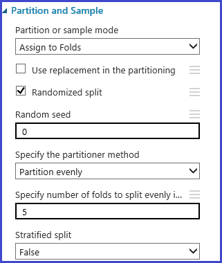
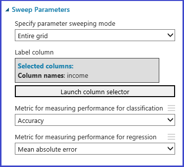

<properties
    pageTitle="Escolha os parâmetros para otimizar suas algoritmos de aprendizado de máquina do Azure | Microsoft Azure"
    description="Explica como escolher o parâmetro ideal definida para um algoritmo de aprendizado de máquina do Azure."
    services="machine-learning"
    documentationCenter=""
    authors="bradsev"
    manager="jhubbard"
    editor="cgronlun"/>

<tags
    ms.service="machine-learning"
    ms.workload="data-services"
    ms.tgt_pltfrm="na"
    ms.devlang="na"
    ms.topic="article"
    ms.date="09/12/2016"
    ms.author="bradsev" />

# Escolha os parâmetros para otimizar suas algoritmos no aprendizado de máquina do Windows Azure

Este tópico descreve como escolher o direito hyperparameter definido para um algoritmo de aprendizado de máquina do Azure. A maioria dos algoritmos de aprendizado de máquina tem parâmetros definidos. Quando você treinar um modelo, você precisará fornecer valores para esses parâmetros. Os parâmetros do modelo que você escolher depende a eficácia do modelo treinado. O processo de localização o melhor conjunto de parâmetros é conhecido como *seleção de modelo*.

[AZURE.INCLUDE [machine-learning-free-trial](../../includes/machine-learning-free-trial.md)]

Há várias maneiras para seleção do modelo. No aprendizado de máquina, validação cruzada é um dos métodos mais amplamente usados para seleção de modelo e é o mecanismo de seleção de modelo padrão no aprendizado de máquina do Azure. Porque o aprendizado de máquina do Azure suporta R e Python, você sempre pode implementar seus próprios mecanismos de seleção de modelo usando R ou Python.

Há quatro etapas no processo de localizando o parâmetro definido recomendado:

1.  **Define o espaço de parâmetro**: para o algoritmo, primeiro decida os valores de parâmetro exato você querer considerar.
2.  **Configurações de definir a validação de cruz**: decida como escolher entre-validação dobras para o conjunto de dados.
3.  **Definir a métrica**: decida qual métrica a ser usado para determinar o melhor conjunto de parâmetros, como a precisão, média de raiz quadrada erro, precision, cancelamento ou pontuação de f.
4.  **Treinar, avalie e compare**: cada combinação exclusiva de valores de parâmetro, validação cruzada é realizada pelo e com base na métrica de erro que você define. Após a avaliação e comparação, você pode escolher o modelo de melhor desempenho.

A imagem a seguir ilustra mostra como isso pode ser obtido no aprendizado de máquina do Azure.

## Definir o espaço do parâmetro
Você pode definir o parâmetro definido na etapa de inicialização de modelo. Painel de parâmetro de todos os algoritmos de aprendizado de máquina possui dois modos de instrutor: *Único parâmetro* e o *Intervalo de parâmetro*. Escolha o modo de intervalo do parâmetro. No modo de intervalo de parâmetro, você pode inserir vários valores para cada parâmetro. Você pode inserir valores separados por vírgulas na caixa de texto.

 Como alternativa, é possível definir os pontos máximo e mínimos da grade e o número total de pontos a serem gerados com o **Construtor de intervalo de uso**. Por padrão, os valores de parâmetro são gerados em uma escala linear. Mas se **Logarítmica** está selecionada, os valores são gerados na escala de log (ou seja, a proporção entre os pontos adjacentes é constante em vez de seu diferença). Para os parâmetros de inteiro, você pode definir um intervalo usando um hífen. Por exemplo, "1-10" significa que todos os números inteiros entre 1 e 10 (ambos incluídos) formam o conjunto de parâmetro. Também há suporte para o modo misto. Por exemplo, o parâmetro definido "1-10, 20, 50" incluiria inteiros 1-10, 20 e 50.

## Definir validação cruzada dobras
O [exemplo e partição] [ partition-and-sample] módulo pode ser usado para atribuir aleatoriamente dobras aos dados. Na seguinte configuração de amostra para o módulo, definimos cinco dobras e atribuímos aleatoriamente um número de dobra para as instâncias de amostra.

## Definir a métrica
O [Hyperparameters ajuste de modelo] [ tune-model-hyperparameters] módulo fornece suporte para empiricamente escolhendo o melhor conjunto de parâmetros para um determinado algoritmo e o conjunto de dados. Além de outras informações do modelo, o painel **Propriedades** deste módulo de treinamento referente inclui a métrica para determinar o melhor conjunto de parâmetro. Ele tem duas caixas de listagem de lista suspensa diferentes de algoritmos de regressão e classificação, respectivamente. Se o algoritmo em questão for um algoritmo de classificação, a métrica de regressão é ignorada e vice-versa. Neste exemplo específico, a métrica é **precisão**.   

## Treinar, avalie e compare  
O mesmo [Ajustar modelo Hyperparameters] [ tune-model-hyperparameters] módulo treina todos os modelos que correspondem ao conjunto de parâmetros, avalia várias métricas e, em seguida, cria o modelo perfeito treinado com base na métrica você escolher. Este módulo tem duas entradas obrigatórias:

* O estudante não treinado
* O conjunto de dados

O módulo também tem um conjunto de dados opcional de entrada. Conecte-se o conjunto de dados com informações de dobra à entrada obrigatória do conjunto de dados. Se o conjunto de dados não for atribuído a qualquer informação dobra, uma validação cruzada 10 vezes é executada automaticamente por padrão. Se a atribuição de dobra não é feita e um dataset de validação é fornecido através da porta dataset opcional, um modo de treinar-testar for escolhido, e o primeiro conjunto de dados é usado para treinar o modelo para cada combinação do parâmetro.

O modelo é avaliado em que o conjunto de dados de validação. A porta de saída à esquerda do módulo mostra métricas diferentes como funções dos valores de parâmetro. A porta de saída direita oferece o modelo treinado que corresponde ao modelo de melhor desempenho de acordo com a métrica escolhida (**precisão** neste caso).  

Você pode ver os parâmetros exatos escolhidos pelo visualizando a porta de saída à direita. Esse modelo pode ser usado em um conjunto de teste de pontuação ou em um serviço web operacionalizada depois de salvar como um modelo treinado.

<!-- Module References -->
[partition-and-sample]: https://msdn.microsoft.com/library/azure/a8726e34-1b3e-4515-b59a-3e4a475654b8/
[tune-model-hyperparameters]: https://msdn.microsoft.com/library/azure/038d91b6-c2f2-42a1-9215-1f2c20ed1b40/
