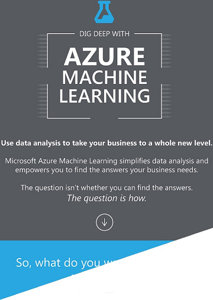

<properties
    pageTitle="Infographic: Noções básicas de aprendizagem - exemplos de algoritmo de máquina | Microsoft Azure"
    description="Obter uma fáceis de entender-visão geral das noções básicas de aprendizado de máquina inclui exemplos de algoritmo. O infographic para download aborda a maioria das perguntas de aprendizado de máquina."
    keywords="Noções básicas de aprendizado de máquina, exemplos de algoritmo, máquina aprendizado para iniciantes, perguntas de aprendizado de máquina, algoritmos populares, algoritmo infographic"
    services="machine-learning"
    documentationCenter=""
    authors="garyericson"
    manager="jhubbard"
    editor="cgronlun"/>

<tags
    ms.service="machine-learning"
    ms.workload="data-services"
    ms.tgt_pltfrm="na"
    ms.devlang="na"
    ms.topic="article"
    ms.date="08/19/2016"
    ms.author="garye" />

# Infographic para download: Noções básicas com exemplos de algoritmo de aprendizado de máquina

Baixe esta visão geral de fácil compreensão infographic das noções básicas de aprendizado de máquina. Saiba mais sobre os algoritmos populares usados para responder perguntas de aprendizado de máquina comuns. Exemplos de algoritmo ajudam o Iniciante de aprendizado de máquina entender quais algoritmos para uso e que elas são usadas.

## Algoritmos populares no Studio de aprendizado de máquina

[Studio de aprendizado de máquina do Azure](https://studio.azureml.net/) vem com uma biblioteca grande de algoritmos para análise de previsão. A infographic mostra populares famílias de algoritmos: **regressão**, **detecção de anomalias**, **agrupamento**e **classificação**.

[Galeria de inteligência de Cortana](https://gallery.cortanaintelligence.com/) mostra como esses algoritmos podem ser aplicados em muitas soluções do mundo real. Siga links na infographic para ver exemplos de trabalho.

## Baixe o infographic com exemplos de algoritmo

**[Download: Infographic de Noções básicas de aprendizado de máquina com links para exemplos de algoritmo (PDF)](http://download.microsoft.com/download/0/5/A/05AE6B94-E688-403E-90A5-6035DBE9EEC5/machine-learning-basics-infographic-with-algorithm-examples.pdf)**

## Mais ajuda com algoritmos para iniciantes e usuários avançados

* Para uma discussão mais aprofundada dos diferentes tipos de algoritmos de aprendizado de máquina, como eles são usados e como escolher à direita, uma para sua solução, consulte [como escolher algoritmos para aprendizado de máquina do Microsoft Azure](machine-learning-algorithm-choice.md).
* Para obter uma lista por categoria de todos os algoritmos de aprendizado de máquina disponíveis no Studio de aprendizado de máquina, consulte [Modelo inicializar] [ initialize-model] no algoritmo de Studio de aprendizado de máquina e ajudar a módulo.
* Para obter uma lista completa de algoritmos e módulos no Studio de aprendizado de máquina, consulte [lista de A-Z de módulos Studio de aprendizado de máquina] [ a-z-list] na Ajuda de módulo e algoritmo de Studio de aprendizado de máquina.
* Para baixar e imprimir um diagrama que oferece uma visão geral dos recursos do Studio de aprendizado de máquina, consulte o [diagrama de visão geral dos recursos do Azure Studio de aprendizado de máquina](machine-learning-studio-overview-diagram.md).

[AZURE.INCLUDE [machine-learning-free-trial](../../includes/machine-learning-free-trial.md)]

<!-- Module References -->
[a-z-list]: https://msdn.microsoft.com/library/azure/dn906033.aspx
[initialize-model]: https://msdn.microsoft.com/library/azure/0c67013c-bfbc-428b-87f3-f552d8dd41f6/
[k-means-clustering]: https://msdn.microsoft.com/library/azure/5049a09b-bd90-4c4e-9b46-7c87e3a36810/
[one-vs-all-multiclass]: https://msdn.microsoft.com/library/azure/7191efae-b4b1-4d03-a6f8-7205f87be664/
