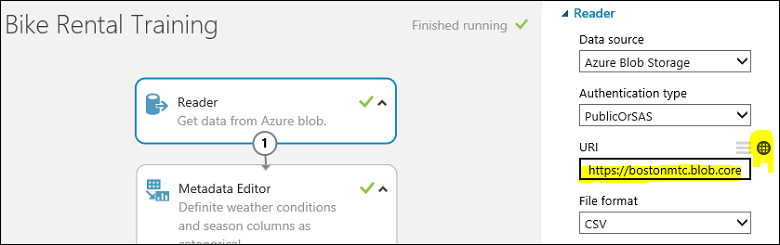
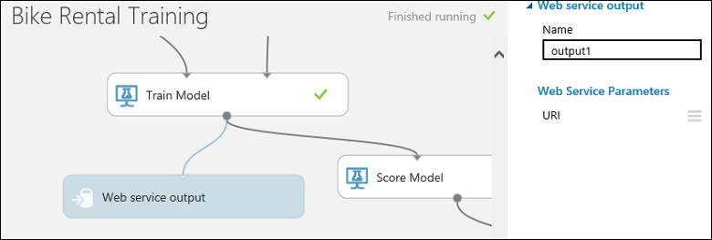

<properties
pageTitle="Criar vários modelos a partir de um experimento | Microsoft Azure"
description="Use o PowerShell para criar pontos de extremidade do serviço de vários modelos de aprendizado de máquina e web com o mesmo algoritmo mas treinamento diferentes conjuntos de dados."
services="machine-learning"
documentationCenter=""
authors="hning86"
manager="jhubbard"
editor="cgronlun"/>

<tags
ms.service="machine-learning"
ms.workload="data-services"
ms.tgt_pltfrm="na"
ms.devlang="na"
ms.topic="article"
ms.date="10/03/2016"
ms.author="garye;haining"/>

# Criar muitos modelos de aprendizado de máquina e web pontos de extremidade do serviço a partir de um experimento usando o PowerShell

Aqui está um problema comum de aprendizado de máquina: você deseja criar muitos modelos que tem o mesmo fluxo de trabalho de treinamento e usam o mesmo algoritmo, mas tem treinamento diferentes conjuntos de dados como entrada. Este artigo mostra como fazer isso em escala no Studio de aprendizado de máquina Azure usando apenas um único experimento.

Por exemplo, digamos que você possui um negócio de franquia de locação de bicicleta global. Você deseja criar um modelo de regressão para prever a demanda de locação com base em dados históricos. Você tem 1.000 locais de locação em todo o mundo e você coletadas um conjunto de dados para cada local que inclua recursos importantes, como data, hora, clima e tráfego que são específicos para cada local.

Você pode treinar seu modelo de uma vez usando uma versão mesclada de todos os conjuntos de dados em todos os locais. Mas porque cada um dos seus locais tem um ambiente exclusivo, uma melhor abordagem seria treinar seu modelo de regressão separadamente usando o conjunto de dados para cada local. Dessa maneira, cada modelo de treinamento pode levar em consideração os tamanhos de armazenamento diferente, volume, geografia, população, ambiente de tráfego de bicicleta amigável, *etc*.

Isso pode ser a melhor abordagem, mas você não deseja criar 1.000 experiências de treinamento em aprendizado de máquina do Azure com cada um representa um local exclusivo. Além de ser uma tarefa impressionante, também é parece bastante ineficaz, já que cada experimento teria todos os mesmos componentes, exceto para o conjunto de dados de treinamento.

Felizmente, podemos pode fazer isso usando a [API de treinamento de aprendizado de máquina do Azure](machine-learning-retrain-models-programmatically.md) e automatizar a tarefa com o [Azure PowerShell de aprendizado de máquina](machine-learning-powershell-module.md).

> [AZURE.NOTE] Para fazer com que o nosso exemplo executado com mais rapidez, podemos vai reduzir o número de localizações de 1.000 para 10. Mas o mesmo princípios e procedimentos se aplicam a 1.000 locais. A única diferença é que se você quiser treinar de 1.000 conjuntos de dados que você provavelmente desejará pensar executando os seguintes scripts do PowerShell em paralelo. Como fazer isso está além do escopo deste artigo, mas você pode encontrar exemplos do PowerShell vários threads na Internet.  

## Configurar a experiência de treinamento

Vamos usar um exemplo [experimentar de treinamento](https://gallery.cortanaintelligence.com/Experiment/Bike-Rental-Training-Experiment-1) que já criamos na [Galeria de inteligência de Cortana](http://gallery.cortanaintelligence.com). Abra esse experimento no seu espaço de trabalho do [Azure Studio de aprendizado de máquina](https://studio.azureml.net) .

>[AZURE.NOTE] Para acompanhar junto com este exemplo, convém usar um espaço de trabalho padrão em vez de um espaço de trabalho gratuito. Podemos criará um ponto de extremidade para cada cliente - para um total de 10 pontos de extremidade - e que exigem um espaço de trabalho padrão como um espaço de trabalho gratuito é limitado a 3 pontos de extremidade. Se você tiver apenas um espaço de trabalho gratuito, basta modificar os scripts a seguir para permitir apenas 3 locais.

O experimento usa um módulo de **Importar dados** para importar o conjunto de dados de treinamento *customer001.csv* de uma conta de armazenamento do Azure. Vamos supor que temos coletadas conjuntos de dados de treinamento de todos os locais de locação de bicicleta e os armazenado no mesmo local de armazenamento de blob com nomes de arquivo que varia de *rentalloc001.csv* a *rentalloc10.csv*.

Observe que um módulo de **Saída de serviço Web** foi adicionado ao **Modelo de trem** módulo.
Quando esse experimento for implantado como um serviço da web, o ponto de extremidade associado que saída retornará o modelo de treinamento no formato de um arquivo de .ilearner.

Observe também que podemos configurar um parâmetro de serviço web para a URL que usa o módulo de **Importar dados** . Isso nos permite usar o parâmetro para especificar conjuntos de dados de treinamento individual para treinar o modelo para cada local.
Existem outras maneiras de que nós poderia ter feito isso, como usando uma consulta SQL com um parâmetro de serviço web para obter dados de um banco de dados do SQL Azure ou simplesmente usando um módulo de **Entrada de serviço da Web** para passar em um conjunto de dados para o serviço da web.

Agora, vamos executar esse experimento treinamento usando o valor de padrão *rental001.csv* como o conjunto de dados de treinamento. Se você exibir a saída do módulo **avaliar** (clique em saída e selecione **Visualizar**), você pode ver podemos obter um desempenho razoável de *AUC* = 0.91. Neste ponto, estamos prontos para implantar um serviço web fora esse experimento de treinamento.

## Implantar o treinamento e serviços da web de pontuação

Para implantar o serviço da web de treinamento, clique no botão **Configurar o serviço Web** abaixo da tela de experimento e selecione **Implantar o serviço da Web**. Chamar este serviço da web "" treinamento de locação de bicicleta".

Agora, precisamos implantar o serviço web pontuação.
Para fazer isso, possamos clique em **Configurar o serviço Web** abaixo da tela e selecione **Previsão serviço da Web**. Isso cria um experimento pontuação.
Que precisaremos alguns ajustes secundária para torná-lo a trabalhar como um serviço da web, como remover a coluna rótulo "cnt" de dados de entrada e limitar a saída para somente a id de instância e o correspondente previstos valor.

Para poupar que funcionam, você pode simplesmente abrir o [experimento previsão](https://gallery.cortanaintelligence.com/Experiment/Bike-Rental-Predicative-Experiment-1) na Galeria já foi preparado.

Para implantar o serviço da web, execute o experimento previsão, clique no botão de **Implantar o serviço da Web** abaixo da tela. Nomeie o serviço web pontuação "Pontuação de locação de bicicleta" ".

## Criar 10 pontos de extremidade do serviço do web idênticos com PowerShell

Este serviço web vem com um ponto de extremidade padrão. Mas não estamos interessados como o ponto de extremidade padrão desde que ela não pode ser atualizada. O que precisamos fazer é criar 10 pontos de extremidade adicionais, uma para cada local. Faremos isso com o PowerShell.

Primeiro, vamos configurar nosso ambiente do PowerShell:

    Import-Module .\AzureMLPS.dll
    # Assume the default configuration file exists and is properly set to point to the valid Workspace.
    $scoringSvc = Get-AmlWebService | where Name -eq 'Bike Rental Scoring'
    $trainingSvc = Get-AmlWebService | where Name -eq 'Bike Rental Training'

Em seguida, execute o seguinte comando do PowerShell:

    # Create 10 endpoints on the scoring web service.
    For ($i = 1; $i -le 10; $i++){
        $seq = $i.ToString().PadLeft(3, '0');
        $endpointName = 'rentalloc' + $seq;
        Write-Host ('adding endpoint ' + $endpointName + '...')
        Add-AmlWebServiceEndpoint -WebServiceId $scoringSvc.Id -EndpointName $endpointName -Description $endpointName     
    }

Agora, nós criamos 10 pontos de extremidade e todos eles contêm o mesmo modelo de treinamento treinado em *customer001.csv*. Você pode exibi-los no Portal de gerenciamento do Azure.

## Atualizar os pontos de extremidade para usar conjuntos de dados de treinamento separados usando o PowerShell

A próxima etapa é atualizar os pontos de extremidade com modelos exclusivamente treinados em dados individuais de cada cliente. Mas, primeiro precisamos produzir esses modelos do serviço da web de **Treinamento de locação de bicicleta** . Vamos voltar para o serviço da web de **Treinamento de locação de bicicleta** . Precisamos chamar seu ponto de extremidade BES 10 vezes com 10 conjuntos de dados de treinamento diferentes para produzir 10 modelos diferentes. Usaremos o cmdlet do PowerShell **InovkeAmlWebServiceBESEndpoint** para fazer isso.

Você também precisará fornecer credenciais para sua conta de armazenamento de blob em `$configContent`, ou seja, os campos `AccountName`, `AccountKey` e `RelativeLocation`. O `AccountName` pode ser um dos seus nomes de conta, como visto no **Portal de gerenciamento de Azure clássico** (guia de*armazenamento* ). Quando você clica em uma conta de armazenamento, seu `AccountKey` podem ser encontradas pressionando o botão **Gerenciar teclas de acesso** na parte inferior e a cópia da *Chave primária de acesso*. O `RelativeLocation` é o caminho relativo seu armazenamento onde um novo modelo será armazenado. Por exemplo, o caminho `hai/retrain/bike_rental/` no script abaixo pontos para um contêiner chamado `hai`, e `/retrain/bike_rental/` são subpastas. Atualmente, não é possível criar subpastas por meio do portal da interface do usuário, mas há [Vários gerenciadores de armazenamento do Azure](../storage/storage-explorers.md) que permitem que você para fazê-lo. É recomendável que você crie um novo contêiner em seu armazenamento para armazenar os novos modelos de treinamento (.ilearner arquivos) da seguinte maneira: em sua página de armazenamento, clique no botão **Adicionar** na parte inferior e nomeie- `retrain`. Em resumo, as alterações necessárias para o script abaixo pertencem aos `AccountName`, `AccountKey` e `RelativeLocation` (:`"retrain/model' + $seq + '.ilearner"`).

    # Invoke the retraining API 10 times
    # This is the default (and the only) endpoint on the training web service
    $trainingSvcEp = (Get-AmlWebServiceEndpoint -WebServiceId $trainingSvc.Id)[0];
    $submitJobRequestUrl = $trainingSvcEp.ApiLocation + '/jobs?api-version=2.0';
    $apiKey = $trainingSvcEp.PrimaryKey;
    For ($i = 1; $i -le 10; $i++){
        $seq = $i.ToString().PadLeft(3, '0');
        $inputFileName = 'https://bostonmtc.blob.core.windows.net/hai/retrain/bike_rental/BikeRental' + $seq + '.csv';
        $configContent = '{ "GlobalParameters": { "URI": "' + $inputFileName + '" }, "Outputs": { "output1": { "ConnectionString": "DefaultEndpointsProtocol=https;AccountName=<myaccount>;AccountKey=<mykey>", "RelativeLocation": "hai/retrain/bike_rental/model' + $seq + '.ilearner" } } }';
        Write-Host ('training regression model on ' + $inputFileName + ' for rental location ' + $seq + '...');
        Invoke-AmlWebServiceBESEndpoint -JobConfigString $configContent -SubmitJobRequestUrl $submitJobRequestUrl -ApiKey $apiKey
    }

>[AZURE.NOTE] O ponto de extremidade BES é o único modo com suporte para esta operação. RR não pode ser usados para produzir modelos de treinamento.

Como você pode ver acima, em vez de construir 10 BES trabalho configuração json arquivos diferentes, criamos dinamicamente a cadeia de caracteres de config em vez disso e feed-lo para o parâmetro *jobConfigString* do cmdlet **InvokeAmlWebServceBESEndpoint** , desde que não é realmente necessário manter uma cópia no disco.

Se tudo correr bem, após alguns instantes você verá 10 arquivos .ilearner, de *model001.ilearner* para *model010.ilearner*, em sua conta de armazenamento do Azure. Agora podemos está prontos para atualizar nossos 10 pontuação web serviço pontos de extremidade com esses modelos usando o cmdlet do PowerShell **Patch AmlWebServiceEndpoint** . Lembre-se novamente de que estamos só pode corrigir os pontos de extremidade não padrão que programaticamente criamos anteriormente.

    # Patch the 10 endpoints with respective .ilearner models
    $baseLoc = 'http://bostonmtc.blob.core.windows.net/'
    $sasToken = '<my_blob_sas_token>'
    For ($i = 1; $i -le 10; $i++){
        $seq = $i.ToString().PadLeft(3, '0');
        $endpointName = 'rentalloc' + $seq;
        $relativeLoc = 'hai/retrain/bike_rental/model' + $seq + '.ilearner';
        Write-Host ('Patching endpoint ' + $endpointName + '...');
        Patch-AmlWebServiceEndpoint -WebServiceId $scoringSvc.Id -EndpointName $endpointName -ResourceName 'Bike Rental [trained model]' -BaseLocation $baseLoc -RelativeLocation $relativeLoc -SasBlobToken $sasToken
    }

Isso deve executar rapidamente. Quando termina a execução, será com êxito criamos 10 web previsão serviço pontos de extremidade, cada um contendo um modelo de treinamento exclusivamente treinado no conjunto de dados específico para um local de locação, tudo a partir de um experimento treinamento único. Para verificar isso, você pode tentar chamar esses pontos de extremidade usando o cmdlet **InvokeAmlWebServiceRRSEndpoint** , fornecendo-los com os mesmos dados de entrada e você deve esperar ver resultados de previsão diferentes, desde que os modelos são treinamento com conjuntos de treinamento diferentes.

## Script PowerShell completo

Aqui está a listagem de código-fonte completo:

    Import-Module .\AzureMLPS.dll
    # Assume the default configuration file exists and properly set to point to the valid workspace.
    $scoringSvc = Get-AmlWebService | where Name -eq 'Bike Rental Scoring'
    $trainingSvc = Get-AmlWebService | where Name -eq 'Bike Rental Training'

    # Create 10 endpoints on the scoring web service
    For ($i = 1; $i -le 10; $i++){
        $seq = $i.ToString().PadLeft(3, '0');
        $endpointName = 'rentalloc' + $seq;
        Write-Host ('adding endpoint ' + $endpontName + '...')
        Add-AmlWebServiceEndpoint -WebServiceId $scoringSvc.Id -EndpointName $endpointName -Description $endpointName     
    }

    # Invoke the retraining API 10 times to produce 10 regression models in .ilearner format
    $trainingSvcEp = (Get-AmlWebServiceEndpoint -WebServiceId $trainingSvc.Id)[0];
    $submitJobRequestUrl = $trainingSvcEp.ApiLocation + '/jobs?api-version=2.0';
    $apiKey = $trainingSvcEp.PrimaryKey;
    For ($i = 1; $i -le 10; $i++){
        $seq = $i.ToString().PadLeft(3, '0');
        $inputFileName = 'https://bostonmtc.blob.core.windows.net/hai/retrain/bike_rental/BikeRental' + $seq + '.csv';
        $configContent = '{ "GlobalParameters": { "URI": "' + $inputFileName + '" }, "Outputs": { "output1": { "ConnectionString": "DefaultEndpointsProtocol=https;AccountName=<myaccount>;AccountKey=<mykey>", "RelativeLocation": "hai/retrain/bike_rental/model' + $seq + '.ilearner" } } }';
        Write-Host ('training regression model on ' + $inputFileName + ' for rental location ' + $seq + '...');
        Invoke-AmlWebServiceBESEndpoint -JobConfigString $configContent -SubmitJobRequestUrl $submitJobRequestUrl -ApiKey $apiKey
    }

    # Patch the 10 endpoints with respective .ilearner models
    $baseLoc = 'http://bostonmtc.blob.core.windows.net/'
    $sasToken = '?test'
    For ($i = 1; $i -le 10; $i++){
        $seq = $i.ToString().PadLeft(3, '0');
        $endpointName = 'rentalloc' + $seq;
        $relativeLoc = 'hai/retrain/bike_rental/model' + $seq + '.ilearner';
        Write-Host ('Patching endpoint ' + $endpointName + '...');
        Patch-AmlWebServiceEndpoint -WebServiceId $scoringSvc.Id -EndpointName $endpointName -ResourceName 'Bike Rental [trained model]' -BaseLocation $baseLoc -RelativeLocation $relativeLoc -SasBlobToken $sasToken
    }
