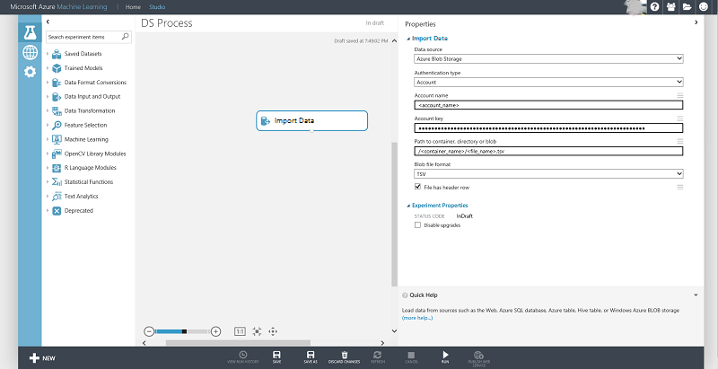

<properties
    pageTitle="Criar recursos para dados de armazenamento de blob do Microsoft Azure usando Panda | Microsoft Azure"
    description="Como criar recursos para dados armazenados no contêiner de blob do Microsoft Azure com o pacote de Panda Python."
    services="machine-learning,storage"
    documentationCenter=""
    authors="bradsev"
    manager="jhubbard"
    editor="cgronlun" />

<tags
    ms.service="machine-learning"
    ms.workload="data-services"
    ms.tgt_pltfrm="na"
    ms.devlang="na"
    ms.topic="article"
    ms.date="09/19/2016"
    ms.author="bradsev;garye" />

#Criar recursos para dados de armazenamento de blob do Microsoft Azure usando Panda

Este documento mostra como criar recursos para dados armazenados no contêiner de blob do Microsoft Azure usando o pacote de [Pandas](http://pandas.pydata.org/) Python. Depois de estrutura de tópicos como carregar os dados em um quadro de dados Panda, ele mostra como gerar categóricos recursos usando scripts Python com valores de indicador e binning recursos.

[AZURE.INCLUDE [cap-create-features-data-selector](../../includes/cap-create-features-selector.md)]Este **menu** fornece links para tópicos que descrevem como criar recursos para os dados em vários ambientes. Esta tarefa é uma etapa do [Processo de ciência de dados da equipe (TDSP)](https://azure.microsoft.com/documentation/learning-paths/cortana-analytics-process/).

## Pré-requisitos

Este artigo pressupõe que você tiver criado uma conta de armazenamento de blob do Microsoft Azure e armazenou seus dados lá. Se precisar de instruções para configurar uma conta, consulte [criar uma conta de armazenamento do Azure](../storage/storage-create-storage-account.md#create-a-storage-account)

## Carregar os dados em um quadro de dados Pandas
Para explorar e manipular um conjunto de dados, ela deverá ser baixada da origem blob para um arquivo local que, em seguida, pode ser carregado em um quadro de dados Pandas. Aqui estão as etapas a seguir para este procedimento:

1. Baixar dados do Azure blob com o seguinte código de Python de amostra usando o serviço blob. Substitua a variável no código abaixo com valores específicos:

        from azure.storage.blob import BlobService
        import tables

        STORAGEACCOUNTNAME= <storage_account_name>
        STORAGEACCOUNTKEY= <storage_account_key>
        LOCALFILENAME= <local_file_name>        
        CONTAINERNAME= <container_name>
        BLOBNAME= <blob_name>

        #download from blob
        t1=time.time()
        blob_service=BlobService(account_name=STORAGEACCOUNTNAME,account_key=STORAGEACCOUNTKEY)
        blob_service.get_blob_to_path(CONTAINERNAME,BLOBNAME,LOCALFILENAME)
        t2=time.time()
        print(("It takes %s seconds to download "+blobname) % (t2 - t1))

2. Ler os dados em um quadro de dados Pandas do arquivo baixado.

        #LOCALFILE is the file path
        dataframe_blobdata = pd.read_csv(LOCALFILE)

Agora você está pronto para explorar os dados e gerar recursos este conjunto de dados.

##Geração de recurso

As duas próximas seções mostram como gerar categóricos com valores de indicador e recursos binning usando scripts Python.

###Valor de indicador baseado geração de recurso

Recursos de categorias podem ser criados da seguinte maneira:

1. Inspecione a distribuição da coluna categorias:

        dataframe_blobdata['<categorical_column>'].value_counts()

2. Gerar valores de indicador para cada um dos valores da coluna

        #generate the indicator column
        dataframe_blobdata_identity = pd.get_dummies(dataframe_blobdata['<categorical_column>'], prefix='<categorical_column>_identity')

3. Ingressar a coluna de indicador com o quadro de dados original

            #Join the dummy variables back to the original data frame
            dataframe_blobdata_with_identity = dataframe_blobdata.join(dataframe_blobdata_identity)

4. Remova a variável original:

        #Remove the original column rate_code in df1_with_dummy
        dataframe_blobdata_with_identity.drop('<categorical_column>', axis=1, inplace=True)

###Geração de recurso binning

Para gerar recursos binned, podemos continuar da seguinte maneira:

1. Adicionar uma sequência de colunas para associar uma coluna numérica

        bins = [0, 1, 2, 4, 10, 40]
        dataframe_blobdata_bin_id = pd.cut(dataframe_blobdata['<numeric_column>'], bins)

2. Converter binning para uma sequência de variáveis Boolianas

        dataframe_blobdata_bin_bool = pd.get_dummies(dataframe_blobdata_bin_id, prefix='<numeric_column>')

3. Por fim, ingresse as variáveis fictícios novamente o quadro de dados original

        dataframe_blobdata_with_bin_bool = dataframe_blobdata.join(dataframe_blobdata_bin_bool)

##Gravar dados de volta ao Azure blob e consumindo no aprendizado de máquina do Azure

Após você ter explorados os dados e criado os recursos necessários, você pode carregar os dados (amostra ou featurized) para um Azure blob e consumi-lo no aprendizado de máquina do Azure usando as seguintes etapas: Observe que recursos adicionais podem ser criados no Azure máquina aprendizagem Studio também.
1. Gravar o quadro de dados no arquivo local

        dataframe.to_csv(os.path.join(os.getcwd(),LOCALFILENAME), sep='\t', encoding='utf-8', index=False)

2. Carregue os dados BLOB do Microsoft Azure da seguinte maneira:

        from azure.storage.blob import BlobService
        import tables

        STORAGEACCOUNTNAME= <storage_account_name>
        LOCALFILENAME= <local_file_name>
        STORAGEACCOUNTKEY= <storage_account_key>
        CONTAINERNAME= <container_name>
        BLOBNAME= <blob_name>

        output_blob_service=BlobService(account_name=STORAGEACCOUNTNAME,account_key=STORAGEACCOUNTKEY)    
        localfileprocessed = os.path.join(os.getcwd(),LOCALFILENAME) #assuming file is in current working directory

        try:

        #perform upload
        output_blob_service.put_block_blob_from_path(CONTAINERNAME,BLOBNAME,localfileprocessed)

        except:         
            print ("Something went wrong with uploading blob:"+BLOBNAME)

3. Agora os dados podem ser lidos do blob usando o módulo de aprendizado de máquina do Azure [Importar dados](https://msdn.microsoft.com/library/azure/4e1b0fe6-aded-4b3f-a36f-39b8862b9004/) , conforme mostrado na tela abaixo:

