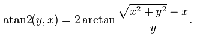

<properties
    pageTitle="Criar recursos para os dados em um cluster de Hadoop usando consultas de seção | Microsoft Azure"
    description="Exemplos de consultas de seção que geram recursos nos dados armazenados em um cluster de Azure HDInsight Hadoop."
    services="machine-learning"
    documentationCenter=""
    authors="bradsev"
    manager="jhubbard"
    editor="cgronlun"  />

<tags
    ms.service="machine-learning"
    ms.workload="data-services"
    ms.tgt_pltfrm="na"
    ms.devlang="na"
    ms.topic="article"
    ms.date="09/19/2016"
    ms.author="hangzh;bradsev" />

#Criar recursos para os dados em um cluster de Hadoop usando consultas de seção

Este documento mostra como criar recursos para dados armazenados em um cluster de Azure HDInsight Hadoop usando consultas de seção. Essas consultas de seção usam incorporado seção funções definidas pelo usuário (UDFs), os scripts para os quais são fornecidos.

As operações necessárias para criar os recursos podem ser intenso de memória. O desempenho das consultas de seção se torna mais crítico nesses casos e pode ser aprimorado ajustando determinados parâmetros. O ajuste desses parâmetros é discutido na seção final.

Exemplos de consultas que são apresentadas são específicos para os [Dados de viagem de táxi NYC](http://chriswhong.com/open-data/foil_nyc_taxi/) cenários também são fornecidos no [repositório de Github](https://github.com/Azure/Azure-MachineLearning-DataScience/tree/master/Misc/DataScienceProcess/DataScienceScripts). Essas consultas já tem esquema de dados especificada e estiver prontas para ser enviado para executar. Na seção final, parâmetros que os usuários podem ajustar para que o desempenho das consultas de seção pode ser melhorado também são discutidos.

[AZURE.INCLUDE [cap-create-features-data-selector](../../includes/cap-create-features-selector.md)]Este **menu** fornece links para tópicos que descrevem como criar recursos para os dados em vários ambientes. Esta tarefa é uma etapa do [Processo de ciência de dados da equipe (TDSP)](https://azure.microsoft.com/documentation/learning-paths/cortana-analytics-process/).

## Pré-requisitos
Este artigo pressupõe que você tenha:

* Criar uma conta de armazenamento do Azure. Se precisar de instruções, consulte [criar uma conta de armazenamento do Azure](../storage/storage-create-storage-account.md#create-a-storage-account)
* Provisionado um cluster Hadoop personalizados com o serviço de HDInsight.  Se precisar de instruções, consulte [Personalizar o Azure HDInsight Hadoop Clusters para análise avançada](machine-learning-data-science-customize-hadoop-cluster.md).
* Os dados são carregados em tabelas de seção no Azure HDInsight Hadoop clusters. Se não tiver, siga [criar e carregar dados às tabelas de seção](machine-learning-data-science-move-hive-tables.md) para carregar dados em tabelas de seção primeiro.
* Acesso remoto habilitado ao cluster. Se precisar de instruções, consulte [acessar o nó de cabeça do Hadoop Cluster](machine-learning-data-science-customize-hadoop-cluster.md#headnode).

##Geração de recurso

Nesta seção, vários exemplos das maneiras nas quais recursos podem ser gerando usando consultas de seção são descritos. Quando tiver gerado recursos adicionais, você pode adicioná-los como colunas à tabela de dados existente ou criar uma nova tabela com os recursos adicionais e a chave primária, que poderá então ser associado com a tabela original. Aqui estão os exemplos apresentados:

1. [Frequência com base em geração de recurso](#hive-frequencyfeature)
2. [Riscos categórica variáveis em classificação binária](#hive-riskfeature)
3. [Extrair os recursos de Datetime Field](#hive-datefeatures)
4. [Extrair os recursos de campo de texto](#hive-textfeatures)
5. [Calcular a distância entre coordenadas GPS](#hive-gpsdistance)

###Frequência com base em geração de recurso

Muitas vezes é útil calcular as frequências dos níveis de uma variável categórica ou as frequências de certas combinações de níveis de diversas variáveis de categorias. Usuários podem usar o seguinte script para calcular esses frequências:

        select
            a.<column_name1>, a.<column_name2>, a.sub_count/sum(a.sub_count) over () as frequency
        from
        (
            select
                <column_name1>,<column_name2>, count(*) as sub_count
            from <databasename>.<tablename> group by <column_name1>, <column_name2>
        )a
        order by frequency desc;

###Riscos categórica variáveis em classificação binária

Em classificação de binária, precisamos converter variáveis categóricos não numérico em recursos numéricos quando os modelos sendo usados somente se recursos numéricos. Isso é feito substituindo cada nível não numérico por um risco numérico. Nesta seção, vamos mostrar algumas consultas seção genéricas que calculam os valores de risco (chances de log) de uma variável categórica.

        set smooth_param1=1;
        set smooth_param2=20;
        select
            <column_name1>,<column_name2>,
            ln((sum_target+${hiveconf:smooth_param1})/(record_count-sum_target+${hiveconf:smooth_param2}-${hiveconf:smooth_param1})) as risk
        from
            (
            select
                <column_nam1>, <column_name2>, sum(binary_target) as sum_target, sum(1) as record_count
            from
                (
                select
                    <column_name1>, <column_name2>, if(target_column>0,1,0) as binary_target
                from <databasename>.<tablename>
                )a
            group by <column_name1>, <column_name2>
            )b

Neste exemplo, variáveis `smooth_param1` e `smooth_param2` são definidas como suaves os valores de risco calculados a partir dos dados. Riscos tem um intervalo entre -Inf e Inf. Riscos > 0 indica que a probabilidade de que o destino é igual a 1 é maior que 0,5.

Após o risco de tabela é calculado, os usuários podem atribuir valores de risco a uma tabela unindo-lo com a tabela de risco. A seção consulta ingresso foi fornecida na seção anterior.

###Extrair os recursos de Datetime Fields

Seção vem com um conjunto de UDFs para o processamento de campos de datetime. Na seção, é o formato padrão de datetime ' AAAA-MM-dd 00:00:00 ' ('1970-01-01 12:21:32 ' por exemplo). Nesta seção, vamos mostrar exemplos que extrair o dia do mês, o mês de um campo de data e hora e outros exemplos que converter uma cadeia de caracteres de data e hora em um formato diferente em default formatar o formato padrão para uma cadeia de caracteres de datetime.

        select day(<datetime field>), month(<datetime field>)
        from <databasename>.<tablename>;

Esta seção consulta pressupõe que o *& #60; campo datetime >* está no formato datetime padrão.

Se não for um campo de data e hora no formato padrão, você precisa converter o campo datetime carimbo de hora do Unix primeiro e, em seguida, converter o carimbo de hora do Unix para uma cadeia de caracteres de datetime que esteja no formato padrão. Quando o datetime padrão é formato, os usuários podem aplicar datetime incorporado UDFs para extrair recursos.

        select from_unixtime(unix_timestamp(<datetime field>,'<pattern of the datetime field>'))
        from <databasename>.<tablename>;

Nessa consulta, se o *& #60; campo datetime >* possui o padrão como *26/03/2015 12:04:39*, o *' & #60; padrão do campo datetime >'* deve ser `'MM/dd/yyyy HH:mm:ss'`. Para testá-la, os usuários podem executar

        select from_unixtime(unix_timestamp('05/15/2015 09:32:10','MM/dd/yyyy HH:mm:ss'))
        from hivesampletable limit 1;

A *hivesampletable* nessa consulta vem pré-instalado em todos os clusters do Azure HDInsight Hadoop por padrão quando os clusters são provisionados.

###Extrair os recursos dos campos de texto

Quando a tabela de seção tem um campo de texto que contém uma cadeia de caracteres de palavras que são delimitados por espaços, a seguinte consulta extrai o comprimento da cadeia de caracteres e o número de palavras na cadeia.

        select length(<text field>) as str_len, size(split(<text field>,' ')) as word_num
        from <databasename>.<tablename>;

###Calcular a distância entre conjuntos de coordenadas GPS

A consulta fornecida nesta seção pode ser aplicada diretamente aos dados NYC táxi viagem. A finalidade dessa consulta é mostrar como aplicar um funções matemáticas inserido na seção para gerar recursos.

Os campos que são usados nessa consulta são as coordenadas GPS de retirada e redução locais, chamados *retirada\_longitude*, *retirada\_latitude*, *redução\_longitude*, e *redução\_latitude*. As consultas que calculam a distância direta entre as coordenadas retirada e redução são:

        set R=3959;
        set pi=radians(180);
        select pickup_longitude, pickup_latitude, dropoff_longitude, dropoff_latitude,
            ${hiveconf:R}*2*2*atan((1-sqrt(1-pow(sin((dropoff_latitude-pickup_latitude)
            *${hiveconf:pi}/180/2),2)-cos(pickup_latitude*${hiveconf:pi}/180)
            *cos(dropoff_latitude*${hiveconf:pi}/180)*pow(sin((dropoff_longitude-pickup_longitude)*${hiveconf:pi}/180/2),2)))
            /sqrt(pow(sin((dropoff_latitude-pickup_latitude)*${hiveconf:pi}/180/2),2)
            +cos(pickup_latitude*${hiveconf:pi}/180)*cos(dropoff_latitude*${hiveconf:pi}/180)*
            pow(sin((dropoff_longitude-pickup_longitude)*${hiveconf:pi}/180/2),2))) as direct_distance
        from nyctaxi.trip
        where pickup_longitude between -90 and 0
        and pickup_latitude between 30 and 90
        and dropoff_longitude between -90 and 0
        and dropoff_latitude between 30 and 90
        limit 10;

As equações matemáticas que calculam a distância entre duas coordenadas GPS podem ser encontradas no site de <a href="http://www.movable-type.co.uk/scripts/latlong.html" target="_blank">Scripts Movable Type</a> , criados por Peter Lapisu. Em seu Javascript, a função `toRad()` é apenas *lat_or_lon*pi/180*, que converte graus em radianos. Aqui, *lat_or_lon * é o latitude ou longitude. Como seção não fornece a função `atan2`, mas fornece a função `atan`, o `atan2` função é implementada por `atan` função na seção consulta acima usando a definição fornecida na <a href="http://en.wikipedia.org/wiki/Atan2" target="_blank">Wikipedia</a>.

Uma lista completa de seção UDFs incorporados podem ser encontradas na seção **Funções internas** do <a href="https://cwiki.apache.org/confluence/display/Hive/LanguageManual+UDF#LanguageManualUDF-MathematicalFunctions" target="_blank">wiki Apache seção</a>).  

## Tópicos avançados: ajuste seção parâmetros para melhorar a velocidade de consulta

As configurações de parâmetro padrão da seção cluster talvez não seja adequadas para as consultas de seção e os dados que as consultas são processamento. Nesta seção, vamos abordar alguns parâmetros que os usuários podem ajustar que melhorar o desempenho das consultas de seção. Os usuários precisam adicionar o parâmetro ajuste consultas antes das consultas de processamento de dados.

1. **Espaço de pilha Java**: envolvendo ingressando em grandes conjuntos de dados ou registros longos de processamento de consultas, **ficando sem espaço de pilha** é uma do erro comum. Isso pode ser ajustado definindo parâmetros *mapreduce.map.java.opts* e *mapreduce.task.io.sort.mb* para valores desejados. Aqui está um exemplo:

        set mapreduce.map.java.opts=-Xmx4096m;
        set mapreduce.task.io.sort.mb=-Xmx1024m;

    Este parâmetro aloca 4GB de memória para espaço de pilha de Java e também facilita a classificação mais eficiente por alocar mais memória para ele. É uma boa ideia brincar com essas alocações se houver qualquer trabalho erros de falha relacionados ao espaço de pilha.

2. **Tamanho do bloco de DFS** : este parâmetro define a menor unidade de dados que armazena o sistema de arquivos. Como exemplo, se o tamanho do bloco DFS é de 128MB, em seguida, todos os dados de tamanho menor e até 128MB será armazenado em um único bloco, enquanto dados maior que 128MB alocado blocos extras. Escolher um tamanho de bloco muito pequeno causa grandes custos gerais indiretos em Hadoop como o nó nome tem que processar muitas solicitações de mais para encontrar o bloco relevante relativas ao arquivo. Uma configuração recomendada quando relacionadas com gigabytes (ou maior) dados são:

        set dfs.block.size=128m;

3. **Otimizando ingressar operação na seção** : enquanto operações de junção no framework mapa/reduzir geralmente acontecem na fase reduzir, às vezes, ganhos enorme podem ser obtidos agendando junções na fase de mapa (também chamada de "mapjoins"). Para direcionar a seção para fazer isso, sempre que possível, podemos definir:

        set hive.auto.convert.join=true;

4. **Especifica o número de mapeadores seção** : Hadoop enquanto permite ao usuário definir o número de reducers, o número de mapeadores não costuma ser definida pelo usuário. Um truque que permite que algum grau de controle nesse número é escolher variáveis Hadoop, *mapred.min.split.size* e *mapred.max.split.size* como o tamanho de cada tarefa de mapa é determinado por:

        num_maps = max(mapred.min.split.size, min(mapred.max.split.size, dfs.block.size))

    Normalmente, o valor padrão de *mapred.min.split.size* é 0, que *mapred.max.split.size* **Long.MAX** e da *dfs.block.size* é 64 MB. Como podemos ver, dado o tamanho de dados, ajuste esses parâmetros por "configuração"-los nos permite ajustar o número de mapeadores usado.

5. Algumas outras mais **Opções avançadas** para otimizar o desempenho de seção são mencionadas abaixo. Esses permitem que você defina a memória alocada para mapear e reduzir as tarefas e podem ser úteis para ajustar o desempenho. Tenha em mente que o *mapreduce.reduce.memory.mb* não pode ser maior que o tamanho de memória física de cada nó trabalhador no cluster Hadoop.

        set mapreduce.map.memory.mb = 2048;
        set mapreduce.reduce.memory.mb=6144;
        set mapreduce.reduce.java.opts=-Xmx8192m;
        set mapred.reduce.tasks=128;
        set mapred.tasktracker.reduce.tasks.maximum=128;
