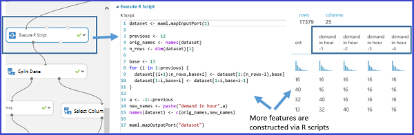

<properties
    pageTitle="Recurso de engenharia do processo de análise de Cortana | Microsoft Azure" 
    description="Explica os fins de engenharia do recurso e fornece exemplos de sua função no processo de aperfeiçoamento de dados de aprendizado de máquina."
    services="machine-learning"
    documentationCenter=""
    authors="bradsev"
    manager="jhubbard"
    editor="cgronlun"/>

<tags
    ms.service="machine-learning"
    ms.workload="data-services"
    ms.tgt_pltfrm="na"
    ms.devlang="na"
    ms.topic="article"
    ms.date="09/19/2016"
    ms.author="zhangya;bradsev" />

# Engenharia de recurso no processo de análise de Cortana 

Este tópico explica as finalidades de engenharia do recurso e fornece exemplos de sua função no processo de aperfeiçoamento de dados de aprendizado de máquina. Os exemplos usados para ilustrar esse processo são criados do Azure Studio de aprendizado de máquina. 

[AZURE.INCLUDE [cap-create-features-data-selector](../../includes/cap-create-features-selector.md)]

Este **menu** fornece links para tópicos que descrevem como criar recursos para os dados em vários ambientes. Esta tarefa é uma etapa do [Processo de ciência de dados da equipe (TDSP)](https://azure.microsoft.com/documentation/learning-paths/cortana-analytics-process/).

Engenharia tenta aumentar a potência de previsão da aprendizagem algoritmos criando recursos de dados brutos que ajuda a facilitar o processo de aprendizagem do recurso. A engenharia e a seleção de recursos é uma parte do TDSP descrita a [qual é o processo de ciência de dados de equipe?](data-science-process-overview.md) Engenharia de recurso e seleção são partes da etapa **desenvolver recursos** da TDSP. 

* **engenharia de recurso**: esse processo tentativas para criar recursos relevantes adicionais dos recursos de brutos existentes nos dados e para aumentar a potência previsão o algoritmo de aprendizado.

* **seleção de recursos**: esse processo seleciona o subconjunto principais recursos de dados originais em uma tentativa de reduzir a dimensionalidade do problema treinamento.

Normalmente **engenharia de recurso** é aplicada primeiro para gerar recursos adicionais e, em seguida, na etapa de **seleção de recursos** é feita para eliminar recursos sem importância, redundantes ou altamente correlacionados.

Os dados de treinamento usados no aprendizado de máquina muitas vezes podem ser melhorados por extração dos recursos a partir dos dados processados coletados. Um exemplo de um recurso de engenharia no contexto de aprender a classificar as imagens de caracteres manuscritas é a criação de um pouco de densidade mapa construído com os dados de distribuição de bit bruto. Este mapa pode ajudar a localizar as bordas dos caracteres com mais eficiência simplesmente usando a distribuição bruta diretamente.

[AZURE.INCLUDE [machine-learning-free-trial](../../includes/machine-learning-free-trial.md)]

## Criação de recursos dos seus dados - engenharia de recursos

Os dados de treinamento consistem em uma matriz composta de exemplos (registros ou observações armazenadas em linhas), cada um deles tem um conjunto de recursos (variáveis ou campos armazenados em colunas). Os recursos especificados no design experimental espera caracterizar os padrões nos dados. Embora muitos dos dados processados campos podem ser incluídos diretamente no conjunto de recurso selecionado usado para treinar um modelo, geralmente é o caso que recursos adicionais do (engenharia) precisam ser construído com os recursos dos dados processados para gerar um conjunto de dados de treinamento avançado.

Que tipo de recursos deve ser criado para aprimorar o dataset ao treinamento um modelo? Recursos de engenharia que aprimoram o treinamento fornecem informações que diferencia melhor os padrões nos dados. Esperamos que os novos recursos para fornecer informações adicionais que não são capturados claramente ou facilmente evidente no conjunto de recurso original ou existente. Mas esse processo é algo de uma arte. Decisões de som e produtivas geralmente exigem alguma experiência de domínio.

Ao iniciar com o aprendizado de máquina do Azure, é mais fácil de entender esse processo concretamente usando amostras fornecidas no Studio. Dois exemplos são apresentados aqui:

* Um exemplo de regressão [previsão do número de locações de bicicleta](http://gallery.cortanaintelligence.com/Experiment/Regression-Demand-estimation-4) em um experimento supervised onde os valores de destino são conhecidos
* Um exemplo de classificação de mineração de texto usando o [Recurso hash](https://msdn.microsoft.com/library/azure/c9a82660-2d9c-411d-8122-4d9e0b3ce92a/)

### Exemplo 1: Adicionar recursos Temporal para o modelo de regressão ###

Vamos usar o experimento "demanda previsão de bicicletas" no Azure Studio de aprendizado de máquina para demonstrar como a engenharia de recursos para uma tarefa de regressão. O objetivo desse experimento é prever a demanda por Bicicletas, ou seja, o número de locações de bicicleta dentro de uma determinada mês/dia/hora. O conjunto de dados "locação de bicicleta UCI dataset" é usado como dados de entrada brutos. Este dataset baseia-se em dados reais da empresa maiuscula Bikeshare que mantém uma rede de locação de bicicleta em Washington DC nos Estados Unidos. O dataset representa o número de locações de bicicleta dentro de uma hora específica de um dia nos anos 2011 e ano de 2012 e contém 17379 linhas e colunas de 17. O conjunto de recurso bruto contém condições de clima (umidade/temperatura/vento velocidade) e o tipo do dia (feriado/weekday). O campo prever é "cnt", uma contagem que representa os aluguéis de bicicleta dentro de uma hora específica e que varia varia de 1 a 977.

Com o objetivo de construir recursos eficazes os dados de treinamento, modelos são criados usando o mesmo algoritmo de quatro regressão mas com quatro conjuntos de dados de treinamento diferentes. Os quatro conjuntos de dados representam os mesmos dados de entrada brutos, mas com um número crescente de recursos do conjunto. Esses recursos estão agrupados em quatro categorias:

1. R = clima, feriado + weekday + fins de semana recursos para o dia previsto
2. B = número de bicicletas que foram concessão em cada uma das últimas 12 horas
3. C = número de bicicletas que foram concessão em cada uma das 12 dias anteriores na mesma hora
4. D = número de bicicletas que foram concessão em cada uma das 12 semanas anterior na mesma hora e o mesmo dia

Além de um conjunto de recurso, que já existem no dados não processados originais, os outros três conjuntos de recursos são criados por meio do recurso processo de engenharia. Recurso definido B capturas demanda muito recente para bicicletas. Recurso definido capturas de C a demanda para bicicletas em uma hora específica. Recurso definido D capturas demanda para bicicletas em determinada hora e determinado dia da semana. Treinamento de quatro conjuntos de dados cada incluem A de conjunto de recurso, A + B, A + B + C e A + B + C + D, respectivamente.

O experimento de aprendizado de máquina do Azure, esses quatro conjuntos de dados de treinamento são formados por meio de quatro ramificações do dataset entrada previamente processado. Exceto esquerda maioria dos ramificação, cada uma dessas agências contém um módulo de [Executar scripts de R](https://msdn.microsoft.com/library/azure/30806023-392b-42e0-94d6-6b775a6e0fd5/) , na qual um conjunto de derivado recursos (recurso definido B, C e D) são respectivamente construído e acrescentado ao conjunto de dados importado. A figura a seguir demonstra o script R usado para criar o conjunto de recursos B na segunda ramificação à esquerda.

A comparação dos resultados de desempenho dos quatro modelos são resumidos na tabela a seguir. Os melhores resultados são mostrados pelos recursos A + B + C. Observe que a taxa de erro diminui quando o conjunto de recursos adicionais são incluídos nos dados de treinamento. Ele verifica nossa suposição de que o conjunto de recursos B, C fornece informações relevantes adicionais para a tarefa de regressão. Mas, adicionar o recurso D parece não fornecem qualquer redução adicional na taxa de erro.

### Exemplo 2: Criar recursos no mineração de texto  

Engenharia de recurso amplamente é aplicada em tarefas relacionadas à mineração de texto, como análise de classificação e sentimento do documento. Por exemplo, quando queremos classificar documentos em várias categorias, um típico pressupõe-se que o word/frases incluídas em uma categoria de documento são menos prováveis em outra categoria de documento. Em outras palavras, a frequência da distribuição palavras/frases é capaz de definir categorias de documento diferente. Em aplicativos de mineração de texto, porque partes individuais do conteúdo de texto geralmente servem como dados de entrada, o processo de engenharia de recurso é necessária para criar os recursos que envolvem frequências palavra/frase.

Para obter essa tarefa, uma técnica chamada **recurso hash** é aplicada para transformar com eficiência os recursos de texto aleatório em índices. Em vez de associar cada recurso de texto (palavras/frases) para um índice específico, funções este método aplicação de uma função de hash aos recursos e usando seus valores de hash como índices diretamente.

Em aprendizado de máquina do Azure, há um módulo de [Recurso hash](https://msdn.microsoft.com/library/azure/c9a82660-2d9c-411d-8122-4d9e0b3ce92a/) que cria esses palavra/frase recursos convenientemente. Figura a seguir mostra um exemplo de como usar este módulo. O conjunto de dados de entrada contém duas colunas: a classificação de catálogo variando de 1 a 5 e o conteúdo de revisão real. O objetivo deste módulo [Recurso hash](https://msdn.microsoft.com/library/azure/c9a82660-2d9c-411d-8122-4d9e0b3ce92a/) é para recuperar um monte de novos recursos que mostram a frequência de ocorrência da palavra correspondente / revisar phrase(s) dentro do catálogo particular. Para usar este módulo, precisamos concluir as etapas a seguir:

* Primeiro, selecione a coluna que contém o texto de entrada ("Col2" neste exemplo).
* Segundo, defina o "Hashing bitsize" 8, significando que 2 ^ 8 = 256 recursos serão criados. O word/fase em todo o texto será possível aplicar o hash para 256 índices. O parâmetro "Hashing bitsize" varia de 1 a 31. A palavra / phrase(s) têm menos probabilidade de ser feito em hash no mesmo índice se definindo-o para ser um número maior.
* Terceiro, defina o parâmetro "N-gramas" para 2. Isso obtém a frequência de ocorrência de unigrams (um recurso de cada única palavra) e bigrams (um recurso para cada par de palavras adjacentes) o texto de entrada. O parâmetro "N-gramas" variam de 0 a 10, que indica o número máximo de sequenciais palavras a serem incluídos em um recurso.  

A figura a seguir mostra o que esses novo recurso aparência semelhante.

## Conclusão

Recursos de engenharia e selecionados aumentam a eficiência do processo de treinamento que tenta extrair chaves informações contidas nos dados. Eles também melhoram o poder desses modelos para classificar os dados de entrada com precisão e prever resultados de interesse mais verdadeiramente. Engenharia de recurso e seleção também podem combinar para tornar o aprendizado mais computação manejável. Ela faz isso aprimorando e, em seguida, reduzindo o número de recursos necessários para calibre ou treinar um modelo. Os recursos selecionados para treinar o modelo matematicamente falando, são um conjunto mínimo de variáveis independentes que explicam os padrões nos dados e, em seguida, prever resultados com êxito.

Observe que nem sempre é necessariamente executar a seleção de engenharia ou recurso de recursos. Se é necessária ou não depende dos dados, podemos ter ou coletar, o algoritmo de que nós escolha e o objetivo da experiência.
 
