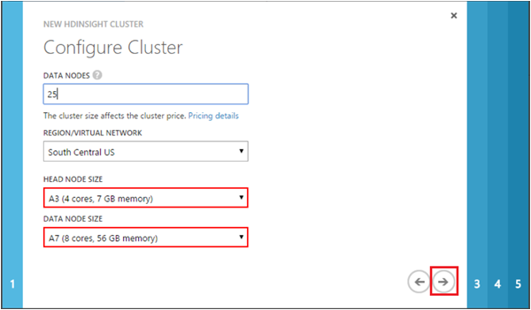
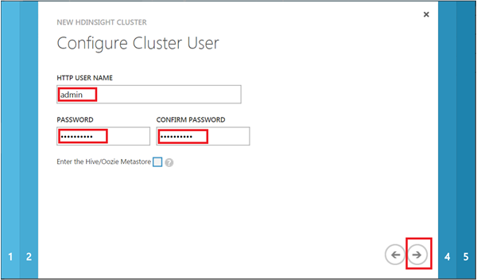

<properties 
    pageTitle="Personalizar Hadoop clusters para o processo de ciência de dados de equipe | Microsoft Azure" 
    description="Módulos de Python populares disponibilizados em clusters de Azure HDInsight Hadoop personalizados."
    services="machine-learning" 
    documentationCenter="" 
    authors="bradsev" 
    manager="jhubbard" 
    editor="cgronlun"  />

<tags 
    ms.service="machine-learning" 
    ms.workload="data-services" 
    ms.tgt_pltfrm="na" 
    ms.devlang="na" 
    ms.topic="article" 
    ms.date="09/19/2016" 
    ms.author="hangzh;bradsev" />

# Personalizar o Azure HDInsight Hadoop clusters para o processo de ciência de dados de equipe 

Este artigo descreve como personalizar um cluster de HDInsight Hadoop pela instalação de 64 bits Anaconda (Python 2.7) em cada nó quando o cluster é configurado como um serviço de HDInsight. Ele também mostra como acessar o headnode para enviar os trabalhos personalizados ao cluster. Essa personalização torna muitos módulos Python populares que estão incluídos no Anaconda convenientemente disponível para uso em funções definidas pelo usuário (UDFs) que foram projetados para processar registros de seção no cluster. Para obter instruções sobre os procedimentos usados neste cenário, veja [como enviar consultas de seção](machine-learning-data-science-move-hive-tables.md#submit).

No menu abaixo links para tópicos que descrevem como configurar os vários ambientes de ciência de dados usados pelo [Processo de ciência de dados da equipe (TDSP)](data-science-process-overview.md).

[AZURE.INCLUDE [data-science-environment-setup](../../includes/cap-setup-environments.md)]

## Personalizar o Azure HDInsight Hadoop Cluster

Para criar um cluster de HDInsight Hadoop personalizados, os usuários precisam fazer logon no [**Portal do Azure clássico**](https://manage.windowsazure.com/), clique em **novo** no canto inferior esquerdo e, em seguida, selecione os serviços de dados -> HDINSIGHT -> **Criar personalizado** para exibir a janela de **Detalhes de Cluster** . 

O nome do cluster seja criado na página de configuração de 1 de entrada e aceitar valores padrão para os outros campos. Clique na seta para ir para a próxima página de configuração. 

Na página de configuração 2, o número de **Nós de dados**de entrada, selecione a **Rede VIRTUAL/região**e selecione os tamanhos do **Nó de cabeça** e o **Nó de dados**. Clique na seta para ir para a próxima página de configuração.

>[AZURE.NOTE] A **Rede de região/VIRTUAL** deve ser a mesma que a região da conta de armazenamento que vai ser usado para o cluster HDInsight Hadoop. Caso contrário, quarta página de configuração, a conta de armazenamento que os usuários que deseja usar não aparecerão na lista suspensa Nome da **Conta**.

Na página de configuração 3, forneça um nome de usuário e senha para o cluster HDInsight Hadoop. **Não** selecione _Enter na seção/Oozie Metastore_. Em seguida, clique na seta para ir para a próxima página de configuração. 

Na página de configuração 4, especifique o nome da conta de armazenamento, o recipiente padrão do cluster HDInsight Hadoop. Se os usuários selecionarem _criar recipiente padrão_ na lista suspensa **CONTÊINER padrão** , um contêiner com o mesmo nome que o cluster será criado. Clique na seta para ir para a última página de configuração.

Na página de configuração de **Ações de Script** final, clique em botão **Adicionar ação de script** e preencha os campos de texto com os seguintes valores.
 
* **Nome** - qualquer cadeia de caracteres como o nome dessa ação de script. 
* **Tipo de nó** - selecionar **todos os nós**. 
* **URI de SCRIPT** - *http://getgoing.blob.core.windows.net/publicscripts/Azure_HDI_Setup_Windows.ps1* 
    * *publicscripts* é um contêiner público na conta de armazenamento 
    * *getgoing* que usamos para compartilhar arquivos de script do PowerShell para facilitar o trabalho de usuários no Azure. 
* **Parâmetros** - (deixe em branco)

Por fim, clique na marca de seleção para iniciar a criação do cluster HDInsight Hadoop personalizado. 

## Acessar o nó de cabeça do Hadoop Cluster

Os usuários devem ativar o acesso remoto ao cluster Hadoop no Azure antes de poder acessar o nó principal do cluster Hadoop por meio de RDP. 

1. Faça logon no [**Portal clássico do Azure**](https://manage.windowsazure.com/), selecione **HDInsight** à esquerda, selecione o seu cluster Hadoop na lista de clusters, clique na guia **configuração** e clique no ícone **Ativar remoto** na parte inferior da página.
    
    

2. Na janela **Configurar área de trabalho remota** , insira os campos nome de usuário e senha e selecione a data de expiração para acesso remoto. Clique na marca de seleção para habilitar o acesso remoto para o nó principal do cluster Hadoop.

    
    
>[AZURE.NOTE] O nome de usuário e senha de acesso remoto não são o nome de usuário e senha que você usa quando você criou o cluster Hadoop. Estas são um conjunto de credenciais separado. Além disso, a data de expiração do acesso remoto deve ser dentro de 7 dias da data atual.

Depois de acesso remoto está ativado, clique em **Conectar** na parte inferior da página para remoto para o nó principal. Faça logon no nó principal do cluster Hadoop inserindo as credenciais do usuário de acesso remoto que você especificou anteriormente.

As próximas etapas do processo de análise avançada são mapeadas no [Processo de ciência de dados da equipe (TDSP)](https://azure.microsoft.com/documentation/learning-paths/cortana-analytics-process/) e podem incluir etapas que mover dados para HDInsight, processam e amostra-lo em preparação para aprender a partir dos dados com aprendizado de máquina do Azure.

Veja [como enviar consultas de seção](machine-learning-data-science-move-hive-tables.md#submit) para obter instruções sobre como acessar os módulos de Python que estão incluídos no Anaconda de nó principal do cluster no funções definidas pelo usuário (UDFs) que são usados para processar registros de seção armazenados no cluster.

 
