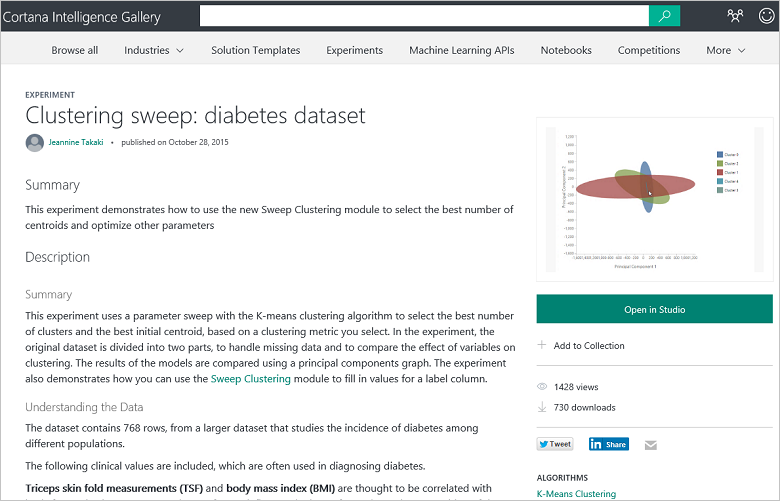
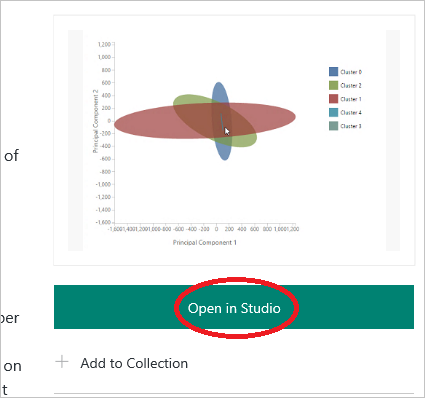

<properties
   pageTitle="Copiar dos outros dados ciência trabalho - exemplo de aprendizado de máquina | Microsoft Azure"
   description="Segredo comercial da ciência de dados: obter outras pessoas para fazer seu trabalho para você. Veja exemplos na Galeria de análise de Cortana como um exemplo de algoritmo de agrupamento."
   keywords="exemplos de ciência de dados, exemplo de aprendizado de máquina, cluster algoritmo, exemplo de algoritmo de agrupamento"
   services="machine-learning"
   documentationCenter="na"
   authors="cjgronlund"
   manager="jhubbard"
   editor="cjgronlund"/>

<tags
   ms.service="machine-learning"
   ms.devlang="na"
   ms.topic="article"
   ms.tgt_pltfrm="na"
   ms.workload="na"
   ms.date="10/20/2016"
   ms.author="cgronlun;garye"/>

# Copiar o trabalho de outras pessoas para fazer ciência de dados

## Vídeo 5: Ciência de dados para a série de iniciantes

Um dos segredos comerciais da ciência de dados está obtendo a outras pessoas para fazer seu trabalho para você. Encontre um exemplo de algoritmo cluster usar para sua própria experimento de aprendizado de máquina.

Para obter o máximo proveito da série, assista todos eles. [Vá para a lista de vídeos](#other-videos-in-this-series)

> [AZURE.VIDEO data-science-for-beginners-series-copy-other-peoples-work-to-do-data-science]

## Outros vídeos desta série

*Ciência de dados para iniciantes* é uma rápida introdução às ciência de dados em cinco vídeos curtos.

  * Vídeo 1: [As respostas de ciência de dados 5 perguntas](machine-learning-data-science-for-beginners-the-5-questions-data-science-answers.md) *(5 min 14 s)*
  * Vídeo 2: [está pronto para ser ciência de dados a seus dados?](machine-learning-data-science-for-beginners-is-your-data-ready-for-data-science.md) *(4 min 56 sec)*
  * [Fazer uma pergunta que você pode responder com dados](machine-learning-data-science-for-beginners-ask-a-question-you-can-answer-with-data.md) de vídeo 3: *(4 sec 17 min)*
  * Vídeo 4: [Prever uma resposta com um modelo simples](machine-learning-data-science-for-beginners-predict-an-answer-with-a-simple-model.md) *(7 min 42 sec)*
  * Vídeo 5: Copiar trabalho de outras pessoas para fazer ciência de dados

## Transcrição: Copiar trabalho de outras pessoas para fazer ciência de dados

Bem-vindo ao vídeo quinto da série "Ciência de dados para iniciantes".

Nesse, notar um lugar para exemplos de localização que você pode emprestar como ponto de partida para seu próprio trabalho. Você poderá obter o máximo proveito este vídeo se você primeiro Assista aos vídeos anteriores desta série.

Um dos segredos comerciais da ciência de dados está obtendo a outras pessoas para fazer seu trabalho para você.

## Encontrar exemplos na Galeria de inteligência de Cortana

A Microsoft tem um serviço baseado em nuvem, chamado de [Aprendizado de máquina do Azure]( https://azure.microsoft.com/services/machine-learning/) que você está bem-vindo ao Experimente gratuitamente. Ele fornece um espaço de trabalho onde você pode experimentar algoritmos de aprendizado de máquina diferente e, quando você tem sua solução trabalhou check-out, é possível iniciá-lo como um serviço web.

Parte desse serviço é que algo chamado na **[Galeria de inteligência de Cortana](http://aka.ms/CortanaIntelligenceGallery)**. Ele contém uma variedade de recursos, um dos quais é uma coleção de modelos, que as pessoas têm criado e contribuiu para outras pessoas usarem ou experiências de aprendizado de máquina do Azure. Essas experiências são uma ótima maneira de aproveitar o pensamento e o trabalho árduo de outras pessoas para iniciá-lo em suas próprias soluções.

Você pode encontrar na Galeria em [aka.ms/CortanaIntelligenceGallery]( http://aka.ms/CortanaIntelligenceGallery). Todos são bem-vindo ao procurar por ele.

Se você clicar **experiências** na parte superior, você verá um número das experiências mais recentes e populares na Galeria. Você pode pesquisar através do restante do experiências clicando em **Procurar tudo** na parte superior da tela, e lá você pode inserir termos de pesquisa e filtros de pesquisa.

## Localizar e usar um exemplo de algoritmo de agrupamento

Portanto, por exemplo, digamos que você queira ver um exemplo de como funcionam os clusters, portanto você procurar por **"cluster"** experiências.

Aqui está um interessante que alguém contribuiu para a Galeria.

Clique em desse experimento e você recebe uma página da web que descreve o trabalho que fez este Colaborador, juntamente com alguns dos seus resultados.

Observe que o link que diz **aberto no Studio**.

Posso pode clicar nele e demora me direita para **Studio de aprendizado de máquina do Azure**. Cria uma cópia da experiência e coloca em meu próprio espaço de trabalho. Isso inclui dataset do Colaborador, todo o processamento faziam, todos os algoritmos que eles usaram e como eles são salvos os resultados.

E agora tiver um ponto de partida. Posso trocar seus dados para o meu próprio e fazer meus próprios ajuste do modelo. Isso me dá inicie e permite que eu desenvolver o trabalho das pessoas que realmente sabem o que está fazendo.

## Localizar experiências que demonstram técnicas de aprendizado de máquina

Existem outras experiências na [Galeria de inteligência de Cortana](http://aka.ms/CortanaIntelligenceGallery) que foram contribuiu especificamente para fornecer exemplos de instruções para as pessoas novo ciência de dados. Por exemplo, há um experimento na Galeria que demonstra como lidar com valores ausentes ([métodos para valores ausentes manipulação](https://gallery.cortanaintelligence.com/Experiment/Methods-for-handling-missing-values-1)). Ele orienta você por meio de 15 diferentes maneiras de substituir valores vazios e fala sobre os benefícios de cada método e quando usá-lo.

[Galeria de inteligência de Cortana](http://aka.ms/CortanaIntelligenceGallery) é um lugar para encontrar experiências de trabalho que você pode usar como ponto de partida para suas próprias soluções.

Certifique-se de fazer check-out os outros vídeos "Dados ciência para iniciantes", de aprendizado de máquina do Microsoft Azure.

## Próximas etapas

  * [Tente seu primeiro experimento de ciência de dados com o aprendizado de máquina do Azure](machine-learning-create-experiment.md)
  * [Obter uma introdução ao aprendizado de máquina no Microsoft Azure](machine-learning-what-is-machine-learning.md)
