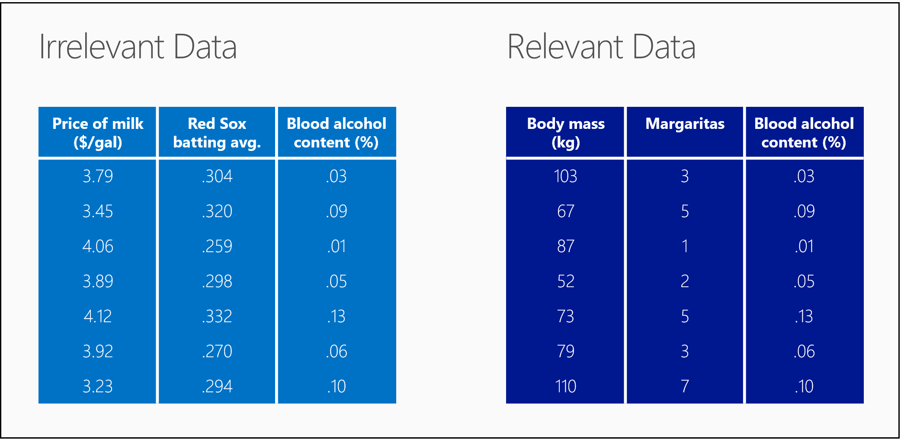

<properties
   pageTitle="Seus dados está preparado para ciência de dados? Avaliação de dados | Microsoft Azure"
   description="Aprenda os 4 critérios para dados esteja pronto para ciência de dados. Ciência de dados para iniciantes M2 tem concretos exemplos para ajudá-lo com avaliação de dados básico."
   keywords="dados relevantes, avaliar dados, preparar dados, critérios de dados, dados prontos"
   services="machine-learning"
   documentationCenter="na"
   authors="cjgronlund"
   manager="jhubbard"
   editor="cjgronlund"/>

<tags
   ms.service="machine-learning"
   ms.devlang="na"
   ms.topic="article"
   ms.tgt_pltfrm="na"
   ms.workload="na"
   ms.date="10/20/2016"
   ms.author="cgronlun;garye"/>

# Seus dados está preparado para ciência de dados?

## Vídeo 2: Ciência de dados para série iniciantes

Saiba como avaliar seus dados para certificar-se de que ele atende aos critérios básicos para estar pronto para ciência de dados.

Para obter o máximo proveito da série, assista todos eles. [Vá para a lista de vídeos](#other-videos-in-this-series)

> [AZURE.VIDEO data-science-for-beginners-series-is-your-data-ready-for-data-science]

## Outros vídeos desta série

*Ciência de dados para iniciantes* é uma rápida introdução às ciência de dados em cinco vídeos curtos.

  * Vídeo 1: [As respostas de ciência de dados 5 perguntas](machine-learning-data-science-for-beginners-the-5-questions-data-science-answers.md) *(5 min 14 s)*
  * Vídeo 2: É seus dados pronto para ciência de dados?
  * [Fazer uma pergunta que você pode responder com dados](machine-learning-data-science-for-beginners-ask-a-question-you-can-answer-with-data.md) de vídeo 3: *(4 sec 17 min)*
  * Vídeo 4: [Prever uma resposta com um modelo simples](machine-learning-data-science-for-beginners-predict-an-answer-with-a-simple-model.md) *(7 min 42 sec)*
  * Vídeo 5: [Copiar o trabalho de outras pessoas para fazer ciência de dados](machine-learning-data-science-for-beginners-copy-other-peoples-work-to-do-data-science.md) *(3 mínimo 18 sec)*

## Transcrição: Está seus dados preparado para ciência de dados?

Bem-vindo ao "É seus dados pronto para ciência de dados?" o segundo vídeo na série de *Ciência de dados para iniciantes*.  

Antes de ciência de dados pode dar as respostas que deseja, você precisa dar a ele alguns materiais de matéria de alta qualidade para trabalhar com. Como fazer uma pizza, melhor os componentes que você está usando, melhor produto final.

## Critérios para dados

Portanto, no caso de ciência de dados, há alguns componentes que precisamos reunir.

Precisamos de dados:

  * Relevantes
  * Conectado
  * Precisos
  * Suficiente para trabalhar com

## Seus dados é relevante?

Para que o primeiro princípio - precisamos dados relevantes.

Examine a tabela à esquerda. Podemos atendidos sete pessoas fora de barras de Boston, medido seu nível de álcool Sanguínea, a média de rebatida Red Sox em seu último jogo e preço de leite na loja de conveniência mais próxima.

Isso é todos os dados perfeitamente legítimos. Sua única falha é que ela não relevante. Não há nenhuma relação óbvia entre esses números. Se eu lhe dá o preço atual de leite e a média de rebatida Red Sox, não há nenhuma maneira você poderia imaginar meu conteúdo de álcool Sanguínea.

Agora examine a tabela à direita. Desta vez estamos medido de cada pessoa corpo em massa e contado o número de bebidas eles realizada.  Os números em cada linha agora são relevantes uns aos outros. Se eu lhe meu corpo em massa e o número de frescos eu realizada, você pode fazer uma suposição em meu Sanguínea álcool conteúdo.

## Conectados dados?

O princípio próxima é dados conectados.

Aqui estão alguns dados relevantes na qualidade da hambúrguer: bota temperatura, hambúrguer espessura e classificação no alimento local revista. Mas, observe as lacunas na tabela à esquerda.

A maioria dos conjuntos de dados estão faltando alguns valores. É comum ter furos assim e existem maneiras de trabalhar com eles. Mas, se houver muito ausente, seus dados começam a aparência suíço queijo.

Se você examinar a tabela à esquerda, há quantidade de dados ausente, é difícil surgirem com qualquer tipo de relação entre espessura de temperatura e hambúrguer reposição. Este é um exemplo de dados desconectado.

A tabela à direita, no entanto, está cheio e conclua - um exemplo de dados conectados.

## Seus dados é precisos?

O princípio próxima que precisamos é precisão. Aqui estão as quatro destinos que estamos gostaria de visitas com setas.

Examine o destino no canto superior direito. Nós temos um agrupamento justo direita em torno do bullseye. Isso, naturalmente, é preciso. Estranhos, no idioma da ciência de dados, nosso desempenho à direita de destino abaixo dele também é considerado preciso.

Se você tivesse que mapeie o centro dessas setas, você verá que é muito próxima a bullseye. As setas são espaçar todos em torno de destino, portanto, elas são consideradas imprecisa, mas estão centralizados em torno de bullseye, para que elas são consideradas precisas.

Agora examine o destino superior esquerdo. Veja nossas setas muito próximos, pressionar um agrupamento justo. Elas são precisas, mas estão incorretas porque o Centro de maneira desativar o bullseye. E, naturalmente, as setas no canto esquerdo inferior destino estão incorretas e imprecisa. Este Arqueiro necessidades mais prática.

## Você tem dados suficientes para trabalhar com?

Por fim, princípio #4 - precisamos tem dados suficientes.

Pense em cada ponto de dados na tabela como sendo um traço pincel em uma pintura. Se você tiver apenas algumas delas, a pintura pode ser bastante confusa - é difícil dizer qual é.

Se você adicionar alguns mais traços de pincel, a pintura inicia a obter um pouco mais nítidos.

Quando você tiver mal suficiente traços, você pode ver apenas o suficiente para tomar algumas decisões amplas. É em outro que quero visite? Parece brilhante, que se parece com água limpa – Sim, que é onde vou de férias.

Conforme você adicionar mais dados, a imagem se torna mais clara e você pode tomar decisões mais detalhadas. Agora posso pode observar os três hotéis no banco à esquerda. Você sabe, eu realmente, como os recursos de arquitetura em primeiro plano. Vai permaneço lá, no terceiro andar.

Com dados relevantes, conectada, precisos e suficiente, podemos ter todos os componentes de que precisamos fazer algumas ciência de dados de alta qualidade.

Certifique-se de fazer check-out os outros quatro vídeos *Ciência de dados para iniciantes* de aprendizado de máquina do Microsoft Azure.

## Próximas etapas

  * [Tente um experimento de ciência de dados primeiro com Studio de aprendizado de máquina](machine-learning-create-experiment.md)
  * [Obter uma introdução ao aprendizado de máquina no Microsoft Azure](machine-learning-what-is-machine-learning.md)
