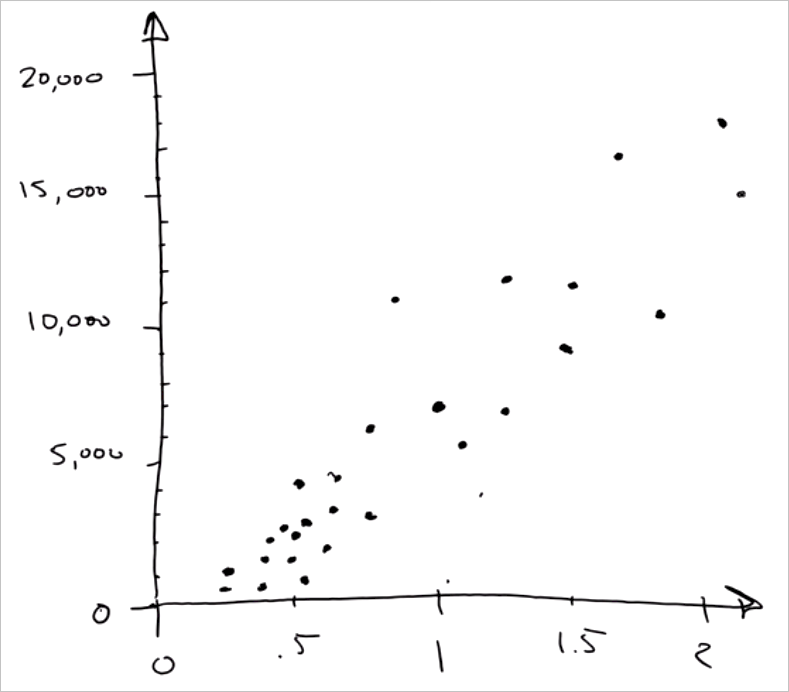

<properties
   pageTitle="Prever uma resposta com um modelo simples - modelo de regressão | Microsoft Azure"
   description="Como criar um modelo de regressão simples para prever um preço em ciência de dados para iniciantes vídeo 4. Inclui uma regressão linear com dados de destino."                                  
   keywords="criar um modelo, o modelo simples, a previsão de preço, o modelo de regressão simples"
   services="machine-learning"
   documentationCenter="na"
   authors="cjgronlund"
   manager="jhubbard"
   editor="cjgronlund"/>

<tags
   ms.service="machine-learning"
   ms.devlang="na"
   ms.topic="article"
   ms.tgt_pltfrm="na"
   ms.workload="na"
   ms.date="10/20/2016"
   ms.author="cgronlun;garye"/>

# Prever uma resposta com um modelo simples

## Vídeo 4: Ciência de dados para série iniciantes

Aprenda a criar um modelo de regressão simples para prever o preço de um losango em ciência de dados para iniciantes M4. Vamos desenhar um modelo de regressão com dados de destino.

Para obter o máximo proveito da série, assista todos eles. [Vá para a lista de vídeos](#other-videos-in-this-series)

> [AZURE.VIDEO data-science-for-beginners-series-predict-an-answer-with-a-simple-model]

## Outros vídeos desta série

*Ciência de dados para iniciantes* é uma rápida introdução às ciência de dados em cinco vídeos curtos.

  * Vídeo 1: [As respostas de ciência de dados 5 perguntas](machine-learning-data-science-for-beginners-the-5-questions-data-science-answers.md) *(5 min 14 s)*
  * Vídeo 2: [está pronto para ser ciência de dados a seus dados?](machine-learning-data-science-for-beginners-is-your-data-ready-for-data-science.md) *(4 min 56 sec)*
  * [Fazer uma pergunta que você pode responder com dados](machine-learning-data-science-for-beginners-ask-a-question-you-can-answer-with-data.md) de vídeo 3: *(4 sec 17 min)*
  * Vídeo 4: Prever uma resposta com um modelo simples
  * Vídeo 5: [Copiar o trabalho de outras pessoas para fazer ciência de dados](machine-learning-data-science-for-beginners-copy-other-peoples-work-to-do-data-science.md) *(3 mínimo 18 sec)*

## Transcrição: Prever uma resposta com um modelo simples

Bem-vindo ao vídeo quarto na "dados ciência para iniciantes" série. Nesse, vamos criar um modelo simples e faça uma previsão.

Um *modelo* é uma história simplificada sobre nossos dados. Para mostrar o que posso dizer.

## Coletar relevante, preciso, conectada, dados suficientes

Digamos que eu queira loja para um losango. Eu tenho um anel que pertencem para a minha vovó com uma configuração de um losango circunflexo 1,35 e quero obter uma ideia de quanto custará. Posso fazer um bloco de notas e caneta na loja joia e eu Anote o preço de todos os losangos em maiusculas e minúsculas e quanto eles ponderar em carats. Começando com o primeiro losango - de-1.01 carats e US $7,366.

Agora posso dar uma olhada e siga este procedimento para todos os outros losangos no repositório do.

Observe que a nossa lista tem duas colunas. Cada coluna tem um atributo diferente - peso em carats e preço - e cada linha é um ponto de dados único que representa um losango único.

Nós criamos realmente um pequeno conjunto de dados aqui - uma tabela. Observe que ela atende nossos critérios de qualidade:

* Os dados são **relevantes** - peso definitivamente está relacionado ao preço
* Ele é **preciso** - nós com verificação dupla os preços que estamos Anote
* Ele está **conectado** - há sem espaços em branco em qualquer uma dessas colunas
* E, como veremos, é **suficiente** dados a nossa pergunta

## Faça uma pergunta nítida

Agora podemos vai fazer nossa pergunta de maneira nítida: "Quanto custará para comprar um losango circunflexo 1,35?"

Nossa lista não tem um losango circunflexo 1,35 nele, então teremos que usar o restante dos nossos dados para obter uma resposta para a pergunta.

## Plotar dados existentes

A primeira coisa que faremos é desenhar uma linha horizontal do número, chamada de um eixo, para os pesos de gráfico. O intervalo dos pesos é 0 a 2, portanto vamos desenhar uma linha que abrange que variam e colocar escalas para cada circunflexo metade.

Em seguida, vamos desenhar um eixo vertical para registrar o preço e conecte-o para o eixo horizontal espessura. Esse será em unidades de dólares. Agora, temos um conjunto de coordenadas eixos.

Vamos pegar esses dados agora e transformá-lo em uma *dispersão plotar*. Esta é uma ótima maneira de visualizar os conjuntos de dados numéricos.

Para o primeiro ponto de dados, podemos identificar uma linha vertical em carats 1.01. Em seguida, podemos identificar uma linha horizontal em $7,366. Onde elas atingirem, podemos desenhar um ponto. Isso representa nosso primeiro losango.

Agora vamos dar uma olhada em cada losango nesta lista e fazer a mesma coisa. Quando estamos através de, este é o que recebemos: um monte de pontos, uma para cada losango.

## Desenhar o modelo através dos pontos de dados

Agora você examinará pontos e squint, a coleção se parece com uma linha fat confusa. Podemos fazer nossa marcador e desenhar uma linha reta através dele.

Desenhando uma linha, podemos criar um *modelo*. Pense nisso como fazendo reais e fazer uma versão com quadrinhos simples dele. Agora os desenhos está errado - linha não dar uma olhada em todos os pontos de dados. Mas, é uma simplificação útil.

O fato de que todos os pontos não passam exatamente a linha é Okey. Cientistas dados explicam isso dizendo que o modelo - que é a linha - e, em seguida, cada ponto tem algumas *ruído* ou *variação* associada a ele. Há relação perfeita subjacente e, em seguida, há o mundo interessa, real que adiciona ruído e incerteza.

Porque estamos tentando responder à pergunta *quanto?* isso se chama uma *regressão*. E porque estamos usando uma linha reta, é uma *regressão linear*.

## Usar o modelo para encontrar a resposta

Agora que temos um modelo e, pedimos nossa pergunta: quanto um losango circunflexo 1,35 custa?

Para responder nossa pergunta, podemos identificar carats 1,35 e desenhar uma linha vertical. Onde ele cruza a linha de modelo, podemos identificar uma linha horizontal para o eixo de moeda. Ele atinge ao alcance de 10.000. Explosão! Essa é a resposta: um losango circunflexo 1,35 custa cerca de US $10.000.

## Criar um intervalo de confiança

É natural para saber como precisas esta previsão está. É muito útil saber se o losango circunflexo 1,35 será muito próxima $10.000, ou superior ou inferior. Para calcular isso, vamos desenhar um envelope ao redor da linha de regressão que inclui a maioria dos pontos. Nesse envelope é chamado nosso *intervalo de confiança*: estamos bastante confiança de que os preços estão dentro este envelope, pois no passado mais deles tem. Nós pode desenhar duas linhas mais horizontais de onde a linha de circunflexo 1,35 cruza na parte superior e na parte inferior do envelope.

Agora podemos dizer algo sobre nosso intervalo de confiança: podemos dizer com confiança que é o preço de um losango circunflexo 1,35 sobre $10.000 - mas talvez seja baixa como r $8.000 e pode ser tão alto quanto $12.000.

## Podemos terminar, sem matemática ou computadores

Fizemos cientistas que dados sejam pagas fazer e fizemos apenas desenhando:

* Pedimos uma pergunta que estamos poderia responder com dados
* Criamos um *modelo* usando *regressão linear*
* Fizemos uma *previsão*, completa com um *intervalo de confiança*

E não usamos matemática ou computadores fazê-lo.

Agora se tinha tivemos obter mais informações, como...

* o corte do losango
* variações de cor (como fechar o losango é sendo branca)
* o número de inclusões no losango

… seguida seria tivemos mais colunas. Nesse caso, matemática se torna útil. Se você tiver mais de duas colunas, é difícil desenhar pontos em papel. A matemática permite ajustar essa linha ou esse plano aos seus dados perfeitamente.

Além disso, se, em vez de poucos losangos, tivemos duas mil ou dois milhões, em seguida, você pode fazer muito mais rápido que funcionam com um computador.

Hoje, que já discutimos como fazer regressão linear e fizemos uma previsão usando dados.

Certifique-se de fazer check-out os outros vídeos "Dados ciência para iniciantes", de aprendizado de máquina do Microsoft Azure.

## Próximas etapas

  * [Tente um experimento de ciência de dados primeiro com Studio de aprendizado de máquina](machine-learning-create-experiment.md)
  * [Obter uma introdução ao aprendizado de máquina no Microsoft Azure](machine-learning-what-is-machine-learning.md)
