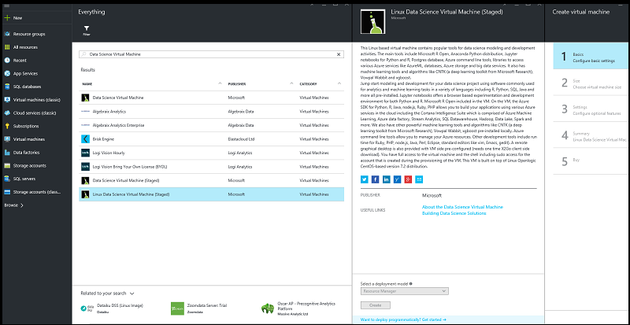

<properties
    pageTitle="Provisionar Máquina Virtual Linux dados ciência | Microsoft Azure"
    description="Configurar e criar uma máquina Virtual de ciência de dados de Linux no Azure fazer a análise e aprendizado de máquina."
    services="machine-learning"
    documentationCenter=""
    authors="bradsev"
    manager="jhubbard"
    editor="cgronlun"  />

<tags
    ms.service="machine-learning"
    ms.workload="data-services"
    ms.tgt_pltfrm="na"
    ms.devlang="na"
    ms.topic="article"
    ms.date="09/12/2016"
    ms.author="bradsev" />

# <a name="provision-the-linux-data-science-virtual-machine"></a>Provisionar Máquina Virtual Linux dados ciências

O Linux dados ciência Virtual é uma Azure máquina virtual que vem com um conjunto de ferramentas pré-instalado. Essas ferramentas são usadas para fazer a análise de dados e aprendizado de máquina. Os componentes de software chave incluídos são:

- Microsoft R Server Developer Edition
- Distribuição de Python anaconda (versões 2.7 e 3.5), incluindo bibliotecas de análise de dados populares
- JupyterHub - um servidor de bloco de anotações de Jupyter multiusuário R, Python, kernels Julia de suporte
- Explorador de armazenamento do Azure
- Interface Azure de linha (comando) para gerenciar recursos do Azure
- Banco de dados de PostgresSQL
- Ferramentas de aprendizado de máquina
    - [Kit de ferramentas de computação de rede (CNTK)](https://github.com/Microsoft/CNTK): uma profunda Kit de ferramentas de software da Microsoft Research de aprendizagem.
    - [Vowpal Wabbit](https://github.com/JohnLangford/vowpal_wabbit): uma sistema com suporte técnicas como online, hash, allreduce, reduções, learning2search, ativo, de aprendizado de máquina rápida e interativa de aprendizado.
    - [XGBoost](https://xgboost.readthedocs.org/en/latest/): uma ferramenta fornecendo implementação de árvore aumentadas rápida e precisa.
    - [Rattle](http://rattle.togaware.com/) (a R analítico ferramenta para aprender facilmente): uma ferramenta que torna a introdução ao análises de dados e aprendizado em R fácil, com a exploração de dados baseada em interface gráfica, modelagem e análise com geração automática de código de R de máquina.
- SDK do Azure em Java, Python, Node, Ruby, PHP
- Bibliotecas de R e Python para usam em aprendizado de máquina do Azure e outros serviços do Azure
- Ferramentas de desenvolvimento e editores (Eclipse, Emacs, gedit, vi)

Fazer ciência de dados envolve a iteração em uma sequência de tarefas:

1. Localizando, carregando e pré-processamento de dados
2. Criar e testar modelos
3. Implantando os modelos para consumo em aplicativos inteligentes

Cientistas dados usam várias ferramentas para concluir essas tarefas. Pode demorar bastante para localizar as versões apropriadas do software e, em seguida, para baixar, compilar e instalar essas versões.

Na máquina Virtual de ciência de dados de Linux pode facilitar essa carga substancialmente. Usá-lo rapidamente seu projeto de análise. Ele permite trabalhar em tarefas em vários idiomas, incluindo R, Python, SQL, Java e C++. Eclipse fornece um IDE para desenvolver e testar seu código que é fácil de usar. O SDK do Azure incluídos na máquina virtual permite que você crie seus aplicativos usando vários serviços no Linux para a plataforma de nuvem da Microsoft. Além disso, você tem acesso para outros idiomas como Ruby, Perl, PHP e Node que também são previamente instalados.

Não há nenhum encargos de software para esta imagem de máquina virtual de ciência de dados. Você pagar somente as taxas de uso de hardware Azure que são avaliadas de acordo com o tamanho da máquina virtual que você provisionar com a imagem de máquina virtual. Obter mais detalhes sobre as taxas de computação podem ser encontradas na [máquina virtual listando página no Azure Marketplace ](https://azure.microsoft.com/marketplace/partners/microsoft-ads/linux-data-science-vm/).


## <a name="prerequisites"></a>Pré-requisitos

Antes de criar uma máquina Virtual de ciência de dados de Linux, você deve ter o seguinte:

- **Assinatura de um Azure**: para obter uma, consulte [avaliação gratuita do Azure obter](https://azure.microsoft.com/free/).
- **Conta de armazenamento de um Azure**: para criar uma, consulte [criar uma conta de armazenamento do Azure](storage-create-storage-account.md#create-a-storage-account). Como alternativa, a conta de armazenamento pode ser criada como parte do processo de criação a máquina virtual, se você não quiser usar uma conta existente.


## <a name="create-your-linux-data-science-virtual-machine"></a>Criar sua máquina de Virtual de ciências Linux dados

Aqui estão as etapas para criar uma instância da máquina de Virtual em ciências Linux dados:

1.  Navegue até a máquina virtual listando no [portal do Azure](https://portal.azure.com/#create/microsoft-ads.linux-data-science-vmlinuxdsvm).
2.   Clique em **criar** (na parte inferior) para abrir o assistente. 
3.   As seguintes seções fornecem as entradas para cada uma das etapas no Assistente (enumerados à direita da figura anterior) usadas para criar a máquina Virtual do Microsoft dados ciência. Aqui estão as entradas necessárias para configurar cada uma destas etapas:

    a. **Noções básicas**:

  - **Nome**: nome do seu servidor de ciência de dados que você está criando.
  - **Nome de usuário**: entrar primeira conta ID.
  - **Senha**: primeira senha da conta (você pode usar chave pública SSH em vez de senha).
  - **Assinatura**: se você tiver mais de uma assinatura, selecione aquele no qual o computador está a serem criadas e cobrado. Você deve ter privilégios de criação de recursos para essa assinatura.
  - **Grupo de recursos**: você pode criar um novo ou use um grupo existente.
  - **Local**: selecione o Centro de dados que é mais apropriado. Normalmente é o Centro de dados que tenha a maioria dos seus dados, ou mais próximo ao seu local físico mais rápido para acesso de rede.

    b. **Tamanho**:

  - Selecione um dos tipos de servidor que atenda às suas requisito funcional e restrições de custo. Selecione **Exibir tudo** para ver mais opções de tamanhos de máquina virtual.

    c. **Configurações**:

  - **Tipo de disco**: escolher **Premium** se você preferir uma unidade de estado sólido (SSD). Caso contrário, escolha **padrão**.
  - **Conta de armazenamento**: você pode criar uma nova conta de armazenamento do Azure em sua assinatura ou use um existente no mesmo local que foi escolhido na etapa **Noções básicas** do assistente.
  - **Outros parâmetros**: na maioria dos casos, você simplesmente usar os valores padrão. Considerar valores não-padrão, passe o mouse sobre o link informacional para obter ajuda sobre os campos específicos.

    d. **Resumo**:

  - Verifique se todas as informações inseridas estão corretas.

    e. **Comprar**:

  - Para iniciar o processo de provisionamento, clique em **comprar**. Um link é fornecido com os termos da transação. A máquina virtual não tem quaisquer cobranças adicionais além a computação para o tamanho de servidor que você escolheu na etapa **tamanho** .

O provisionamento deve levar cerca de 10 a 20 minutos. O status do provisionamento é exibido no portal do Azure.

## <a name="how-to-access-the-linux-data-science-virtual-machine"></a>Como acessar a máquina Virtual do Linux dados ciências

Depois que a máquina virtual é criada, você pode entrá-lo usando SSH. Use as credenciais de conta que você criou na seção **Noções básicas** da etapa 3 para a interface do shell de texto. No Windows, você pode baixar uma ferramenta de cliente SSH como [Acabamento](http://www.putty.org). Se você preferir uma área de trabalho gráfica (X Windows System), você pode usar X11 forwarding no acabamento ou instalar o cliente de X2Go.

>[AZURE.NOTE] O cliente X2Go realizado significativamente melhor do que X11 encaminhamento no teste. Recomendamos usando o cliente de X2Go para uma interface gráfica de área de trabalho.


## <a name="installing-and-configuring-x2go-client"></a>Instalando e configurando o cliente de X2Go

A VM Linux já está provisionado com X2Go servidor e pronto para aceitar conexões de cliente. Para se conectar à área de trabalho gráfica Linux VM, faça o seguinte no seu cliente:

1. Baixe e instale o cliente X2Go para sua plataforma de cliente do [X2Go](http://wiki.x2go.org/doku.php/doc:installation:x2goclient).    
2. Executar o cliente X2Go e, em seguida, selecione **Nova sessão**. Ele abre uma janela de configuração com várias guias. Insira os seguintes parâmetros de configuração:
    * **Guia de sessão**:
        - **Host**: O nome do host ou o endereço IP da sua máquina virtual ciência de dados Linux.
        - **Logon**: nome de usuário na VM Linux.
        - **Porta de SSH**: deixá-lo em 22, o valor padrão.
        - **Tipo de sessão**: altere o valor para XFCE. Atualmente o VM Linux suporta apenas desktop XFCE.
    * **Guia de mídia**: você pode desativar som suporte e cliente imprimindo se não precisar usá-las.
    * **Pastas compartilhadas**: se você quiser diretórios de máquinas clientes montadas na VM Linux, adicione os diretórios de máquina de cliente que você deseja compartilhar com a máquina virtual nessa guia.

Depois de entrar para a máquina virtual usando o cliente SSH ou a área de trabalho gráfica por meio do cliente de X2Go XFCE, você está pronto para começar a usar as ferramentas que estão instaladas e configuradas na máquina virtual. Em XFCE, você pode ver os atalhos do menu de aplicativos e ícones da área de trabalho para muitas das ferramentas.


## <a name="tools-installed-on-the-linux-data-science-virtual-machine"></a>Ferramentas instaladas no computador de Virtual em ciências Linux dados

### <a name="microsoft-r-open"></a>Microsoft R abrir
R é um dos idiomas mais populares para análise de dados e aprendizado de máquina. Se você quiser usar R para sua análise, a máquina virtual tem Microsoft R aberta (MRO) com a matemática núcleo MKL (biblioteca). A MKL otimiza operações matemáticas comuns em algoritmos analíticos. MRO é 100 por cento compatível com CRAN-R e qualquer uma das bibliotecas R publicadas em CRAN pode ser instalado no MRO. Você pode editar os programas de R em um dos editores padrão, como vi, Emacs ou gedit. Você também pode baixar e usar outros IDEs, como [RStudio](http://www.rstudio.com). Para sua conveniência, um script simples (installRStudio.sh) é fornecido no diretório **/dsvm/tools** que instala RStudio. Se você estiver usando o editor de Emacs, observe que o Emacs empacotar ESS (Emacs fala estatísticas), que simplifica a trabalhar com arquivos de R dentro do editor de Emacs, foi pré-instalado.

Para iniciar R, basta digitar **R** no shell. Isso o leva para um ambiente interativo. Para desenvolver o seu programa de R, você normalmente usa um editor como Emacs ou vi ou gedit e, em seguida, executar os scripts no R. Se você instalar RStudio, você tem um ambiente completo gráfico para desenvolver o seu programa de R.

Também há um script de R para você instalar os [pacotes de início 20 R](http://www.kdnuggets.com/2015/06/top-20-r-packages.html) se desejar. Esse script pode ser executado depois que você estiver usando a interface de interativo R, que pode ser inserida (conforme mencionado) digitando **R** no shell.  

### <a name="python"></a>Python
Para o desenvolvimento usando Python, distribuição de Anaconda Python 2.7 e 3.5 foi instalada. Essa distribuição contém o Python base juntamente com cerca de 300 os pacotes de análise de dados, engenharia e matemática mais populares. Você pode usar os editores de texto padrão. Além disso, você pode usar Spyder, um IDE Python que acompanha distribuições Anaconda Python. Spyder precisa de uma área de trabalho gráfica ou X11 encaminhamento. Um atalho para Spyder é fornecido na área de trabalho gráfica.

Como temos Python 2.7 e 3.5, você precisa ativar especificamente a versão desejada do Python que você deseja trabalhar na sessão atual. O processo de ativação define a variável de caminho para a versão desejada do Python.

Para ativar Python 2.7, execute o seguinte do shell:

    source /anaconda/bin/activate root

Python 2.7 é instalado em */anaconda/bin*.

Para ativar Python 3.5, execute o seguinte do shell:

    source /anaconda/bin/activate py35


Python 3.5 é instalado em */anaconda/envs/py35/bin*.

Para chamar uma sessão interativa Python, basta digite **python** no shell. Se você estiver em uma interface gráfica ou tiver X11 conjunto de encaminhamento para cima, você pode digitar **spyder** para iniciar o IDE Python.

### <a name="jupyter-notebook"></a>Bloco de anotações de Jupyter

A distribuição de Anaconda também vem com um bloco de anotações de Jupyter, um ambiente para compartilhar código e análise. O bloco de anotações de Jupyter é acessado por meio de JupyterHub. Entrar usando seu nome de usuário Linux local e a senha.

O servidor de bloco de anotações de Jupyter foi previamente configurado com Python 2, 3 Python e kernels R. Não há um ícone da área de trabalho denominado "Jupyter bloco de anotações" Inicie o navegador para acessar o servidor de bloco de anotações. Se você estiver na máquina virtual via cliente SSH ou X2Go, você também pode visitar [https://localhost:8000 /](https://localhost:8000/) para acessar o servidor de bloco de anotações de Jupyter.

>[AZURE.NOTE] Continue se você receber quaisquer avisos de certificado.

Você pode acessar o servidor de bloco de anotações de Jupyter de qualquer host. Basta digitar *https://\<nome VM DNS ou o endereço IP\>: 8000 /*

>[AZURE.NOTE] Porta 8000 é aberta no firewall por padrão, quando a máquina virtual está provisionada.

Podemos ter empacotados blocos de anotações de amostra - Python em uma e outra em R. Você pode ver o link para os exemplos na home page do bloco de anotações depois autenticar no bloco de anotações de Jupyter usando seu nome de usuário Linux local e a senha. Você pode criar um novo bloco de anotações selecionando **novo**e, em seguida, o núcleo de idiomas apropriado. Se você não vir o botão **novo** , clique no ícone de **Jupyter** na parte superior esquerda para ir para a home page do servidor de bloco de anotações.


### <a name="ides-and-editors"></a>IDEs e editores

Você tem uma opção de vários editores de código. Isso inclui vi/VIM, Emacs, gEdit e Eclipse. gEdit Eclipse são editores gráficos e necessidade de você estar conectado a um desktop gráfico usá-las. Esses editores tem desktop e aplicativo atalhos do menu iniciá-los.

**VIM** e **Emacs** são editores baseados em texto. Em Emacs, podemos ter instalado um pacote de complementos chamado Emacs fala estatísticas (ESS) que facilita o trabalho com R dentro do editor de Emacs. Mais informações podem ser encontradas na [ESS](http://ess.r-project.org/).

**Eclipse** é uma fonte de abrir, IDE extensível que ofereça suporte a vários idiomas. A edição de desenvolvedores Java é a instância instalada na máquina virtual. Plug-ins estão disponíveis para vários idiomas populares que podem ser instalados para estender o ambiente Eclipse. Também temos um plug-in instalado no Eclipse chamado **Kit de ferramentas do Azure para Eclipse**. Ele permite que você criar, desenvolver, testar e implantar aplicativos Azure usando o ambiente de desenvolvimento do Eclipse que ofereça suporte a idiomas como Java. Também há um **SDK do Azure para Java** que permita acessar diferentes serviços do Azure de dentro de um ambiente Java. Obter mais informações sobre o Kit de ferramentas de Azure para Eclipse podem ser encontradas no [Kit de ferramentas do Azure para Eclipse](../azure-toolkit-for-eclipse.md).

**Látex** é instalado através do pacote de texlive juntamente com um pacote de [auctex](https://www.gnu.org/software/auctex/manual/auctex/auctex.html) do complemento Emacs, que simplifica a criação de seus documentos de látex dentro Emacs.  

### <a name="databases"></a>Bancos de dados

#### <a name="postgres"></a>Postgres
O banco de dados de origem aberto **Postgres** está disponível na máquina virtual, com os serviços em execução e initdb já concluídas. Você ainda precisa criar bancos de dados e usuários. Para obter mais informações, consulte a [documentação de Postgres](https://www.postgresql.org/docs/).  

####  <a name="graphical-sql-client"></a>Gráfica SQL client
**Esquilo SQL**, um cliente SQL gráfico, foi fornecido para se conectar a diferentes bancos de dados (como o Microsoft SQL Server, Postgres e MySQL) e executar consultas SQL. Você pode executar isso uma sessão de desktop gráfica (usando o cliente de X2Go, por exemplo). Para chamar esquilo SQL, você pode iniciá-lo a partir do ícone da área de trabalho ou execute o seguinte comando no shell.

    /usr/local/squirrel-sql-3.7/squirrel-sql.sh

Antes da primeira utilização, configure os drivers e aliases de banco de dados. Os drivers JDBC estão localizados em:

*/usr/share/Java/jdbcdrivers*

Para obter mais informações, consulte [Esquilo SQL](http://squirrel-sql.sourceforge.net/index.php?page=screenshots).

#### <a name="command-line-tools-for-accessing-microsoft-sql-server"></a>Ferramentas de linha de comando para acessar o Microsoft SQL Server

O pacote de driver ODBC para SQL Server também vem com duas ferramentas de linha de comando:

**bcp**: em massa utilitário bcp copia dados entre uma instância do Microsoft SQL Server e um arquivo de dados em um formato especificado pelo usuário. O utilitário bcp pode ser usado para importar grande número de novas linhas em tabelas do SQL Server, ou para exportar dados fora tabelas em arquivos de dados. Para importar dados em uma tabela, você deve usar um arquivo de formato criado para essa tabela, ou compreender a estrutura da tabela e os tipos de dados que são válidos para suas colunas.

Para obter mais informações, consulte [Conectando-se com bcp](https://msdn.microsoft.com/library/hh568446.aspx).

**sqlcmd**: você pode inserir instruções Transact-SQL com o utilitário sqlcmd, bem como procedimentos do sistema e arquivos no prompt de comando de script. Este utilitário usa ODBC para executar lotes Transact-SQL.

Para obter mais informações, consulte [Conectando-se com sqlcmd](https://msdn.microsoft.com/library/hh568447.aspx).

>[AZURE.NOTE] Há algumas diferenças nesse utilitário entre plataformas Linux e Windows. Consulte a documentação para obter detalhes.


#### <a name="database-access-libraries"></a>Bibliotecas de acesso do banco de dados

Há bibliotecas disponíveis no R e Python aos bancos de dados do access.

- Em R, o pacote **RODBC** ou **dplyr** pacote permite consultar ou executar instruções SQL no servidor de banco de dados.
- Em Python, a biblioteca de **pyodbc** fornece acesso de banco de dados com ODBC como a camada subjacente.  

Para acessar **Postgres**:

- De r: Use o pacote **RPostgreSQL**.
- Do Python: Use a biblioteca de **psycopg2** .


### <a name="azure-tools"></a>Ferramentas do Azure
As seguintes ferramentas Azure estão instaladas na máquina virtual:

- **Interface de linha de comando Azure**: O Azure CLI permite criar e gerenciar recursos Azure por meio de comandos de shell. Para chamar as ferramentas Azure, basta digite o **azure ajuda**. Para obter mais informações, consulte a [página de documentação do Azure CLI](../virtual-machines-command-line-tools.md).
- **Gerenciador de armazenamento do Microsoft Azure**: Microsoft Azure Storage Explorer é uma ferramenta gráfica que é usada para navegar pelos objetos que você armazenou em sua conta de armazenamento do Azure e para carregar e baixar dados para e do Azure blobs. Você pode acessar o Gerenciador de armazenamento do ícone de atalho da área de trabalho. Você pode chamá-lo de um prompt shell digitando **StorageExplorer**. Você precisa estar conectado de um cliente de X2Go ou tiver X11 conjunto de encaminhamento para cima.
- **Bibliotecas do Azure**: A seguir estão algumas das bibliotecas de pré-instalados.

 - **Python**: relacionados o Azure bibliotecas em Python instaladas são **azure**, **azureml**, **pydocumentdb**e **pyodbc**. Com as três primeiras bibliotecas, você pode acessar serviços de armazenamento do Azure, aprendizado de máquina do Azure e Azure DocumentDB (um banco de dados NoSQL no Azure). Biblioteca do quarta, pyodbc (juntamente com o driver ODBC do Microsoft para o SQL Server), permite o acesso do SQL Server, o banco de dados do Azure SQL e depósito de dados do SQL Azure do Python usando uma interface ODBC. Insira a **lista de pip** para ver todas as bibliotecas listadas. Certifique-se de executar este comando em 3.5 ambientes e o 2.7 Python.
 - **R**: as bibliotecas com o Azure relacionados em R instaladas são **AzureML** e **RODBC**.
 - **Java**: A lista de bibliotecas Java Azure pode ser encontrada no diretório **/dsvm/sdk/AzureSDKJava** sobre a máquina virtual. As bibliotecas de chave são Azure armazenamento e gerenciamento de APIs, DocumentDB e JDBC os drivers para o SQL Server.  

Você pode acessar o [portal do Azure](https://portal.azure.com) do navegador Firefox pré-instalados. No portal do Azure, você pode criar, gerenciar e monitorar os recursos do Azure.

### <a name="azure-machine-learning"></a>Aprendizado de máquina Azure

Azure aprendizado de máquina é um serviço de nuvem totalmente gerenciado que permite que você criar, implantar e compartilhe soluções de análise de previsão. Construir suas experiências e modelos do Azure Studio de aprendizado de máquina. Ele pode ser acessado de um navegador da web na máquina virtual dados ciência visitando [Aprendizado de máquina do Microsoft Azure](https://studio.azureml.net).

Depois de entrar Studio de aprendizado de máquina do Azure, você tem acesso a uma tela de experimento onde você pode criar um fluxo lógico para o algoritmos de aprendizado de máquina. Você também tem acesso a um bloco de anotações de Jupyter hospedado no aprendizado de máquina do Azure e pode funcionar perfeitamente com as experiências no Studio de aprendizado de máquina. Colocar em operação a modelos que você criou por reuni-los em uma interface de serviço web de aprendizado de máquina. Isso permite que clientes escritos em qualquer linguagem invocar previsões da modelos de aprendizado de máquina. Para obter mais informações, consulte a [documentação de aprendizado de máquina](https://azure.microsoft.com/documentation/services/machine-learning/).

Você pode também desenvolver seus modelos em R ou Python a máquina virtual e, em seguida, implantá-lo em produção em aprendizado de máquina do Azure. Podemos instalou bibliotecas em R (**AzureML**) e Python (**azureml**) para habilitar essa funcionalidade.

Para obter informações sobre como implantar modelos em R e Python em aprendizado de máquina do Azure, consulte [Dez coisas que você pode fazer na ciência de dados Máquina Virtual](machine-learning-data-science-vm-do-ten-things.md) (em particular, a seção "criar modelos usando R ou Python e colocar em operação-los usando o Azure aprendizado de máquina").

>[AZURE.NOTE] Estas instruções foram escritas para a versão do Windows da máquina virtual dados ciência. Mas as informações fornecidas sobre como implantar modelos de aprendizado de máquina do Azure há aplicável à VM Linux.

### <a name="machine-learning-tools"></a>Ferramentas de aprendizado de máquina

A máquina virtual vem com alguns algoritmos que foram previamente compilados e pré-instalados localmente e ferramentas de aprendizado de máquina. Eles incluem:

* **CNTK** (Computação rede Kit de ferramentas do Microsoft Research): uma profunda Kit de ferramentas de aprendizagem.
* **Vowpal Wabbit**: um algoritmo de aprendizagem on-line rápido.
* **xgboost**: uma ferramenta que fornece algoritmos de árvore otimizado, aumentadas.
* **Python**: Anaconda Python vem com algoritmos de aprendizado de máquina com bibliotecas como aprender Scikit. Você pode instalar outras bibliotecas usando o `pip install` comando.
* **R**: uma biblioteca avançada de funções de aprendizado de máquina está disponível para R. Algumas das bibliotecas que forem pré-instalados são lm, glm, randomForest, rpart. Outras bibliotecas podem ser instaladas executando:

        install.packages(<lib name>)

Aqui estão algumas informações adicionais sobre as ferramentas de aprendizado de máquina três primeira na lista.

#### <a name="cntk"></a>CNTK
Este é um código fonte aberto, profunda de kit de ferramentas de aprendizagem. Ele é uma ferramenta de linha de comando (cntk) e já está no caminho.

Para executar uma amostra básica, execute os seguintes comandos no shell:

    # Copy samples to your home directory and execute cntk
    cp -r /dsvm/tools/CNTK-2016-02-08-Linux-64bit-CPU-Only/Examples/Other/Simple2d cntkdemo
    cd cntkdemo/Data
    cntk configFile=../Config/Simple.cntk

A saída de modelo está em *~/cntkdemo/Output/Models*.

Para obter mais informações, consulte a seção CNTK de [GitHub](https://github.com/Microsoft/CNTK)e o [wiki CNTK](https://github.com/Microsoft/CNTK/wiki).


#### <a name="vowpal-wabbit"></a>Vowpal Wabbit

Vowpal Wabbit é uma sistema que usa técnicas como online, hash, allreduce, reduções, learning2search, ativo, de aprendizado de máquina e interativa de aprendizado.

Para executar a ferramenta em um exemplo muito básico, faça o seguinte:

    cp -r /dsvm/tools/VowpalWabbit/demo vwdemo
    cd vwdemo
    vw house_dataset

Há demonstrações maiores nesse diretório. Para obter mais informações sobre VW, consulte [Esta seção do GitHub](https://github.com/JohnLangford/vowpal_wabbit)e o [wiki de Vowpal Wabbit](https://github.com/JohnLangford/vowpal_wabbit/wiki).

#### <a name="xgboost"></a>xgboost
Essa é uma biblioteca que é projetada e otimizada para algoritmos aumentadas (árvore). O objetivo dessa biblioteca é por push os limites de cálculo de máquinas para os extremos necessários para fornecer grande escala árvore aumentando que é flexível, portátil e precisos.

Ele é fornecido como uma linha de comando, além de uma biblioteca de R.

Para usar esta biblioteca no R, você pode iniciar uma sessão de R interativa (apenas digitando **R** no shell) e carregar a biblioteca.

Aqui está um exemplo simples que você pode executar no prompt de R:

    library(xgboost)

    data(agaricus.train, package='xgboost')
    data(agaricus.test, package='xgboost')
    train <- agaricus.train
    test <- agaricus.test
    bst <- xgboost(data = train$data, label = train$label, max.depth = 2,
                    eta = 1, nthread = 2, nround = 2, objective = "binary:logistic")
    pred <- predict(bst, test$data)

Para executar a linha de comando xgboost, aqui estão os comandos para executar no shell:

    cp -r /dsvm/tools/xgboost/demo/binary_classification/ xgboostdemo
    cd xgboostdemo
    xgboost mushroom.conf


Um arquivo de .model é gravado ao diretório especificado. Informações sobre este exemplo de demonstração podem ser encontradas [no GitHub](https://github.com/dmlc/xgboost/tree/master/demo/binary_classification).

Para saber mais sobre xgboost, consulte a [página de documentação xgboost](https://xgboost.readthedocs.org/en/latest/)e seu [repositório Github](https://github.com/dmlc/xgboost).

#### <a name="rattle"></a>Chocalho
Chocalho ( **R** **A**nalytical **T**tinta **T**o **L**ganhar **E**asily) usa modelagem e exploração de dados baseada em interface gráfica. Ele apresenta resumos de estatísticos e visual dos dados, dados de transformações que podem ser prontamente modelados, cria modelos supervisionados e sem supervisão dos dados, apresenta o desempenho dos modelos graficamente, e conjuntos de dados novo pontuações. Ele também gera código R, replicar as operações na interface de usuário que podem ser executadas diretamente no R ou usadas como ponto de partida para análise posterior.

Para executar chocalho, você precisa estar em uma gráfica entrar sessão de desktop. No terminal, digite ```R``` para inserir o ambiente de R. No prompt de R, digite os seguintes comandos:

    library(rattle)
    rattle()

Agora uma interface gráfica abre com um conjunto de guias. Aqui estão as etapas de início rápido do chocalho necessário para usar um conjunto de dados de tempo de amostra e criar um modelo. Em algumas das etapas abaixo, você precisará instalar e carregar alguns pacotes R necessários que não ainda estão no sistema automaticamente.

>[AZURE.NOTE] Se você não tiver acesso ao instalar o pacote no diretório do sistema (o padrão), você poderá ver um prompt na sua janela de console R para instalar pacotes para sua biblioteca pessoal. Responda *y* se você vir esses prompts.

1. Clique em **Executar**.
2. Uma caixa de diálogo aparece, perguntando se você deseja usar o conjunto de dados do exemplo do tempo. Clique em **Sim** para carregar o exemplo.
3. Clique na guia do **modelo** .
4. Clique em **Executar** para criar uma árvore de decisão.
5. Clique em **Desenhar** para exibir a árvore de decisão.
6. Clique no botão de rádio de **floresta** e clique em **Executar** para criar uma floresta aleatória.
7. Clique na guia **avaliar** .
8. Clique no botão de rádio de **risco** e clique em **Executar** para exibir dois plotar de desempenho de risco (cumulativa).
9. Clique na guia **Log** para mostrar o código de gerar R para as operações anteriores.
(Devido a um erro na versão atual do chocalho, você precisa inserir um *#* caractere na frente de *Exportar este log …* no texto do log.)
10. Clique no botão **Exportar** para salvar o arquivo de script de R chamado *weather_script. R* para a pasta.

Você pode sair chocalho e R. Agora você pode modificar o script R gerado ou usá-lo como ele é executá-lo a qualquer momento para repetir tudo o que foi feito na interface do usuário Rattle. Especialmente para iniciantes em R, isso é uma maneira fácil de fazer análise e máquina aprendizagem em uma interface gráfica simple, ao gerar automaticamente o código em R para modificar e/ou aprender rapidamente.


## <a name="next-steps"></a>Próximas etapas
Veja aqui como você pode continuar sua aprendizagem e exploração:

* Explicação [ciência de dados no computador de Virtual em ciências Linux dados](machine-learning-data-science-linux-dsvm-walkthrough.md) mostra como realizar várias tarefas comuns de ciência de dados com a máquina do Linux dados ciência virtual provisionado aqui. 
* Explore as diversas ferramentas de ciência de dados na ciência de dados máquina virtual experimentando as ferramentas descritas neste artigo. Você também pode executar *dsvm-mais-info* no shell dentro a máquina virtual para uma introdução básica e ponteiros para obter mais informações sobre as ferramentas instalado na máquina virtual.  
* Aprenda a criar soluções de analíticas de ponta a ponta sistemática usando o [Processo de ciência de dados de equipe](https://azure.microsoft.com/documentation/learning-paths/cortana-analytics-process/).
* Visite a [Galeria de análise de Cortana](http://gallery.cortanaanalytics.com) para máquina aprendizagem e dados analytics exemplos que usam o pacote de análise de Cortana.
