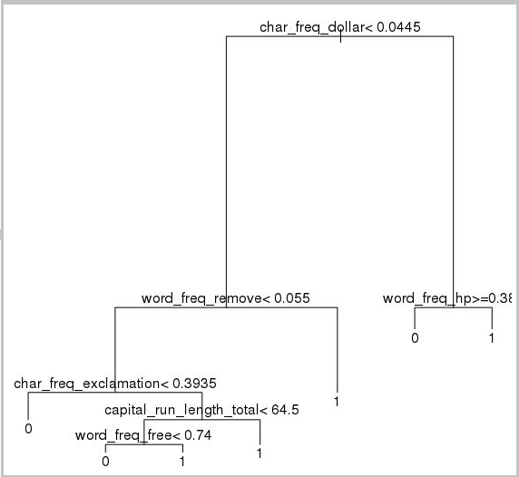
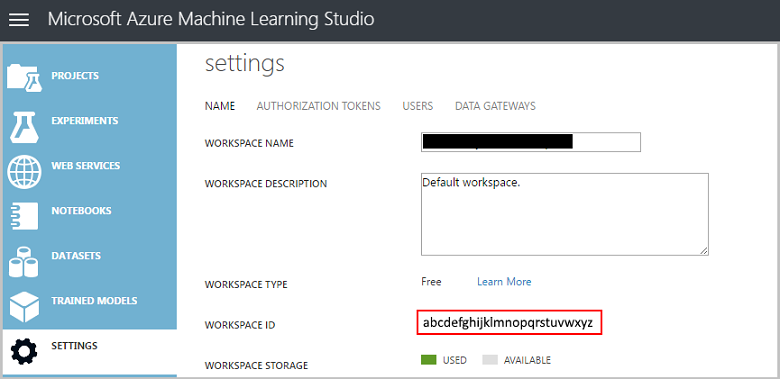

<properties 
    pageTitle="Ciência de dados no computador de Virtual em ciências Linux dados | Microsoft Azure" 
    description="Como realizar várias tarefas comuns de ciências dados com a máquina virtual ciência de dados Linux." 
    services="machine-learning"
    documentationCenter="" 
    authors="bradsev" 
    manager="jhubbard" 
    editor="cgronlun"/>

<tags 
    ms.service="machine-learning" 
    ms.workload="data-services" 
    ms.tgt_pltfrm="na" 
    ms.devlang="na" 
    ms.topic="article" 
    ms.date="09/12/2016" 
    ms.author="bradsev;paulsh" />

# Ciência de dados no computador de Virtual em ciências Linux dados

Este passo a passo mostra como realizar várias tarefas comuns de ciências dados com a máquina virtual ciência de dados Linux. Na máquina Virtual de ciência de dados de Linux (DSVM) é uma imagem de máquina virtual disponível no Azure que esteja pré-instalado com uma coleção de ferramentas comumente usadas para análise de dados e aprendizado de máquina. Os componentes de software principais são detalhados no tópico [provisionar a máquina Virtual de ciência de dados de Linux](machine-learning-data-science-linux-dsvm-intro.md) . A imagem de máquina virtual torna mais fácil começar a fazer ciência de dados em minutos, sem precisar instalar e configurar cada uma das ferramentas individualmente. Dimensionar a máquina virtual, se necessário e facilmente interrompê-lo quando não estiver em uso. Portanto, esse recurso é elástica e econômico. 

As tarefas de ciência de dados demonstrou deste passo a passo, siga as etapas descritas no [Processo de ciência de dados de equipe](https://azure.microsoft.com/documentation/learning-paths/data-science-process/). Esse processo fornece uma abordagem sistemática para ciência de dados que permite que as equipes de cientistas de dados para colaborar efetivamente sobre o ciclo de vida da criação de aplicativos inteligentes. O processo de ciência de dados também fornece uma estrutura interativa para ciência de dados que pode ser seguida por uma pessoa.

Vamos analisar o conjunto de dados de [spambase](https://archive.ics.uci.edu/ml/datasets/spambase) nesta explicação. Este é um conjunto de emails que são marcadas como spam ou Hamza (significando que não são spam), e também contém algumas estatísticas no conteúdo dos emails. As estatísticas incluídas são discutidas no próximo mas uma seção. 

## Pré-requisitos

Antes de poder usar uma máquina Virtual de ciência de dados de Linux, você deve ter o seguinte:

- Uma **assinatura do Azure**. Se você ainda não tiver uma, consulte [criar sua conta gratuita Azure hoje](https://azure.microsoft.com/free/).
- Uma [**ciência de dados Linux máquina virtual**](https://azure.microsoft.com/marketplace/partners/microsoft-ads/linux-data-science-vm). Para obter informações sobre essa VM de provisionamento, consulte [provisionar a máquina Virtual de ciência de dados de Linux](machine-learning-data-science-linux-dsvm-intro.md). 
- [X2Go](http://wiki.x2go.org/doku.php) instalado no seu computador e aberto uma sessão de XFCE. Para obter informações sobre como instalar e configurar um **cliente de X2Go**, consulte [Instalando e configurando X2Go cliente](machine-learning-data-science-linux-dsvm-intro.md#Installing-and-configuring-X2Go-client). 
- Uma **conta de AzureML**. Se você ainda não tiver um, inscreva-se em um novo pela [home page do AzureML](https://studio.azureml.net/). Não há um nível de uso gratuito para ajudá-lo a começar.

## Baixar o conjunto de dados spambase

O conjunto de dados de [spambase](https://archive.ics.uci.edu/ml/datasets/spambase) é um conjunto de dados que contém apenas 4601 exemplos relativamente pequeno. Esse é um tamanho conveniente usar quando demonstrando que alguns dos principais recursos da máquina virtual ciência de dados como ela mantém os requisitos de recursos moderadas.

>[AZURE.NOTE] Este passo a passo foi criada em uma D2 porte v2 dados ciência Máquina Virtual Linux. Este tamanho DSVM é capaz de lidar com os procedimentos neste passo a passo.

Se precisar de mais espaço de armazenamento, você pode criar discos adicionais e anexá-los para sua máquina virtual. Esses discos usam armazenamento do Azure persistente, para que seus dados são preservados mesmo quando o servidor está provisionado novamente devido a redimensionando ou está desligado. Para adicionar um disco e anexá-lo em sua máquina virtual, siga as instruções em [Adicionar um disco para uma máquina virtual Linux](../virtual-machines/virtual-machines-linux-add-disk.md). Essas etapas usam a Interface de linha do Azure (Azure CLI), que já está instalado no DSVM. Portanto esses procedimentos podem ser feitos inteiramente da máquina virtual em si. Outra opção para aumentar o armazenamento é usar [arquivos Azure](../storage/storage-how-to-use-files-linux.md).

Para baixar os dados, abra uma janela de terminal e execute este comando:

    wget http://archive.ics.uci.edu/ml/machine-learning-databases/spambase/spambase.data

O arquivo baixado não tem uma linha de cabeçalho, vamos criar outro arquivo que tem um cabeçalho. Execute este comando para criar um arquivo com os cabeçalhos apropriados:

    echo 'word_freq_make, word_freq_address, word_freq_all, word_freq_3d,word_freq_our, word_freq_over, word_freq_remove, word_freq_internet,word_freq_order, word_freq_mail, word_freq_receive, word_freq_will,word_freq_people, word_freq_report, word_freq_addresses, word_freq_free,word_freq_business, word_freq_email, word_freq_you, word_freq_credit,word_freq_your, word_freq_font, word_freq_000, word_freq_money,word_freq_hp, word_freq_hpl, word_freq_george, word_freq_650, word_freq_lab,word_freq_labs, word_freq_telnet, word_freq_857, word_freq_data,word_freq_415, word_freq_85, word_freq_technology, word_freq_1999,word_freq_parts, word_freq_pm, word_freq_direct, word_freq_cs, word_freq_meeting,word_freq_original, word_freq_project, word_freq_re, word_freq_edu,word_freq_table, word_freq_conference, char_freq_semicolon, char_freq_leftParen,char_freq_leftBracket, char_freq_exclamation, char_freq_dollar, char_freq_pound, capital_run_length_average,capital_run_length_longest, capital_run_length_total, spam' > headers

Em seguida, concatene os dois arquivos junto com o comando:

    cat spambase.data >> headers
    mv headers spambaseHeaders.data

O dataset tem vários tipos de estatísticas sobre cada email: 

- Colunas, como ***word\_freq\_WORD*** indica a porcentagem de palavras no email que coincidem com o *WORD*. Por exemplo, se *word\_freq\_fazer* for 1, 1% de todas as palavras no email foram *fazer*. 
- Colunas, como ***caract\_freq\_CARACT*** indica a porcentagem de todos os caracteres no email que foram *caract*. 
- ***maiuscula\_executar\_comprimento\_maior*** a duração mais longa de uma sequência de letras maiusculas. 
- ***maiuscula\_executar\_comprimento\_médio*** é o comprimento médio de todas as sequências de letras maiusculas. 
- ***maiuscula\_executar\_comprimento\_total*** é o tamanho total de todas as sequências de letras maiusculas. 
- ***spam*** indica se o email considerou spam ou não (1 = spam, 0 = não spam).

## Explorar o conjunto de dados com o Microsoft R aberto

Vamos examinar os dados e fazer algumas básica da máquina aprendendo com R. A máquina virtual ciência de dados vem com o [Microsoft R abrir](https://mran.revolutionanalytics.com/open/) pré-instalado. As bibliotecas de matemática multithread nesta versão do R oferecem melhor desempenho que várias versões de segmentação única. Microsoft R abrir também fornece reprodução usando um instantâneo do repositório do pacote CRAN.

Para obter cópias dos exemplos de código usados neste passo a passo, clone repositório **Azure máquina-Learning-dados-ciência** usando gito, que já vem pré-instalado na máquina virtual. A partir de linha de comando gito, execute:

    git clone https://github.com/Azure/Azure-MachineLearning-DataScience.git

Abra uma janela de terminal e iniciar uma nova sessão de R com o console interativo R.

>[AZURE.NOTE] Você também pode usar RStudio para os procedimentos a seguir. Para instalar o RStudio, execute este comando em um terminal:`./Desktop/DSVM\ tools/installRStudio.sh`

Para importar os dados e configurar o ambiente, execute:

    data <- read.csv("spambaseHeaders.data")
    set.seed(123)

Para ver estatísticas de resumo sobre cada coluna:

    summary(data)

Para obter uma exibição diferente dos dados:

    str(data)

Isso mostra o tipo de cada variável e os valores de alguns primeiro no conjunto de dados. 

A coluna de *spam* foi lida como um inteiro, mas é realmente uma categóricos variável (ou fator). Para definir seu tipo:

    data$spam <- as.factor(data$spam)

Para fazer algumas análises exploratório, use o pacote de [ggplot2](http://ggplot2.org/) , uma biblioteca de gráfico popular para R que já está instalado na máquina virtual. Observe que os dados de resumo exibidos anteriormente, que temos as estatísticas de resumo na frequência do caractere de ponto de exclamação. Vamos plotar esses frequências com os seguintes comandos:

    library(ggplot2)
    ggplot(data) + geom_histogram(aes(x=char_freq_exclamation), binwidth=0.25)

Desde que a barra de zero é inclinação a plotagem, vamos nos livrar dele:

    email_with_exclamation = data[data$char_freq_exclamation > 0, ]
    ggplot(email_with_exclamation) + geom_histogram(aes(x=char_freq_exclamation), binwidth=0.25)

Não há uma densidade incomum acima 1 que parece interessante. Vejamos apenas dados:

    ggplot(data[data$char_freq_exclamation > 1, ]) + geom_histogram(aes(x=char_freq_exclamation), binwidth=0.25)

Em seguida, dividi-la por Hamza de vs de spam:

    ggplot(data[data$char_freq_exclamation > 1, ], aes(x=char_freq_exclamation)) +
    geom_density(lty=3) +
    geom_density(aes(fill=spam, colour=spam), alpha=0.55) +
    xlab("spam") +
    ggtitle("Distribution of spam \nby frequency of !") +
    labs(fill="spam", y="Density")

Esses exemplos devem permitem que você faça plotar semelhante das outras colunas para explorar os dados contidos neles.

## Treinar e testar um modelo de ML

Agora vamos treinar a alguns modelos de aprendizado de máquina para classificar os emails existentes no conjunto de dados como contendo intervalo ou hamza. Estamos treinar um modelo de árvore de decisão e um modelo de floresta aleatório nesta seção e em seguida, teste sua precisão das suas previsões. 

>[AZURE.NOTE] O pacote de rpart (partição recursiva e árvores de regressão) usado no código a seguir já está instalado na máquina virtual ciência de dados.

Primeiro, vamos dividir o conjunto de dados em conjuntos de treinamento e teste:

    rnd <- runif(dim(data)[1])
    trainSet = subset(data, rnd <= 0.7)
    testSet = subset(data, rnd > 0.7)

E, em seguida, criar uma árvore de decisão para classificar os emails.

    require(rpart)
    model.rpart <- rpart(spam ~ ., method = "class", data = trainSet)
    plot(model.rpart)
    text(model.rpart)

Aqui está o resultado:

Para determinar como ele executa no conjunto de treinamento, use o seguinte código:

    trainSetPred <- predict(model.rpart, newdata = trainSet, type = "class")
    t <- table(`Actual Class` = trainSet$spam, `Predicted Class` = trainSetPred)
    accuracy <- sum(diag(t))/sum(t)
    accuracy

Para determinar como ele executa no conjunto de teste:

    testSetPred <- predict(model.rpart, newdata = testSet, type = "class")
    t <- table(`Actual Class` = testSet$spam, `Predicted Class` = testSetPred)
    accuracy <- sum(diag(t))/sum(t)
    accuracy

Vamos experimentar também um modelo de floresta aleatório. Florestas aleatórias treinar uma infinidade de árvores de decisão e uma classe que é o modo das classificações de todas as árvores de decisão individuais de saída. Eles fornecem uma abordagem de aprendizado conforme eles corrigir para a tendência de um modelo de árvore de decisão de overfit um conjunto de dados de treinamento de máquina mais eficazes. 

    require(randomForest)
    trainVars <- setdiff(colnames(data), 'spam')
    model.rf <- randomForest(x=trainSet[, trainVars], y=trainSet$spam)

    trainSetPred <- predict(model.rf, newdata = trainSet[, trainVars], type = "class")
    table(`Actual Class` = trainSet$spam, `Predicted Class` = trainSetPred)

    testSetPred <- predict(model.rf, newdata = testSet[, trainVars], type = "class")
    t <- table(`Actual Class` = testSet$spam, `Predicted Class` = testSetPred)
    accuracy <- sum(diag(t))/sum(t)
    accuracy

## Implantar um modelo para ML do Azure

[Studio de aprendizado de máquina Azure](https://studio.azureml.net/) (AzureML) é um serviço de nuvem que torna mais fácil criar e implantar modelos de análise de previsão. Um dos recursos interessantes de AzureML é sua capacidade de publicar qualquer função R como um serviço web. O pacote de AzureML R facilita a implantação fazer diretamente da nossa sessão R na DSVM. 

Para implantar o código de árvore de decisão da seção anterior, você precisa entrar no Azure Studio de aprendizado de máquina. Você precisará sua ID de espaço de trabalho e um símbolo de autorização para sigh no. Para localizar esses valores e inicializar as variáveis de AzureML com elas:

Selecione **configurações** no menu à esquerda. Observação sua **ID de espaço de trabalho**. 

Selecione **Tokens de autorização** no menu sobrecarga e anote seu **Token de autorização principal**. 

Carregue o pacote de **AzureML** e então defina valores das variáveis com sua ID de token e espaço de trabalho na sua sessão de R o DSVM:

    require(AzureML)
    wsAuth = "<authorization-token>"
    wsID = "<workspace-id>"

Vamos simplificar o modelo para facilitar esta demonstração implementar. Escolha as três variáveis na árvore de decisão mais próxima à raiz e criar uma nova árvore usando apenas as três variáveis:

    colNames <- c("char_freq_dollar", "word_freq_remove", "word_freq_hp", "spam")
    smallTrainSet <- trainSet[, colNames]
    smallTestSet <- testSet[, colNames]
    model.rpart <- rpart(spam ~ ., method = "class", data = smallTrainSet)

Precisamos de uma função de previsão que utiliza os recursos como entrada e retorna os valores previstos:

    predictSpam <- function(char_freq_dollar, word_freq_remove, word_freq_hp) {
        predictDF <- predict(model.rpart, data.frame("char_freq_dollar" = char_freq_dollar,
        "word_freq_remove" = word_freq_remove, "word_freq_hp" = word_freq_hp))
        return(colnames(predictDF)[apply(predictDF, 1, which.max)])
    }

Publica a função predictSpam em AzureML usando a função **publishWebService** : 

    spamWebService <- publishWebService("predictSpam",
        "spamWebService",
        list("char_freq_dollar"="float", "word_freq_remove"="float","word_freq_hp"="float"),
        list("spam"="int"),
        wsID, wsAuth)

Essa função assume a função de **predictSpam** , cria um serviço web chamado **spamWebService** com entradas definidas e saídas e retorna informações sobre o novo ponto de extremidade.

Exibir detalhes do serviço web publicado, incluindo seu ponto de extremidade de API e acessar chaves com o comando:

    spamWebService[[2]]

Para testá-la no primeiro conjunto de 10 linhas do teste:

    consumeDataframe(spamWebService$endpoints[[1]]$PrimaryKey, spamWebService$endpoints[[1]]$ApiLocation, smallTestSet[1:10, 1:3])

## Use outras ferramentas disponíveis

As seções restantes mostram como utilizar algumas das ferramentas instaladas na máquina virtual ciência de dados Linux. Aqui está a lista de ferramentas discutido:

- XGBoost
- Python
- Jupyterhub
- Chocalho
- PostgreSQL & esquilo SQL
- Data Warehouse do SQL Server

## XGBoost

[XGBoost](https://xgboost.readthedocs.org/en/latest/) é uma ferramenta que fornece uma implementação de árvore aumentadas rápida e precisa.

    require(xgboost)
    data <- read.csv("spambaseHeaders.data")
    set.seed(123)

    rnd <- runif(dim(data)[1])
    trainSet = subset(data, rnd <= 0.7)
    testSet = subset(data, rnd > 0.7)

    bst <- xgboost(data = data.matrix(trainSet[,0:57]), label = trainSet$spam, nthread = 2, nrounds = 2, objective = "binary:logistic")

    pred <- predict(bst, data.matrix(testSet[, 0:57]))
    accuracy <- 1.0 - mean(as.numeric(pred > 0.5) != testSet$spam)
    print(paste("test accuracy = ", accuracy))

XGBoost também pode chamar de python ou uma linha de comando.

## Python

Para o desenvolvimento usando Python, as distribuições Anaconda Python 2.7 e 3.5 foram instaladas na DSVM. 

>[AZURE.NOTE] A distribuição de Anaconda inclui [Condas](http://conda.pydata.org/docs/index.html), que pode ser usado para criar ambientes personalizados para Python que têm versões diferentes e/ou pacotes instalados neles.

Vamos lido em alguns dos dataset spambase e classificar os emails com máquinas de vetor de suporte no scikit-saber:

    import pandas
    from sklearn import svm    
    data = pandas.read_csv("spambaseHeaders.data", sep = ',\s*')
    X = data.ix[:, 0:57]
    y = data.ix[:, 57]
    clf = svm.SVC()
    clf.fit(X, y)

Para fazer previsões:

    clf.predict(X.ix[0:20, :])

Para mostrar como publicar um ponto de extremidade de AzureML, vamos fazer um modelo mais simples três variáveis como fizemos quando o modelo de R podemos publicado anteriormente. 

    X = data.ix[["char_freq_dollar", "word_freq_remove", "word_freq_hp"]]
    y = data.ix[:, 57]
    clf = svm.SVC()
    clf.fit(X, y)

Para publicar o modelo de AzureML:

    # Publish the model.
    workspace_id = "<workspace-id>"
    workspace_token = "<workspace-token>"
    from azureml import services
    @services.publish(workspace_id, workspace_token)
    @services.types(char_freq_dollar = float, word_freq_remove = float, word_freq_hp = float)
    @services.returns(int) # 0 or 1
    def predictSpam(char_freq_dollar, word_freq_remove, word_freq_hp):
        inputArray = [char_freq_dollar, word_freq_remove, word_freq_hp]
        return clf.predict(inputArray)

    # Get some info about the resulting model.
    predictSpam.service.url
    predictSpam.service.api_key

    # Call the model
    predictSpam.service(1, 1, 1)

>[AZURE.NOTE] Isso só está disponível para python 2.7 e ainda não é suportado no 3.5. Execute com **/anaconda/bin/python2.7**.

## Jupyterhub

A distribuição de Anaconda no DSVM vem com um bloco de anotações de Jupyter, um ambiente de várias plataformas para compartilhar análise e Python, R ou Julia código. O bloco de anotações de Jupyter é acessado por meio de JupyterHub. Entrar usando seu nome de usuário Linux local e a senha em ***https://\<nome VM DNS ou o endereço IP\>: 8000 /***. Todos os arquivos de configuração para JupyterHub são encontrados no diretório **/etc/jupyterhub**.

Vários blocos de anotações de amostra já estão instalados na máquina virtual:

- Consulte a [IntroToJupyterPython.ipynb](https://github.com/Azure/Azure-MachineLearning-DataScience/blob/master/Data-Science-Virtual-Machine/Samples/Notebooks/IntroToJupyterPython.ipynb) de um bloco de anotações de Python de amostra.
- Consulte [IntroTutorialinR](https://github.com/Azure/Azure-MachineLearning-DataScience/blob/master/Data-Science-Virtual-Machine/Samples/Notebooks/IntroTutorialinR.ipynb) para um bloco de anotações de **R** de amostra.
- Consulte o [IrisClassifierPyMLWebService](https://github.com/Azure/Azure-MachineLearning-DataScience/blob/master/Data-Science-Virtual-Machine/Samples/Notebooks/IrisClassifierPyMLWebService.ipynb) para outro bloco de anotações de **Python** de amostra.

>[AZURE.NOTE] O idioma de Julia também está disponível na linha de comando a máquina virtual ciência de dados Linux.

## Chocalho

[Rattle](https://cran.r-project.org/web/packages/rattle/index.html) (a R analítico ferramenta para aprender facilmente) é uma ferramenta de R gráfica para mineração de dados. Ela tem uma interface intuitiva que facilita a carregar, explorar e transformar os dados e criar e avaliar modelos.  O artigo [Rattle: interface gráfica mineração de dados r para R](https://journal.r-project.org/archive/2009-2/RJournal_2009-2_Williams.pdf) fornece instruções passo a passo que demonstra seus recursos.

Instale e inicie chocalho com os seguintes comandos:

    if(!require("rattle")) install.packages("rattle")
    require(rattle)
    rattle()

>[AZURE.NOTE] Instalação não é necessária na DSVM. Mas chocalho pode solicitar que você instalar pacotes adicionais quando ela for carregada.

Chocalho usa uma interface com guias. A maioria das guias corresponde às etapas no [Processo de ciência de dados](https://azure.microsoft.com/documentation/learning-paths/data-science-process/), como carregar dados ou explorando-lo. O processo de ciência de dados flui da esquerda para a direita pelas guias. Mas última guia contém um log dos comandos R executadas pelo chocalho. 

Para carregar e configurar o conjunto de dados:

- Para carregar o arquivo, selecione a guia de **dados** , em seguida 
- Escolha o seletor ao lado do **nome do arquivo** e escolha **spambaseHeaders.data**. 
- Para carregar o arquivo. Selecione **Executar** na linha superior de botões. Você deve ver um resumo de cada coluna, incluindo seu tipo de dados identificados, se ele é uma entrada, um destino ou outro tipo de variável e o número de valores exclusivos.
- Chocalho identificou corretamente a coluna de **spam** como o destino. Selecione a coluna de spam e, em seguida, defina o **Tipo de dados de destino** para **Categoric**.

Explorar os dados: 

- Selecione a guia **explorar** . 
- Clique em **Resumo**, em seguida, **Execute**, para ver algumas informações sobre os tipos de variáveis e algumas estatísticas de resumo. 
- Para exibir outros tipos de estatísticas sobre cada variável, selecione outras opções como **descrevem** ou **Noções básicas**.

Na guia **explorar** também permite que você gerar muitos plotar informativos. Para plotar um histograma dos dados:

- Selecione **distribuições**.
- Procure **histograma** **word_freq_remove** e **word_freq_you**.
- Selecione **Executar**. Você deve ver os dois plotar densidade em uma janela de gráfico único, onde ele é claro que a palavra "você" aparece muito mais frequência em emails de "remover".

Os gráficos de correlação também são interessantes. Para criar uma:

- Escolha **correlação** como o **tipo**, em seguida 
- Selecione **Executar**. 
- Chocalho avisa que ele recomenda um máximo de 40 variáveis. Selecione **Sim** para exibir a plotagem. 

Existem alguns correlações interessantes que surgir: "tecnologia" é altamente correlacionada "HP" e "labs", por exemplo. Ele também altamente é correlacionado para "650", porque o código de área de doadores o conjunto de dados é 650.

Os valores numéricos para as correlações entre as palavras estão disponíveis na janela explorar. É interessante a anotação, por exemplo, que "tecnologia" é negativamente correlacionada com "a" e "dinheiro".

Chocalho pode transformar o conjunto de dados para lidar com alguns problemas comuns. Por exemplo, ele permite redimensionar recursos, impute valores ausentes, lidar com Destaques e remover variáveis ou observações com dados ausentes. Chocalho também pode identificar as regras de associação entre observações e/ou variáveis. Esses guias são sair do escopo para este passo a passo introdutória.

Chocalho também pode executar a análise de cluster. Vamos excluir alguns recursos para facilitar a leitura de saída. Na guia **dados** , escolha **Ignorar** ao lado de cada uma das variáveis, exceto estes dez itens:

- word_freq_hp
- word_freq_technology
- word_freq_george
- word_freq_remove
- word_freq_your
- word_freq_dollar
- word_freq_money
- capital_run_length_longest
- word_freq_business
- spam

Vá voltar para a guia **Cluster** , escolha **KMeans**e defina o *número de clusters* para 4. Em seguida, **Executar**. Os resultados são exibidos na janela de saída. Um cluster tem alta frequência de "Jorge" e "hp" e provavelmente é um email de empresa legítima.

Para criar um modelo de aprendizado de máquina de árvore de decisão simples: 

- Selecione a guia de **modelo** , 
- Escolha **árvore** como o **tipo**. 
- Selecione **Executar** para exibir a árvore em forma de texto na janela de saída. 
- Selecione o botão **Desenhar** para exibir uma versão gráfica. A aparência é muito semelhante à árvore que obtivemos anteriormente usando *rpart*.

Um dos recursos interessantes de chocalho é sua capacidade de executar vários métodos de aprendizado de máquina e avaliá-las rapidamente. Aqui está o procedimento:

- Escolha **tudo** para o **tipo**. 
- Selecione **Executar**. 
- Depois de terminar clique qualquer único **tipo**, como **SVM**e exibir os resultados. 
- Você também pode comparar o desempenho dos modelos na validação definir usando a guia **avaliar** . Por exemplo, a seleção de **Matriz de erro** mostra a matriz de confusão, erro geral e erro de classe média para cada modelo no conjunto de validação. 
- Você também pode plotar curvas ROC, executar análise de sensibilidade e fazer outros tipos de avaliações de modelo.

Quando tiver terminado de criação de modelos, selecione a guia de **Log** para exibir o código de R executado pelo chocalho durante a sessão. Você pode selecionar o botão **Exportar** salvá-lo. 

>[AZURE.NOTE] Há um bug na versão atual do chocalho. Para modificar o script ou usá-lo para repetir as etapas posteriormente, você deve inserir um caractere # na frente de *Exportar este log …* no texto do log. 

## PostgreSQL & esquilo SQL

O DSVM vem com PostgreSQL instalado. PostgreSQL é banco de dados relacional sofisticado, código-fonte aberto. Esta seção mostra como carregar nosso dataset de spam em PostgreSQL e, em seguida, consultá-lo.

Antes de carregar os dados, você precisa permitir a autenticação de senha do host local. No prompt de comando:

    sudo gedit /var/lib/pgsql/data/pg_hba.conf

Na parte inferior do arquivo de configuração são várias linhas que as conexões permitidas de detalhe:

    # "local" is for Unix domain socket connections only
    local   all             all                                     trust
    # IPv4 local connections:
    host    all             all             127.0.0.1/32            ident
    # IPv6 local connections:
    host    all             all             ::1/128                 ident

Altere a linha "IPv4 local conexões" para usar md5 em vez de identificação, para que nós pode efetuar logon usando um nome de usuário e senha:

    # IPv4 local connections:
    host    all             all             127.0.0.1/32            md5

E reinicie o serviço de postgres:

    sudo systemctl restart postgresql

Para iniciar o psql, um terminal interativo para PostgreSQL, como o usuário postgres interno, execute o seguinte comando em um prompt:

    sudo -u postgres psql

Crie uma nova conta de usuário, usando o mesmo nome de usuário como a conta de Linux você está conectado como atualmente e dar a ele uma senha:

    CREATE USER <username> WITH CREATEDB;
    CREATE DATABASE <username>;
    ALTER USER <username> password '<password>';
    \quit

Faça logon psql como usuário:

    psql

E importar os dados para um novo banco de dados:

    CREATE DATABASE spam;
    \c spam
    CREATE TABLE data (word_freq_make real, word_freq_address real, word_freq_all real, word_freq_3d real,word_freq_our real, word_freq_over real, word_freq_remove real, word_freq_internet real,word_freq_order real, word_freq_mail real, word_freq_receive real, word_freq_will real,word_freq_people real, word_freq_report real, word_freq_addresses real, word_freq_free real,word_freq_business real, word_freq_email real, word_freq_you real, word_freq_credit real,word_freq_your real, word_freq_font real, word_freq_000 real, word_freq_money real,word_freq_hp real, word_freq_hpl real, word_freq_george real, word_freq_650 real, word_freq_lab real,word_freq_labs real, word_freq_telnet real, word_freq_857 real, word_freq_data real,word_freq_415 real, word_freq_85 real, word_freq_technology real, word_freq_1999 real,word_freq_parts real, word_freq_pm real, word_freq_direct real, word_freq_cs real, word_freq_meeting real,word_freq_original real, word_freq_project real, word_freq_re real, word_freq_edu real,word_freq_table real, word_freq_conference real, char_freq_semicolon real, char_freq_leftParen real,char_freq_leftBracket real, char_freq_exclamation real, char_freq_dollar real, char_freq_pound real, capital_run_length_average real, capital_run_length_longest real, capital_run_length_total real, spam integer);
    \copy data FROM /home/<username>/spambase.data DELIMITER ',' CSV;
    \quit

Agora, vamos explorar os dados e executar algumas consultas usando **Esquilo SQL**, uma ferramenta gráfica que permite interagem com bancos de dados por meio de um driver JDBC.

Para começar, inicie esquilo SQL no menu aplicativos. Para configurar o driver:

- Selecione **Windows**, em seguida, **Drivers de modo de exibição**. 
- Clique com botão direito em **PostgreSQL** e selecione **Driver modificar**. 
- Selecione **caminho de classe Extra**, **Adicionar**. 
- Digite ***/usr/share/java/jdbcdrivers/postgresql-9.4.1208.jre6.jar*** para o **nome do arquivo** e 
- Selecione **Abrir**.
- Escolha Drivers de lista, selecione **org.postgresql.Driver** no **Nome da classe**e selecione **Okey**.

Para configurar a conexão para o servidor local:
 
- Selecione **Windows**, em seguida, **Exibir Aliases.** 
- Escolha o **+** botão para fazer um novo alias. 
- Nomeie-o *banco de dados de Spam*, escolha **PostgreSQL** na lista suspensa do **Driver** .
- Defina a URL para *jdbc:postgresql://localhost/spam*. 
- Insira seu *nome de usuário* e *senha*. 
- Clique em **Okey**. 
- Para abrir a janela de **Conexão** , clique duas vezes o alias de ***banco de dados de Spam*** . 
- Selecione **Conectar**.

Para executar algumas consultas:

- Selecione a guia **SQL** .
- Insira uma consulta simples como `SELECT * from data;` na caixa de texto de consulta na parte superior da guia SQL. 
- Pressione **Ctrl-Enter** para executá-la. Por padrão esquilo SQL retorna as primeiras 100 linhas de sua consulta. 

Há muitos mais consultas que você pode executar para explorar esses dados. Por exemplo, como a frequência da *tornar* difere entre spam e Hamza?

    SELECT avg(word_freq_make), spam from data group by spam;

Ou, quais são as características de email que contêm frequentemente *3d*?

    SELECT * from data order by word_freq_3d desc;

A maioria dos emails com uma ocorrência alta de *3d* parece são spam, ele pode ser um recurso útil para a criação de um modelo de previsão para classificar os emails.

Se você quiser executar o aprendizado de máquina com dados armazenados em um banco de dados PostgreSQL, considere usar [MADlib](http://madlib.incubator.apache.org/).

## Data Warehouse do SQL Server

Depósito de dados SQL Azure é um baseado em nuvem escala-out banco de dados capaz de processar grandes volumes de dados relacionais e não relacionais. Para obter mais informações, consulte [o que é o depósito de dados do SQL Azure?](../sql-data-warehouse/sql-data-warehouse-overview-what-is.md)

Para conectar ao data warehouse e criar a tabela, execute o seguinte comando no prompt de comando:

    sqlcmd -S <server-name>.database.windows.net -d <database-name> -U <username> -P <password> -I

No prompt de sqlcmd:

    CREATE TABLE spam (word_freq_make real, word_freq_address real, word_freq_all real, word_freq_3d real,word_freq_our real, word_freq_over real, word_freq_remove real, word_freq_internet real,word_freq_order real, word_freq_mail real, word_freq_receive real, word_freq_will real,word_freq_people real, word_freq_report real, word_freq_addresses real, word_freq_free real,word_freq_business real, word_freq_email real, word_freq_you real, word_freq_credit real,word_freq_your real, word_freq_font real, word_freq_000 real, word_freq_money real,word_freq_hp real, word_freq_hpl real, word_freq_george real, word_freq_650 real, word_freq_lab real,word_freq_labs real, word_freq_telnet real, word_freq_857 real, word_freq_data real,word_freq_415 real, word_freq_85 real, word_freq_technology real, word_freq_1999 real,word_freq_parts real, word_freq_pm real, word_freq_direct real, word_freq_cs real, word_freq_meeting real,word_freq_original real, word_freq_project real, word_freq_re real, word_freq_edu real,word_freq_table real, word_freq_conference real, char_freq_semicolon real, char_freq_leftParen real,char_freq_leftBracket real, char_freq_exclamation real, char_freq_dollar real, char_freq_pound real, capital_run_length_average real, capital_run_length_longest real, capital_run_length_total real, spam integer) WITH (CLUSTERED COLUMNSTORE INDEX, DISTRIBUTION = ROUND_ROBIN);
    GO

Copie dados com bcp:

    bcp spam in spambaseHeaders.data -q -c -t  ',' -S <server-name>.database.windows.net -d <database-name> -U <username> -P <password> -F 1 -r "\r\n"

>[AZURE.NOTE] Extremidades de linha no arquivo baixado são estilo do Windows, mas bcp espera estilo UNIX, portanto, precisamos dizer que bcp com o sinalizador - r.

E consulta com sqlcmd:

    select top 10 spam, char_freq_dollar from spam;
    GO

Você também pode consultar com esquilo SQL. Seguem etapas semelhantes para PostgreSQL, usando o Microsoft MSSQL Server Driver JDBC, que pode ser encontrado em ***/usr/share/java/jdbcdrivers/sqljdbc42.jar***.

## Próximas etapas

Para obter uma visão geral dos tópicos que o orientam com as tarefas que compõem o processo de ciência de dados no Azure, consulte o [Processo de ciência de dados de equipe](http://aka.ms/datascienceprocess).

Para obter uma descrição de outras orientações de ponta a ponta que demonstram as etapas no processo de ciência de dados de equipe para cenários específicos, consulte [orientações de processo de ciência de dados de equipe](data-science-process-walkthroughs.md). As orientações também ilustram como combinar serviços e ferramentas de nuvem e no local em um fluxo de trabalho ou pipeline para criar um aplicativo inteligente.

