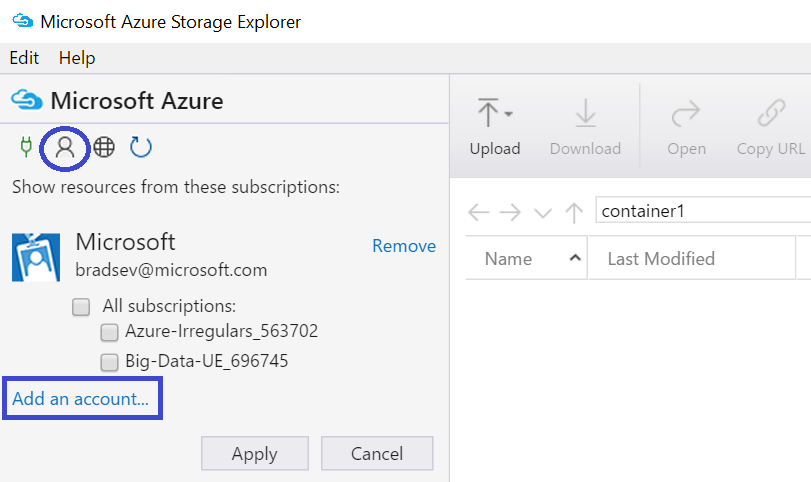
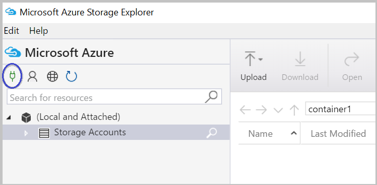

<properties 
    pageTitle="Mover de dados e armazenamento de Blob do Azure usando o Gerenciador de armazenamento do Azure | Microsoft Azure" 
    description="Mover de dados e armazenamento de Blob do Azure usando o Gerenciador de armazenamento do Azure" 
    services="machine-learning,storage" 
    documentationCenter="" 
    authors="bradsev" 
    manager="jhubbard" 
    editor="cgronlun" />

<tags 
    ms.service="machine-learning" 
    ms.workload="data-services" 
    ms.tgt_pltfrm="na" 
    ms.devlang="na" 
    ms.topic="article" 
    ms.date="08/31/2016"
    ms.author="bradsev" />

# Mover de dados e armazenamento de Blob do Azure usando o Gerenciador de armazenamento do Azure

Azure Storage Explorer é uma ferramenta gratuita da Microsoft que permite a você trabalhar com dados de armazenamento do Azure em Windows, macOS e Linux. Este tópico descreve como usá-lo para carregar e baixar dados do armazenamento de blob do Microsoft Azure. A ferramenta pode ser baixada do [Microsoft Azure Storage Explorer](http://storageexplorer.com/).

Orientação sobre tecnologias usadas para mover dados para e/ou do armazenamento de Blob do Azure estão vinculados aqui:
 
[AZURE.INCLUDE [blob-storage-tool-selector](../../includes/machine-learning-blob-storage-tool-selector.md)]   

 
> [AZURE.NOTE] Se você estiver usando máquina virtual que foi configurado com os scripts fornecidos pela [máquinas virtuais de ciência de dados no Azure](machine-learning-data-science-virtual-machines.md), Gerenciador de armazenamento do Azure já está instalado na VM.
 
> [AZURE.NOTE] Para obter uma introdução completa ao Azure blob storage, consulte [Noções básicas de Blob do Azure](../storage/storage-dotnet-how-to-use-blobs.md) e [Serviço de Blob do Azure](https://msdn.microsoft.com/library/azure/dd179376.aspx).   

## Pré-requisitos

Este documento pressupõe que você tenha uma assinatura do Azure, uma conta de armazenamento e a chave de armazenamento correspondente para essa conta. Antes de carregar/baixar dados, você deve saber a sua chave de nome e uma conta da conta armazenamento do Azure. 

- Para configurar uma assinatura do Azure, consulte [avaliação gratuita de um mês](https://azure.microsoft.com/pricing/free-trial/).
- Para obter instruções sobre como criar uma conta de armazenamento e para obter informações importantes e conta, consulte [contas de armazenamento do Azure sobre](../storage/storage-create-storage-account.md). Anote a tecla de acesso para sua conta de armazenamento precisar esta chave para se conectar à conta com a ferramenta de Gerenciador de armazenamento do Azure.
- A ferramenta de Azure Storage Explorer pode ser baixada do [Microsoft Azure Storage Explorer](http://storageexplorer.com/). Aceite os padrões durante a instalação.

## Usar o Explorador de armazenamento do Azure 

As etapas a seguir mostram a forma de carregamento/download dados usando o Gerenciador de armazenamento do Azure. 

1.  Inicie o Gerenciador de armazenamento do Microsoft Azure.
2.  Para exibir o Assistente de **entrar em sua conta...** , selecione o ícone de **configurações de conta do Azure** , em seguida, **Adicionar uma conta** e insira a você credenciais. 
3.  Para exibir o Assistente de **conectar ao armazenamento Azure** , selecione o ícone de **conectar ao armazenamento do Azure** . 
4. Insira a chave de acesso da sua conta de armazenamento do Azure nos assistente **conectar ao armazenamento do Azure** e clique em seguida **Avançar**. 
5. Digite o nome de conta de armazenamento na caixa **nome da conta** e selecione **Avançar**. 
6. A conta de armazenamento adicionada agora deve estar listada. Para criar um contêiner de blob em uma conta de armazenamento, clique com botão direito no nó de **Contêineres de Blob** nessa conta, selecione **Criar contêiner de Blob**e insira um nome.
7. Para carregar dados em um contêiner, selecione o contêiner de destino e clique no botão **carregar** .
8. Clique em **…** à direita da caixa de **arquivos** , selecione um ou vários arquivos para carregar do sistema de arquivos e clique em **carregar** para começar a carregar os arquivos.
7. Para fazer o download de dados, selecionando o blob no contêiner de correspondente download e clique em **Baixar**. 

