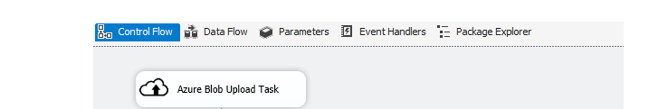

<properties
    pageTitle="Mover dados para ou do armazenamento de Blob do Azure usando SSIS conectores | Microsoft Azure"
    description="Mova dados para ou do armazenamento de Blob do Azure usando SSIS conectores."
    services="machine-learning,storage"
    documentationCenter=""
    authors="bradsev"
    manager="jhubbard"
    editor="cgronlun" />

<tags
    ms.service="machine-learning"
    ms.workload="data-services"
    ms.tgt_pltfrm="na"
    ms.devlang="na"
    ms.topic="article"
    ms.date="09/14/2016"
    ms.author="bradsev" />

# Mover dados para ou do armazenamento de Blob do Azure usando SSIS conectores

O [SQL Server Integration Services Feature Pack para Azure](https://msdn.microsoft.com/library/mt146770.aspx) fornece componentes para se conectar ao Azure, transferir dados entre Azure e fontes de dados locais e processar dados armazenados no Azure.

Orientação sobre tecnologias usadas para mover dados para e/ou do armazenamento de Blob do Azure estão vinculados aqui:

[AZURE.INCLUDE [blob-storage-tool-selector](../../includes/machine-learning-blob-storage-tool-selector.md)]

Depois que os clientes foram movidos dados locais na nuvem, elas possam acessá-lo de qualquer serviço Azure para aproveitar todo o potencial do conjunto de tecnologias Azure. Ele pode ser usado, por exemplo, em aprendizado de máquina do Azure ou em um cluster de HDInsight.

Isso costuma ser a primeira etapa para as instruções [SQL](machine-learning-data-science-process-sql-walkthrough.md) e [HDInsight](machine-learning-data-science-process-hive-walkthrough.md) .

Para uma discussão canônica cenários que usar SSIS para realizar as necessidades de negócios comuns em cenários de integração de dados híbridos, consulte blog de [fazer mais com o SQL Server Integration Services Feature Pack para Azure](http://blogs.msdn.com/b/ssis/archive/2015/06/25/doing-more-with-sql-server-integration-services-feature-pack-for-azure.aspx) .

> [AZURE.NOTE] Para obter uma introdução completa ao Azure blob storage, consulte [Noções básicas de Blob do Azure](../storage/storage-dotnet-how-to-use-blobs.md) e [Azure Blob](https://msdn.microsoft.com/library/azure/dd179376.aspx)serviço.

## Pré-requisitos

Para realizar as tarefas descritas neste artigo, você deve ter uma assinatura do Azure e uma conta de armazenamento do Azure configurada. Você precisa saber a sua chave de nome e uma conta da conta de armazenamento do Azure para carregar ou baixar dados.

- Para configurar uma **assinatura do Azure**, consulte [avaliação gratuita de um mês](https://azure.microsoft.com/pricing/free-trial/).

- Para obter instruções sobre como criar uma **conta de armazenamento** e para obter informações importantes e conta, consulte [contas de armazenamento do Azure sobre](../storage/storage-create-storage-account.md).

Para usar os **conectores SSIS**, você deve baixar:

- **2014 do SQL Server ou padrão de 2016 (ou acima)**: instalação inclui o SQL Server Integration Services.
- **Microsoft SQL Server 2014 ou 2016 Integration Services Feature Pack para Azure**: esses podem ser baixados, respectivamente, em páginas de [Serviços de integração de 2014 do SQL Server](http://www.microsoft.com/download/details.aspx?id=47366) e [SQL Server 2016 Integration Services](https://www.microsoft.com/download/details.aspx?id=49492) .

> [AZURE.NOTE] SSIS está instalado com o SQL Server, mas não está incluído na versão Express. Para obter informações sobre quais aplicativos estão incluídos em várias edições do SQL Server, consulte [Edições do SQL Server](http://www.microsoft.com/en-us/server-cloud/products/sql-server-editions/)

Para material de treinamento sobre SSIS, consulte [Mãos no treinamento para SSIS](http://www.microsoft.com/download/details.aspx?id=20766)

Para obter informações sobre como obter up em funcionamento usando SISS para compilar simples extração, transformação e pacotes de carga (ETL), consulte [SSIS Tutorial: criar um pacote de ETL simples](https://msdn.microsoft.com/library/ms169917.aspx).

## Baixar o conjunto de dados NYC táxi  
O exemplo descrito aqui use um conjunto de dados publicamente disponível – dataset [NYC táxi viagens](http://www.andresmh.com/nyctaxitrips/) . O conjunto de dados consiste em magia de táxi cerca de 173 milhões em NYC no ano 2013. Há dois tipos de dados: dados e passagens dados de detalhes de viagem. Como existe um arquivo para cada mês, temos 24 arquivos em todos, cada um dos quais é de aproximadamente 2GB descompactado.

## Carregar dados ao Azure blob storage
Para mover dados usando o SSIS recurso pacote do local de armazenamento de blob do Microsoft Azure, podemos usar uma instância da [**Tarefa de carregamento do Azure Blob**](https://msdn.microsoft.com/library/mt146776.aspx), mostrado aqui:

Os parâmetros que usa a tarefa são descritos aqui:

Campo|Descrição|
----------------------|----------------|
**AzureStorageConnection**|Especifica um Gerenciador de Conexão de armazenamento do Azure existente ou cria uma nova que se refere a uma conta de armazenamento do Azure que aponta para onde os arquivos de blob são hospedados.|
**BlobContainer**|Especifica o nome do recipiente de blob que mantenha os arquivos carregados como blobs.|
**BlobDirectory**|Especifica o diretório de blob onde o arquivo carregado está armazenado como um blob de bloco. O diretório de blob é uma estrutura hierárquica virtual. Se o blob já existir, it ia substituído.|
**LocalDirectory**|Especifica o diretório local que contém os arquivos a ser carregado.|
**Nome do arquivo**|Especifica um filtro de nome para selecionar arquivos com o padrão de nome especificado. Por exemplo, MySheet\*. xls\* inclui arquivos como MySheet001.xls e MySheetABC.xlsx|
**TimeRangeFrom/TimeRangeTo**|Especifica um filtro de intervalo de tempo. Arquivos modificada após *TimeRangeFrom* e antes de *TimeRangeTo* estão incluídos.|

> [AZURE.NOTE] As credenciais de **AzureStorageConnection** precisam estar corretos e o **BlobContainer** deve existir antes de tentar a transferência.

## Baixar dados do armazenamento de blob do Microsoft Azure

Para baixar dados do armazenamento de blob do Microsoft Azure para armazenamento com SSIS no local, use uma instância da [Tarefa de carregamento do Azure Blob](https://msdn.microsoft.com/library/mt146779.aspx).

##Cenários de SSIS Azure mais avançados
Estamos aqui Observe que o SSIS feature pack permite para fluxos mais complexos sejam tratadas por tarefas de empacotamento juntos. Por exemplo, os dados de blob poderiam feed diretamente em um cluster de HDInsight, cuja saída pôde ser baixada novamente para um blob e, em seguida, no local armazenamento. SSIS pode executar trabalhos de seção e porco em um cluster de HDInsight usando conectores SSIS adicionais:

- Para executar um script de seção em um cluster de Azurehdinsight com SSIS, use [Azure HDInsight seção tarefa](https://msdn.microsoft.com/library/mt146771.aspx).
- Para executar um script de porco em um cluster de Azurehdinsight com SSIS, use [Azure HDInsight porco tarefa](https://msdn.microsoft.com/library/mt146781.aspx).
