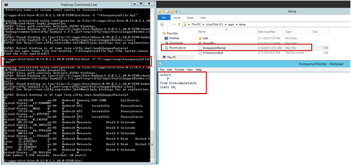

<properties
    pageTitle="Criar e carregar dados em tabelas de seção do armazenamento de Blob | Microsoft Azure"
    description="Criar tabelas de seção e carregar dados no blob à seção tabelas"
    services="machine-learning,storage"
    documentationCenter=""
    authors="bradsev"
    manager="jhubbard"
    editor="cgronlun" />

<tags
    ms.service="machine-learning"
    ms.workload="data-services"
    ms.tgt_pltfrm="na"
    ms.devlang="na"
    ms.topic="article"
    ms.date="09/14/2016"
    ms.author="bradsev" />

#Criar e carregar dados em tabelas de seção de armazenamento de blob do Microsoft Azure

Este tópico apresenta genéricas consultas de seção que criar tabelas de seção e carregar dados do armazenamento de blob do Microsoft Azure. Algumas diretrizes também é fornecida na partição tabelas de seção e sobre como usar o otimizado linha colunas (ORC) a formatação para melhorar o desempenho da consulta.

Este **menu** fornece links para tópicos que descrevem como a inclusão de dados em ambientes de destino onde os dados podem ser armazenados e processados durante o processo de ciência do equipe dados (TDSP).

[AZURE.INCLUDE [cap-ingest-data-selector](../../includes/cap-ingest-data-selector.md)]

## Pré-requisitos
Este artigo pressupõe que você tenha:

* Criar uma conta de armazenamento do Azure. Se precisar de instruções, consulte [contas de armazenamento do Azure sobre](../storage/storage-create-storage-account.md). 
* Provisionado um cluster Hadoop personalizados com o serviço de HDInsight.  Se precisar de instruções, consulte [clusters de personalizar o Azure HDInsight Hadoop para análise avançada](machine-learning-data-science-customize-hadoop-cluster.md).
* Acesso remoto habilitado ao cluster, conectado e aberto no console de linha de comando do Hadoop. Se precisar de instruções, consulte [acessar o nó de cabeça do Hadoop Cluster](machine-learning-data-science-customize-hadoop-cluster.md#headnode).

## Carregar dados ao Azure blob storage
Se você criou uma máquina virtual Azure seguindo as instruções fornecidas em [Configurar uma máquina virtual Azure para análise avançada](machine-learning-data-science-setup-virtual-machine.md), esse arquivo de script deve ter foram baixado para a *c:\\usuários\\\<nome de usuário\>\\documentos\\Scripts de ciência de dados* diretório na máquina virtual. Essas consultas de seção só exigem que você conecte seu próprio esquema de dados e a configuração de armazenamento de blob do Microsoft Azure nos campos apropriados esteja pronto para envio.

Vamos supor que os dados de tabelas de seção estão em um formato tabular **descompactado** e que os dados são carregados para o padrão (ou para uma adicional) contêiner da conta de armazenamento usada pelo cluster Hadoop.

Se você quiser praticar **NYC táxi viagem de dados**, você precisa:

- arquivos de [Dados de viagem de táxi NYC](http://www.andresmh.com/nyctaxitrips) **Baixar** a 24 (12 arquivos de viagem e 12 arquivos de tarifa),
- **Descompacte** todos os arquivos em arquivos. csv e então
- **carregue** -os para o padrão (ou recipiente apropriado) da conta de armazenamento do Azure que foi criada pelo procedimento descrito no tópico [clusters de personalizar o Azure HDInsight Hadoop do processo de análise avançada e tecnologia](machine-learning-data-science-customize-hadoop-cluster.md) . O processo de carregar os arquivos. csv para o contêiner padrão da conta de armazenamento pode ser encontrado nesta [página](machine-learning-data-science-process-hive-walkthrough.md#upload).

## Como enviar consultas de seção

Consultas de seção podem ser enviadas usando:

1. [Enviar consultas de seção por meio de linha de comando do Hadoop em headnode do Hadoop cluster](#headnode)
2. [Enviar consultas de seção com o Editor de seção](#hive-editor)
3. [Enviar consultas de seção com comandos do PowerShell do Azure](#ps)

Consultas de seção são semelhantes a SQL. Se você estiver familiarizado com SQL, talvez útil a [seção de folha de roteiro de usuários de SQL](http://hortonworks.com/wp-content/uploads/2013/05/hql_cheat_sheet.pdf) .

Ao enviar uma consulta de seção, você também pode controlar o destino da saída do consultas de seção, se você na tela ou para um arquivo local no nó principal ou um Azure blob.

###1. enviar consultas de seção por meio de linha de comando do Hadoop em headnode do Hadoop cluster

Se a consulta de seção é complexa, enviá-la diretamente no nó principal do Hadoop cluster normalmente leva para ativar mais rápido em torno de enviá-la com um Editor de seção ou Azure PowerShell scripts.

Faça logon no nó principal do cluster Hadoop, abra a linha de comando do Hadoop da área de trabalho do nó principal e digite o comando `cd %hive_home%\bin`.

Você tem três maneiras de enviar consultas de seção na linha de comando Hadoop:

* diretamente
* usando arquivos de .hql
* com o console de comando de seção

#### Envie consultas de seção diretamente no Hadoop linha de comando.

Você pode executar o comando como `hive -e "<your hive query>;` para enviar consultas de seção simples diretamente no Hadoop linha de comando. Aqui está um exemplo, onde a caixa vermelha descreve o comando que envia a consulta de seção, e a caixa verde destaca a saída da consulta seção.

#### Enviar consultas de seção em arquivos de .hql

Quando a consulta de seção é mais complicada e tem várias linhas, a edição de consultas no console de comando de seção ou de linha de comando não é prático. Uma alternativa é usar um editor de texto no nó principal do cluster Hadoop para salvar as consultas de seção em um arquivo de .hql em um diretório local do nó principal. Depois que a consulta de seção no arquivo .hql pode ser enviada usando o `-f` argumento da seguinte forma:

    hive -f "<path to the .hql file>"

**Suprimir a impressão de tela de status de progresso de consultas de seção**

Por padrão, depois de consulta de seção é enviada na linha de comando do Hadoop, o andamento do trabalho mapa/reduzir é impresso na tela. Para suprimir a impressão de tela do andamento do trabalho de mapa/reduzir, você pode usar o argumento `-S` ("S" em letras maiusculas) no comando linha da seguinte maneira:

    hive -S -f "<path to the .hql file>"
    hive -S -e "<Hive queries>"

#### Envie consultas de seção no console de comando de seção.

Você pode inserir também primeiro no console de comando seção executando comando `hive` na linha de comando do Hadoop e, em seguida, enviar consultas de seção no console de comando de seção. Aqui está um exemplo. Neste exemplo, as duas caixas vermelhas realçar os comandos usados para entrar no console de comando de seção e a consulta de seção submetidos no console de comando de seção, respectivamente. A caixa verde realça a saída da consulta seção.

Os exemplos anteriores saída diretamente os resultados da consulta de seção na tela. Você também pode escrever a saída para um arquivo local no nó principal, ou para um blob do Microsoft Azure. Em seguida, você pode usar outras ferramentas para analisar ainda mais o resultado de consultas de seção.

**Resultados de consulta de seção em um arquivo local de saída.**

Para exibir resultados de consulta de seção em um diretório local no nó principal, você deve enviar a consulta de seção na linha de comando Hadoop da seguinte maneira:

    hive -e "<hive query>" > <local path in the head node>

No exemplo a seguir, a saída da consulta de seção é gravada em um arquivo `hivequeryoutput.txt` no diretório `C:\apps\temp`.

**Resultados de consulta de seção de saída para um blob do Microsoft Azure**

Você também pode produzir os resultados de consulta de seção para um blob Azure, dentro do contêiner de padrão do cluster Hadoop. A consulta de seção para isso é a seguinte:

    insert overwrite directory wasb:///<directory within the default container> <select clause from ...>

No exemplo a seguir, a saída da consulta de seção escrita em um diretório de blob `queryoutputdir` dentro do contêiner de padrão do cluster Hadoop. Aqui, você só precisa fornecer o nome do diretório, sem o nome do blob. Um erro é lançado, caso você fornecer nomes de diretório e blob, tais como `wasb:///queryoutputdir/queryoutput.txt`.

Se você abrir o recipiente padrão do cluster Hadoop usando o Gerenciador de armazenamento do Azure, você pode ver a saída da consulta seção conforme mostrado na figura a seguir. Você pode aplicar o filtro (realçado com caixa vermelha) para recuperar somente o blob com letras especificadas em nomes.

###2. enviar consultas de seção com o Editor de seção

Você também pode usar o Console de consulta (Editor de seção) por meio de uma URL do formulário *https://&#60; Nome do Hadoop cluster >.azurehdinsight.net/Home/HiveEditor* em um navegador da web. Você deve estar conectado a ver esse console e então você precisa suas credenciais de cluster Hadoop aqui.

###3. enviar consultas de seção com comandos do PowerShell do Azure

Você também pode usar o PowerShell para enviar consultas de seção. Para obter instruções, consulte [Enviar seção trabalhos usando o PowerShell](../hdinsight/hdinsight-submit-hadoop-jobs-programmatically.md#hive-powershell).

## Criar tabelas e o banco de dados de seção

As consultas de seção são compartilhadas no [repositório de Github](https://github.com/Azure/Azure-MachineLearning-DataScience/tree/master/Misc/DataScienceProcess/DataScienceScripts/sample_hive_create_db_tbls_load_data_generic.hql) e podem ser baixadas de lá.

Aqui está a consulta de seção que cria uma tabela de seção.

    create database if not exists <database name>;
    CREATE EXTERNAL TABLE if not exists <database name>.<table name>
    (
        field1 string,
        field2 int,
        field3 float,
        field4 double,
        ...,
        fieldN string
    )
    ROW FORMAT DELIMITED FIELDS TERMINATED BY '<field separator>' lines terminated by '<line separator>'
    STORED AS TEXTFILE LOCATION '<storage location>' TBLPROPERTIES("skip.header.line.count"="1");

Aqui estão as descrições dos campos que você precisa plug-in e outras configurações:

- **& #60; o nome do banco de dados >**: o nome do banco de dados que você deseja criar. Se você quiser usar o banco de dados padrão, a consulta *Criar … banco de dados* pode ser omitido.
- **& #60; o nome da tabela >**: o nome da tabela na qual você deseja criar no banco de dados especificado. Se você quiser usar o banco de dados padrão, a tabela pode ser chamada diretamente por *& #60; o nome da tabela >* sem & #60; o nome do banco de dados >.
- **& #60; separador de campo >**: o separador que delimita campos no arquivo de dados a ser carregado para a tabela de seção.
- **& #60; separador de linha >**: o separador que delimita linhas no arquivo de dados.
- **& #60; local de armazenamento >**: o local de armazenamento do Azure para salvar os dados das tabelas de seção. Se você não especificar *local & #60; local de armazenamento >*, o banco de dados e as tabelas são armazenadas em *seção/depósito/* diretório no contêiner padrão do cluster seção por padrão. Se desejar especificar o local de armazenamento, o local de armazenamento deve ser dentro do contêiner de padrão para o banco de dados e tabelas. Esse local tem a ser referida como local relativo o recipiente padrão do cluster no formato de *' wasb: / / / & #60; diretório 1 > /'* ou *' wasb: / / / & #60; diretório 1 > / & #60; diretório 2 > /'*, etc. Depois que a consulta é executada, os diretórios relativos são criados dentro do contêiner de padrão.
- **TBLPROPERTIES("Skip.Header.line.Count"="1")**: se o arquivo de dados tiver uma linha de cabeçalho, você precisa adicionar essa propriedade **no final** da consulta *criar tabela* . Caso contrário, a linha de cabeçalho é carregada como um registro à tabela. Se o arquivo de dados não tiver uma linha de cabeçalho, essa configuração pode ser omitida na consulta.

## Carregar dados a tabelas de seção
Aqui está a consulta de seção que carrega os dados em uma tabela de seção.

    LOAD DATA INPATH '<path to blob data>' INTO TABLE <database name>.<table name>;

- **& #60; caminho para dados blob >**: se o arquivo de blob a ser carregado para a tabela de seção no contêiner padrão do cluster HDInsight Hadoop, o *& #60; caminho para dados blob >* deve estar no formato *' wasb: / / / & #60; diretório neste contêiner > / & #60; nome de arquivo do blob >'*. O arquivo de blob também pode ser um contêiner de adicionais do cluster HDInsight Hadoop. Nesse caso, *& #60; caminho para dados blob >* deve estar no formato *' wasb: / / & #60; contêiner name>@&#60;storage nome da conta >.blob.core.windows.net/ & #60; nome de arquivo do blob >'*.

    >[AZURE.NOTE] Os dados de blob a ser carregado seção tabela deve ser no padrão ou o contêiner adicional da conta de armazenamento para o cluster Hadoop. Caso contrário, a consulta de *Dados de carga* falhará reclamações que ele não consegue acessar os dados.

## Tópicos avançados: particionado tabela e armazenar dados de seção no formato ORC

Se os dados forem grandes, partição a tabela é útil para consultas que só precisam digitalizar alguns partições da tabela. Por exemplo, é aconselhável partição os dados do log de um site por datas.

Além de partição tabelas de seção, também é útil armazenar os dados de seção no formato de linha de otimizado colunas (ORC). Para obter mais informações sobre formatação de ORC, consulte <a href="https://cwiki.apache.org/confluence/display/Hive/LanguageManual+ORC#LanguageManualORC-ORCFiles" target="_blank">usando ORC arquivos melhora o desempenho quando a seção é ler, gravar e processar dados</a>.

### Tabela particionada
Aqui está a consulta de seção que cria uma tabela particionada e carrega dados nele.

    CREATE EXTERNAL TABLE IF NOT EXISTS <database name>.<table name>
    (field1 string,
    ...
    fieldN string
    )
    PARTITIONED BY (<partitionfieldname> vartype) ROW FORMAT DELIMITED FIELDS TERMINATED BY '<field separator>'
         lines terminated by '<line separator>' TBLPROPERTIES("skip.header.line.count"="1");
    LOAD DATA INPATH '<path to the source file>' INTO TABLE <database name>.<partitioned table name>
        PARTITION (<partitionfieldname>=<partitionfieldvalue>);

Ao consultar tabelas particionadas, é recomendável adicionar a condição de partição no **começo** do `where` cláusula como isso melhora a eficácia da pesquisa significativamente.

    select
        field1, field2, ..., fieldN
    from <database name>.<partitioned table name>
    where <partitionfieldname>=<partitionfieldvalue> and ...;

### Armazenar dados de seção no formato ORC

Diretamente você não pode carregar os dados do armazenamento de blob em tabelas de seção que está armazenado no formato ORC. Aqui estão as etapas que você precisa tomar para carregar dados do Azure blobs a seção tabelas armazenadas no formato ORC.

Crie um tabela externa **ARMAZENADO como de arquivo de texto** e carregar dados do armazenamento de blob à tabela.

        CREATE EXTERNAL TABLE IF NOT EXISTS <database name>.<external textfile table name>
        (
            field1 string,
            field2 int,
            ...
            fieldN date
        )
        ROW FORMAT DELIMITED FIELDS TERMINATED BY '<field separator>'
            lines terminated by '<line separator>' STORED AS TEXTFILE
            LOCATION 'wasb:///<directory in Azure blob>' TBLPROPERTIES("skip.header.line.count"="1");

        LOAD DATA INPATH '<path to the source file>' INTO TABLE <database name>.<table name>;

Criar uma tabela interna com o mesmo esquema que a tabela externa na etapa 1, com o mesmo delimitador de campo e armazenar os dados de seção no formato ORC.

        CREATE TABLE IF NOT EXISTS <database name>.<ORC table name>
        (
            field1 string,
            field2 int,
            ...
            fieldN date
        )
        ROW FORMAT DELIMITED FIELDS TERMINATED BY '<field separator>' STORED AS ORC;

Selecione os dados da tabela externa na etapa 1 e inserir na tabela ORC

        INSERT OVERWRITE TABLE <database name>.<ORC table name>
            SELECT * FROM <database name>.<external textfile table name>;

>[AZURE.NOTE] Se a tabela de arquivo de texto *& #60; o nome do banco de dados >. & #60; o nome da tabela de arquivo de texto externo >* tem partições, na etapa 3, o `SELECT * FROM <database name>.<external textfile table name>` comando seleciona a variável de partição como um campo no conjunto de dados retornado. Inserindo ao *& #60; o nome do banco de dados >. & #60; o nome da tabela ORC >* falha desde *& #60; o nome do banco de dados >. & #60; o nome da tabela ORC >* não tem a variável de partição como um campo no esquema de tabela. Nesse caso, você precisa especificamente, selecione os campos que serão inseridos à *& #60; o nome do banco de dados >. & #60; o nome da tabela ORC >* da seguinte maneira:

        INSERT OVERWRITE TABLE <database name>.<ORC table name> PARTITION (<partition variable>=<partition value>)
           SELECT field1, field2, ..., fieldN
           FROM <database name>.<external textfile table name>
           WHERE <partition variable>=<partition value>;

Ele é seguro para soltar a *& #60; o nome da tabela de arquivo de texto externo >* quando usando a seguinte consulta após todos os dados foi inserido na *& #60; o nome do banco de dados >. & #60; o nome da tabela ORC >*:

        DROP TABLE IF EXISTS <database name>.<external textfile table name>;

Depois de seguir este procedimento, você deve ter uma tabela com dados no formato ORC pronto para uso.  
