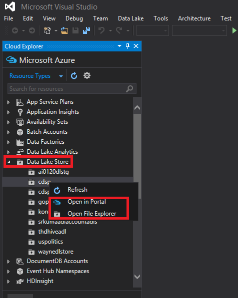
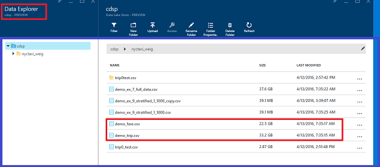
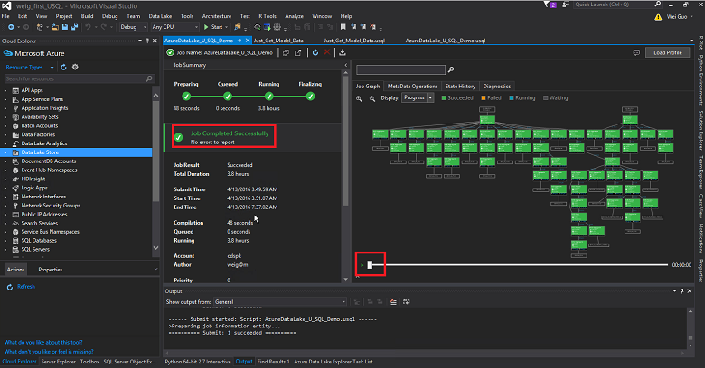
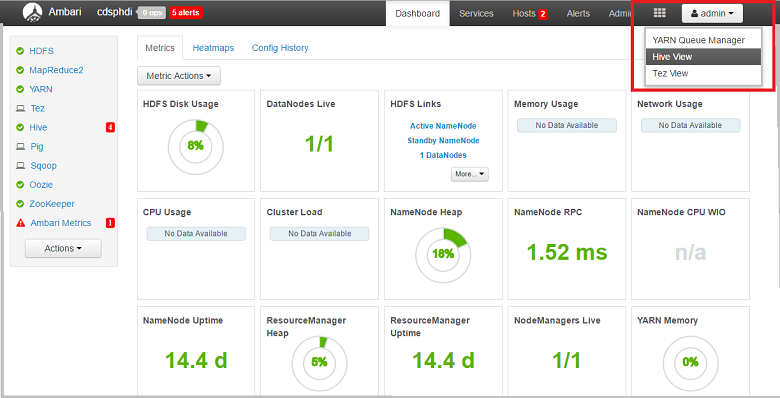
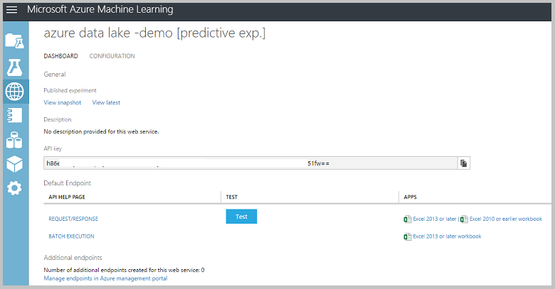

<properties
    pageTitle="Scalable ciência de dados no Azure dados Lucerne: uma passo a passo de ponta a ponta | Microsoft Azure"
    description="Como usar Lucerne de dados do Azure para realizar tarefas de classificação binário e exploração de dados em um conjunto de dados."  
    services="machine-learning"
    documentationCenter=""
    authors="bradsev"
    manager="jhubbard"
    editor="cgronlun" />

<tags
    ms.service="machine-learning"
    ms.workload="data-services"
    ms.tgt_pltfrm="na"
    ms.devlang="na"
    ms.topic="article"
    ms.date="09/19/2016"
    ms.author="bradsev;weig"/>

# Scalable ciência de dados no Azure dados Lucerne: uma passo a passo de ponta a ponta

Este passo a passo mostra como usar Lucerne de dados do Azure para executar tarefas de classificação binária em uma amostra da viagem táxi NYC e exploração de dados e passagens dataset para prever estando ou não uma dica será pago por uma tarifa. Ele orienta você pelas etapas do [Processo de ciência de dados de equipe](http://aka.ms/datascienceprocess), de ponta a ponta, de aquisição de dados para modelar treinamento e, em seguida, para a implantação de um serviço web que publica o modelo.

### Dados Azure Lucerne Analytics

[Lucerne de dados do Microsoft Azure](https://azure.microsoft.com/solutions/data-lake/) tem todos os recursos necessários para tornar mais fácil para cientistas de dados para armazenar dados de qualquer tamanho, a forma e a velocidade e para realizar processamento de dados, análise avançada e modelagem de aprendizagem com alta escalabilidade de uma maneira econômica de máquina.   Pagar uma base por trabalho, apenas quando dados realmente está sendo processados. Análise de Lucerne dados Azure inclui U-SQL, uma linguagem que combina a natureza declarativa do SQL com expressive potência c# para fornecer scalable distribuído com o recurso de consulta. Ele permite processar dados não estruturados, aplicando esquema na leitura, inserir lógica personalizada e funções definidas pelo usuário (UDFs) e inclui extensibilidade para habilitar o controle fino refinado sobre como executar em escala. Para saber mais sobre a filosofia de design por trás U-SQL, consulte a [postagem de blog do Visual Studio](https://blogs.msdn.microsoft.com/visualstudio/2015/09/28/introducing-u-sql-a-language-that-makes-big-data-processing-easy/).

Lucerne a análise de dados também é uma parte fundamental da Cortana Analytics Suite e funciona com depósito de dados do SQL Azure, Power BI e fábrica de dados. Isso lhe permite uma plataforma de análise avançada e dados de grande de nuvem concluída.

Este passo a passo começa descrevendo os pré-requisitos e recursos que são necessários para concluir as tarefas com dados Lucerne Analytics que formam o processo de ciência de dados e como instalá-los. Ele descreve as etapas de processamento de dados usando o U-SQL e conclui mostrando como usar Python e seção com Studio de aprendizado de máquina Azure para construir e implantar modelos de previsão. 

### U-SQL e o Visual Studio

Este passo a passo recomenda usando o Visual Studio para editar scripts U-SQL para processar o conjunto de dados. Os scripts SQL U são descritos aqui e fornecidos em um arquivo separado. O processo inclui a inclusão, explorar e os dados de amostra. Ele também mostra como executar um trabalho U-SQL script do portal do Azure. Tabelas de seção são criadas para os dados em um cluster de HDInsight associado para facilitar a construção e a implantação de um modelo de classificação binária no Azure Studio de aprendizado de máquina.  

### Python

Este passo a passo também contém uma seção que mostra como criar e implantar um modelo de previsão usando Python com o Azure Studio de aprendizado de máquina.  Fornecemos um bloco de anotações de Jupyter com os scripts Python para essas etapas nesse processo. O bloco de anotações inclui código para alguns recursos adicionais engenharia etapas e modelos de construção como classificação multiclass e regressão modelagem além o modelo de classificação binária descrito aqui. A tarefa de regressão é prever a quantidade de dica com base em outros recursos de dica. 

### Aprendizado de máquina Azure
Azure Studio de aprendizado de máquina é usado para criar e implantar modelos de previsão. Isso é feito usando duas abordagens: primeiro com scripts Python e, em seguida, tabelas de seção em um cluster de HDInsight (Hadoop).

### Scripts

Somente as principais etapas são descritas neste passo a passo. Você pode baixar o completo **script U-SQL** e o **Bloco de anotações de Jupyter** do [GitHub](https://github.com/Azure/Azure-MachineLearning-DataScience/tree/master/Misc/AzureDataLakeWalkthrough).

## Pré-requisitos

Antes de começar estes tópicos, você deve ter o seguinte:

- Uma assinatura do Azure. Se você ainda não tiver uma, consulte [avaliação gratuita do Azure obter](https://azure.microsoft.com/documentation/videos/get-azure-free-trial-for-testing-hadoop-in-hdinsight/).

- [Recomendável] Visual Studio 2013 ou 2015. Se você ainda não tiver uma dessas versões instaladas, você poderá baixar uma Community edition gratuita de [aqui](https://www.visualstudio.com/visual-studio-homepage-vs.aspx). Clique no botão **Baixar comunidade 2015** sob a seção de Visual Studio. 

>[AZURE.NOTE] Em vez de Visual Studio, você também pode usar o Portal do Azure para enviar consultas de Lucerne de dados do Azure. Fornecemos instruções sobre como fazer isso tanto com o Visual Studio e no portal na seção intitulada **dados de processo com U-SQL**. 

- A inscrição no Azure dados Lucerne Preview

>[AZURE.NOTE] Você precisa obter aprovação para usar o Azure dados Lucerne Store (ADLS) e Azure dados Lucerne Analytics (ADLA) como esses serviços estão no modo de visualização. Você será solicitado a inscrever-se ao criar sua primeira ADLS ou ADLA. Para sigh para cima, clique em **inscrever-se para visualizar**, leia o contrato e clique em **Okey**. Aqui, por exemplo, é a página de inscrição do ADLS:

 

## Preparar o ambiente de ciência de dados para Lucerne de dados do Azure
Para preparar o ambiente de ciência de dados para este passo a passo, crie os seguintes recursos:

- Armazenamento de Lucerne de dados do Azure (ADLS) 
- Dados Azure Lucerne Analytics (ADLA)
- Conta de armazenamento de Blob Azure
- Conta do Microsoft Azure Studio de aprendizado de máquina
- Ferramentas de Lucerne de dados do Azure para Visual Studio (recomendado)

Esta seção fornece instruções sobre como criar cada um desses recursos. Se você optar por usar tabelas de seção com aprendizado de máquina do Azure, em vez de Python, para criar um modelo, você também precisará provisionar um cluster de HDInsight (Hadoop). Esse procedimento alternativo em descritos na seção apropriada abaixo.
 
>AZURE. Observe o **Armazenamento do Azure dados Lucerne** podem ser criadas separadamente ou quando você cria a **Análise de Lucerne de dados do Azure** como o armazenamento padrão. Instruções referenciadas para a criação de cada um desses recursos separadamente, a seguir, mas a conta de armazenamento de dados Lucerne não precisa ser criada separadamente.
 
### Criar um repositório de Lucerne de dados do Azure

Crie um ADLS a partir do [Portal do Azure](http://portal.azure.com). Para obter detalhes, consulte [criar um cluster de HDInsight com armazenamento de Lucerne de dados usando o Portal do Azure](../data-lake-store/data-lake-store-hdinsight-hadoop-use-portal.md). Certifique-se de configurar a identidade de AAD Cluster na lâmina **DataSource** da lâmina **Configuração opcional** descrita lá. 

 

### Criar uma conta de análise de Lucerne de dados do Azure
Crie uma conta ADLA a partir do [Portal do Azure](http://portal.azure.com). Para obter detalhes, consulte [Tutorial: Introdução ao Azure dados Lucerne análise usando o Portal do Azure](../data-lake-analytics/data-lake-analytics-get-started-portal.md). 

 

### Criar uma conta de armazenamento de Blob do Azure
Crie uma conta de armazenamento de Blob do Azure a partir do [Portal do Azure](http://portal.azure.com). Para obter detalhes, consulte Criar uma seção de conta de armazenamento em [contas de armazenamento do Azure sobre](../storage/storage-create-storage-account.md).
    
 

### Configurar uma conta de Studio de aprendizado de máquina do Azure
Assinar superiores/no Azure Studio de aprendizado de máquina na página de [Aprendizado de máquina do Azure](https://azure.microsoft.com/services/machine-learning/) . Clique no botão **comece agora** e escolha uma "Gratuito Workspace" ou "Espaço de trabalho padrão". Depois disso, você poderá criar experiências no Azure ML Studio.  

### Instalar dados Azure Lucerne ferramentas [recomendável]
Instale ferramentas de Lucerne de dados do Azure para sua versão do Visual Studio de [Ferramentas de Lucerne de dados do Azure para Visual Studio](https://www.microsoft.com/download/details.aspx?id=49504).

 

Após a conclusão da instalação com êxito, abra o Visual Studio. Você deve ver a Lucerne de dados no menu na parte superior da guia. Seus recursos Azure deverão aparecer no painel esquerdo quando você entrar na sua conta do Azure.

 

## O conjunto de dados NYC táxi viagens
O conjunto de dados que usamos aqui é um conjunto de dados disponível publicamente - [NYC táxi viagens dataset](http://www.andresmh.com/nyctaxitrips/). Os dados de viagem de táxi NYC consistem em cerca de 20GB de arquivos CSV compactados (~ 48GB descompactado), mais de milhões de 173 individuais viagens e as tarifas de gravação pago para cada viagem. Cada registro de viagem inclui os locais retirada e redistribuição e horários, número de licença anonymized alteração (driver) e o número de medallion (identificação exclusiva do táxi). Os dados abrange todas as viagens no ano 2013 e são fornecidos em seguintes dois conjuntos de dados para cada mês:

 - 'trip_data' CSV contém detalhes de viagem, como o número de passageiros, retirada e redução pontos, duração da viagem e comprimento de viagem. Aqui estão alguns exemplos de registros:

        medallion,hack_license,vendor_id,rate_code,store_and_fwd_flag,pickup_datetime,dropoff_datetime,passenger_count, trip_time_in_secs,trip_distance,pickup_longitude,pickup_latitude,dropoff_longitude,dropoff_latitude
        89D227B655E5C82AECF13C3F540D4CF4,BA96DE419E711691B9445D6A6307C170,CMT,1,N,2013-01-01 15:11:48,2013-01-01 15:18:10,4,382,1.00,-73.978165,40.757977,-73.989838,40.751171
        0BD7C8F5BA12B88E0B67BED28BEA73D8,9FD8F69F0804BDB5549F40E9DA1BE472,CMT,1,N,2013-01-06 00:18:35,2013-01-06 00:22:54,1,259,1.50,-74.006683,40.731781,-73.994499,40.75066
        0BD7C8F5BA12B88E0B67BED28BEA73D8,9FD8F69F0804BDB5549F40E9DA1BE472,CMT,1,N,2013-01-05 18:49:41,2013-01-05 18:54:23,1,282,1.10,-74.004707,40.73777,-74.009834,40.726002
        DFD2202EE08F7A8DC9A57B02ACB81FE2,51EE87E3205C985EF8431D850C786310,CMT,1,N,2013-01-07 23:54:15,2013-01-07 23:58:20,2,244,.70,-73.974602,40.759945,-73.984734,40.759388
        DFD2202EE08F7A8DC9A57B02ACB81FE2,51EE87E3205C985EF8431D850C786310,CMT,1,N,2013-01-07 23:25:03,2013-01-07 23:34:24,1,560,2.10,-73.97625,40.748528,-74.002586,40.747868

 - O 'trip_fare' CSV contém detalhes da tarifa paga para cada viagem, como o tipo de pagamento, quantidade de tarifa, sobrecarga e impostos, dicas e pedágio e o valor total pago. Aqui estão alguns exemplos de registros:

        medallion, hack_license, vendor_id, pickup_datetime, payment_type, fare_amount, surcharge, mta_tax, tip_amount, tolls_amount, total_amount
        89D227B655E5C82AECF13C3F540D4CF4,BA96DE419E711691B9445D6A6307C170,CMT,2013-01-01 15:11:48,CSH,6.5,0,0.5,0,0,7
        0BD7C8F5BA12B88E0B67BED28BEA73D8,9FD8F69F0804BDB5549F40E9DA1BE472,CMT,2013-01-06 00:18:35,CSH,6,0.5,0.5,0,0,7
        0BD7C8F5BA12B88E0B67BED28BEA73D8,9FD8F69F0804BDB5549F40E9DA1BE472,CMT,2013-01-05 18:49:41,CSH,5.5,1,0.5,0,0,7
        DFD2202EE08F7A8DC9A57B02ACB81FE2,51EE87E3205C985EF8431D850C786310,CMT,2013-01-07 23:54:15,CSH,5,0.5,0.5,0,0,6
        DFD2202EE08F7A8DC9A57B02ACB81FE2,51EE87E3205C985EF8431D850C786310,CMT,2013-01-07 23:25:03,CSH,9.5,0.5,0.5,0,0,10.5

A chave exclusiva para participar de viagem\_dados e viagem\_passagens é composta dos seguintes três campos: medallion, ataques\_licença e retirada\_datetime. Os arquivos CSV brutos podem ser acessados de um blob de armazenamento do Azure público. O script de U-SQL para este junção é na seção [tabelas de viagem e passagens de junção](#join) .

## Processar dados com U-SQL

As tarefas de processamento de dados ilustradas nesta seção incluem a inclusão, a verificação de qualidade, explorar e os dados de amostra. Também vamos mostrar como participar de viagem e passagens tabelas. A seção final mostra executar um trabalho de script U-SQL do portal do Azure. Aqui estão links para cada subseção:

- [Inclusão de dados: ler dados do blob pública](#ingest)
- [Verificações de qualidade de dados](#quality)
- [Exploração de dados](#explore)
- [Participar de viagem e passagens tabelas](#join)
- [Amostra de dados](#sample)
- [Executar trabalhos de U-SQL](#run)

Os scripts SQL U são descritos aqui e fornecidos em um arquivo separado. Você pode baixar os **scripts U-SQL** de completo do [GitHub](https://github.com/Azure/Azure-MachineLearning-DataScience/tree/master/Misc/AzureDataLakeWalkthrough).

Para executar U-SQL, abrir o Visual Studio, clique **arquivo novo-->--> projeto**, escolha **U-SQL projeto**, um nome e salve-o para uma pasta.

>[AZURE.NOTE] É possível usar o Portal do Azure para executar U-SQL em vez de Visual Studio. Você pode navegar para o recurso de análise de Lucerne de dados do Azure no portal e enviar consultas diretamente, conforme ilustrado na figura a seguir.

### Inclusão de dados: Ler dados do blob pública

O local dos dados no Azure blob é referenciado como **wasb://container_name@blob_storage_account_name.blob.core.windows.net/blob_name** e podem ser extraídos usando **Extractors.Csv()**. Substitua seu próprio nome de contêiner e do nome de conta de armazenamento nos seguintes scripts para container_name@blob_storage_account_name no endereço wasb. Como os nomes de arquivo estão no mesmo formato, podemos usar **viagem\_data_ {\*\}. csv** ler em todos os arquivos de viagem 12. 

    ///Read in Trip data
    @trip0 =
        EXTRACT 
        medallion string,
        hack_license string,
        vendor_id string,
        rate_code string,
        store_and_fwd_flag string,
        pickup_datetime string,
        dropoff_datetime string,
        passenger_count string,
        trip_time_in_secs string,
        trip_distance string,
        pickup_longitude string,
        pickup_latitude string,
        dropoff_longitude string,
        dropoff_latitude string
    // This is reading 12 trip data from blob
    FROM "wasb://container_name@blob_storage_account_name.blob.core.windows.net/nyctaxitrip/trip_data_{*}.csv"
    USING Extractors.Csv();

Uma vez que existem cabeçalhos na primeira linha, precisamos remover os cabeçalhos e alterar os tipos de coluna para aqueles que apropriado. Podemos ambos salvar os dados processados Azure Lucerne para armazenamento de dados usando _ **swebhdfs://data_lake_storage_name.azuredatalakestorage.net/folder_name/file_name**ou ao armazenamento de Blob do Azure conta usando **wasb://container_name@blob_storage_account_name.blob.core.windows.net/blob_name**. 

    // change data types
    @trip =
        SELECT 
        medallion,
        hack_license,
        vendor_id,
        rate_code,
        store_and_fwd_flag,
        DateTime.Parse(pickup_datetime) AS pickup_datetime,
        DateTime.Parse(dropoff_datetime) AS dropoff_datetime,
        Int32.Parse(passenger_count) AS passenger_count,
        Double.Parse(trip_time_in_secs) AS trip_time_in_secs,
        Double.Parse(trip_distance) AS trip_distance,
        (pickup_longitude==string.Empty ? 0: float.Parse(pickup_longitude)) AS pickup_longitude,
        (pickup_latitude==string.Empty ? 0: float.Parse(pickup_latitude)) AS pickup_latitude,
        (dropoff_longitude==string.Empty ? 0: float.Parse(dropoff_longitude)) AS dropoff_longitude,
        (dropoff_latitude==string.Empty ? 0: float.Parse(dropoff_latitude)) AS dropoff_latitude
    FROM @trip0
    WHERE medallion != "medallion";

    ////output data to ADL
    OUTPUT @trip   
    TO "swebhdfs://data_lake_storage_name.azuredatalakestore.net/nyctaxi_folder/demo_trip.csv"
    USING Outputters.Csv(); 

    ////Output data to blob
    OUTPUT @trip   
    TO "wasb://container_name@blob_storage_account_name.blob.core.windows.net/demo_trip.csv"
    USING Outputters.Csv();  

Da mesma forma podemos ler os passagens em conjuntos de dados. Clique com botão direito do Azure dados Lucerne Store, você pode optar por examinar seus dados no **Portal do Azure--> Explorador de dados** ou o **Explorador de arquivos** dentro do Visual Studio. 

 

 

### Verificações de qualidade de dados

Depois de viagem e passagens tabelas tenham sido lidos em, verificações de qualidade de dados podem ser feitas da seguinte maneira. Os arquivos CSV resultantes podem ser saída para armazenamento de Blob do Azure ou armazenamento de Lucerne de dados do Azure. 

Encontre o número de medallions e número exclusivo do medallions:

    ///check the number of medallions and unique number of medallions
    @trip2 =
        SELECT
        medallion,
        vendor_id,
        pickup_datetime.Month AS pickup_month
        FROM @trip;
    
    @ex_1 =
        SELECT
        pickup_month, 
        COUNT(medallion) AS cnt_medallion,
        COUNT(DISTINCT(medallion)) AS unique_medallion
        FROM @trip2
        GROUP BY pickup_month;
        OUTPUT @ex_1   
    TO "wasb://container_name@blob_storage_account_name.blob.core.windows.net/demo_ex_1.csv"
    USING Outputters.Csv(); 

Encontre esses medallions que tinham mais de 100 viagens:

    ///find those medallions that had more than 100 trips
    @ex_2 =
        SELECT medallion,
               COUNT(medallion) AS cnt_medallion
        FROM @trip2
        //where pickup_datetime >= "2013-01-01t00:00:00.0000000" and pickup_datetime <= "2013-04-01t00:00:00.0000000"
        GROUP BY medallion
        HAVING COUNT(medallion) > 100;
        OUTPUT @ex_2   
    TO "wasb://container_name@blob_storage_account_name.blob.core.windows.net/demo_ex_2.csv"
    USING Outputters.Csv(); 

Localize os registros inválidos em termos de pickup_longitude:

    ///find those invalid records in terms of pickup_longitude
    @ex_3 =
        SELECT COUNT(medallion) AS cnt_invalid_pickup_longitude
        FROM @trip
        WHERE
        pickup_longitude <- 90 OR pickup_longitude > 90;
        OUTPUT @ex_3   
    TO "wasb://container_name@blob_storage_account_name.blob.core.windows.net/demo_ex_3.csv"
    USING Outputters.Csv(); 

Encontre valores ausentes para algumas variáveis:

    //check missing values
    @res =
        SELECT *,
               (medallion == null? 1 : 0) AS missing_medallion
        FROM @trip;
    
    @trip_summary6 =
        SELECT 
            vendor_id,
        SUM(missing_medallion) AS medallion_empty, 
        COUNT(medallion) AS medallion_total,
        COUNT(DISTINCT(medallion)) AS medallion_total_unique  
        FROM @res
        GROUP BY vendor_id;
    OUTPUT @trip_summary6
    TO "wasb://container_name@blob_storage_account_name.blob.core.windows.net/demo_ex_16.csv"
    USING Outputters.Csv();

### Exploração de dados

Podemos fazer alguma exploração de dados para obter uma compreensão melhor dos dados.

Localize a distribuição de viagens Oblíquo e ponta em não:

    ///tipped vs. not tipped distribution
    @tip_or_not =
        SELECT *,
               (tip_amount > 0 ? 1: 0) AS tipped
        FROM @fare;
    
    @ex_4 =
        SELECT tipped,
               COUNT(*) AS tip_freq
        FROM @tip_or_not
        GROUP BY tipped;
        OUTPUT @ex_4   
    TO "wasb://container_name@blob_storage_account_name.blob.core.windows.net/demo_ex_4.csv"
    USING Outputters.Csv(); 

Localizar a distribuição de valor de dica com os valores de interrupção: 0,5,10 e dólares 20.

    //tip class/range distribution
    @tip_class =
        SELECT *,
               (tip_amount >20? 4: (tip_amount >10? 3:(tip_amount >5 ? 2:(tip_amount > 0 ? 1: 0)))) AS tip_class
        FROM @fare;
    @ex_5 =
        SELECT tip_class,
               COUNT(*) AS tip_freq
        FROM @tip_class
        GROUP BY tip_class;
        OUTPUT @ex_5   
    TO "wasb://container_name@blob_storage_account_name.blob.core.windows.net/demo_ex_5.csv"
    USING Outputters.Csv(); 

Localize estatísticas básicas de distância de viagem:

    // find basic statistics for trip_distance
    @trip_summary4 =
        SELECT 
            vendor_id,
            COUNT(*) AS cnt_row,
            MIN(trip_distance) AS min_trip_distance,
            MAX(trip_distance) AS max_trip_distance,
            AVG(trip_distance) AS avg_trip_distance 
        FROM @trip
        GROUP BY vendor_id;
    OUTPUT @trip_summary4
    TO "wasb://container_name@blob_storage_account_name.blob.core.windows.net/demo_ex_14.csv"
    USING Outputters.Csv();

Localize os percentuais de distância de viagem:

    // find percentiles of trip_distance
    @trip_summary3 =
        SELECT DISTINCT vendor_id AS vendor,
                        PERCENTILE_DISC(0.25) WITHIN GROUP(ORDER BY trip_distance) OVER(PARTITION BY vendor_id) AS median_trip_distance_disc,
                        PERCENTILE_DISC(0.5) WITHIN GROUP(ORDER BY trip_distance) OVER(PARTITION BY vendor_id) AS median_trip_distance_disc,
                        PERCENTILE_DISC(0.75) WITHIN GROUP(ORDER BY trip_distance) OVER(PARTITION BY vendor_id) AS median_trip_distance_disc
        FROM @trip;
       // group by vendor_id;
    OUTPUT @trip_summary3
    TO "wasb://container_name@blob_storage_account_name.blob.core.windows.net/demo_ex_13.csv"
    USING Outputters.Csv(); 

### Participar de viagem e passagens tabelas

Viagem e passagens tabelas podem ser unidas, medallion, hack_license e pickup_time.

    //join trip and fare table

    @model_data_full =
    SELECT t.*, 
    f.payment_type, f.fare_amount, f.surcharge, f.mta_tax, f.tolls_amount,  f.total_amount, f.tip_amount,
    (f.tip_amount > 0 ? 1: 0) AS tipped,
    (f.tip_amount >20? 4: (f.tip_amount >10? 3:(f.tip_amount >5 ? 2:(f.tip_amount > 0 ? 1: 0)))) AS tip_class
    FROM @trip AS t JOIN  @fare AS f
    ON   (t.medallion == f.medallion AND t.hack_license == f.hack_license AND t.pickup_datetime == f.pickup_datetime)
    WHERE   (pickup_longitude != 0 AND dropoff_longitude != 0 );

    //// output to blob
    OUTPUT @model_data_full   
    TO "wasb://container_name@blob_storage_account_name.blob.core.windows.net/demo_ex_7_full_data.csv"
    USING Outputters.Csv(); 

    ////output data to ADL
    OUTPUT @model_data_full   
    TO "swebhdfs://data_lake_storage_name.azuredatalakestore.net/nyctaxi_folder/demo_ex_7_full_data.csv"
    USING Outputters.Csv(); 

Para cada nível de contagem de passageiro, calcule o número de registros, quantidade de dica média, variação de quantidade de dica, porcentagem de viagens oblíquo.

    // contigency table
    @trip_summary8 =
        SELECT passenger_count,
               COUNT(*) AS cnt,
               AVG(tip_amount) AS avg_tip_amount,
               VAR(tip_amount) AS var_tip_amount,
               SUM(tipped) AS cnt_tipped,
               (float)SUM(tipped)/COUNT(*) AS pct_tipped
        FROM @model_data_full
        GROUP BY passenger_count;
        OUTPUT @trip_summary8
    TO "wasb://container_name@blob_storage_account_name.blob.core.windows.net/demo_ex_17.csv"
    USING Outputters.Csv();

### Amostra de dados

Primeiro aleatoriamente selecionamos 0,1% dos dados da tabela unida:

    //random select 1/1000 data for modeling purpose
    @addrownumberres_randomsample =
    SELECT *,
            ROW_NUMBER() OVER() AS rownum
    FROM @model_data_full;
    
    @model_data_random_sample_1_1000 =
    SELECT *
    FROM @addrownumberres_randomsample
    WHERE rownum % 1000 == 0;
    
    OUTPUT @model_data_random_sample_1_1000   
    TO "wasb://container_name@blob_storage_account_name.blob.core.windows.net/demo_ex_7_random_1_1000.csv"
    USING Outputters.Csv(); 

Em seguida, fazemos amostragem stratified binário tip_class variável:

    //stratified random select 1/1000 data for modeling purpose
    @addrownumberres_stratifiedsample =
    SELECT *,
            ROW_NUMBER() OVER(PARTITION BY tip_class) AS rownum
    FROM @model_data_full;
    
    @model_data_stratified_sample_1_1000 =
    SELECT *
    FROM @addrownumberres_stratifiedsample
    WHERE rownum % 1000 == 0;
    //// output to blob
    OUTPUT @model_data_stratified_sample_1_1000   
    TO "wasb://container_name@blob_storage_account_name.blob.core.windows.net/demo_ex_9_stratified_1_1000.csv"
    USING Outputters.Csv(); 
    ////output data to ADL
    OUTPUT @model_data_stratified_sample_1_1000   
    TO "swebhdfs://data_lake_storage_name.azuredatalakestore.net/nyctaxi_folder/demo_ex_9_stratified_1_1000.csv"
    USING Outputters.Csv(); 

### Executar trabalhos de U-SQL

Quando terminar de editar scripts U-SQL, você poderá enviá-los no servidor usando sua conta do Azure dados Lucerne Analytics. Clique em **Dados Lucerne**, **Enviar trabalho**, selecione sua **Conta de análise**, escolha **paralelismo**e clique em botão **Enviar** .  

 

Quando o trabalho seja compilado com êxito, o status do seu trabalho será exibido no Visual Studio para monitoramento. Após o trabalho concluir a execução, você pode até mesmo repetir o processo de execução de trabalho e descubra as etapas de gargalo para melhorar a eficiência do trabalho. Você também pode ir para o Portal do Azure para verificar o status de seus trabalhos U-SQL.

 

 

Agora você pode verificar os arquivos de saída no armazenamento de Blob do Azure ou Portal Azure. Usaremos os dados de exemplo stratified para nossa modelagem na próxima etapa.

 

 

## Criar e implantar modelos no aprendizado de máquina do Azure

Demonstraremos duas opções disponíveis para você extrair dados para aprendizado de máquina do Azure para construir e 

- A primeira opção, você usa os dados de amostrados que foi escritos para um Blob Azure (na etapa **amostragem de dados** acima) e usa Python para construir e implantar modelos de aprendizado de máquina do Azure. 
- Na segunda opção, você consultar os dados do Azure dados Lucerne diretamente usando uma consulta de seção. Esta opção requer que você cria um novo cluster HDInsight ou use um cluster de HDInsight existente onde as tabelas de seção apontem para os dados de táxi NY Azure armazenamento de dados Lucerne.  Vamos abordar os dois essas opções abaixo. 

## Opção 1: Use Python criem e implantem modelos de aprendizado de máquina

Para criar e implantar modelos de aprendizado de máquina usando Python, crie um bloco de anotações de Jupyter no seu computador local ou em Studio de aprendizado de máquina do Azure. O bloco de anotações de Jupyter fornecido no [GitHub](https://github.com/Azure/Azure-MachineLearning-DataScience/tree/master/Misc/AzureDataLakeWalkthrough) contém o código completo explorar, visualizar dados, engenharia de recurso, modelagem e implantação. Neste artigo, vamos mostrar apenas a modelagem e a implantação. 

### Bibliotecas de Python de importação

Para executar a amostra de bloco de anotações de Jupyter ou Python script arquivo, as seguintes Python pacotes são necessários. Se você estiver usando o serviço de bloco de anotações de AzureML, esses pacotes foram previamente instalados.

    import pandas as pd
    from pandas import Series, DataFrame
    import numpy as np
    import matplotlib.pyplot as plt
    from time import time
    import pyodbc
    import os
    from azure.storage.blob import BlobService
    import tables
    import time
    import zipfile
    import random
    import sklearn
    from sklearn.linear_model import LogisticRegression
    from sklearn.cross_validation import train_test_split
    from sklearn import metrics
    from __future__ import division
    from sklearn import linear_model
    from azureml import services

### Leitura dos dados do blob

- Cadeia de Conexão   

        CONTAINERNAME = 'test1'
        STORAGEACCOUNTNAME = 'XXXXXXXXX'
        STORAGEACCOUNTKEY = 'YYYYYYYYYYYYYYYYYYYYYYYYYYYY'
        BLOBNAME = 'demo_ex_9_stratified_1_1000_copy.csv'
        blob_service = BlobService(account_name=STORAGEACCOUNTNAME,account_key=STORAGEACCOUNTKEY)
    
- Ler como texto

        t1 = time.time()
        data = blob_service.get_blob_to_text(CONTAINERNAME,BLOBNAME).split("\n")
        t2 = time.time()
        print(("It takes %s seconds to read in "+BLOBNAME) % (t2 - t1))

     
 
- Adicionar nomes de coluna e separe colunas

        colnames = ['medallion','hack_license','vendor_id','rate_code','store_and_fwd_flag','pickup_datetime','dropoff_datetime',
        'passenger_count','trip_time_in_secs','trip_distance','pickup_longitude','pickup_latitude','dropoff_longitude','dropoff_latitude',
        'payment_type', 'fare_amount', 'surcharge', 'mta_tax', 'tolls_amount',  'total_amount', 'tip_amount', 'tipped', 'tip_class', 'rownum']
        df1 = pd.DataFrame([sub.split(",") for sub in data], columns = colnames)
    

- Alterar algumas colunas para numérico

        cols_2_float = ['trip_time_in_secs','pickup_longitude','pickup_latitude','dropoff_longitude','dropoff_latitude',
        'fare_amount', 'surcharge','mta_tax','tolls_amount','total_amount','tip_amount', 'passenger_count','trip_distance'
        ,'tipped','tip_class','rownum']
        for col in cols_2_float:
            df1[col] = df1[col].astype(float)

### Criar modelos de aprendizado de máquina

Aqui, podemos criar um modelo de classificação binária para prever se uma viagem pende ou não. No bloco de anotações Jupyter você pode encontrar outros dois modelos: classificação multiclass e modelos de regressão.

- Primeiro, precisamos criar fictícios variáveis que podem ser usados em scikit-Saiba modelos

        df1_payment_type_dummy = pd.get_dummies(df1['payment_type'], prefix='payment_type_dummy')
        df1_vendor_id_dummy = pd.get_dummies(df1['vendor_id'], prefix='vendor_id_dummy')

- Criar um quadro de dados para a modelagem

        cols_to_keep = ['tipped', 'trip_distance', 'passenger_count']
        data = df1[cols_to_keep].join([df1_payment_type_dummy,df1_vendor_id_dummy])
        
        X = data.iloc[:,1:]
        Y = data.tipped

- Treinamento e teste a divisão de 60-40

        X_train, X_test, Y_train, Y_test = train_test_split(X, Y, test_size=0.4, random_state=0)

- Regressão logística no conjunto de treinamento

        model = LogisticRegression()
        logit_fit = model.fit(X_train, Y_train)
        print ('Coefficients: \n', logit_fit.coef_)
        Y_train_pred = logit_fit.predict(X_train)

       

- Pontuação de teste conjunto de dados

        Y_test_pred = logit_fit.predict(X_test)

- Calcular métricas de avaliação

        fpr_train, tpr_train, thresholds_train = metrics.roc_curve(Y_train, Y_train_pred)
        print fpr_train, tpr_train, thresholds_train
        
        fpr_test, tpr_test, thresholds_test = metrics.roc_curve(Y_test, Y_test_pred) 
        print fpr_test, tpr_test, thresholds_test
        
        #AUC
        print metrics.auc(fpr_train,tpr_train)
        print metrics.auc(fpr_test,tpr_test)
        
        #Confusion Matrix
        print metrics.confusion_matrix(Y_train,Y_train_pred)
        print metrics.confusion_matrix(Y_test,Y_test_pred)

       

 
### Criar a API do serviço Web e consumi-la em Python

Queremos tornem operacional máquina aprender modelo depois que ele foi criado. Aqui, usamos o modelo de logística binário como um exemplo. Verifique se o scikit-Aprenda a versão em sua máquina local é 0.15.1. Você não precisa se preocupar com isso se você usa o serviço do Azure ML studio.

- Localize suas credenciais de espaço de trabalho de configurações do Azure ML studio. No Azure Studio de aprendizado de máquina, clique em **configurações** --> **nome** --> **Tokens de autorização**. 

    

        workspaceid = 'xxxxxxxxxxxxxxxxxxxxxxxxxxx'
        auth_token = 'xxxxxxxxxxxxxxxxxxxxxxxxxxx'

- Criar serviço Web

        @services.publish(workspaceid, auth_token) 
        @services.types(trip_distance = float, passenger_count = float, payment_type_dummy_CRD = float, payment_type_dummy_CSH=float, payment_type_dummy_DIS = float, payment_type_dummy_NOC = float, payment_type_dummy_UNK = float, vendor_id_dummy_CMT = float, vendor_id_dummy_VTS = float)
        @services.returns(int) #0, or 1
        def predictNYCTAXI(trip_distance, passenger_count, payment_type_dummy_CRD, payment_type_dummy_CSH,payment_type_dummy_DIS, payment_type_dummy_NOC, payment_type_dummy_UNK, vendor_id_dummy_CMT, vendor_id_dummy_VTS ):
            inputArray = [trip_distance, passenger_count, payment_type_dummy_CRD, payment_type_dummy_CSH, payment_type_dummy_DIS, payment_type_dummy_NOC, payment_type_dummy_UNK, vendor_id_dummy_CMT, vendor_id_dummy_VTS]
            return logit_fit.predict(inputArray)

- Obter credenciais de serviço web

        url = predictNYCTAXI.service.url
        api_key =  predictNYCTAXI.service.api_key
        
        print url
        print api_key

        @services.service(url, api_key)
        @services.types(trip_distance = float, passenger_count = float, payment_type_dummy_CRD = float, payment_type_dummy_CSH=float,payment_type_dummy_DIS = float, payment_type_dummy_NOC = float, payment_type_dummy_UNK = float, vendor_id_dummy_CMT = float, vendor_id_dummy_VTS = float)
        @services.returns(float)
        def NYCTAXIPredictor(trip_distance, passenger_count, payment_type_dummy_CRD, payment_type_dummy_CSH,payment_type_dummy_DIS, payment_type_dummy_NOC, payment_type_dummy_UNK, vendor_id_dummy_CMT, vendor_id_dummy_VTS ):
            pass

- Chame a API do serviço Web. Você precisa esperar 5 a 10 segundos após a etapa anterior.

        NYCTAXIPredictor(1,2,1,0,0,0,0,0,1)

       

## Opção 2: Criar e implantar modelos diretamente no aprendizado de máquina do Azure

Azure Studio de aprendizado de máquina pode ler dados diretamente do repositório de Lucerne de dados do Azure e ser usada para criar e implantar modelos. Essa abordagem usa uma tabela de seção que aponta para o armazenamento de Lucerne de dados do Azure. Isso requer que um cluster separado do Azure HDInsight ser provisionado, na qual a tabela de seção é criada. As seções a seguir mostram como fazer isso. 

### Criar um Cluster de Linux HDInsight

Crie um Cluster de HDInsight (Linux) a partir do [Portal do Azure](http://portal.azure.com). Para obter detalhes, consulte a seção de **criar um cluster de HDInsight com acesso ao repositório de Lucerne de dados do Azure** em [criar um cluster de HDInsight com armazenamento de Lucerne de dados usando o Portal do Azure](../data-lake-store/data-lake-store-hdinsight-hadoop-use-portal.md).

 

### Criar tabela de seção no HDInsight

Agora podemos criar tabelas de ramificação a ser usado no Azure Studio de aprendizado de máquina no cluster HDInsight usando os dados armazenados no repositório do Azure dados Lucerne na etapa anterior. Vá para o cluster HDInsight que acabou de criar. Clique em **configurações** --> **Propriedades** --> **Cluster AAD identidade** --> **ADLS acesso**, verifique se sua conta de armazenamento do Azure dados Lucerne é adicionada à lista com ler, escrever e executar direitos. 

 

Clique em **Dashboard** ao lado do botão **configurações** e uma janela surgirá. Clique em **Exibição de seção** na parte superior direita da página e você verá o **Editor de consulta**.

 

 

Cole os seguintes scripts de seção para criar uma tabela. O local da fonte de dados está na referência de armazenamento do Azure dados Lucerne desta forma: **adl://data_lake_store_name.azuredatalakestore.net:443/nome_da_pasta/file_name**.

    CREATE EXTERNAL TABLE nyc_stratified_sample
    (
        medallion string,
        hack_license string,
        vendor_id string,
        rate_code string,
        store_and_fwd_flag string,
        pickup_datetime string,
        dropoff_datetime string,
        passenger_count string,
        trip_time_in_secs string,
        trip_distance string,
        pickup_longitude string,
        pickup_latitude string,
        dropoff_longitude string,
        dropoff_latitude string,
      payment_type string,
      fare_amount string,
      surcharge string,
      mta_tax string,
      tolls_amount string,
      total_amount string,
      tip_amount string,
      tipped string,
      tip_class string,
      rownum string
      )
    ROW FORMAT DELIMITED FIELDS TERMINATED BY ',' lines terminated by '\n'
    LOCATION 'adl://data_lake_storage_name.azuredatalakestore.net:443/nyctaxi_folder/demo_ex_9_stratified_1_1000_copy.csv';

Quando a consulta termina a execução, você verá os resultados como esta:

 

### Criar e implantar modelos no Studio de aprendizado de máquina do Azure

Podemos agora está prontos para criar e implantar um modelo que prevê estando ou não uma dica é pago com aprendizado de máquina do Azure. Os dados de exemplo stratified estão prontos para ser usada nessa classificação binária (dica ou não) problema. Modelos de previsão usando regressão (tip_amount) e classificação multiclass (tip_class) também podem ser criados e implantados com Studio de aprendizado de máquina do Azure, mas aqui apenas mostraremos como lidar com as maiusculas e minúsculas usando o modelo de classificação binária.

1. Obter os dados em ML Azure usando o módulo de **Importar dados** , disponível na seção **dados de entrada e saída** . Para obter mais informações, consulte a página de referência de [módulo de importar dados](https://msdn.microsoft.com/library/azure/4e1b0fe6-aded-4b3f-a36f-39b8862b9004/) .
2. Selecione **Seção consulta** como a **fonte de dados** no painel **Propriedades** .
3. Cole o seguinte script de seção no editor de **consulta de banco de dados de seção**

        select * from nyc_stratified_sample;

4. Insira o cluster de URI de HDInsight (Isso pode ser encontrado no Portal do Azure), o Hadoop credenciais, o local dos dados de saída e nome de contêiner/de chave de nome de conta de armazenamento do Azure.

   

Um exemplo de um experimento de classificação binária ler dados da tabela de seção é mostrado na figura abaixo.

 

Após o experimento for criado, clique em **Configurar o serviço da Web** --> **Previsão serviço da Web**

 

Executar o criados automaticamente pontuação experimento, ao terminar, clique em **Implantar o serviço da Web**

 

Painel de serviço da web será exibido em breve:

 

## Resumo

Realizando este passo a passo, você criou um ambiente de ciência de dados para criar soluções de ponta a ponta escaláveis no Lucerne de dados do Azure. Esse ambiente foi usado para analisar um grande público dataset, levando-lo pelas etapas canônicas do processo de ciência de dados, de aquisição de dados por meio de treinamento de modelo e, em seguida, para a implantação do modelo como um serviço web. U-SQL foi usado para processar, explorar e os dados de exemplo. Python e seção eram usados com Studio de aprendizado de máquina do Azure para criar e implantar modelos de previsão.

## O que vem a seguir?

O caminho de aprendizagem para o [Processo de ciência de dados da equipe (TDSP)](http://aka.ms/datascienceprocess) fornece links para tópicos que descrevem cada etapa no processo de análise avançada. Há uma série de instruções passo a passo detalhada na página [orientações de processo de ciência de dados de equipe](data-science-process-walkthroughs.md) que mostrem como usar recursos e serviços em vários cenários de análise de previsão:

- [O processo de ciência de dados de equipe em ação: usando SQL Data Warehouse](machine-learning-data-science-process-sqldw-walkthrough.md)
- [O processo de ciência de dados de equipe em ação: usando clusters de HDInsight Hadoop](machine-learning-data-science-process-hive-walkthrough.md)
- [O processo de ciência de dados de equipe: usando o SQL Server](machine-learning-data-science-process-sql-walkthrough.md)
- [Visão geral do processo de ciência de dados usando o Spark no Azure HDInsight](machine-learning-data-science-spark-overview.md)

