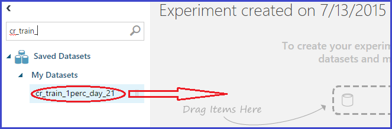
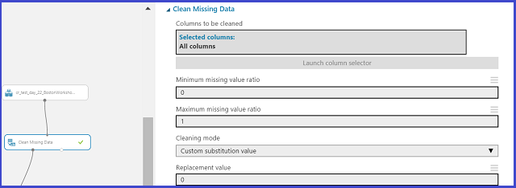
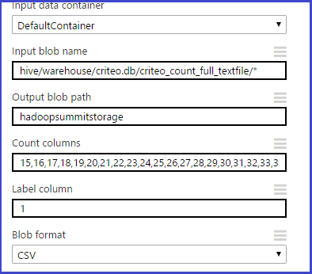
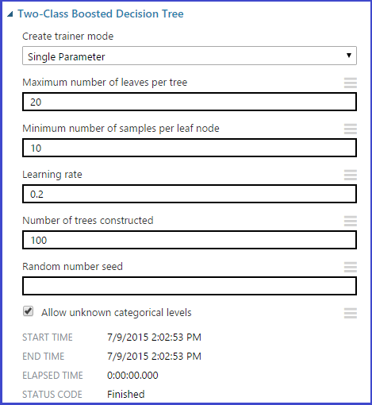
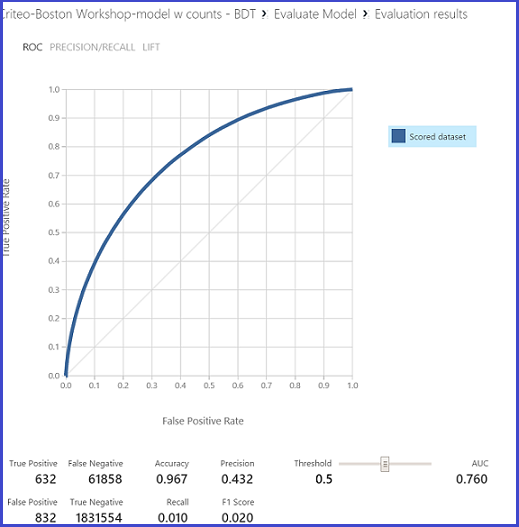

<properties
    pageTitle="O processo de ciência de dados de equipe em ação: usando HDInsight Hadoop clusters no conjunto de dados Criteo 1 TB | Microsoft Azure"
    description="Usando o processo de ciência de dados de equipe para um cenário de ponta a ponta emprego um cluster de HDInsight Hadoop para criar e implantar um modelo usando um grande dataset publicamente disponível de (1 TB)"
    services="machine-learning,hdinsight"
    documentationCenter=""
    authors="bradsev"
    manager="jhubbard"
    editor="cgronlun" />

<tags
    ms.service="machine-learning"
    ms.workload="data-services"
    ms.tgt_pltfrm="na"
    ms.devlang="na"
    ms.topic="article"
    ms.date="09/13/2016"
    ms.author="bradsev" />

# O processo de ciência de dados de equipe em ação - usando o Azure HDInsight Hadoop Clusters em um conjunto de dados de 1 TB

Este passo a passo, demonstraremos usando o processo de ciência de dados de equipe em um cenário de ponta a ponta com um [cluster de Azure HDInsight Hadoop](https://azure.microsoft.com/services/hdinsight/) para armazenar, explorar, engenharia reversa do recurso e para baixo dados de exemplo de um dos conjuntos de dados [Criteo](http://labs.criteo.com/downloads/download-terabyte-click-logs/) disponíveis publicamente. Usamos aprendizado de máquina do Azure para criar um modelo de classificação binária nesses dados. Também vamos mostrar como publicar um desses modelos como um serviço da Web.

Também é possível usar um bloco de anotações de IPython para realizar as tarefas apresentadas neste passo a passo. Os usuários que gostam de tentar essa abordagem devem consultar o tópico de [instruções passo a passo de Criteo usando uma conexão ODBC seção](https://github.com/Azure/Azure-MachineLearning-DataScience/blob/master/Misc/DataScienceProcess/iPythonNotebooks/machine-Learning-data-science-process-hive-walkthrough-criteo.ipynb) .

## Descrição do conjunto de dados de Criteo

O Criteo dados são um conjunto de dados de previsão de clique aproximadamente 370 GB de gzip compactada TSV arquivos (~1.3TB descompactados), que consiste em mais de 4.3 bilhões de registros. Ele é obtido 24 dias de clique em dados disponibilizados pelo [Criteo](http://labs.criteo.com/downloads/download-terabyte-click-logs/). Para a conveniência de cientistas de dados, podemos ter descompactados dados disponíveis para experimentar.

Cada registro neste DataSet contém 40 colunas:

- a primeira coluna é uma coluna de rótulo que indica se um usuário clica em um **Adicionar** (valor 1) ou não clique em um (valor 0)
- Avançar 13 colunas são numéricas, e
- última 26 são categóricos colunas

As colunas são anonymized e usar uma série de nomes enumerados: "Col1" (para a coluna de rótulo) para ' Col40 "(para a última coluna de categorias).            

Aqui está um trecho das primeiras 20 colunas de duas observações (linhas) desse dataset:

    Col1    Col2    Col3    Col4    Col5    Col6    Col7    Col8    Col9    Col10   Col11   Col12   Col13   Col14   Col15           Col16           Col17           Col18           Col19       Col20

    0       40      42      2       54      3       0       0       2       16      0       1       4448    4       1acfe1ee        1b2ff61f        2e8b2631        6faef306        c6fc10d3    6fcd6dcb           
    0               24              27      5               0       2       1               3       10064           9a8cb066        7a06385f        417e6103        2170fc56        acf676aa    6fcd6dcb                      

Há valores ausentes nas colunas numéricas e categorias este conjunto de dados. Podemos descrever um método simples para lidar com os valores ausentes. Detalhes adicionais de dados são explorados quando podemos armazená-los em tabelas de seção.

**Definição:** *Taxa de cliques (CTR):* Esta é a porcentagem de cliques dos dados. Neste DataSet Criteo, o CTR é cerca de 3.3% ou 0.033.

## Exemplos de tarefas de previsão
Dois problemas de previsão de amostra apresentados este passo a passo:

1. **Classificação binária**: prevê se um usuário tiver clicado em um adicionar:
    - Classe 0: Nenhum clique
    - Classe 1: clique em

2. **Regressão**: prevê a probabilidade de um clique ad de recursos do usuário.

## Definir um HDInsight Hadoop cluster para ciência de dados

**Observação:** Normalmente, isso é uma tarefa de **Administração** .

Configure o ambiente de ciência de dados do Azure para criação de soluções de análise de previsão com clusters de HDInsight em três etapas:

1. [Criar uma conta de armazenamento](../storage/storage-create-storage-account.md): essa conta de armazenamento é usada para armazenar dados no armazenamento de Blob do Azure. Os dados usados em clusters de HDInsight são armazenados aqui.

2. [Personalizar o Azure HDInsight Hadoop Clusters de ciência de dados](machine-learning-data-science-customize-hadoop-cluster.md): esta etapa cria um cluster Azure HDInsight Hadoop com 64 bits Anaconda Python 2.7 instalado em todos os nós. Há duas etapas importantes (descritas neste tópico) para concluir quando personalizar o cluster HDInsight.

    * Você deve vincular a conta de armazenamento criada na etapa 1 com o seu cluster HDInsight quando ele é criado. Essa conta de armazenamento é usada para acessar os dados que podem ser processados dentro do cluster.

    * Você deve habilitar o acesso remoto para o nó principal do cluster após sua criação. Lembrar as credenciais de acesso remoto que você especificar aqui (diferente daqueles especificado para o cluster em sua criação): necessário para concluir os procedimentos a seguir.

3. [Criar um espaço de trabalho do Azure ML](machine-learning-create-workspace.md): aprendizado de máquina Azure este espaço de trabalho é usado para a criação de modelos de aprendizado de máquina após uma exploração de dados iniciais e para baixo de amostragem no cluster HDInsight.

## Obter e consumir dados de uma fonte de público

O conjunto de dados de [Criteo](http://labs.criteo.com/downloads/download-terabyte-click-logs/) pode ser acessado clicando no link, aceitar os termos de uso e fornecer um nome. Um instantâneo de aparência é mostrado aqui:

Clique em **Continuar para Download** para ler mais sobre o conjunto de dados e sua disponibilidade.

Os dados residem em um local de [armazenamento de blob do Azure](../storage/storage-dotnet-how-to-use-blobs.md) público: wasb://criteo@azuremlsampleexperiments.blob.core.windows.net/raw/. O "wasb" se refere ao local de armazenamento de Blob do Azure. 

1. Os dados nesse armazenamento de blob pública consistem em três subpastas dos dados descompactados.

    1. A subpasta */Contagem bruta/* contém os primeiro 21 dias de dados - de dia\_00 para dia\_20
    2. A subpasta *bruto/treinar/* consiste em um único dia de dados, dia\_21
    3. A subpasta *bruto/teste/* consiste em dois dias de dados, dia\_22 e dia\_23

2. Para aqueles que quer começar com os dados gzip bruto, eles também estão disponíveis na pasta principal *bruto /* como day_NN.gz, onde NN vai de 00 a 23.

Uma abordagem alternativa para acessar, explorar e modelo de dados que não exige qualquer downloads locais são explicados mais adiante este passo a passo quando podemos criar tabelas de seção.

## Faça logon em headnode o cluster

Para fazer logon headnode do cluster, use o [portal do Azure](https://ms.portal.azure.com) para localizar o cluster. Clique no ícone de elefante HDInsight à esquerda e, em seguida, clique duas vezes no nome do seu cluster. Navegue até a guia de **configuração** , clique duas vezes no ícone de conectar-se na parte inferior da página e insira suas credenciais de acesso remoto quando solicitado. Isso o leva para o headnode do cluster.

Aqui está a aparência de um típico primeiro faça logon em headnode o cluster:

À esquerda, vemos "Hadoop linha de comando", que é nossa força de trabalho para a exploração de dados. Vemos também duas URLs útil - "Hadoop fio colorido Status" e "Nó de nome do Hadoop". A URL de status de fio colorido mostra o andamento do trabalho e a URL de nó nome fornece detalhes sobre a configuração do cluster.

Agora estão configurados e pronto para começar a primeira parte da explicação: exploração de dados usando a seção e Preparando dados para aprendizado de máquina do Azure.

## Criar tabelas e o banco de dados de seção

Para criar tabelas de seção para nosso dataset Criteo, abra a ***linha de comando do Hadoop*** da área de trabalho do nó principal e insira o diretório de seção digitando o comando

    cd %hive_home%\bin

>[AZURE.NOTE] Executar todos os comandos de seção nesta explicação da Lixeira seção / prompt de diretório. Isso cuida dos problemas caminho automaticamente. Usamos os termos "Aviso do diretório de seção", "seção bin / prompt de diretório" e "linha de comando do Hadoop" alternadamente.

>[AZURE.NOTE]  Para executar qualquer consulta de seção, um sempre pode usar os seguintes comandos:

        cd %hive_home%\bin
        hive

Após a seção REPL é exibida com um "seção >"entrar, basta recortar e colar a consulta para executá-lo.

O código a seguir cria um banco de dados "criteo" e, em seguida, gera 4 tabelas:

* uma *tabela para gerar contagens* feita no dia de dias\_00 para dia\_20,
* uma *tabela para ser usado como o dataset trem* feita no dia\_21, e
* duas *tabelas para usam como os conjuntos de dados de teste* criado no dia\_22 e dia\_23 respectivamente.

Podemos dividir nosso conjunto de dados de teste em duas tabelas diferentes porque um dos dias é um feriado e queremos determinar se o modelo pode detectar diferenças entre um feriado e não-feriado da taxa de cliques.

O script [amostra #95; seção & #95; criar & #95; criteo & 95 #; #95; & banco de dados e & #95;tables.hql](https://github.com/Azure/Azure-MachineLearning-DataScience/blob/master/Misc/DataScienceProcess/DataScienceScripts/sample_hive_create_criteo_database_and_tables.hql) é exibido aqui para sua conveniência:

    CREATE DATABASE IF NOT EXISTS criteo;
    DROP TABLE IF EXISTS criteo.criteo_count;
    CREATE TABLE criteo.criteo_count (
    col1 string,col2 double,col3 double,col4 double,col5 double,col6 double,col7 double,col8 double,col9 double,col10 double,col11 double,col12 double,col13 double,col14 double,col15 string,col16 string,col17 string,col18 string,col19 string,col20 string,col21 string,col22 string,col23 string,col24 string,col25 string,col26 string,col27 string,col28 string,col29 string,col30 string,col31 string,col32 string,col33 string,col34 string,col35 string,col36 string,col37 string,col38 string,col39 string,col40 string)
    ROW FORMAT DELIMITED FIELDS TERMINATED BY '\t'
    LINES TERMINATED BY '\n'
    STORED AS TEXTFILE LOCATION 'wasb://criteo@azuremlsampleexperiments.blob.core.windows.net/raw/count';

    DROP TABLE IF EXISTS criteo.criteo_train;
    CREATE TABLE criteo.criteo_train (
    col1 string,col2 double,col3 double,col4 double,col5 double,col6 double,col7 double,col8 double,col9 double,col10 double,col11 double,col12 double,col13 double,col14 double,col15 string,col16 string,col17 string,col18 string,col19 string,col20 string,col21 string,col22 string,col23 string,col24 string,col25 string,col26 string,col27 string,col28 string,col29 string,col30 string,col31 string,col32 string,col33 string,col34 string,col35 string,col36 string,col37 string,col38 string,col39 string,col40 string)
    ROW FORMAT DELIMITED FIELDS TERMINATED BY '\t'
    LINES TERMINATED BY '\n'
    STORED AS TEXTFILE LOCATION 'wasb://criteo@azuremlsampleexperiments.blob.core.windows.net/raw/train';

    DROP TABLE IF EXISTS criteo.criteo_test_day_22;
    CREATE TABLE criteo.criteo_test_day_22 (
    col1 string,col2 double,col3 double,col4 double,col5 double,col6 double,col7 double,col8 double,col9 double,col10 double,col11 double,col12 double,col13 double,col14 double,col15 string,col16 string,col17 string,col18 string,col19 string,col20 string,col21 string,col22 string,col23 string,col24 string,col25 string,col26 string,col27 string,col28 string,col29 string,col30 string,col31 string,col32 string,col33 string,col34 string,col35 string,col36 string,col37 string,col38 string,col39 string,col40 string)
    ROW FORMAT DELIMITED FIELDS TERMINATED BY '\t'
    LINES TERMINATED BY '\n'
    STORED AS TEXTFILE LOCATION 'wasb://criteo@azuremlsampleexperiments.blob.core.windows.net/raw/test/day_22';

    DROP TABLE IF EXISTS criteo.criteo_test_day_23;
    CREATE TABLE criteo.criteo_test_day_23 (
    col1 string,col2 double,col3 double,col4 double,col5 double,col6 double,col7 double,col8 double,col9 double,col10 double,col11 double,col12 double,col13 double,col14 double,col15 string,col16 string,col17 string,col18 string,col19 string,col20 string,col21 string,col22 string,col23 string,col24 string,col25 string,col26 string,col27 string,col28 string,col29 string,col30 string,col31 string,col32 string,col33 string,col34 string,col35 string,col36 string,col37 string,col38 string,col39 string,col40 string)
    ROW FORMAT DELIMITED FIELDS TERMINATED BY '\t'
    LINES TERMINATED BY '\n'
    STORED AS TEXTFILE LOCATION 'wasb://criteo@azuremlsampleexperiments.blob.core.windows.net/raw/test/day_23';

Podemos Observe que todas essas tabelas são externas como podemos simplesmente apontam para locais de armazenamento de Blob do Azure (wasb).

**Há duas maneiras de executar a consulta de qualquer seção que devemos mencionar agora.**

1. **Usando a linha de comando de REPL de seção**: A primeira é emitir um comando de "seção" e copiar e colar uma consulta em REPL a seção da linha de comando. Para fazer isso, execute:

        cd %hive_home%\bin
        hive

    Agora no REPL de linha de comando, recortar e colar a consulta executa-o.

2. **Salvando consultas para um arquivo e executar o comando**: O segundo é salvar as consultas para um arquivo de .hql ([amostra #95; seção & #95; criar & #95; criteo & 95 #; #95; & banco de dados e & #95;tables.hql](https://github.com/Azure/Azure-MachineLearning-DataScience/blob/master/Misc/DataScienceProcess/DataScienceScripts/sample_hive_create_criteo_database_and_tables.hql)) e, em seguida, execute o seguinte comando para executar a consulta:

        hive -f C:\temp\sample_hive_create_criteo_database_and_tables.hql

### Confirmar a criação de banco de dados e tabela

Em seguida, podemos confirmar a criação do banco de dados com o seguinte comando da Lixeira seção / prompt de diretório:

        hive -e "show databases;"

Isto dá:

        criteo
        default
        Time taken: 1.25 seconds, Fetched: 2 row(s)

Isso confirma a criação de novo banco de dados "criteo".

Para ver quais tabelas que criamos, podemos simplesmente execute o comando aqui da Lixeira seção / prompt de diretório:

        hive -e "show tables in criteo;"

Nós, consulte o seguinte resultado:

        criteo_count
        criteo_test_day_22
        criteo_test_day_23
        criteo_train
        Time taken: 1.437 seconds, Fetched: 4 row(s)

##Exploração de dados na seção

Agora você está pronto para fazer alguma exploração de dados básico na seção. Vamos começar pela contagem do número de exemplos no trem e teste tabelas de dados.

### Número de exemplos de trem

O conteúdo de [amostra & #95; seção & #95; contar & #95; trem & #95; tabela & #95;examples.hql](https://github.com/Azure/Azure-MachineLearning-DataScience/blob/master/Misc/DataScienceProcess/DataScienceScripts/sample_hive_count_train_table_examples.hql) é mostrado aqui:

        SELECT COUNT(*) FROM criteo.criteo_train;

Isso resulta em:

        192215183
        Time taken: 264.154 seconds, Fetched: 1 row(s)

Como alternativa, um também pode emitir o seguinte comando da Lixeira seção / prompt de diretório:

        hive -f C:\temp\sample_hive_count_criteo_train_table_examples.hql

### Número de exemplos de teste nos dois conjuntos de dados de teste

Agora, podemos contar o número de exemplos os dois conjuntos de dados de teste. O conteúdo de [amostra & #95 seção & 95 # #95 & Contar; criteo & #95; teste & 95 #; #95 & dia; 22 & #95; tabela & #95;examples.hql](https://github.com/Azure/Azure-MachineLearning-DataScience/blob/master/Misc/DataScienceProcess/DataScienceScripts/sample_hive_count_criteo_test_day_22_table_examples.hql) estão aqui:

        SELECT COUNT(*) FROM criteo.criteo_test_day_22;

Isso resulta em:

        189747893
        Time taken: 267.968 seconds, Fetched: 1 row(s)

Como de costume, talvez também chamamos o script da Lixeira seção / diretório prompt por meio do comando:

        hive -f C:\temp\sample_hive_count_criteo_test_day_22_table_examples.hql

Por fim, vamos examinar o número de exemplos de teste no dataset teste com base no dia\_23.

O comando para fazer isso é semelhante à mostrada apenas (consulte a [amostra & #95; seção & #95; contar & #95; criteo & #95; teste & 95 #; #95 & dia; 23 & #95;examples.hql](https://github.com/Azure/Azure-MachineLearning-DataScience/blob/master/Misc/DataScienceProcess/DataScienceScripts/sample_hive_count_criteo_test_day_23_examples.hql)):

        SELECT COUNT(*) FROM criteo.criteo_test_day_23;

Isto dá:

        178274637
        Time taken: 253.089 seconds, Fetched: 1 row(s)

### Distribuição de etiqueta no dataset trem

A distribuição de etiqueta no dataset trem é de interesse. Para ver isso, podemos mostrar conteúdo de [amostra & #95; seção & #95; criteo & #95; rótulo & #95; distribuição & #95; trem & #95;table.hql](https://github.com/Azure/Azure-MachineLearning-DataScience/blob/master/Misc/DataScienceProcess/DataScienceScripts/sample_hive_criteo_label_distribution_train_table.hql):

        SELECT Col1, COUNT(*) AS CT FROM criteo.criteo_train GROUP BY Col1;

Isso resulta na distribuição de rótulo:

        1       6292903
        0       185922280
        Time taken: 459.435 seconds, Fetched: 2 row(s)

Observe que a porcentagem de etiquetas positivas é 3.3% (consistente com o conjunto de dados original).

### Distribuições de histograma de algumas variáveis numéricas no dataset trem

Podemos usar nativo da seção "histograma\_numéricos" função descobrir aparência a distribuição das variáveis numéricas. Estes são o conteúdo de [amostra & #95; seção & #95; criteo & #95; histograma & #95;numeric.hql](https://github.com/Azure/Azure-MachineLearning-DataScience/blob/master/Misc/DataScienceProcess/DataScienceScripts/sample_hive_criteo_histogram_numeric.hql):

        SELECT CAST(hist.x as int) as bin_center, CAST(hist.y as bigint) as bin_height FROM
            (SELECT
            histogram_numeric(col2, 20) as col2_hist
            FROM
            criteo.criteo_train
            ) a
            LATERAL VIEW explode(col2_hist) exploded_table as hist;

Isso produz o seguinte:

        26      155878415
        2606    92753
        6755    22086
        11202   6922
        14432   4163
        17815   2488
        21072   1901
        24113   1283
        27429   1225
        30818   906
        34512   723
        38026   387
        41007   290
        43417   312
        45797   571
        49819   428
        53505   328
        56853   527
        61004   160
        65510   3446
        Time taken: 317.851 seconds, Fetched: 20 row(s)

O modo de exibição - LATERAL Detalhar combinação na seção serve para gerar uma saída de tipo SQL em vez de lista de costume. Observe que esta tabela, a primeira coluna corresponde ao centro de compartimento e o segundo à frequência de compartimento.

### Percentuais aproximados de algumas variáveis numéricas no dataset trem

Também de interesse com variáveis numéricas é o cálculo de percentuais aproximadas. Seção do nativa "percentil\_aproximadamente" faz isso para nós. O conteúdo de [amostra & #95; seção & #95; criteo & #95; aproximada & #95;percentiles.hql](https://github.com/Azure/Azure-MachineLearning-DataScience/blob/master/Misc/DataScienceProcess/DataScienceScripts/sample_hive_criteo_approximate_percentiles.hql) são:

        SELECT MIN(Col2) AS Col2_min, PERCENTILE_APPROX(Col2, 0.1) AS Col2_01, PERCENTILE_APPROX(Col2, 0.3) AS Col2_03, PERCENTILE_APPROX(Col2, 0.5) AS Col2_median, PERCENTILE_APPROX(Col2, 0.8) AS Col2_08, MAX(Col2) AS Col2_max FROM criteo.criteo_train;

Isso resulta em:

        1.0     2.1418600917169246      2.1418600917169246    6.21887086390288 27.53454893115633       65535.0
        Time taken: 564.953 seconds, Fetched: 1 row(s)

Podemos remarque que a distribuição de percentuais está relacionada a distribuição de histograma do qualquer variável numérica normalmente.        

### Encontrar o número de valores exclusivos para algumas colunas categóricos no dataset trem

Continuar a exploração de dados, podemos agora encontrar, de algumas colunas categóricos, o número de valores exclusivos que realizar. Para fazer isso, podemos mostrar o conteúdo das [amostra & #95; seção & #95; criteo & #95; exclusivo & #95; valores & #95;categoricals.hql](https://github.com/Azure/Azure-MachineLearning-DataScience/blob/master/Misc/DataScienceProcess/DataScienceScripts/sample_hive_criteo_unique_values_categoricals.hql):

        SELECT COUNT(DISTINCT(Col15)) AS num_uniques FROM criteo.criteo_train;

Isso resulta em:

        19011825
        Time taken: 448.116 seconds, Fetched: 1 row(s)

Podemos Observe que Col15 tem valores exclusivos 19M! Usar técnicas simples como "quentes uma codificação" codificar tais variáveis categóricos alta dimensionais é inviável. Em particular, podemos Explique e demonstre uma técnica poderosa e robusta chamada [Aprendizagem com conta](http://blogs.technet.com/b/machinelearning/archive/2015/02/17/big-learning-made-easy-with-counts.aspx) para lidar com esse problema com eficiência.

Vamos finalizar esta subseção examinando o número de valores exclusivos para algumas das outras categorias colunas também. O conteúdo de [amostra & #95; seção & #95; criteo & #95; exclusivo & 95 #, #95 & valores; múltiplo & #95;categoricals.hql](https://github.com/Azure/Azure-MachineLearning-DataScience/blob/master/Misc/DataScienceProcess/DataScienceScripts/sample_hive_criteo_unique_values_multiple_categoricals.hql) são:

        SELECT COUNT(DISTINCT(Col16)), COUNT(DISTINCT(Col17)),
        COUNT(DISTINCT(Col18), COUNT(DISTINCT(Col19), COUNT(DISTINCT(Col20))
        FROM criteo.criteo_train;

Isso resulta em:

        30935   15200   7349    20067   3
        Time taken: 1933.883 seconds, Fetched: 1 row(s)

Novamente, podemos ver que, exceto para Col20, todas as outras colunas tem muitos valores exclusivos.

### Contagens de colegas ocorrência de pares de variáveis categóricos no dataset trem

As contagens de colegas ocorrência de pares de variáveis categóricos também é de interesse. Isso pode ser determinado usando o código em [amostra & #95; seção & #95; criteo & #95; pares & #95; categóricos & #95;counts.hql](https://github.com/Azure/Azure-MachineLearning-DataScience/blob/master/Misc/DataScienceProcess/DataScienceScripts/sample_hive_criteo_paired_categorical_counts.hql):

        SELECT Col15, Col16, COUNT(*) AS paired_count FROM criteo.criteo_train GROUP BY Col15, Col16 ORDER BY paired_count DESC LIMIT 15;

Estamos inversa ordenar as contagens por sua ocorrência e examine os 15 primeiros nesse caso. Isto nos dá:

        ad98e872        cea68cd3        8964458
        ad98e872        3dbb483e        8444762
        ad98e872        43ced263        3082503
        ad98e872        420acc05        2694489
        ad98e872        ac4c5591        2559535
        ad98e872        fb1e95da        2227216
        ad98e872        8af1edc8        1794955
        ad98e872        e56937ee        1643550
        ad98e872        d1fade1c        1348719
        ad98e872        977b4431        1115528
        e5f3fd8d        a15d1051        959252
        ad98e872        dd86c04a        872975
        349b3fec        a52ef97d        821062
        e5f3fd8d        a0aaffa6        792250
        265366bf        6f5c7c41        782142
        Time taken: 560.22 seconds, Fetched: 15 row(s)

## Os conjuntos de dados de exemplo para baixo para aprendizado de máquina do Azure

Tendo explorados os conjuntos de dados e demonstrou como pode fazemos esse tipo de exploração para quaisquer variáveis (incluindo combinações), podemos agora para baixo de amostra os conjuntos de dados pode criar modelos no aprendizado de máquina do Azure. Lembre que o problema nos concentraremos no é: dado um conjunto de atributos de exemplo (valores de recurso de Col2 - Col40), podemos prever se Col1 é 0 (não clique) ou 1 (clique).

Para baixo nosso trem de exemplo e testar conjuntos de dados em 1% do tamanho original, podemos usar função aleatório () da nativa da seção. O próximo script, [amostra & #95; seção & #95; criteo & #95; reduzir a resolução & #95; trem & #95;dataset.hql](https://github.com/Azure/Azure-MachineLearning-DataScience/blob/master/Misc/DataScienceProcess/DataScienceScripts/sample_hive_criteo_downsample_train_dataset.hql) faz isso para o dataset trem:

        CREATE TABLE criteo.criteo_train_downsample_1perc (
        col1 string,col2 double,col3 double,col4 double,col5 double,col6 double,col7 double,col8 double,col9 double,col10 double,col11 double,col12 double,col13 double,col14 double,col15 string,col16 string,col17 string,col18 string,col19 string,col20 string,col21 string,col22 string,col23 string,col24 string,col25 string,col26 string,col27 string,col28 string,col29 string,col30 string,col31 string,col32 string,col33 string,col34 string,col35 string,col36 string,col37 string,col38 string,col39 string,col40 string)
        ROW FORMAT DELIMITED FIELDS TERMINATED BY '\t'
        LINES TERMINATED BY '\n'
        STORED AS TEXTFILE;

        ---Now downsample and store in this table

        INSERT OVERWRITE TABLE criteo.criteo_train_downsample_1perc SELECT * FROM criteo.criteo_train WHERE RAND() <= 0.01;

Isso resulta em:

        Time taken: 12.22 seconds
        Time taken: 298.98 seconds

O script [de amostra & #95; seção & #95; criteo & #95; reduzir a resolução & #95; teste & #95; #95 & dia; 22 & #95;dataset.hql](https://github.com/Azure/Azure-MachineLearning-DataScience/blob/master/Misc/DataScienceProcess/DataScienceScripts/sample_hive_criteo_downsample_test_day_22_dataset.hql) significa para dados de teste, dia\_22:

        --- Now for test data (day_22)

        CREATE TABLE criteo.criteo_test_day_22_downsample_1perc (
        col1 string,col2 double,col3 double,col4 double,col5 double,col6 double,col7 double,col8 double,col9 double,col10 double,col11 double,col12 double,col13 double,col14 double,col15 string,col16 string,col17 string,col18 string,col19 string,col20 string,col21 string,col22 string,col23 string,col24 string,col25 string,col26 string,col27 string,col28 string,col29 string,col30 string,col31 string,col32 string,col33 string,col34 string,col35 string,col36 string,col37 string,col38 string,col39 string,col40 string)
        ROW FORMAT DELIMITED FIELDS TERMINATED BY '\t'
        LINES TERMINATED BY '\n'
        STORED AS TEXTFILE;

        INSERT OVERWRITE TABLE criteo.criteo_test_day_22_downsample_1perc SELECT * FROM criteo.criteo_test_day_22 WHERE RAND() <= 0.01;

Isso resulta em:

        Time taken: 1.22 seconds
        Time taken: 317.66 seconds

Finalmente, o script [de amostra & #95; seção & #95; criteo & #95; reduzir a resolução & #95; teste & #95; #95 & dia; 23 & #95;dataset.hql](https://github.com/Azure/Azure-MachineLearning-DataScience/blob/master/Misc/DataScienceProcess/DataScienceScripts/sample_hive_criteo_downsample_test_day_23_dataset.hql) significa para dados de teste, dia\_23:

        --- Finally test data day_23
        CREATE TABLE criteo.criteo_test_day_23_downsample_1perc (
        col1 string,col2 double,col3 double,col4 double,col5 double,col6 double,col7 double,col8 double,col9 double,col10 double,col11 double,col12 double,col13 double,col14 double,col15 string,col16 string,col17 string,col18 string,col19 string,col20 string,col21 string,col22 string,col23 string,col24 string,col25 string,col26 string,col27 string,col28 string,col29 string,col30 string,col31 string,col32 string,col33 string,col34 string,col35 string,col36 string,col37 string,col38 string,col39 string,col40 srical feature; tring)
        ROW FORMAT DELIMITED FIELDS TERMINATED BY '\t'
        LINES TERMINATED BY '\n'
        STORED AS TEXTFILE;

        INSERT OVERWRITE TABLE criteo.criteo_test_day_23_downsample_1perc SELECT * FROM criteo.criteo_test_day_23 WHERE RAND() <= 0.01;

Isso resulta em:

        Time taken: 1.86 seconds
        Time taken: 300.02 seconds

Com isso, estamos prontos para usar nosso trem de amostra para baixo e testar conjuntos de dados para a criação de modelos no aprendizado de máquina do Azure.

Há um componente importante final antes de continuarmos para aprendizado de máquina do Azure, que é preocupações a tabela de contagem. A próxima seção sub, vamos abordar isso em alguns detalhes.

##Uma breve discussão sobre a tabela de contagem

Como visto, diversas variáveis categóricos têm uma dimensionalidade muito alta. Nossa passo a passo, apresentaremos uma técnica poderosa chamada de [Aprendizagem com conta](http://blogs.technet.com/b/machinelearning/archive/2015/02/17/big-learning-made-easy-with-counts.aspx) para codificar essas variáveis de maneira eficiente, robusta. Obter mais informações sobre essa técnica estão no link fornecido.

**Observação:** Este passo a passo, vamos nos concentrar em usando tabelas de contagem para produzir representações compactos dos recursos categóricos alta dimensionais. Isso não é a única maneira para codificar categóricos recursos; Para obter mais informações sobre outras técnicas, usuários interessados consulte [um quente-codificação](http://en.wikipedia.org/wiki/One-hot) e [hash do recurso](http://en.wikipedia.org/wiki/Feature_hashing).

Para criar tabelas de contagem nos dados contagem, usamos os dados na pasta bruto/contagem. Na seção de modelagem, podemos mostrar aos usuários como construir essas tabelas de contagem para recursos de categorias do zero, ou como alternativa para usar uma tabela de contagem pré-criados para seus explorações. Em quais segue, quando fazemos referência a "contagem pré-criados tabelas", queremos dizer usando as tabelas de contagem que fornecemos. Instruções detalhadas sobre como acessar essas tabelas são fornecidas na próxima seção.

## Criar um modelo com aprendizado de máquina do Azure

Nosso modelo de criação de processo no aprendizado de máquina do Azure segue estas etapas:

1. [Obtém os dados de tabelas de seção para aprendizado de máquina do Azure](#step1)
2. [Criar o experimento: limpar os dados, escolha um aprendiz e featurize com tabelas de contagem](#step2)
3. [Treinar o modelo](#step3)
4. [Pontuação o modelo de dados de teste](#step4)
5. [Avaliar o modelo](#step5)
6. [Publicar o modelo como um serviço da web a ser consumida](#step6)

Agora você está pronto para criar modelos no studio de aprendizado de máquina do Azure. Nossos dados de amostrados para baixo é salvo como tabelas de seção no cluster. Podemos usar o módulo de aprendizado de máquina do Azure **Importar dados** para ler esses dados. As credenciais para acessar a conta de armazenamento desse cluster são fornecidas no que se segue.

### Etapa 1: Obter dados de tabelas de seção para aprendizado de máquina Azure usando o módulo de importar dados e selecione-o para uma experiência de aprendizado de máquina

Iniciar selecionando um **+ nova** -> **EXPERIMENTO** -> **Experimento em branco**. Em seguida, na caixa de **pesquisa** na parte superior esquerda, pesquise "Importar dados". Arraste e solte o módulo de **Importar dados** para a tela de experimento (a parte do meio da tela) para usar o módulo para acesso a dados.

Esta é a aparência de **Importar dados** ao obter dados da tabela de seção:

Para o módulo de **Importar dados** , os valores dos parâmetros que são fornecidos no gráfico são apenas exemplos da classificação dos valores que você precisará fornecer. Aqui estão algumas diretrizes gerais sobre como preencher o parâmetro definido para o módulo de **Importar dados** .

1. Escolha "Consulta de seção" **Fonte** de dados
2. Na caixa **seção consulta de banco de dados** , um simples SELECT * FROM < seu\_banco de dados\_name.your\_tabela\_nome >-é suficiente.
3. **URI do servidor de Hcatalog**: se o seu cluster é "abc", então isso é simplesmente: https://abc.azurehdinsight.net
4. **Nome de conta de usuário do Hadoop**: O nome de usuário escolhido na ocasião da preparação do cluster. (Não o nome de usuário do acesso remoto!)
5. **Senha de conta de usuário do Hadoop**: A senha para o nome de usuário escolhido na ocasião da preparação do cluster. (Não a senha de acesso remoto!)
6. **Local dos dados de saída**: escolha "Azure"
7. **Nome da conta de armazenamento do Azure**: A conta de armazenamento associada ao cluster
8. **Chave da conta de armazenamento do Azure**: A chave da conta de armazenamento associado ao cluster.
9. **Nome de contêiner Azure**: se o nome do cluster é "abc", então é simplesmente "abc", geralmente.

Quando terminar de **Importar dados** Obtendo dados (consulte a escala verde no módulo), salve esses dados como um conjunto de dados (com um nome de sua preferência). Esta aparência:

Clique com botão direito a porta de saída do módulo **Importar dados** . Isso revela uma opção **Salvar como conjunto de dados** e uma opção de **Visualizar** . A opção de **Visualizar** , se tiver clicado, exibe 100 linhas dos dados, juntamente com um painel direito que é útil para algumas estatísticas de resumo. Para salvar os dados, simplesmente selecione **Salvar como conjunto de dados** e siga as instruções.

Para selecionar o conjunto de dados salvo para uso em uma experiência de aprendizado de máquina, localize os conjuntos de dados usando a caixa **Pesquisar** mostrada na figura a seguir. Em seguida, basta digitar o nome que você forneceu dataset parcialmente para acessá-lo e arraste o conjunto de dados para o painel principal. Arrastando-o para o painel principal seleciona para uso em modelagem de aprendizado de máquina.

>[AZURE.NOTE] Faça isso para trem e os conjuntos de dados de teste. Além disso, lembre-se de usar o nome de banco de dados e nomes de tabela que você forneceu para essa finalidade. Os valores usados na figura são unicamente para ilustração purposes.* *

### Etapa 2: Criar um experimento simple no aprendizado de máquina Azure prever cliques / sem cliques

Nosso experimento ML Azure tem esta aparência:

Agora, vamos examinar os componentes principais desse experimento. Como um lembrete, precisamos arrastar nosso trem salvo e testar conjuntos de dados nossa tela experimento-lo primeiro.

#### Limpar dados ausentes

O módulo de **Limpar dados ausentes** faz o que seu nome sugere: ele limpa dados ausentes de maneiras que podem ser especificados pelo usuário. Procurando para este módulo, vemos isso:

Aqui, escolhemos substituir todos os valores ausentes por um 0. Existem outras opções também, que podem ser vistas examinando menus suspensos no módulo.

#### Engenharia de recurso nos dados

Pode haver milhões de valores exclusivos para alguns recursos categorias de grandes conjuntos de dados. Usar métodos simples como quentes uma codificação para representar esses recursos categóricos alta dimensionais é inteiramente impraticável. Este passo a passo, demonstraremos como usar recursos de contagem usando módulos internos de aprendizado de máquina do Azure para gerar representações compactos dessas variáveis categóricos alta dimensionais. O resultado final é um tamanho menor de modelo, tempos de treinamento e avaliações de desempenho que são bastante comparáveis à usando outras técnicas.

##### Construção contando transformações

Para criar os recursos de contagem, podemos usar o módulo **Construir contando transformar** que está disponível no aprendizado de máquina do Azure. O módulo tem esta aparência:

**Observação importante** : na caixa **contagem de colunas** , podemos inserir nessas colunas que desejamos realizar contagens em. Geralmente, esses são (conforme mencionado) alta dimensionais categóricos colunas. No início, podemos mencionado que o dataset de Criteo tem 26 colunas categóricos: de Col15 para Col40. Aqui, podemos contar todos eles e dar a seus índices (de 15 a 40 separados por vírgulas, conforme mostrado).

Para usar o módulo no modo MapReduce (apropriado para grandes conjuntos de dados), precisamos de acesso para um cluster de HDInsight Hadoop (usada para exploração de recurso pode ser reutilizada para essa finalidade também) e suas credenciais. As figuras anteriores ilustram quais preenchido valores aparência (substitua os valores fornecidos para ilustração com aqueles relevantes para seu próprio caso de uso).

Na figura acima, vamos mostrar como inserir o local de entrada blob. Esse local tem os dados reservados para criar tabelas de contagem em.

Após este módulo concluir a execução, podemos pode salvar a transformação para mais tarde clicando no módulo e selecionando a opção **Salvar como transformação** :

Em nossa arquitetura de experimento mostrada acima, o conjunto de dados "ytransform2" corresponde com precisão em uma transformação de contagem salvo. Para o restante nesse experimento, vamos supor que o leitor usado um módulo **Construir contando transformar** em alguns dados para gerar contagens e, em seguida, pode usar essas contagens gerar recursos de contagem no trem e testar conjuntos de dados.

##### Escolher quais contagem de recursos para incluir como parte dos conjuntos de dados trem e teste

Depois que temos uma contagem transformar pronto, o usuário pode escolher quais recursos para incluir em seu trem e testar conjuntos de dados usando o módulo de **Modificar parâmetros de contagem de tabela** . Vamos mostrar apenas este módulo aqui integridade, mas em interesses de simplicidade não realmente usá-lo em nosso experimento.

Nesse caso, como pode ser visto, podemos escolheu para usar apenas as log-chances e ignorar a coluna de retirada. Nós também pode definir parâmetros como o limite de compartimento lixo, quantos exemplos pseudo anteriores para adicionar de suavização e se quiser usar qualquer ruído Laplacian ou não. Todos esses são os recursos avançados e é observar que os valores padrão são um bom ponto de partida para os usuários que são novos para este tipo de geração de recurso.

##### Transformação de dados antes de gerar os recursos de contagem

Agora podemos concentrar-se em um ponto importante sobre transformação nosso trem e testar os dados antes de realmente gerando recursos de contagem. Observe que há dois módulos de **Executar scripts de R** usados antes podemos aplicar a transformação de contagem para nossos dados.

Aqui está o primeiro script de R:

Nesse script R, podemos renomear nossas colunas para nomes "Col1" para "Col40". Isso ocorre porque a transformação de contagem espera nomes desse formato.

No segundo script R, podemos saldo a distribuição entre classes positivas e negativas (classes 1 e 0 respectivamente) da resolução da classe negativa. O script R aqui mostra como fazer isso:

Este script R simple, podemos usar "pos\_neg\_proporção" para definir a quantidade de equilíbrio entre o positivo e as classes negativas. Isso é importante fazer como melhorar desequilíbrio de classe geralmente tem benefícios de desempenho para problemas de classificação onde está a distribuição de classe Inclinado (Lembre-se que em nosso caso, temos classes positivo 3.3% e 96,7% negativo).

##### Aplicar a transformação de contagem em nossos dados

Por fim, podemos usar o módulo de **Transformação de aplicar** para aplicar as transformações de contagem em nosso trem e testar conjuntos de dados. Este módulo leva a transformação de contagem salva como uma entrada e os conjuntos de dados trem ou teste como a outra entrada e retorna dados com recursos de contagem. Ele é mostrado aqui:

##### Um trecho dos quais recursos contagem aparência

É útil ver os recursos de contagem aparência no nosso caso. Aqui, podemos mostrar um trecho isso:

Neste trecho, podemos mostram que para as colunas que estamos contados no, podemos obter as contagens e faça logon chances além de qualquer backoffs relevantes.

Agora está prontos para criar um modelo de aprendizado de máquina do Azure usando esses conjuntos de dados transformados. Na próxima seção, vamos mostrar como isso pode ser feito.

#### Construção de modelo de aprendizado de máquina Azure

##### Escolha Aprendiz

Primeiro, precisamos escolher um aprendiz. Vamos usar uma árvore de decisão de duas classe aumentou como nosso aprendiz. Aqui estão as opções padrão para este aprendiz:

Nosso experimento, vamos escolher os valores padrão. Podemos Observe que os padrões são geralmente significativos e uma boa maneira de obter linhas de base rápidas no desempenho. Você pode melhorar o desempenho por varredura parâmetros se você optar por uma vez que uma linha de base.

#### Treinar o modelo

Para obter treinamento, podemos simplesmente invocar um módulo de **Modelo de trem** . As duas entradas a ele são aprendiz a árvore de decisão de aumentou dois classe e nosso dataset trem. Isso é mostrado aqui:

#### Pontuação o modelo

Depois que temos um modelo de treinamento, estamos prontos para pontuação no conjunto de dados de teste e para avaliar o seu desempenho. Podemos fazer isso usando o módulo de **Modelo de pontuação** mostrado na figura a seguir, juntamente com um módulo de **Avaliar modelo** :

### Etapa 5: Avaliar o modelo

Por fim, podemos gostaria de analisar o desempenho do modelo. Geralmente, dois problemas de classificação (binário) de classe, uma boa medida é o AUC. Para visualizar isso, podemos ligar o módulo do **Modelo de pontuação** para um módulo de **Avaliar modelo** para isso. Clicando em **Visualizar** no módulo **Avaliar modelo** resulta em um gráfico como o seguinte:

Em binário (ou classe duas) problemas de classificação, uma boa medida de precisão de previsão é a área em curva (AUC). No que se segue, mostraremos nossos resultados usando este modelo em nosso conjunto de dados de teste. Para obter isso, clique com botão direito a porta de saída do módulo **Avaliar modelo** e, em seguida, **Visualizar**.

### Etapa 6: Publicar o modelo como um serviço da Web
A capacidade de publicar um modelo de aprendizado de máquina do Azure como serviços da web com o mínimo de confusão é um recurso valioso para disponibilizá-la amplamente. Depois disso, qualquer pessoa poderá fazer chamadas para o serviço da web com dados de entrada que eles precisam previsões para, e o serviço web usa o modelo para retornar as previsões.

Para fazer isso, nós primeiro salve nosso treinamento modelo como um objeto de modelo de treinamento. Isso é feito clicando no módulo no **Modelo de trem** e usando a opção **Salvar como modelo de treinamento** .

Em seguida, precisamos criar entrada e saída portas para nosso serviço da web:

* uma porta de entrada leva dados da mesma forma como os dados que precisamos previsões para
* uma porta de saída retorna os rótulos marcou e as probabilidades associadas.

#### Selecione algumas linhas de dados para a porta de entrada

É conveniente usar um módulo de **Aplicar transformação de SQL** para selecionar apenas 10 linhas para servir como os dados de porta de entrada. Selecione apenas essas linhas de dados para nosso porta de entrada usando a consulta SQL mostrada aqui:

#### Serviço da Web
Agora você está pronto para executar um experimento pequeno que pode ser usado para publicar nosso serviço web.

#### Gerar dados de entrada para serviçoweb

Como uma etapa de zeroth, desde que a tabela de contagem é grande, podemos fazer algumas linhas de dados de teste e gerar dados de saída-com recursos de contagem. Isso pode servir como o formato de dados de entrada para nosso serviço Web. Isso é mostrado aqui:

>[AZURE.NOTE] Para o formato de dados de entrada, agora podemos usar a saída do módulo **Featurizer de contagem** . Quando esse experimento termina a execução, salve a saída do módulo **Contagem Featurizer** como um conjunto de dados. Este conjunto de dados é usado para os dados de entrada na serviçoweb.

#### Pontuação experimento para publicação serviçoweb

Primeiro, vamos mostrar a aparência. A estrutura essencial é um módulo de **Modelo de pontuação** que aceita nosso objeto de modelo de treinamento e algumas linhas de dados de entrada que estamos gerados nas etapas anteriores usando o módulo de **Featurizer de contagem** . Usamos "Selecionar colunas no conjunto de dados" para projetar os rótulos de Scored e as probabilidades de pontuação.

Observe como o módulo de **Selecionar colunas no conjunto de dados** pode ser usado para 'Filtrar' dados de um conjunto de dados. Vamos mostrar o conteúdo aqui:

Para obter a entrada azul e portas de saída, você simplesmente clicar **Preparar serviçoweb** na parte inferior direita. Executar esse experimento também nos permite publicar o serviço da web: clique no ícone **Publicar serviço da WEB** na parte inferior direita, mostrado aqui:

Depois que o serviço Web é publicado, podemos obter redirecionados para uma página que pareça assim:

Vemos dois links para webservices no lado esquerdo:

* O serviço de **Solicitação/resposta** (ou RR) destina-se a únicas previsões e é o que utilizamos neste workshop.
* O serviço de **Execução em LOTES** (BES) é usado para previsões de lote e exige que os dados de entrada usado para fazer previsões residem no armazenamento de Blob do Azure.

Clicando no link **Que solicitação/resposta** nos leva a uma página que nos dá previamente gravados código no c#, python e R. Este código convenientemente pode ser usado para fazer chamadas no serviço Web. Observe que a chave de API nesta página precisa ser usado para autenticação.

É conveniente copiar este código python para uma nova célula no bloco de anotações IPython.

Aqui, mostraremos um segmento de código python com a chave de API correta.

Observe que podemos substituído a chave de API padrão com chave de API do nosso webservices. Clicando em **Executar** em um bloco de anotações de IPython essa célula produz a seguinte resposta:

Podemos ver que para os dois exemplos de teste que pedimos sobre (no framework JSON do script python), voltamos respostas do formulário "Scored de rótulos, probabilidades Scored". Observe que neste caso, escolhemos os valores padrão que o código pré-configurado fornece (0 para todas as colunas numéricas e a cadeia "valor" para todas as colunas categóricos).

Isso conclui nossa passo a passo de ponta a ponta mostrando como lidar com grande escala dataset usando aprendizado de máquina do Azure. Podemos começar com um terabytes de dados, construído um modelo de previsão e implantá-lo como um serviço web na nuvem.
