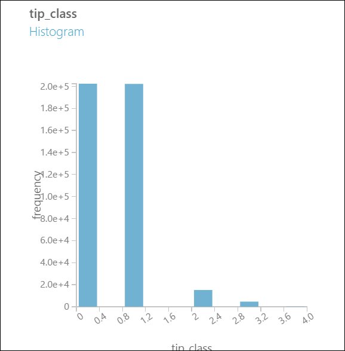

<properties
    pageTitle="O processo de ciência de dados de equipe em ação: uso Hadoop clusters | Microsoft Azure"
    description="Usando o processo de ciência de dados de equipe para um cenário de ponta a ponta emprego um cluster de HDInsight Hadoop para criar e implantar um modelo usando um conjunto de dados disponível publicamente."
    services="machine-learning,hdinsight"
    documentationCenter=""
    authors="bradsev"
    manager="jhubbard"
    editor="cgronlun" />

<tags
    ms.service="machine-learning"
    ms.workload="data-services"
    ms.tgt_pltfrm="na"
    ms.devlang="na"
    ms.topic="article"
    ms.date="09/19/2016"
    ms.author="hangzh;bradsev" />

# O processo de ciência de dados de equipe em ação: usando clusters de HDInsight Hadoop

Este passo a passo, usamos o [Processo de ciência de dados da equipe (TDSP)](data-science-process-overview.md) em um cenário de ponta a ponta usando um [cluster de Azure HDInsight Hadoop](https://azure.microsoft.com/services/hdinsight/) para armazenar, explorar e apresentar dados de engenharia reversa do dataset [NYC táxi viagens](http://www.andresmh.com/nyctaxitrips/) disponível publicamente e para baixo os dados de exemplo. Modelos de dados são criados com o aprendizado de máquina do Azure para lidar com binários multiclass classificação e regressão previsão tarefas e.

Para instruções passo a passo que mostra como lidar com um conjunto de dados (1 terabytes) maior para um cenário semelhante usando clusters de HDInsight Hadoop para processamento de dados, consulte o [Processo de ciência de dados da equipe - usando o Azure HDInsight Hadoop Clusters em um conjunto de dados de 1 TB](machine-learning-data-science-process-hive-criteo-walkthrough.md).

Também é possível usar um bloco de anotações de IPython para realizar as tarefas apresentadas explicação usando o dataset de 1 TB. Os usuários que gostam de tentar essa abordagem devem consultar o tópico de [instruções passo a passo de Criteo usando uma conexão ODBC seção](https://github.com/Azure/Azure-MachineLearning-DataScience/blob/master/Misc/DataScienceProcess/iPythonNotebooks/machine-Learning-data-science-process-hive-walkthrough-criteo.ipynb) .

## Descrição do conjunto de dados do NYC táxi viagens

Os dados de viagem de táxi NYC cerca de 20GB de arquivos compactados valores separados por vírgula (CSV) (~ 48GB descompactado), que consiste em mais de milhões de 173 individuais viagens e as tarifas pago para cada viagem. Cada registro de viagem inclui o local de entrega e de entrega e tempo, alteração anonymized (driver) licença número e medallion (identificação exclusiva do táxi). Os dados abrange todas as viagens no ano 2013 e são fornecidos em seguintes dois conjuntos de dados para cada mês:

1. Os arquivos CSV 'trip_data' contêm detalhes de viagem, como o número de passageiros, retirada e redução pontos, duração da viagem e comprimento de viagem. Aqui estão alguns exemplos de registros:

        medallion,hack_license,vendor_id,rate_code,store_and_fwd_flag,pickup_datetime,dropoff_datetime,passenger_count,trip_time_in_secs,trip_distance,pickup_longitude,pickup_latitude,dropoff_longitude,dropoff_latitude
        89D227B655E5C82AECF13C3F540D4CF4,BA96DE419E711691B9445D6A6307C170,CMT,1,N,2013-01-01 15:11:48,2013-01-01 15:18:10,4,382,1.00,-73.978165,40.757977,-73.989838,40.751171
        0BD7C8F5BA12B88E0B67BED28BEA73D8,9FD8F69F0804BDB5549F40E9DA1BE472,CMT,1,N,2013-01-06 00:18:35,2013-01-06 00:22:54,1,259,1.50,-74.006683,40.731781,-73.994499,40.75066
        0BD7C8F5BA12B88E0B67BED28BEA73D8,9FD8F69F0804BDB5549F40E9DA1BE472,CMT,1,N,2013-01-05 18:49:41,2013-01-05 18:54:23,1,282,1.10,-74.004707,40.73777,-74.009834,40.726002
        DFD2202EE08F7A8DC9A57B02ACB81FE2,51EE87E3205C985EF8431D850C786310,CMT,1,N,2013-01-07 23:54:15,2013-01-07 23:58:20,2,244,.70,-73.974602,40.759945,-73.984734,40.759388
        DFD2202EE08F7A8DC9A57B02ACB81FE2,51EE87E3205C985EF8431D850C786310,CMT,1,N,2013-01-07 23:25:03,2013-01-07 23:34:24,1,560,2.10,-73.97625,40.748528,-74.002586,40.747868

2. Os arquivos CSV 'trip_fare' contêm detalhes da tarifa paga para cada viagem, como o tipo de pagamento, quantidade de tarifa, sobrecarga e impostos, dicas e pedágio e o valor total pago. Aqui estão alguns exemplos de registros:

        medallion, hack_license, vendor_id, pickup_datetime, payment_type, fare_amount, surcharge, mta_tax, tip_amount, tolls_amount, total_amount
        89D227B655E5C82AECF13C3F540D4CF4,BA96DE419E711691B9445D6A6307C170,CMT,2013-01-01 15:11:48,CSH,6.5,0,0.5,0,0,7
        0BD7C8F5BA12B88E0B67BED28BEA73D8,9FD8F69F0804BDB5549F40E9DA1BE472,CMT,2013-01-06 00:18:35,CSH,6,0.5,0.5,0,0,7
        0BD7C8F5BA12B88E0B67BED28BEA73D8,9FD8F69F0804BDB5549F40E9DA1BE472,CMT,2013-01-05 18:49:41,CSH,5.5,1,0.5,0,0,7
        DFD2202EE08F7A8DC9A57B02ACB81FE2,51EE87E3205C985EF8431D850C786310,CMT,2013-01-07 23:54:15,CSH,5,0.5,0.5,0,0,6
        DFD2202EE08F7A8DC9A57B02ACB81FE2,51EE87E3205C985EF8431D850C786310,CMT,2013-01-07 23:25:03,CSH,9.5,0.5,0.5,0,0,10.5

A chave exclusiva para participar de viagem\_dados e viagem\_passagens é composta dos campos: medallion, ataques\_licença e retirada\_datetime.

Para obter todos os detalhes relevantes para uma determinada viagem, ele é suficiente para ingressar com três chaves: "medallion", "acessar ilegalmente\_licença" e "retirada\_datetime".

Podemos descrevem alguns mais detalhes dos dados quando podemos armazená-los em tabelas de seção em breve.

## Exemplos de tarefas de previsão
Quando a aproximação dados, determinar o tipo de previsões que você deseja fazer com base em sua análise ajudam a esclarecer as tarefas que você precisa incluir em seu processo.
Aqui estão três exemplos de problemas de previsão que podemos endereçar nesta explicação cuja formulação se baseia o *Dica\_quantidade*:

1. **Classificação binária**: prever estando ou não uma dica foi pago para uma viagem, ou seja um *Dica\_quantidade* maior de r $0 é um exemplo positivo, enquanto uma *Dica\_quantidade* de r $0 é um exemplo negativo.

        Class 0 : tip_amount = $0
        Class 1 : tip_amount > $0

2. **Classificação multiclass**: prever o intervalo de valores de dica pagado a viagem. Dividimos o *Dica\_quantidade* em cinco compartimentos ou classes:

        Class 0 : tip_amount = $0
        Class 1 : tip_amount > $0 and tip_amount <= $5
        Class 2 : tip_amount > $5 and tip_amount <= $10
        Class 3 : tip_amount > $10 and tip_amount <= $20
        Class 4 : tip_amount > $20

3. **Tarefa de regressão**: prever a quantidade de dica pagada por uma viagem.  

## Configurar um cluster de HDInsight Hadoop para análise avançada

>[AZURE.NOTE] Normalmente, essa é uma tarefa de **Administração** .

Você pode configurar um ambiente do Azure para análise avançada que utiliza um cluster de HDInsight em três etapas:

1. [Criar uma conta de armazenamento](../storage/storage-create-storage-account.md): essa conta de armazenamento é usada para armazenar dados em armazenamento de Blob do Azure. Os dados usados em clusters de HDInsight também residem aqui.

2. [Personalizar o Azure HDInsight Hadoop clusters para o processo de análise avançada e tecnologia](machine-learning-data-science-customize-hadoop-cluster.md). Esta etapa cria um Hadoop de HDInsight do Azure cluster com 64 bits Anaconda Python 2.7 instalado em todos os nós. Há duas etapas importantes a lembrar ao personalizar o seu cluster HDInsight.

    * Lembre-se vincular a conta de armazenamento criada na etapa 1 com seu cluster HDInsight quando criá-lo. Esta conta de armazenamento é usada para acessar dados processados dentro do cluster.

    * Após a criação do cluster, ativar o acesso remoto para o nó principal do cluster. Navegue até a guia de **configuração** e clique em **Habilitar remoto**. Esta etapa especifica as credenciais de usuário usadas para logon remoto.

3. [Criar um espaço de trabalho de aprendizado de máquina do Azure](machine-learning-create-workspace.md): aprendizado de máquina Azure este espaço de trabalho é usado para criar modelos de aprendizado de máquina. Esta tarefa é resolvida após concluir uma exploração de dados iniciais e para baixo amostragem usando o cluster HDInsight.

## Obter os dados de uma fonte de pública

>[AZURE.NOTE] Normalmente, essa é uma tarefa de **Administração** .

Para obter o conjunto de dados [NYC táxi viagens](http://www.andresmh.com/nyctaxitrips/) do seu local público, você pode usar qualquer um dos métodos descritos em [Mover dados para e do armazenamento de Blob do Azure](machine-learning-data-science-move-azure-blob.md) para copiar os dados para o seu computador.

Aqui podemos descrevem como usar o AzCopy para transferir os arquivos que contêm dados. Para baixar e instalar o AzCopy siga as instruções na [Introdução ao utilitário AzCopy de linha de comando](../storage/storage-use-azcopy.md).

1. Em uma janela do Prompt de comando, execute os seguintes comandos AzCopy, substituindo *< path_to_data_folder >* com o destino desejado:

        "C:\Program Files (x86)\Microsoft SDKs\Azure\AzCopy\azcopy" /Source:https://nyctaxitrips.blob.core.windows.net/data /Dest:<path_to_data_folder> /S

2. Quando a cópia for concluído, um total de 24 arquivos compactados estão na pasta de dados escolhida. Descompacte os arquivos baixados para o mesmo diretório em sua máquina local. Anote a pasta onde residem os arquivos descompactados. Esta pasta será chamada como o *< caminho\_para\_unzipped_data\_arquivos\> * é o que se segue.

## Carregue os dados para o recipiente padrão do Azure HDInsight Hadoop cluster

>[AZURE.NOTE] Normalmente, isso é uma tarefa de **Administração** .

Nos seguintes comandos AzCopy, substitua os seguintes parâmetros com os valores reais que você especificou ao criar o cluster Hadoop e extrair os arquivos de dados.

* ***& #60; path_to_data_folder >*** o diretório (juntamente com o caminho) em sua máquina que contêm os arquivos de dados descompactado  
* ***& #60; nome de conta de armazenamento de cluster Hadoop >*** a conta de armazenamento associada ao seu cluster HDInsight
* ***& #60; contêiner padrão de cluster Hadoop >*** o recipiente padrão usado pelo seu cluster. Observe que o nome do contêiner padrão geralmente é o mesmo nome próprio cluster. Por exemplo, se o cluster é chamado "abc123.azurehdinsight.net", o recipiente padrão é abc123.
* ***& #60; chave da conta de armazenamento >*** a chave para a conta de armazenamento usada pelo seu cluster

A partir de um Prompt de comando ou uma janela do Windows PowerShell no seu computador, execute os seguintes comandos AzCopy dois.

Este comando carrega os dados de viagem ***nyctaxitripraw*** directory no contêiner padrão do cluster Hadoop.

        "C:\Program Files (x86)\Microsoft SDKs\Azure\AzCopy\azcopy" /Source:<path_to_unzipped_data_files> /Dest:https://<storage account name of Hadoop cluster>.blob.core.windows.net/<default container of Hadoop cluster>/nyctaxitripraw /DestKey:<storage account key> /S /Pattern:trip_data_*.csv

Este comando carrega os dados de passagens ***nyctaxifareraw*** directory no contêiner padrão do cluster Hadoop.

        "C:\Program Files (x86)\Microsoft SDKs\Azure\AzCopy\azcopy" /Source:<path_to_unzipped_data_files> /Dest:https://<storage account name of Hadoop cluster>.blob.core.windows.net/<default container of Hadoop cluster>/nyctaxifareraw /DestKey:<storage account key> /S /Pattern:trip_fare_*.csv

Os dados devem agora no armazenamento de Blob do Azure e pronto para ser consumida dentro do cluster HDInsight.

## Faça login no nó principal do cluster Hadoop e e preparar para análise de dados exploratório

>[AZURE.NOTE] Normalmente, essa é uma tarefa de **Administração** .

Para acessar o nó principal do cluster para análise de dados exploratório e para baixo de amostragem dos dados, siga o procedimento descrito no [Access cabeça nó do Hadoop Cluster](machine-learning-data-science-customize-hadoop-cluster.md#headnode).

Este passo a passo, principalmente usamos consultas escritas na [seção](https://hive.apache.org/), uma linguagem de consulta do tipo SQL, para executar explorações dados preliminares. As consultas de seção são armazenadas em arquivos de .hql. Podemos então para baixo dados de exemplo estes a ser usado dentro de aprendizado de máquina do Azure para a criação de modelos.

Para preparar o cluster para análise de dados exploratório, podemos baixar os arquivos de .hql que contém os scripts de seção relevantes do [github](https://github.com/Azure/Azure-MachineLearning-DataScience/tree/master/Misc/DataScienceProcess/DataScienceScripts) em um diretório local (C:\temp) no nó principal. Para fazer isso, abra o **Prompt de comando** , partir de nó principal do cluster e execute dois comandos a seguir:

    set script='https://raw.githubusercontent.com/Azure/Azure-MachineLearning-DataScience/master/Misc/DataScienceProcess/DataScienceScripts/Download_DataScience_Scripts.ps1'

    @powershell -NoProfile -ExecutionPolicy unrestricted -Command "iex ((new-object net.webclient).DownloadString(%script%))"

Estes dois comandos serão baixadas todos os arquivos de .hql necessários neste passo a passo para o diretório local ***C:\temp & #92;*** no nó principal.

## Criar tabelas particionadas por mês e banco de dados de seção

>[AZURE.NOTE] Normalmente, essa é uma tarefa de **Administração** .

Agora está prontos para criar tabelas de seção para nosso dataset de táxi NYC.
No nó principal do cluster Hadoop, abra a ***linha de comando do Hadoop*** da área de trabalho do nó principal e insira o diretório de seção digitando o comando

    cd %hive_home%\bin

>[AZURE.NOTE] **Executar todos os comandos de seção nesta explicação da Lixeira seção acima / prompt de diretório. Isso executarão dos problemas caminho automaticamente. Usamos os termos "Aviso do diretório de seção", "seção bin / prompt de diretório" e "linha de comando Hadoop" alternadamente neste passo a passo.**

No prompt do diretório de seção, digite o seguinte comando no Hadoop linha de comando do nó principal para enviar a consulta de seção para criar tabelas e o banco de dados da seção:

    hive -f "C:\temp\sample_hive_create_db_and_tables.hql"

Veja aqui o conteúdo da ***C:\temp\sample\_seção\_criar\_db\_e\_tables.hql*** arquivo que cria seção banco de dados ***nyctaxidb*** e tabelas de ***viagem*** e ***passagens***.

    create database if not exists nyctaxidb;

    create external table if not exists nyctaxidb.trip
    (
        medallion string,
        hack_license string,
        vendor_id string,
        rate_code string,
        store_and_fwd_flag string,
        pickup_datetime string,
        dropoff_datetime string,
        passenger_count int,
        trip_time_in_secs double,
        trip_distance double,
        pickup_longitude double,
        pickup_latitude double,
        dropoff_longitude double,
        dropoff_latitude double)  
    PARTITIONED BY (month int)
    ROW FORMAT DELIMITED FIELDS TERMINATED BY ',' lines terminated by '\n'
    STORED AS TEXTFILE LOCATION 'wasb:///nyctaxidbdata/trip' TBLPROPERTIES('skip.header.line.count'='1');

    create external table if not exists nyctaxidb.fare
    (
        medallion string,
        hack_license string,
        vendor_id string,
        pickup_datetime string,
        payment_type string,
        fare_amount double,
        surcharge double,
        mta_tax double,
        tip_amount double,
        tolls_amount double,
        total_amount double)
    PARTITIONED BY (month int)
    ROW FORMAT DELIMITED FIELDS TERMINATED BY ',' lines terminated by '\n'
    STORED AS TEXTFILE LOCATION 'wasb:///nyctaxidbdata/fare' TBLPROPERTIES('skip.header.line.count'='1');

Este script de seção cria duas tabelas:

* a tabela "viagem" contém detalhes de viagem de cada jornada (detalhes de driver, tempo retirado, distância de viagem e vezes)
* a tabela "passagens" contém detalhes de passagens (quantidade de passagens, quantidade de dica, assim como ferramentas e sobretaxas).

Se você precisa de alguma assistência adicional com esses procedimentos ou deseja investigar aquelas alternativas, consulte a seção [seção enviar consultas diretamente da linha de comando Hadoop ](machine-learning-data-science-move-hive-tables.md#submit).

## Carregar dados a tabelas de seção por partições

>[AZURE.NOTE] Normalmente, essa é uma tarefa de **Administração** .

O conjunto de dados de táxi NYC tem uma partição natural por mês, que usamos para habilitar o processamento e consulta mais rápidos. Os comandos do PowerShell abaixo (emitidos a partir do diretório de seção usando a **linha de comando do Hadoop**) carregar dados às tabelas de seção "viagem" e "passagens" particionada por mês.

    for /L %i IN (1,1,12) DO (hive -hiveconf MONTH=%i -f "C:\temp\sample_hive_load_data_by_partitions.hql")

O *amostra\_seção\_carregar\_dados\_por\_partitions.hql* arquivo contém os seguintes comandos de **carregar** .

    LOAD DATA INPATH 'wasb:///nyctaxitripraw/trip_data_${hiveconf:MONTH}.csv' INTO TABLE nyctaxidb.trip PARTITION (month=${hiveconf:MONTH});
    LOAD DATA INPATH 'wasb:///nyctaxifareraw/trip_fare_${hiveconf:MONTH}.csv' INTO TABLE nyctaxidb.fare PARTITION (month=${hiveconf:MONTH});

Observe que um número de consultas de seção que usamos aqui no processo de exploração envolve a procura em uma única partição ou em apenas algumas das partições. Mas essas consultas poderiam ser executadas em todos os dados.

### Mostrar bancos de dados em cluster HDInsight Hadoop

Para mostrar os bancos de dados criados em cluster HDInsight Hadoop dentro da janela de linha de comando do Hadoop, execute o seguinte comando na linha de comando do Hadoop:

    hive -e "show databases;"

### Mostrar as tabelas de seção no banco de dados nyctaxidb

Para mostrar as tabelas do banco de dados de nyctaxidb, execute o seguinte comando na linha de comando do Hadoop:

    hive -e "show tables in nyctaxidb;"

Nós pode confirmar que as tabelas são particionadas por meio do comando a seguir:

    hive -e "show partitions nyctaxidb.trip;"

Saída esperada é mostrada abaixo:

    month=1
    month=10
    month=11
    month=12
    month=2
    month=3
    month=4
    month=5
    month=6
    month=7
    month=8
    month=9
    Time taken: 2.075 seconds, Fetched: 12 row(s)

Da mesma forma, podemos garantir que a tabela de tarifa é dividida pela emissão do comando a seguir:

    hive -e "show partitions nyctaxidb.fare;"

Saída esperada é mostrada abaixo:

    month=1
    month=10
    month=11
    month=12
    month=2
    month=3
    month=4
    month=5
    month=6
    month=7
    month=8
    month=9
    Time taken: 1.887 seconds, Fetched: 12 row(s)

## Exploração de dados e engenharia de recurso na seção

>[AZURE.NOTE] Normalmente, isso é uma tarefa de **Cientista de dados** .

O recurso tarefas para os dados carregados nas tabelas de seção de engenharia e exploração de dados podem ser realizadas usando consultas de seção. Aqui estão exemplos de tarefas que vamos orientá-lo desta seção:

- Visualizar os registros de 10 primeiros em ambas as tabelas.
- Explore distribuições de dados de alguns campos no windows variáveis de tempo.
- Investigar qualidade de dados dos campos longitude e latitude.
- Gerar etiquetas de classificação binárias e multiclass com base na **Dica\_quantidade**.
- Gere recursos de computação a distância de viagem direto.

### Exploração: Visualizar os registros de 10 principais de viagem de tabela

>[AZURE.NOTE] Normalmente, isso é uma tarefa de **Cientista de dados** .

Para ver a aparência dos dados, podemos examinar 10 registros de cada tabela. Execute as seguintes duas consultas separadamente prompt da pasta de seção no console de linha de comando do Hadoop para inspecionar os registros.

Para obter os registros de 10 principais na tabela "viagem" do primeiro mês:

    hive -e "select * from nyctaxidb.trip where month=1 limit 10;"

Para obter os 10 principais registros na tabela "passagens" do primeiro mês:

    hive -e "select * from nyctaxidb.fare where month=1 limit 10;"

Muitas vezes é útil salvar os registros em um arquivo para visualização conveniente. Uma pequena alteração na consulta acima realiza isso:

    hive -e "select * from nyctaxidb.fare where month=1 limit 10;" > C:\temp\testoutput

### Exploração: Exibir o número de registros em cada uma das 12 partições

>[AZURE.NOTE] Normalmente, isso é uma tarefa de **Cientista de dados** .

De interesse é como o número de viagens varia durante o ano civil. Agrupar por mês nos permite ver a aparência dessa distribuição de viagens.

    hive -e "select month, count(*) from nyctaxidb.trip group by month;"

Isto nos dá a saída:

    1       14776615
    2       13990176
    3       15749228
    4       15100468
    5       15285049
    6       14385456
    7       13823840
    8       12597109
    9       14107693
    10      15004556
    11      14388451
    12      13971118
    Time taken: 283.406 seconds, Fetched: 12 row(s)

Aqui, a primeira coluna é o mês e o segundo é o número de viagens para mês.

Nós também pode contar o número total de registros em nosso conjunto de dados de viagem por emitir o seguinte comando no prompt da pasta de seção.

    hive -e "select count(*) from nyctaxidb.trip;"

Isso resulta em:

    173179759
    Time taken: 284.017 seconds, Fetched: 1 row(s)

Usando comandos semelhantes aos mostrados para o conjunto de dados de viagem, podemos emitir consultas de seção de aviso de diretório de seção para o conjunto de dados de passagens validar o número de registros.

    hive -e "select month, count(*) from nyctaxidb.fare group by month;"

Isto nos dá a saída:

    1       14776615
    2       13990176
    3       15749228
    4       15100468
    5       15285049
    6       14385456
    7       13823840
    8       12597109
    9       14107693
    10      15004556
    11      14388451
    12      13971118
    Time taken: 253.955 seconds, Fetched: 12 row(s)

Observe que o mesmo número exato de viagens por mês é retornado para os dois conjuntos de dados. Isso fornece a primeira validação que os dados foi carregados corretamente.

Contar o número total de registros no conjunto de dados de passagens pode ser feito usando o comando abaixo do prompt de diretório de seção:

    hive -e "select count(*) from nyctaxidb.fare;"

Isso resulta em:

    173179759
    Time taken: 186.683 seconds, Fetched: 1 row(s)

O número total de registros em ambas as tabelas também é a mesma. Isso fornece uma segunda validação que os dados foi carregados corretamente.

### Exploração: Distribuição de viagem por medallion

>[AZURE.NOTE] Normalmente, isso é uma tarefa de **Cientista de dados** .

Este exemplo identifica o medallion (táxi números) com mais de 100 viagens dentro de um determinado período de tempo. Os benefícios de consulta do access na tabela particionada desde que ele está condicionado partição variável **mês**. Os resultados da consulta são gravados queryoutput.tsv um arquivo local no `C:\temp` no nó principal.

    hive -f "C:\temp\sample_hive_trip_count_by_medallion.hql" > C:\temp\queryoutput.tsv

Veja aqui o conteúdo de *amostra\_seção\_viagem\_contagem\_por\_medallion.hql* arquivo para inspeção.

    SELECT medallion, COUNT(*) as med_count
    FROM nyctaxidb.fare
    WHERE month<=3
    GROUP BY medallion
    HAVING med_count > 100
    ORDER BY med_count desc;

O medallion no conjunto de dados NYC táxi identifica um cab exclusivo. Podemos identificar quais cabs são "ocupados" perguntando quais feitas mais do que um determinado número de viagens em um determinado período. O exemplo a seguir identifica cabs que fez mais de cem viagens na primeira três meses e salva os resultados da consulta para um arquivo local, C:\temp\queryoutput.tsv.

Veja aqui o conteúdo de *amostra\_seção\_viagem\_contagem\_por\_medallion.hql* arquivo para inspeção.

    SELECT medallion, COUNT(*) as med_count
    FROM nyctaxidb.fare
    WHERE month<=3
    GROUP BY medallion
    HAVING med_count > 100
    ORDER BY med_count desc;

No prompt do diretório de seção, execute o comando a seguir:

    hive -f "C:\temp\sample_hive_trip_count_by_medallion.hql" > C:\temp\queryoutput.tsv

### Exploração: Distribuição de viagem por medallion e hack_license

>[AZURE.NOTE] Normalmente, isso é uma tarefa de **Cientista de dados** .

Quando explorando um conjunto de dados, frequentemente queremos examinar o número de co-ocorrências de grupos de valores. Esta seção fornece um exemplo de como fazer isso para cabs e drivers.

O *amostra\_seção\_viagem\_contagem\_por\_medallion\_license.hql* arquivo agrupa o conjunto de dados de passagens em "medallion" e "hack_license" e retorna contagens de cada combinação. Abaixo estão seu conteúdo.

    SELECT medallion, hack_license, COUNT(*) as trip_count
    FROM nyctaxidb.fare
    WHERE month=1
    GROUP BY medallion, hack_license
    HAVING trip_count > 100
    ORDER BY trip_count desc;

Essa consulta retornará cab e combinações de determinado driver ordenadas pelo número decrescente de viagens.

No prompt do diretório de seção, execute:

    hive -f "C:\temp\sample_hive_trip_count_by_medallion_license.hql" > C:\temp\queryoutput.tsv

Os resultados da consulta são gravados em um arquivo local C:\temp\queryoutput.tsv.

### Exploração: Avaliando a qualidade dos dados Verificando registros de latitude/longitude inválida

>[AZURE.NOTE] Normalmente, isso é uma tarefa de **Cientista de dados** .

Um objetivo comum da análise de dados exploratório é eliminar registros inválidos ou incorretas. O exemplo nesta seção determina se os longitude latitude campos ou contenham um valor muito fora da área de NYC. Como é provável que esses registros tenham um valores incorretos longitude-latitude, queremos eliminá-las de quaisquer dados que será usado para modelagem.

Veja aqui o conteúdo de *amostra\_seção\_qualidade\_assessment.hql* arquivo para inspeção.

        SELECT COUNT(*) FROM nyctaxidb.trip
        WHERE month=1
        AND  (CAST(pickup_longitude AS float) NOT BETWEEN -90 AND -30
        OR    CAST(pickup_latitude AS float) NOT BETWEEN 30 AND 90
        OR    CAST(dropoff_longitude AS float) NOT BETWEEN -90 AND -30
        OR    CAST(dropoff_latitude AS float) NOT BETWEEN 30 AND 90);

No prompt do diretório de seção, execute:

    hive -S -f "C:\temp\sample_hive_quality_assessment.hql"

O argumento *-S* incluído neste comando elimina a impressão de tela de status dos trabalhos de mapa/reduzir seção. Isso é útil, pois isso faz a tela de impressão da saída da consulta seção mais legível.

### Exploração: Distribuições de classe binário dicas de viagem

> [AZURE.NOTE] Normalmente, isso é uma tarefa de **Cientista de dados** .

Para o problema de classificação binária descrito na seção [exemplos de tarefas de previsão](machine-learning-data-science-process-hive-walkthrough.md#mltasks) , é útil saber se uma dica foi fornecida ou não. Essa distribuição de dicas é binária:

* Dica fornecida (classe 1, Dica\_valor > $0)  
* nenhuma dica (classe 0, Dica\_quantidade = $0).

O *amostra\_seção\_Oblíquo\_frequencies.hql* arquivo mostrado abaixo faz isso.

    SELECT tipped, COUNT(*) AS tip_freq
    FROM
    (
        SELECT if(tip_amount > 0, 1, 0) as tipped, tip_amount
        FROM nyctaxidb.fare
    )tc
    GROUP BY tipped;

No prompt do diretório de seção, execute:

    hive -f "C:\temp\sample_hive_tipped_frequencies.hql"

### Exploração: Classe distribuições na configuração multiclass

> [AZURE.NOTE] Normalmente, isso é uma tarefa de **Cientista de dados** .

Para o problema de classificação multiclass descrito na seção [exemplos de tarefas de previsão](machine-learning-data-science-process-hive-walkthrough.md#mltasks) este conjunto de dados também serve a uma classificação natural onde estamos gostaria de prever a quantidade das dicas fornecidas. Podemos usar compartimentos definir intervalos de dica na consulta. Para obter as distribuições de classe para os vários dica intervalos, usamos o *amostra\_seção\_dica\_intervalo\_frequencies.hql* arquivo. Abaixo estão seu conteúdo.

    SELECT tip_class, COUNT(*) AS tip_freq
    FROM
    (
        SELECT if(tip_amount=0, 0,
            if(tip_amount>0 and tip_amount<=5, 1,
            if(tip_amount>5 and tip_amount<=10, 2,
            if(tip_amount>10 and tip_amount<=20, 3, 4)))) as tip_class, tip_amount
        FROM nyctaxidb.fare
    )tc
    GROUP BY tip_class;

Execute o seguinte comando no console de linha de comando do Hadoop:

    hive -f "C:\temp\sample_hive_tip_range_frequencies.hql"

### Exploração: Calcular direta distância entre dois locais de Latitude-Longitude

> [AZURE.NOTE] Normalmente, isso é uma tarefa de **Cientista de dados** .

Uma medida da distância direta permite-nos descobrir a discrepâncias entre ela e a distância de viagem real. Podemos motivar esse recurso destacando que um passageiro pode ser menos provável dica se eles descobrir que o driver intencionalmente teve-las por uma rota muito mais.

Para ver a comparação entre a distância de viagem real e a [distância de Haversine](http://en.wikipedia.org/wiki/Haversine_formula) entre dois pontos de latitude longitude (a distância "ótimo círculo"), podemos usar as funções trigonométricas disponíveis dentro de seção, assim:

    set R=3959;
    set pi=radians(180);

    insert overwrite directory 'wasb:///queryoutputdir'

    select pickup_longitude, pickup_latitude, dropoff_longitude, dropoff_latitude, trip_distance, trip_time_in_secs,
    ${hiveconf:R}*2*2*atan((1-sqrt(1-pow(sin((dropoff_latitude-pickup_latitude)
     *${hiveconf:pi}/180/2),2)-cos(pickup_latitude*${hiveconf:pi}/180)
     *cos(dropoff_latitude*${hiveconf:pi}/180)*pow(sin((dropoff_longitude-pickup_longitude)*${hiveconf:pi}/180/2),2)))
     /sqrt(pow(sin((dropoff_latitude-pickup_latitude)*${hiveconf:pi}/180/2),2)
     +cos(pickup_latitude*${hiveconf:pi}/180)*cos(dropoff_latitude*${hiveconf:pi}/180)*
     pow(sin((dropoff_longitude-pickup_longitude)*${hiveconf:pi}/180/2),2))) as direct_distance
    from nyctaxidb.trip
    where month=1
    and pickup_longitude between -90 and -30
    and pickup_latitude between 30 and 90
    and dropoff_longitude between -90 and -30
    and dropoff_latitude between 30 and 90;

Na consulta acima, R é o raio da Terra em milhas e pi é convertido em radianos. Observe que os pontos de longitude-latitude são "filtrados" para remover valores que não são a área NYC.

Nesse caso, podemos escrever nossos resultados em um diretório chamado "queryoutputdir". A sequência de comandos mostrado abaixo primeiro cria este diretório de saída e, em seguida, executa o comando de seção.

No prompt do diretório de seção, execute:

    hdfs dfs -mkdir wasb:///queryoutputdir

    hive -f "C:\temp\sample_hive_trip_direct_distance.hql"

Os resultados da consulta são gravados 9 blobs Azure ***queryoutputdir/000000\_0*** para ***queryoutputdir/000008\_0*** sob o recipiente padrão do cluster Hadoop.

Para ver o tamanho dos blobs individuais, podemos executar o seguinte comando no prompt de diretório de seção:

    hdfs dfs -ls wasb:///queryoutputdir

Para ver o conteúdo de um determinado arquivo, diga 000000\_0, usamos do Hadoop `copyToLocal` comando, portanto.

    hdfs dfs -copyToLocal wasb:///queryoutputdir/000000_0 C:\temp\tempfile

> [AZURE.WARNING] `copyToLocal`pode demorar bastante para arquivos grandes e não é recomendado para uso com eles.  

Das principais vantagens de ter dados residem em um Azure blob é que podemos pode explorar os dados dentro de aprendizado de máquina do Azure usando os [Dados de importação] [ import-data] módulo.

## Para baixo de modelos de dados e compilação de amostra no aprendizado de máquina do Azure

> [AZURE.NOTE] Normalmente, isso é uma tarefa de **Cientista de dados** .

Após a fase de análise de dados exploratório, podemos agora está prontos para baixo amostra os dados para a criação de modelos no aprendizado de máquina do Azure. Nesta seção, mostraremos como usar uma consulta de seção para baixo amostra dos dados, que é então acessados dos [Importar dados] de[ import-data] módulo no aprendizado de máquina do Azure.

### Busca os dados de amostra

Há duas etapas neste procedimento. Primeiro vamos associar as tabelas **nyctaxidb.trip** e **nyctaxidb.fare** em três chaves que estão presentes em todos os registros: "medallion", "acessar ilegalmente\_licença", e "retirada\_datetime". Podemos então gerar um rótulo de classificação binária **Oblíquo** e um rótulo de classificação de classe vários **Dica\_classe**.

Para poder usar a busca dados diretamente dos [Importar dados] de amostra[ import-data] módulo no aprendizado de máquina do Azure, é necessário armazenar os resultados da consulta acima para uma tabela de seção interna. No que se segue, podemos criar uma tabela de seção interna e preencher seu conteúdo com o unidas e dados de amostra.

Funções padrão da seção diretamente para gerar a hora do dia, semana do ano, dia da semana (1 significa segunda-feira e 7 significa domingo) aplica-se a consulta do "retirada\_datetime" campo e a distância direta entre os locais retirada e redução. Os usuários podem consultar [LanguageManual UDF](https://cwiki.apache.org/confluence/display/Hive/LanguageManual+UDF) para uma lista completa de tais funções.

A consulta, em seguida, para baixo amostras os dados para que os resultados da consulta podem se encaixa no Studio de aprendizado de máquina do Azure. Apenas cerca de 1% do dataset original é importada para o Studio.

A seguir, é o conteúdo de *amostra\_seção\_preparar\_para\_aml\_full.hql* arquivo que prepara os dados para o modelo de construção em aprendizado de máquina do Azure.

        set R = 3959;
        set pi=radians(180);

        create table if not exists nyctaxidb.nyctaxi_downsampled_dataset (

        medallion string,
        hack_license string,
        vendor_id string,
        rate_code string,
        store_and_fwd_flag string,
        pickup_datetime string,
        dropoff_datetime string,
        pickup_hour string,
        pickup_week string,
        weekday string,
        passenger_count int,
        trip_time_in_secs double,
        trip_distance double,
        pickup_longitude double,
        pickup_latitude double,
        dropoff_longitude double,
        dropoff_latitude double,
        direct_distance double,
        payment_type string,
        fare_amount double,
        surcharge double,
        mta_tax double,
        tip_amount double,
        tolls_amount double,
        total_amount double,
        tipped string,
        tip_class string
        )
        row format delimited fields terminated by ','
        lines terminated by '\n'
        stored as textfile;

        --- now insert contents of the join into the above internal table

        insert overwrite table nyctaxidb.nyctaxi_downsampled_dataset
        select
        t.medallion,
        t.hack_license,
        t.vendor_id,
        t.rate_code,
        t.store_and_fwd_flag,
        t.pickup_datetime,
        t.dropoff_datetime,
        hour(t.pickup_datetime) as pickup_hour,
        weekofyear(t.pickup_datetime) as pickup_week,
        from_unixtime(unix_timestamp(t.pickup_datetime, 'yyyy-MM-dd HH:mm:ss'),'u') as weekday,
        t.passenger_count,
        t.trip_time_in_secs,
        t.trip_distance,
        t.pickup_longitude,
        t.pickup_latitude,
        t.dropoff_longitude,
        t.dropoff_latitude,
        t.direct_distance,
        f.payment_type,
        f.fare_amount,
        f.surcharge,
        f.mta_tax,
        f.tip_amount,
        f.tolls_amount,
        f.total_amount,
        if(tip_amount>0,1,0) as tipped,
        if(tip_amount=0,0,
        if(tip_amount>0 and tip_amount<=5,1,
        if(tip_amount>5 and tip_amount<=10,2,
        if(tip_amount>10 and tip_amount<=20,3,4)))) as tip_class

        from
        (
        select
        medallion,
        hack_license,
        vendor_id,
        rate_code,
        store_and_fwd_flag,
        pickup_datetime,
        dropoff_datetime,
        passenger_count,
        trip_time_in_secs,
        trip_distance,
        pickup_longitude,
        pickup_latitude,
        dropoff_longitude,
        dropoff_latitude,
        ${hiveconf:R}*2*2*atan((1-sqrt(1-pow(sin((dropoff_latitude-pickup_latitude)
        *${hiveconf:pi}/180/2),2)-cos(pickup_latitude*${hiveconf:pi}/180)
        *cos(dropoff_latitude*${hiveconf:pi}/180)*pow(sin((dropoff_longitude-pickup_longitude)*${hiveconf:pi}/180/2),2)))
        /sqrt(pow(sin((dropoff_latitude-pickup_latitude)*${hiveconf:pi}/180/2),2)
        +cos(pickup_latitude*${hiveconf:pi}/180)*cos(dropoff_latitude*${hiveconf:pi}/180)*pow(sin((dropoff_longitude-pickup_longitude)*${hiveconf:pi}/180/2),2))) as direct_distance,
        rand() as sample_key

        from nyctaxidb.trip
        where pickup_latitude between 30 and 90
            and pickup_longitude between -90 and -30
            and dropoff_latitude between 30 and 90
            and dropoff_longitude between -90 and -30
        )t
        join
        (
        select
        medallion,
        hack_license,
        vendor_id,
        pickup_datetime,
        payment_type,
        fare_amount,
        surcharge,
        mta_tax,
        tip_amount,
        tolls_amount,
        total_amount
        from nyctaxidb.fare
        )f
        on t.medallion=f.medallion and t.hack_license=f.hack_license and t.pickup_datetime=f.pickup_datetime
        where t.sample_key<=0.01

Para executar essa consulta, no prompt de diretório de seção:

    hive -f "C:\temp\sample_hive_prepare_for_aml_full.hql"

Agora, temos uma tabela interna "nyctaxidb.nyctaxi_downsampled_dataset", que podem ser acessadas usando os [Dados de importação] [ import-data] módulo de aprendizado de máquina do Azure. Além disso, podemos usar este conjunto de dados para a criação de modelos de aprendizado de máquina.  

### Usar o módulo de importar dados em aprendizado de máquina do Azure para acessar os dados de amostrados para baixo

Como os pré-requisitos para consultas de seção em [Importar dados] de emissão[ import-data] módulo de aprendizado de máquina do Azure, precisamos de acesso a um espaço de trabalho de aprendizado de máquina Azure e acesso às credenciais do cluster e sua conta de armazenamento associado.

Alguns detalhes sobre os [Dados de importação] [ import-data] módulo e os parâmetros de entrada:

**URI do servidor de HCatalog**: se o nome do cluster for abc123, isso é simplesmente: https://abc123.azurehdinsight.net

**Nome de conta de usuário do Hadoop** : O nome de usuário escolhido para o cluster (**não** o nome de usuário de acesso remoto)

**A senha de conta do Hadoop ser** : A senha escolhida para o cluster (**não** a senha de acesso remoto)

**Local dos dados de saída** : isso é escolhido para ser Azure.

**Nome da conta de armazenamento do Azure** : nome da conta padrão do armazenamento associado ao cluster.

**Nome de contêiner Azure** : Este é o nome do contêiner de padrão para o cluster e geralmente é a mesma que o nome do cluster. Para um cluster chamado "abc123", isso é apenas abc123.

> [AZURE.IMPORTANT] **Qualquer tabela que desejamos usando os [Dados de importação] de consulta[ import-data] módulo no aprendizado de máquina do Azure deve ser uma tabela interna.** Uma dica para determinar se uma tabela T em um banco de dados D.db é uma tabela interna é da seguinte maneira.

No prompt do diretório de seção, execute o comando:

    hdfs dfs -ls wasb:///D.db/T

Se a tabela é uma tabela interna e ela é preenchida, seu conteúdo deve aparecer aqui. Outra maneira de determinar se uma tabela é uma tabela interna é usar o Gerenciador de armazenamento do Azure. Usá-lo para navegar até o nome do contêiner de padrão do cluster e, em seguida, filtrar pelo nome da tabela. Se a tabela e seu conteúdo aparecer, isso confirma que é uma tabela interna.

Aqui está um instantâneo da consulta de seção e [Importar dados] [ import-data] módulo:

Observe que, desde a nossa down dados de amostrados residem no contêiner padrão, a consulta resultante da seção de aprendizado de máquina do Azure é muito simple e é apenas uma "Selecione * de nyctaxidb.nyctaxi\_reduzida\_dados".

O conjunto de dados agora pode ser usado como ponto de partida para a criação de modelos de aprendizado de máquina.

### Criar modelos no aprendizado de máquina do Azure

Agora é possível prosseguir para a construção de modelo e implantação do modelo em [Aprendizado de máquina do Azure](https://studio.azureml.net). Os dados estão prontos para uso de resolver os problemas de previsão identificados acima:

**1. classificação binária**: prever ou não uma dica foi paga uma viagem.

**Aprendiz usado:** Regressão logística dois classe

a. Esse problema, nosso rótulo de destino (ou classe) "pende". Nossa dataset de busca de amostra original tem algumas colunas que estejam perdas de destino para esse experimento de classificação. Em particular: dica\_classe, Dica\_quantidade e total\_valor revela informações sobre a etiqueta de destino que não está disponível no tempo de teste. Podemos remover essas colunas de consideração usando as [Selecionar colunas em Dataset] [ select-columns] módulo.

O instantâneo abaixo mostra nosso experimento prever estando ou não uma dica foi pago por uma determinada viagem.

b. Para esse experimento nossas distribuições de rótulo de destino foram aproximadamente 1:1.

O instantâneo abaixo mostra a distribuição da dica de etiquetas de classe para o problema de classificação binária.

Como resultado, podemos obter um AUC de 0.987, conforme mostrado na figura abaixo.

**2. classificação multiclass**: prever o intervalo de valores de dica pagado a viagem, usando as classes definidas anteriormente.

**Aprendiz usado:** Regressão logística multiclass

a. Para esse problema, nosso rótulo de destino (ou classe) está "dica\_classe" que pode levar uma das cinco valores (0,1,2,3,4). Como no caso de classificação binário, temos algumas colunas que estejam perdas de destino para esse experimento. Em particular: Oblíquo, Dica\_valor, total\_valor revela informações sobre a etiqueta de destino que não está disponível no tempo de teste. Podemos remover essas colunas usando a [Selecionar colunas em Dataset] [ select-columns] módulo.

O instantâneo abaixo mostra nosso experimento prever no qual compartimento uma dica é provável que estejam (classe 0: dica = $0, classe 1: Dica > $0 e dica < = r $5, classe 2: Dica > US $5 e dica < = US $10, classe 3: Dica > $10 e dica < = US $20, classe 4: Dica > US $20)

Agora, vamos mostrar aparência nossa distribuição de classe de teste real. Podemos ver que, enquanto classe 0 e 1 de classe prevalecem, outras classes são raros.

b. Para esse experimento usamos uma matriz de confusão para examinar nossos precisões de previsão. Isso é mostrado abaixo.

Observe que enquanto nossos precisões de classe nas classes comuns estiver bom o bastante, o modelo não um bom trabalho "learning" nas classes raras.

**3. tarefa de regressão**: prever a quantidade de dica pagada por uma viagem.

**Aprendiz usado:** Árvore de decisão aumentadas

a. Para esse problema, nosso rótulo de destino (ou classe) está "dica\_quantidade". Nossas perdas de destino neste caso são: Oblíquo, Dica\_classe, total\_valor; todas essas variáveis revelam informações sobre a quantidade de dica que geralmente não está disponível no tempo de teste. Podemos remover essas colunas usando a [Selecionar colunas em Dataset] [ select-columns] módulo.

O belows instantâneo mostra nosso experimento prever a quantidade de dica de determinado.

b. Problemas de regressão, podemos medir os precisões de nossa previsão examinando o erro quadrado nas previsões, o coeficiente de determinação e assim por diante. Vamos mostrar esses abaixo.

Podemos ver que sobre o coeficiente de determinação é 0.709, indicando cerca de 71% da variação é explicado por nossas coeficientes de modelo.

> [AZURE.IMPORTANT] Para saber mais sobre o aprendizado de máquina do Azure e como acessar e usá-lo, consulte [o que é o aprendizado de máquina?](machine-learning-what-is-machine-learning.md). Um recurso muito útil para brincar com um monte de experiências de aprendizado de máquina aprendizado de máquina do Azure é a [Galeria de inteligência de Cortana](https://gallery.cortanaintelligence.com/). A Galeria abrange uma gama de experiências e fornece uma introdução completa para o intervalo de recursos de aprendizado de máquina do Azure.

## Informações de licença

Este exemplo passo a passo e seus scripts que acompanha são compartilhados pela Microsoft sob a licença do MIT. Verifique o arquivo License no diretório de código de exemplo no GitHub para obter mais detalhes.

## Referências

• [Página de Download do Andrés Monroy NYC táxi viagens](http://www.andresmh.com/nyctaxitrips/)  
• [Acabando com dados de viagem de táxi do NYC por Chris Whong](http://chriswhong.com/open-data/foil_nyc_taxi/)   
• [NYC táxi, pesquisa de comissão de Limousine e estatísticas](https://www1.nyc.gov/html/tlc/html/about/statistics.shtml)

[2]: ./media/machine-learning-data-science-process-hive-walkthrough/output-hive-results-3.png
[11]: ./media/machine-learning-data-science-process-hive-walkthrough/hive-reader-properties.png
[12]: ./media/machine-learning-data-science-process-hive-walkthrough/binary-classification-training.png
[13]: ./media/machine-learning-data-science-process-hive-walkthrough/create-scoring-experiment.png
[14]: ./media/machine-learning-data-science-process-hive-walkthrough/binary-classification-scoring.png
[15]: ./media/machine-learning-data-science-process-hive-walkthrough/amlreader.png

<!-- Module References -->
[select-columns]: https://msdn.microsoft.com/library/azure/1ec722fa-b623-4e26-a44e-a50c6d726223/
[import-data]: https://msdn.microsoft.com/library/azure/4e1b0fe6-aded-4b3f-a36f-39b8862b9004/
