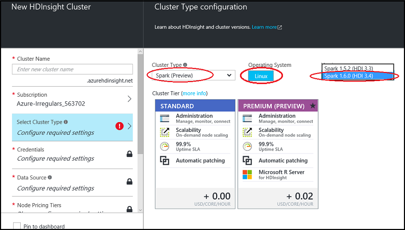
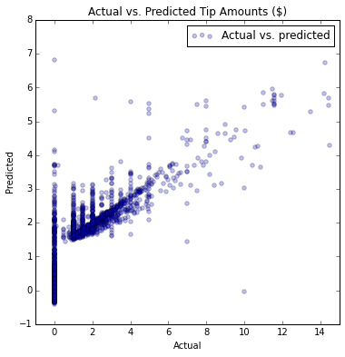

<properties
    pageTitle="Ciência de dados usando Scala e Spark no Azure | Microsoft Azure"
    description="Como usar Scala de tarefas de aprendizado de máquina supervisionada com os Spark MLlib e Spark ML pacotes escaláveis em um cluster de Azure HDInsight Spark."  
    services="machine-learning"
    documentationCenter=""
    authors="bradsev"
    manager="jhubbard"
    editor="cgronlun" />

<tags
    ms.service="machine-learning"
    ms.workload="data-services"
    ms.tgt_pltfrm="na"
    ms.devlang="na"
    ms.topic="article"
    ms.date="08/01/2016"
    ms.author="bradsev;deguhath"/>

# Ciência de dados usando Scala e Spark no Azure

Este artigo mostra como usar Scala para tarefas de aprendizado de máquina supervisionada com os Spark scalable MLlib e Spark ML pacotes em um cluster de Azure HDInsight Spark. Ele orienta as tarefas que constituem o [processo de ciência de dados](http://aka.ms/datascienceprocess): inclusão de dados e exploração, visualização, engenharia de recurso, modelagem e consumo de modelo. Os modelos no artigo incluem regressão linear e logística, aleatórias florestas e árvores aumentou o gradiente (GBTs), além de duas tarefas comuns de aprendizado de máquina supervisionada:

- Problema de regressão: previsão do valor dica ($) para uma viagem de táxi
- Classificação binária: previsão de dica ou nenhuma dica (1/0) para uma viagem de táxi

O processo de modelagem requer treinamento e avaliação de um conjunto de dados de teste e métricas de precisão relevantes. Neste artigo, você pode aprender como armazenar esses modelos no armazenamento de Blob do Azure e como pontuação e avaliar o desempenho de previsão. Este artigo também aborda os tópicos mais avançados de como otimizar modelos usando a limpeza de validação cruzada e hyper-parâmetro. Os dados usados são um exemplo do 2013 NYC táxi viagem e passagens conjunto de dados disponível no GitHub.

[Scala](http://www.scala-lang.org/), um idioma com base na máquina virtual Java, integra conceitos da linguagem orientados a objeto e funcional. É uma linguagem scalable que é adequado para processamento distribuído na nuvem e é executado no Azure Spark clusters.

[Spark](http://spark.apache.org/) é uma estrutura de processamento paralelo de código-fonte aberto que suporta processamento na memória para melhorar o desempenho dos aplicativos de análise de dados grande. O mecanismo de processamento de Spark baseia-se para velocidade, facilidade de uso e a análise de sofisticados. Recursos de computação distribuídos na memória do Spark faça uma boa opção para algoritmos iterativos em cálculos de aprendizagem e gráfico de máquina. O pacote de [spark.ml](http://spark.apache.org/docs/latest/ml-guide.html) fornece um conjunto uniforme de alto nível APIs construído sobre dados quadros que podem ajudá-lo a criar e ajustar prática canais de aprendizado de máquina. [MLlib](http://spark.apache.org/mllib/) é biblioteca de aprendizado de máquina scalable do Spark, que traz recursos de modelagem para esse ambiente distribuído.

[HDInsight Spark](../hdinsight/hdinsight-apache-spark-overview.md) é a oferta hospedados Azure de Spark de código-fonte aberto. Ele também inclui suporte para blocos de anotações de Jupyter Scala no cluster Spark e pode executar consultas de interativo Spark SQL para transformar, filtrar e visualizar dados armazenados em armazenamento de Blob do Azure. Execute os trechos de código de Scala neste artigo que fornecem as soluções e mostram o plotar relevantes para visualizar os dados em blocos de anotações de Jupyter instalados em clusters Spark. As etapas de modelagem nestes tópicos tem código que mostra como treinar, avaliar, salvar e consumir cada tipo de modelo.

As etapas de configuração e o código neste artigo são para Azure HDInsight 3.4 Spark 1,6. No entanto, o código neste artigo e no [Bloco de anotações de Jupyter Scala](https://github.com/Azure/Azure-MachineLearning-DataScience/blob/master/Misc/Spark/Scala/Exploration%20Modeling%20and%20Scoring%20using%20Scala.ipynb) são genérico e deve trabalhar em qualquer cluster Spark. As etapas de configuração e gerenciamento de cluster podem ser um pouco diferentes do que é mostrado neste artigo se você não estiver usando HDInsight Spark.

> [AZURE.NOTE] Para um tópico que mostra como usar Python em vez de Scala para concluir tarefas para um processo de ciência de dados de ponta a ponta, consulte [Ciência de dados usando Spark no Azure HDInsight](machine-learning-data-science-spark-overview.md).

## Pré-requisitos

-   Você deve ter uma assinatura do Azure. Se você ainda não tiver uma, [Obtenha uma avaliação gratuita Azure](https://azure.microsoft.com/documentation/videos/get-azure-free-trial-for-testing-hadoop-in-hdinsight/).

-   Você precisa de um cluster de Azure HDInsight 3.4 Spark 1,6 para concluir os procedimentos a seguir. Para criar um cluster, consulte as instruções em [Introdução: criar Apache Spark em Azurehdinsight](../hdinsight/hdinsight-apache-spark-jupyter-spark-sql.md). Defina o tipo de cluster e versão no menu **Selecionar tipo de Cluster** .

>[AZURE.INCLUDE [delete-cluster-warning](../../includes/hdinsight-delete-cluster-warning.md)]

Para obter uma descrição dos dados de viagem de táxi NYC e instruções sobre como executar código de um bloco de anotações de Jupyter no cluster Spark, consulte as seções relevantes na [Visão geral de dados ciências usando Spark no Azure HDInsight](machine-learning-data-science-spark-overview.md).  

## Executar Scala código de um bloco de anotações de Jupyter no cluster Spark

Você pode iniciar um bloco de anotações de Jupyter do portal do Azure. Encontrar o cluster Spark no painel e clique nele para inserir a página management para seu cluster. Em seguida, clique em **Painéis de Cluster**e clique em **Bloco de anotações de Jupyter** para abrir o bloco de anotações associado ao cluster Spark.

Você também pode acessar blocos de anotações de Jupyter em https://&lt;clustername&gt;.azurehdinsight.net/jupyter. Substitua o nome do seu cluster *clustername* . É necessário a senha da sua conta de administrador acessar os blocos de anotações de Jupyter.

Selecione **Scala** para ver um diretório com alguns exemplos de blocos de anotações predefinidos que usam a API PySpark. A modelagem de exploração e a pontuação usando o bloco de anotações de Scala.ipynb que contém as amostras de código para este conjunto de tópicos Spark está disponível no [GitHub](https://github.com/Azure/Azure-MachineLearning-DataScience/tree/master/Misc/Spark/Scala).

Você pode carregar o bloco de anotações diretamente do GitHub para o servidor de bloco de anotações de Jupyter em seu cluster Spark. Em sua página inicial de Jupyter, clique no botão **carregar** . No Explorador de arquivos, cole a URL de (conteúdo bruto) GitHub do bloco de anotações Scala e clique em **Abrir**. O bloco de anotações Scala está disponível na seguinte URL:

[Exploration-Modeling-and-Scoring-using-Scala.ipynb](https://github.com/Azure/Azure-MachineLearning-DataScience/blob/master/Misc/Spark/Scala/Exploration-Modeling-and-Scoring-using-Scala.ipynb)

## Configuração: Bibliotecas de Spark, magics Spark e contextos Spark predefinir e a seção

### Predefinir contextos Spark e seção

    # SET THE START TIME
    import java.util.Calendar
    val beginningTime = Calendar.getInstance().getTime()

Os kernels Spark que são fornecidos com blocos de anotações de Jupyter têm predefinidas contextos. Você não precisa definir explicitamente o Visual ou contextos de seção antes de começar a trabalhar com o aplicativo que você estão desenvolvendo. Os contextos predefinidos são:

- `sc`para SparkContext
- `sqlContext`para HiveContext

### Spark magics

O núcleo Spark fornece alguns predefinidos "magics", que são comandos especiais que você pode chamar com `%%`. Dois desses comandos são usados nos exemplos de código a seguir.

- `%%local`Especifica que o código nas linhas subsequentes será executado localmente. O código deve ser código Scala válido.
- `%%sql -o <variable name>`executa uma consulta de seção em `sqlContext`. Se o `-o` parâmetro é passado, o resultado da consulta é mantido na `%%local` Scala contexto como um quadro de dados Spark.

Para obter mais informações sobre os kernels para blocos de anotações de Jupyter e seus predefinido "magics" que você chamar com `%%` (por exemplo, `%%local`), consulte [Kernels disponíveis para blocos de anotações de Jupyter com HDInsight Spark Linux clusters em HDInsight](../hdinsight/hdinsight-apache-spark-jupyter-notebook-kernels.md).

### Bibliotecas de importação

Importe o Visual, MLlib e outras bibliotecas que você precisará usando o código a seguir.

    # IMPORT SPARK AND JAVA LIBRARIES
    import org.apache.spark.sql.SQLContext
    import org.apache.spark.sql.functions._
    import java.text.SimpleDateFormat
    import java.util.Calendar
    import sqlContext.implicits._
    import org.apache.spark.sql.Row

    # IMPORT SPARK SQL FUNCTIONS
    import org.apache.spark.sql.types.{StructType, StructField, StringType, IntegerType, FloatType, DoubleType}
    import org.apache.spark.sql.functions.rand

    # IMPORT SPARK ML FUNCTIONS
    import org.apache.spark.ml.Pipeline
    import org.apache.spark.ml.feature.{StringIndexer, VectorAssembler, OneHotEncoder, VectorIndexer, Binarizer}
    import org.apache.spark.ml.tuning.{ParamGridBuilder, TrainValidationSplit, CrossValidator}
    import org.apache.spark.ml.regression.{LinearRegression, LinearRegressionModel, RandomForestRegressor, RandomForestRegressionModel, GBTRegressor, GBTRegressionModel}
    import org.apache.spark.ml.classification.{LogisticRegression, LogisticRegressionModel, RandomForestClassifier, RandomForestClassificationModel, GBTClassifier, GBTClassificationModel}
    import org.apache.spark.ml.evaluation.{BinaryClassificationEvaluator, RegressionEvaluator, MulticlassClassificationEvaluator}

    # IMPORT SPARK MLLIB FUNCTIONS
    import org.apache.spark.mllib.linalg.{Vector, Vectors}
    import org.apache.spark.mllib.util.MLUtils
    import org.apache.spark.mllib.classification.{LogisticRegressionWithLBFGS, LogisticRegressionModel}
    import org.apache.spark.mllib.regression.{LabeledPoint, LinearRegressionWithSGD, LinearRegressionModel}
    import org.apache.spark.mllib.tree.{GradientBoostedTrees, RandomForest}
    import org.apache.spark.mllib.tree.configuration.BoostingStrategy
    import org.apache.spark.mllib.tree.model.{GradientBoostedTreesModel, RandomForestModel, Predict}
    import org.apache.spark.mllib.evaluation.{BinaryClassificationMetrics, MulticlassMetrics, RegressionMetrics}

    # SPECIFY SQLCONTEXT
    val sqlContext = new SQLContext(sc)

## Inclusão de dados

A primeira etapa no processo de ciência de dados é inclusão os dados que você deseja analisar. Você pode trazer os dados de fontes externas ou sistemas onde ele está localizado em seu ambiente de modelagem e exploração de dados. Neste artigo, os dados que você inclusão são uma amostra de 0,1% unidas do táxi viagem e passagens arquivo (armazenado como um arquivo. tsv). O ambiente de exploração e modelagem de dados é Spark. Esta seção contém o código para concluir a série de tarefas a seguir:

1. Definir caminhos de diretório para o armazenamento de dados e modelo.
2. Leia no conjunto de dados de entrada (armazenado como um arquivo. tsv).
3. Definir um esquema para os dados e limpar os dados.
4. Criar um quadro de dados limpo e cache na memória.
5. Registre os dados como uma tabela temporária no SQLContext.
6. A tabela de consulta e importar os resultados para um quadro de dados.

### Definir caminhos de diretório para locais de armazenamento no armazenamento de Blob do Azure

Spark possa ler e gravar ao armazenamento de Blob do Azure. Você pode usar Spark para processar qualquer um dos seus dados existentes e armazenar os resultados novamente no armazenamento de Blob.

Para salvar arquivos ou modelos no armazenamento de Blob, você precisa especificar o caminho corretamente. Referenciar o contêiner padrão conectado ao cluster Spark usando um caminho que começa com `wasb:///`. Referência de outros locais usando `wasb://`.

O exemplo de código a seguir especifica o local dos dados de entrada para ser lido e o caminho para o armazenamento de Blob que está anexado ao cluster Spark onde o modelo será salvo.

    # SET PATHS TO DATA AND MODEL FILE LOCATIONS
    # INGEST DATA AND SPECIFY HEADERS FOR COLUMNS
    val taxi_train_file = sc.textFile("wasb://mllibwalkthroughs@cdspsparksamples.blob.core.windows.net/Data/NYCTaxi/JoinedTaxiTripFare.Point1Pct.Train.tsv")
    val header = taxi_train_file.first;

    # SET THE MODEL STORAGE DIRECTORY PATH
    # NOTE THAT THE FINAL BACKSLASH IN THE PATH IS REQUIRED.
    val modelDir = "wasb:///user/remoteuser/NYCTaxi/Models/";

### Importar dados, criar um RDD e definir um quadro de dados de acordo com o esquema

    # RECORD THE START TIME
    val starttime = Calendar.getInstance().getTime()

    # DEFINE THE SCHEMA BASED ON THE HEADER OF THE FILE
    val sqlContext = new SQLContext(sc)
    val taxi_schema = StructType(
        Array(
            StructField("medallion", StringType, true),
            StructField("hack_license", StringType, true),
            StructField("vendor_id", StringType, true),
            StructField("rate_code", DoubleType, true),
            StructField("store_and_fwd_flag", StringType, true),
            StructField("pickup_datetime", StringType, true),
            StructField("dropoff_datetime", StringType, true),
            StructField("pickup_hour", DoubleType, true),
            StructField("pickup_week", DoubleType, true),
            StructField("weekday", DoubleType, true),
            StructField("passenger_count", DoubleType, true),
            StructField("trip_time_in_secs", DoubleType, true),
            StructField("trip_distance", DoubleType, true),
            StructField("pickup_longitude", DoubleType, true),
            StructField("pickup_latitude", DoubleType, true),
            StructField("dropoff_longitude", DoubleType, true),
            StructField("dropoff_latitude", DoubleType, true),
            StructField("direct_distance", StringType, true),
            StructField("payment_type", StringType, true),
            StructField("fare_amount", DoubleType, true),
            StructField("surcharge", DoubleType, true),
            StructField("mta_tax", DoubleType, true),
            StructField("tip_amount", DoubleType, true),
            StructField("tolls_amount", DoubleType, true),
            StructField("total_amount", DoubleType, true),
            StructField("tipped", DoubleType, true),
            StructField("tip_class", DoubleType, true)
            )
        )

    # CAST VARIABLES ACCORDING TO THE SCHEMA
    val taxi_temp = (taxi_train_file.map(_.split("\t"))
                            .filter((r) => r(0) != "medallion")
                            .map(p => Row(p(0), p(1), p(2),
                                p(3).toDouble, p(4), p(5), p(6), p(7).toDouble, p(8).toDouble, p(9).toDouble, p(10).toDouble,
                                p(11).toDouble, p(12).toDouble, p(13).toDouble, p(14).toDouble, p(15).toDouble, p(16).toDouble,
                                p(17), p(18), p(19).toDouble, p(20).toDouble, p(21).toDouble, p(22).toDouble,
                                p(23).toDouble, p(24).toDouble, p(25).toDouble, p(26).toDouble)))

    # CREATE AN INITIAL DATA FRAME AND DROP COLUMNS, AND THEN CREATE A CLEANED DATA FRAME BY FILTERING FOR UNWANTED VALUES OR OUTLIERS
    val taxi_train_df = sqlContext.createDataFrame(taxi_temp, taxi_schema)

    val taxi_df_train_cleaned = (taxi_train_df.drop(taxi_train_df.col("medallion"))
            .drop(taxi_train_df.col("hack_license")).drop(taxi_train_df.col("store_and_fwd_flag"))
            .drop(taxi_train_df.col("pickup_datetime")).drop(taxi_train_df.col("dropoff_datetime"))
            .drop(taxi_train_df.col("pickup_longitude")).drop(taxi_train_df.col("pickup_latitude"))
            .drop(taxi_train_df.col("dropoff_longitude")).drop(taxi_train_df.col("dropoff_latitude"))
            .drop(taxi_train_df.col("surcharge")).drop(taxi_train_df.col("mta_tax"))
            .drop(taxi_train_df.col("direct_distance")).drop(taxi_train_df.col("tolls_amount"))
            .drop(taxi_train_df.col("total_amount")).drop(taxi_train_df.col("tip_class"))
            .filter("passenger_count > 0 and passenger_count < 8 AND payment_type in ('CSH', 'CRD') AND tip_amount >= 0 AND tip_amount < 30 AND fare_amount >= 1 AND fare_amount < 150 AND trip_distance > 0 AND trip_distance < 100 AND trip_time_in_secs > 30 AND trip_time_in_secs < 7200"));

    # CACHE AND MATERIALIZE THE CLEANED DATA FRAME IN MEMORY
    taxi_df_train_cleaned.cache()
    taxi_df_train_cleaned.count()

    # REGISTER THE DATA FRAME AS A TEMPORARY TABLE IN SQLCONTEXT
    taxi_df_train_cleaned.registerTempTable("taxi_train")

    # GET THE TIME TO RUN THE CELL
    val endtime = Calendar.getInstance().getTime()
    val elapsedtime =  ((endtime.getTime() - starttime.getTime())/1000).toString;
    println("Time taken to run the above cell: " + elapsedtime + " seconds.");

**Saída:**

Tempo para ser executado na célula: 8 segundos.

### Importar os resultados em um quadro de dados e a tabela de consulta

Em seguida, consultar a tabela para passagens, passageiro e dados de dica; Filtrar dados externos e corrompidos; e imprimir várias linhas.

    # QUERY THE DATA
    val sqlStatement = """
        SELECT fare_amount, passenger_count, tip_amount, tipped
        FROM taxi_train
        WHERE passenger_count > 0 AND passenger_count < 7
        AND fare_amount > 0 AND fare_amount < 200
        AND payment_type in ('CSH', 'CRD')
        AND tip_amount > 0 AND tip_amount < 25
    """
    val sqlResultsDF = sqlContext.sql(sqlStatement)

    # SHOW ONLY THE TOP THREE ROWS
    sqlResultsDF.show(3)

**Saída:**

fare_amount|passenger_count|tip_amount|Oblíquo
-----------|---------------|----------|------
       13.5|            1.0|       2,9|   1.0
       16.0|            2.0|       3.4|   1.0
       10.5|            2.0|       1.0|   1.0

## Visualização e exploração de dados

Após você trazer os dados para Spark, a próxima etapa no processo de ciência de dados é obter uma compreensão mais profunda dos dados por meio de exploração e visualização. Nesta seção, você pode examinar os dados de táxi usando consultas SQL. Em seguida, importe os resultados para um quadro de dados para plotar as variáveis de destino e recursos potenciais para inspeção visual usando o recurso de autovisualização de Jupyter.

### Local de uso e mágico SQL para plotar dados

Por padrão, a saída de qualquer trecho de código que você executar um bloco de anotações de Jupyter está disponível dentro do contexto da sessão que é mantido em nós trabalhador. Se você quiser salvar uma viagem os nós de trabalhador para cada cálculo e se todos os dados que você precisa para seu cálculo está disponível localmente no nó do servidor Jupyter (que é o nó principal), você pode usar o `%%local` mágico para executar o trecho de código no servidor Jupyter.

- **Mágico SQL** (`%%sql`). O núcleo HDInsight Spark suporta embutida fácil HiveQL consultas SQLContext. O (`-o VARIABLE_NAME`) argumento persiste a saída da consulta SQL como um quadro de dados Pandas no servidor Jupyter. Isso significa que ela estará disponível no modo local.
- `%%local`**mágico**. O `%%local` mágico executa o código localmente no servidor Jupyter, que é o nó principal do cluster HDInsight. Normalmente, você usa `%%local` mágico em conjunto com o `%%sql` mágico com a `-o` parâmetro. O `-o` parâmetro persistir a saída da consulta SQL localmente e então `%%local` mágico seria disparar o próximo conjunto de trecho de código para ser executada localmente em relação a saída das consultas SQL que é mantida localmente.

### Consultar os dados usando o SQL
Essa consulta recupera as viagens táxi pelo valor de tarifa, contagem de passageiro e quantidade de dica.

    # RUN THE SQL QUERY
    %%sql -q -o sqlResults
    SELECT fare_amount, passenger_count, tip_amount, tipped FROM taxi_train WHERE passenger_count > 0 AND passenger_count < 7 AND fare_amount > 0 AND fare_amount < 200 AND payment_type in ('CSH', 'CRD') AND tip_amount > 0 AND tip_amount < 25

No código a seguir, o `%%local` mágico cria um quadro de dados local, sqlResults. Você pode usar sqlResults plotar usando matplotlib.

> [AZURE.TIP] Mágico local é usado várias vezes neste artigo. Se seu conjunto de dados for grande, exemplo para criar um quadro de dados que pode caber na memória local.

### Plotar os dados

Você pode plotar usando código Python após o quadro de dados está no contexto local como um quadro de dados Pandas.

    # RUN THE CODE LOCALLY ON THE JUPYTER SERVER
    %%local

    # USE THE JUPYTER AUTO-PLOTTING FEATURE TO CREATE INTERACTIVE FIGURES.
    # CLICK THE TYPE OF PLOT TO GENERATE (LINE, AREA, BAR, ETC.)
    sqlResults

 O núcleo Spark automaticamente visualiza a saída de consultas SQL (HiveQL) depois de executar o código. Você pode escolher entre vários tipos de visualizações:
 
- Tabela
- Pizza
- Linha
- Área
- Barra

Aqui está o código para plotar os dados:

    # RUN THE CODE LOCALLY ON THE JUPYTER SERVER AND IMPORT LIBRARIES
    %%local
    import matplotlib.pyplot as plt
    %matplotlib inline

    # PLOT TIP BY PAYMENT TYPE AND PASSENGER COUNT
    ax1 = sqlResults[['tip_amount']].plot(kind='hist', bins=25, facecolor='lightblue')
    ax1.set_title('Tip amount distribution')
    ax1.set_xlabel('Tip Amount ($)')
    ax1.set_ylabel('Counts')
    plt.suptitle('')
    plt.show()

    # PLOT TIP BY PASSENGER COUNT
    ax2 = sqlResults.boxplot(column=['tip_amount'], by=['passenger_count'])
    ax2.set_title('Tip amount by Passenger count')
    ax2.set_xlabel('Passenger count')
    ax2.set_ylabel('Tip Amount ($)')
    plt.suptitle('')
    plt.show()

    # PLOT TIP AMOUNT BY FARE AMOUNT; SCALE POINTS BY PASSENGER COUNT
    ax = sqlResults.plot(kind='scatter', x= 'fare_amount', y = 'tip_amount', c='blue', alpha = 0.10, s=5*(sqlResults.passenger_count))
    ax.set_title('Tip amount by Fare amount')
    ax.set_xlabel('Fare Amount ($)')
    ax.set_ylabel('Tip Amount ($)')
    plt.axis([-2, 80, -2, 20])
    plt.show()

**Saída:**

## Criar recursos e transformar os recursos e, em seguida, preparar dados de entrada em funções de modelagem

Para funções de modelagem baseada em árvore do Spark ML e MLlib, você precisa preparar o destino e recursos usando uma variedade de técnicas, como binning, indexação, quente uma codificação e vetorização. Aqui estão os procedimentos a seguir nesta seção:

1. Crie um novo recurso por **binning** horas em classificações de tempo de tráfego.
2. Aplica **indexação e quentes uma codificação** aos recursos de categorias.
3. **Amostra e dividir o conjunto de dados** em frações de teste e treinamento.
4. **Recursos e especificar variável de treinamento**e, em seguida, criar indexado ou quente um codificada de treinamento e teste entrado ponto rotulado flexível distribuído conjuntos de dados (RDDs) ou quadros de dados.
5. Automaticamente **categorizar e vectorize recursos e destinos** para usar como entradas de modelos de aprendizado de máquina.

### Criar um novo recurso por binning horas em classificações de tempo de tráfego

Este código mostra como criar um novo recurso por binning horas em classificações de tempo de tráfego e como o quadro de dados resultante na memória em cache. Onde os quadros de dados e RDDs são usados repetidamente, cache leva a aprimorada tempos de execução. Portanto, você vai cache RDDs e quadros de dados em vários estágios procedimentos a seguir.

    # CREATE FOUR BUCKETS FOR TRAFFIC TIMES
    val sqlStatement = """
        SELECT *,
        CASE
         WHEN (pickup_hour <= 6 OR pickup_hour >= 20) THEN "Night"
         WHEN (pickup_hour >= 7 AND pickup_hour <= 10) THEN "AMRush"
         WHEN (pickup_hour >= 11 AND pickup_hour <= 15) THEN "Afternoon"
         WHEN (pickup_hour >= 16 AND pickup_hour <= 19) THEN "PMRush"
        END as TrafficTimeBins
        FROM taxi_train
    """
    val taxi_df_train_with_newFeatures = sqlContext.sql(sqlStatement)

    # CACHE THE DATA FRAME IN MEMORY AND MATERIALIZE THE DATA FRAME IN MEMORY
    taxi_df_train_with_newFeatures.cache()
    taxi_df_train_with_newFeatures.count()

### Indexação e quentes uma codificação de recursos de categorias

A modelagem e prever funções de MLlib requerem os recursos com dados de entrada categóricos ser indexados ou codificado antes de usar. Esta seção mostra como indexar ou codificar categóricos recursos para entrada para as funções de modelagem.

Você precisa indexar ou codificar seus modelos de maneiras diferentes, dependendo do modelo. Por exemplo, modelos de regressão linear e logística exigem um quentes codificação. Por exemplo, um recurso com três categorias pode ser expandido em três colunas de recurso. Cada coluna contém 0 ou 1 de acordo com a categoria de uma observação. MLlib fornece a função [OneHotEncoder](http://scikit-learn.org/stable/modules/generated/sklearn.preprocessing.OneHotEncoder.html#sklearn.preprocessing.OneHotEncoder) para quentes uma codificação. Este codificador mapeia uma coluna de índices de etiqueta para uma coluna de vetores binários com no máximo um único um valor. Com essa codificação, algoritmos que espera recursos de valores numéricos, como Regressão logística, podem ser aplicados aos recursos de categorias.

Aqui você transformar somente quatro variáveis para mostrar exemplos, que são cadeias de caracteres. Você também pode indexar outras variáveis, como o dia da semana, representados por valores numéricos, como variáveis de categorias.

Para a indexação, use `StringIndexer()`e para quentes uma codificação, use `OneHotEncoder()` funções do MLlib. Aqui está o código para indexar e codificar recursos categóricos:

    # CREATE INDEXES AND ONE-HOT ENCODED VECTORS FOR SEVERAL CATEGORICAL FEATURES

    # RECORD THE START TIME
    val starttime = Calendar.getInstance().getTime()

    # INDEX AND ENCODE VENDOR_ID
    val stringIndexer = new StringIndexer().setInputCol("vendor_id").setOutputCol("vendorIndex").fit(taxi_df_train_with_newFeatures)
    val indexed = stringIndexer.transform(taxi_df_train_with_newFeatures)
    val encoder = new OneHotEncoder().setInputCol("vendorIndex").setOutputCol("vendorVec")
    val encoded1 = encoder.transform(indexed)

    # INDEX AND ENCODE RATE_CODE
    val stringIndexer = new StringIndexer().setInputCol("rate_code").setOutputCol("rateIndex").fit(encoded1)
    val indexed = stringIndexer.transform(encoded1)
    val encoder = new OneHotEncoder().setInputCol("rateIndex").setOutputCol("rateVec")
    val encoded2 = encoder.transform(indexed)

    # INDEX AND ENCODE PAYMENT_TYPE
    val stringIndexer = new StringIndexer().setInputCol("payment_type").setOutputCol("paymentIndex").fit(encoded2)
    val indexed = stringIndexer.transform(encoded2)
    val encoder = new OneHotEncoder().setInputCol("paymentIndex").setOutputCol("paymentVec")
    val encoded3 = encoder.transform(indexed)

    # INDEX AND TRAFFIC TIME BINS
    val stringIndexer = new StringIndexer().setInputCol("TrafficTimeBins").setOutputCol("TrafficTimeBinsIndex").fit(encoded3)
    val indexed = stringIndexer.transform(encoded3)
    val encoder = new OneHotEncoder().setInputCol("TrafficTimeBinsIndex").setOutputCol("TrafficTimeBinsVec")
    val encodedFinal = encoder.transform(indexed)

    # GET THE TIME TO RUN THE CELL
    val endtime = Calendar.getInstance().getTime()
    val elapsedtime =  ((endtime.getTime() - starttime.getTime())/1000).toString;
    println("Time taken to run the above cell: " + elapsedtime + " seconds.");

**Saída:**

Tempo para ser executado na célula: 4 segundos.

### Amostra e dividir o conjunto de dados em frações de teste e treinamento

Esse código cria uma amostragem aleatória dos dados (25%, neste exemplo). Embora amostragem não é necessária para este exemplo devido ao tamanho do conjunto de dados, o artigo mostra como você pode obter amostra para que você saiba como usá-lo para seus próprios problemas quando necessário. Quando amostras forem grandes, isso pode poupar tempo significativo enquanto você treinar modelos. Em seguida, divida o exemplo em uma parte de treinamento (75%, neste exemplo) e uma parte de teste (25%, neste exemplo) para usar em classificação e modelagem de regressão.

Adicione um número aleatório (entre 0 e 1) para cada linha (em uma coluna de "aleatório") que pode ser usada para selecionar validação cruzada dobras durante o treinamento.

    # RECORD THE START TIME
    val starttime = Calendar.getInstance().getTime()

    # SPECIFY SAMPLING AND SPLITTING FRACTIONS
    val samplingFraction = 0.25;
    val trainingFraction = 0.75;
    val testingFraction = (1-trainingFraction);
    val seed = 1234;
    val encodedFinalSampledTmp = encodedFinal.sample(withReplacement = false, fraction = samplingFraction, seed = seed)
    val sampledDFcount = encodedFinalSampledTmp.count().toInt

    val generateRandomDouble = udf(() => {
        scala.util.Random.nextDouble
    })

    # ADD A RANDOM NUMBER FOR CROSS-VALIDATION
    val encodedFinalSampled = encodedFinalSampledTmp.withColumn("rand", generateRandomDouble());

    # SPLIT THE SAMPLED DATA FRAME INTO TRAIN AND TEST, WITH A RANDOM COLUMN ADDED FOR DOING CROSS-VALIDATION (SHOWN LATER)
    # INCLUDE A RANDOM COLUMN FOR CREATING CROSS-VALIDATION FOLDS
    val splits = encodedFinalSampled.randomSplit(Array(trainingFraction, testingFraction), seed = seed)
    val trainData = splits(0)
    val testData = splits(1)

    # GET THE TIME TO RUN THE CELL
    val endtime = Calendar.getInstance().getTime()
    val elapsedtime =  ((endtime.getTime() - starttime.getTime())/1000).toString;
    println("Time taken to run the above cell: " + elapsedtime + " seconds.");

**Saída:**

Tempo para ser executado na célula: 2 segundos.

### Especificar recursos e variável de treinamento e crie indexado ou um quentes codificado de treinamento e teste rotulada quadros de dados ou RDDs de ponto de entrada

Esta seção contém código que mostra como indexar dados de texto categórica como um tipo de dados de ponto de rotulado e codificá-lo para poder usá-lo para treinar e testar Regressão logística MLlib e outros modelos de classificação. Objetos de ponto de rotulado são RDDs formatadas de uma maneira que é necessário como dados de entrada pela maioria dos algoritmos em MLlib de aprendizado de máquina. Um [ponto de rotulado](https://spark.apache.org/docs/latest/mllib-data-types.html#labeled-point) é um vetor de local, condensado denso ou esparso, associado a uma rótulo/resposta.

Nesse código, você pode especificar a variável de destino (dependentes) e os recursos de usar para treinar modelos. Em seguida, crie indexado ou quente um codificada de treinamento e teste rotulada quadros de dados ou RDDs de ponto de entrada.

    # RECORD THE START TIME
    val starttime = Calendar.getInstance().getTime()

    # MAP NAMES OF FEATURES AND TARGETS FOR CLASSIFICATION AND REGRESSION PROBLEMS
    val featuresIndOneHot = List("paymentVec", "vendorVec", "rateVec", "TrafficTimeBinsVec", "pickup_hour", "weekday", "passenger_count", "trip_time_in_secs", "trip_distance", "fare_amount").map(encodedFinalSampled.columns.indexOf(_))
    val featuresIndIndex = List("paymentIndex", "vendorIndex", "rateIndex", "TrafficTimeBinsIndex", "pickup_hour", "weekday", "passenger_count", "trip_time_in_secs", "trip_distance", "fare_amount").map(encodedFinalSampled.columns.indexOf(_))

    # SPECIFY THE TARGET FOR CLASSIFICATION ('tipped') AND REGRESSION ('tip_amount') PROBLEMS
    val targetIndBinary = List("tipped").map(encodedFinalSampled.columns.indexOf(_))
    val targetIndRegression = List("tip_amount").map(encodedFinalSampled.columns.indexOf(_))

    # CREATE INDEXED LABELED POINT RDD OBJECTS
    val indexedTRAINbinary = trainData.rdd.map(r => LabeledPoint(r.getDouble(targetIndBinary(0).toInt), Vectors.dense(featuresIndIndex.map(r.getDouble(_)).toArray)))
    val indexedTESTbinary = testData.rdd.map(r => LabeledPoint(r.getDouble(targetIndBinary(0).toInt), Vectors.dense(featuresIndIndex.map(r.getDouble(_)).toArray)))
    val indexedTRAINreg = trainData.rdd.map(r => LabeledPoint(r.getDouble(targetIndRegression(0).toInt), Vectors.dense(featuresIndIndex.map(r.getDouble(_)).toArray)))
    val indexedTESTreg = testData.rdd.map(r => LabeledPoint(r.getDouble(targetIndRegression(0).toInt), Vectors.dense(featuresIndIndex.map(r.getDouble(_)).toArray)))

    # CREATE INDEXED DATA FRAMES THAT YOU CAN USE TO TRAIN BY USING SPARK ML FUNCTIONS
    val indexedTRAINbinaryDF = indexedTRAINbinary.toDF()
    val indexedTESTbinaryDF = indexedTESTbinary.toDF()
    val indexedTRAINregDF = indexedTRAINreg.toDF()
    val indexedTESTregDF = indexedTESTreg.toDF()

    # CREATE ONE-HOT ENCODED (VECTORIZED) DATA FRAMES THAT YOU CAN USE TO TRAIN BY USING SPARK ML FUNCTIONS
    val assemblerOneHot = new VectorAssembler().setInputCols(Array("paymentVec", "vendorVec", "rateVec", "TrafficTimeBinsVec", "pickup_hour", "weekday", "passenger_count", "trip_time_in_secs", "trip_distance", "fare_amount")).setOutputCol("features")
    val OneHotTRAIN = assemblerOneHot.transform(trainData)
    val OneHotTEST = assemblerOneHot.transform(testData)

    # GET THE TIME TO RUN THE CELL
    val endtime = Calendar.getInstance().getTime()
    val elapsedtime =  ((endtime.getTime() - starttime.getTime())/1000).toString;
    println("Time taken to run the above cell: " + elapsedtime + " seconds.");

**Saída:**

Tempo para ser executado na célula: 4 segundos.

### Categorizar e vectorize recursos e destinos para usar como entradas de modelos de aprendizado de máquina automaticamente

Use Spark ML para categorizar o destino e recursos para usar nas funções de modelagem baseado em árvore. O código conclui duas tarefas:

-   Cria um destino binário para classificação atribuindo um valor de 0 ou 1 para cada ponto de dados entre 0 e 1, usando um valor limite de 0,5.
- Categoriza automaticamente recursos. Se o número de valores numéricos distintos para qualquer recurso for menor que 32, esse recurso é categorizado.

Aqui está o código para essas duas tarefas.

    # CATEGORIZE FEATURES AND BINARIZE THE TARGET FOR THE BINARY CLASSIFICATION PROBLEM

    # TRAIN DATA
    val indexer = new VectorIndexer().setInputCol("features").setOutputCol("featuresCat").setMaxCategories(32)
    val indexerModel = indexer.fit(indexedTRAINbinaryDF)
    val indexedTrainwithCatFeat = indexerModel.transform(indexedTRAINbinaryDF)
    val binarizer: Binarizer = new Binarizer().setInputCol("label").setOutputCol("labelBin").setThreshold(0.5)
    val indexedTRAINwithCatFeatBinTarget = binarizer.transform(indexedTrainwithCatFeat)

    # TEST DATA
    val indexerModel = indexer.fit(indexedTESTbinaryDF)
    val indexedTrainwithCatFeat = indexerModel.transform(indexedTESTbinaryDF)
    val binarizer: Binarizer = new Binarizer().setInputCol("label").setOutputCol("labelBin").setThreshold(0.5)
    val indexedTESTwithCatFeatBinTarget = binarizer.transform(indexedTrainwithCatFeat)

    # CATEGORIZE FEATURES FOR THE REGRESSION PROBLEM
    # CREATE PROPERLY INDEXED AND CATEGORIZED DATA FRAMES FOR TREE-BASED MODELS

    # TRAIN DATA
    val indexer = new VectorIndexer().setInputCol("features").setOutputCol("featuresCat").setMaxCategories(32)
    val indexerModel = indexer.fit(indexedTRAINregDF)
    val indexedTRAINwithCatFeat = indexerModel.transform(indexedTRAINregDF)

    # TEST DATA
    val indexerModel = indexer.fit(indexedTESTbinaryDF)
    val indexedTESTwithCatFeat = indexerModel.transform(indexedTESTregDF)

## Modelo de classificação binária: prever se uma dica deve ser pagas

Nesta seção, você criar três tipos de modelos de classificação binária prever estando ou não uma dica deve ser pago:

- Um **modelo de regressão logística** usando o ML Spark `LogisticRegression()` função
- Um **modelo de classificação de floresta aleatório** usando o ML Spark `RandomForestClassifier()` função
- Um **modelo de classificação de árvore de aumento de gradiente** usando o MLlib `GradientBoostedTrees()` função

### Criar um modelo de regressão logística

Em seguida, criar um modelo de regressão logística usando o ML Spark `LogisticRegression()` função. Criar o modelo de criação de código em uma série de etapas:

1. Conjunto de dados de **treinar o modelo** com um parâmetro.
2. **Avaliar o modelo** em um conjunto de dados de teste com métricas.
3. **Salve o modelo** no armazenamento de Blob para consumo futuro.
4. **Pontuação o modelo de** dados de teste.
5. **Plotar os resultados** com receptor operacional curvas características (ROC).

Aqui está o código para estes procedimentos:

    # CREATE A LOGISTIC REGRESSION MODEL
    val lr = new LogisticRegression().setLabelCol("tipped").setFeaturesCol("features").setMaxIter(10).setRegParam(0.3).setElasticNetParam(0.8)
    val lrModel = lr.fit(OneHotTRAIN)

    # PREDICT ON THE TEST DATA SET
    val predictions = lrModel.transform(OneHotTEST)

    # SELECT `BinaryClassificationEvaluator()` TO COMPUTE THE TEST ERROR
    val evaluator = new BinaryClassificationEvaluator().setLabelCol("tipped").setRawPredictionCol("probability").setMetricName("areaUnderROC")
    val ROC = evaluator.evaluate(predictions)
    println("ROC on test data = " + ROC)

    # SAVE THE MODEL
    val datestamp = Calendar.getInstance().getTime().toString.replaceAll(" ", ".").replaceAll(":", "_");
    val modelName = "LogisticRegression__"
    val filename = modelDir.concat(modelName).concat(datestamp)
    lrModel.save(filename);

Carregar, pontuação e salvar os resultados.

    # RECORD THE START TIME
    val starttime = Calendar.getInstance().getTime()

    # LOAD THE SAVED MODEL AND SCORE THE TEST DATA SET
    val savedModel = org.apache.spark.ml.classification.LogisticRegressionModel.load(filename)
    println(s"Coefficients: ${savedModel.coefficients} Intercept: ${savedModel.intercept}")

    # SCORE THE MODEL ON THE TEST DATA
    val predictions = savedModel.transform(OneHotTEST).select("tipped","probability","rawPrediction")
    predictions.registerTempTable("testResults")

    # SELECT `BinaryClassificationEvaluator()` TO COMPUTE THE TEST ERROR
    val evaluator = new BinaryClassificationEvaluator().setLabelCol("tipped").setRawPredictionCol("probability").setMetricName("areaUnderROC")
    val ROC = evaluator.evaluate(predictions)

    # GET THE TIME TO RUN THE CELL
    val endtime = Calendar.getInstance().getTime()
    val elapsedtime =  ((endtime.getTime() - starttime.getTime())/1000).toString;
    println("Time taken to run the above cell: " + elapsedtime + " seconds.");

    # PRINT THE ROC RESULTS
    println("ROC on test data = " + ROC)

**Saída:**

ROC nos dados de teste = 0.9827381497557599

Use Python em quadros de dados locais Pandas plotar curva ROC.

    # QUERY THE RESULTS
    %%sql -q -o sqlResults
    SELECT tipped, probability from testResults

    # RUN THE CODE LOCALLY ON THE JUPYTER SERVER AND IMPORT LIBRARIES
    %%local
    %matplotlib inline
    from sklearn.metrics import roc_curve,auc

    sqlResults['probFloat'] = sqlResults.apply(lambda row: row['probability'].values()[0][1], axis=1)
    predictions_pddf = sqlResults[["tipped","probFloat"]]

    # PREDICT THE ROC CURVE
    # predictions_pddf = sqlResults.rename(columns={'_1': 'probability', 'tipped': 'label'})
    prob = predictions_pddf["probFloat"]
    fpr, tpr, thresholds = roc_curve(predictions_pddf['tipped'], prob, pos_label=1);
    roc_auc = auc(fpr, tpr)

    # PLOT THE ROC CURVE
    plt.figure(figsize=(5,5))
    plt.plot(fpr, tpr, label='ROC curve (area = %0.2f)' % roc_auc)
    plt.plot([0, 1], [0, 1], 'k--')
    plt.xlim([0.0, 1.0])
    plt.ylim([0.0, 1.05])
    plt.xlabel('False Positive Rate')
    plt.ylabel('True Positive Rate')
    plt.title('ROC Curve')
    plt.legend(loc="lower right")
    plt.show()

**Saída:**

### Criar um modelo de classificação de floresta aleatórios

Em seguida, criar um modelo de classificação de floresta aleatório usando o ML Spark `RandomForestClassifier()` funcionar e então avaliar o modelo de dados de teste.

    # RECORD THE START TIME
    val starttime = Calendar.getInstance().getTime()

    # CREATE THE RANDOM FOREST CLASSIFIER MODEL
    val rf = new RandomForestClassifier().setLabelCol("labelBin").setFeaturesCol("featuresCat").setNumTrees(10).setSeed(1234)

    # FIT THE MODEL
    val rfModel = rf.fit(indexedTRAINwithCatFeatBinTarget)
    val predictions = rfModel.transform(indexedTESTwithCatFeatBinTarget)

    # EVALUATE THE MODEL
    val evaluator = new MulticlassClassificationEvaluator().setLabelCol("label").setPredictionCol("prediction").setMetricName("f1")
    val Test_f1Score = evaluator.evaluate(predictions)
    println("F1 score on test data: " + Test_f1Score);

    # GET THE TIME TO RUN THE CELL
    val endtime = Calendar.getInstance().getTime()
    val elapsedtime =  ((endtime.getTime() - starttime.getTime())/1000).toString;
    println("Time taken to run the above cell: " + elapsedtime + " seconds.");

    # CALCULATE BINARY CLASSIFICATION EVALUATION METRICS
    val evaluator = new BinaryClassificationEvaluator().setLabelCol("label").setRawPredictionCol("probability").setMetricName("areaUnderROC")
    val ROC = evaluator.evaluate(predictions)
    println("ROC on test data = " + ROC)

**Saída:**

ROC nos dados de teste = 0.9847103571552683

### Criar um modelo de classificação de GBT

Em seguida, criar um modelo de classificação de GBT usando do MLlib `GradientBoostedTrees()` funcionar e então avaliar o modelo de dados de teste.

    # TRAIN A GBT CLASSIFICATION MODEL BY USING MLLIB AND A LABELED POINT

    # RECORD THE START TIME
    val starttime = Calendar.getInstance().getTime()

    # DEFINE THE GBT CLASSIFICATION MODEL
    val boostingStrategy = BoostingStrategy.defaultParams("Classification")
    boostingStrategy.numIterations = 20
    boostingStrategy.treeStrategy.numClasses = 2
    boostingStrategy.treeStrategy.maxDepth = 5
    boostingStrategy.treeStrategy.categoricalFeaturesInfo = Map[Int, Int]((0,2),(1,2),(2,6),(3,4))

    # TRAIN THE MODEL
    val gbtModel = GradientBoostedTrees.train(indexedTRAINbinary, boostingStrategy)

    # SAVE THE MODEL IN BLOB STORAGE
    val datestamp = Calendar.getInstance().getTime().toString.replaceAll(" ", ".").replaceAll(":", "_");
    val modelName = "GBT_Classification__"
    val filename = modelDir.concat(modelName).concat(datestamp)
    gbtModel.save(sc, filename);

    # EVALUATE THE MODEL ON TEST INSTANCES AND THE COMPUTE TEST ERROR
    val labelAndPreds = indexedTESTbinary.map { point =>
      val prediction = gbtModel.predict(point.features)
      (point.label, prediction)
    }
    val testErr = labelAndPreds.filter(r => r._1 != r._2).count.toDouble / indexedTRAINbinary.count()
    //println("Learned classification GBT model:\n" + gbtModel.toDebugString)
    println("Test Error = " + testErr)

    # USE BINARY AND MULTICLASS METRICS TO EVALUATE THE MODEL ON THE TEST DATA
    val metrics = new MulticlassMetrics(labelAndPreds)
    println(s"Precision: ${metrics.precision}")
    println(s"Recall: ${metrics.recall}")
    println(s"F1 Score: ${metrics.fMeasure}")

    val metrics = new BinaryClassificationMetrics(labelAndPreds)
    println(s"Area under PR curve: ${metrics.areaUnderPR}")
    println(s"Area under ROC curve: ${metrics.areaUnderROC}")

    # GET THE TIME TO RUN THE CELL
    val endtime = Calendar.getInstance().getTime()
    val elapsedtime =  ((endtime.getTime() - starttime.getTime())/1000).toString;
    println("Time taken to run the above cell: " + elapsedtime + " seconds.");

    # PRINT THE ROC METRIC
    println(s"Area under ROC curve: ${metrics.areaUnderROC}")

**Saída:**

Área sob ROC curva: 0.9846895479241554

## Modelo de regressão: prever quantidade de dica

Nesta seção, você criar dois tipos de modelos de regressão prever a quantidade de dica:

- Um **regularized modelo de regressão linear** usando o ML Spark `LinearRegression()` função. Você salvar o modelo e avaliar o modelo de dados de teste.
- Um **modelo de regressão de árvore aumentando a gradiente** usando o ML Spark `GBTRegressor()` função.

### Criar um modelo de regressão linear regularized

    # RECORD THE START TIME
    val starttime = Calendar.getInstance().getTime()

    # CREATE A REGULARIZED LINEAR REGRESSION MODEL BY USING THE SPARK ML FUNCTION AND DATA FRAMES
    val lr = new LinearRegression().setLabelCol("tip_amount").setFeaturesCol("features").setMaxIter(10).setRegParam(0.3).setElasticNetParam(0.8)

    # FIT THE MODEL BY USING DATA FRAMES
    val lrModel = lr.fit(OneHotTRAIN)
    println(s"Coefficients: ${lrModel.coefficients} Intercept: ${lrModel.intercept}")

    # SUMMARIZE THE MODEL OVER THE TRAINING SET AND PRINT METRICS
    val trainingSummary = lrModel.summary
    println(s"numIterations: ${trainingSummary.totalIterations}")
    println(s"objectiveHistory: ${trainingSummary.objectiveHistory.toList}")
    trainingSummary.residuals.show()
    println(s"RMSE: ${trainingSummary.rootMeanSquaredError}")
    println(s"r2: ${trainingSummary.r2}")

    # SAVE THE MODEL IN AZURE BLOB STORAGE
    val datestamp = Calendar.getInstance().getTime().toString.replaceAll(" ", ".").replaceAll(":", "_");
    val modelName = "LinearRegression__"
    val filename = modelDir.concat(modelName).concat(datestamp)
    lrModel.save(filename);

    # PRINT THE COEFFICIENTS
    println(s"Coefficients: ${lrModel.coefficients} Intercept: ${lrModel.intercept}")

    # SCORE THE MODEL ON TEST DATA
    val predictions = lrModel.transform(OneHotTEST)

    # EVALUATE THE MODEL ON TEST DATA
    val evaluator = new RegressionEvaluator().setLabelCol("tip_amount").setPredictionCol("prediction").setMetricName("r2")
    val r2 = evaluator.evaluate(predictions)
    println("R-sqr on test data = " + r2)

    # GET THE TIME TO RUN THE CELL
    val endtime = Calendar.getInstance().getTime()
    val elapsedtime =  ((endtime.getTime() - starttime.getTime())/1000).toString;
    println("Time taken to run the above cell: " + elapsedtime + " seconds.");

**Saída:**

Tempo para ser executado na célula: 13 segundos.

    # LOAD A SAVED LINEAR REGRESSION MODEL FROM BLOB STORAGE AND SCORE A TEST DATA SET

    # RECORD THE START TIME
    val starttime = Calendar.getInstance().getTime()

    # LOAD A SAVED LINEAR REGRESSION MODEL FROM AZURE BLOB STORAGE
    val savedModel = org.apache.spark.ml.regression.LinearRegressionModel.load(filename)
    println(s"Coefficients: ${savedModel.coefficients} Intercept: ${savedModel.intercept}")

    # SCORE THE MODEL ON TEST DATA
    val predictions = savedModel.transform(OneHotTEST).select("tip_amount","prediction")
    predictions.registerTempTable("testResults")

    # EVALUATE THE MODEL ON TEST DATA
    val evaluator = new RegressionEvaluator().setLabelCol("tip_amount").setPredictionCol("prediction").setMetricName("r2")
    val r2 = evaluator.evaluate(predictions)
    println("R-sqr on test data = " + r2)

    # GET THE TIME TO RUN THE CELL
    val endtime = Calendar.getInstance().getTime()
    val elapsedtime =  ((endtime.getTime() - starttime.getTime())/1000).toString;
    println("Time taken to run the above cell: " + elapsedtime + " seconds.");

    # PRINT THE RESULTS
    println("R-sqr on test data = " + r2)

**Saída:**

R-sqr nos dados de teste = 0.5960320470835743

Em seguida, os resultados da consulta como um quadro de dados e use AutoVizWidget e matplotlib para visualizar a ele.

    # RUN A SQL QUERY
    %%sql -q -o sqlResults
    select * from testResults

    # RUN THE CODE LOCALLY ON THE JUPYTER SERVER
    %%local

    # USE THE JUPYTER AUTO-PLOTTING FEATURE TO CREATE INTERACTIVE FIGURES
    # CLICK THE TYPE OF PLOT TO GENERATE (LINE, AREA, BAR, AND SO ON)
    sqlResults

O código cria um quadro de dados locais da saída da consulta e plota os dados. O `%%local` mágico cria um quadro de dados locais, `sqlResults`, que você pode usar para plotar com matplotlib.

>[AZURE.NOTE] Este mágico Spark é usado várias vezes neste artigo. Se a quantidade de dados for grande, você deve de exemplo para criar um quadro de dados que pode caber na memória local.

Crie plotar usando Python matplotlib.

    # RUN THE CODE LOCALLY ON THE JUPYTER SERVER AND IMPORT LIBRARIES
    %%local
    sqlResults
    %matplotlib inline
    import numpy as np

    # PLOT THE RESULTS
    ax = sqlResults.plot(kind='scatter', figsize = (6,6), x='tip_amount', y='prediction', color='blue', alpha = 0.25, label='Actual vs. predicted');
    fit = np.polyfit(sqlResults['tip_amount'], sqlResults['prediction'], deg=1)
    ax.set_title('Actual vs. Predicted Tip Amounts ($)')
    ax.set_xlabel("Actual")
    ax.set_ylabel("Predicted")
    #ax.plot(sqlResults['tip_amount'], fit[0] * sqlResults['prediction'] + fit[1], color='magenta')
    plt.axis([-1, 15, -1, 8])
    plt.show(ax)

**Saída:**

### Criar um modelo de regressão GBT

Criar um modelo de regressão GBT usando o ML Spark `GBTRegressor()` funcionar e então avaliar o modelo de dados de teste.

[Árvores de aumentou o gradiente](http://spark.apache.org/docs/latest/ml-classification-regression.html#gradient-boosted-trees-gbts) (GBTs) são ensembles de árvores de decisão. GBTs treinar árvores de decisão interativamente para minimizar uma função de perda. Você pode usar GBTs para regressão e classificação. Eles podem lidar com recursos de categorias, não exigem recurso dimensionamento e podem capturar nonlinearities e interações do recurso. Você também pode usá-los em uma configuração de classificação de multiclass.

    # RECORD THE START TIME
    val starttime = Calendar.getInstance().getTime()

    # TRAIN A GBT REGRESSION MODEL
    val gbt = new GBTRegressor().setLabelCol("label").setFeaturesCol("featuresCat").setMaxIter(10)
    val gbtModel = gbt.fit(indexedTRAINwithCatFeat)

    # MAKE PREDICTIONS
    val predictions = gbtModel.transform(indexedTESTwithCatFeat)

    # COMPUTE TEST SET R2
    val evaluator = new RegressionEvaluator().setLabelCol("label").setPredictionCol("prediction").setMetricName("r2")
    val Test_R2 = evaluator.evaluate(predictions)

    # GET THE TIME TO RUN THE CELL
    val endtime = Calendar.getInstance().getTime()
    val elapsedtime =  ((endtime.getTime() - starttime.getTime())/1000).toString;
    println("Time taken to run the above cell: " + elapsedtime + " seconds.");

    # PRINT THE RESULTS
    println("Test R-sqr is: " + Test_R2);

**Saída:**

Teste R-sqr é: 0.7655383534596654

## Utilitários de modelagem avançada para otimização

Nesta seção, você usar utilitários de aprendizado de máquina que os desenvolvedores usam com frequência para otimização de modelo. Especificamente, você pode otimizar modelos de aprendizado de máquina três maneiras diferentes usando a limpeza de parâmetro e validação cruzada:

-   Dividir os dados em conjuntos de trem e validação, otimizar o modelo usando a limpeza de hyper-parâmetro em um conjunto de treinamento e avaliar em um conjunto de validação (regressão linear)
-   Otimizar o modelo usando validação cruzada e hyper-parâmetro varredura usando CrossValidator função do Spark ML (classificação binária)
-   Otimizar o modelo usando código personalizado de validação cruzada e limpeza de parâmetro usar qualquer função e parâmetro conjunto (regressão linear) de aprendizado de máquina

**Validação cruzada** é uma técnica que avalia como um modelo de treinamento em um conjunto conhecido de dados será generalize para prever os recursos dos conjuntos de dados em que ele não foi treinado. A ideia geral por trás essa técnica é que um modelo é treinamento em um conjunto de dados de dados conhecidos, e, em seguida, a precisão do seus previsões testada em relação a um conjunto de dados independente. É uma implementação comum dividir um conjunto de dados em *k*-dobra e, em seguida, treinar o modelo de forma alternada em todos, exceto um das dobras.

**Otimização de Hyper-parâmetro** é o problema de escolher um conjunto de hyper-parâmetros para um algoritmo de aprendizagem, geralmente com o objetivo de otimizar uma medida de desempenho do algoritmo em um conjunto de dados independente. Um hyper-parâmetro é um valor que você deve especificar fora do procedimento de treinamento do modelo. Suposições sobre valores de parâmetro hyper podem afetar a flexibilidade e a precisão do modelo. Árvores de decisão têm hyper-parâmetros, por exemplo, como a profundidade desejada e o número de folhas na árvore. Você deve definir um termo de pena misclassification para uma máquina de vetor de suporte (SVM).

Uma maneira comum para executar a otimização de hyper-parâmetro é usar uma pesquisa de grade, também chamada de uma **varredura de parâmetro**. Em uma pesquisa de grade, uma pesquisa completa será executada nos valores de um subconjunto do espaço de hyper-parâmetro para um algoritmo de aprendizagem especificado. Validação cruzada pode fornecer uma métrica de desempenho para classificar os resultados ideais produzidos pelo algoritmo de pesquisa de grade. Se você usar a limpeza de hyper-parâmetro de validação cruzada, você pode ajudar a problemas de limite como overfitting um modelo de dados de treinamento. Dessa forma, o modelo mantém a capacidade de aplicar ao conjunto de dados do qual os dados de treinamento foi extraídos geral.

### Otimizar um modelo de regressão linear com hyper-parâmetro limpeza

Em seguida, divida dados em conjuntos de trem e de validação, use hyper-parâmetro varredura em um conjunto de treinamento para otimizar o modelo e avaliar em um conjunto de validação (regressão linear).

    # RECORD THE START TIME
    val starttime = Calendar.getInstance().getTime()

    # RENAME `tip_amount` AS A LABEL
    val OneHotTRAINLabeled = OneHotTRAIN.select("tip_amount","features").withColumnRenamed(existingName="tip_amount",newName="label")
    val OneHotTESTLabeled = OneHotTEST.select("tip_amount","features").withColumnRenamed(existingName="tip_amount",newName="label")
    OneHotTRAINLabeled.cache()
    OneHotTESTLabeled.cache()

    # DEFINE THE ESTIMATOR FUNCTION: `THE LinearRegression()` FUNCTION
    val lr = new LinearRegression().setLabelCol("label").setFeaturesCol("features").setMaxIter(10)

    # DEFINE THE PARAMETER GRID
    val paramGrid = new ParamGridBuilder().addGrid(lr.regParam, Array(0.1, 0.01, 0.001)).addGrid(lr.fitIntercept).addGrid(lr.elasticNetParam, Array(0.1, 0.5, 0.9)).build()

    # DEFINE THE PIPELINE WITH A TRAIN/TEST VALIDATION SPLIT (75% IN THE TRAINING SET), AND THEN THE SPECIFY ESTIMATOR, EVALUATOR, AND PARAMETER GRID
    val trainPct = 0.75
    val trainValidationSplit = new TrainValidationSplit().setEstimator(lr).setEvaluator(new RegressionEvaluator).setEstimatorParamMaps(paramGrid).setTrainRatio(trainPct)

    # RUN THE TRAIN VALIDATION SPLIT AND CHOOSE THE BEST SET OF PARAMETERS
    val model = trainValidationSplit.fit(OneHotTRAINLabeled)

    # MAKE PREDICTIONS ON THE TEST DATA BY USING THE MODEL WITH THE COMBINATION OF PARAMETERS THAT PERFORMS THE BEST
    val testResults = model.transform(OneHotTESTLabeled).select("label", "prediction")

    # COMPUTE TEST SET R2
    val evaluator = new RegressionEvaluator().setLabelCol("label").setPredictionCol("prediction").setMetricName("r2")
    val Test_R2 = evaluator.evaluate(testResults)

    # GET THE TIME TO RUN THE CELL
    val endtime = Calendar.getInstance().getTime()
    val elapsedtime =  ((endtime.getTime() - starttime.getTime())/1000).toString;
    println("Time taken to run the above cell: " + elapsedtime + " seconds.");

    println("Test R-sqr is: " + Test_R2);

**Saída:**

Teste R-sqr é: 0.6226484708501209

### Otimizar o modelo de classificação binária usando a limpeza de validação cruzada e hyper-parâmetro

Esta seção mostra como otimizar um modelo de classificação binária usando a limpeza de validação cruzada e hyper-parâmetro. Usa o ML Spark `CrossValidator` função.

    # RECORD THE START TIME
    val starttime = Calendar.getInstance().getTime()

    # CREATE DATA FRAMES WITH PROPERLY LABELED COLUMNS TO USE WITH THE TRAIN AND TEST SPLIT
    val indexedTRAINwithCatFeatBinTargetRF = indexedTRAINwithCatFeatBinTarget.select("labelBin","featuresCat").withColumnRenamed(existingName="labelBin",newName="label").withColumnRenamed(existingName="featuresCat",newName="features")
    val indexedTESTwithCatFeatBinTargetRF = indexedTESTwithCatFeatBinTarget.select("labelBin","featuresCat").withColumnRenamed(existingName="labelBin",newName="label").withColumnRenamed(existingName="featuresCat",newName="features")
    indexedTRAINwithCatFeatBinTargetRF.cache()
    indexedTESTwithCatFeatBinTargetRF.cache()

    # DEFINE THE ESTIMATOR FUNCTION
    val rf = new RandomForestClassifier().setLabelCol("label").setFeaturesCol("features").setImpurity("gini").setSeed(1234).setFeatureSubsetStrategy("auto").setMaxBins(32)

    # DEFINE THE PARAMETER GRID
    val paramGrid = new ParamGridBuilder().addGrid(rf.maxDepth, Array(4,8)).addGrid(rf.numTrees, Array(5,10)).addGrid(rf.minInstancesPerNode, Array(100,300)).build()

    # SPECIFY THE NUMBER OF FOLDS
    val numFolds = 3

    # DEFINE THE TRAIN/TEST VALIDATION SPLIT (75% IN THE TRAINING SET)
    val CrossValidator = new CrossValidator().setEstimator(rf).setEvaluator(new BinaryClassificationEvaluator).setEstimatorParamMaps(paramGrid).setNumFolds(numFolds)

    # RUN THE TRAIN VALIDATION SPLIT AND CHOOSE THE BEST SET OF PARAMETERS
    val model = CrossValidator.fit(indexedTRAINwithCatFeatBinTargetRF)

    # MAKE PREDICTIONS ON THE TEST DATA BY USING THE MODEL WITH THE COMBINATION OF PARAMETERS THAT PERFORMS THE BEST
    val testResults = model.transform(indexedTESTwithCatFeatBinTargetRF).select("label", "prediction")

    # COMPUTE THE TEST F1 SCORE
    val evaluator = new MulticlassClassificationEvaluator().setLabelCol("label").setPredictionCol("prediction").setMetricName("f1")
    val Test_f1Score = evaluator.evaluate(testResults)

    # GET THE TIME TO RUN THE CELL
    val endtime = Calendar.getInstance().getTime()
    val elapsedtime =  ((endtime.getTime() - starttime.getTime())/1000).toString;
    println("Time taken to run the above cell: " + elapsedtime + " seconds.");

**Saída:**

Tempo para ser executado na célula: 33 segundos.

### Otimizar o modelo de regressão linear usando o código de validação cruzada e limpeza de parâmetro personalizado

Em seguida, otimizar o modelo usando o código personalizado e identificar os melhores parâmetros de modelo, usando o critério de maior precisão. Em seguida, crie o modelo final, avaliar o modelo de dados de teste e salve o modelo no armazenamento de Blob. Por fim, carregar o modelo, pontuação dados de teste e avaliar precisão.

    # RECORD THE START TIME
    val starttime = Calendar.getInstance().getTime()

    # DEFINE THE PARAMETER GRID AND THE NUMBER OF FOLDS
    val paramGrid = new ParamGridBuilder().addGrid(rf.maxDepth, Array(5,10)).addGrid(rf.numTrees, Array(10,25,50)).build()

    val nFolds = 3
    val numModels = paramGrid.size
    val numParamsinGrid = 2

    # SPECIFY THE NUMBER OF CATEGORIES FOR CATEGORICAL VARIABLES
    val categoricalFeaturesInfo = Map[Int, Int]((0,2),(1,2),(2,6),(3,4))

    var maxDepth = -1
    var numTrees = -1
    var param = ""
    var paramval = -1
    var validateLB = -1.0
    var validateUB = -1.0
    val h = 1.0 / nFolds;
    val RMSE  = Array.fill(numModels)(0.0)

    # CREATE K-FOLDS
    val splits = MLUtils.kFold(indexedTRAINbinary, numFolds = nFolds, seed=1234)

    # LOOP THROUGH K-FOLDS AND THE PARAMETER GRID TO GET AND IDENTIFY THE BEST PARAMETER SET BY LEVEL OF ACCURACY
    for (i <- 0 to (nFolds-1)) {
        validateLB = i * h
        validateUB = (i + 1) * h
        val validationCV = trainData.filter($"rand" >= validateLB  && $"rand" < validateUB)
        val trainCV = trainData.filter($"rand" < validateLB  || $"rand" >= validateUB)
        val validationLabPt = validationCV.rdd.map(r => LabeledPoint(r.getDouble(targetIndRegression(0).toInt), Vectors.dense(featuresIndIndex.map(r.getDouble(_)).toArray)));
        val trainCVLabPt = trainCV.rdd.map(r => LabeledPoint(r.getDouble(targetIndRegression(0).toInt), Vectors.dense(featuresIndIndex.map(r.getDouble(_)).toArray)));
        validationLabPt.cache()
        trainCVLabPt.cache()

        for (nParamSets <- 0 to (numModels-1)) {
            for (nParams <- 0 to (numParamsinGrid-1)) {
                param = paramGrid(nParamSets).toSeq(nParams).param.toString.split("__")(1)
                paramval = paramGrid(nParamSets).toSeq(nParams).value.toString.toInt
                if (param == "maxDepth") {maxDepth = paramval}
                if (param == "numTrees") {numTrees = paramval}
            }
            val rfModel = RandomForest.trainRegressor(trainCVLabPt, categoricalFeaturesInfo=categoricalFeaturesInfo,
                                                      numTrees=numTrees, maxDepth=maxDepth,
                                                      featureSubsetStrategy="auto",impurity="variance", maxBins=32)
            val labelAndPreds = validationLabPt.map { point =>
                                                     val prediction = rfModel.predict(point.features)
                                                     ( prediction, point.label )
                                                    }
            val validMetrics = new RegressionMetrics(labelAndPreds)
            val rmse = validMetrics.rootMeanSquaredError
            RMSE(nParamSets) += rmse
        }
        validationLabPt.unpersist();
        trainCVLabPt.unpersist();
    }
    val minRMSEindex = RMSE.indexOf(RMSE.min)

    # GET THE BEST PARAMETERS FROM A CROSS-VALIDATION AND PARAMETER SWEEP
    var best_maxDepth = -1
    var best_numTrees = -1
    for (nParams <- 0 to (numParamsinGrid-1)) {
        param = paramGrid(minRMSEindex).toSeq(nParams).param.toString.split("__")(1)
        paramval = paramGrid(minRMSEindex).toSeq(nParams).value.toString.toInt
        if (param == "maxDepth") {best_maxDepth = paramval}
        if (param == "numTrees") {best_numTrees = paramval}
    }

    # CREATE THE BEST MODEL WITH THE BEST PARAMETERS AND A FULL TRAINING DATA SET
    val best_rfModel = RandomForest.trainRegressor(indexedTRAINreg, categoricalFeaturesInfo=categoricalFeaturesInfo,
                                                      numTrees=best_numTrees, maxDepth=best_maxDepth,
                                                      featureSubsetStrategy="auto",impurity="variance", maxBins=32)

    # SAVE THE BEST RANDOM FOREST MODEL IN BLOB STORAGE
    val datestamp = Calendar.getInstance().getTime().toString.replaceAll(" ", ".").replaceAll(":", "_");
    val modelName = "BestCV_RF_Regression__"
    val filename = modelDir.concat(modelName).concat(datestamp)
    best_rfModel.save(sc, filename);

    # PREDICT ON THE TRAINING SET WITH THE BEST MODEL AND THEN EVALUATE
    val labelAndPreds = indexedTESTreg.map { point =>
                                            val prediction = best_rfModel.predict(point.features)
                                            ( prediction, point.label )
                                           }

    val test_rmse = new RegressionMetrics(labelAndPreds).rootMeanSquaredError
    val test_rsqr = new RegressionMetrics(labelAndPreds).r2

    # GET THE TIME TO RUN THE CELL
    val endtime = Calendar.getInstance().getTime()
    val elapsedtime =  ((endtime.getTime() - starttime.getTime())/1000).toString;
    println("Time taken to run the above cell: " + elapsedtime + " seconds.");

    # LOAD THE MODEL
    val savedRFModel = RandomForestModel.load(sc, filename)

    val labelAndPreds = indexedTESTreg.map { point =>
                                            val prediction = savedRFModel.predict(point.features)
                                            ( prediction, point.label )
                                           }
    # TEST THE MODEL
    val test_rmse = new RegressionMetrics(labelAndPreds).rootMeanSquaredError
    val test_rsqr = new RegressionMetrics(labelAndPreds).r2

**Saída:**

Tempo para ser executado na célula: 61 segundos.

## Consumir modelos de aprendizado de máquina Spark criados automaticamente com Scala

Para obter uma visão geral dos tópicos que o orientam com as tarefas que compõem o processo de ciência de dados no Azure, consulte o [Processo de ciência de dados de equipe](http://aka.ms/datascienceprocess).

[Orientações de processo de ciência de dados de equipe](data-science-process-walkthroughs.md) descreve outras orientações de ponta a ponta que demonstram as etapas no processo de ciência de dados de equipe para cenários específicos. As orientações também ilustram como combinar serviços e ferramentas de nuvem e no local em um fluxo de trabalho ou pipeline para criar um aplicativo inteligente.

[Pontuação incorporado Spark aprendizado de máquina modelos](machine-learning-data-science-spark-model-consumption.md) mostra como usar o código de Scala para carregar automaticamente e pontuação novos conjuntos de dados com modelos de aprendizado de máquina integrado Spark e salvos no armazenamento de Blob do Azure. Você pode seguir as instruções fornecidas lá e simplesmente substitua o código Python Scala código neste artigo para consumo automatizado.
