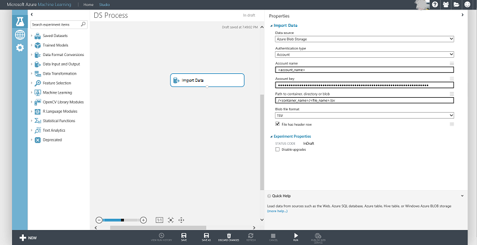

<properties 
    pageTitle="Armazenamento de blob de dados de exemplo no Azure | Microsoft Azure" 
    description="Dados de exemplo no armazenamento de Blob do Azure" 
    services="machine-learning,storage" 
    documentationCenter="" 
    authors="bradsev" 
    manager="jhubbard" 
    editor="cgronlun" />

<tags 
    ms.service="machine-learning" 
    ms.workload="data-services" 
    ms.tgt_pltfrm="na" 
    ms.devlang="na" 
    ms.topic="article" 
    ms.date="09/19/2016" 
    ms.author="fashah;garye;bradsev" /> 

#Armazenamento de blob de dados de exemplo no Azure

Este documento aborda dados de amostragem armazenados em armazenamento de blob do Microsoft Azure baixando-programaticamente e, em seguida, amostragem usando procedimentos escritos em Python.

**Por que seus dados de exemplo?**
Se o conjunto de dados que você planeja analisar for grande, geralmente é uma boa ideia amostra busca os dados para reduzi-la para um tamanho menor, mas representante e mais gerenciável. Isso facilita a compreensão de dados, exploração e engenharia de recurso. Sua função no processo de análise de Cortana é habilitar a criação de protótipo rápida das funções de processamento de dados e modelos de aprendizado de máquina.

No **menu** abaixo links para tópicos que descrevem como dados de exemplo do vários ambientes de armazenamento. 

[AZURE.INCLUDE [cap-sample-data-selector](../../includes/cap-sample-data-selector.md)]

Esta tarefa de amostragem é uma etapa do [Processo de ciência de dados da equipe (TDSP)](https://azure.microsoft.com/documentation/learning-paths/cortana-analytics-process/).

## Baixar e dados de amostra para baixo
1. Baixe os dados do armazenamento de blob do Microsoft Azure usando o serviço de blob do código de Python de exemplo a seguir: 

        from azure.storage.blob import BlobService
        import tables
        
        STORAGEACCOUNTNAME= <storage_account_name>
        STORAGEACCOUNTKEY= <storage_account_key>
        LOCALFILENAME= <local_file_name>        
        CONTAINERNAME= <container_name>
        BLOBNAME= <blob_name>

        #download from blob
        t1=time.time()
        blob_service=BlobService(account_name=STORAGEACCOUNTNAME,account_key=STORAGEACCOUNTKEY)
        blob_service.get_blob_to_path(CONTAINERNAME,BLOBNAME,LOCALFILENAME)
        t2=time.time()
        print(("It takes %s seconds to download "+blobname) % (t2 - t1))

2. Ler os dados em um quadro de dados Pandas do arquivo baixado acima.

        import pandas as pd

        #directly ready from file on disk
        dataframe_blobdata = pd.read_csv(LOCALFILE)

3. Amostra de busca de dados usando o `numpy`do `random.choice` da seguinte maneira:

        # A 1 percent sample
        sample_ratio = 0.01 
        sample_size = np.round(dataframe_blobdata.shape[0] * sample_ratio)
        sample_rows = np.random.choice(dataframe_blobdata.index.values, sample_size)
        dataframe_blobdata_sample = dataframe_blobdata.ix[sample_rows]

Agora você pode trabalhar com o quadro de dados acima, com a amostra de 1 por cento para obter uma maior exploração e geração de recurso.

##Carregar dados e lê-la em aprendizado de máquina do Azure

Você pode usar o seguinte código de amostra para baixo com os dados de amostra e usá-lo diretamente no Azure ML:

1. Escrever o quadro de dados para um arquivo local

        dataframe.to_csv(os.path.join(os.getcwd(),LOCALFILENAME), sep='\t', encoding='utf-8', index=False)

2. Carregue o arquivo local um blob Azure usando o código de exemplo a seguir:

        from azure.storage.blob import BlobService
        import tables

        STORAGEACCOUNTNAME= <storage_account_name>
        LOCALFILENAME= <local_file_name>
        STORAGEACCOUNTKEY= <storage_account_key>
        CONTAINERNAME= <container_name>
        BLOBNAME= <blob_name>

        output_blob_service=BlobService(account_name=STORAGEACCOUNTNAME,account_key=STORAGEACCOUNTKEY)    
        localfileprocessed = os.path.join(os.getcwd(),LOCALFILENAME) #assuming file is in current working directory
        
        try:
       
        #perform upload
        output_blob_service.put_block_blob_from_path(CONTAINERNAME,BLOBNAME,localfileprocessed)
        
        except:         
            print ("Something went wrong with uploading to the blob:"+ BLOBNAME)

3. Ler os dados do Azure blob usando Azure ML [Importar dados](https://msdn.microsoft.com/library/azure/4e1b0fe6-aded-4b3f-a36f-39b8862b9004/) , conforme mostrado na imagem abaixo:
 

 
