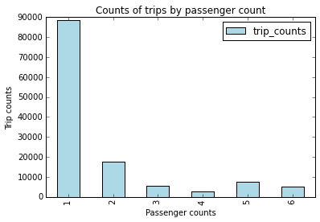
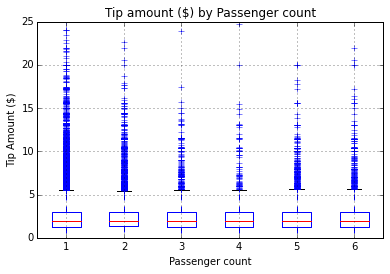
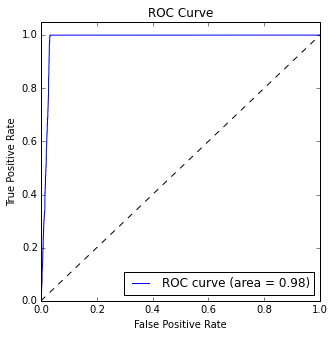
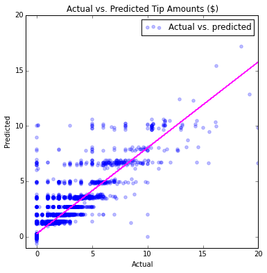

<properties
    pageTitle="Exploração de dados e modelagem com Spark avançadas | Microsoft Azure"
    description="Use HDInsight Spark fazer exploração de dados e treinar binários modelos de classificação e regressão usando validação cruzada e hyperparameter otimização."
    services="machine-learning"
    documentationCenter=""
    authors="bradsev"
    manager="jhubbard"
    editor="cgronlun"  />

<tags
    ms.service="machine-learning"
    ms.workload="data-services"
    ms.tgt_pltfrm="na"
    ms.devlang="na"
    ms.topic="article"
    ms.date="10/07/2016"
    ms.author="deguhath;bradsev;gokuma" />

# Exploração de dados avançada e modelagem com Spark 

[AZURE.INCLUDE [machine-learning-spark-modeling](../../includes/machine-learning-spark-modeling.md)]

Essa explicação usa HDInsight Spark fazer exploração de dados e treinar classificação binária e modelos de regressão usando validação cruzada e otimização de hyperparameter em uma amostra do NYC táxi viagem e passagens dataset de 2013. Ele orienta você pelas etapas do [Processo de ciência de dados](http://aka.ms/datascienceprocess), ponta a ponta, usando um HDInsight Spark cluster para processamento e blobs do Azure para armazenar os dados e os modelos. O processo explora e visualiza dados transferidos de um Blob de armazenamento do Azure e, em seguida, prepara os dados para criar modelos de previsão. Python foi usado para a solução de código e mostrar o plotar relevantes. Esses modelos são compilação usando o Kit de ferramentas de MLlib Spark fazer regressão e classificação binária tarefas de modelagem. 

- A tarefa de **classificação binária** é prever estando ou não uma dica é pago para a viagem. 
- A tarefa de **regressão** é prever a quantidade de dica com base em outros recursos de dica. 

As etapas de modelagem também contêm código mostrando como treinar, avaliar e salvar cada tipo de modelo. O tópico aborda alguns do mesmo início como o tópico de [modelagem com Spark e exploração de dados](machine-learning-data-science-spark-data-exploration-modeling.md) . Mas ele é mais "Avançado" que também utiliza validação cruzada em conjunto com hyperparameter varredura para treinar modelos de classificação e regressão ideal precisos. 

**Validação cruzada (VC)** é uma técnica que avalia como um modelo de treinamento em um conjunto de dados conhecido generaliza para prever os recursos dos conjuntos de dados em que ele não foi treinado. A ideia geral por trás essa técnica é que um modelo é treinamento em um conjunto de dados de dados conhecidos na e, em seguida, a precisão do seus previsões testada em relação a um conjunto de dados independente. Uma implementação comum usada aqui é dividir um conjunto de dados em dobras K e, em seguida, treinar o modelo em um estilo round-robin em todos, exceto um das dobras. 

**Otimização de Hyperparameter** é o problema de escolher um conjunto de hyperparameters para um algoritmo de aprendizagem, geralmente com o objetivo de otimizar uma medida de desempenho do algoritmo em um conjunto de dados independente. **Hyperparameters** são valores que devem ser especificados fora o procedimento de treinamento do modelo. Suposições sobre esses valores podem afetar a flexibilidade e a precisão dos modelos. Árvores de decisão têm hyperparameters, por exemplo, como a profundidade desejada e o número de folhas na árvore. Suporte vetor máquinas (SVMs) exigem definindo um termo de pena misclassification. 

Uma maneira comum para executar a otimização de hyperparameter usada aqui é uma pesquisa de grade ou uma **varredura de parâmetro**. Isso consiste em realizar uma pesquisa completa os valores de um subconjunto do espaço hyperparameter especificado para um algoritmo de aprendizagem. Validação cruzada pode fornecer uma métrica de desempenho para classificar os resultados ideais produzidos pelo algoritmo de pesquisa de grade. VC usado com hyperparameter problemas de limite de ajuda como overfitting um modelo de dados de treinamento para que o modelo retém a capacidade de aplicar ao conjunto de dados do qual os dados de treinamento foi extraídos geral de varredura.

Os modelos que usamos incluem regressão linear e logística, aleatórias florestas e árvores aumentadas gradientes:

- [Regressão linear com SGD](https://spark.apache.org/docs/latest/api/python/pyspark.mllib.html#pyspark.mllib.regression.LinearRegressionWithSGD) é um modelo de regressão linear que usa um método de Stochastic gradiente descendente (SGD) e para otimização e recurso de dimensionamento para prever os valores de dica pago. 
- Regressão de [Regressão logística com LBFGS](https://spark.apache.org/docs/latest/api/python/pyspark.mllib.html#pyspark.mllib.classification.LogisticRegressionWithLBFGS) ou "logit", é um modelo de regressão que pode ser usado quando a variável dependente é categórica fazer a classificação de dados. LBFGS é um algoritmo de otimização de quase-Newton que aproxima o algoritmo de Broyden – Fletcher – Goldfarb – Shanno (BFGS) usando uma quantidade limitada de memória do computador e que é amplamente usado em aprendizado de máquina.
- [Aleatório florestas](http://spark.apache.org/docs/latest/mllib-ensembles.html#Random-Forests) são ensembles de árvores de decisão.  Eles combinarem várias árvores de decisão para reduzir o risco de excedido. Florestas aleatórias são usadas para classificação e regressão e podem lidar com recursos de categorias e podem ser estendidas para a configuração de classificação multiclass. Eles não exigem recurso dimensionamento e são capazes de capturar não linearidades e interações de recursos. Aleatórias florestas são um da modelos para classificação e regressão de aprendizado de máquina mais bem-sucedidas.
- [Gradiente aumentou árvores](http://spark.apache.org/docs/latest/ml-classification-regression.html#gradient-boosted-trees-gbts) (GBTs) são ensembles de árvores de decisão. GBTs treinar árvores de decisão interativamente para minimizar uma função de perda. GBTs são usados para classificação e regressão e pode lidar com recursos de categorias, não exigem o dimensionamento de recurso e são capazes de capturar não linearidades e interações de recursos. Eles também podem ser usados em uma configuração de classificação de multiclass.

Limpar modelagem exemplos usando VC e Hyperparameter são mostrados para o problema de classificação binária. Exemplos mais simples (sem o parâmetro varre) são apresentados no tópico principal para tarefas de regressão. Mas no apêndice, validação usando líquido Elástico de regressão linear e VC com o uso de limpar de parâmetro para regressão floresta aleatórias também é apresentada. **Líquido Elástico** é um método de regressão regularized para modelos de regressão linear de ajuste que linear combina as métricas L1 e nível 2 como penalidades dos métodos [Laço](https://en.wikipedia.org/wiki/Lasso%20%28statistics%29) e [Montanhas](https://en.wikipedia.org/wiki/Tikhonov_regularization) .   

>[AZURE.NOTE] Embora o Kit de ferramentas de MLlib Spark seja projetado para trabalhar em grandes conjuntos de dados, uma amostra relativamente pequena (~ 30 Mb usando linhas de 170K, cerca de 0,1% do dataset NYC original) é usada aqui para sua conveniência. O exercício fornecido aqui é executado com eficiência (em cerca de 10 minutos) em um cluster de HDInsight com 2 nós de trabalho. O mesmo código, com modificações secundárias, pode ser usado para processar conjuntos de dados maiores, com modificações apropriadas para cache de dados na memória e alterar o tamanho do cluster.

## Pré-requisitos

Você precisará de uma conta do Azure e um cluster de necessidade um 1,6 de Spark 3.4 HDInsight HDInsight Spark você para concluir este passo a passo. Consulte a [Visão geral de dados ciências usando Spark em Azurehdinsight](machine-learning-data-science-spark-overview.md) para obter instruções sobre como atender a esses requisitos. Esse tópico também contém uma descrição dos dados de NYC 2013 táxi usados aqui e instruções sobre como executar código de um bloco de anotações de Jupyter no cluster Spark. O bloco de anotações **pySpark-machine-learning-data-science-spark-advanced-data-exploration-modeling.ipynb** que contém as amostras de código neste tópico está disponível no [Github](https://github.com/Azure/Azure-MachineLearning-DataScience/tree/master/Misc/Spark/pySpark).

[AZURE.INCLUDE [delete-cluster-warning](../../includes/hdinsight-delete-cluster-warning.md)]

## Instalação: locais de armazenamento, bibliotecas e contexto de Spark predefinido

Spark é capaz de ler e gravar Azure armazenamento de Blob (também conhecido como WASB). Para qualquer um dos seus dados existentes armazenados lá podem ser processados usando Spark e os resultados armazenados novamente em WASB.

Para salvar arquivos ou modelos no WASB, o caminho deve ser especificado corretamente. O contêiner padrão conectado ao cluster Spark pode ser referenciado usando uma caminho começando com: "wasb: / / /". Outros locais são referenciados por "wasb: / /".

### Definir caminhos de diretório para locais de armazenamento em WASB

O exemplo de código a seguir especifica a localização dos dados a serem lidas e o caminho para o diretório de armazenamento de modelo ao qual o resultado de modelo é salvo:

    # SET PATHS TO FILE LOCATIONS: DATA AND MODEL STORAGE

    # LOCATION OF TRAINING DATA
    taxi_train_file_loc = "wasb://mllibwalkthroughs@cdspsparksamples.blob.core.windows.net/Data/NYCTaxi/JoinedTaxiTripFare.Point1Pct.Train.tsv";

    
    # SET THE MODEL STORAGE DIRECTORY PATH 
    # NOTE THAT THE FINAL BACKSLASH IN THE PATH IS NEEDED.
    modelDir = "wasb:///user/remoteuser/NYCTaxi/Models/";

    # PRINT START TIME
    import datetime
    datetime.datetime.now()

**SAÍDA**

DateTime.DateTime (2016, 4, 18, 17, 36, 27, 832799)

### Bibliotecas de importação

Importe bibliotecas necessárias com o seguinte código:

    # LOAD PYSPARK LIBRARIES
    import pyspark
    from pyspark import SparkConf
    from pyspark import SparkContext
    from pyspark.sql import SQLContext
    import matplotlib
    import matplotlib.pyplot as plt
    from pyspark.sql import Row
    from pyspark.sql.functions import UserDefinedFunction
    from pyspark.sql.types import *
    import atexit
    from numpy import array
    import numpy as np
    import datetime
    

### Contexto de Spark predefinido e PySpark magics

Os kernels PySpark que são fornecidos com blocos de anotações de Jupyter têm um contexto predefinido. Assim você não precisa definir o Visual ou seção contextos explicitamente antes de começar a trabalhar com o aplicativo que você estão desenvolvendo. Nesses contextos estão disponíveis para você por padrão. Nesses contextos são:

- SC - para Spark 
- sqlContext - para seção

O núcleo PySpark fornece alguns predefinidos "magics", que são comandos especiais que você pode chamar com % %. Há dois comandos que são usados nesses exemplos de código.

- **% local** Especifica que o código nas linhas subsequentes é a ser executado localmente. Código deve ser código Python válido.
- **%%sql -o <variable name>** Executa uma consulta de seção em relação a sqlContext. Se o parâmetro -o é passado, o resultado da consulta é mantido na % contexto Python local como um DataFrame Pandas.
 

Para obter mais informações sobre os kernels para blocos de anotações de Jupyter e predefinidos "magics" que eles fornecem, consulte [Kernels disponíveis para blocos de anotações de Jupyter com HDInsight Spark Linux clusters em HDInsight](../hdinsight/hdinsight-apache-spark-jupyter-notebook-kernels.md).

## Inclusão de dados do blob público: 

A primeira etapa no processo de ciência de dados é inclusão os dados a serem analisados de fontes de onde ele está localizado em seu ambiente de modelagem e exploração de dados. Esse ambiente é Spark neste passo a passo. Esta seção contém o código para preencher uma série de tarefas:

- inclusão a amostra de dados a ser modelados
- ler em do dataset de entrada (armazenado como um arquivo. tsv)
- Formatar e limpar os dados
- criar e armazenar em cache objetos (RDDs ou quadros de dados) na memória
- registrá-la como uma tabela de temp no contexto de SQL.

Aqui está o código para inclusão de dados.

    # RECORD START TIME
    timestart = datetime.datetime.now()
    
    # IMPORT FILE FROM PUBLIC BLOB
    taxi_train_file = sc.textFile(taxi_train_file_loc)
    
    # GET SCHEMA OF THE FILE FROM HEADER
    schema_string = taxi_train_file.first()
    fields = [StructField(field_name, StringType(), True) for field_name in schema_string.split('\t')]
    fields[7].dataType = IntegerType() #Pickup hour
    fields[8].dataType = IntegerType() # Pickup week
    fields[9].dataType = IntegerType() # Weekday
    fields[10].dataType = IntegerType() # Passenger count
    fields[11].dataType = FloatType() # Trip time in secs
    fields[12].dataType = FloatType() # Trip distance
    fields[19].dataType = FloatType() # Fare amount
    fields[20].dataType = FloatType() # Surcharge
    fields[21].dataType = FloatType() # Mta_tax
    fields[22].dataType = FloatType() # Tip amount
    fields[23].dataType = FloatType() # Tolls amount
    fields[24].dataType = FloatType() # Total amount
    fields[25].dataType = IntegerType() # Tipped or not
    fields[26].dataType = IntegerType() # Tip class
    taxi_schema = StructType(fields)
    
    # PARSE FIELDS AND CONVERT DATA TYPE FOR SOME FIELDS
    taxi_header = taxi_train_file.filter(lambda l: "medallion" in l)
    taxi_temp = taxi_train_file.subtract(taxi_header).map(lambda k: k.split("\t"))\
            .map(lambda p: (p[0],p[1],p[2],p[3],p[4],p[5],p[6],int(p[7]),int(p[8]),int(p[9]),int(p[10]),
                            float(p[11]),float(p[12]),p[13],p[14],p[15],p[16],p[17],p[18],float(p[19]),
                            float(p[20]),float(p[21]),float(p[22]),float(p[23]),float(p[24]),int(p[25]),int(p[26])))
    
        
    # CREATE DATA FRAME
    taxi_train_df = sqlContext.createDataFrame(taxi_temp, taxi_schema)
    
    # CREATE A CLEANED DATA-FRAME BY DROPPING SOME UN-NECESSARY COLUMNS & FILTERING FOR UNDESIRED VALUES OR OUTLIERS
    taxi_df_train_cleaned = taxi_train_df.drop('medallion').drop('hack_license').drop('store_and_fwd_flag').drop('pickup_datetime')\
        .drop('dropoff_datetime').drop('pickup_longitude').drop('pickup_latitude').drop('dropoff_latitude')\
        .drop('dropoff_longitude').drop('tip_class').drop('total_amount').drop('tolls_amount').drop('mta_tax')\
        .drop('direct_distance').drop('surcharge')\
        .filter("passenger_count > 0 and passenger_count < 8 AND payment_type in ('CSH', 'CRD') AND tip_amount >= 0 AND tip_amount < 30 AND fare_amount >= 1 AND fare_amount < 150 AND trip_distance > 0 AND trip_distance < 100 AND trip_time_in_secs > 30 AND trip_time_in_secs < 7200" )
    
    # CACHE & MATERIALIZE DATA-FRAME IN MEMORY. GOING THROUGH AND COUNTING NUMBER OF ROWS MATERIALIZES THE DATA-FRAME IN MEMORY
    taxi_df_train_cleaned.cache()
    taxi_df_train_cleaned.count()
    
    # REGISTER DATA-FRAME AS A TEMP-TABLE IN SQL-CONTEXT
    taxi_df_train_cleaned.registerTempTable("taxi_train")
    
    # PRINT HOW MUCH TIME IT TOOK TO RUN THE CELL
    timeend = datetime.datetime.now()
    timedelta = round((timeend-timestart).total_seconds(), 2) 
    print "Time taken to execute above cell: " + str(timedelta) + " seconds"; 

**SAÍDA**

Tempo necessário para executar acima célula: 276.62 segundos

## Visualização e exploração de dados 

Depois que os dados foi colocados em Spark, a próxima etapa no processo de ciência de dados é obter mais profunda compreensão dos dados por meio de exploração e visualização. Nesta seção, vamos examinar os dados de táxi usando consultas SQL e plote as variáveis de destino e recursos potenciais para inspeção visual. Especificamente, podemos plotar a frequência das contagens de passageiro em viagens táxi, a frequência de valores de dica e como dicas variam de acordo com o tipo e a quantidade de pagamento.

### Plotar um histograma de frequências de contagem de passageiro na amostra de viagens táxi

Este código e trechos de subsequentes usam mágico SQL para consultar a amostra e mágico local para plotar os dados.

- **Mágico SQL (`%%sql`)** O núcleo de HDInsight PySpark suporta consultas de HiveQL fácil embutido em relação a sqlContext. O (-o VARIABLE_NAME) argumento persiste a saída da consulta SQL como uma DataFrame Pandas no servidor Jupyter. Isso significa que ele está disponível no modo de local.
- O ** `%%local` mágico** é usado para executar código localmente no servidor Jupyter, que é o headnode do cluster HDInsight. Normalmente, você usa `%%local` mágico em conjunto com o `%%sql` mágico com parâmetro -o. O parâmetro -o persistir a saída da consulta SQL localmente e então % mágico local seria disparar o próximo conjunto de trecho de código para ser executada localmente em relação a saída das consultas SQL que é mantida localmente

A saída é visualizada automaticamente depois que você executar o código.

Essa consulta recupera as viagens por contagem de passageiro. 

    # PLOT FREQUENCY OF PASSENGER COUNTS IN TAXI TRIPS

    # SQL QUERY
    %%sql -q -o sqlResults
    SELECT passenger_count, COUNT(*) as trip_counts FROM taxi_train WHERE passenger_count > 0 and passenger_count < 7 GROUP BY passenger_count

Este código cria um quadro de dados local da saída da consulta e plota os dados. O `%%local` mágico cria um local-quadro de dados, `sqlResults`, que pode ser usado para plotagem com matplotlib. 

>[AZURE.NOTE] Este mágico PySpark é usado várias vezes neste passo a passo. Se a quantidade de dados for grande, você deve de exemplo para criar um quadro de dados que pode caber na memória local.

    # RUN THE CODE LOCALLY ON THE JUPYTER SERVER
    %%local
    
    # USE THE JUPYTER AUTO-PLOTTING FEATURE TO CREATE INTERACTIVE FIGURES. 
    # CLICK ON THE TYPE OF PLOT TO BE GENERATED (E.G. LINE, AREA, BAR ETC.)
    sqlResults

Aqui está o código para plotar as viagens por contagens de passageiro

    # RUN THE CODE LOCALLY ON THE JUPYTER SERVER AND IMPORT LIBRARIES
    %%local
    import matplotlib.pyplot as plt
    %matplotlib inline
    
    # PLOT PASSENGER NUMBER VS TRIP COUNTS
    x_labels = sqlResults['passenger_count'].values
    fig = sqlResults[['trip_counts']].plot(kind='bar', facecolor='lightblue')
    fig.set_xticklabels(x_labels)
    fig.set_title('Counts of trips by passenger count')
    fig.set_xlabel('Passenger count in trips')
    fig.set_ylabel('Trip counts')
    plt.show()

**SAÍDA**

Você pode selecionar entre vários tipos diferentes de visualizações (tabela, pizza, linha, área ou barra) usando os botões de menu de **tipo** no bloco de anotações. A plotagem de barra é mostrada aqui.

### Plote um histograma dos valores de dica e como dica varia por valores de contagem e passagens passageiro.

Usar uma consulta SQL para dados de exemplo..
    
    # SQL SQUERY
    %%sql -q -o sqlResults
        SELECT fare_amount, passenger_count, tip_amount, tipped
        FROM taxi_train 
        WHERE passenger_count > 0 
        AND passenger_count < 7
        AND fare_amount > 0 
        AND fare_amount < 200
        AND payment_type in ('CSH', 'CRD')
        AND tip_amount > 0 
        AND tip_amount < 25
    

Essa célula de código usa a consulta SQL para criar três plotar os dados.

    # RUN THE CODE LOCALLY ON THE JUPYTER SERVER AND IMPORT LIBRARIES
    %%local
    %matplotlib inline
    
    # TIP BY PAYMENT TYPE AND PASSENGER COUNT
    ax1 = resultsPDDF[['tip_amount']].plot(kind='hist', bins=25, facecolor='lightblue')
    ax1.set_title('Tip amount distribution')
    ax1.set_xlabel('Tip Amount ($)')
    ax1.set_ylabel('Counts')
    plt.suptitle('')
    plt.show()
    
    # TIP BY PASSENGER COUNT
    ax2 = resultsPDDF.boxplot(column=['tip_amount'], by=['passenger_count'])
    ax2.set_title('Tip amount ($) by Passenger count')
    ax2.set_xlabel('Passenger count')
    ax2.set_ylabel('Tip Amount ($)')
    plt.suptitle('')
    plt.show()
    
    # TIP AMOUNT BY FARE AMOUNT, POINTS ARE SCALED BY PASSENGER COUNT
    ax = resultsPDDF.plot(kind='scatter', x= 'fare_amount', y = 'tip_amount', c='blue', alpha = 0.10, s=5*(resultsPDDF.passenger_count))
    ax.set_title('Tip amount by Fare amount ($)')
    ax.set_xlabel('Fare Amount')
    ax.set_ylabel('Tip Amount')
    plt.axis([-2, 120, -2, 30])
    plt.show()
    

**SAÍDA:** 

## Preparação de engenharia, transformação e dados de modelagem de recursos

Esta seção descreve e fornece o código para procedimentos usados para preparar os dados para uso em modelagem ML. Ele mostra como fazer as seguintes tarefas:

- Criar um novo recurso por binning horas em classificações de tempo de tráfego
- Índice e em quente codificar recursos de categorias
- Criar objetos de ponto de rotulado entrada em funções de ML
- Criar uma amostra de sub aleatória dos dados e dividi-la em treinamento e conjuntos de teste
- Dimensionamento de recurso
- Objetos de cache na memória

### Criar um novo recurso por binning horas em classificações de tempo de tráfego

Este código mostra como criar um novo recurso por binning horas em classificações de tempo de tráfego e, em seguida, como o quadro de dados resultante na memória em cache. Onde flexível distribuído conjuntos de dados (RDDs) e quadros de dados são usados repetidamente, cache leva a aprimorada tempos de execução. Portanto, cache RDDs e quadros de dados em vários estágios no passo a passo.

    # CREATE FOUR BUCKETS FOR TRAFFIC TIMES
    sqlStatement = """
        SELECT *,
        CASE
         WHEN (pickup_hour <= 6 OR pickup_hour >= 20) THEN "Night" 
         WHEN (pickup_hour >= 7 AND pickup_hour <= 10) THEN "AMRush" 
         WHEN (pickup_hour >= 11 AND pickup_hour <= 15) THEN "Afternoon"
         WHEN (pickup_hour >= 16 AND pickup_hour <= 19) THEN "PMRush"
        END as TrafficTimeBins
        FROM taxi_train 
    """
    taxi_df_train_with_newFeatures = sqlContext.sql(sqlStatement)
    
    # CACHE DATA-FRAME IN MEMORY & MATERIALIZE DF IN MEMORY
    # THE .COUNT() GOES THROUGH THE ENTIRE DATA-FRAME,
    # MATERIALIZES IT IN MEMORY, AND GIVES THE COUNT OF ROWS.
    taxi_df_train_with_newFeatures.cache()
    taxi_df_train_with_newFeatures.count()

**SAÍDA**

126050

### Índice e quentes um codificar recursos de categorias

Esta seção mostra como indexar ou codificar categóricos recursos para entrada para as funções de modelagem. A modelagem e prever funções de MLlib requerem os recursos com dados de entrada categóricos ser indexados ou codificado antes de usar. 

Dependendo do modelo, você precisa indexar ou codificá-los de maneiras diferentes. Por exemplo, modelos de regressão Linear e logística exigem quentes uma codificação, onde, por exemplo, um recurso com três categorias pode ser expandido em três colunas de recurso, com cada contendo 0 ou 1 de acordo com a categoria de uma observação. MLlib fornece a função de [OneHotEncoder](http://scikit-learn.org/stable/modules/generated/sklearn.preprocessing.OneHotEncoder.html#sklearn.preprocessing.OneHotEncoder) para fazer um quentes codificação. Este codificador mapeia uma coluna de índices de etiqueta para uma coluna de vetores binários, no máximo um único um valor. Essa codificação permite algoritmos que espera recursos de valores numéricos, como Regressão logística, seja aplicada aos recursos de categorias.

Aqui está o código para indexar e codificar recursos categóricos:

    # RECORD START TIME
    timestart = datetime.datetime.now()
    
    # LOAD PYSPARK LIBRARIES
    from pyspark.ml.feature import OneHotEncoder, StringIndexer, VectorAssembler, OneHotEncoder, VectorIndexer
    
    # INDEX AND ENCODE VENDOR_ID
    stringIndexer = StringIndexer(inputCol="vendor_id", outputCol="vendorIndex")
    model = stringIndexer.fit(taxi_df_train_with_newFeatures) # Input data-frame is the cleaned one from above
    indexed = model.transform(taxi_df_train_with_newFeatures)
    encoder = OneHotEncoder(dropLast=False, inputCol="vendorIndex", outputCol="vendorVec")
    encoded1 = encoder.transform(indexed)
    
    # INDEX AND ENCODE RATE_CODE
    stringIndexer = StringIndexer(inputCol="rate_code", outputCol="rateIndex")
    model = stringIndexer.fit(encoded1)
    indexed = model.transform(encoded1)
    encoder = OneHotEncoder(dropLast=False, inputCol="rateIndex", outputCol="rateVec")
    encoded2 = encoder.transform(indexed)
    
    # INDEX AND ENCODE PAYMENT_TYPE
    stringIndexer = StringIndexer(inputCol="payment_type", outputCol="paymentIndex")
    model = stringIndexer.fit(encoded2)
    indexed = model.transform(encoded2)
    encoder = OneHotEncoder(dropLast=False, inputCol="paymentIndex", outputCol="paymentVec")
    encoded3 = encoder.transform(indexed)
    
    # INDEX AND TRAFFIC TIME BINS
    stringIndexer = StringIndexer(inputCol="TrafficTimeBins", outputCol="TrafficTimeBinsIndex")
    model = stringIndexer.fit(encoded3)
    indexed = model.transform(encoded3)
    encoder = OneHotEncoder(dropLast=False, inputCol="TrafficTimeBinsIndex", outputCol="TrafficTimeBinsVec")
    encodedFinal = encoder.transform(indexed)
    
    # PRINT ELAPSED TIME
    timeend = datetime.datetime.now()
    timedelta = round((timeend-timestart).total_seconds(), 2) 
    print "Time taken to execute above cell: " + str(timedelta) + " seconds"; 

**SAÍDA**

Tempo necessário para executar acima célula: 3.14 segundos

### Criar objetos de ponto de rotulado entrada em funções de ML

Esta seção contém código que mostra como indexar dados de texto categórica como um tipo de dados de ponto de rotulado e codificá-lo para que ele pode ser usado para treinar e teste de regressão logística MLlib e outros modelos de classificação. Objetos de ponto de rotulado são flexível distribuído conjuntos de dados (RDD) formatadas de uma maneira que é necessário como dados de entrada pela maioria dos algoritmos ML no MLlib. Um [ponto de rotulado](https://spark.apache.org/docs/latest/mllib-data-types.html#labeled-point) é um vetor de local, condensado denso ou esparso, associado a uma rótulo/resposta.

Aqui está o código para indexar e codificar recursos de texto para classificação binária.

    # FUNCTIONS FOR BINARY CLASSIFICATION

    # LOAD LIBRARIES
    from pyspark.mllib.regression import LabeledPoint
    from numpy import array

    # INDEXING CATEGORICAL TEXT FEATURES FOR INPUT INTO TREE-BASED MODELS
    def parseRowIndexingBinary(line):
        features = np.array([line.paymentIndex, line.vendorIndex, line.rateIndex, line.pickup_hour, line.weekday,
                             line.passenger_count, line.trip_time_in_secs, line.trip_distance, line.fare_amount])
        labPt = LabeledPoint(line.tipped, features)
        return  labPt
    
    # ONE-HOT ENCODING OF CATEGORICAL TEXT FEATURES FOR INPUT INTO LOGISTIC RERESSION MODELS
    def parseRowOneHotBinary(line):
        features = np.concatenate((np.array([line.pickup_hour, line.weekday, line.passenger_count,
                                            line.trip_time_in_secs, line.trip_distance, line.fare_amount]), 
                                   line.vendorVec.toArray(), line.rateVec.toArray(), line.paymentVec.toArray()), axis=0)
        labPt = LabeledPoint(line.tipped, features)
        return  labPt

Aqui está o código para codificar e recursos de texto categorias para análise de regressão linear de índice.

    # FUNCTIONS FOR REGRESSION WITH TIP AMOUNT AS TARGET VARIABLE

    # ONE-HOT ENCODING OF CATEGORICAL TEXT FEATURES FOR INPUT INTO TREE-BASED MODELS
    def parseRowIndexingRegression(line):
        features = np.array([line.paymentIndex, line.vendorIndex, line.rateIndex, line.TrafficTimeBinsIndex, 
                             line.pickup_hour, line.weekday, line.passenger_count, line.trip_time_in_secs, 
                             line.trip_distance, line.fare_amount])
        labPt = LabeledPoint(line.tip_amount, features)
        return  labPt
    
    # INDEXING CATEGORICAL TEXT FEATURES FOR INPUT INTO LINEAR REGRESSION MODELS
    def parseRowOneHotRegression(line):
        features = np.concatenate((np.array([line.pickup_hour, line.weekday, line.passenger_count,
                                            line.trip_time_in_secs, line.trip_distance, line.fare_amount]), 
                                            line.vendorVec.toArray(), line.rateVec.toArray(), 
                                            line.paymentVec.toArray(), line.TrafficTimeBinsVec.toArray()), axis=0)
        labPt = LabeledPoint(line.tip_amount, features)
        return  labPt

### Criar uma amostra de sub aleatória dos dados e dividi-la em treinamento e conjuntos de teste

Esse código cria uma amostragem aleatória dos dados (25% é usado aqui). Embora não seja necessário para este exemplo devido ao tamanho do conjunto de dados, podemos demonstram como você pode de exemplo aqui para que você saiba como usá-lo para seu próprio problema quando necessário. Quando amostras forem grandes, isso pode economizar tempo significativo enquanto modelos de treinamento. Avançar podemos dividir a amostra em uma parte de treinamento (75% aqui) e uma parte de teste (25% aqui) para usar em classificação e modelagem de regressão.

    # RECORD START TIME
    timestart = datetime.datetime.now()
    
    # SPECIFY SAMPLING AND SPLITTING FRACTIONS
    from pyspark.sql.functions import rand
    
    samplingFraction = 0.25;
    trainingFraction = 0.75; testingFraction = (1-trainingFraction);
    seed = 1234;
    encodedFinalSampled = encodedFinal.sample(False, samplingFraction, seed=seed)
    
    # SPLIT SAMPLED DATA-FRAME INTO TRAIN/TEST, WITH A RANDOM COLUMN ADDED FOR DOING CV (SHOWN LATER)
    # INCLUDE RAND COLUMN FOR CREATING CROSS-VALIDATION FOLDS
    dfTmpRand = encodedFinalSampled.select("*", rand(0).alias("rand"));
    trainData, testData = dfTmpRand.randomSplit([trainingFraction, testingFraction], seed=seed);
    
    # CACHE TRAIN AND TEST DATA
    trainData.cache()
    testData.cache()
    
    # FOR BINARY CLASSIFICATION TRAINING AND TESTING
    indexedTRAINbinary = trainData.map(parseRowIndexingBinary)
    indexedTESTbinary = testData.map(parseRowIndexingBinary)
    oneHotTRAINbinary = trainData.map(parseRowOneHotBinary)
    oneHotTESTbinary = testData.map(parseRowOneHotBinary)
    
    # FOR REGRESSION TRAINING AND TESTING
    indexedTRAINreg = trainData.map(parseRowIndexingRegression)
    indexedTESTreg = testData.map(parseRowIndexingRegression)
    oneHotTRAINreg = trainData.map(parseRowOneHotRegression)
    oneHotTESTreg = testData.map(parseRowOneHotRegression)
    
    # PRINT ELAPSED TIME
    timeend = datetime.datetime.now()
    timedelta = round((timeend-timestart).total_seconds(), 2) 
    print "Time taken to execute above cell: " + str(timedelta) + " seconds"; 

**SAÍDA**

Tempo necessário para executar acima célula: 0.31 segundos

### Dimensionamento de recurso

Dimensionamento de recurso, também conhecido como normalização de dados, assegura que os recursos com valores amplamente caro são não fornecido excessiva ponderar na função objetiva. O código para dimensionamento de recurso usa o [StandardScaler](https://spark.apache.org/docs/latest/api/python/pyspark.mllib.html#pyspark.mllib.feature.StandardScaler) dimensionar os recursos de variação de unidade. Ele é fornecido por MLlib para uso em regressão linear com Stochastic gradiente descendente (SGD), um algoritmo popular para uma ampla variedade de outra modelos como máquinas de vetor de suporte (SVM) ou perdas regularized de aprendizado de máquina de treinamento.   

>[AZURE.TIP] Encontramos o algoritmo de LinearRegressionWithSGD para serem sensíveis a escala de recursos.   

Aqui está o código para variáveis de escala para uso com o algoritmo SGD linear regularized.

    # RECORD START TIME
    timestart = datetime.datetime.now()
    
    # LOAD PYSPARK LIBRARIES
    from pyspark.mllib.regression import LabeledPoint
    from pyspark.mllib.linalg import Vectors
    from pyspark.mllib.feature import StandardScaler, StandardScalerModel
    from pyspark.mllib.util import MLUtils
    
    # SCALE VARIABLES FOR REGULARIZED LINEAR SGD ALGORITHM
    label = oneHotTRAINreg.map(lambda x: x.label)
    features = oneHotTRAINreg.map(lambda x: x.features)
    scaler = StandardScaler(withMean=False, withStd=True).fit(features)
    dataTMP = label.zip(scaler.transform(features.map(lambda x: Vectors.dense(x.toArray()))))
    oneHotTRAINregScaled = dataTMP.map(lambda x: LabeledPoint(x[0], x[1]))
    
    label = oneHotTESTreg.map(lambda x: x.label)
    features = oneHotTESTreg.map(lambda x: x.features)
    scaler = StandardScaler(withMean=False, withStd=True).fit(features)
    dataTMP = label.zip(scaler.transform(features.map(lambda x: Vectors.dense(x.toArray()))))
    oneHotTESTregScaled = dataTMP.map(lambda x: LabeledPoint(x[0], x[1]))
    
    # PRINT ELAPSED TIME
    timeend = datetime.datetime.now()
    timedelta = round((timeend-timestart).total_seconds(), 2) 
    print "Time taken to execute above cell: " + str(timedelta) + " seconds"; 

**SAÍDA**

Tempo necessário para executar acima célula: 11.67 segundos

### Objetos de cache na memória

O tempo necessário para treinamento e testes de algoritmos ML pode ser reduzido armazenando o quadro de entrada de dados objetos usados para classificação, regressão e, em escala de recursos.

    # RECORD START TIME
    timestart = datetime.datetime.now()
    
    # FOR BINARY CLASSIFICATION TRAINING AND TESTING
    indexedTRAINbinary.cache()
    indexedTESTbinary.cache()
    oneHotTRAINbinary.cache()
    oneHotTESTbinary.cache()
    
    # FOR REGRESSION TRAINING AND TESTING
    indexedTRAINreg.cache()
    indexedTESTreg.cache()
    oneHotTRAINreg.cache()
    oneHotTESTreg.cache()
    
    # SCALED FEATURES
    oneHotTRAINregScaled.cache()
    oneHotTESTregScaled.cache()
    
    # PRINT ELAPSED TIME
    timeend = datetime.datetime.now()
    timedelta = round((timeend-timestart).total_seconds(), 2) 
    print "Time taken to execute above cell: " + str(timedelta) + " seconds"; 

**SAÍDA** 

Tempo necessário para executar acima célula: 0,13 segundos

## Prever estando ou não uma dica é pago com modelos de classificação binário

Esta seção mostra como usar três modelos para a tarefa de classificação binária de prever estando ou não uma dica é pago por uma viagem de táxi. Os modelos apresentados são:

- Regressão logística 
- Aleatória floresta
- Árvores de aumento de gradientes

Cada modelo de criação de seção código é dividido em etapas: 

1. **Treinamento de modelo de** dados com um conjunto de parâmetro
2. **Avaliação do modelo** em um conjunto de dados de teste com métricas
3. **Salvando modelo** no blob para consumo futuro

Vamos mostrar como fazer validação cruzada (VC) com o parâmetro varredura de duas maneiras:

1. Usando o código personalizado **genérico** que pode ser aplicado para qualquer algoritmo no MLlib e qualquer parâmetro define um algoritmo. 
1. Usando a **função de pipeline de CrossValidator pySpark**. Observe que, embora conveniente, com base em nossa experiência, CrossValidator tem algumas limitações para Spark 1.5.0: 

    - Modelos de pipeline não podem ser salvos/persistentes para consumo futuro.
    - Não podem ser usados para cada parâmetro em um modelo.
    - Não podem ser usados para cada algoritmo de MLlib.

### Genérico cruzada validação e limpeza hyperparameter usados com o algoritmo de regressão logística para classificação binária

O código desta seção mostra como treinar, avaliar e salvar um modelo de regressão logística com [LBFGS](https://en.wikipedia.org/wiki/Broyden%E2%80%93Fletcher%E2%80%93Goldfarb%E2%80%93Shanno_algorithm) que prevê estando ou não uma dica é pago por uma viagem no dataset NYC táxi viagem e passagens. O modelo é treinamento usando cruzada validação (VC) e a limpeza de hyperparameter implementado com código personalizado que pode ser aplicado a qualquer um dos algoritmos de aprendizado em MLlib.   

>[AZURE.NOTE] A execução desse código personalizado do VC pode demorar vários minutos.

**Treinar o modelo de regressão logística usando VC e limpeza de hyperparameter**

    # LOGISTIC REGRESSION CLASSIFICATION WITH CV AND HYPERPARAMETER SWEEPING

    # GET ACCURACY FOR HYPERPARAMETERS BASED ON CROSS-VALIDATION IN TRAINING DATA-SET

    # RECORD START TIME
    timestart = datetime.datetime.now()
    
    # LOAD LIBRARIES
    from pyspark.mllib.classification import LogisticRegressionWithLBFGS 
    from pyspark.mllib.evaluation import BinaryClassificationMetrics
    
    # CREATE PARAMETER GRID FOR LOGISTIC REGRESSION PARAMETER SWEEP
    from sklearn.grid_search import ParameterGrid
    grid = [{'regParam': [0.01, 0.1], 'iterations': [5, 10], 'regType': ["l1", "l2"], 'tolerance': [1e-3, 1e-4]}]
    paramGrid = list(ParameterGrid(grid))
    numModels = len(paramGrid)
    
    # SET NUM FOLDS AND NUM PARAMETER SETS TO SWEEP ON
    nFolds = 3;
    h = 1.0 / nFolds;
    metricSum = np.zeros(numModels);
    
    # BEGIN CV WITH PARAMETER SWEEP
    for i in range(nFolds):
        # Create training and x-validation sets
        validateLB = i * h
        validateUB = (i + 1) * h
        condition = (trainData["rand"] >= validateLB) & (trainData["rand"] < validateUB)
        validation = trainData.filter(condition)
        # Create LabeledPoints from data-frames
        if i > 0:
            trainCVLabPt.unpersist()
            validationLabPt.unpersist()
        trainCV = trainData.filter(~condition)
        trainCVLabPt = trainCV.map(parseRowOneHotBinary)
        trainCVLabPt.cache()
        validationLabPt = validation.map(parseRowOneHotBinary)
        validationLabPt.cache()
        # For parameter sets compute metrics from x-validation
        for j in range(numModels):
            regt = paramGrid[j]['regType']
            regp = paramGrid[j]['regParam']
            iters = paramGrid[j]['iterations']
            tol = paramGrid[j]['tolerance']
            # Train logistic regression model with hypermarameter set
            model = LogisticRegressionWithLBFGS.train(trainCVLabPt, regType=regt, iterations=iters,  
                                                      regParam=regp, tolerance = tol, intercept=True)
            predictionAndLabels = validationLabPt.map(lambda lp: (float(model.predict(lp.features)), lp.label))
            # Use ROC-AUC as accuracy metrics
            validMetrics = BinaryClassificationMetrics(predictionAndLabels)
            metric = validMetrics.areaUnderROC
            metricSum[j] += metric
    
    avgAcc = metricSum / nFolds;
    bestParam = paramGrid[np.argmax(avgAcc)];
    
    # UNPERSIST OBJECTS
    trainCVLabPt.unpersist()
    validationLabPt.unpersist()
        
    # TRAIN ON FULL TRAIING SET USING BEST PARAMETERS FROM CV/PARAMETER SWEEP
    logitBest = LogisticRegressionWithLBFGS.train(oneHotTRAINbinary, regType=bestParam['regType'], 
                                                  iterations=bestParam['iterations'], 
                                                  regParam=bestParam['regParam'], tolerance = bestParam['tolerance'], 
                                                  intercept=True)
    
    
    # PRINT COEFFICIENTS AND INTERCEPT OF THE MODEL
    # NOTE: There are 20 coefficient terms for the 10 features, 
    #       and the different categories for features: vendorVec (2), rateVec, paymentVec (6), TrafficTimeBinsVec (4)
    print("Coefficients: " + str(logitBest.weights))
    print("Intercept: " + str(logitBest.intercept))
    
    # PRINT ELAPSED TIME    
    timeend = datetime.datetime.now()
    timedelta = round((timeend-timestart).total_seconds(), 2) 
    print "Time taken to execute above cell: " + str(timedelta) + " seconds"; 

**SAÍDA**

Coeficientes: [0.0082065285375,-0.0223675576104,-0.0183812028036, - 3.48124578069e-05,-0.00247646947233,-0.00165897881503, 0.0675394837328,-0.111823113101,-0.324609912762,-0.204549780032,-1.36499216354, 0.591088507921,-0.664263411392,-1.00439726852, 3.46567827545,-3.51025855172,-0.0471341112232,-0.043521833294, 0.000243375810385, 0.054518719222]

Intercepção:-0.0111216486893

Tempo necessário para executar acima célula: 14.43 segundos

**Avaliar o modelo de classificação binária com métricas padrão**

O código desta seção mostra como avaliar um modelo de regressão logística contra um teste-conjunto de dados, incluindo uma plotagem da curva ROC.

    # RECORD START TIME
    timestart = datetime.datetime.now()

    #IMPORT LIBRARIES
    from sklearn.metrics import roc_curve,auc
    from pyspark.mllib.evaluation import BinaryClassificationMetrics
    from pyspark.mllib.evaluation import MulticlassMetrics
    
    # PREDICT ON TEST DATA WITH BEST/FINAL MODEL
    predictionAndLabels = oneHotTESTbinary.map(lambda lp: (float(logitBest.predict(lp.features)), lp.label))
    
    # INSTANTIATE METRICS OBJECT
    metrics = BinaryClassificationMetrics(predictionAndLabels)

    # AREA UNDER PRECISION-RECALL CURVE
    print("Area under PR = %s" % metrics.areaUnderPR)

    # AREA UNDER ROC CURVE
    print("Area under ROC = %s" % metrics.areaUnderROC)
    metrics = MulticlassMetrics(predictionAndLabels)

    # OVERALL STATISTICS
    precision = metrics.precision()
    recall = metrics.recall()
    f1Score = metrics.fMeasure()
    print("Summary Stats")
    print("Precision = %s" % precision)
    print("Recall = %s" % recall)
    print("F1 Score = %s" % f1Score)
    
    # OUTPUT PROBABILITIES AND REGISTER TEMP TABLE
    logitBest.clearThreshold(); # This clears threshold for classification (0.5) and outputs probabilities
    predictionAndLabelsDF = predictionAndLabels.toDF()
    predictionAndLabelsDF.registerTempTable("tmp_results");

    # PRINT ELAPSED TIME    
    timeend = datetime.datetime.now()
    timedelta = round((timeend-timestart).total_seconds(), 2) 
    print "Time taken to execute above cell: " + str(timedelta) + " seconds"; 

**SAÍDA**

Área sob PR = 0.985336538462

Área sob ROC = 0.983383274312

Estatísticas de resumo

Precisão = 0.984174341679

Cancelar = 0.984174341679

F1 Pontuação = 0.984174341679

Tempo necessário para executar acima célula: 2,67 segundos

**Plote curva ROC.**

O *predictionAndLabelsDF* está registrado como uma tabela, *tmp_results*, na célula anterior. *tmp_results* pode ser usado para fazer consultas e resultados de saída para o quadro de dados sqlResults para plotagem. Aqui está o código.

    # QUERY RESULTS                              
    %%sql -q -o sqlResults
    SELECT * from tmp_results

Aqui está o código para fazer previsões e plotar ROC-curva.

    # MAKE PREDICTIONS AND PLOT ROC-CURVE

    # RUN THE CODE LOCALLY ON THE JUPYTER SERVER AND IMPORT LIBRARIES                              
    %%local
    %matplotlib inline
    from sklearn.metrics import roc_curve,auc
    
    #PREDICTIONS
    predictions_pddf = sqlResults.rename(columns={'_1': 'probability', '_2': 'label'})
    prob = predictions_pddf["probability"] 
    fpr, tpr, thresholds = roc_curve(predictions_pddf['label'], prob, pos_label=1);
    roc_auc = auc(fpr, tpr)
    
    # PLOT ROC CURVES
    plt.figure(figsize=(5,5))
    plt.plot(fpr, tpr, label='ROC curve (area = %0.2f)' % roc_auc)
    plt.plot([0, 1], [0, 1], 'k--')
    plt.xlim([0.0, 1.0])
    plt.ylim([0.0, 1.05])
    plt.xlabel('False Positive Rate')
    plt.ylabel('True Positive Rate')
    plt.title('ROC Curve')
    plt.legend(loc="lower right")
    plt.show()
    

**SAÍDA**

**Se mantiver modelo em um blob para consumo futuro**

O código desta seção mostra como salvar o modelo de regressão logística para consumo.

    # RECORD START TIME
    timestart = datetime.datetime.now()
    
    # LOAD PYSPARK LIBRARIES
    from pyspark.mllib.classification import LogisticRegressionModel
    
    # PERSIST MODEL
    datestamp = unicode(datetime.datetime.now()).replace(' ','').replace(':','_');
    logisticregressionfilename = "LogisticRegressionWithLBFGS_" + datestamp;
    dirfilename = modelDir + logisticregressionfilename;
    
    logitBest.save(sc, dirfilename);
    
    # PRINT ELAPSED TIME
    timeend = datetime.datetime.now()
    timedelta = round((timeend-timestart).total_seconds(), 2) 
    print "Time taken to execute above cell: " + str(timedelta) + " seconds";

**SAÍDA**

Tempo necessário para executar acima célula: 34.57 segundos

### Usar a função de pipeline de CrossValidator do MLlib com o modelo de regressão logística (elástica regressão)

O código desta seção mostra como treinar, avaliar e salvar um modelo de regressão logística com [LBFGS](https://en.wikipedia.org/wiki/Broyden%E2%80%93Fletcher%E2%80%93Goldfarb%E2%80%93Shanno_algorithm) que prevê estando ou não uma dica é pago por uma viagem no dataset NYC táxi viagem e passagens. O modelo é treinamento usando cruzada validação (VC) e a limpeza de hyperparameter implementado com a função de pipeline de MLlib CrossValidator para VC com Limpar de parâmetro.   

>[AZURE.NOTE] A execução deste código MLlib VC pode demorar vários minutos.

    # RECORD START TIME
    timestart = datetime.datetime.now()
    
    # LOAD PYSPARK LIBRARIES
    from pyspark.ml.classification import LogisticRegression
    from pyspark.ml import Pipeline
    from pyspark.ml.evaluation import BinaryClassificationEvaluator
    from pyspark.ml.tuning import CrossValidator, ParamGridBuilder
    from sklearn.metrics import roc_curve,auc
    
    # DEFINE ALGORITHM / MODEL
    lr = LogisticRegression()
    
    # DEFINE GRID PARAMETERS
    paramGrid = ParamGridBuilder().addGrid(lr.regParam, (0.01, 0.1))\
                                  .addGrid(lr.maxIter, (5, 10))\
                                  .addGrid(lr.tol, (1e-4, 1e-5))\
                                  .addGrid(lr.elasticNetParam, (0.25,0.75))\
                                  .build()
    
    # DEFINE CV WITH PARAMETER SWEEP
    cv = CrossValidator(estimator= lr,
                        estimatorParamMaps=paramGrid,
                        evaluator=BinaryClassificationEvaluator(),
                        numFolds=3)
    
    # CONVERT TO DATA-FRAME: THIS DOES NOT RUN ON RDDs
    trainDataFrame = sqlContext.createDataFrame(oneHotTRAINbinary, ["features", "label"])
    
    # TRAIN WITH CROSS-VALIDATION
    cv_model = cv.fit(trainDataFrame)
    

    ## PREDICT AND EVALUATE ON TEST DATA-SET

    # USE TEST DATASET FOR PREDICTION
    testDataFrame = sqlContext.createDataFrame(oneHotTESTbinary, ["features", "label"])
    test_predictions = cv_model.transform(testDataFrame)
    
    # PRINT ELAPSED TIME
    timeend = datetime.datetime.now()
    timedelta = round((timeend-timestart).total_seconds(), 2) 
    print "Time taken to execute above cell: " + str(timedelta) + " seconds";

**SAÍDA**

Tempo necessário para executar acima célula: 107.98 segundos

**Plote curva ROC.**

O *predictionAndLabelsDF* está registrado como uma tabela, *tmp_results*, na célula anterior. *tmp_results* pode ser usado para fazer consultas e resultados de saída para o quadro de dados sqlResults para plotagem. Aqui está o código.

    # QUERY RESULTS
    %%sql -q -o sqlResults
    SELECT label, prediction, probability from tmp_results

Aqui está o código para plotar curva ROC.

    # RUN THE CODE LOCALLY ON THE JUPYTER SERVER AND IMPORT LIBRARIES 
    %%local
    from sklearn.metrics import roc_curve,auc
    
    # ROC CURVE
    prob = [x["values"][1] for x in sqlResults["probability"]]
    fpr, tpr, thresholds = roc_curve(sqlResults['label'], prob, pos_label=1);
    roc_auc = auc(fpr, tpr)
    
    #PLOT
    plt.figure(figsize=(5,5))
    plt.plot(fpr, tpr, label='ROC curve (area = %0.2f)' % roc_auc)
    plt.plot([0, 1], [0, 1], 'k--')
    plt.xlim([0.0, 1.0])
    plt.ylim([0.0, 1.05])
    plt.xlabel('False Positive Rate')
    plt.ylabel('True Positive Rate')
    plt.title('ROC Curve')
    plt.legend(loc="lower right")
    plt.show()

**SAÍDA**

### Classificação de floresta aleatórios

O código desta seção mostra como treinar, avaliar e salvar uma regressão floresta aleatório prevê estando ou não uma dica é pago por uma viagem no dataset NYC táxi viagem e passagens.

    # RECORD START TIME
    timestart = datetime.datetime.now()
    
    # LOAD PYSPARK LIBRARIES
    from pyspark.mllib.tree import RandomForest, RandomForestModel
    from pyspark.mllib.util import MLUtils
    from pyspark.mllib.evaluation import BinaryClassificationMetrics
    from pyspark.mllib.evaluation import MulticlassMetrics
    
    # SPECIFY NUMBER OF CATEGORIES FOR CATEGORICAL FEATURES. FEATURE #0 HAS 2 CATEGORIES, FEATURE #2 HAS 2 CATEGORIES, AND SO ON
    categoricalFeaturesInfo={0:2, 1:2, 2:6, 3:4}
    
    # TRAIN RANDOMFOREST MODEL
    rfModel = RandomForest.trainClassifier(indexedTRAINbinary, numClasses=2, 
                                           categoricalFeaturesInfo=categoricalFeaturesInfo,
                                           numTrees=25, featureSubsetStrategy="auto",
                                           impurity='gini', maxDepth=5, maxBins=32)
    ## UN-COMMENT IF YOU WANT TO PRING TREES
    #print('Learned classification forest model:')
    #print(rfModel.toDebugString())
    
    # PREDICT ON TEST DATA AND EVALUATE
    predictions = rfModel.predict(indexedTESTbinary.map(lambda x: x.features))
    predictionAndLabels = indexedTESTbinary.map(lambda lp: lp.label).zip(predictions)
    
    # AREA UNDER ROC CURVE
    metrics = BinaryClassificationMetrics(predictionAndLabels)
    print("Area under ROC = %s" % metrics.areaUnderROC)
    
    # PERSIST MODEL IN BLOB
    datestamp = unicode(datetime.datetime.now()).replace(' ','').replace(':','_');
    rfclassificationfilename = "RandomForestClassification_" + datestamp;
    dirfilename = modelDir + rfclassificationfilename;
    
    rfModel.save(sc, dirfilename);
    
    # PRINT ELAPSED TIME
    timeend = datetime.datetime.now()
    timedelta = round((timeend-timestart).total_seconds(), 2) 
    print "Time taken to execute above cell: " + str(timedelta) + " seconds"; 

**SAÍDA**

Área sob ROC = 0.985336538462

Tempo necessário para executar acima célula: 26.72 segundos

### Classificação de árvores de aumento gradiente

O código desta seção mostra como treinar, avaliar e salvar um modelo de árvores de aumento gradiente que prevê estando ou não uma dica é pago por uma viagem no viagem táxi NYC e passagens dataset.

    # RECORD START TIME
    timestart = datetime.datetime.now()
    
    # LOAD PYSPARK LIBRARIES
    from pyspark.mllib.tree import GradientBoostedTrees, GradientBoostedTreesModel
    
    # SPECIFY NUMBER OF CATEGORIES FOR CATEGORICAL FEATURES. FEATURE #0 HAS 2 CATEGORIES, FEATURE #2 HAS 2 CATEGORIES, AND SO ON
    categoricalFeaturesInfo={0:2, 1:2, 2:6, 3:4}
    
    gbtModel = GradientBoostedTrees.trainClassifier(indexedTRAINbinary, categoricalFeaturesInfo=categoricalFeaturesInfo,
                                                    numIterations=10)
    ## UNCOMMENT IF YOU WANT TO PRINT TREE DETAILS
    #print('Learned classification GBT model:')
    #print(bgtModel.toDebugString())
    
    # PREDICT ON TEST DATA AND EVALUATE
    predictions = gbtModel.predict(indexedTESTbinary.map(lambda x: x.features))
    predictionAndLabels = indexedTESTbinary.map(lambda lp: lp.label).zip(predictions)
    
    # Area under ROC curve
    metrics = BinaryClassificationMetrics(predictionAndLabels)
    print("Area under ROC = %s" % metrics.areaUnderROC)
    
    # PERSIST MODEL IN A BLOB
    datestamp = unicode(datetime.datetime.now()).replace(' ','').replace(':','_');
    btclassificationfilename = "GradientBoostingTreeClassification_" + datestamp;
    dirfilename = modelDir + btclassificationfilename;
    
    gbtModel.save(sc, dirfilename)
    
    # PRINT ELAPSED TIME
    timeend = datetime.datetime.now()
    timedelta = round((timeend-timestart).total_seconds(), 2) 
    print "Time taken to execute above cell: " + str(timedelta) + " seconds"; 

**SAÍDA**

Área sob ROC = 0.985336538462

Tempo necessário para executar acima célula: 28.13 segundos

## Prever quantidade de dica com modelos de regressão (não usando VC)

Esta seção mostra como usar três modelos para a tarefa de regressão de previsão da quantidade de dica pago para uma viagem de táxi com base em outros recursos de dica. Os modelos apresentados são:

- Regularized de regressão linear
- Aleatória floresta
- Árvores de aumento de gradientes

Esses modelos foram descritos na introdução. Cada modelo de criação de seção código é dividido em etapas: 

1. **Treinamento de modelo de** dados com um conjunto de parâmetro
2. **Avaliação do modelo** em um conjunto de dados de teste com métricas
3. **Salvando modelo** no blob para consumo futuro   

>AZURE Observação: As validação cruzada não é usada com os modelos de três regressão nesta seção, pois isso era exibido em detalhes para os modelos de regressão logística. Um exemplo mostrando como usar VC com elástica líquido de regressão linear é fornecido no Apêndice deste tópico.

>Observação AZURE: Em nossa experiência, pode haver problemas com a combinação dos modelos de LinearRegressionWithSGD e parâmetros precisam ser alterado/otimizado cuidadosamente para obter um modelo válido. Dimensionamento de variáveis significativamente auxilia convergência. Elástico regressão líquido, mostrado no Apêndice este tópico, também pode ser usado em vez de LinearRegressionWithSGD.

### Regressão linear com SGD

O código desta seção mostra como usar recursos em escala de treinar uma regressão linear usa stochastic descendente de gradiente (SGD) para otimização e como pontuação, avaliar e salve o modelo no Azure Blob Storage (WASB).

>[AZURE.TIP] Em nossa experiência, pode haver problemas com a combinação dos modelos de LinearRegressionWithSGD e parâmetros precisam ser alterado/otimizado cuidadosamente para obter um modelo válido. Dimensionamento de variáveis significativamente auxilia convergência.

    # LINEAR REGRESSION WITH SGD 

    # RECORD START TIME
    timestart = datetime.datetime.now()
    
    # LOAD LIBRARIES
    from pyspark.mllib.regression import LabeledPoint, LinearRegressionWithSGD, LinearRegressionModel
    from pyspark.mllib.evaluation import RegressionMetrics
    from scipy import stats
    
    # USE SCALED FEATURES TO TRAIN MODEL
    linearModel = LinearRegressionWithSGD.train(oneHotTRAINregScaled, iterations=100, step = 0.1, regType='l2', regParam=0.1, intercept = True)

    # PRINT COEFFICIENTS AND INTERCEPT OF THE MODEL
    # NOTE: There are 20 coefficient terms for the 10 features, 
    #       and the different categories for features: vendorVec (2), rateVec, paymentVec (6), TrafficTimeBinsVec (4)
    print("Coefficients: " + str(linearModel.weights))
    print("Intercept: " + str(linearModel.intercept))
    
    # SCORE ON SCALED TEST DATA-SET & EVALUATE
    predictionAndLabels = oneHotTESTregScaled.map(lambda lp: (float(linearModel.predict(lp.features)), lp.label))
    testMetrics = RegressionMetrics(predictionAndLabels)
    
    print("RMSE = %s" % testMetrics.rootMeanSquaredError)
    print("R-sqr = %s" % testMetrics.r2)
    
    # SAVE MODEL IN BLOB
    datestamp = unicode(datetime.datetime.now()).replace(' ','').replace(':','_');
    linearregressionfilename = "LinearRegressionWithSGD_" + datestamp;
    dirfilename = modelDir + linearregressionfilename;
    
    linearModel.save(sc, dirfilename)
    
    # PRINT ELAPSED TIME
    timeend = datetime.datetime.now()
    timedelta = round((timeend-timestart).total_seconds(), 2) 
    print "Time taken to execute above cell: " + str(timedelta) + " seconds"; 

**SAÍDA**

Coeficientes: [0.0141707753435,-0.0252930927087,-0.0231442517137, 0.247070902996, 0.312544147152, 0.360296120645, 0.0122079566092,-0.00456498588241,-0.0898228505177, 0.0714046248793, 0.102171263868, 0.100022455632,-0.00289545676449,-0.00791124681938, 0.54396316518,-0.536293513569, 0.0119076553369,-0.0173039244582, 0.0119632796147, 0.00146764882502]

Interceptar: 0.854507624459

RMSE = 1.23485131376

R-sqr = 0.597963951127

Tempo necessário para executar acima célula: 38.62 segundos

### Regressão aleatória floresta

O código desta seção mostra como treinar, avaliar e salvar um modelo de floresta aleatória que prevê quantidade de dica para os dados de viagem de táxi NYC.   

>[AZURE.NOTE] Validação cruzada com parâmetro varredura usando código personalizado é fornecida no apêndice.

    #PREDICT TIP AMOUNTS USING RANDOM FOREST

    # RECORD START TIME
    timestart= datetime.datetime.now()
    
    # LOAD PYSPARK LIBRARIES
    from pyspark.mllib.tree import RandomForest, RandomForestModel
    from pyspark.mllib.util import MLUtils
    from pyspark.mllib.evaluation import RegressionMetrics
    
    
    # TRAIN MODEL
    categoricalFeaturesInfo={0:2, 1:2, 2:6, 3:4}
    rfModel = RandomForest.trainRegressor(indexedTRAINreg, categoricalFeaturesInfo=categoricalFeaturesInfo,
                                        numTrees=25, featureSubsetStrategy="auto",
                                        impurity='variance', maxDepth=10, maxBins=32)
    # UN-COMMENT IF YOU WANT TO PRING TREES
    #print('Learned classification forest model:')
    #print(rfModel.toDebugString())
    
    # PREDICT AND EVALUATE ON TEST DATA-SET
    predictions = rfModel.predict(indexedTESTreg.map(lambda x: x.features))
    predictionAndLabels = oneHotTESTreg.map(lambda lp: lp.label).zip(predictions)
    
    testMetrics = RegressionMetrics(predictionAndLabels)
    print("RMSE = %s" % testMetrics.rootMeanSquaredError)
    print("R-sqr = %s" % testMetrics.r2)
    
    # SAVE MODEL IN BLOB
    datestamp = unicode(datetime.datetime.now()).replace(' ','').replace(':','_');
    rfregressionfilename = "RandomForestRegression_" + datestamp;
    dirfilename = modelDir + rfregressionfilename;
    
    rfModel.save(sc, dirfilename);
    
    # PRINT ELAPSED TIME
    timeend = datetime.datetime.now()
    timedelta = round((timeend-timestart).total_seconds(), 2) 
    print "Time taken to execute above cell: " + str(timedelta) + " seconds"; 

**SAÍDA**

RMSE = 0.931981967875

R-sqr = 0.733445485802

Tempo necessário para executar acima célula: 25.98 segundos

### Gradiente regressão árvores aumento

O código desta seção mostra como treinar, avaliar e salvar um modelo de árvores de aumento gradiente que prevê quantidade de dica para os dados de viagem de táxi NYC.

**Treinar e avaliar**

    #PREDICT TIP AMOUNTS USING GRADIENT BOOSTING TREES

    # RECORD START TIME
    timestart= datetime.datetime.now()
    
    # LOAD PYSPARK LIBRARIES
    from pyspark.mllib.tree import GradientBoostedTrees, GradientBoostedTreesModel
    from pyspark.mllib.util import MLUtils
    
    # TRAIN MODEL
    categoricalFeaturesInfo={0:2, 1:2, 2:6, 3:4}
    gbtModel = GradientBoostedTrees.trainRegressor(indexedTRAINreg, categoricalFeaturesInfo=categoricalFeaturesInfo, 
                                                    numIterations=10, maxBins=32, maxDepth = 4, learningRate=0.1)
    
    # EVALUATE A TEST DATA-SET
    predictions = gbtModel.predict(indexedTESTreg.map(lambda x: x.features))
    predictionAndLabels = indexedTESTreg.map(lambda lp: lp.label).zip(predictions)
    
    testMetrics = RegressionMetrics(predictionAndLabels)
    print("RMSE = %s" % testMetrics.rootMeanSquaredError)
    print("R-sqr = %s" % testMetrics.r2)
    
    # PLOT SCATTER-PLOT BETWEEN ACTUAL AND PREDICTED TIP VALUES
    test_predictions= sqlContext.createDataFrame(predictionAndLabels)
    test_predictions_pddf = test_predictions.toPandas()
    
    # SAVE MODEL IN BLOB
    datestamp = unicode(datetime.datetime.now()).replace(' ','').replace(':','_');
    btregressionfilename = "GradientBoostingTreeRegression_" + datestamp;
    dirfilename = modelDir + btregressionfilename;
    gbtModel.save(sc, dirfilename)
    
    # PRINT ELAPSED TIME
    timeend = datetime.datetime.now()
    timedelta = round((timeend-timestart).total_seconds(), 2) 
    print "Time taken to execute above cell: " + str(timedelta) + " seconds"; 

**SAÍDA**

RMSE = 0.928172197114

R-sqr = 0.732680354389

Tempo necessário para executar acima célula: 20.9 segundos

**Plotar**
    
*tmp_results* está registrado como uma tabela de seção na célula anterior. Resultados da tabela são saída para o quadro de dados *sqlResults* para plotagem. Aqui está o código

    # PLOT SCATTER-PLOT BETWEEN ACTUAL AND PREDICTED TIP VALUES

    # SELECT RESULTS
    %%sql -q -o sqlResults
    SELECT * from tmp_results

Aqui está o código para plotar os dados usando o servidor de Jupyter.

    # RUN THE CODE LOCALLY ON THE JUPYTER SERVER AND IMPORT LIBRARIES
    %%local
    import numpy as np
    
    # PLOT
    ax = sqlResults.plot(kind='scatter', figsize = (6,6), x='_1', y='_2', color='blue', alpha = 0.25, label='Actual vs. predicted');
    fit = np.polyfit(sqlResults['_1'], sqlResults['_2'], deg=1)
    ax.set_title('Actual vs. Predicted Tip Amounts ($)')
    ax.set_xlabel("Actual")
    ax.set_ylabel("Predicted")
    ax.plot(sqlResults['_1'], fit[0] * sqlResults['_1'] + fit[1], color='magenta')
    plt.axis([-1, 15, -1, 15])
    plt.show(ax)

## Apêndice: Tarefas de regressão adicional usando validação cruzada com varredura de parâmetro

Este apêndice contém código mostrando como fazer VC usando líquido Elástico de regressão linear e como fazer VC com Limpar parâmetro usando o código personalizado para regressão floresta aleatório.

### Cross validação usando elástica líquida de regressão linear

O código desta seção mostra como cross validação usando líquido Elástico de regressão linear e como avaliar o modelo de dados de teste.

    ###  CV USING ELASTIC NET FOR LINEAR REGRESSION

    # RECORD START TIME
    timestart = datetime.datetime.now()
    
    # LOAD PYSPARK LIBRARIES
    from pyspark.ml.regression import LinearRegression
    from pyspark.ml import Pipeline
    from pyspark.ml.evaluation import RegressionEvaluator
    from pyspark.ml.tuning import CrossValidator, ParamGridBuilder
    
    # DEFINE ALGORITHM/MODEL
    lr = LinearRegression()
    
    # DEFINE GRID PARAMETERS
    paramGrid = ParamGridBuilder().addGrid(lr.regParam, (0.01, 0.1))\
                                  .addGrid(lr.maxIter, (5, 10))\
                                  .addGrid(lr.tol, (1e-4, 1e-5))\
                                  .addGrid(lr.elasticNetParam, (0.25,0.75))\
                                  .build() 
    
    # DEFINE PIPELINE 
    # SIMPLY THE MODEL HERE, WITHOUT TRANSFORMATIONS
    pipeline = Pipeline(stages=[lr])
    
    # DEFINE CV WITH PARAMETER SWEEP
    cv = CrossValidator(estimator= lr,
                        estimatorParamMaps=paramGrid,
                        evaluator=RegressionEvaluator(),
                        numFolds=3)
    
    # CONVERT TO DATA FRAME, AS CROSSVALIDATOR WON'T RUN ON RDDS
    trainDataFrame = sqlContext.createDataFrame(oneHotTRAINreg, ["features", "label"])
    
    # TRAIN WITH CROSS-VALIDATION
    cv_model = cv.fit(trainDataFrame)
    

    # EVALUATE MODEL ON TEST SET
    testDataFrame = sqlContext.createDataFrame(oneHotTESTreg, ["features", "label"])
    
    # MAKE PREDICTIONS ON TEST DOCUMENTS
    # cvModel uses the best model found (lrModel).
    predictionAndLabels = cv_model.transform(testDataFrame)
    
    # CONVERT TO DF AND SAVE REGISER DF AS TABLE
    predictionAndLabels.registerTempTable("tmp_results");
    
    # PRINT ELAPSED TIME
    timeend = datetime.datetime.now()
    timedelta = round((timeend-timestart).total_seconds(), 2) 
    print "Time taken to execute above cell: " + str(timedelta) + " seconds"; 

**SAÍDA**

Tempo necessário para executar acima célula: 161.21 segundos

**Avaliar com métrico R SQR**

*tmp_results* está registrado como uma tabela de seção na célula anterior. Resultados da tabela são saída para o quadro de dados *sqlResults* para plotagem. Aqui está o código

    # SELECT RESULTS
    %%sql -q -o sqlResults
    SELECT label,prediction from tmp_results

Aqui está o código para calcular sqr R.

    # RUN THE CODE LOCALLY ON THE JUPYTER SERVER AND IMPORT LIBRARIES
    %%local
    from scipy import stats
    
    #R-SQR TEST METRIC
    corstats = stats.linregress(sqlResults['label'],sqlResults['prediction'])
    r2 = (corstats[2]*corstats[2])
    print("R-sqr = %s" % r2)

**SAÍDA**

R-sqr = 0.619184907088

### Cross validação com Limpar parâmetro usando o código personalizado para regressão aleatório floresta

O código desta seção mostra como cross validação com Limpar parâmetro usando o código personalizado para regressão floresta aleatório e como avaliar o modelo de dados de teste.

    # RECORD START TIME
    timestart= datetime.datetime.now()

    # LOAD PYSPARK LIBRARIES
    # GET ACCURARY FOR HYPERPARAMETERS BASED ON CROSS-VALIDATION IN TRAINING DATA-SET
    from pyspark.mllib.tree import RandomForest, RandomForestModel
    from pyspark.mllib.util import MLUtils
    from pyspark.mllib.evaluation import RegressionMetrics
    from sklearn.grid_search import ParameterGrid
    
    ## CREATE PARAMETER GRID
    grid = [{'maxDepth': [5,10], 'numTrees': [25,50]}]
    paramGrid = list(ParameterGrid(grid))
    
    ## SPECIFY LEVELS OF CATEGORICAL VARIBLES
    categoricalFeaturesInfo={0:2, 1:2, 2:6, 3:4}
    
    # SPECIFY NUMFOLDS AND ARRAY TO HOLD METRICS
    nFolds = 3;
    numModels = len(paramGrid)
    h = 1.0 / nFolds;
    metricSum = np.zeros(numModels);
    
    for i in range(nFolds):
        # Create training and x-validation sets
        validateLB = i * h
        validateUB = (i + 1) * h
        condition = (trainData["rand"] >= validateLB) & (trainData["rand"] < validateUB)
        validation = trainData.filter(condition)
        # Create labeled points from data-frames
        if i > 0:
            trainCVLabPt.unpersist()
            validationLabPt.unpersist()
        trainCV = trainData.filter(~condition)
        trainCVLabPt = trainCV.map(parseRowIndexingRegression)
        trainCVLabPt.cache()
        validationLabPt = validation.map(parseRowIndexingRegression)
        validationLabPt.cache()
        # For parameter sets compute metrics from x-validation
        for j in range(numModels):
            maxD = paramGrid[j]['maxDepth']
            numT = paramGrid[j]['numTrees']
            # Train logistic regression model with hypermarameter set
            rfModel = RandomForest.trainRegressor(trainCVLabPt, categoricalFeaturesInfo=categoricalFeaturesInfo,
                                        numTrees=numT, featureSubsetStrategy="auto",
                                        impurity='variance', maxDepth=maxD, maxBins=32)
            predictions = rfModel.predict(validationLabPt.map(lambda x: x.features))
            predictionAndLabels = validationLabPt.map(lambda lp: lp.label).zip(predictions)
            # Use ROC-AUC as accuracy metrics
            validMetrics = RegressionMetrics(predictionAndLabels)
            metric = validMetrics.rootMeanSquaredError
            metricSum[j] += metric
    
    avgAcc = metricSum/nFolds;
    bestParam = paramGrid[np.argmin(avgAcc)];
    
    # UNPERSIST OBJECTS
    trainCVLabPt.unpersist()
    validationLabPt.unpersist()
            
    ## TRAIN FINAL MODL WIHT BEST PARAMETERS
    rfModel = RandomForest.trainRegressor(indexedTRAINreg, categoricalFeaturesInfo=categoricalFeaturesInfo,
                                        numTrees=bestParam['numTrees'], featureSubsetStrategy="auto",
                                        impurity='variance', maxDepth=bestParam['maxDepth'], maxBins=32)

    # EVALUATE MODEL ON TEST DATA
    predictions = rfModel.predict(indexedTESTreg.map(lambda x: x.features))
    predictionAndLabels = indexedTESTreg.map(lambda lp: lp.label).zip(predictions)
    
    #PRINT TEST METRICS
    testMetrics = RegressionMetrics(predictionAndLabels)
    print("RMSE = %s" % testMetrics.rootMeanSquaredError)
    print("R-sqr = %s" % testMetrics.r2)
    
    # PRINT ELAPSED TIME
    timeend = datetime.datetime.now()
    timedelta = round((timeend-timestart).total_seconds(), 2) 
    print "Time taken to execute above cell: " + str(timedelta) + " seconds"; 

**SAÍDA**

RMSE = 0.906972198262

R-sqr = 0.740751197012

Tempo necessário para executar acima célula: 69.17 segundos

### Limpar objetos de memória e locais de modelo de impressão

Use `unpersist()` excluir objetos armazenados em cache na memória.

    # UNPERSIST OBJECTS CACHED IN MEMORY

    # REMOVE ORIGINAL DFs
    taxi_df_train_cleaned.unpersist()
    taxi_df_train_with_newFeatures.unpersist()
    trainData.unpersist()
    trainData.unpersist()
    
    # FOR BINARY CLASSIFICATION TRAINING AND TESTING
    indexedTRAINbinary.unpersist()
    indexedTESTbinary.unpersist()
    oneHotTRAINbinary.unpersist()
    oneHotTESTbinary.unpersist()
    
    # FOR REGRESSION TRAINING AND TESTING
    indexedTRAINreg.unpersist()
    indexedTESTreg.unpersist()
    oneHotTRAINreg.unpersist()
    oneHotTESTreg.unpersist()
    
    # SCALED FEATURES
    oneHotTRAINregScaled.unpersist()
    oneHotTESTregScaled.unpersist()

**SAÍDA**

PythonRDD [122] em RDD em PythonRDD.scala: 43

**Caminho de impressão para arquivos de modelo para ser usado no bloco de anotações consumo.** Para consumir e pontuação de um conjunto de dados independente, você precisa copiar e colar esses nomes de arquivo no "consumo bloco de anotações".

    # PRINT MODEL FILE LOCATIONS FOR CONSUMPTION
    print "logisticRegFileLoc = modelDir + \"" + logisticregressionfilename + "\"";
    print "linearRegFileLoc = modelDir + \"" + linearregressionfilename + "\"";
    print "randomForestClassificationFileLoc = modelDir + \"" + rfclassificationfilename + "\"";
    print "randomForestRegFileLoc = modelDir + \"" + rfregressionfilename + "\"";
    print "BoostedTreeClassificationFileLoc = modelDir + \"" + btclassificationfilename + "\"";
    print "BoostedTreeRegressionFileLoc = modelDir + \"" + btregressionfilename + "\"";

**SAÍDA**

logisticRegFileLoc = modelDir + "LogisticRegressionWithLBFGS_2016-05-0316_47_30.096528"

linearRegFileLoc = modelDir + "LinearRegressionWithSGD_2016-05-0316_51_28.433670"

randomForestClassificationFileLoc = modelDir + "RandomForestClassification_2016-05-0316_50_17.454440"

randomForestRegFileLoc = modelDir + "RandomForestRegression_2016-05-0316_51_57.331730"

BoostedTreeClassificationFileLoc = modelDir + "GradientBoostingTreeClassification_2016-05-0316_50_40.138809"

BoostedTreeRegressionFileLoc = modelDir + "GradientBoostingTreeRegression_2016-05-0316_52_18.827237"

## O que vem a seguir?

Agora que você tiver criado modelos de classificação e de regressão com o MlLib Spark, você está pronto para aprender a pontuação e avaliar esses modelos.

**Consumo de modelo:** Para saber como pontuação e avaliar os modelos de classificação e regressão criados neste tópico, consulte [pontuação e avaliar modelos de aprendizado de máquina incorporado Spark](machine-learning-data-science-spark-model-consumption.md).
