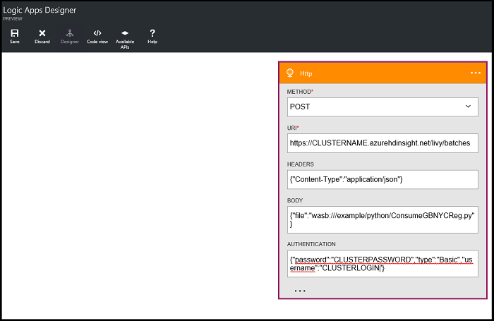

<properties
    pageTitle="Pontuação modelos de aprendizado de máquina construído Spark | Microsoft Azure"
    description="Como modelos de aprendizagem de pontuação que foram armazenadas no Azure Blob Storage (WASB)."
    services="machine-learning"
    documentationCenter=""
    authors="bradsev"
    manager="jhubbard"
    editor="cgronlun" />

<tags
    ms.service="machine-learning"
    ms.workload="data-services"
    ms.tgt_pltfrm="na"
    ms.devlang="na"
    ms.topic="article"
    ms.date="10/07/2016"
    ms.author="deguhath;bradsev;gokuma" />

# Modelos de aprendizado de máquina incorporado Spark de pontuação 

[AZURE.INCLUDE [machine-learning-spark-modeling](../../includes/machine-learning-spark-modeling.md)]

Este tópico descreve como carregar modelos (ML) de aprendizagem de máquina que foram criados usando Spark MLlib e armazenados em armazenamento de Blob do Azure (WASB) e a pontuação-los com conjuntos de dados que também tenham sido armazenados em WASB. Ele mostra como os dados de entrada do processo previamente, transformar recursos usando as funções de indexação e codificação no Kit de ferramentas MLlib e como criar um objeto de dados de ponto de rotulado que pode ser usado como entrada para pontuação com os modelos de ML. Os modelos usados para pontuação incluem Regressão Linear, Regressão logística, aleatórios floresta modelos e gradiente aumentando a modelos de árvore.

## Pré-requisitos

1. Você precisará de uma conta do Azure e um cluster de necessidade um 1,6 de Spark 3.4 HDInsight HDInsight Spark você para concluir este passo a passo. Consulte a [Visão geral de dados ciências usando Spark em Azurehdinsight](machine-learning-data-science-spark-overview.md) para obter instruções sobre como atender a esses requisitos. Esse tópico também contém uma descrição dos dados de NYC 2013 táxi usados aqui e instruções sobre como executar código de um bloco de anotações de Jupyter no cluster Spark. O bloco de anotações **pySpark-machine-learning-data-science-spark-model-consumption.ipynb** que contém as amostras de código neste tópico está disponível no [Github](https://github.com/Azure/Azure-MachineLearning-DataScience/tree/master/Misc/Spark/pySpark).

2. Você também deve criar a modelos para totalizados aqui trabalhando o tópico [exploração de dados e modelagem com Spark](machine-learning-data-science-spark-data-exploration-modeling.md) de aprendizado de máquina.   

[AZURE.INCLUDE [delete-cluster-warning](../../includes/hdinsight-delete-cluster-warning.md)]
 

## Instalação: locais de armazenamento, bibliotecas e contexto de Spark predefinido

Spark é capaz de leitura e gravação para um Blob de armazenamento do Azure (WASB). Para qualquer um dos seus dados existentes armazenados lá podem ser processados usando Spark e os resultados armazenados novamente em WASB.

Para salvar arquivos ou modelos no WASB, o caminho deve ser especificado corretamente. O contêiner padrão conectado ao cluster Spark pode ser referenciado usando uma caminho começando com: *"wasb / /"*. O exemplo de código a seguir especifica a localização dos dados a serem lidas e o caminho para o diretório de armazenamento de modelo ao qual o resultado de modelo é salvo. 

### Definir caminhos de diretório para locais de armazenamento em WASB

Modelos são salvos em: "wasb: / / / / remoteuser/NYCTaxi/modelos de usuário". Se este caminho não está definido corretamente, os modelos não são carregados para pontuação.

Os resultados scored foram salvas em: "wasb: / / / usuário/remoteuser/NYCTaxi/ScoredResults". Se o caminho para a pasta estiver incorreto, os resultados não são salvos nessa pasta.   

>[AZURE.NOTE] Os locais de caminho de arquivo podem ser copiados e colados nos espaços reservados neste código da saída da última célula do **machine-learning-data-science-spark-data-exploration-modeling.ipynb** bloco de anotações.   

Aqui está o código para definir caminhos de diretório: 

    # LOCATION OF DATA TO BE SCORED (TEST DATA)
    taxi_test_file_loc = "wasb://mllibwalkthroughs@cdspsparksamples.blob.core.windows.net/Data/NYCTaxi/JoinedTaxiTripFare.Point1Pct.Test.tsv";
    
    # SET THE MODEL STORAGE DIRECTORY PATH 
    # NOTE THE LAST BACKSLASH IN THIS PATH IS NEEDED
    modelDir = "wasb:///user/remoteuser/NYCTaxi/Models/" 
    
    # SET SCORDED RESULT DIRECTORY PATH
    # NOTE THE LAST BACKSLASH IN THIS PATH IS NEEDED
    scoredResultDir = "wasb:///user/remoteuser/NYCTaxi/ScoredResults/"; 
    
    # FILE LOCATIONS FOR THE MODELS TO BE SCORED
    logisticRegFileLoc = modelDir + "LogisticRegressionWithLBFGS_2016-04-1817_40_35.796789"
    linearRegFileLoc = modelDir + "LinearRegressionWithSGD_2016-04-1817_44_00.993832"
    randomForestClassificationFileLoc = modelDir + "RandomForestClassification_2016-04-1817_42_58.899412"
    randomForestRegFileLoc = modelDir + "RandomForestRegression_2016-04-1817_44_27.204734"
    BoostedTreeClassificationFileLoc = modelDir + "GradientBoostingTreeClassification_2016-04-1817_43_16.354770"
    BoostedTreeRegressionFileLoc = modelDir + "GradientBoostingTreeRegression_2016-04-1817_44_46.206262"

    # RECORD START TIME
    import datetime
    datetime.datetime.now()

**SAÍDA:**

DateTime.DateTime (2016, 4, 25, 23, 56, 19, 229403)

### Bibliotecas de importação

Definir contexto spark e importar bibliotecas necessárias com o seguinte código

    #IMPORT LIBRARIES
    import pyspark
    from pyspark import SparkConf
    from pyspark import SparkContext
    from pyspark.sql import SQLContext
    import matplotlib
    import matplotlib.pyplot as plt
    from pyspark.sql import Row
    from pyspark.sql.functions import UserDefinedFunction
    from pyspark.sql.types import *
    import atexit
    from numpy import array
    import numpy as np
    import datetime

### Contexto de Spark predefinido e PySpark magics

Os kernels PySpark que são fornecidos com blocos de anotações de Jupyter têm um contexto predefinido. Assim você não precisa definir o Visual ou seção contextos explicitamente antes de começar a trabalhar com o aplicativo que você estão desenvolvendo. Eles estão disponíveis para você por padrão. Nesses contextos são:

- SC - para Spark 
- sqlContext - para seção

O núcleo PySpark fornece alguns predefinidos "magics", que são comandos especiais que você pode chamar com % %. Há dois comandos que são usados nesses exemplos de código.

- **% local** Especificado que o código nas linhas subsequentes é executado localmente. Código deve ser código Python válido.
- **% sql -o<variable name>** 
- Executa uma consulta de seção em relação a sqlContext. Se o parâmetro -o é passado, o resultado da consulta é mantido na % contexto Python local como um dataframe Pandas.
 

Para obter mais informações sobre os kernels para blocos de anotações de Jupyter e predefinidos "magics" que eles fornecem, consulte [Kernels disponíveis para blocos de anotações de Jupyter com HDInsight Spark Linux clusters em HDInsight](../hdinsight/hdinsight-apache-spark-jupyter-notebook-kernels.md).

## A inclusão de dados e criar um quadro de dados limpo

Esta seção contém o código de uma série de tarefas necessárias para incluir os dados sejam totalizados. Lido em uma amostra de 0,1% unidas do táxi viagem e passagens arquivo (armazenado como um arquivo. tsv), formatar os dados e, em seguida, cria um quadro de dados limpo.

Os arquivos de viagem e passagens de táxi foram associados com base no procedimento fornecido na: [o processo de ciência de dados de equipe em ação: usando clusters de HDInsight Hadoop](machine-learning-data-science-process-hive-walkthrough.md) tópico.

    # INGEST DATA AND CREATE A CLEANED DATA FRAME

    # RECORD START TIME
    timestart = datetime.datetime.now()
    
    # IMPORT FILE FROM PUBLIC BLOB
    taxi_test_file = sc.textFile(taxi_test_file_loc)
    
    # GET SCHEMA OF THE FILE FROM HEADER
    taxi_header = taxi_test_file.filter(lambda l: "medallion" in l)
    
    # PARSE FIELDS AND CONVERT DATA TYPE FOR SOME FIELDS
    taxi_temp = taxi_test_file.subtract(taxi_header).map(lambda k: k.split("\t"))\
            .map(lambda p: (p[0],p[1],p[2],p[3],p[4],p[5],p[6],int(p[7]),int(p[8]),int(p[9]),int(p[10]),
                            float(p[11]),float(p[12]),p[13],p[14],p[15],p[16],p[17],p[18],float(p[19]),
                            float(p[20]),float(p[21]),float(p[22]),float(p[23]),float(p[24]),int(p[25]),int(p[26])))
        
    # GET SCHEMA OF THE FILE FROM HEADER
    schema_string = taxi_test_file.first()
    fields = [StructField(field_name, StringType(), True) for field_name in schema_string.split('\t')]
    fields[7].dataType = IntegerType() #Pickup hour
    fields[8].dataType = IntegerType() # Pickup week
    fields[9].dataType = IntegerType() # Weekday
    fields[10].dataType = IntegerType() # Passenger count
    fields[11].dataType = FloatType() # Trip time in secs
    fields[12].dataType = FloatType() # Trip distance
    fields[19].dataType = FloatType() # Fare amount
    fields[20].dataType = FloatType() # Surcharge
    fields[21].dataType = FloatType() # Mta_tax
    fields[22].dataType = FloatType() # Tip amount
    fields[23].dataType = FloatType() # Tolls amount
    fields[24].dataType = FloatType() # Total amount
    fields[25].dataType = IntegerType() # Tipped or not
    fields[26].dataType = IntegerType() # Tip class
    taxi_schema = StructType(fields)
    
    # CREATE DATA FRAME
    taxi_df_test = sqlContext.createDataFrame(taxi_temp, taxi_schema)
    
    # CREATE A CLEANED DATA-FRAME BY DROPPING SOME UN-NECESSARY COLUMNS & FILTERING FOR UNDESIRED VALUES OR OUTLIERS
    taxi_df_test_cleaned = taxi_df_test.drop('medallion').drop('hack_license').drop('store_and_fwd_flag').drop('pickup_datetime')\
        .drop('dropoff_datetime').drop('pickup_longitude').drop('pickup_latitude').drop('dropoff_latitude')\
        .drop('dropoff_longitude').drop('tip_class').drop('total_amount').drop('tolls_amount').drop('mta_tax')\
        .drop('direct_distance').drop('surcharge')\
        .filter("passenger_count > 0 and passenger_count < 8 AND payment_type in ('CSH', 'CRD') AND tip_amount >= 0 AND tip_amount < 30 AND fare_amount >= 1 AND fare_amount < 150 AND trip_distance > 0 AND trip_distance < 100 AND trip_time_in_secs > 30 AND trip_time_in_secs < 7200" )
    
    # CACHE DATA-FRAME IN MEMORY & MATERIALIZE DF IN MEMORY
    taxi_df_test_cleaned.cache()
    taxi_df_test_cleaned.count()
    
    # REGISTER DATA-FRAME AS A TEMP-TABLE IN SQL-CONTEXT
    taxi_df_test_cleaned.registerTempTable("taxi_test")
    
    # PRINT HOW MUCH TIME IT TOOK TO RUN THE CELL
    timeend = datetime.datetime.now()
    timedelta = round((timeend-timestart).total_seconds(), 2) 
    print "Time taken to execute above cell: " + str(timedelta) + " seconds"; 

**SAÍDA:**

Tempo necessário para executar acima célula: 46.37 segundos

## Preparar dados de pontuação em Spark 

Esta seção mostra como indexar, codificar e dimensionar categóricos recursos para prepará-los para uso em algoritmos de aprendizagem MLlib supervisionada para classificação e regressão.

### Recurso transformação: indexar e codificar categóricos recursos para entrada para modelos de pontuação 

Esta seção mostra como indexar dados categóricos usando um `StringIndexer` e codificar recursos com `OneHotEncoder` de entrada para os modelos.

O [StringIndexer](http://spark.apache.org/docs/latest/ml-features.html#stringindexer) codifica uma coluna de cadeia de caracteres de rótulos para uma coluna de índices de rótulo. Os índices são ordenados por frequências de rótulo. 

O [OneHotEncoder](http://scikit-learn.org/stable/modules/generated/sklearn.preprocessing.OneHotEncoder.html#sklearn.preprocessing.OneHotEncoder) mapeia uma coluna de índices de etiqueta para uma coluna de vetores binários, no máximo um único um valor. Essa codificação permite algoritmos que espera contínuos recursos importantes, como Regressão logística, seja aplicada aos recursos de categorias.
    
    #INDEX AND ONE-HOT ENCODE CATEGORICAL FEATURES

    # RECORD START TIME
    timestart = datetime.datetime.now()
    
    # LOAD PYSPARK LIBRARIES
    from pyspark.ml.feature import OneHotEncoder, StringIndexer, VectorAssembler, VectorIndexer
    
    # CREATE FOUR BUCKETS FOR TRAFFIC TIMES
    sqlStatement = """
        SELECT *,
        CASE
         WHEN (pickup_hour <= 6 OR pickup_hour >= 20) THEN "Night" 
         WHEN (pickup_hour >= 7 AND pickup_hour <= 10) THEN "AMRush" 
         WHEN (pickup_hour >= 11 AND pickup_hour <= 15) THEN "Afternoon"
         WHEN (pickup_hour >= 16 AND pickup_hour <= 19) THEN "PMRush"
        END as TrafficTimeBins
        FROM taxi_test 
    """
    taxi_df_test_with_newFeatures = sqlContext.sql(sqlStatement)
    
    # CACHE DATA-FRAME IN MEMORY & MATERIALIZE DF IN MEMORY
    taxi_df_test_with_newFeatures.cache()
    taxi_df_test_with_newFeatures.count()
    
    # INDEX AND ONE-HOT ENCODING
    stringIndexer = StringIndexer(inputCol="vendor_id", outputCol="vendorIndex")
    model = stringIndexer.fit(taxi_df_test_with_newFeatures) # Input data-frame is the cleaned one from above
    indexed = model.transform(taxi_df_test_with_newFeatures)
    encoder = OneHotEncoder(dropLast=False, inputCol="vendorIndex", outputCol="vendorVec")
    encoded1 = encoder.transform(indexed)
    
    # INDEX AND ENCODE RATE_CODE
    stringIndexer = StringIndexer(inputCol="rate_code", outputCol="rateIndex")
    model = stringIndexer.fit(encoded1)
    indexed = model.transform(encoded1)
    encoder = OneHotEncoder(dropLast=False, inputCol="rateIndex", outputCol="rateVec")
    encoded2 = encoder.transform(indexed)
    
    # INDEX AND ENCODE PAYMENT_TYPE
    stringIndexer = StringIndexer(inputCol="payment_type", outputCol="paymentIndex")
    model = stringIndexer.fit(encoded2)
    indexed = model.transform(encoded2)
    encoder = OneHotEncoder(dropLast=False, inputCol="paymentIndex", outputCol="paymentVec")
    encoded3 = encoder.transform(indexed)
    
    # INDEX AND ENCODE TRAFFIC TIME BINS
    stringIndexer = StringIndexer(inputCol="TrafficTimeBins", outputCol="TrafficTimeBinsIndex")
    model = stringIndexer.fit(encoded3)
    indexed = model.transform(encoded3)
    encoder = OneHotEncoder(dropLast=False, inputCol="TrafficTimeBinsIndex", outputCol="TrafficTimeBinsVec")
    encodedFinal = encoder.transform(indexed)
    
    # PRINT HOW MUCH TIME IT TOOK TO RUN THE CELL
    timeend = datetime.datetime.now()
    timedelta = round((timeend-timestart).total_seconds(), 2) 
    print "Time taken to execute above cell: " + str(timedelta) + " seconds"; 

**SAÍDA:**

Tempo necessário para executar acima célula: 5,37 segundos

### Criar RDD objetos com matrizes de recurso para entrada para modelos

Esta seção contém código que mostra como indexar dados categóricos texto como um objeto RDD e quentes um codificá-lo para que ele pode ser usado para treinar e teste de regressão logística MLlib e modelos baseados em árvore. Os dados indexados são armazenados em objetos [e apresentam resiliência distribuído Dataset RDD ()](http://spark.apache.org/docs/latest/api/java/org/apache/spark/rdd/RDD.html) . Estas são a abstração básica em Spark. Um objeto RDD representa uma coleção de imutável, particionada dos elementos que podem ser operados em paralelo com Spark.

Ele também contém o código que mostra como dimensionar dados com a `StandardScalar` fornecida pelo MLlib para uso em regressão linear com Stochastic gradiente descendente (SGD), um algoritmo popular para uma ampla variedade de modelos de aprendizado de máquina de treinamento. O [StandardScaler](https://spark.apache.org/docs/latest/api/python/pyspark.mllib.html#pyspark.mllib.feature.StandardScaler) é usado para dimensionar os recursos de variação de unidade. Dimensionamento de recurso, também conhecido como normalização de dados, assegura que os recursos com valores amplamente caro são não fornecido excessiva ponderar na função objetiva. 

    # CREATE RDD OBJECTS WITH FEATURE ARRAYS FOR INPUT INTO MODELS

    # RECORD START TIME
    timestart = datetime.datetime.now()

    # IMPORT LIBRARIES
    from pyspark.mllib.linalg import Vectors
    from pyspark.mllib.feature import StandardScaler, StandardScalerModel
    from pyspark.mllib.util import MLUtils
    from numpy import array
    
    # INDEXING CATEGORICAL TEXT FEATURES FOR INPUT INTO TREE-BASED MODELS
    def parseRowIndexingBinary(line):
        features = np.array([line.paymentIndex, line.vendorIndex, line.rateIndex, line.TrafficTimeBinsIndex,
                             line.pickup_hour, line.weekday, line.passenger_count, line.trip_time_in_secs, 
                             line.trip_distance, line.fare_amount])
        return  features
    
    # ONE-HOT ENCODING OF CATEGORICAL TEXT FEATURES FOR INPUT INTO LOGISTIC RERESSION MODELS
    def parseRowOneHotBinary(line):
        features = np.concatenate((np.array([line.pickup_hour, line.weekday, line.passenger_count,
                                            line.trip_time_in_secs, line.trip_distance, line.fare_amount]), 
                                            line.vendorVec.toArray(), line.rateVec.toArray(), 
                                            line.paymentVec.toArray(), line.TrafficTimeBinsVec.toArray()), axis=0)
        return  features
    
    # ONE-HOT ENCODING OF CATEGORICAL TEXT FEATURES FOR INPUT INTO TREE-BASED MODELS
    def parseRowIndexingRegression(line):
        features = np.array([line.paymentIndex, line.vendorIndex, line.rateIndex, line.TrafficTimeBinsIndex, 
                             line.pickup_hour, line.weekday, line.passenger_count, line.trip_time_in_secs, 
                             line.trip_distance, line.fare_amount])
        return  features
    
    # INDEXING CATEGORICAL TEXT FEATURES FOR INPUT INTO LINEAR REGRESSION MODELS
    def parseRowOneHotRegression(line):
        features = np.concatenate((np.array([line.pickup_hour, line.weekday, line.passenger_count,
                                            line.trip_time_in_secs, line.trip_distance, line.fare_amount]), 
                                            line.vendorVec.toArray(), line.rateVec.toArray(), 
                                            line.paymentVec.toArray(), line.TrafficTimeBinsVec.toArray()), axis=0)
        return  features

    # FOR BINARY CLASSIFICATION TRAINING AND TESTING
    indexedTESTbinary = encodedFinal.map(parseRowIndexingBinary)
    oneHotTESTbinary = encodedFinal.map(parseRowOneHotBinary)
    
    # FOR REGRESSION CLASSIFICATION TRAINING AND TESTING
    indexedTESTreg = encodedFinal.map(parseRowIndexingRegression)
    oneHotTESTreg = encodedFinal.map(parseRowOneHotRegression)
    
    # SCALING FEATURES FOR LINEARREGRESSIONWITHSGD MODEL
    scaler = StandardScaler(withMean=False, withStd=True).fit(oneHotTESTreg)
    oneHotTESTregScaled = scaler.transform(oneHotTESTreg)
    
    # CACHE RDDS IN MEMORY
    indexedTESTbinary.cache();
    oneHotTESTbinary.cache();
    indexedTESTreg.cache();
    oneHotTESTreg.cache();
    oneHotTESTregScaled.cache();
    
    # PRINT HOW MUCH TIME IT TOOK TO RUN THE CELL
    timeend = datetime.datetime.now()
    timedelta = round((timeend-timestart).total_seconds(), 2) 
    print "Time taken to execute above cell: " + str(timedelta) + " seconds"; 

**SAÍDA:**

Tempo necessário para executar acima célula: 11.72 segundos

## Pontuação com o modelo de regressão logística e salvar a saída para blob

O código desta seção mostra como carregar um modelo de regressão logística que foi salva no armazenamento de blob do Microsoft Azure e usá-lo para prever estando ou não uma dica é pago em uma viagem de táxi, pontuação-lo com métricas de classificação padrão, salve e plote os resultados ao armazenamento de blob. Os resultados scored são armazenados em objetos RDD. 

    # SCORE AND EVALUATE LOGISTIC REGRESSION MODEL

    # RECORD START TIME
    timestart = datetime.datetime.now()
    
    # IMPORT LIBRARIES
    from pyspark.mllib.classification import LogisticRegressionModel
    
    ## LOAD SAVED MODEL
    savedModel = LogisticRegressionModel.load(sc, logisticRegFileLoc)
    predictions = oneHotTESTbinary.map(lambda features: (float(savedModel.predict(features))))
    
    ## SAVE SCORED RESULTS (RDD) TO BLOB
    datestamp = unicode(datetime.datetime.now()).replace(' ','').replace(':','_');
    logisticregressionfilename = "LogisticRegressionWithLBFGS_" + datestamp + ".txt";
    dirfilename = scoredResultDir + logisticregressionfilename;
    predictions.saveAsTextFile(dirfilename)
    
    
    # PRINT HOW MUCH TIME IT TOOK TO RUN THE CELL
    timeend = datetime.datetime.now()
    timedelta = round((timeend-timestart).total_seconds(), 2) 
    print "Time taken to execute above cell: " + str(timedelta) + " seconds";

**SAÍDA:**

Tempo necessário para executar acima célula: 19.22 segundos

## Pontuação de um modelo de regressão Linear

Usamos [LinearRegressionWithSGD](https://spark.apache.org/docs/latest/api/python/pyspark.mllib.html#pyspark.mllib.regression.LinearRegressionWithSGD) treinar um modelo de regressão linear usando Stochastic gradiente descendente (SGD) para otimização prever a quantidade de dica paga. 

O código desta seção mostra como carregar um modelo de regressão Linear do armazenamento de blob do Microsoft Azure, pontuação usando variáveis em escala e, em seguida, salvar os resultados de volta ao blob.

    #SCORE LINEAR REGRESSION MODEL

    # RECORD START TIME
    timestart = datetime.datetime.now()
    
    #LOAD LIBRARIES
    from pyspark.mllib.regression import LinearRegressionWithSGD, LinearRegressionModel
    
    # LOAD MODEL AND SCORE USING ** SCALED VARIABLES **
    savedModel = LinearRegressionModel.load(sc, linearRegFileLoc)
    predictions = oneHotTESTregScaled.map(lambda features: (float(savedModel.predict(features))))
    
    # SAVE RESULTS
    datestamp = unicode(datetime.datetime.now()).replace(' ','').replace(':','_');
    linearregressionfilename = "LinearRegressionWithSGD_" + datestamp;
    dirfilename = scoredResultDir + linearregressionfilename;
    predictions.saveAsTextFile(dirfilename)
    
    # PRINT HOW MUCH TIME IT TOOK TO RUN THE CELL
    timeend = datetime.datetime.now()
    timedelta = round((timeend-timestart).total_seconds(), 2) 
    print "Time taken to execute above cell: " + str(timedelta) + " seconds"; 

**SAÍDA:**

Tempo necessário para executar acima célula: 16.63 segundos

## Classificação e regressão modelos de floresta aleatório de pontuação

O código desta seção mostra como carregar a classificação salva e regressão aleatório floresta modelos salvos no armazenamento de blob do Microsoft Azure, pontuação seu desempenho com classificador padrão e medidas de regressão e salve os resultados de volta ao armazenamento de blob.

[Aleatório florestas](http://spark.apache.org/docs/latest/mllib-ensembles.html#Random-Forests) são ensembles de árvores de decisão.  Eles combinarem várias árvores de decisão para reduzir o risco de excedido. Florestas aleatórias podem lidar com recursos de categorias, estender para a configuração de classificação multiclass, não exigem o dimensionamento de recurso e são capazes de capturar não linearidades e interações de recursos. Aleatórias florestas são um da modelos para classificação e regressão de aprendizado de máquina mais bem-sucedidas.

[Spark.mllib](http://spark.apache.org/mllib/) suporta florestas aleatórias para classificação binária e multiclass e para regressão, usando recursos contínuos e categorias. 

    # SCORE RANDOM FOREST MODELS FOR CLASSIFICATION AND REGRESSION

    # RECORD START TIME
    timestart = datetime.datetime.now()

    #IMPORT MLLIB LIBRARIES 
    from pyspark.mllib.tree import RandomForest, RandomForestModel
    
    
    # CLASSIFICATION: LOAD SAVED MODEL, SCORE AND SAVE RESULTS BACK TO BLOB
    savedModel = RandomForestModel.load(sc, randomForestClassificationFileLoc)
    predictions = savedModel.predict(indexedTESTbinary)
    
    # SAVE RESULTS
    datestamp = unicode(datetime.datetime.now()).replace(' ','').replace(':','_');
    rfclassificationfilename = "RandomForestClassification_" + datestamp + ".txt";
    dirfilename = scoredResultDir + rfclassificationfilename;
    predictions.saveAsTextFile(dirfilename)
    

    # REGRESSION: LOAD SAVED MODEL, SCORE AND SAVE RESULTS BACK TO BLOB
    savedModel = RandomForestModel.load(sc, randomForestRegFileLoc)
    predictions = savedModel.predict(indexedTESTreg)
    
    # SAVE RESULTS
    datestamp = unicode(datetime.datetime.now()).replace(' ','').replace(':','_');
    rfregressionfilename = "RandomForestRegression_" + datestamp + ".txt";
    dirfilename = scoredResultDir + rfregressionfilename;
    predictions.saveAsTextFile(dirfilename)

    # PRINT HOW MUCH TIME IT TOOK TO RUN THE CELL
    timeend = datetime.datetime.now()
    timedelta = round((timeend-timestart).total_seconds(), 2) 
    print "Time taken to execute above cell: " + str(timedelta) + " seconds";

**SAÍDA:**

Tempo necessário para executar acima célula: 31.07 segundos

## Classificação e regressão gradiente aumentando a árvore modelos de pontuação

O código desta seção mostra como carregar classificação regressão gradiente aumentando a árvore modelos e do armazenamento de blob do Microsoft Azure, pontuação seu desempenho com classificador padrão e medidas de regressão e salve os resultados de volta ao armazenamento de blob. 

**Spark.mllib** suporta GBTs para classificação binária e de regressão, usando recursos contínuos e categorias. 

[Árvores de aumento de gradientes](http://spark.apache.org/docs/latest/ml-classification-regression.html#gradient-boosted-trees-gbts) (GBTs) são ensembles de árvores de decisão. GBTs treinar árvores de decisão interativamente para minimizar uma função de perda. GBTs pode lidar com recursos de categorias, não exigem o dimensionamento de recurso e são capazes de capturar não linearidades e interações de recursos. Eles também podem ser usados em uma configuração de classificação de multiclass.

    # SCORE GRADIENT BOOSTING TREE MODELS FOR CLASSIFICATION AND REGRESSION

    # RECORD START TIME
    timestart = datetime.datetime.now()

    #IMPORT MLLIB LIBRARIES
    from pyspark.mllib.tree import GradientBoostedTrees, GradientBoostedTreesModel
    
    # CLASSIFICATION: LOAD SAVED MODEL, SCORE AND SAVE RESULTS BACK TO BLOB

    #LOAD AND SCORE THE MODEL
    savedModel = GradientBoostedTreesModel.load(sc, BoostedTreeClassificationFileLoc)
    predictions = savedModel.predict(indexedTESTbinary)
    
    # SAVE RESULTS
    datestamp = unicode(datetime.datetime.now()).replace(' ','').replace(':','_');
    btclassificationfilename = "GradientBoostingTreeClassification_" + datestamp + ".txt";
    dirfilename = scoredResultDir + btclassificationfilename;
    predictions.saveAsTextFile(dirfilename)
    

    # REGRESSION: LOAD SAVED MODEL, SCORE AND SAVE RESULTS BACK TO BLOB

    # LOAD AND SCORE MODEL 
    savedModel = GradientBoostedTreesModel.load(sc, BoostedTreeRegressionFileLoc)
    predictions = savedModel.predict(indexedTESTreg)
    
    # SAVE RESULTS
    datestamp = unicode(datetime.datetime.now()).replace(' ','').replace(':','_');
    btregressionfilename = "GradientBoostingTreeRegression_" + datestamp + ".txt";
    dirfilename = scoredResultDir + btregressionfilename;
    predictions.saveAsTextFile(dirfilename)

    # PRINT HOW MUCH TIME IT TOOK TO RUN THE CELL
    timeend = datetime.datetime.now()
    timedelta = round((timeend-timestart).total_seconds(), 2) 
    print "Time taken to execute above cell: " + str(timedelta) + " seconds"; 
    
**SAÍDA:**

Tempo necessário para executar acima célula: 14.6 segundos

## Limpar objetos de memória e imprimir marcou locais de arquivos

    # UNPERSIST OBJECTS CACHED IN MEMORY
    taxi_df_test_cleaned.unpersist()
    indexedTESTbinary.unpersist();
    oneHotTESTbinary.unpersist();
    indexedTESTreg.unpersist();
    oneHotTESTreg.unpersist();
    oneHotTESTregScaled.unpersist();

    # PRINT OUT PATH TO SCORED OUTPUT FILES
    print "logisticRegFileLoc: " + logisticregressionfilename;
    print "linearRegFileLoc: " + linearregressionfilename;
    print "randomForestClassificationFileLoc: " + rfclassificationfilename;
    print "randomForestRegFileLoc: " + rfregressionfilename;
    print "BoostedTreeClassificationFileLoc: " + btclassificationfilename;
    print "BoostedTreeRegressionFileLoc: " + btregressionfilename;

**SAÍDA:**

logisticRegFileLoc: LogisticRegressionWithLBFGS_2016-05-0317_22_38.953814.txt

linearRegFileLoc: LinearRegressionWithSGD_2016-05-0317_22_58.878949

randomForestClassificationFileLoc: RandomForestClassification_2016-05-0317_23_15.939247.txt

randomForestRegFileLoc: RandomForestRegression_2016-05-0317_23_31.459140.txt

BoostedTreeClassificationFileLoc: GradientBoostingTreeClassification_2016-05-0317_23_49.648334.txt

BoostedTreeRegressionFileLoc: GradientBoostingTreeRegression_2016-05-0317_23_56.860740.txt

## Consumir Spark modelos por meio de uma interface da web

Spark fornece um mecanismo para enviar remotamente trabalhos em lotes ou consultas interativas por meio de uma interface REST com um componente chamado Livy. Livy é ativada por padrão em seu cluster HDInsight Spark. Para obter mais informações sobre Livy consulte: [trabalhos de enviar Spark remotamente usando Livy](../hdinsight/hdinsight-apache-spark-livy-rest-interface.md). 

Você pode usar Livy remotamente enviar um trabalho que lote a pontuação de um arquivo que está armazenado em um blob Azure e grava os resultados em outra blob. Para fazer isso, você carregar o script de Python de  
[Github](https://raw.githubusercontent.com/Azure/Azure-MachineLearning-DataScience/master/Misc/Spark/Python/ConsumeGBNYCReg.py) para o blob do cluster Spark. Você pode usar uma ferramenta como **Gerenciador de armazenamento do Microsoft Azure** ou **AzCopy** para copiar o script para o blob de cluster. Em nosso caso podemos carregado o script ***wasb:///example/python/ConsumeGBNYCReg.py***.   

>[AZURE.NOTE] As teclas de acesso que você precisa podem ser encontrados no portal para a conta de armazenamento associado ao cluster Spark. 

Uma vez carregado nesse local, esse script é executado no cluster Spark em um contexto distribuído. Ele carrega o modelo e executar previsões em arquivos de entrada com base no modelo.  

Você pode chamar esse script remotamente fazendo uma solicitação HTTPS/REST simples na Livy.  Veja aqui um comando de rotação para construir a solicitação HTTP para chamar o script de Python remotamente. Substitua os valores adequados para o seu cluster Spark CLUSTERLOGIN, CLUSTERPASSWORD, CLUSTERNAME.

    # CURL COMMAND TO INVOKE PYTHON SCRIPT WITH HTTP REQUEST

    curl -k --user "CLUSTERLOGIN:CLUSTERPASSWORD" -X POST --data "{\"file\": \"wasb:///example/python/ConsumeGBNYCReg.py\"}" -H "Content-Type: application/json" https://CLUSTERNAME.azurehdinsight.net/livy/batches

Você pode usar qualquer idioma no sistema remoto para chamar o trabalho de Spark através de Livy fazendo uma chamada HTTPS simple com autenticação básica.   

>[AZURE.NOTE] Seria conveniente usar a biblioteca de solicitações de Python ao fazer esta chamada HTTP, mas ele não está instalado por padrão em funções do Azure. Então antigas bibliotecas HTTP são usadas em vez disso.   

Aqui está o código Python de chamada HTTP:

    #MAKE AN HTTPS CALL ON LIVY. 

    import os

    # OLDER HTTP LIBRARIES USED HERE INSTEAD OF THE REQUEST LIBRARY AS THEY ARE AVAILBLE BY DEFAULT
    import httplib, urllib, base64
    
    # REPLACE VALUE WITH ONES FOR YOUR SPARK CLUSTER
    host = '<spark cluster name>.azurehdinsight.net:443'
    username='<username>'
    password='<password>'
    
    #AUTHORIZATION
    conn = httplib.HTTPSConnection(host)
    auth = base64.encodestring('%s:%s' % (username, password)).replace('\n', '')
    headers = {'Content-Type': 'application/json', 'Authorization': 'Basic %s' % auth}
    
    # SPECIFY THE PYTHON SCRIPT TO RUN ON THE SPARK CLUSTER
    # IN THE FILE PARAMETER OF THE JSON POST REQUEST BODY
    r=conn.request("POST", '/livy/batches', '{"file": "wasb:///example/python/ConsumeGBNYCReg.py"}', headers )
    response = conn.getresponse().read()
    print(response)
    conn.close()

Você também pode adicionar este código Python para [Funções do Azure](https://azure.microsoft.com/documentation/services/functions/) para disparar um envio de trabalho Spark que pontuações um blob com base em vários eventos como um timer, criação ou atualização de um blob. 

Se você preferir uma experiência do cliente gratuito de código, use os [Aplicativos do Azure lógica](https://azure.microsoft.com/documentation/services/app-service/logic/) para invocar o lote de Spark pontuação define uma ação de HTTP no **Designer de aplicativos de lógica** e definindo seus parâmetros. 

- Azure no portal do, crie um novo aplicativo de lógica selecionando **+ nova** -> **Web + Mobile** -> **Lógica de aplicativo**. 
- Para exibir o **Designer de aplicativos de lógica**, insira o nome do aplicativo de lógica e plano de serviço de aplicativo.
- Selecione uma ação de HTTP e digite os parâmetros mostrados na figura a seguir:

## O que vem a seguir? 

**Validação cruzada e hyperparameter varredura**: consulte a [exploração de dados e modelagem com Spark avançadas](machine-learning-data-science-spark-advanced-data-exploration-modeling.md) em como modelos podem ser treinamento usando a limpeza de validação cruzada e hyper-parâmetro.
