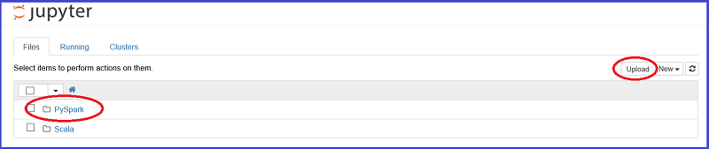

<properties
    pageTitle="Visão geral de ciência de dados usando o Spark em Azurehdinsight | Microsoft Azure"
    description="O Kit de ferramentas de MLlib Spark traz recursos para o ambiente de HDInsight distribuído de modelagem de aprendizado de máquina considerável."
    services="machine-learning"
    documentationCenter=""
    authors="bradsev"
    manager="jhubbard"
    editor="cgronlun"  />

<tags
    ms.service="machine-learning"
    ms.workload="data-services"
    ms.tgt_pltfrm="na"
    ms.devlang="na"
    ms.topic="article"
    ms.date="10/07/2016"
    ms.author="deguhath;bradsev;gokuma" />

# Visão geral de ciência de dados usando o Spark no Azure HDInsight

[AZURE.INCLUDE [machine-learning-spark-modeling](../../includes/machine-learning-spark-modeling.md)]

Este conjunto de tópicos mostra como usar HDInsight Spark para concluir tarefas comuns de ciência de dados, como a inclusão de dados, engenharia de recurso, modelagem e avaliação de modelo. Os dados usados são um exemplo do 2013 NYC táxi viagem e passagens dataset. Os modelos criados incluem regressão linear e logística, aleatórias florestas e árvores aumentadas gradientes. Os tópicos também mostram como armazenar esses modelos em armazenamento de blob do Microsoft Azure (WASB) e como pontuação e avaliar o desempenho de previsão. Tópicos mais avançados cobrem como modelos podem ser treinamento usando a limpeza de validação cruzada e hyper-parâmetro. Este tópico Visão geral também descreve como configurar o cluster Spark que você precisa concluir as etapas nas três orientações fornecidas. 

[Spark](http://spark.apache.org/) é um paralelo de código-fonte aberto processamento framework que suporta o processamento de memória para melhorar o desempenho dos aplicativos analíticos grandes de dados. Mecanismo de processamento de Spark baseia-se para velocidade, facilidade de uso e a análise de sofisticados. Recursos de computação distribuídos na memória do Spark faça uma boa opção para algoritmos iterativos em cálculos de aprendizagem e gráfico de máquina. [MLlib](http://spark.apache.org/mllib/) é biblioteca de aprendizado de máquina scalable do Spark que traz recursos de modelagem para esse ambiente distribuído. 

[HDInsight Spark](../hdinsight/hdinsight-apache-spark-overview.md) é a oferta de hospedado Azure de Spark de código-fonte aberto. Ele também inclui suporte para **blocos de anotações de Jupyter PySpark** no cluster Spark que pode executar consultas de interativo Spark SQL para transformar, filtragem e visualizar dados armazenados no Azure Blobs (WASB). PySpark é a API do Python para Spark. Os trechos de código que fornecem as soluções e mostram o plotar relevantes para visualizar os dados aqui executados em blocos de anotações de Jupyter instalados em clusters Spark. As etapas de modelagem nestes tópicos contêm código que mostra como treinar, avaliar, salvar e consumir cada tipo de modelo. 

As etapas de configuração e código fornecido neste passo a passo é para HDInsight 3.4 Spark 1,6. No entanto, o código aqui e em blocos de anotações é genérico e deve trabalhar em qualquer cluster Spark. Se você não estiver usando HDInsight Spark, as etapas de configuração e gerenciamento de cluster podem ser um pouco diferentes do que é mostrado aqui.

## Pré-requisitos

1. você deve ter uma assinatura do Azure. Se você ainda não tiver uma, consulte [avaliação gratuita do Azure obter](https://azure.microsoft.com/documentation/videos/get-azure-free-trial-for-testing-hadoop-in-hdinsight/).

2. você precisa de um cluster de HDInsight 3.4 Spark 1,6 para concluir este passo a passo. Para criar uma, consulte as instruções fornecidas em [Introdução: criar Apache Spark em Azurehdinsight](../hdinsight/hdinsight-apache-spark-jupyter-spark-sql.md). O tipo de cluster e versão é especificado no menu **Selecionar tipo de Cluster** . 

<!-- -->

> [AZURE.NOTE] Para um tópico que mostra como usar Scala em vez de Python para concluir tarefas para um processo de ciência de dados de ponta a ponta, consulte o [ciência de dados usando Scala com Spark no Azure](machine-learning-data-science-process-scala-walkthrough.md).

<!-- -->

>[AZURE.INCLUDE [delete-cluster-warning](../../includes/hdinsight-delete-cluster-warning.md)]

## Os dados de NYC 2013 táxi

Os dados de viagem de táxi NYC cerca de 20 GB de arquivos compactados valores separados por vírgula (CSV) (~ 48 GB descompactado), que consiste em mais de milhões de 173 individuais viagens e as tarifas pago para cada viagem. Cada registro de viagem inclui a retirada e local de entrega e hora, número de licença anonymized alteração (driver) e número de medallion (identificação exclusiva do táxi). Os dados abrange todas as viagens no ano 2013 e são fornecidos em seguintes dois conjuntos de dados para cada mês:

1. Arquivos CSV 'trip_data' contêm detalhes de viagem, como número de passageiros, pegue- e redução pontos, viagem de ida volta duração e a duração de viagem. Aqui estão alguns exemplos de registros:

        medallion,hack_license,vendor_id,rate_code,store_and_fwd_flag,pickup_datetime,dropoff_datetime,passenger_count,trip_time_in_secs,trip_distance,pickup_longitude,pickup_latitude,dropoff_longitude,dropoff_latitude
        89D227B655E5C82AECF13C3F540D4CF4,BA96DE419E711691B9445D6A6307C170,CMT,1,N,2013-01-01 15:11:48,2013-01-01 15:18:10,4,382,1.00,-73.978165,40.757977,-73.989838,40.751171
        0BD7C8F5BA12B88E0B67BED28BEA73D8,9FD8F69F0804BDB5549F40E9DA1BE472,CMT,1,N,2013-01-06 00:18:35,2013-01-06 00:22:54,1,259,1.50,-74.006683,40.731781,-73.994499,40.75066
        0BD7C8F5BA12B88E0B67BED28BEA73D8,9FD8F69F0804BDB5549F40E9DA1BE472,CMT,1,N,2013-01-05 18:49:41,2013-01-05 18:54:23,1,282,1.10,-74.004707,40.73777,-74.009834,40.726002
        DFD2202EE08F7A8DC9A57B02ACB81FE2,51EE87E3205C985EF8431D850C786310,CMT,1,N,2013-01-07 23:54:15,2013-01-07 23:58:20,2,244,.70,-73.974602,40.759945,-73.984734,40.759388
        DFD2202EE08F7A8DC9A57B02ACB81FE2,51EE87E3205C985EF8431D850C786310,CMT,1,N,2013-01-07 23:25:03,2013-01-07 23:34:24,1,560,2.10,-73.97625,40.748528,-74.002586,40.747868

2. Os arquivos CSV 'trip_fare' contêm detalhes da tarifa paga para cada viagem, como o tipo de pagamento, quantidade de tarifa, sobrecarga e impostos, dicas e pedágio e o valor total pago. Aqui estão alguns exemplos de registros:

        medallion, hack_license, vendor_id, pickup_datetime, payment_type, fare_amount, surcharge, mta_tax, tip_amount, tolls_amount, total_amount
        89D227B655E5C82AECF13C3F540D4CF4,BA96DE419E711691B9445D6A6307C170,CMT,2013-01-01 15:11:48,CSH,6.5,0,0.5,0,0,7
        0BD7C8F5BA12B88E0B67BED28BEA73D8,9FD8F69F0804BDB5549F40E9DA1BE472,CMT,2013-01-06 00:18:35,CSH,6,0.5,0.5,0,0,7
        0BD7C8F5BA12B88E0B67BED28BEA73D8,9FD8F69F0804BDB5549F40E9DA1BE472,CMT,2013-01-05 18:49:41,CSH,5.5,1,0.5,0,0,7
        DFD2202EE08F7A8DC9A57B02ACB81FE2,51EE87E3205C985EF8431D850C786310,CMT,2013-01-07 23:54:15,CSH,5,0.5,0.5,0,0,6
        DFD2202EE08F7A8DC9A57B02ACB81FE2,51EE87E3205C985EF8431D850C786310,CMT,2013-01-07 23:25:03,CSH,9.5,0.5,0.5,0,0,10.5

Temos tirado de uma amostra de 0,1% desses arquivos e unidas viagem\_dados e viagem\_passagens arquivos CVS em um único conjunto de dados para usar como o conjunto de dados de entrada para este passo a passo. A chave exclusiva para participar de viagem\_dados e viagem\_passagens é composta dos campos: medallion, ataques\_licença e retirada\_datetime. Cada registro do conjunto de dados contém os seguintes atributos que representa uma viagem NYC táxi:

|Campo| Breve descrição
|------|---------------------------------
| medallion |Medallion táxi anonymized (id exclusiva táxi)
| hack_license |    Número de licença de Hackney carro anonymized
| vendor_id |   Id do fornecedor de táxi
| rate_code | Taxa de táxi NYC de passagens
| store_and_fwd_flag | Armazenar e encaminhar sinalizador
| pickup_datetime | Pegue a data e hora
| dropoff_datetime | Redução de data e hora
| pickup_hour | Pegue a hora
| pickup_week | Pegue a semana do ano
| dia da semana | Weekday (intervalo de 1 a 7)
| passenger_count | Número de passageiros em uma viagem de táxi
| trip_time_in_secs | Tempo de viagem em segundos
| trip_distance | Mover em milhas de distância de viagem
| pickup_longitude | Pegue longitude
| pickup_latitude | Pegue latitude
| dropoff_longitude | Redução longitude
| dropoff_latitude | Latitude redução
| direct_distance | Direcionar a distância entre escolha para cima e redução locais
| payment_type | Tipo de pagamento (autoridades de certificação, cartão de crédito etc.)
| fare_amount | Valor de passagens na
| taxa adicional | Taxa adicional
| mta_tax | Imposto de MTA
| tip_amount | Quantidade de dica
| tolls_amount | Quantidade de pedágio
| total_amount | Quantidade total
| Oblíquo | Oblíquo (0/1 para não ou Sim)
| tip_class | Dica de classe (0: r $0, 1: $0-5, 2: $6-10, 3: $11-20, 4: > US $20)

## Executar o código de um bloco de anotações de Jupyter no cluster Spark 

Você pode iniciar o bloco de anotações de Jupyter do portal do Azure. Encontre seu cluster Spark no painel e clique nele para inserir página management para seu cluster. Para abrir o bloco de anotações associado ao cluster Spark, clique em **Painéis de Cluster** -> **Jupyter bloco de anotações** .

Você também pode navegar até ***https://CLUSTERNAME.azurehdinsight.net/jupyter*** para acessar os blocos de anotações de Jupyter. Substitua parte CLUSTERNAME essa URL com o nome do seu próprio cluster. É necessário a senha da sua conta de administrador acessar os blocos de anotações.

Selecione PySpark para ver uma pasta que contém alguns exemplos de blocos de anotações predefinidos que usam a API PySpark. Os blocos de anotações que contêm as amostras de código para este pacote do tópico Spark estão disponíveis em [Github](https://github.com/Azure/Azure-MachineLearning-DataScience/tree/master/Misc/Spark/pySpark)

Você pode carregar os blocos de anotações diretamente do Github para o servidor de bloco de anotações de Jupyter em seu cluster Spark. Na home page do seu Jupyter, clique no botão **carregar** na parte direita da tela. Ele abre um Explorador de arquivos. Aqui você pode colar a URL Github (conteúdo bruto) do bloco de anotações e clique em **Abrir**. Os blocos de anotações de PySpark estão disponíveis nas seguintes URLs:

1.  [pySpark-machine-learning-data-science-spark-data-exploration-modeling.ipynb](https://github.com/Azure/Azure-MachineLearning-DataScience/blob/master/Misc/Spark/pySpark/pySpark-machine-learning-data-science-spark-data-exploration-modeling.ipynb)
2.  [pySpark-machine-learning-data-science-spark-model-consumption.ipynb](https://github.com/Azure/Azure-MachineLearning-DataScience/blob/master/Misc/Spark/pySpark/pySpark-machine-learning-data-science-spark-model-consumption.ipynb)
3.  [pySpark-machine-learning-data-science-spark-advanced-data-exploration-modeling.ipynb](https://github.com/Azure/Azure-MachineLearning-DataScience/blob/master/Misc/Spark/pySpark/pySpark-machine-learning-data-science-spark-advanced-data-exploration-modeling.ipynb)

Você verá o nome do arquivo na sua lista de arquivo de Jupyter com um botão **carregar** novamente. Clique neste botão **carregar** . Agora você importou o bloco de anotações. Repita essas etapas para carregar os outros blocos de anotações deste passo a passo.

> [AZURE.TIP] Você pode os links de atalho no seu navegador e selecione **Copiar Link** para obter a URL de conteúdo bruto github. Você pode colar esta URL na caixa de diálogo do Explorador de arquivos Jupyter carregar.

Agora você pode:

- Ver o código clicando no bloco de anotações.
- Execute cada célula, pressionando **SHIFT-ENTER**.
- Executar o bloco de anotações inteiro clicando na **célula** -> **Executar**.
- Use a visualização automática de consultas.

> [AZURE.TIP] O núcleo PySpark automaticamente visualiza a saída de consultas SQL (HiveQL). Você terá a opção de selecionar entre vários tipos diferentes de visualizações (tabela, pizza, linha, área ou barra) usando os botões de menu de **tipo** no bloco de anotações:

## O que vem a seguir?

Agora que você está configurados com um cluster de HDInsight Spark e carregou os blocos de anotações de Jupyter, você está pronto para trabalhar com os tópicos que correspondem a três blocos de anotações de PySpark. Eles mostram como explorar dados e, em seguida, como criar e consumir modelos. O bloco de anotações de exploração e modelagem de dados avançada mostra como incluir validação cruzada, varredura, hyper-parâmetro e avaliação de modelo. 

**Exploração de dados e modelagem com Spark:** Explorar o conjunto de dados e criar, pontuação e avaliar a modelos de aprendizado trabalhando através do tópico [criar classificação binária e modelos de regressão para dados com o Kit de ferramentas de MLlib Spark](machine-learning-data-science-spark-data-exploration-modeling.md) de máquina.

**Consumo de modelo:** Para aprender a pontuação os modelos de classificação e regressão criados neste tópico, consulte [pontuação e avaliar modelos de aprendizado de máquina incorporado Spark](machine-learning-data-science-spark-model-consumption.md).

**Validação cruzada e hyperparameter varredura**: consulte a [exploração de dados e modelagem com Spark avançadas](machine-learning-data-science-spark-advanced-data-exploration-modeling.md) em como modelos podem ser treinamento usando a limpeza de validação cruzada e hyper-parâmetro

