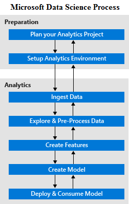

<properties 
    pageTitle="O que é o processo de ciência de dados de equipe?  | Microsoft Azure" 
    description="O processo de ciência de dados de equipe é um método sistemático para criar aplicativos inteligentes que utilizam análises avançadas." 
    services="machine-learning" 
    documentationCenter="" 
    authors="bradsev"
    manager="jhubbard" 
    editor="cgronlun" />

<tags 
    ms.service="machine-learning" 
    ms.workload="data-services" 
    ms.tgt_pltfrm="na" 
    ms.devlang="na" 
    ms.topic="article" 
    ms.date="09/19/2016" 
    ms.author="bradsev" /> 

# O que é o processo de ciência de dados (TDSP) da equipe?

O [Processo de ciência de dados da equipe (TDSP)](data-science-process-overview.md) fornece uma abordagem sistemática à compilação de aplicativos inteligentes que permite que as equipes de cientistas de dados para colaborar efetivamente sobre o ciclo de vida completo de atividades necessárias para ativar esses aplicativos em produtos. O TDSP descreve uma sequência de etapas que fornecem **orientação** sobre como definir o problema, configure as ferramentas e o ambiente necessário, analisar dados relevantes, criar modelos de previsão e avaliar implantar esses modelos em aplicativos corporativos. 

Aqui estão as etapas no **Processo de ciência de dados de equipe**:  

O processo é **iterativo**: o entendimento de novos e existentes ou ajustes no modelo evolui e requer retrabalhando etapas concluídas anteriormente na sequência. Processos de planejamento de projeto e desenvolvimento organizacional existente são **facilmente adaptados** para funcionar com a sequência definida pelo TDSP das etapas. 

As etapas no processo são diagramadas e vinculadas no [caminho de aprendizagem TDSP](https://azure.microsoft.com/documentation/learning-paths/cortana-analytics-process/) e descritas a seguir.  

## Etapas preparatórias 

## P1. Planejar o projeto de análise 

Inicie um projeto de análise, definindo seus objetivos comerciais e problemas. Eles são especificados em termos de **necessidades de negócios**. Um objetivo central desta etapa é identificar as variáveis de negócios chave (previsão de vendas ou a probabilidade de ser uma ordem fraudulenta, por exemplo) que a análise precisa prever para atender a esses requisitos. Informações adicionais sobre planejamento, em seguida, é geralmente essencial para desenvolver uma compreensão das **fontes de dados** necessários para os objetivos do projeto de endereço de uma perspectiva analítica. Não é incomum, por exemplo, para encontrar o que precisam de sistemas existentes coletar e faça logon tipos adicionais de dados para solucionar o problema e atingir os objetivos do projeto. Para obter orientação, consulte [planejar seu ambiente para o processo de ciência de dados de equipe](machine-learning-data-science-plan-your-environment.md) e [cenários para análises avançadas de aprendizado de máquina do Azure](machine-learning-data-science-plan-sample-scenarios.md).  

## P2. Ambiente de análise de configuração 

Um ambiente de análise para o processo de ciência de dados de equipe envolve vários componentes: 

- **espaços de trabalho de dados** onde os dados estão preparados para análise e modelagem, 
- uma **infraestrutura de processamento** de pré-processamento, explorar e modelagem de dados
- uma **infraestrutura de tempo de execução** para colocar em operação os modelos analíticos e executar os aplicativos cliente inteligente que consumir os modelos.  

A infraestrutura de análise que precisa ser configurado com frequência faz parte de um ambiente que é separado do sistemas operacionais centrais. Mas normalmente utiliza dados vários sistemas dentro da empresa, bem como de fontes externas para a empresa. A infraestrutura de análise pode ser puramente baseado em nuvem, ou uma instalação local ou um híbrido dos dois. Para opções, consulte [configurar ambientes de ciência de dados para uso no processo de ciência de dados de equipe](machine-learning-data-science-environment-setup.md).

## Etapas de análise:  

## 1. inclusão dados para o ambiente analítico 

A primeira etapa é trazer os dados relevantes de várias fontes, seja de dentro ou de fora da empresa, para um analítico ambientes onde os dados podem ser processados. O **formato** dos dados da fonte de pode diferir o formato exigido pelo destino. Portanto alguns transformação de dados também pode ter de ser feito pelas ferramentas de inclusão. Para opções, consulte [carregar dados em ambientes de armazenamento para análise](machine-learning-data-science-ingest-data.md)

Além da inclusão inicial dos dados, muitos aplicativos inteligentes são necessários para atualizar os dados regularmente como parte de um processo de aprendizado em andamento. Isso pode ser feito configurando um **pipeline de dados** ou o fluxo de trabalho. Forma parte da parte iterativo do processo que inclui recriação e avaliar novamente os modelos analíticos usados pelo aplicativo inteligente implantação da solução. Por exemplo, consulte [mover dados do servidor SQL no local para o SQL Azure com fábrica de dados do Azure](machine-learning-data-science-move-sql-azure-adf.md).

## 2. explorar e pré-processar dados 

A próxima etapa é obter uma compreensão mais profunda dos dados investigar suas **estatísticas de resumo** , relações e usando técnicas tais **visualização**. Isso também é onde os problemas de **qualidade de dados** e integridade, como valores ausentes, diferenças de tipo de dados e relações de dados inconsistentes, são tratados. Pré-processando transformações são usadas para limpar os dados processados antes posterior análise e modelagem podem ocorrer. Para obter uma descrição, consulte [tarefas para preparar os dados para máquina aprimorado de aprendizagem](machine-learning-data-science-prepare-data.md).

## 3. desenvolver recursos 

Cientistas de dados, em colaboração com especialistas de domínio, identifique os recursos que capturar as propriedades destaque do conjunto de dados e que melhor podem ser usadas para prever variáveis de negócios chave identificadas durante o planejamento. Esses novos recursos podem ser derivados de dados existentes ou podem exigir dados adicionais a serem coletados. Esse processo é conhecido como **engenharia de recurso** e é uma das etapas principais na criação de um sistema de análises de previsão eficazes. Esta etapa requer uma combinação criativa de experiência de domínio e a obtenção de informações obtidas na etapa de exploração de dados. Para obter orientação, consulte [recurso de engenharia do processo de ciência de dados de equipe](machine-learning-data-science-create-features.md).

## 4. criar modelos de previsão 

Cientistas dados criam modelos analíticos para prever as variáveis-chave identificadas pelos requisitos de negócios definidos no planejamento etapa usando dados que foi limpo e featurized. Sistemas de aprendizado de máquina suportam a vários **modelagem algoritmos** que são aplicáveis a uma ampla variedade de casos. Para obter orientação, consulte [como escolher algoritmos para aprendizado de máquina do Azure de equipe](machine-learning-algorithm-choice.md).

Cientistas de dados devem escolher o modelo mais apropriado para sua tarefa de previsão e não é incomum que resultados de vários modelos precisam ser combinado para obter os melhores resultados. Os dados de entrada para modelagem geralmente são divididos aleatoriamente em três partes:

- um conjunto de dados de treinamento, 
- um conjunto de dados de validação 
- um conjunto de dados de teste 

Os modelos são criados usando o **conjunto de dados de treinamento**. A combinação ideal de modelos (com parâmetros ajustados) é selecionada executando os modelos e os erros de previsão para o **conjunto de dados de validação**de medição. Finalmente, o **conjunto de dados de teste** é usado para avaliar o desempenho do modelo escolhido em dados independentes que não foi usados para treinar ou validar o modelo.  Para obter procedimentos, veja [como avaliar o desempenho de modelo no aprendizado de máquina do Azure](machine-learning-evaluate-model-performance.md).

## 5. implantar e consumir modelos 

Depois que temos um conjunto de modelos que executam bem, eles podem ser **operacionalizada** para outros aplicativos consumir. Dependendo dos requisitos de negócios, são feitas previsões em **tempo real** ou em uma base de **lote** . Para ser operacionalizada, os modelos têm sejam expostos com um **Abrir API interface** consumida facilmente de vários aplicativos tal site online, planilhas, painéis ou linha de aplicativos de negócios e back-end. Consulte [implantar um serviço da web de aprendizado de máquina do Azure](machine-learning-publish-a-machine-learning-web-service.md).

## Resumo e próximas etapas

O [Processo de ciência de dados de equipe](https://azure.microsoft.com/documentation/learning-paths/cortana-analytics-process/) é modelados como uma sequência de etapas repetidas que **orientam** sobre as tarefas necessárias para usar a análise avançada para criar um aplicativos inteligente. Cada etapa também fornece detalhes sobre como usar várias tecnologias Microsoft para concluir as tarefas descritas. 

Enquanto TDSP não estabelece tipos específicos de **documentação** artefatos, ele é uma prática recomendada para os resultados da exploração de dados, modelagem e avaliação de documentos e salvar o código pertinente para que possa a análise de iteração quando necessário. Isso também permite reutilização do trabalho analytics quando trabalhando em outros aplicativos que envolvem dados semelhantes e tarefas de previsão.

Orientações de completo ponta a ponta que demonstram todas as etapas do processo para **cenários específicos** também são fornecidas. Ver, por exemplo:

- [O processo de ciência de dados de equipe em ação: usando o SQL Server](machine-learning-data-science-process-sql-walkthrough.md)
- [o processo de ciência de dados de equipe em ação: usando clusters de HDInsight Hadoop](machine-learning-data-science-process-hive-walkthrough.md).
- [Ciência de dados usando o Spark em HD.mdnsight do Azure](machine-learning-data-science-spark-overview.md)
- [Scalable ciência de dados no Azure dados Lucerne: uma passo a passo de ponta a ponta](machine-learning-data-science-process-data-lake-walkthrough.md)

 
