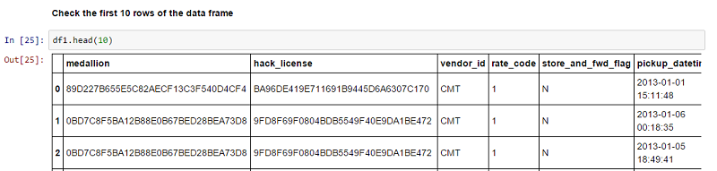
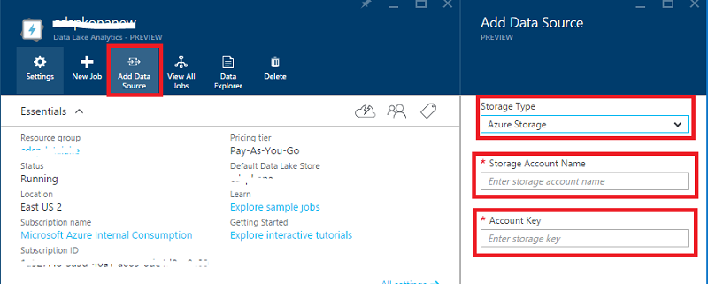
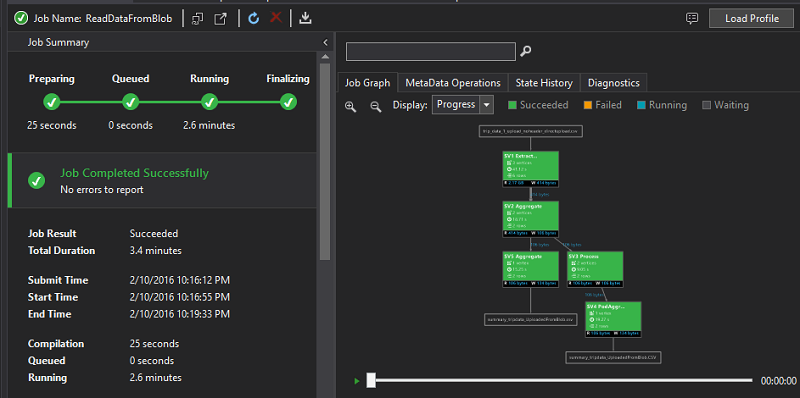
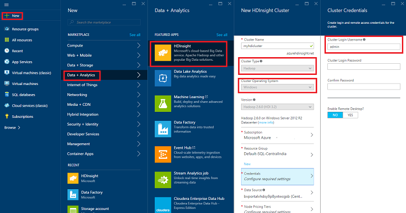

<properties
    pageTitle="Dez coisas que você pode fazer na ciência de dados Máquina Virtual | Microsoft Azure"
    description="Execute vários exploração de dados e tarefas de modelagem na ciência de dados Máquina Virtual."
    services="machine-learning"
    documentationCenter=""
    authors="bradsev"
    manager="jhubbard"
    editor="cgronlun"  />

<tags
    ms.service="machine-learning"
    ms.workload="data-services"
    ms.tgt_pltfrm="na"
    ms.devlang="na"
    ms.topic="article"
    ms.date="08/29/2016"
    ms.author="gokuma;weig;bradsev" />

# <a name="ten-things-you-can-do-on-the-data-science-virtual-machine"></a>Dez coisas que você pode fazer na ciência de dados Máquina Virtual

Na máquina Virtual de ciência de dados do Microsoft (DSVM) é um ambiente de desenvolvimento de ciência de dados poderosa que permite a você realizar várias tarefas de exploração e modelagem de dados. O ambiente já vem agrupados com diversas ferramentas de análise de dados populares que tornam mais fácil começar rapidamente com sua análise para o local, e criados implantações de nuvem ou híbrido. O DSVM trabalha junto com muitos serviços do Azure e é capaz de ler e processar dados que já estão armazenados no Azure, no depósito de dados do SQL Azure, Lucerne de dados do Azure, o armazenamento do Azure ou em DocumentDB. Ele também pode aproveitar outras ferramentas de análise como aprendizado de máquina do Azure e fábrica de dados do Azure.


Neste artigo vamos orientá-lo por meio de como usar o DSVM para realizar várias tarefas de ciência de dados e interagir com outros serviços do Azure. Aqui estão algumas coisas que você pode fazer no DSVM:

1. Explorar dados e desenvolver modelos localmente no DSVM usando o Microsoft R Server, Python
2. Usar um bloco de anotações de Jupyter para experimentar seus dados em um navegador usando Python 2, 3 Python Microsoft R uma versão de pronto empresarial do R projetado para desempenho e escalabilidade
3. Colocar em operação modelos criados usando R e Python em aprendizado de máquina do Azure para que aplicativos clientes possam acessar seus modelos usando uma interface de serviços web simples
4. Administrar seus recursos Azure usando o portal Azure ou Powershell
5. Estender o espaço de armazenamento e compartilhar conjuntos de dados em grande escala / código em sua equipe inteira, criando um armazenamento de arquivos do Azure como uma unidade montada no seu DSVM
6. Compartilhar código com sua equipe usando o Github e acessar seu repositório usando os pré-instalada gito clientes - gito Bash, interface gito gráfica.
7. Acessar várias Azure dados e análise de serviços como o armazenamento de blob do Microsoft Azure, Lucerne de dados do Azure, Azurehdinsight (Hadoop), DocumentDB do Azure, depósito de dados do SQL Azure e bancos de dados
8. Criar relatórios e painel usando o Power BI Desktop pré-instalado na DSVM e implantá-los em nuvem
9. Dimensionar dinamicamente seu DSVM para atender suas necessidades de projeto
10. Instalar ferramentas adicionais em sua máquina virtual   


>[AZURE.NOTE] Cobranças adicionais serão aplicadas para muitos dos dados adicionais de armazenamento e a análise de serviços listados neste artigo. Consulte a página de [Preços do Azure](https://azure.microsoft.com/pricing/) para obter detalhes.


**Pré-requisitos**

- Você precisará de uma assinatura do Azure. Você pode se inscrever para uma gratuito avaliação [aqui](https://azure.microsoft.com/free/).

- Instruções para provisionamento de uma máquina de Virtual de ciência de dados no portal do Azure estão disponíveis em [Criando uma máquina virtual](https://portal.azure.com/#create/microsoft-ads.standard-data-science-vmstandard-data-science-vm).

## <a name="1-explore-data-and-develop-models-using-microsoft-r-server-or-python"></a>1. explorar dados e desenvolver modelos usando Microsoft R Server ou Python

Você pode usar idiomas como R e Python fazer sua análise de dados na DSVM.

Para R, você pode usar um IDE chamado "Rotação R Enterprise 8.0" que pode ser encontrado no menu Iniciar ou a área de trabalho. Microsoft forneceu bibliotecas adicionais sobre Abrir origem/CRAN-R para habilitar scalable analytics e a capacidade de analisar dados maiores do que o tamanho de memória permitido fazendo análise blocos paralela. Você também pode instalar um IDE R de sua escolha como [RStudio](https://www.rstudio.com/products/rstudio-desktop/).

Para Python, você pode usar um IDE como Visual Studio Community Edition que tem as ferramentas de Python para extensão do Visual Studio (PTVS) pré-instalado. Por padrão, somente um 2.7 Python básica está configurado no PTVS (sem qualquer biblioteca de análise como SciKit, Pandas). Para habilitar Anaconda Python 2.7 e 3.5, você precisa fazer o seguinte:

* Criar ambientes personalizados para cada versão navegando até **Ferramentas** -> **Python ferramentas** -> **Ambientes de Python** e clicando em "**+ personalizado**" no Visual Studio 2015 comunidade Edition
* Fornecer uma descrição e definir os caminhos de prefixo ambiente como *c:\anaconda* para Anaconda Python 2.7 ou *c:\anaconda\envs\py35* para Anaconda Python 3.5
* Clique em **Detecção automática** e em seguida **Aplicar** para salvar o ambiente.

Veja o que a configuração de ambiente personalizado como fica no Visual Studio.


Consulte a [documentação de PTVS](https://github.com/Microsoft/PTVS/wiki/Selecting-and-Installing-Python-Interpreters#hey-i-already-have-an-interpreter-on-my-machine-but-ptvs-doesnt-seem-to-know-about-it) para obter detalhes adicionais sobre como criar ambientes de Python.

Agora você está configurados para criar um novo projeto de Python. Navegue até o **arquivo** -> **novo** -> **projeto** -> **Python** e selecione o tipo de aplicativo de Python que você está criando. Você pode configurar o ambiente de Python para o projeto atual para a versão desejada (Anaconda 2.7 ou 3.5): o **ambiente de Python**de atalho, selecione **Adicionar/remover Python ambientes**e, em seguida, selecione o ambiente desejado para associar o projeto. Você pode encontrar mais informações sobre como trabalhar com PTVS na página de [documentação](https://github.com/Microsoft/PTVS/wiki) do produto.

## <a name="2-using-a-jupyter-notebook-to-explore-and-model-your-data-with-python-or-r"></a>2. usando um bloco de anotações de Jupyter para explorar e modelar seus dados com Python ou R

O bloco de anotações de Jupyter é um ambiente poderoso que fornece um baseadas em navegador "IDE" para modelagem e exploração de dados. Você pode usar Python 2, 3 Python ou R (Abrir origem e o Microsoft R Server) em um bloco de anotações de Jupyter.

Para iniciar o clique de bloco de anotações de Jupyter no ícone do menu Iniciar / ícone da área de trabalho intitulado **Jupyter bloco de anotações**. Sobre o DSVM você também pode procurar "https://localhost:9999 /" para acessar o bloco de anotações de Júpiter. Se ele solicitar uma senha, use instruções fornecidas na seção ***como criar uma senha forte no servidor de bloco de anotações de Jupyter*** do tópico [provisionar o Microsoft dados ciência Virtual Machine](machine-learning-data-science-provision-vm.md) para criar uma senha forte para acessar o bloco de anotações de Jupyter. 

Depois de abrir o bloco de anotações, você verá uma pasta que contém alguns blocos de anotações de exemplo que são predefinidos para a DSVM. Agora você pode:

- Clique no bloco de anotações para ver o código.
- Execute cada célula, pressionando **SHIFT-ENTER**.
- executar o bloco de anotações inteiro clicando na **célula** -> **Executar**
- Crie um novo bloco de anotações clicando no ícone Jupyter (canto superior esquerdo) e, em seguida, clicando no botão **novo** à direita e escolhendo o idioma de bloco de anotações (também conhecido como kernels).   


>[AZURE.NOTE] Podemos suportamos Python 2.7, Python 3.5 e R. O núcleo de R oferece suporte à programação em Abrir origem R, bem como a empresa scalable Microsoft R Server.   


Quando você estiver no bloco de anotações que você pode explorar seus dados, criar o modelo, teste o modelo usando sua opção de bibliotecas.


## <a name="3-build-models-using-r-or-python-and-operationalize-them-using-azure-machine-learning"></a>3. criar modelos usando R ou Python e colocar em operação-los usando o aprendizado de máquina do Azure

Após ter criado e validados seu modelo a próxima etapa é geralmente implantá-lo em produção. Isso permite que seus aplicativos cliente invocar as previsões de modelo em um tempo real ou em uma base de modo de lote. Aprendizado de máquina Azure fornece um mecanismo para colocar em operação um modelo integrado R ou Python.

Quando você colocar em operação o modelo no aprendizado de máquina do Azure, um serviço da web é exposto que permite que clientes façam chamadas REST que passam parâmetros de entrada e receber previsões do modelo como saídas.   


>[AZURE.NOTE] Se você ainda não foram inscreverem AzureML, você pode obter um espaço de trabalho gratuito ou um espaço de trabalho padrão visitando a home page do [AzureML Studio](https://studio.azureml.net/) e clicando em "Introdução".   


### <a name="build-and-operationalize-python-models"></a>Modelos de compilação e Python colocar em operação

Aqui está um trecho de código desenvolvido em um bloco de anotações de Jupyter de Python que cria um modelo simples usando a biblioteca Saiba SciKit.

    #IRIS classification
    from sklearn import datasets
    from sklearn import svm
    clf = svm.SVC()
    iris = datasets.load_iris()
    X, y = iris.data, iris.target
    clf.fit(X, y)

O método usado para implantar seus modelos de python em aprendizado de máquina do Azure envolve a previsão do modelo em uma função e decora-lo com atributos fornecidos pela biblioteca do python de aprendizado de máquina do Azure pré-instalado que indicam sua ID de espaço de trabalho de aprendizado de máquina do Azure, chave API e a entrada e retornam parâmetros.  

    from azureml import services
    @services.publish(workspaceid, auth_token)
    @services.types(sep_l = float, sep_w = float, pet_l=float, pet_w=float)
    @services.returns(int) #0, or 1, or 2
    def predictIris(sep_l, sep_w, pet_l, pet_w):
    inputArray = [sep_l, sep_w, pet_l, pet_w]
    return clf.predict(inputArray)

Um cliente agora pode fazer chamadas para o serviço da web. Há conteúdos adicionais de conveniência que construir as solicitações de API REST. Aqui está um exemplo de código para consumir o serviço web.

    # Consume through web service URL and keys
    from azureml import services
    @services.service(url, api_key)
    @services.types(sep_l = float, sep_w = float, pet_l=float, pet_w=float)
    @services.returns(float)
    def IrisPredictor(sep_l, sep_w, pet_l, pet_w):
    pass

    IrisPredictor(3,2,3,4)


>[AZURE.NOTE] A biblioteca de aprendizado de máquina do Azure só é suportada em Python 2.7 atualmente.   


### <a name="build-and-operationalize-r-models"></a>Modelos de compilação e colocar em operação R

Você pode implantar modelos de R integrados no computador de Virtual de ciência de dados ou em outro lugar para aprendizado de máquina do Azure de maneira semelhante a como isso é feito para Python. Dela são as etapas:

- criar um arquivo de settings.json como abaixo para fornecer sua identificação de espaço de trabalho e auth token.
- Escreva uma embalagem para o modelo prever função.
- chamar ```publishWebService``` na biblioteca de aprendizado de máquina do Azure para passar a embalagem de função.  

Aqui está os procedimento e trechos de código que podem ser usados para configurar, criar, publicar e consumir um modelo como um serviço web no aprendizado de máquina do Azure.

#### <a name="setup"></a>Configuração

1.  Instale o pacote de AzureML R digitando ```install.packages("AzureML")``` em rotação R Enterprise 8.0 IDE ou seu IDE R.
2.  Baixe o RTools da [aqui](https://cran.r-project.org/bin/windows/Rtools/). É necessário o utilitário zip no caminho (e zip.exe nomeado) tornem operacional seu pacote R em AzureML.
3.  Criar um arquivo de settings.json em um diretório chamado ```.azureml``` em seu diretório inicial e digite os parâmetros de seu espaço de trabalho do Azure ML:

Settings.JSON estrutura de arquivo:

    {"workspace":{
    "id"                  : "ENTER YOUR AZUREML WORKSPACE ID",
    "authorization_token" : "ENTER YOUR AZUREML AUTH TOKEN"
    }}


#### <a name="build-a-model-in-r-and-publish-it-in-azure-ml"></a>Criar um modelo em R e publicá-lo no Azure ML

    library(AzureML)
    ws <- workspace(config="~/.azureml/settings.json")

    if(!require("lme4")) install.packages("lme4")
    library(lme4)
    set.seed(1)
    train <- sleepstudy[sample(nrow(sleepstudy), 120),]
    m <- lm(Reaction ~ Days + Subject, data = train)

    # Define a prediction function to publish based on the model:
    sleepyPredict <- function(newdata){
        predict(m, newdata=newdata)
    }

    ep <- publishWebService(ws, fun = sleepyPredict, name="sleepy lm", inputSchema = sleepstudy, data.frame=TRUE)

#### <a name="consume-the-model-deployed-in-azure-ml"></a>Consumir o modelo implantado em ML do Azure

Para consumir o modelo de um aplicativo cliente, podemos usar a biblioteca de aprendizado de máquina do Azure para pesquisar o serviço da web publicado pelo nome usando a `services` chamada de API para determinar o ponto de extremidade. Depois que você acabou de chamar o `consume` funcionar e passe o quadro de dados para previstos.
O código a seguir é usado para consumir o modelo publicado como um serviço da web de aprendizado de máquina do Azure.


    library(AzureML)
    library(lme4)
    ws <- workspace(config="~/.azureml/settings.json")

    s <-  services(ws, name = "sleepy lm")
    s <- tail(s, 1) # use the last published function, in case of duplicate function names

    ep <- endpoints(ws, s)

    # OK, try this out, and compare with raw data
    ans = consume(ep, sleepstudy)$ans

Mais informações sobre a biblioteca de R de aprendizado de máquina do Azure podem ser encontradas [aqui](https://cran.r-project.org/web/packages/AzureML/AzureML.pdf).


## <a name="4-administer-your-azure-resources-using-azure-portal-or-powershell"></a>4. administrar seus recursos Azure usando o portal Azure ou Powershell

O DSVM não apenas permite que você crie sua solução de análise localmente na máquina virtual, mas também permite que você acesse serviços em nuvem Azure da Microsoft. Azure fornece várias computação, armazenamento, serviços de análise de dados e outros serviços que você pode administrar e acessar do seu DSVM.

Para administrar seus recursos de assinatura e nuvem Azure, você pode usar seu navegador e aponte para o [portal do Azure](https://portal.azure.com). Você também pode usar o Powershell do Azure para administrar sua assinatura do Azure e recursos através de um script.
Você pode executar o Azure Powershell de um atalho na área de trabalho ou no menu Iniciar intitulado "Microsoft Azure Powershell". Consulte a [documentação do Microsoft Azure Powershell](../powershell-azure-resource-manager.md) para obter mais informações sobre como você pode administrar sua assinatura do Azure e recursos usando scripts do Windows Powershell.


## <a name="5-extend-your-storage-space-with-a-shared-file-system"></a>5. estender o espaço de armazenamento com um sistema de arquivos compartilhados

Cientistas de dados podem compartilhar grandes conjuntos de dados, código ou outros recursos dentro da equipe. O DSVM em si tem aproximadamente 70GB de espaço disponível. Para estender seu armazenamento, você pode usar o serviço de arquivo do Azure e um monte-la na DSVM ou acessá-la por meio de uma API REST.   


>[AZURE.NOTE] O espaço máximo do compartilhamento do serviço de arquivo do Azure é 5TB e limite de tamanho de arquivo individual é 1TB.   


Você pode usar o Powershell do Azure para criar um compartilhamento de serviço de arquivo do Azure. Aqui está o script para executar em PowerShell do Azure para criar um compartilhamento de serviço de arquivo do Azure.

    # Authenticate to Azure.
    Login-AzureRmAccount
    # Select your subscription
    Get-AzureRmSubscription –SubscriptionName "<your subscription name>" | Select-AzureRmSubscription
    # Create a new resource group.
    New-AzureRmResourceGroup -Name <dsvmdatarg>
    # Create a new storage account. You can reuse existing storage account if you wish.
    New-AzureRmStorageAccount -Name <mydatadisk> -ResourceGroupName <dsvmdatarg> -Location "<Azure Data Center Name For eg. South Central US>" -Type "Standard_LRS"
    # Set your current working storage account
    Set-AzureRmCurrentStorageAccount –ResourceGroupName "<dsvmdatarg>" –StorageAccountName <mydatadisk>

    # Create a Azure File Service Share
    $s = New-AzureStorageShare <<teamsharename>>
    # Create a directory under the FIle share. You can give it any name
    New-AzureStorageDirectory -Share $s -Path <directory name>
    # List the share to confirm that everything worked
    Get-AzureStorageFile -Share $s


Agora que você criou um compartilhamento de arquivo Azure, você pode montá-lo em qualquer máquina virtual no Azure. É altamente recomendável que a máquina virtual está no mesmo Azure data center como a conta de armazenamento para evitar encargos de transferência de latência e de dados. Aqui estão os comandos para montar a unidade na DSVM que você pode executar no Azure Powershell.


    # Get storage key of the storage account that has the Azure file share from Azure portal. Store it securely on the VM to avoid prompted in next command.
    cmdkey /add:<<mydatadisk>>.file.core.windows.net /user:<<mydatadisk>> /pass:<storage key>

    # Mount the Azure file share as Z: drive on the VM. You can chose another drive letter if you wish
    net use z:  \\<mydatadisk>.file.core.windows.net\<<teamsharename>>


Agora você pode acessar essa unidade como faria com qualquer unidade normal a máquina virtual.

## <a name="6-share-code-with-your-team-using-github"></a>6. compartilhar código com sua equipe usando o Github

GitHub é um repositório de código onde você pode encontrar muitas amostras de código e fontes para ferramentas diferentes usando várias tecnologias compartilhadas por comunidade do desenvolvedor. Ele usa gito como a tecnologia para controlar e armazenar versões dos arquivos de código. GitHub também é uma plataforma o onde você pode criar seu próprio repositório para armazenar código compartilhado e a documentação da sua equipe, implementar o controle de versão e também controlar quem tem acesso à visualizar e contribuir com código. Visite o do [Github ajudar páginas](https://help.github.com/) para obter mais informações sobre como usar gito. Você pode usar o Github como das maneiras para colaborar com sua equipe, use o código desenvolvido pela comunidade e contribuir código de volta para a comunidade.

O DSVM já vem carregado com ferramentas de cliente em ambas as linha de comando como interface gráfica bem acessem Github repositório. A ferramenta de linha de comando para trabalhar com gito e Github é chamada gito Bash. Visual Studio instalado no DSVM tem as extensões de gito. Você pode encontrar ícones de inicialização para essas ferramentas no menu Iniciar e a área de trabalho.

Para baixar o código de um repositório de Github você usará o ```git clone``` comando. Por exemplo para fazer o download de repositório de ciência de dados publicado pela Microsoft no diretório atual você pode executar o comando a seguir quando você estiver na ```git-bash```.

    git clone https://github.com/Azure/Azure-MachineLearning-DataScience.git

No Visual Studio, você pode fazer a mesma operação de clonagem. A captura de tela abaixo mostra como acessar ferramentas gito e Github no Visual Studio.


Você pode encontrar mais informações sobre como usar gito para trabalhar com seu repositório Github de vários recursos disponíveis em github.com. O [roteiro](https://training.github.com/kit/downloads/github-git-cheat-sheet.pdf) é uma referência útil.


## <a name="7-access-various-azure-data-and-analytics-services"></a>7. acessar vários serviços de dados e análise Azure

### <a name="azure-blob"></a>Blob do Microsoft Azure

Azure blob é um armazenamento em nuvem confiável e econômico para dados grandes e pequenos. Vejamos como você pode mover dados do Azure Blob e acessar dados armazenados em um Blob do Azure.

**Pré-requisito**

- **Crie sua conta de armazenamento de Blob do Azure do [Azure portal](https://portal.azure.com).**


- Confirme que a ferramenta de AzCopy de linha de comando pré-instalada foi encontrada em ```C:\Program Files (x86)\Microsoft SDKs\Azure\AzCopy\azcopy.exe```. Você pode adicionar a pasta que contém o azcopy.exe à sua variável de ambiente PATH para evitar digitar o caminho completo de comando ao executar esta ferramenta. Para obter mais informações sobre a ferramenta de AzCopy, consulte a [documentação de AzCopy](../storage/storage-use-azcopy.md)

- Inicie a ferramenta de Gerenciador de armazenamento do Azure. Ela pode ser baixada do [Microsoft Azure Storage Explorer](http://storageexplorer.com/). 


**Mover dados de máquina virtual para Azure Blob: AzCopy**

Para mover dados entre os arquivos locais e o armazenamento de blob, você pode usar AzCopy na linha de comando ou PowerShell:

    AzCopy /Source:C:\myfolder /Dest:https://<mystorageaccount>.blob.core.windows.net/<mycontainer> /DestKey:<storage account key> /Pattern:abc.txt

Substitua **C:\myfolder** para o caminho onde o arquivo está armazenado, **mystorageaccount** para seu nome de conta de armazenamento de blob, **mycontainer** para o nome do contêiner, **chave da conta de armazenamento** para sua chave de acesso do armazenamento de blob. Você pode encontrar suas credenciais de conta de armazenamento no [portal do Azure](https://portal.azure.com).


Execute o comando de AzCopy do PowerShell ou de um prompt de comando. Veja aqui alguns exemplo de uso do comando AzCopy:


    # Copy *.sql from local machine to a Azure Blob
    "C:\Program Files (x86)\Microsoft SDKs\Azure\AzCopy\azcopy" /Source:"c:\Aaqs\Data Science Scripts" /Dest:https://[ENTER STORAGE ACCOUNT].blob.core.windows.net/[ENTER CONTAINER] /DestKey:[ENTER STORAGE KEY] /S /Pattern:*.sql

    # Copy back all files from Azure Blob container to Local machine

    "C:\Program Files (x86)\Microsoft SDKs\Azure\AzCopy\azcopy" /Dest:"c:\Aaqs\Data Science Scripts\temp" /Source:https://[ENTER STORAGE ACCOUNT].blob.core.windows.net/[ENTER CONTAINER] /SourceKey:[ENTER STORAGE KEY] /S


Depois de executar o comando AzCopy para copiar para um blob Azure você ver suas apresentações de arquivo para cima no Explorador de armazenamento do Azure em breve.


**Mover dados de máquina virtual para Azure Blob: Gerenciador de armazenamento do Azure**

Você também pode carregar dados do arquivo local em sua máquina virtual usando o Gerenciador de armazenamento do Azure:

- Para carregar dados em um contêiner, selecione o contêiner de destino e clique no botão **carregar** .
- Clique em **…** à direita da caixa de **arquivos** , selecione um ou vários arquivos para carregar do sistema de arquivos e clique em **carregar** para começar a carregar os arquivos.


**Ler dados do Azure Blob: módulo de leitor AML**

No Azure Studio de aprendizado de máquina, você pode usar um **módulo de importar dados** para ler dados do seu blob.


**Ler dados do Azure Blob: Python ODBC**

Você pode usar a biblioteca de **BlobService** para ler dados diretamente do blob em um programa de bloco de anotações de Jupyter ou Python.

Primeiro, importe pacotes necessários:

    import pandas as pd
    from pandas import Series, DataFrame
    import numpy as np
    import matplotlib.pyplot as plt
    from time import time
    import pyodbc
    import os
    from azure.storage.blob import BlobService
    import tables
    import time
    import zipfile
    import random

Em seguida, conecte-se suas credenciais de conta do Azure Blob e ler dados do Blob:

    CONTAINERNAME = 'xxx'
    STORAGEACCOUNTNAME = 'xxxx'
    STORAGEACCOUNTKEY = 'xxxxxxxxxxxxxxxx'
    BLOBNAME = 'nyctaxidataset/nyctaxitrip/trip_data_1.csv'
    localfilename = 'trip_data_1.csv'
    LOCALDIRECTORY = os.getcwd()
    LOCALFILE =  os.path.join(LOCALDIRECTORY, localfilename)

    #download from blob
    t1 = time.time()
    blob_service = BlobService(account_name=STORAGEACCOUNTNAME,account_key=STORAGEACCOUNTKEY)
    blob_service.get_blob_to_path(CONTAINERNAME,BLOBNAME,LOCALFILE)
    t2 = time.time()
    print(("It takes %s seconds to download "+BLOBNAME) % (t2 - t1))

    #unzipping downloaded files if needed
    #with zipfile.ZipFile(ZIPPEDLOCALFILE, "r") as z:
    #    z.extractall(LOCALDIRECTORY)

    df1 = pd.read_csv(LOCALFILE, header=0)
    df1.columns = ['medallion','hack_license','vendor_id','rate_code','store_and_fwd_flag','pickup_datetime','dropoff_datetime','passenger_count','trip_time_in_secs','trip_distance','pickup_longitude','pickup_latitude','dropoff_longitude','dropoff_latitude']
    print 'the size of the data is: %d rows and  %d columns' % df1.shape

Os dados são lidos em como um quadro de dados:




### <a name="azure-data-lake"></a>Lucerne de dados do Azure

Armazenamento do Azure dados Lucerne é um repositório de hyper escala para cargas de trabalho de análise de dados grande e compatível com o arquivo do Hadoop distribuído com o sistema (HDFS). Ele funciona com o ecossistema Hadoop e a análise de Lucerne de dados do Azure. Vamos mostrar como você pode mover dados para o armazenamento de Lucerne de dados do Azure e executar análise usando análise de Lucerne de dados do Azure.

**Pré-requisito**

- Crie sua análise de Lucerne de dados do Azure no [portal do Azure](https://portal.azure.com).


- As **Ferramentas de Lucerne de dados do Azure** no **Visual Studio** encontrada neste [link](https://www.microsoft.com/download/details.aspx?id=49504) já está instalado no Visual Studio comunidade Edition que está na máquina virtual. Após iniciar o Visual Studio e fazer logon em sua assinatura do Azure, você verá sua conta de análise de dados do Azure e armazenamento no painel esquerdo do Visual Studio.


**Mover dados de máquina virtual para dados Lucerne: Azure dados Lucerne Explorer**

Você pode usar o **Explorador de Lucerne de dados do Azure** para carregar dados dos arquivos locais na máquina Virtual ao armazenamento de dados Lucerne.


Você também pode criar um pipeline de dados para productionize o movimento de dados de ou Lucerne de dados do Azure usando o [Factory(ADF) de dados do Azure](https://azure.microsoft.com/services/data-factory/). Podemos você consulte este [artigo](https://azure.microsoft.com/blog/creating-big-data-pipelines-using-azure-data-lake-and-azure-data-factory/) para orientá-lo pelas etapas para criar o pipeline de dados.

**Leia os dados do Azure Blob para dados Lucerne: U-SQL**

Se os dados residem no armazenamento de Blob do Azure, você pode ler diretamente dados do blob de armazenamento do Azure na consulta U-SQL. Antes de redigir sua consulta U-SQL, verifique se que sua conta de armazenamento de blob está vinculada ao seu Lucerne de dados do Azure. Acesse o **portal do Azure**, encontrar seu painel de análise de Lucerne de dados do Azure, clique em **Adicionar fonte de dados**, selecione o tipo de armazenamento ao **Armazenamento do Azure** e conecte-se em seu nome de conta de armazenamento do Azure e chave. Em seguida, você poderá fazer referência os dados armazenados na conta de armazenamento.




No Visual Studio, você pode ler os dados do armazenamento de blob, fazer algumas manipulação de dados, engenharia de recursos e os dados resultantes Lucerne de dados do Azure ou armazenamento de Blob do Azure de saída. Quando você fazer referência aos dados no armazenamento de blob, use **wasb: / /**; Quando você faz referência os dados em Lucerne de dados do Azure, use **swbhdfs: / /**


Você pode usar as consultas de U-SQL a seguir no Visual Studio:

    @a =
        EXTRACT medallion string,
                hack_license string,
                vendor_id string,
                rate_code string,
                store_and_fwd_flag string,
                pickup_datetime string,
                dropoff_datetime string,
                passenger_count int,
                trip_time_in_secs double,
                trip_distance double,
                pickup_longitude string,
                pickup_latitude string,
                dropoff_longitude string,
                dropoff_latitude string

        FROM "wasb://<Container name>@<Azure Blob Storage Account Name>.blob.core.windows.net/<Input Data File Name>"
        USING Extractors.Csv();

    @b =
        SELECT vendor_id,
        COUNT(medallion) AS cnt_medallion,
        SUM(passenger_count) AS cnt_passenger,
        AVG(trip_distance) AS avg_trip_dist,
        MIN(trip_distance) AS min_trip_dist,
        MAX(trip_distance) AS max_trip_dist,
        AVG(trip_time_in_secs) AS avg_trip_time
        FROM @a
        GROUP BY vendor_id;

    OUTPUT @b   
    TO "swebhdfs://<Azure Data Lake Storage Account Name>.azuredatalakestore.net/<Folder Name>/<Output Data File Name>"
    USING Outputters.Csv();

    OUTPUT @b   
    TO "wasb://<Container name>@<Azure Blob Storage Account Name>.blob.core.windows.net/<Output Data File Name>"
    USING Outputters.Csv();


Depois que sua consulta é enviada para o servidor, um diagrama que mostra o status do seu trabalho será exibido.




**Consulta de dados no Lucerne de dados: U-SQL**

Depois que o conjunto de dados é incluído em Lucerne de dados do Azure, você pode usar [linguagem U-SQL](../data-lake-analytics/data-lake-analytics-u-sql-get-started.md) para consultar e explorar os dados. Linguagem SQL U é semelhante ao T-SQL, mas combina alguns recursos do c# para que os usuários podem gravar módulos personalizados, funções definidas pelo usuário e etc. Você pode usar os scripts na etapa anterior.

Após a consulta é enviada ao servidor, tripdata_summary. CSV pode ser encontrado em breve **Azure dados Lucerne Explorer**, você pode visualizar os dados por com o botão direito no arquivo.


Para ver as informações do arquivo:


### <a name="hdinsight-hadoop-clusters"></a>HDInsight Hadoop Clusters

Azure HDInsight é um serviço gerenciado Apache Hadoop, Spark, HBase e tempestade na nuvem. Você pode trabalhar facilmente com clusters Azurehdinsight na máquina virtual dados ciência.

**Pré-requisito**

- Crie sua conta de armazenamento de Blob do Azure do [Azure portal](https://portal.azure.com). Esta conta de armazenamento é usada para armazenar dados de HDInsight clusters.


- Personalizar o Azure HDInsight Hadoop Clusters do [portal do Azure](machine-learning-data-science-customize-hadoop-cluster.md)

  - Você deve vincular a conta de armazenamento criada com seu cluster HDInsight quando ele é criado. Essa conta de armazenamento é usada para acessar os dados que podem ser processados dentro do cluster.



  - Você deve habilitar o **Acesso remoto** para o nó principal do cluster após sua criação. Lembrar as credenciais de acesso remoto que você especificar aqui (diferente daqueles especificado para o cluster em sua criação): você precisará deles abaixo.


  - Crie um espaço de trabalho do Azure ML. Suas experiências de aprendizado de máquina serão armazenadas neste espaço de trabalho ML. Selecione as opções realçadas no Portal conforme mostrado na captura de tela abaixo.


  - Insira os parâmetros para seu espaço de trabalho do Azure ML


  - Carregar dados usando o bloco de anotações de IPython. Importe primeiro os pacotes necessários, conecte-se credenciais, criar um banco de dados em sua conta de armazenamento e carregar dados HDI clusters.


        #Import required Packages
        import pyodbc
        import time as time
        import json
        import os
        import urllib
        import urllib2
        import warnings
        import re
        import pandas as pd
        import matplotlib.pyplot as plt
        from azure.storage.blob import BlobService
        warnings.filterwarnings("ignore", category=UserWarning, module='urllib2')


        #Create the connection to Hive using ODBC
        SERVER_NAME='xxx.azurehdinsight.net'
        DATABASE_NAME='nyctaxidb'
        USERID='xxx'
        PASSWORD='xxxx'
        DB_DRIVER='Microsoft Hive ODBC Driver'
        driver = 'DRIVER={' + DB_DRIVER + '}'
        server = 'Host=' + SERVER_NAME + ';Port=443'
        database = 'Schema=' + DATABASE_NAME
        hiveserv = 'HiveServerType=2'
        auth = 'AuthMech=6'
        uid = 'UID=' + USERID
        pwd = 'PWD=' + PASSWORD
        CONNECTION_STRING = ';'.join([driver,server,database,hiveserv,auth,uid,pwd])
        connection = pyodbc.connect(CONNECTION_STRING, autocommit=True)
        cursor=connection.cursor()


        #Create Hive database and tables
        queryString = "create database if not exists nyctaxidb;"
        cursor.execute(queryString)

        queryString = """
                        create external table if not exists nyctaxidb.trip
                        (
                            medallion string,
                            hack_license string,
                            vendor_id string,
                            rate_code string,
                            store_and_fwd_flag string,
                            pickup_datetime string,
                            dropoff_datetime string,
                            passenger_count int,
                            trip_time_in_secs double,
                            trip_distance double,
                            pickup_longitude double,
                            pickup_latitude double,
                            dropoff_longitude double,
                            dropoff_latitude double)  
                        PARTITIONED BY (month int)
                        ROW FORMAT DELIMITED FIELDS TERMINATED BY ',' lines terminated by '\\n'
                        STORED AS TEXTFILE LOCATION 'wasb:///nyctaxidbdata/trip' TBLPROPERTIES('skip.header.line.count'='1');
                    """
        cursor.execute(queryString)

        queryString = """
                        create external table if not exists nyctaxidb.fare
                        (
                            medallion string,
                            hack_license string,
                            vendor_id string,
                            pickup_datetime string,
                            payment_type string,
                            fare_amount double,
                            surcharge double,
                            mta_tax double,
                            tip_amount double,
                            tolls_amount double,
                            total_amount double)
                        PARTITIONED BY (month int)
                        ROW FORMAT DELIMITED FIELDS TERMINATED BY ',' lines terminated by '\\n'
                        STORED AS TEXTFILE LOCATION 'wasb:///nyctaxidbdata/fare' TBLPROPERTIES('skip.header.line.count'='1');
                    """
        cursor.execute(queryString)


        #Upload data from blob storage to HDI cluster
        for i in range(1,13):
            queryString = "LOAD DATA INPATH 'wasb:///nyctaxitripraw2/trip_data_%d.csv' INTO TABLE nyctaxidb2.trip PARTITION (month=%d);"%(i,i)
            cursor.execute(queryString)
            queryString = "LOAD DATA INPATH 'wasb:///nyctaxifareraw2/trip_fare_%d.csv' INTO TABLE nyctaxidb2.fare PARTITION (month=%d);"%(i,i)  
            cursor.execute(queryString)


- Como alternativa, você pode seguir este [passo a passo](machine-learning-data-science-process-hive-walkthrough.md) para carregar dados NYC táxi cluster HDI. Etapas principais incluem:

    - AzCopy: baixar do CSV compactado do blob pública para sua pasta local
    - AzCopy: carregar descompactado CSV da pasta local para cluster HDI
    - Faça logon em nó principal do cluster Hadoop e preparar para análise de dados exploratório

Depois que os dados são carregados para cluster HDI, você pode verificar seus dados no Gerenciador de armazenamento do Azure. E você tem uma nyctaxidb de banco de dados criado em cluster HDI.


**Exploração de dados: consultas de seção em Python**

Como os dados estão em cluster Hadoop, você pode usar o pacote de pyodbc para se conectar ao Hadoop Clusters e consulta de banco de dados usando seção fazer exploração e engenharia de recursos. Você pode exibir as tabelas existentes que criamos na etapa pré-requisito.

    queryString = """
        show tables in nyctaxidb2;
        """
    pd.read_sql(queryString,connection)


Vamos examinar o número de registros em cada mês e as frequências das Oblíquo ou não na tabela viagem:

    queryString = """
        select month, count(*) from nyctaxidb.trip group by month;
        """
    results = pd.read_sql(queryString,connection)

    %matplotlib inline

    results.columns = ['month', 'trip_count']
    df = results.copy()
    df.index = df['month']
    df['trip_count'].plot(kind='bar')


    queryString = """
        SELECT tipped, COUNT(*) AS tip_freq
        FROM
        (
            SELECT if(tip_amount > 0, 1, 0) as tipped, tip_amount
            FROM nyctaxidb.fare
        )tc
        GROUP BY tipped;
        """
    results = pd.read_sql(queryString,connection)

    results.columns = ['tipped', 'trip_count']
    df = results.copy()
    df.index = df['tipped']
    df['trip_count'].plot(kind='bar')


Podemos também calcular a distância entre o local de retirada e redução local e, em seguida, compará-lo com a distância de viagem.

    queryString = """
                    select pickup_longitude, pickup_latitude, dropoff_longitude, dropoff_latitude, trip_distance, trip_time_in_secs,
                        3959*2*2*atan((1-sqrt(1-pow(sin((dropoff_latitude-pickup_latitude)
                        *radians(180)/180/2),2)-cos(pickup_latitude*radians(180)/180)
                        *cos(dropoff_latitude*radians(180)/180)*pow(sin((dropoff_longitude-pickup_longitude)*radians(180)/180/2),2)))
                        /sqrt(pow(sin((dropoff_latitude-pickup_latitude)*radians(180)/180/2),2)
                        +cos(pickup_latitude*radians(180)/180)*cos(dropoff_latitude*radians(180)/180)*
                        pow(sin((dropoff_longitude-pickup_longitude)*radians(180)/180/2),2))) as direct_distance
                        from nyctaxidb.trip
                        where month=1
                            and pickup_longitude between -90 and -30
                            and pickup_latitude between 30 and 90
                            and dropoff_longitude between -90 and -30
                            and dropoff_latitude between 30 and 90;
                """
    results = pd.read_sql(queryString,connection)
    results.head(5)


    results.columns = ['pickup_longitude', 'pickup_latitude', 'dropoff_longitude',
                       'dropoff_latitude', 'trip_distance', 'trip_time_in_secs', 'direct_distance']
    df = results.loc[results['trip_distance']<=100] #remove outliers
    df = df.loc[df['direct_distance']<=100] #remove outliers
    plt.scatter(df['direct_distance'], df['trip_distance'])


Agora vamos preparar um conjunto de (% 1) para baixo de amostra de dados para modelagem. Podemos usar esses dados no módulo de leitor AML.


        queryString = """
        create  table if not exists nyctaxi_downsampled_dataset_testNEW (
        medallion string,
        hack_license string,
        vendor_id string,
        rate_code string,
        store_and_fwd_flag string,
        pickup_datetime string,
        dropoff_datetime string,
        pickup_hour string,
        pickup_week string,
        weekday string,
        passenger_count int,
        trip_time_in_secs double,
        trip_distance double,
        pickup_longitude double,
        pickup_latitude double,
        dropoff_longitude double,
        dropoff_latitude double,
        direct_distance double,
        payment_type string,
        fare_amount double,
        surcharge double,
        mta_tax double,
        tip_amount double,
        tolls_amount double,
        total_amount double,
        tipped string,
        tip_class string
        )
        row format delimited fields terminated by ','
        lines terminated by '\\n'
        stored as textfile;
        """
        cursor.execute(queryString)

        --- now insert contents of the join into the above internal table

        queryString = """
        insert overwrite table nyctaxi_downsampled_dataset_testNEW
        select
        t.medallion,
        t.hack_license,
        t.vendor_id,
        t.rate_code,
        t.store_and_fwd_flag,
        t.pickup_datetime,
        t.dropoff_datetime,
        hour(t.pickup_datetime) as pickup_hour,
        weekofyear(t.pickup_datetime) as pickup_week,
        from_unixtime(unix_timestamp(t.pickup_datetime, 'yyyy-MM-dd HH:mm:ss'),'u') as weekday,
        t.passenger_count,
        t.trip_time_in_secs,
        t.trip_distance,
        t.pickup_longitude,
        t.pickup_latitude,
        t.dropoff_longitude,
        t.dropoff_latitude,
        t.direct_distance,
        f.payment_type,
        f.fare_amount,
        f.surcharge,
        f.mta_tax,
        f.tip_amount,
        f.tolls_amount,
        f.total_amount,
        if(tip_amount>0,1,0) as tipped,
        if(tip_amount=0,0,
        if(tip_amount>0 and tip_amount<=5,1,
        if(tip_amount>5 and tip_amount<=10,2,
        if(tip_amount>10 and tip_amount<=20,3,4)))) as tip_class
        from
        (
        select
        medallion,
        hack_license,
        vendor_id,
        rate_code,
        store_and_fwd_flag,
        pickup_datetime,
        dropoff_datetime,
        passenger_count,
        trip_time_in_secs,
        trip_distance,
        pickup_longitude,
        pickup_latitude,
        dropoff_longitude,
        dropoff_latitude,
        3959*2*2*atan((1-sqrt(1-pow(sin((dropoff_latitude-pickup_latitude)
        radians(180)/180/2),2)-cos(pickup_latitude*radians(180)/180)
        *cos(dropoff_latitude*radians(180)/180)*pow(sin((dropoff_longitude-pickup_longitude)*radians(180)/180/2),2)))
        /sqrt(pow(sin((dropoff_latitude-pickup_latitude)*radians(180)/180/2),2)
        +cos(pickup_latitude*radians(180)/180)*cos(dropoff_latitude*radians(180)/180)*pow(sin((dropoff_longitude-pickup_longitude)*radians(180)/180/2),2))) as direct_distance,
        rand() as sample_key

        from trip
        where pickup_latitude between 30 and 90
            and pickup_longitude between -90 and -30
            and dropoff_latitude between 30 and 90
            and dropoff_longitude between -90 and -30
        )t
        join
        (
        select
        medallion,
        hack_license,
        vendor_id,
        pickup_datetime,
        payment_type,
        fare_amount,
        surcharge,
        mta_tax,
        tip_amount,
        tolls_amount,
        total_amount
        from fare
        )f
        on t.medallion=f.medallion and t.hack_license=f.hack_license and t.pickup_datetime=f.pickup_datetime
        where t.sample_key<=0.01
        """
        cursor.execute(queryString)

Após alguns instantes, você pode ver que os dados foram carregados em clusters de Hadoop:

    queryString = """
        select * from nyctaxi_downsampled_dataset limit 10;
        """
    cursor.execute(queryString)
    pd.read_sql(queryString,connection)


**Ler dados de HDI usando AML: módulo de leitor**

Você também pode usar o módulo do **leitor** no studio AML acessem o banco de dados em cluster Hadoop. Conecte as credenciais HDI clusters e conta de armazenamento do Azure e você poderá criar modelos de aprendizado de máquina usando o banco de dados em clusters HDI.


O conjunto de dados scored pode ser exibido:


### <a name="azure-sql-data-warehouse--databases"></a>Azure SQL Data Warehouse & bancos de dados

Depósito de dados SQL Azure é um depósito de dados elástica como um serviço com experiência em SQL Server corporativo.

Você pode provisionar seu depósito de dados do SQL Azure, seguindo as instruções fornecidas neste [artigo](../sql-data-warehouse/sql-data-warehouse-get-started-provision.md). Depois que você provisionar seu depósito de dados do SQL Azure, você pode usar essa [explicação passo a passo](machine-learning-data-science-process-sqldw-walkthrough.md) para fazer o upload de dados, exploração e modelagem usando dados no depósito de dados SQL.

#### <a name="azure-documentdb"></a>DocumentDB Azure

DocumentDB Azure é um banco de dados NoSQL na nuvem. Ele permite que você trabalhe com documentos como JSON e permite armazenar e os documentos de consulta.

Você precisa fazer as seguintes etapas por requisitos para acessar DocumentDB a partir do DSVM.

1. Instalar o SDK do Python DocumentDB (executar ```pip install pydocumentdb``` de prompt de comando)
1. Criar conta de DocumentDB e banco de dados do banco de dados de documento do [portal do Azure](https://portal.azure.com)
1. Baixe "Ferramenta de migração de DocumentDB" do [aqui](http://www.microsoft.com/downloads/details.aspx?FamilyID=cda7703a-2774-4c07-adcc-ad02ddc1a44d) e extrair para um diretório de sua escolha
1. Importar dados JSON (vulcões dados) armazenados em um [blob pública](https://cahandson.blob.core.windows.net/samples/volcano.json) em DocumentDB com a seguinte parâmetros de comando para a ferramenta de migração (dtui.exe do diretório onde você instalou a ferramenta de migração de DocumentDB). Insira a origem e destino parâmetros de local abaixo.

    /s:JsonFile /s.Files:https://cahandson.blob.core.windows.net/samples/volcano.json /t:DocumentDBBulk /t.ConnectionString:AccountEndpoint=https://[DocDBAccountName].documents.azure.com:443/; AccountKey = [[chave]; banco de dados = vulcões /t.Collection:volcano1

Depois de importar os dados, você pode ir para Jupyter e abrir o bloco de anotações chamado *DocumentDBSample* que contém o código do python para acessar DocumentDB e fazer algumas consultando básica. Você pode saber mais sobre DocumentDB visitando a [página de documentação](https://azure.microsoft.com/documentation/learning-paths/documentdb/) do serviço


## <a name="8-build-reports-and-dashboard-using-the-power-bi-desktop"></a>8. construir relatórios e painéis usando a área de trabalho do Power BI

Vamos visualize o arquivo vulcões JSON visto no exemplo acima DocumentDB no Power BI para obter ideias visual para os dados. As etapas detalhadas estão disponíveis no [artigo de Power BI](../documentdb/documentdb-powerbi-visualize.md). As etapas de alto níveis são abaixo:

1. Abra o Power BI Desktop e siga "Obter dados". Especifique a URL como: https://cahandson.blob.core.windows.net/samples/volcano.json
2. Você deve ver os registros JSON importados como uma lista
3. Converter a lista em uma tabela para que PowerBI possa trabalhar com a mesma
4. Expanda as colunas clicando no ícone de expansão (aquele com o ícone "seta para a esquerda e uma seta para a direita" à direita da coluna)
5. Observe que o local é um campo de "Registro". Expanda o registro e selecione somente as coordenadas. Coordenadas é uma coluna de lista
6. Adicionar uma nova coluna para converter a coluna coordenadas da lista em uma coluna de LatLong separada por vírgula concatenando os dois elementos no campo lista coordenadas usando a fórmula ```Text.From([coordinates]{1})&","&Text.From([coordinates]{0})```.
7. Finalmente converter o ```Elevation``` coluna para decimais e selecione a **Aplicar**e **Fechar** .

Em vez de etapas acima, você pode colar o seguinte código que scripts out as etapas acima no Editor Avançado no PowerBI que permite que você escrever as transformações de dados em uma linguagem de consulta.


    let
        Source = Json.Document(Web.Contents("https://cahandson.blob.core.windows.net/samples/volcano.json")),
        #"Converted to Table" = Table.FromList(Source, Splitter.SplitByNothing(), null, null, ExtraValues.Error),
        #"Expanded Column1" = Table.ExpandRecordColumn(#"Converted to Table", "Column1", {"Volcano Name", "Country", "Region", "Location", "Elevation", "Type", "Status", "Last Known Eruption", "id"}, {"Volcano Name", "Country", "Region", "Location", "Elevation", "Type", "Status", "Last Known Eruption", "id"}),
        #"Expanded Location" = Table.ExpandRecordColumn(#"Expanded Column1", "Location", {"coordinates"}, {"coordinates"}),
        #"Added Custom" = Table.AddColumn(#"Expanded Location", "LatLong", each Text.From([coordinates]{1})&","&Text.From([coordinates]{0})),
        #"Changed Type" = Table.TransformColumnTypes(#"Added Custom",{{"Elevation", type number}})
    in
        #"Changed Type"


Agora você tem os dados no seu modelo de dados do Power BI. Sua área de trabalho do Power BI deve parecer conforme mostrado abaixo.


Você pode começar a criar relatórios e visualizações usando o modelo de dados. Você pode seguir as etapas neste [artigo de Power BI](../documentdb/documentdb-powerbi-visualize.md#build-the-reports) para criar um relatório. O resultado final será um relatório que se parece com o seguinte.


## <a name="9-dynamically-scale-your-dsvm-to-meet-your-project-needs"></a>9. dinamicamente dimensionar seu DSVM para atender suas necessidades de projeto

Você pode dimensionar para o DSVM para atender às suas necessidades de projeto. Se você não precisar usar a máquina virtual na noite ou fins de semana, você pode desligar apenas a máquina virtual do [portal do Azure](https://portal.azure.com).

>[AZURE.NOTE]  Você precisará pagar encargos de computação se você usar apenas no botão Desligar do sistema operacional na máquina virtual.  

Se você precisar manipular algumas análises de grande escala e precisar de mais capacidade de CPU e/ou memória e/ou disco que você pode encontrar uma grande variedade de tamanhos de máquina virtual em termos de CPU cores, capacidade de memória e tipos de disco (incluindo unidades de estado sólido) que atenda às suas necessidades orçamentárias e computação. A lista completa de VMs juntamente com seu por hora calcular preços estão disponível na página de [Preços de máquinas virtuais do Azure](https://azure.microsoft.com/pricing/details/virtual-machines/) .

Da mesma forma, se a sua necessidade de capacidade de processamento de máquina virtual reduz (por exemplo: você moveu uma carga de trabalho principal para um Hadoop ou um cluster de Spark), você pode dimensionar o cluster do [portal do Azure](https://portal.azure.com) e indo para as configurações da sua instância de máquina virtual. Aqui está uma captura de tela.


## <a name="10-install-additional-tools-on-your-virtual-machine"></a>10. instalar ferramentas adicionais em sua máquina virtual

Podemos empacotar várias ferramentas que estamos acreditar que poderão resolver muitos dos dados comuns necessidades de análise e o que devo tempo por evitar ter de instalar e configurar os ambientes um por vez e você economizar dinheiro pagando somente para os recursos que você usar.

Você pode aproveitar outros serviços de dados e análise Azure descritos neste artigo Aprimore seu ambiente de análise. Entendemos que, em alguns casos às suas necessidades podem exigir ferramentas adicionais, incluindo algumas ferramentas de terceiros proprietários. Você tem acesso administrativo total na máquina virtual para instalar novas ferramentas que necessárias. Você também pode instalar pacotes adicionais em Python e R que não são previamente instalados. Para Python que você pode usar tanto ```conda``` ou ```pip```. R Você pode usar o ```install.packages()``` em R console ou usar o IDE e escolha "**pacotes** -> **Instalar pacotes...**".

## <a name="summary"></a>Resumo
Essas são apenas algumas das coisas que você pode fazer sobre os dados ciência Máquina Virtual da Microsoft. Há muitas coisas mais que você pode fazer para torná-la em um ambiente de análises eficazes.
