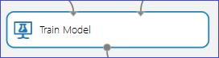

<properties 
    pageTitle="Depurar seu modelo de aprendizado de máquina Azure | Microsoft Azure" 
    description="Explica como depurar seu modelo de aprendizado de máquina do Azure." 
    services="machine-learning"
    documentationCenter="" 
    authors="garyericson" 
    manager="jhubbard" 
    editor="cgronlun"/>

<tags 
    ms.service="machine-learning" 
    ms.workload="data-services" 
    ms.tgt_pltfrm="na" 
    ms.devlang="na" 
    ms.topic="article" 
    ms.date="09/09/2016" 
    ms.author="bradsev;garye" />

# Depurar seu modelo de aprendizado de máquina Azure

Este artigo explica como depurar seus modelos no aprendizado de máquina do Microsoft Azure. Especificamente, ele aborda os motivos possíveis por um dos dois cenários de falha a seguir podem ser encontrado durante a execução de um modelo:

* o [Modelo de trem] [ train-model] módulo gera um erro 
* o [Modelo de pontuação] [ score-model] módulo produz resultados incorretos 

[AZURE.INCLUDE [machine-learning-free-trial](../../includes/machine-learning-free-trial.md)]

## Módulo de modelo de trem gera um erro

O [Modelo de trem] [ train-model] módulo espera as entradas de 2 a seguir:

1. O tipo de modelo de classificação/regressão da coleção de modelos fornecidos pelo aprendizado de máquina do Azure
2. Os dados de treinamento com uma coluna de rótulo especificado. A coluna rótulo Especifica a variável prever. O restante das colunas incluídas são considerado recursos.

Este módulo gera um erro nos seguintes casos:

1. A coluna rótulo está especificada incorretamente porque mais de uma coluna estiver selecionada como o rótulo ou um índice de coluna incorreta está selecionado. Por exemplo, o segundo caso seria aplicar se um índice de coluna de 30 foi usado com um dataset de entrada que tinha somente 25 colunas.

2. O conjunto de dados não contém todas as colunas do recurso. Por exemplo, se o dataset de entrada tem apenas 1 coluna, que está marcada como a coluna rótulo, não seria sem recursos com o qual deseja criar o modelo. Neste caso, o [Modelo de trem] [ train-model] módulo irá acionar um erro.

3. Do dataset de entrada (recursos ou rótulo) contêm infinito como um valor.

## Módulo de modelo de pontuação não produzir resultados corretos

Em um gráfico de treinamento/testes típico para supervisionada aprendendo, os [Dados de divisão] [ split] módulo divide o dataset original em duas partes: a parte que é usada para treinar o modelo e a parte que é reservada para pontuação como o modelo de treinamento executa em dados e ele não treinar em. O modelo de treinamento, em seguida, é usado para pontuação os dados de teste após o qual os resultados são avaliados para determinar a precisão do modelo.

O [Modelo de pontuação] [ score-model] módulo requer duas entradas:

1. Uma saída de modelo de treinamento de [Modelo de trem] [ train-model] módulo
2. Um conjunto de dados pontuação não que o modelo não foi treinamento em

Isso pode acontecer que embora o experimento estiver concluído, o [Modelo de pontuação] [ score-model] módulo produz resultados incorretos. Vários cenários podem causar isso aconteça:

1. Se o rótulo especificado é categórica e um modelo de regressão é treinamento nos dados, um resultado incorreto poderia ser produzido pelo [Modelo de pontuação] [ score-model] módulo. Isso ocorre porque regressão requer uma variável de resposta contínua. Nesse caso ele deve ser mais adequado usar um modelo de classificação. 
2. Da mesma forma, se um modelo de classificação é treinamento em um conjunto de dados com números de ponto flutuante na coluna rótulo, ele pode produzir resultados indesejáveis. Isso ocorre porque a classificação requer uma variável de resposta discreto que permite somente valores intervalo sobre um conjunto de classes finito e geralmente relativamente pequeno.
3. Se o conjunto de dados pontuação não contém todos os recursos usados para treinar o modelo, o [Modelo de pontuação] [ score-model] produzirão um erro.
4. O [Modelo de pontuação] [ score-model] não produza qualquer saída correspondente a uma linha no dataset pontuação que contém um valor ausente ou um valor infinito para qualquer um dos seus recursos.
5. O [Modelo de pontuação] [ score-model] podem produzir resultados idênticos para todas as linhas no dataset pontuação. Isso pode ocorrer, por exemplo, quando tentar classificação usando florestas de decisão se o número mínimo de amostras por nó folha é escolhido para ser mais do que o número de exemplos de treinamento disponíveis.

<!-- Module References -->
[score-model]: https://msdn.microsoft.com/library/azure/401b4f92-e724-4d5a-be81-d5b0ff9bdb33/
[split]: https://msdn.microsoft.com/library/azure/70530644-c97a-4ab6-85f7-88bf30a8be5f/
[train-model]: https://msdn.microsoft.com/library/azure/5cc7053e-aa30-450d-96c0-dae4be720977/
 
