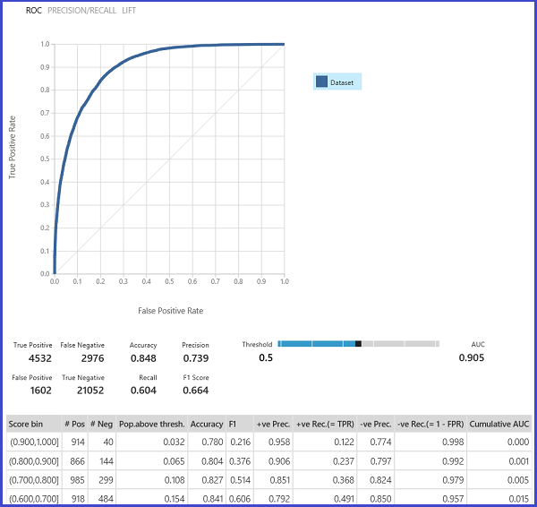

<properties 
    pageTitle="Avaliar o desempenho de modelo no aprendizado de máquina | Microsoft Azure" 
    description="Explica como avaliar o desempenho de modelo no aprendizado de máquina do Azure." 
    services="machine-learning"
    documentationCenter="" 
    authors="garyericson" 
    manager="jhubbard" 
    editor="cgronlun"/>

<tags 
    ms.service="machine-learning" 
    ms.workload="data-services" 
    ms.tgt_pltfrm="na" 
    ms.devlang="na" 
    ms.topic="article" 
    ms.date="08/19/2016" 
    ms.author="bradsev;garye" />

# Como avaliar o desempenho de modelo em aprendizado de máquina do Azure

Este tópico demonstra como avaliar o desempenho de um modelo no Azure Studio de aprendizado de máquina e fornece uma breve explicação das métricas disponíveis para essa tarefa. Três cenários comuns de aprendizagem supervisionada são apresentados: 

* regressão
* classificação binária 
* classificação multiclass

[AZURE.INCLUDE [machine-learning-free-trial](../../includes/machine-learning-free-trial.md)]

Avaliar o desempenho de um modelo é uma das etapas principais do processo de ciência de dados. Ele indica como bem-sucedida as pontuação (previsões) de um conjunto de dados foi por um modelo de treinamento. 

Aprendizado de máquina Azure oferece suporte a avaliação de modelo por meio de dois dos seu módulos de aprendizado de máquina principal: [Avaliar modelo] [ evaluate-model] [Modelo de validação cruzada]e[cross-validate-model]. Esses módulos permitem que você veja como o seu modelo executa em termos de um número de métricas que são comumente usados em estatísticas e aprendizado de máquina.

##Validação de avaliação versus cruzado##
Avaliação e validação cruzada são maneiras padrão para medir o desempenho do seu modelo. Ambos geram métricas de avaliação que você pode inspecionar ou comparar com as de outros modelos.

[Avaliar modelo] [ evaluate-model] espera um conjunto de dados scored como entrada (ou 2 caso você gostaria de comparar o desempenho de 2 modelos diferentes). Isso significa que você precisa treinar seu modelo usando o [Modelo de treinar] [ train-model] módulo e fazer previsões em alguns dataset usando o [Modelo de pontuação] [ score-model] módulo, para poder avaliar os resultados. A avaliação é com base nas etiquetas/probabilidades scored juntamente com os rótulos true, todos os quais são saída pelo [Modelo de pontuação] [ score-model] módulo.

Como alternativa, você pode usar validação cruzada para realizar um número de operações de avaliar a pontuação de trem (10 dobras) automaticamente em diferentes subconjuntos de dados de entrada. Os dados de entrada são divididos em 10 partes, onde um está reservado para teste, e os outros 9 para treinamento. Esse processo é repetido 10 vezes e as métricas de avaliação são média. Isso ajuda a determinar como um modelo seria generalize para novos conjuntos de dados. O [Modelo de validação cruzada] [ cross-validate-model] módulo leva em um modelo de treinamento e alguns dataset rotulada e mostra os resultados de avaliação de cada um das 10 dobras, além dos resultados da média.

Nas seções a seguir, vamos criar modelos de classificação e de regressão simples e avaliar seu desempenho, usando o [Modelo de avaliar] ambas as[ evaluate-model] e o [Modelo de validação cruzada] [ cross-validate-model] módulos.

##Avaliar um modelo de regressão##
Suponha que queremos prever preço de um carro uso de alguns recursos como dimensões, potência, especificações de mecanismo e assim por diante. Este é um problema de regressão típica, onde a variável de destino (*preço*) é um valor numérico contínuo. Nós pode conter um modelo de regressão linear simples que, dados os valores de recurso de um determinado carro, poderá prever o preço de que um carro. Este modelo de regressão pode ser usado para pontuação mesmo dataset em que podemos treinamento. Depois que temos os preços previstos para todos os carros, podemos pode avaliar o desempenho do modelo examinando quanto as previsões desviarem dos preços reais em média. Para ilustrar isso, usamos o *conjunto de dados (matéria) dados automóvel preço* disponível na seção de **Conjuntos de dados salvo** no Azure Studio de aprendizado de máquina.
 
###Criando o experimento###
Adicione os seguintes módulos ao seu espaço de trabalho no Azure Studio de aprendizado de máquina:

- Dados de preço automóvel (matéria)
- [Regressão linear][linear-regression]
- [Modelo de trem][train-model]
- [Modelo de pontuação][score-model]
- [Avaliar modelo][evaluate-model]

Conecte as portas conforme mostrado abaixo na Figura 1 e defina a coluna rótulo do [Modelo de trem] [ train-model] módulo ao *preço*.
 

Figura 1. Avaliando um modelo de regressão.

###Inspecionar os resultados da avaliação###
Após a execução do experimento, você pode clicar na porta de saída do [Modelo avaliar] [ evaluate-model] módulo e selecione *Visualizar* para ver os resultados de avaliação. As métricas de avaliação disponíveis para modelos de regressão são: *Significam absoluta erro*, *Raiz significam absoluta erro*, *Relativa erro absoluto*, *Relativo erro quadrado*e o *Coeficiente de determinação*.

O termo "erro" aqui representa a diferença entre o valor previsto e o valor true. O valor absoluto ou o quadrado dessa diferença geralmente são calculados para capturar a magnitude total do erro em todas as instâncias, como a diferença entre o valor previsto e verdadeiro pode estar negativa em alguns casos. As métricas de erro medem o desempenho de previsão de um modelo de regressão em termos o desvio de média de seus previsões dos valores true. Valores de erro mais baixos significam que o modelo é mais preciso fazer previsões. Uma métrica geral de erro 0 significa que o modelo se ajusta aos dados perfeitamente.

O coeficiente de determinação, que também é conhecido como R quadrado, também é uma forma padrão de medição quanto o modelo se ajusta aos dados. Ele pode ser interpretado como a proporção da variação explicada pelo modelo. Uma maior proporção é melhor nesse caso, onde 1 indica perfeita.
 

Figura 2. Métricas de avaliação de regressão linear.

###Usando cruzada validação###
Conforme mencionado anteriormente, você pode executar treinamento repetido, pontuação e avaliações automaticamente usando o [Modelo de validação cruzada] [ cross-validate-model] módulo. Tudo o que você precisa nesse caso é um conjunto de dados, um modelo de treinamento e um [Modelo de validação cruzada] [ cross-validate-model] módulo (consulte a figura a seguir). Observe que você precisa definir a coluna rótulo ao *preço* no [Modelo de validação cruzada] [ cross-validate-model] propriedades do módulo.

Figura 3. Entre-Validando um modelo de regressão.

Após a execução do experimento, você pode inspecionar os resultados da avaliação clicando na porta de saída à direita do [Modelo de validação cruzada] [ cross-validate-model] módulo. Isso fornecerá uma exibição detalhada das métricas para cada iteração (dobra) e os resultados média de cada uma das métricas (Figura 4).
 

Figura 4. Resultados de validação cruzada de um modelo de regressão.

##Avaliar um modelo de classificação binário##
Em um cenário de classificação binário, a variável de destino tem apenas dois resultados possíveis, por exemplo: {0, 1} ou {falso, verdadeiro}, {negativo, positivo}. Suponha que você recebe um conjunto de dados de funcionários adultos com alguns demográficos e variáveis de emprego e que você for solicitado a prever o nível de receita, uma variável binário com os valores {"< = 50 mil", "> 50 mil"}. Em outras palavras, a classe negativa representa os funcionários que fazem menor ou igual a 50K por ano e a classe positiva representa todos os outros funcionários. Como o cenário de regressão, podemos seria treinar um modelo, pontuação alguns dados e avaliar os resultados. A principal diferença aqui é a opção de métricas que computa de aprendizado de máquina do Azure e saídas. Para ilustrar o cenário de previsão de nível de receita, usaremos dataset [adulto](http://archive.ics.uci.edu/ml/datasets/Adult) para criar uma experiência de aprendizado de máquina do Azure e avaliar o desempenho de um modelo de regressão logística dois classe, um classificador binário comumente usado.

###Criando o experimento###
Adicione os seguintes módulos ao seu espaço de trabalho no Azure Studio de aprendizado de máquina:

- Conjunto de dados de censo renda binário classificação adultos
- [Regressão logística dois classe][two-class-logistic-regression]
- [Modelo de trem][train-model]
- [Modelo de pontuação][score-model]
- [Avaliar modelo][evaluate-model]

Conecte as portas conforme mostrado abaixo na Figura 5 e defina a coluna rótulo do [Modelo de trem] [ train-model] módulo de *receita*.

Figura 5. Avaliando um modelo de classificação binária.

###Inspecionar os resultados da avaliação###
Após a execução do experimento, você pode clicar na porta de saída do [Modelo avaliar] [ evaluate-model] módulo e selecione *Visualizar* para ver os resultados de avaliação (Figura 7). São as métricas de avaliação disponíveis para modelos de classificação binária: *precisão*, *precisão*, *Cancelar*, *Pontuação F1*e *AUC*. Além disso, o módulo gera uma matriz de confusão mostrando o número de positivos true, falsos negativos, falsos positivos, negativos true, além curvas *ROC*, *Precisão/cancelamento*e *tire* .

Precisão é simplesmente a proporção de instâncias classificadas corretamente. Geralmente é a métrica primeira que olhar ao avaliar um classificador. No entanto, quando os dados de teste forem equilibrada (onde a maioria das instâncias pertence a uma das classes), ou se estiver mais interessado no desempenho em qualquer uma das classes, precisão não realmente captura a eficiência de um classificador. O cenário de nível de classificação de renda, suponha que você está testando em alguns dados onde 99% das instâncias representam pessoas que obtiverem menor ou igual a 50K por ano. É possível obter uma precisão 0,99 por prever a classe "< = 50 mil" para todas as instâncias. Classificador nesse caso parece estar fazendo um bom trabalho geral, mas na realidade, ele não conseguir classificar qualquer um dos indivíduos high-income (o 1%) corretamente.

Por que motivo, é útil calcular métricas adicionais que capturar aspectos mais específicos da avaliação. Antes de entrar os detalhes de medidas, é importante entender a matriz confusão de uma avaliação de classificação binária. Os rótulos de classe no conjunto de treinamento podem realizar em apenas 2 valores possíveis, o que normalmente chamamos como positivo ou negativo. As instâncias positivas e negativas que um classificador prevê corretamente são chamadas positivos true (PA) e negativos true (TN), respectivamente. Da mesma forma, as instâncias classificadas incorretamente são chamadas falsos positivos (FP) e falsos negativos (FN). A matriz de confusão é simplesmente uma tabela mostrando o número de instâncias que se enquadram sob cada uma dessas categorias 4. Azure aprendizado de máquina automaticamente decide qual das duas classes no dataset a classe positiva. Se os rótulos de classe são inteiros ou booliano, as instâncias de rotulado 'true' ou '1' são atribuídas a classe positiva. Se os rótulos são cadeias de caracteres, como no caso do dataset renda, os rótulos são classificados em ordem alfabética e o primeiro nível é escolhido para ser a classe negativa, enquanto o segundo nível é a classe positiva.

Figura 6. Matriz de confusão de classificação binária.

Voltar para o problema de classificação de renda, queremos pedir várias perguntas de avaliação que nos ajudam a compreendam o desempenho do classificador usado. Uma pergunta muito natural é: ' fora os indivíduos quem o modelo previsto para ser com um lucro > 50 mil (PA + FP), quantos classificados corretamente (PA)?' Essa pergunta pode ser respondida examinando a **precisão** do modelo, que é a proporção de positivos são classificados corretamente: TP/(TP+FP). Outra pergunta comum é "fora todo o alto com um lucro de funcionários com renda > 50 mil (PA + FN), quantos classificador classificar corretamente (PA)". Isso é realmente a **Cancelar**, ou a taxa de positiva verdadeira: TP/(TP+FN) do classificador. Você observará que não há uma opção óbvia entre cancelamento e precisão. Por exemplo, dado um conjunto de dados relativamente equilibrado, um classificador que prevê principalmente positivas instâncias, teria um cancelamento alto, mas uma precisão preferir baixa quantas das instâncias negativas poderia ser classificado incorretamente resulta em um grande número de falsos positivos. Para ver uma plotagem do como essas duas métricas variam, você pode clicar em curva ' Precisão/cancelamento' na página de saída do resultado da avaliação (parte superior esquerda da Figura 7).

 Figura 7. Resultados da avaliação de classificação binária.

Outra métrica relacionada que é usada com frequência é a **Pontuação de F1**, que usa o cancelamento em consideração e precisão. É a média harmônica métricas 2 e é calculada assim: F1 = 2 (cancelamento de precisão x) / (precisão + cancelamento). A pontuação de F1 é uma boa maneira de resumir a avaliação um único número, mas sempre é uma boa prática para examinar a precisão e o cancelamento juntos para entender melhor como um classificador se comporta.

Além disso, um pode inspecionar a taxa de positiva verdadeira versus os falsos positivos em curva **Receptor operacional característica (ROC)** e o valor de **Área sob a curva (AUC)** correspondente. Quanto mais próximo essa curva para o canto superior esquerdo, melhor desempenho do classificador (que é maximizar a taxa de positiva verdadeira minimizando os falsos positivos). Curvas que são próximo diagonal do gráfico, o resultado de classificador que tendem a fazer previsões que estão Fechar para descobrir aleatório.

###Usando cruzada validação###
Como no exemplo de regressão, podemos podem realizar validação cruzada para repetidamente treinar, pontuação e avaliar subconjuntos diferentes dos dados automaticamente. Da mesma forma, podemos usar o [Modelo de validação cruzada] [ cross-validate-model] módulo, um modelo de regressão logística treinamento e um conjunto de dados. A coluna rótulo deve ser definida como *receita* no [Modelo de validação cruzada] [ cross-validate-model] propriedades do módulo. Depois de executar o experimento e clicar na porta de saída à direita do [Modelo de validação cruzada] [ cross-validate-model] módulo, podemos ver os valores de métricas de classificação binários para cada dobra, além para a média e o desvio padrão de cada uma. 
 

Figura 8. Entre-Validando um modelo de classificação binária.

Figura 9. Resultados de validação cruzada de um classificador binário.

##Avaliar um modelo de classificação Multiclass##
Nesse experimento usaremos popular [Iris](http://archive.ics.uci.edu/ml/datasets/Iris "Iris") conjunto de dados que contém instâncias de 3 tipos diferentes (classes) da fábrica iris. Há 4 valores de recurso (sépala comprimento/largura e largura da comprimento pétala) para cada instância. As experiências anteriores estamos treinamento e testado os modelos usando os mesmos conjuntos de dados. Aqui, usaremos os [Dados de divisão] [ split] módulo para criar 2 subconjuntos dos dados, treinar na primeira, pontuação e avaliar na segunda. O conjunto de dados Iris está disponível publicamente no [Repositório de aprendizado de máquina UCI](http://archive.ics.uci.edu/ml/index.html)e pode ser baixado usando um [Importar dados] de[ import-data] módulo.

###Criando o experimento###
Adicione os seguintes módulos ao seu espaço de trabalho no Azure Studio de aprendizado de máquina:

- [Importar dados][import-data]
- [Multiclass decisão floresta][multiclass-decision-forest]
- [Dividir dados][split]
- [Modelo de trem][train-model]
- [Modelo de pontuação][score-model]
- [Avaliar modelo][evaluate-model]

Conecte as portas conforme mostrado abaixo na Figura 10.

Definir o índice de coluna rótulo do [Modelo de trem] [ train-model] módulo 5. O dataset não tem nenhuma linha de cabeçalho, mas sabemos que os rótulos de classe são na quinta coluna.

Clique em [Importar dados] [ import-data] módulo e defina a propriedade *fonte de dados* a *URL da Web via HTTP*e a *URL* para http://archive.ics.uci.edu/ml/machine-learning-databases/iris/iris.data.

Definir a fração de instâncias a ser usado para treinamento dos [Dados de divisão] [ split] módulo (0.7 por exemplo).
 

Figura 10. Avaliando um classificador Multiclass

###Inspecionar os resultados da avaliação###
Execute o experimento e clique na porta de saída de [Modelo de avaliar][evaluate-model]. Os resultados de avaliação são apresentados na forma de uma matriz de confusão, nesse caso. A matriz mostra o valor real versus instâncias previstas para todas as 3 classes.
 

Figura 11. Resultados da avaliação de classificação multiclass.

###Usando cruzada validação###
Conforme mencionado anteriormente, você pode executar treinamento repetido, pontuação e avaliações automaticamente usando o [Modelo de validação cruzada] [ cross-validate-model] módulo. Seria necessário um conjunto de dados, um modelo de treinamento e um [Modelo de validação cruzada] [ cross-validate-model] módulo (consulte a figura a seguir). Novamente, você precisa definir a coluna de rótulo do [Modelo de validação cruzada] [ cross-validate-model] módulo (índice de coluna de 5 nesse caso). Após executando o experimento e clicando em à direita de saída de porta do [Modelo de validação cruzada][cross-validate-model], você pode inspecionar os valores métricos para cada dobra, bem como o desvio padrão e médio. As métricas exibidas aqui são semelhantes àquelas discutido no caso de classificação binária. No entanto, observe que em classificação multiclass, computação os falsos positivos/negativos e positivos/negativos true é feito contando numa base por classe, pois não há nenhuma classe geral positivo ou negativo. Por exemplo, quando a computação a precisão ou o cancelamento da classe 'Iris-setosa', será considerado que esta é a classe positiva e todas as outras pessoas como negativo.
 

Figura 12. Entre-Validando um modelo de classificação Multiclass.

Figura 13. Resultados de validação cruzada de um modelo de classificação Multiclass.

<!-- Module References -->
[cross-validate-model]: https://msdn.microsoft.com/library/azure/75fb875d-6b86-4d46-8bcc-74261ade5826/
[evaluate-model]: https://msdn.microsoft.com/library/azure/927d65ac-3b50-4694-9903-20f6c1672089/
[linear-regression]: https://msdn.microsoft.com/library/azure/31960a6f-789b-4cf7-88d6-2e1152c0bd1a/
[multiclass-decision-forest]: https://msdn.microsoft.com/library/azure/5e70108d-2e44-45d9-86e8-94f37c68fe86/
[import-data]: https://msdn.microsoft.com/library/azure/4e1b0fe6-aded-4b3f-a36f-39b8862b9004/
[score-model]: https://msdn.microsoft.com/library/azure/401b4f92-e724-4d5a-be81-d5b0ff9bdb33/
[split]: https://msdn.microsoft.com/library/azure/70530644-c97a-4ab6-85f7-88bf30a8be5f/
[train-model]: https://msdn.microsoft.com/library/azure/5cc7053e-aa30-450d-96c0-dae4be720977/
[two-class-logistic-regression]: https://msdn.microsoft.com/library/azure/b0fd7660-eeed-43c5-9487-20d9cc79ed5d/
 
