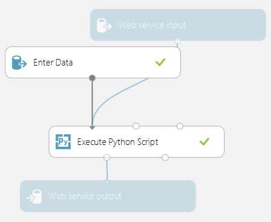

<properties 
    pageTitle="Executar scripts de aprendizado de máquina Python | Microsoft Azure" 
    description="Princípios subjacentes suporte para os scripts de Python de aprendizado de máquina do Azure e cenários de uso básico, recursos e limitações de design de estruturas de tópicos." 
    keywords="máquina Python aprendendo, pandas, pandas de python, scripts de python, executar scripts de python"
    services="machine-learning"
    documentationCenter="" 
    authors="bradsev" 
    manager="jhubbard" 
    editor="cgronlun"/>

<tags 
    ms.service="machine-learning" 
    ms.workload="data-services" 
    ms.tgt_pltfrm="na" 
    ms.devlang="na" 
    ms.topic="article" 
    ms.date="09/12/2016" 
    ms.author="bradsev" />

# Executar scripts de aprendizado de máquina de Python no Studio de aprendizado de máquina do Azure

Este tópico descreve os princípios de design subjacente o suporte atual para os scripts de Python de aprendizado de máquina do Azure. Os recursos principais também são descritos, incluindo o suporte para a importação de código existente, exportando visualizações e, por fim, algumas das limitações e trabalho contínuo são discutidas.

[Python](https://www.python.org/) é uma ferramenta indispensável no conjunto de ferramentas de muitos cientistas de dados. Ela tem:

-  uma sintaxe elegante e concisa, 
-  suporte entre plataformas, 
-  uma grande coleção de bibliotecas poderosas, e 
-  ferramentas de desenvolvimento avançado. 

Python está sendo usado em todas as fases do fluxo de trabalho normalmente usado na modelagem de aprendizado de máquina, de dados inclusão e processamento, a construção de recurso e treinamento do modelo e, em seguida, validação e implantação dos modelos. 

Azure Studio de aprendizado de máquina dá suporte à incorporação scripts Python em várias partes de uma máquina experimento de aprendizagem e também perfeitamente publicá-los como serviços web scalable, operacionalizada no Microsoft Azure.

[AZURE.INCLUDE [machine-learning-free-trial](../../includes/machine-learning-free-trial.md)]

## Princípios de design de scripts Python no aprendizado de máquina
A interface principal Python no Azure Studio de aprendizado de máquina é por meio de [Executar scripts de Python] [ execute-python-script] módulo mostrado na Figura 1.

Figura 1. O módulo de **Executar scripts de Python** .

[Executar scripts de Python] [ execute-python-script] módulo aceita até três entradas e produz até duas saídas (discutidas abaixo), assim como seu analógico R, [Executar scripts de R] [ execute-r-script] módulo. O código Python a ser executado é inserido na caixa parâmetro como um especialmente nomeada função chamada de ponto de entrada `azureml_main`. Aqui estão os princípios de design de chave usados para implementar este módulo:

1.  *Deve ser expressões idiomáticas para usuários de Python.* A maioria dos usuários de Python fator seu código como funções dentro de módulos, portanto é relativamente rara colocar muitas instruções executáveis em um módulo de nível superior. Como resultado, a caixa de script também leva uma função de Python especialmente nomeada em vez de apenas uma sequência de instruções. Os objetos expostos na função são tipos de biblioteca padrão do Python como quadros de dados [Pandas](http://pandas.pydata.org/) e [NumPy](http://www.numpy.org/) matrizes.
2.  *Deve ter alta fidelidade entre locais e na nuvem execuções.* O back-end usado para executar o código Python baseia-se nos [Anaconda](https://store.continuum.io/cshop/anaconda/) 2.1, uma amplamente usada distribuição científica Python entre plataformas. Ele vem com o próximo 200 dos pacotes Python mais comuns. Portanto, cientistas de dados podem depurar e qualificar seus códigos no seu ambiente local do Anaconda de compatível com o aprendizado de máquina do Azure. Use ambientes de desenvolvimento existentes como bloco de anotações de [IPython](http://ipython.org/) ou [Ferramentas de Python para Visual Studio](http://aka.ms/ptvs) para executá-lo como parte de uma experiência de aprendizado de máquina do Azure com confiança alta. Posterior, o `azureml_main` ponto de entrada é uma função de Python baunilha e pode ser criado sem código específico de aprendizado de máquina do Azure ou o SDK instalado.
3.  *Devem ser compostas perfeitamente com outros módulos de aprendizado de máquina do Azure.* [Executar scripts de Python] [ execute-python-script] módulo aceita, como entradas e saídas, conjuntos de dados de aprendizado de máquina do Azure padrão. A estrutura subjacente transparente e eficiente preenche os tempos de execução de aprendizado de máquina do Azure e Python (suporte a recursos como valores ausentes). Python, portanto, pode ser usado em conjunto com fluxos de trabalho aprendizado de máquina do Azure existentes, inclusive aqueles que chamam R e SQLite. Um pode, portanto, envisage fluxos de trabalho que:
  * usar Python e Pandas para dados pré-processamento e limpeza, 
  * feed de dados a uma transformação de SQL, ingressando em vários conjuntos de dados para os recursos de formulário, 
  * treinar modelos usando o conjunto considerável de algoritmos no aprendizado de máquina do Azure, e 
  * avaliar e pós-processar os resultados usando R.

## Cenários de uso básico no aprendizado de máquina para scripts Python
Nesta seção, nós de pesquisa alguns dos usos básicos do [Executar scripts de Python] [ execute-python-script] módulo.
Conforme mencionado anteriormente, qualquer entradas no módulo de Python são expostas como quadros de dados Pandas. Mais informações sobre Pandas Python e como ele pode ser usado para manipular os dados e eficazmente podem ser encontradas na *Python para análise de dados* (o ' Reilly, 2012) por McKinney Oeste. A função deve retornar um quadro de dados único Pandas empacotado dentro de uma [sequência](https://docs.python.org/2/c-api/sequence.html) do Python como uma tupla, lista ou matriz de NumPy. O primeiro elemento dessa sequência é retornado na primeira porta de saída do módulo. Este esquema é mostrado na Figura 2.

Figura 2. Mapeamento de portas para parâmetros de entrada e valor de retorno para porta de saída.

Mais detalhadas semântica de como as portas de entrada são mapeadas para parâmetros do `azureml_main` função são mostrados na tabela 1:

Tabela 1. Mapeamento de portas de entrada para os parâmetros de função.

O mapeamento entre portas de entrada e parâmetros de função é posicional. A primeira porta de entrada conectada é mapeada para o primeiro parâmetro da função e a segunda entrada (se estiver conectado) é mapeada para o segundo parâmetro da função.

## Conversão de tipos de entrada e saídos
Como explicado anteriormente, conjuntos de dados de entrada no aprendizado de máquina do Azure são convertidos em dados quadros em Pandas e quadros de dados de saída são convertidos para conjuntos de dados de aprendizado de máquina do Azure. As seguintes conversões são executadas:

1.  Colunas numéricos e de cadeia de caracteres são convertidas em-é e valores ausentes em um conjunto de dados são convertidas em valores de 'ND' em Pandas. A mesma conversão acontece em volta da maneira (valores de ND no Pandas são convertidos em valores ausentes no aprendizado de máquina do Azure).
2.  Vetores de índice em Pandas não são suportados no aprendizado de máquina do Azure. Todos os quadros de dados de entrada na função Python sempre tem um índice numérico de 64 bits entre 0 e o número de linhas menos 1. 
3.  Conjuntos de dados do Azure aprendizado de máquina não podem ter nomes de coluna que não são cadeias de caracteres e nomes de coluna duplicados. Se um quadro de dados de saída contiver colunas não numérico, a estrutura chama `str` nos nomes de coluna. Da mesma forma, os nomes de coluna duplicados automaticamente estão desconfigurados para garantir que os nomes são exclusivos. O sufixo (2) é adicionado para a segunda etc duplicado, a primeira duplicata, (3).

## Operacionalização scripts Python
Qualquer [Executar scripts de Python] [ execute-python-script] módulos usados em um experimento pontuação são chamados quando publicados como um serviço da web. Por exemplo, a Figura 3 mostra um experimento pontuação que contém o código para avaliar uma única expressão de Python. 

Figura 3. Serviço Web para avaliar uma expressão de Python.

Um serviço web criado a partir desse experimento considera como uma expressão de Python (como uma cadeia de caracteres), envia para o intérprete Python e retorna uma tabela que contém a expressão e o resultado avaliado de entrada.

## Importando módulos de script Python existentes
Um caso de uso comum para muitos cientistas de dados é incorporar scripts Python existentes experiências de aprendizado de máquina do Azure. Em vez de concatenação e colando todos os códigos em uma caixa de único script, o [Script de Python executar] [ execute-python-script] módulo aceita uma terceira porta de entrada para o qual um arquivo zip que contém os módulos de Python pode ser conectado. O arquivo é então descompactado pelo framework execução em tempo de execução e o conteúdo é adicionado ao caminho da biblioteca do intérprete Python. O `azureml_main` função pode importar esses módulos diretamente do ponto de entrada.

Como exemplo, considere o arquivo Hello.py que contém uma função simples "Olá, mundo".

Figura 4. Função definida pelo usuário.

Em seguida, podemos criar um arquivo Hello que contém Hello.py:

Figura 5. Arquivo zip que contém o código de Python definidos pelo usuário.

Em seguida, carregue isso como um conjunto de dados no Azure Studio de aprendizado de máquina. Criar e executar um experimento simple que usa o código Python no arquivo Hello anexando-o para a terceira porta de entrada do Script Python executar, conforme mostrado nesta figura.

Figura 6. Experimento de exemplo com código de Python definidos pelo usuário são carregados como um arquivo zip.

Módulo de saída mostra que o arquivo zip foi descompactado e a função `print_hello` realmente foi executado.
 

 
Figura 7. Função definida pelo usuário em uso dentro do [Script de Python executar] [ execute-python-script] módulo.

## Trabalhando com visualizações
Plotar criados usando o MatplotLib que poderão ser visualizada no navegador pode ser retornado pelo [Executar scripts de Python][execute-python-script]. Mas o plotar não serão redirecionados automaticamente para imagens como eles estão usando R. Portanto o usuário deve salvar explicitamente qualquer plotar para arquivos PNG se eles devem ser retornados para aprendizado de máquina do Azure. 

Para poder gerar imagens de MatplotLib, você deve competir o procedimento a seguir:

* Alternar o back-end para "AGG" do processador baseado em Qt padrão 
* criar um novo objeto de figura 
* Obtenha o eixo e gerar plotar todos nela 
* Salvar a figura para um arquivo PNG 

Esse processo é ilustrado a seguir Figura 8 que cria uma matriz de plotagem de dispersão usando a função scatter_matrix em Pandas.
 

Figura 8. Salvando figuras MatplotLib imagens.

Figura 9 mostra um experimento que usa o script mostrado anteriormente para retornar plota via a segunda porta de saída.

 
     
 

Figura 9. Visualizando plotar gerado a partir de código Python.

É possível retornar múltiplas figuras salvando-as em imagens diferentes, o tempo de execução de aprendizado de máquina do Azure seleciona todas as imagens e concatena para visualização.

## Exemplos avançados
O ambiente de Anaconda instalado no aprendizado de máquina do Azure contém pacotes comuns, como NumPy, SciPy e saiba Scikits e esses efetivamente podem ser usadas para várias tarefas de processamento de dados em um pipeline de aprendizado de máquina típica. Como exemplo, o seguinte experimento e o script ilustra o uso dos alunos ensemble no Scikits-Aprenda a calcular pontuações de prioridade de recurso de um conjunto de dados. Pontuações, em seguida, podem ser usadas para executar a seleção de recurso supervisionada antes de alimentação de outro modelo de aprendizado de máquina.

A função de Python para calcular a pontuação de prioridade e a ordem os recursos com base nele é mostrada abaixo:

Figura 10. Função aos recursos de classificação por pontuações.
 O experimento seguinte depois calcula e retorna a pontuação de prioridade de recursos no dataset "Pima índico Diabetes" no aprendizado de máquina do Azure:

    
    
Figura 11. Experimentar aos recursos de classificação no dataset Pima índico Diabetes.

## Limitações 
[Executar scripts de Python] [ execute-python-script] atualmente tem as seguintes limitações:

1.  *Execução de área restrita.* O tempo de execução do Python é atualmente em área restrita e, assim, não permitir o acesso à rede ou para o sistema de arquivo local de uma maneira persistente. Todos os arquivos salvos localmente são isolados e excluídos quando termina de módulo. O código Python não pode acessar a maioria dos diretórios na máquina que ele é executado, a exceção sendo a pasta atual e seus subdiretórios.
2.  *Falta de desenvolvimento sofisticado e suporte à depuração.* Atualmente o módulo Python não oferece suporte para recursos IDE como intellisense e depuração. Além disso, se o módulo falhar em tempo de execução, o rastreamento de pilha Python completo está disponível, mas deve ser exibido no log de saída para o módulo. Atualmente, recomendamos que você desenvolver e depurar seus scripts Python em um ambiente como IPython e, em seguida, importar o código para o módulo.
3.  *Saída do quadro de dados único.* O ponto de entrada Python só é permitido para retornar um quadro de dados único como saída. Não é possível atualmente retornar aleatório objetos de Python como modelos de treinamento diretamente para o tempo de execução de aprendizado de máquina do Azure. Como [Executar Script de R][execute-r-script], que tem a mesma limitação, é Entretanto possíveis em muitos casos a pickle objetos em uma matriz de bytes e volte que dentro de um quadro de dados.
4.  *Impossibilidade de personalizar instalação Python*. Atualmente, a única maneira de adicionar módulos personalizados do Python é por meio do mecanismo de arquivo zip descrito anteriormente. Embora seja viável para pequenos módulos, é complicado para grandes módulos (especialmente aqueles com DLLs nativas) ou um grande número de módulos. 

##Conclusões
[Executar scripts de Python] [ execute-python-script] módulo permite um cientista dados de incorporar código Python existente em fluxos de trabalho de aprendizado de máquina hospedados em nuvem no aprendizado de máquina do Azure e perfeitamente tornem operacional-los como parte de um serviço web. O módulo de scripts Python naturalmente interage com outros módulos no aprendizado de máquina do Azure e pode ser usado para uma variedade de tarefas da exploração de dados para o pré-processamento, a extração de recurso, a avaliação e processamento POST dos resultados. O tempo de execução de back-end usado para execução baseia-se na Anaconda, uma distribuição de Python bem testada e amplamente usada. Isso torna simples para você integrado ativos de código existentes na nuvem.

Esperamos fornecer funcionalidade adicional ao [Executar scripts de Python] [ execute-python-script] módulo como a capacidade de treinar e colocar em operação modelos em Python e adicionar suporte melhor para o desenvolvimento e depuração de código no Azure Studio de aprendizado de máquina.

## Próximas etapas

Para obter mais informações, consulte o [Python Developer Center](/develop/python/).

<!-- Module References -->
[execute-python-script]: https://msdn.microsoft.com/library/azure/cdb56f95-7f4c-404d-bde7-5bb972e6f232/
[execute-r-script]: https://msdn.microsoft.com/library/azure/30806023-392b-42e0-94d6-6b775a6e0fd5/
