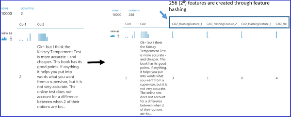
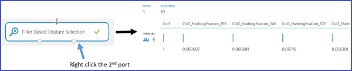

<properties
    pageTitle="Recurso de engenharia e seleção no aprendizado de máquina do Azure | Microsoft Azure"
    description="Explica a finalidade de seleção de recursos e engenharia de recurso e fornece exemplos de sua função no processo de aperfeiçoamento de dados de aprendizado de máquina."
    services="machine-learning"
    documentationCenter=""
    authors="bradsev"
    manager="jhubbard"
    editor="cgronlun"/>

<tags
    ms.service="machine-learning"
    ms.workload="data-services"
    ms.tgt_pltfrm="na"
    ms.devlang="na"
    ms.topic="article"
    ms.date="09/12/2016"
    ms.author="zhangya;bradsev" />

# Engenharia de recurso e seleção no aprendizado de máquina do Azure

Este tópico explica a finalidade de engenharia do recurso e seleção de recurso no processo de aperfeiçoamento de dados de aprendizado de máquina. Ele ilustra o que esses processos envolvem usando exemplos fornecidos pelo Studio de aprendizado de máquina do Azure.

[AZURE.INCLUDE [machine-learning-free-trial](../../includes/machine-learning-free-trial.md)]

Os dados de treinamento usados no aprendizado de máquina muitas vezes podem ser melhorados pela seleção ou a extração de recursos dos dados processados coletados. Um exemplo de um recurso de engenharia no contexto de aprender a classificar as imagens de caracteres manuscritas é um mapa de densidade de bits construído com os dados de distribuição de bit bruto. Este mapa pode ajudar a localizar as bordas dos caracteres com mais eficiência do que a distribuição bruta.

Recursos de engenharia e selecionados aumentam a eficiência do processo de treinamento, que tenta extrair chaves informações contidas nos dados. Eles também melhoram o poder desses modelos para classificar os dados de entrada com precisão e prever resultados de interesse mais verdadeiramente. Engenharia de recurso e seleção também podem combinar para tornar o aprendizado mais computação manejável. Ela faz isso aprimorando e, em seguida, reduzindo o número de recursos necessários para calibre ou treinar um modelo. Os recursos selecionados para treinar o modelo matematicamente falando, são um conjunto mínimo de variáveis independentes que explicam os padrões nos dados e, em seguida, prever resultados com êxito.

A engenharia e a seleção de recursos é uma parte de um processo maior, que geralmente consiste em quatro etapas:

* Coleta de dados
* Aperfeiçoamento de dados
* Construção de modelo
* Pós-processamento

Engenharia e seleção compõem na etapa de aprimoramento de dados de aprendizado de máquina. Três aspectos desse processo podem ser diferenciados para nossas finalidades:

* **Processamento de pré-lançamento de dados**: este processo tenta Certifique-se de que os dados coletados sejam limpa e consistentes. Ele inclui tarefas como integrar vários conjuntos de dados, falta de manipulação de dados, dados inconsistentes manipulação e convertendo tipos de dados.
* **Engenharia de recursos**: esse processo tentativas para criar recursos relevantes adicionais dos recursos de brutos existentes nos dados e para aumentar a capacidade de previsão para o algoritmo de aprendizado.
* **Seleção de recursos**: esse processo seleciona o subconjunto principais recursos de dados original para reduzir a dimensionalidade do problema treinamento.

Este tópico aborda somente os aspectos de seleção de recurso do processo de aperfeiçoamento de dados e engenharia de recurso. Para obter mais informações sobre a etapa de pré-processamento de dados, consulte [pré-processamento de dados no Azure Studio de aprendizado de máquina](https://azure.microsoft.com/documentation/videos/preprocessing-data-in-azure-ml-studio/).

## Criação de recursos dos seus dados – engenharia de recursos

Os dados de treinamento consistem em uma matriz composta de exemplos (registros ou observações armazenadas em linhas), cada um deles tem um conjunto de recursos (variáveis ou campos armazenados em colunas). Os recursos especificados no design experimental espera caracterizar os padrões nos dados. Embora muitos dos dados processados campos podem ser incluídos diretamente no conjunto de recurso selecionado usado para treinar um modelo, recursos adicionais de engenharia geralmente precisam ser construído com os recursos dos dados processados para gerar um conjunto de dados de treinamento avançado.

Que tipo de recursos deve ser criado para aprimorar o conjunto de dados quando um modelo de treinamento? Recursos de engenharia que aprimoram o treinamento fornecem informações que diferencia melhor os padrões nos dados. Você espera que os novos recursos para fornecer informações adicionais que não são capturadas claramente ou facilmente evidente no conjunto de recursos existentes ou original, mas esse processo é algo de uma arte. Decisões de som e produtivas geralmente exigem alguma experiência de domínio.

Ao iniciar com o aprendizado de máquina do Azure, é mais fácil de entender esse processo concretamente usando exemplos fornecidos no Studio de aprendizado de máquina. Dois exemplos são apresentados aqui:

* Um exemplo de regressão ([previsão do número de locações de bicicleta](http://gallery.cortanaintelligence.com/Experiment/Regression-Demand-estimation-4)) em um experimento supervised onde os valores de destino são conhecidos
* Um exemplo de classificação de mineração de texto usando o [Recurso de hash][feature-hashing]

### Exemplo 1: Adicionar recursos temporais para um modelo de regressão ###

Para demonstrar como a engenharia de recursos para uma tarefa de regressão, vamos usar o experimento "demanda previsão de bicicletas" no Azure Studio de aprendizado de máquina. O objetivo desse experimento é prever a demanda por Bicicletas, ou seja, o número de locações de bicicleta em um mês específico, dia ou hora. O **conjunto de dados de bicicleta locação UCI** do conjunto de dados é usado como dados de entrada brutos.

Este conjunto de dados baseia-se em dados reais da empresa maiuscula Bikeshare que mantém uma rede de locação de bicicleta em Washington DC nos Estados Unidos. O conjunto de dados representa o número de locações de bicicleta dentro de uma hora específica de um dia de 2011 2012 e ela contém 17379 linhas e colunas de 17. O conjunto de recurso bruto contém condições de clima (temperatura, umidade, velocidade do vento) e o tipo do dia (feriado ou dia da semana). O campo prever é **cnt**, uma contagem que representa os aluguéis de bicicleta dentro de uma hora específica e que varia de 1 a 977.

Para construir recursos eficazes dos dados de treinamento, quatro modelos de regressão são criados usando o mesmo algoritmo, mas com quatro conjuntos de dados de treinamento diferentes. Os quatro conjuntos de dados representam os mesmos dados de entrada brutos, mas com um número crescente de recursos do conjunto. Esses recursos estão agrupados em quatro categorias:

1. R = clima, feriado + weekday + fins de semana recursos para o dia previsto
2. B = número de bicicletas que foram concessão em cada uma das últimas 12 horas
3. C = número de bicicletas que foram concessão em cada uma das 12 dias anteriores na mesma hora
4. D = número de bicicletas que foram concessão em cada uma das 12 semanas anterior na mesma hora e o mesmo dia

Além do recurso conjunto A, que já existe no dados não processados originais, os outros três conjuntos de recursos são criados por meio do recurso processo de engenharia. Recurso definido capturas de B a demanda recente para bicicletas. Recurso definido capturas de C a demanda para bicicletas em uma hora específica. Recurso definido D capturas demanda para bicicletas em determinada hora e determinado dia da semana. Cada um dos quatro conjuntos de dados de treinamento inclui conjuntos de recursos A, A + B, A + B + C e A + B + C + D, respectivamente.

O experimento de aprendizado de máquina do Azure, esses quatro conjuntos de dados de treinamento são formados por meio de quatro ramificações no conjunto de dados de entrada previamente processado. Exceto para a extrema esquerda ramificação, cada uma dessas agências contém um [Script de R executar] [ execute-r-script] módulo no qual um conjunto de obtido recursos (recurso define B, C e D) respectivamente é construído e acrescentado ao conjunto de dados importado. A figura a seguir demonstra o script R usado para criar o conjunto de recursos B na segunda ramificação à esquerda.

A tabela a seguir resume a comparação dos resultados de desempenho dos quatro modelos. Os melhores resultados são mostrados pelos recursos A + B + C. Observe que a taxa de erro diminui quando os conjuntos de recursos adicionais são incluídos nos dados de treinamento. Isso verifica nossa suposição que os conjuntos de recursos B e C fornecem informações relevantes adicionais para a tarefa de regressão. Adicionar o conjunto de recursos de D parece não fornecer qualquer redução adicional na taxa de erro.

### Exemplo 2: Criar recursos no mineração de texto  

Engenharia de recurso amplamente é aplicada em tarefas relacionadas à mineração de texto, como análise de classificação e sentimento do documento. Por exemplo, quando você deseja classificar documentos em várias categorias, um típico pressupõe-se que as palavras ou frases incluídos em uma categoria de documento serão menos prováveis que ocorrem em outra categoria de documento. Em outras palavras, a frequência da distribuição palavra ou frase é capaz de definir categorias de documento diferente. Em aplicativos de mineração de texto, o recurso de processo de engenharia é necessária para criar os recursos que envolvem a palavra ou frase frequências porque partes individuais do conteúdo de texto geralmente servem como dados de entrada.

Para obter essa tarefa, uma técnica chamada *recurso hash* é aplicada para transformar com eficiência os recursos de texto aleatório em índices. Em vez de associar cada recurso de texto (palavras ou frases) para um índice específico, funções este método aplicando uma função de hash para os recursos e usando seus valores de hash como índices diretamente.

Em aprendizado de máquina do Azure, há um [Recurso de hash] [ feature-hashing] módulo que cria esses recursos palavra ou frase. A figura a seguir mostra um exemplo de como usar este módulo. O conjunto de dados de entrada contém duas colunas: a classificação de catálogo variando de 1 a 5 e o valor real rever o conteúdo. O objetivo deste [Recurso hash] [ feature-hashing] módulo é recuperar novos recursos que mostram a frequência de ocorrência do correspondentes palavras ou frases dentro de revisão de catálogo específico. Para usar este módulo, você precisa concluir as etapas a seguir:

1. Selecione a coluna que contém o texto de entrada (**Col2** neste exemplo).
2. Definir *Hashing bitsize* 8, o que significa 2 ^ 8 = 256 recursos são criados. A palavra ou frase no texto, em seguida, é submetido a hash para 256 índices. O parâmetro *bitsize Hashing* varia de 1 a 31. Se o parâmetro for definido para um número maior, as palavras ou frases serão menos prováveis ser hash no mesmo índice.
3. Defina o parâmetro *N-gramas* como 2. Recupera a frequência de ocorrência de unigrams (um recurso de cada única palavra) e bigrams (um recurso para cada par de palavras adjacentes) o texto de entrada. O parâmetro *N-gramas* varia de 0 a 10, que indica o número máximo de sequenciais palavras a serem incluídos em um recurso.  

A figura a seguir mostra a aparência desses novos recursos.

## Recursos de filtragem de dados – seleção de recursos  ##

*Seleção de recursos* é um processo que normalmente é aplicado para a construção de conjuntos de dados de treinamento para tarefas de modelagem de previsão como classificação ou regressão tarefas. O objetivo é selecionar um subconjunto dos recursos de conjunto de dados original que reduz suas dimensões usando um conjunto mínimo de recursos para representar a quantidade máxima de variação nos dados. Esse subconjunto de recursos contém os recursos somente a serem incluídos para treinar o modelo. Seleção de recursos tem duas finalidades principais:

* Seleção de recurso com frequência aumenta a precisão de classificação eliminando sem importância, redundantes ou altamente correlacionadas recursos.
* Seleção de recurso diminui o número de recursos, que torna o processo de treinamento de modelo mais eficiente. Isso é particularmente importante para alunos que custam de treinar como máquinas de vetor de suporte.

Embora a seleção do recurso busca reduzir o número de recursos do conjunto de dados usados para treinar o modelo, ele não é geralmente chamado pelo termo *redução de dimensionalidade.* Métodos de seleção do recurso extrair um subconjunto de recursos originais dos dados sem alterá-los.  Métodos de redução de dimensionalidade utilizam os recursos de engenharia que podem transformar os recursos originais e, portanto, modificá-los. Análise de componente principal, análise de correlação canônico e Decomposição de valor singular são exemplos de métodos de redução de dimensionalidade.

Uma categoria aplicada amplamente dos métodos de seleção de recurso em um contexto supervised é seleção de recurso baseado em filtro. Avaliando a correlação entre cada recurso e o atributo de destino, esses métodos aplicam uma medida estatística para atribuir uma pontuação a cada recurso. Os recursos, em seguida, são classificados pela pontuação, que você pode usar para definir o limite para manter ou eliminar um recurso específico. Exemplos das medidas estatísticas usadas nesses métodos incluem Pearson correlação, informações comum e o teste qui-quadrado.

Azure Studio de aprendizado de máquina fornece módulos para seleção de recursos. Como mostrado na figura a seguir, esses módulos incluem [seleção de recurso com base no filtro] [ filter-based-feature-selection] [Fisher Linear Discriminant análise]e[fisher-linear-discriminant-analysis].

Por exemplo, use a [seleção de recursos com base no filtro] [ filter-based-feature-selection] módulo com o exemplo de mineração de texto descrito anteriormente. Suponha que você deseja criar um modelo de regressão após um conjunto de 256 recursos é criado por meio do [Recurso de hash] [ feature-hashing] módulo, e que a variável de resposta é **Col1** e representa um livro Revisar classificação variando de 1 a 5. Definir o **método de pontuação do recurso** para **Pearson correlação**, a **coluna de destino** para **Col1**e **número de recursos desejados** para **50**. O módulo [seleção de recursos com base no filtro] [ filter-based-feature-selection] produz um conjunto de dados que contém recursos de 50 junto com o atributo de destino **Col1**. A figura a seguir mostra o fluxo desse experimento e os parâmetros de entrada.

A figura a seguir mostra os conjuntos de dados resultantes. Cada recurso é marcou com base na correlação Pearson entre si mesmo e o atributo de destino **Col1**. Os recursos com pontuações superiores são mantidos.

A figura a seguir mostra as pontuações correspondentes dos recursos selecionados.

Aplicando esta [seleção de recursos com base no filtro] [ filter-based-feature-selection] módulo, 50 ausência 256 recursos estiverem selecionados porque eles têm a maioria dos recursos correlacionados com o destino variável **Col1** baseado no método pontuação **Pearson correlação**.

## Conclusão
Seleção de recurso e engenharia de recurso são duas etapas sejam executadas comumente para preparar os dados de treinamento ao criar um modelo de aprendizado de máquina. Normalmente, engenharia de recurso é aplicada primeiro para gerar recursos adicionais e, em seguida, na etapa de seleção do recurso é feita para eliminar recursos sem importância, redundantes ou altamente correlacionados.

Nem sempre é necessariamente executar a seleção de engenharia ou recurso de recursos. Se for necessário depende de dados ou coletar, o algoritmo que você escolher e o objetivo da experiência.

<!-- Module References -->
[execute-r-script]: https://msdn.microsoft.com/library/azure/30806023-392b-42e0-94d6-6b775a6e0fd5/
[feature-hashing]: https://msdn.microsoft.com/library/azure/c9a82660-2d9c-411d-8122-4d9e0b3ce92a/
[filter-based-feature-selection]: https://msdn.microsoft.com/library/azure/918b356b-045c-412b-aa12-94a1d2dad90f/
[fisher-linear-discriminant-analysis]: https://msdn.microsoft.com/library/azure/dcaab0b2-59ca-4bec-bb66-79fd23540080/
