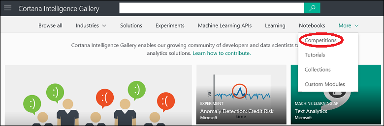

<properties
    pageTitle="Competição de galeria de inteligência de Cortana | Microsoft Azure"
    description="Descubra competição na Galeria de inteligência de Cortana."
    services="machine-learning"
    documentationCenter=""
    authors="garyericson"
    manager="jhubbard"
    editor="cgronlun"/>

<tags
    ms.service="machine-learning"
    ms.workload="data-services"
    ms.tgt_pltfrm="na"
    ms.devlang="na"
    ms.topic="article"
    ms.date="10/13/2016"
    ms.author="roopalik;garye"/>

# Descubra competição na Galeria de inteligência Cortana

[AZURE.INCLUDE [machine-learning-gallery-item-selector](../../includes/machine-learning-gallery-item-selector.md)]

## Cortana inteligência competição

**[Competição](https://gallery.cortanaintelligence.com/competitions)** oferecem uma oportunidade interessante para competir com a comunidade de cientistas de dados para resolver problemas complexos usando o pacote de inteligência de Cortana.

## Descubra

  Para procurar competição na galeria, abrir a [Galeria](http://gallery.cortanaintelligence.com), aponte o mouse para **mais** na parte superior da home page do galeria e selecione **competição**.

 A **[competição](https://gallery.cortanaintelligence.com/competitions)** 
 página exibe uma lista da competição mais populares.
Clique em **ver todos** para exibir todos os competição.
Desta página, você pode procurar tudo na competição na galeria, ou você pode pesquisar selecionando critérios de filtro à esquerda da página e inserir termos de pesquisa na parte superior.

 Clique em qualquer concorrência para abrir a página de detalhes da concorrência e ler mais informações. Nesta página você pode comentar, fornecer comentários ou perguntas por meio da seção de comentários. Você ainda pode compartilhá-la com amigos ou colegas usando os recursos de compartilhamento do LinkedIn ou Twitter. Você também pode enviar por email um link para a concorrência convidar outros usuários para exibir a página.

## Insira uma competição

Se a concorrência estiver aberta, o status na página detalhes estará **ativo**. Para inserir a concorrência, clique em **Inserir concorrência** e você receberá instruções sobre os recursos que necessários e as etapas que necessárias.

Se a concorrência já não estiver aberta, seu status na página detalhes será **concluído** e o link de **Concorrência insira** será substituído com a palavra **concluído**.

**[LEVE-ME a GALERIA >>](http://gallery.cortanaintelligence.com)**

[AZURE.INCLUDE [machine-learning-free-trial](../../includes/machine-learning-free-trial.md)]
