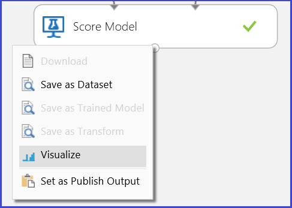
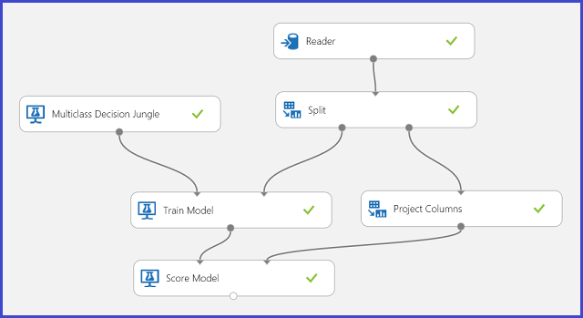

<properties
    pageTitle="Interpretar resultados de modelo no aprendizado de máquina | Microsoft Azure"
    description="Como escolher o parâmetro ideal definido para um algoritmo usando e visualizando saídas de modelo de pontuação."
    services="machine-learning"
    documentationCenter=""
    authors="bradsev"
    manager="jhubbard"
    editor="cgronlun"/>

<tags
    ms.service="machine-learning"
    ms.workload="data-services"
    ms.tgt_pltfrm="na"
    ms.devlang="na"
    ms.topic="article"
    ms.date="09/12/2016"
    ms.author="bradsev" />

# Interpretar resultados de modelo no aprendizado de máquina do Azure

Este tópico explica como visualizar e interpretar resultados de previsão no Azure Studio de aprendizado de máquina. Depois de treinamento de um modelo e feito previsões sobre elas ("marcou o modelo"), você precisa compreender e interpretar o resultado de previsão.

[AZURE.INCLUDE [machine-learning-free-trial](../../includes/machine-learning-free-trial.md)]

Há quatro tipos principais de modelos no Azure aprendizado de máquina de aprendizado de máquina:

* Classificação
* Agrupamento
* Regressão
* Sistemas de recomendação

Os módulos usados para previsão sobre esses modelos são:

* [Modelo de pontuação] [ score-model] módulo de regressão e classificação
* [Atribuir a Clusters] [ assign-to-clusters] módulo para agrupamento
* [Pontuação recomendação de Matchbox] [ score-matchbox-recommender] para sistemas de recomendação

Este documento explica como interpretar os resultados de previsão para cada um desses módulos. Para obter uma visão geral desses módulos, consulte [como escolher parâmetros para otimizar seus algoritmos no aprendizado de máquina do Azure](machine-learning-algorithm-parameters-optimize.md).

Este tópico aborda interpretação de previsão, mas não avaliação do modelo. Para obter mais informações sobre como avaliar o seu modelo, consulte [como avaliar o desempenho de modelo em aprendizado de máquina do Azure](machine-learning-evaluate-model-performance.md).

Se você estiver começando a usar o aprendizado de máquina do Azure e precisa de ajuda para criar um experimento simple para começar, consulte [criar um experimento simple no Azure Studio de aprendizado de máquina](machine-learning-create-experiment.md) no Azure Studio de aprendizado de máquina.

## Classificação ##
Há duas subcategorias de problemas de classificação:

* Problemas com apenas dois classes (classificação dois classe ou binária)
* Problemas com mais de duas classes (classe vários classificação)

Azure aprendizado de máquina tem diferentes módulos para lidar com cada um desses tipos de classificação, mas os métodos para interpretar seus resultados de previsão são semelhantes.

### Classificação de dois classe###
**Experimento de exemplo**

Um exemplo de um problema de classificação de classe dois é a classificação de flores iris. A tarefa é classificar flores iris com base em seus recursos. O conjunto de dados Iris fornecido no aprendizado de máquina do Azure é um subconjunto do [conjunto de dados Iris](http://en.wikipedia.org/wiki/Iris_flower_data_set) populares contendo instâncias de apenas duas espécies flor (classes 0 e 1). Há quatro recursos para cada flor (comprimento da sépala, largura da sépala, comprimento da pétala e largura da pétala).

Figura 1. Experimento de problema de classificação de classe dois Iris

Um experimento foi realizado para resolver esse problema, conforme mostrado na Figura 1. Um modelo de árvore de decisão aumentadas dois classe foi treinamento e marcou. Agora você pode visualizar os resultados de previsão do [Modelo de pontuação] [ score-model] módulo clicando a porta de saída do [Modelo de pontuação] [ score-model] módulo e, em seguida, clicando em **Visualizar**.

Isto traz os resultados de pontuação conforme mostrado na Figura 2.

Figura 2. Visualizar um resultado de modelo de pontuação em dois classe classificação

**Interpretação de resultado**

Há seis colunas na tabela de resultados. As quatro colunas à esquerda estão os quatro recursos. Direita duas colunas, marcou rótulos e marcou probabilidades, são os resultados de previsão. A coluna de probabilidades marcou mostra a probabilidade de que uma flor pertence à classe positiva (classe 1). Por exemplo, o primeiro número na coluna (0.028571) significa que há é 0.028571 probabilidade que a primeira flor pertence à classe 1. A coluna de rótulos marcou mostra a classe prevista para cada flor. Isso se baseia na coluna probabilidades marcou. Se probabilidade scored de uma flor for maior que 0,5, ele é previsto como classe 1. Caso contrário, ele é previsto como classe 0.

**Publicação de serviço Web**

Depois que os resultados de previsão foram compreendidos e considerados som, o experimento pode ser publicado como um serviço da web para que você possa implantá-lo em vários aplicativos e chame por ele para obter previsões de classe em qualquer novo flor iris. Para saber como alterar um experimento de treinamento em um experimento pontuação e publicá-lo como um serviço da web, consulte [publicar o serviço da web de aprendizado de máquina do Azure](machine-learning-walkthrough-5-publish-web-service.md). Esse procedimento oferece um experimento pontuação conforme mostrado na Figura 3.

Figura 3. O experimento de problema de classificação de classe dois iris de pontuação

Agora você precisa definir a entrada e saída para o serviço da web. A entrada é a porta de entrada à direita do [Modelo de pontuação][score-model], que é a flor Iris recursos de entrada. A escolha da saída depende de se você estiver interessado em classe prevista (rótulo marcou), a probabilidade scored ou ambos. Neste exemplo, será considerado que você está interessado em ambos. Para selecionar as colunas de saída desejado, use um [Selecionar colunas no conjunto de dados] [ select-columns] módulo. Clique em [Selecionar colunas no conjunto de dados][select-columns], clique em **Iniciar o seletor de coluna**e selecione **Marcou rótulos** e **Marcou probabilidades**. Após configurar a porta de saída de [Selecionar colunas no conjunto de dados] [ select-columns] e executá-lo novamente, você deve estar pronto para publicar o experimento pontuação como um serviço web, clicando em **Publicar serviço da WEB**. O experimento final se parece com Figura 4.

Figura 4. Experimento pontuação final de um problema de classificação de classe dois iris

Depois de executar o serviço da web e digite alguns valores de recurso de uma instância de teste, o resultado retorna dois números. O primeiro número é o rótulo scored e o segundo é a probabilidade de scored. Este flor é previsto como 1 de classe com probabilidade 0.9655.

Figura 5. Resultado de serviço Web de classificação de classe dois iris

### Classificação de classe vários
**Experimento de exemplo**

Nesse experimento, você executar uma tarefa de reconhecimento de letra como um exemplo de classificação multiclass. Classificador tentará prever uma letra específica (classe) com base em alguns valores de atributo escritas à mão extraídas das imagens escritas à mão.

Os dados de treinamento, existem 16 recursos extraídos de imagens de letra escritas à mão. 26 letras formam nossas 26 classes. Figura 6 mostra um experimento que treinar um modelo de classificação multiclass para o reconhecimento de letra e prever o mesmo recurso configurar em um conjunto de dados de teste.

Figura 6. Experimento de problema de classificação multiclass de reconhecimento de letra

Visualizando os resultados do [Modelo de pontuação] [ score-model] módulo clicando a porta de saída do [Modelo de pontuação] [ score-model] módulo e, em seguida, clicando em **Visualizar**, você deve ver conteúdo conforme mostrado na Figura 7.

Figura 7. Visualizar resultados de modelo de pontuação em uma classificação de classe vários

**Interpretação de resultado**

As colunas de 16 esquerdas representam os valores de recurso do conjunto de teste. As colunas com nomes como marcou probabilidades classe "XX" estão apenas como a coluna de probabilidades marcou no caso dois classe. Eles mostram a probabilidade de que a entrada correspondente se encaixa em uma determinada classe. Por exemplo, para a primeira entrada, há probabilidade 0.003571 que é um "A," probabilidade 0.000451 que é um "B" e assim por diante. A última coluna (marcou rótulos) é a mesma que marcou rótulos no caso dois classe. Seleciona a classe com maior probabilidade scored como a classe prevista da entrada correspondente. Por exemplo, para a primeira entrada, o rótulo scored é "F", pois ele tem a maior probabilidade seja um "F" (0.916995).

**Publicação de serviço Web**

Você também pode chegar a etiqueta scored para cada entrada e a probabilidade da etiqueta scored. A lógica básica é encontrar a probabilidade maior entre todas as probabilidades scored. Para fazer isso, você precisa usar o [Executar scripts de R] [ execute-r-script] módulo. O código de R é mostrado na Figura 8 e o resultado da experiência é mostrado na Figura 9.

Figura 8. Código de R para extrair as associadas probabilidades dos rótulos e marcou rótulos

Figura 9. Experimento pontuação final do problema classificação multiclass reconhecimento de letra

Depois que você publicar e execute o serviço da web e digite alguns valores de recurso de entrada, o resultado retornado parece Figura 10. Esta carta escritas à mão, com seus recursos de 16 extraídos, é prevista seja um "T" com probabilidade 0.9715.

Figura 10. Resultado de serviço Web de classificação multiclass

## Regressão

Problemas de regressão são diferentes dos problemas de classificação. Em um problema de classificação, que você está tentando prever classes distintas, como qual classe uma flor iris pertence. Mas, como você pode ver no exemplo a seguir de um problema de regressão, que você está tentando prever uma variável contínua, como o preço de um carro.

**Experimento de exemplo**

Use previsão de automóvel preço como um exemplo de regressão. Você está tentando prever o preço de um carro com base em seus recursos, incluindo tornar, tipo de combustível, tipo de corpo e roda de unidade. O experimento é mostrado na Figura 11.

Figura 11. Experimento de problema de regressão preço automóvel

Visualizando o [Modelo de pontuação] [ score-model] módulo, o resultado se parece com Figura 12.

Figura 12. Resultado de pontuação para o problema de previsão de preço de automóvel

**Interpretação de resultado**

Rótulos de marcados é a coluna de resultado neste resultado pontuação. Os números são o preço previsto para cada carro.

**Publicação de serviço Web**

Você pode publicar o experimento de regressão em um serviço da web e chame-a para previsão de automóvel preço da mesma maneira como o caso de uso de classificação de classe dois.

Figura 13. Pontuação experimento de um problema de regressão preço automóvel

Executando o serviço da web, o resultado se parece com Figura 14. O preço previsto para este carro é r $15,085.52.

Figura 14. Resultado de serviço Web de um problema de regressão preço automóvel

## Agrupamento

**Experimento de exemplo**

Vamos usar o conjunto de dados Iris novamente para criar um cluster experimento. Aqui você pode filtrar as etiquetas de classe no conjunto de dados para que ele só tem recursos e pode ser usado para agrupamento. Neste iris caso de uso, especifique o número de clusters para ser dois durante o processo de treinamento, o que significa que você faria cluster das flores em duas classes. O experimento é mostrado na Figura 15.

Figura 15. Experimente problema cluster Iris

Agrupamento difere classificação em que o conjunto de dados de treinamento não tem rótulos de terra verdade por si só. Grupos de clusters as instâncias de conjunto de dados de treinamento em clusters distintos. Durante o processo de treinamento, o modelo de etiquetas as entradas aprendendo as diferenças entre seus recursos. Depois disso, o modelo de treinamento pode ser usado para classificar ainda mais entradas futuras. Há duas partes do resultado que estamos interessados dentro de um problema de agrupamento. A primeira parte é rotular o conjunto de dados de treinamento e o segundo está classificando um novo conjunto de dados com o modelo de treinamento.

A primeira parte do resultado poderão ser visualizada clicando a porta de saída à esquerda do [Modelo de agrupamento de trem] [ train-clustering-model] e, em seguida, clicando em **Visualizar**. A visualização é mostrada na Figura 16.

Figura 16. Visualizar cluster resultado para o conjunto de dados de treinamento

O resultado da segunda parte, cluster novas entradas com o modelo de cluster treinamento, é mostrado na Figura 17.

Figura 17. Visualizar cluster resultado em um novo conjunto de dados

**Interpretação de resultado**

Embora os resultados das duas partes se originam de experimento diferentes estágios, eles têm a mesma aparência e são interpretados da mesma forma. As quatro primeiras colunas são recursos. A última coluna, atribuições, é o resultado de previsão. As entradas atribuídas o mesmo número são previstas estejam no mesmo cluster, ou seja, que eles tenham semelhanças de alguma maneira (esse experimento usa a métrica de distância Euclidean padrão). Porque você especificou o número de clusters 2, as entradas em atribuições são rotuladas 0 ou 1.

**Publicação de serviço Web**

Você pode publicar o experimento cluster em um serviço da web e chame-a para agrupamento previsões caso de uso da mesma maneira como a classificação de dois classe.

Figura 18. Pontuação experimento de um problema de cluster iris

Após executar o serviço da web, o resultado se parece com figura 19. Este flor é previsto estar em cluster 0.

Figura 19. Resultado de serviço Web de classificação de classe dois iris

## Sistema de recomendação
**Experimento de exemplo**

Para sistemas de recomendação, você pode usar o problema de recomendação do restaurante como um exemplo: você pode recomendar restaurantes para clientes com base em seu histórico de classificação. Os dados de entrada consistem em três partes:

* Classificações de restaurante de clientes
* Dados de recurso do cliente
* Dados de recurso do restaurante

Há várias coisas que podemos fazer com o [Trem Matchbox recomendação] [ train-matchbox-recommender] módulo no aprendizado de máquina do Azure:

- Prever classificações de um determinado usuário e o item
- Recomendamos itens para um determinado usuário
- Localizar usuários relacionados a um determinado usuário
- Localizar itens relacionados a um determinado item

Você pode escolher o que você deseja fazer selecionando-as quatro opções no menu **tipo de previsão de recomendação** . Aqui você pode percorrer todas as quatro cenários.

Um típico experimento de aprendizado de máquina do Azure para um sistema de recomendação se parece com figura 20. Para obter informações sobre como usar esses módulos do sistema de recomendação, consulte [recomendação de matchbox trem] [ train-matchbox-recommender] e [recomendação de matchbox de pontuação][score-matchbox-recommender].

Figura 20. Experimento de sistema de recomendação

**Interpretação de resultado**

**Prever classificações de um determinado usuário e o item**

Selecionando a **Previsão de classificação** em **tipo de previsão de recomendação**, você está fazendo o sistema de recomendação prever a classificação de um determinado usuário e o item. A visualização da [Pontuação Matchbox recomendação] [ score-matchbox-recommender] saída aparência Figura 21.

Figura 21. Visualizar o resultado de pontuação do sistema recomendação – previsão de classificação

As duas primeiras colunas são os pares de item de usuário fornecidos pelos dados de entrada. A terceira coluna é a classificação prevista de um usuário para um determinado item. Por exemplo, na primeira linha, cliente U1048 é previsto para restaurante taxa 135026 como 2.

**Recomendamos itens para um determinado usuário**

Selecionando **Recomendação de Item** em **tipo de previsão de recomendação**, você está solicitando o sistema de recomendação recomendar itens para um determinado usuário. O último parâmetro para escolher neste cenário é *recomendado item seleção*. A opção **De classificados itens (para avaliação de modelo)** é principalmente para avaliação do modelo durante o processo de treinamento. Para esse estágio de previsão, escolhemos **De todos os itens**. A visualização da [Pontuação Matchbox recomendação] [ score-matchbox-recommender] saída aparência Figura 22.

Figura 22. Visualizar resultado de pontuação do sistema recomendação - recomendação de item

A primeira das colunas de seis representa o usuário determinado IDs recomendar itens, conforme fornecido pelos dados de entrada. As outras cinco colunas representam os itens recomendados para o usuário em ordem decrescente de relevância. Por exemplo, na primeira linha, o restaurante mais recomendado para cliente U1048 é 134986, seguido por 135018, 134975, 135021 e 132862.

**Localizar usuários relacionados a um determinado usuário**

Selecionando **Usuários relacionados** em **tipo de previsão de recomendação**, você está solicitando o sistema de recomendação para localizar usuários relacionados a um determinado usuário. Usuários relacionados são os usuários que têm preferências semelhantes. O último parâmetro para escolher neste cenário é *seleção de usuário relacionado*. A opção **De usuários que classificada como itens (para avaliação de modelo)** é principalmente para avaliação do modelo durante o processo de treinamento. Escolha **De todos os usuários** para esse estágio de previsão. A visualização da [Pontuação Matchbox recomendação] [ score-matchbox-recommender] saída aparência Figura 23.

Figura 23. Visualizar resultados de pontuação do sistema recomendação – usuários relacionados

A primeira das colunas de seis mostra o usuário determinado que IDs necessários para localizar usuários relacionados, conforme fornecido pela entrada de dados. As outras cinco colunas armazenam os usuários relacionados previstos do usuário em ordem decrescente de relevância. Por exemplo, na primeira linha, o cliente mais relevante para cliente U1048 é U1051, seguido por U1066, U1044, U1017 e U1072.

**Localizar itens relacionados a um determinado item**

Selecionando **Itens relacionados** em **tipo de previsão de recomendação**, você está fazendo o sistema de recomendação para encontrar itens relacionados a um determinado item. Itens relacionados são os itens mais probabilidade de ser curtiu pelo mesmo usuário. O último parâmetro para escolher neste cenário é *seleção de item relacionado*. A opção **De classificados itens (para avaliação de modelo)** é principalmente para avaliação do modelo durante o processo de treinamento. Escolhemos **De todos os itens** deste estágio de previsão. A visualização da [Pontuação Matchbox recomendação] [ score-matchbox-recommender] saída aparência Figura 24.

Figura 24. Visualizar resultados de pontuação do sistema recomendação – itens relacionados

A primeira das colunas de seis representa determinado item IDs necessários para localizar itens relacionados, conforme fornecido pelos dados de entrada. As outras cinco colunas armazenam os itens relacionados previstos do item na ordem em termos de relevância descendente. Por exemplo, na primeira linha, o item mais relevante para item 135026 é 135074, seguido por 135035, 132875, 135055 e 134992.

**Publicação de serviço Web**

O processo de publicação essas experiências como serviços da web para obter previsões é semelhante para cada um dos quatro cenários. Aqui, podemos levar o segundo cenário (recomendamos itens para um determinado usuário) como um exemplo. Você pode seguir o mesmo procedimento com as outras três.

Salvando o sistema de recomendação treinamento como um modelo de treinamento e filtrando os dados de entrada a uma coluna de ID de usuário único como solicitado, você pode ligar o experimento como Figura 25 e publicá-lo como um serviço da web.

Figura 25. Experimento do problema restaurante recomendação de pontuação

Executando o serviço da web, o resultado se parece com Figura 26. As cinco restaurantes recomendados para usuário U1048 são 134986, 135018, 134975, 135021 e 132862.

Figura 26. Resultado de serviço Web de problema de recomendação de restaurante

<!-- Module References -->
[assign-to-clusters]: https://msdn.microsoft.com/library/azure/eed3ee76-e8aa-46e6-907c-9ca767f5c114/
[execute-r-script]: https://msdn.microsoft.com/library/azure/30806023-392b-42e0-94d6-6b775a6e0fd5/
[select-columns]: https://msdn.microsoft.com/library/azure/1ec722fa-b623-4e26-a44e-a50c6d726223/
[score-matchbox-recommender]: https://msdn.microsoft.com/library/azure/55544522-9a10-44bd-884f-9a91a9cec2cd/
[score-model]: https://msdn.microsoft.com/library/azure/401b4f92-e724-4d5a-be81-d5b0ff9bdb33/
[train-clustering-model]: https://msdn.microsoft.com/library/azure/bb43c744-f7fa-41d0-ae67-74ae75da3ffd/
[train-matchbox-recommender]: https://msdn.microsoft.com/library/azure/fa4aa69d-2f1c-4ba4-ad5f-90ea3a515b4c/
