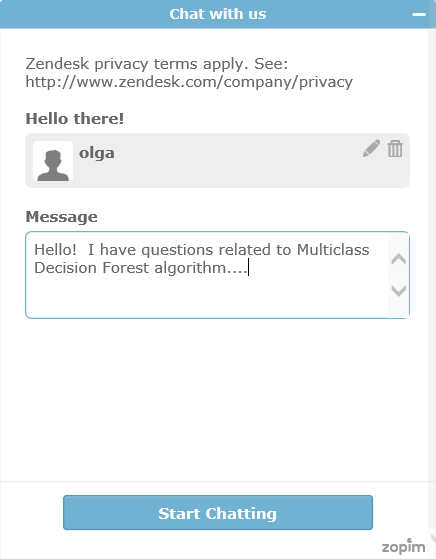

<properties 
    pageTitle="Obtenha ajuda do suporte de bate-papo da Live do máquina Learning | Microsoft Azure" 
    description="Obtenha ajuda em tempo real para aprendizado de máquina na nuvem com o recurso de suporte de bate-papo Live." 
    services="machine-learning" 
    documentationCenter="" 
    authors="garyericson" 
    manager="opapel" 
    editor="cgronlun"/>
<tags 
    ms.service="machine-learning" 
    ms.workload="data-services" 
    ms.tgt_pltfrm="na" 
    ms.devlang="na" 
    ms.topic="article" 
    ms.date="09/29/2016" 
    ms.author="garye"/>
#Obtenha ajuda do suporte de bate-papo da Live do máquina Learning

[Studio de aprendizado de máquina do Azure](machine-learning-what-is-ml-studio.md) fornece uma interface intuitiva para a criação de modelos de aprendizado de máquina. Não há uma [Galeria](machine-learning-gallery-how-to-use-contribute-publish.md) e [fóruns](https://social.msdn.microsoft.com/forums/azure/home?forum=MachineLearning) para orientá-lo ao longo dessa forma. 

Mas, às vezes, você só precisa fazer uma pergunta rápida para desbloquear você. No Visual [Studio](machine-learning-what-is-ml-studio.md) para o ícone de bate-papo no painel de navegação superior.  Se você vir este ícone, significa que um membro da equipe do produto está online para ajudá-lo em tempo real.

Digite sua pergunta e obtenha suas respostas!

## Não vejo o ícone de bate-papo Live?
Membros da equipe são realmente respondendo sua pergunta. Se você não vir o ícone de chat ao vivo é porque ela não estiver visível fora do horário de trabalho. 

[AZURE.INCLUDE [machine-learning-free-trial](../../includes/machine-learning-free-trial.md)] 
