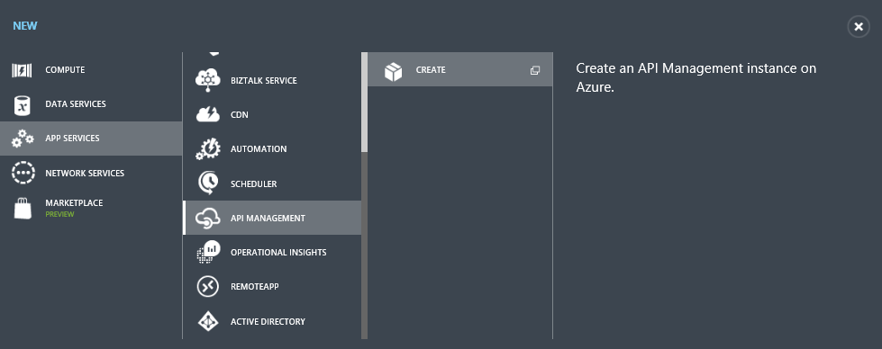

<properties
    pageTitle="Saiba como gerenciar AzureML web services usando o gerenciamento de API | Microsoft Azure"
    description="Um guia mostrando como gerenciar AzureML web services usando o gerenciamento de API."
    keywords="gerenciamento de api, aprendizado de máquina"
    services="machine-learning"
    documentationCenter=""
    authors="roalexan"
    manager="jhubbard"
    editor=""/>

<tags
    ms.service="machine-learning"
    ms.workload="data-services"
    ms.tgt_pltfrm="na"
    ms.devlang="na"
    ms.topic="article"
    ms.date="09/16/2016"
    ms.author="roalexan" />

# Saiba como gerenciar AzureML web services usando o gerenciamento de API

##Visão geral

Este guia mostra como começar rapidamente usando o gerenciamento de API para gerenciar seus serviços da web de AzureML.

##O que é gerenciamento de API do Azure?

Gerenciamento de API Azure é um serviço Azure que permite que você gerencie seus pontos de extremidade de API REST definindo o acesso do usuário, a otimização de uso e monitoramento de painel. Clique [aqui](https://azure.microsoft.com/services/api-management/) para obter detalhes sobre gerenciamento de API do Azure. Clique [aqui](../api-management/api-management-get-started.md) para obter um guia sobre como começar com o gerenciamento de API do Azure. Este guia outro, que este guia se baseia, abrange mais tópicos, incluindo configurações de notificação, preços de camada, manipulação de resposta, autenticação do usuário, a criação de produtos, assinaturas de desenvolvedor e criação de painéis de uso.

##O que é AzureML?

AzureML é um serviço Azure para aprendizado de máquina que permite que você facilmente criar, implantar e compartilhe soluções de análise avançada. Clique [aqui](https://azure.microsoft.com/services/machine-learning/) para obter detalhes sobre AzureML.

##Pré-requisitos

Para concluir este guia, você precisa:

* Uma conta do Azure. Se você não tiver uma conta do Azure, clique [aqui](https://azure.microsoft.com/pricing/free-trial/) para obter detalhes sobre como criar uma conta de avaliação gratuita.
* Uma conta de AzureML. Se você não tiver uma conta de AzureML, clique [aqui](https://studio.azureml.net/) para obter detalhes sobre como criar uma conta de avaliação gratuita.
* O espaço de trabalho, o serviço e api_key para um experimento AzureML implantado como um serviço da web. Clique [aqui](machine-learning-create-experiment.md) para obter detalhes sobre como criar um experimento AzureML. Clique [aqui](machine-learning-publish-a-machine-learning-web-service.md) para obter detalhes sobre como implantar um experimento AzureML como um serviço web. Como alternativa, Apêndice A possui instruções sobre como criar e testar um experimento AzureML simple e implantá-lo como um serviço web.

##Criar uma instância de gerenciamento de API

Abaixo estão as etapas para usar o gerenciamento de API para gerenciar seu serviço da web AzureML. Primeiro, crie uma instância do serviço. Faça logon no [Portal clássico](https://manage.windowsazure.com/) e clique em **novo** > **Os serviços de aplicativo** > **Gerenciamento de API** > **criar**.

Especifique uma **URL**de exclusiva. Este guia usa **demoazureml** – você precisará escolher algo diferente. Escolha a **assinatura** e **região** desejada para sua instância de serviço. Depois de fazer suas seleções, clique no botão Avançar.

Especifique um valor para o **Nome da organização**. Este guia usa **demoazureml** – você precisará escolher algo diferente. Insira seu endereço de email no campo **email do administrador** . Este endereço de email é usado para notificações do sistema de gerenciamento de API.

Clique na caixa de seleção para criar a instância de serviço. *Demora até 30 minutos para um novo serviço a ser criado*.

##Criar a API

Depois que a instância do serviço é criada, a próxima etapa é criar a API. Uma API consiste em um conjunto de operações que podem ser chamados de um aplicativo cliente. Operações de API são proxies para serviços da web existentes. Este guia cria APIs que proxy para os serviços de web AzureML RRS e BES existentes.

APIs são criadas e configurados a partir do portal de fornecedor API, que é acessado por meio do Portal de clássico do Azure. Para acessar o portal do publisher, selecione a instância de serviço.

Clique em **Gerenciar** no Portal de clássico do Azure para o serviço de gerenciamento de API.

Clique em **APIs** no menu de **Gerenciamento de API** à esquerda e clique em **Adicionar API**.

Digite **API de demonstração de AzureML** como o **nome da API de Web**. Digite **https://ussouthcentral.services.azureml.net** como a **URL do serviço Web**. Digite **azureml demonstração** como o **sufixo de URL da Web API**. Marque **HTTPS** como o esquema de **URL da Web API** . Selecione **Starter** como **produtos**. Quando terminar, clique em **Salvar** para criar a API.

##Adicionar as operações

Clique em **Adicionar operação** para adicionar operações para esta API.

A janela **nova operação** será exibida e na guia **assinatura** será selecionada por padrão.

##Adicionar operação de RR

Primeiro, crie uma operação para o serviço de AzureML RRS. Selecione **POSTAGEM** como o **verbo HTTP**. Tipo de **/services/ /workspaces/ {workspace} {serviço} / execute?api versão = {apiversion} & detalhes = {detalhes}** como o **modelo de URL**. Digite **RR executar** como o **nome de exibição**.

Clique em **respostas** > **Adicionar** à esquerda e selecione **200 Okey**. Clique em **Salvar** para salvar esta operação.

##Adicionar operações de BES

Capturas de tela não são incluídas para as operações de BES como elas são muito semelhantes aos perfis para adicionar a operação de RR.

###Enviar (mas não iniciar) um trabalho de execução em lotes

Clique em **Adicionar operação** para adicionar a operação de AzureML BES à API. Selecione **postar** para o **verbo HTTP**. Tipo de **/services/ /workspaces/ {workspace} {serviço} / jobs?api versão = {apiversion}** para o **modelo de URL**. Digite **BES enviar** para o **nome de exibição**. Clique em **respostas** > **Adicionar** à esquerda e selecione **200 Okey**. Clique em **Salvar** para salvar esta operação.

###Iniciar um trabalho de execução em lotes

Clique em **Adicionar operação** para adicionar a operação de AzureML BES à API. Selecione **postar** para o **verbo HTTP**. Tipo de **/jobs/ de /services/ {serviço} /workspaces/ {workspace} {jobid} / start?api versão = {apiversion}** para o **modelo de URL**. Digite **BES iniciar** para o **nome de exibição**. Clique em **respostas** > **Adicionar** à esquerda e selecione **200 Okey**. Clique em **Salvar** para salvar esta operação.

###Obtenha o status ou o resultado de um trabalho de execução em lotes

Clique em **Adicionar operação** para adicionar a operação de AzureML BES à API. Selecione **obter** para o **verbo HTTP**. Tipo de **/workspaces/ {workspace} {serviço} /services/ ?api /jobs/ {jobid} versão = {apiversion}** para o **modelo de URL**. Digite **BES Status** para o **nome de exibição**. Clique em **respostas** > **Adicionar** à esquerda e selecione **200 Okey**. Clique em **Salvar** para salvar esta operação.

###Excluir um trabalho de execução em lotes

Clique em **Adicionar operação** para adicionar a operação de AzureML BES à API. Selecione **Excluir** para o **verbo HTTP**. Tipo de **/workspaces/ {workspace} {serviço} /services/ ?api /jobs/ {jobid} versão = {apiversion}** para o **modelo de URL**. Digite **BES excluir** para o **nome de exibição**. Clique em **respostas** > **Adicionar** à esquerda e selecione **200 Okey**. Clique em **Salvar** para salvar esta operação.

##Chamar uma operação de Portal do desenvolvedor

Operações podem ser chamadas diretamente do portal do desenvolvedor, que fornece uma maneira conveniente para visualizar e testar as operações de uma API. Nesta etapa guia você chamará o método **RR executar** que foi adicionado à **API de demonstração AzureML**. Clique em **portal do desenvolvedor** do menu na parte superior direita do Portal do clássico.

Clique em **APIs** do menu superior e clique em **AzureML API de demonstração** para ver as operações disponíveis.

Selecione **Executar RR** para a operação. Clique em **experimentá-lo**.

Parâmetros de solicitação, digite seu **espaço de trabalho**, **serviço**, **2.0** para o **apiversion**e **true** para os **detalhes**. Você pode encontrar seu **espaço de trabalho** e o **serviço** no painel de serviço da web AzureML (consulte **testar o serviço da web** no Apêndice A).

Para cabeçalhos de solicitação, clique em **Adicionar cabeçalho** e digite o **Tipo de conteúdo** e **aplicativo/json**, e em seguida, clique em **Adicionar cabeçalho** e digite **autorização** e **portador <YOUR AZUREML SERVICE API-KEY> **. Você pode encontrar sua **chave api** no painel de serviço da web AzureML (consulte **testar o serviço da web** no Apêndice A).

Tipo de **{"Entradas": {"input1": {"ColumnNames": ["Col2"], "valores": [["Esse é um bom dia"]]}}, "GlobalParameters": {}}** para o corpo da solicitação.

Clique em **Enviar**.

Depois de uma operação é invocada, o portal do desenvolvedor exibe a **URL solicitada** do serviço de back-end, o **status de resposta**, os **cabeçalhos de resposta**e qualquer **conteúdo de resposta**.

##Apêndice A - criar e testar uma AzureML simple serviço web

###Criando o experimento

Abaixo estão as etapas para criar um experimento AzureML simple e implantá-lo como um serviço web. A leva de serviço web como uma coluna de texto aleatório de entrada e retorna um conjunto de recursos representado como inteiros. Por exemplo:

Texto | Texto hash
--- | ---
Este é um bom dia | 1 1 2 2 0 2 0 1

Primeiro, usando um navegador de sua escolha, navegue até: [https://studio.azureml.net/](https://studio.azureml.net/) e insira suas credenciais para fazer logon no. Em seguida, crie um novo experimento em branco.

Renomeá-lo para **SimpleFeatureHashingExperiment**. Expanda **Conjuntos de dados salvo** e arraste **Revisões de livros da Amazon** para seu experimento.

Expanda a **Transformação de dados** e **manipulação** e arraste **Selecionar colunas no Dataset** para seu experimento. Conecte **revisões de livros da Amazon** para **Selecionar colunas no conjunto de dados**.

Clique em **Selecionar colunas em Dataset** **Iniciar seletor de coluna** e clique selecione **Col2**. Clique na marca de seleção para aplicar essas alterações.

Expanda **A análise de texto** e arraste **O hash recurso** o experimento. Conecte a **Selecionar colunas em Dataset** ao **recurso hash**.

Digite **3** para o **Hashing bitsize**. Isso criará 8 (23) colunas.

Neste ponto, talvez você queira clique em **Executar** para testar o experimento.

###Criar um serviço web

Agora crie um serviço web. Expanda o **Serviço da Web** e arraste a **entrada** para seu experimento. Conecte a **entrada** ao **recurso hash**. Também arraste a **saída** para o seu experimento. Conecte a **saída** ao **recurso hash**.

Clique em **Publicar web service**.

Clique em **Sim** para publicar o experimento.

###Testar o serviço web

Um serviço da web AzureML consiste em RSS (serviço de solicitação/resposta) e pontos de extremidade do BES (serviço de execução de lote). RSS é para execução síncrona. BES destina-se a execução do trabalho assíncrono. Para testar seu serviço da web com a fonte de Python de exemplo abaixo, talvez seja necessário baixar e instalar o SDK do Azure para Python (consulte: [como instalar o Python](../python-how-to-install.md)).

Você precisará também o **espaço de trabalho**, **o serviço**e **api_key** de seu experimento para a fonte de exemplo abaixo. Você pode encontrar o serviço e o espaço de trabalho clicando em **Solicitação/resposta** ou **Execução em lotes** para seu experimento no painel de serviço web.

Você pode encontrar o **api_key** clicando em seu experimento no painel de serviço web.

####Ponto de extremidade de RR de teste

#####Botão de teste

Uma maneira fácil de testar o ponto de extremidade de RR é clicar em **Testar** no painel de serviço da web.

Digite **Este é um bom dia** **col2**. Clique na marca de seleção.

Você verá algo parecido com

#####Código de exemplo

Outra maneira de testar seu RR é do seu código de cliente. Se você clicar em **solicitação/resposta** no painel e role até o final, você verá o código de amostra para c#, Python e R. Você também verá a sintaxe da solicitação RR, incluindo a solicitação URI, cabeçalhos e o corpo.

Este guia mostra um exemplo de Python de trabalho. Você precisará modificá-lo com o **espaço de trabalho**, **o serviço**e **api_key** de seu experimento.

    import urllib2
    import json
    workspace = "<REPLACE WITH YOUR EXPERIMENT’S WEB SERVICE WORKSPACE ID>"
    service = "<REPLACE WITH YOUR EXPERIMENT’S WEB SERVICE SERVICE ID>"
    api_key = "<REPLACE WITH YOUR EXPERIMENT’S WEB SERVICE API KEY>"
    data = {
    "Inputs": {
        "input1": {
            "ColumnNames": ["Col2"],
            "Values": [ [ "This is a good day" ] ]
        },
    },
    "GlobalParameters": { }
    }
    url = "https://ussouthcentral.services.azureml.net/workspaces/" + workspace + "/services/" + service + "/execute?api-version=2.0&details=true"
    headers = {'Content-Type':'application/json', 'Authorization':('Bearer '+ api_key)}
    body = str.encode(json.dumps(data))
    try:
        req = urllib2.Request(url, body, headers)
        response = urllib2.urlopen(req)
        result = response.read()
        print "result:" + result
            except urllib2.HTTPError, error:
        print("The request failed with status code: " + str(error.code))
        print(error.info())
        print(json.loads(error.read()))

####Ponto de extremidade do teste BES
Clique em **execução em lotes** no painel e role até o final. Você verá o código de amostra para c#, Python e R. Você também verá a sintaxe das solicitações BES para enviar um trabalho, iniciar um trabalho, obtenha o status ou os resultados de um trabalho e excluir um trabalho.

Este guia mostra um exemplo de Python de trabalho. Você precisa modificá-lo com o **espaço de trabalho**, **o serviço**e **api_key** de seu experimento. Além disso, é necessário modificar o **nome da conta de armazenamento**, **chave da conta de armazenamento**e **o nome de contêiner de armazenamento**. Por fim, você precisará modificar o local do **arquivo de entrada** e o local do **arquivo de saída**.

    import urllib2
    import json
    import time
    from azure.storage import *
    workspace = "<REPLACE WITH YOUR WORKSPACE ID>"
    service = "<REPLACE WITH YOUR SERVICE ID>"
    api_key = "<REPLACE WITH THE API KEY FOR YOUR WEB SERVICE>"
    storage_account_name = "<REPLACE WITH YOUR AZURE STORAGE ACCOUNT NAME>"
    storage_account_key = "<REPLACE WITH YOUR AZURE STORAGE KEY>"
    storage_container_name = "<REPLACE WITH YOUR AZURE STORAGE CONTAINER NAME>"
    input_file = "<REPLACE WITH THE LOCATION OF YOUR INPUT FILE>" # Example: C:\\mydata.csv
    output_file = "<REPLACE WITH THE LOCATION OF YOUR OUTPUT FILE>" # Example: C:\\myresults.csv
    input_blob_name = "mydatablob.csv"
    output_blob_name = "myresultsblob.csv"
    def printHttpError(httpError):
    print("The request failed with status code: " + str(httpError.code))
    print(httpError.info())
    print(json.loads(httpError.read()))
    return
    def saveBlobToFile(blobUrl, resultsLabel):
    print("Reading the result from " + blobUrl)
    try:
        response = urllib2.urlopen(blobUrl)
    except urllib2.HTTPError, error:
        printHttpError(error)
        return
    with open(output_file, "w+") as f:
        f.write(response.read())
    print(resultsLabel + " have been written to the file " + output_file)
    return
    def processResults(result):
    first = True
    results = result["Results"]
    for outputName in results:
        result_blob_location = results[outputName]
        sas_token = result_blob_location["SasBlobToken"]
        base_url = result_blob_location["BaseLocation"]
        relative_url = result_blob_location["RelativeLocation"]
        print("The results for " + outputName + " are available at the following Azure Storage location:")
        print("BaseLocation: " + base_url)
        print("RelativeLocation: " + relative_url)
        print("SasBlobToken: " + sas_token)
        if (first):
            first = False
            url3 = base_url + relative_url + sas_token
            saveBlobToFile(url3, "The results for " + outputName)
    return

    def invokeBatchExecutionService():
    url = "https://ussouthcentral.services.azureml.net/workspaces/" + workspace +"/services/" + service +"/jobs"
    blob_service = BlobService(account_name=storage_account_name, account_key=storage_account_key)
    print("Uploading the input to blob storage...")
    data_to_upload = open(input_file, "r").read()
    blob_service.put_blob(storage_container_name, input_blob_name, data_to_upload, x_ms_blob_type="BlockBlob")
    print "Uploaded the input to blob storage"
    input_blob_path = "/" + storage_container_name + "/" + input_blob_name
    connection_string = "DefaultEndpointsProtocol=https;AccountName=" + storage_account_name + ";AccountKey=" + storage_account_key
    payload =  {
        "Input": {
            "ConnectionString": connection_string,
            "RelativeLocation": input_blob_path
        },
        "Outputs": {
            "output1": { "ConnectionString": connection_string, "RelativeLocation": "/" + storage_container_name + "/" + output_blob_name },
        },
        "GlobalParameters": {
        }
    }
        body = str.encode(json.dumps(payload))
    headers = { "Content-Type":"application/json", "Authorization":("Bearer " + api_key)}
    print("Submitting the job...")
    # submit the job
    req = urllib2.Request(url + "?api-version=2.0", body, headers)
    try:
        response = urllib2.urlopen(req)
    except urllib2.HTTPError, error:
        printHttpError(error)
        return
    result = response.read()
    job_id = result[1:-1] # remove the enclosing double-quotes
    print("Job ID: " + job_id)
    # start the job
    print("Starting the job...")
    req = urllib2.Request(url + "/" + job_id + "/start?api-version=2.0", "", headers)
    try:
        response = urllib2.urlopen(req)
    except urllib2.HTTPError, error:
        printHttpError(error)
        return
    url2 = url + "/" + job_id + "?api-version=2.0"

    while True:
        print("Checking the job status...")
        # If you are using Python 3+, replace urllib2 with urllib.request in the follwing code
        req = urllib2.Request(url2, headers = { "Authorization":("Bearer " + api_key) })
        try:
            response = urllib2.urlopen(req)
        except urllib2.HTTPError, error:
            printHttpError(error)
            return
        result = json.loads(response.read())
        status = result["StatusCode"]
        print "status:" + status
        if (status == 0 or status == "NotStarted"):
            print("Job " + job_id + " not yet started...")
        elif (status == 1 or status == "Running"):
            print("Job " + job_id + " running...")
        elif (status == 2 or status == "Failed"):
            print("Job " + job_id + " failed!")
            print("Error details: " + result["Details"])
            break
        elif (status == 3 or status == "Cancelled"):
            print("Job " + job_id + " cancelled!")
            break
        elif (status == 4 or status == "Finished"):
            print("Job " + job_id + " finished!")
            processResults(result)
            break
        time.sleep(1) # wait one second
    return
    invokeBatchExecutionService()
