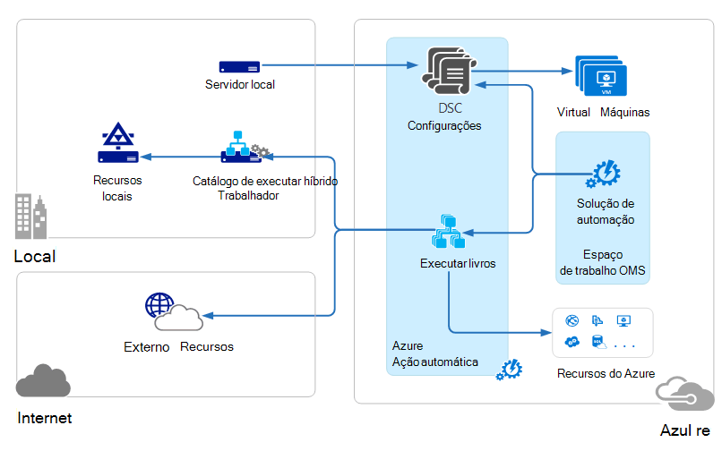

<properties 
   pageTitle="Arquitetura de pacote de gerenciamento (OMS) operações | Microsoft Azure"
   description="Pacote de gerenciamento de operações da Microsoft (OMS) é na nuvem solução de gerenciamento da Microsoft que ajuda você a gerenciar e proteger seu local e infraestrutura de nuvem.  Este artigo identifica diferentes serviços incluídos no OMS e fornece links para o seu conteúdo detalhado."
   services="operations-management-suite"
   documentationCenter=""
   authors="bwren"
   manager="jwhit"
   editor="tysonn" />
<tags 
   ms.service="operations-management-suite"
   ms.devlang="na"
   ms.topic="get-started-article"
   ms.tgt_pltfrm="na"
   ms.workload="infrastructure-services"
   ms.date="10/27/2016"
   ms.author="bwren" />

# Arquitetura OMS

[Pacote de gerenciamento de operações (OMS)](https://azure.microsoft.com/documentation/services/operations-management-suite/) é um conjunto de serviços baseados na nuvem para o gerenciamento de seu local e na nuvem ambientes.  Este artigo descreve os locais diferentes e componentes de nuvem do OMS e sua arquitetura de computação de alto nuvem nível.  Você pode consultar a documentação para cada serviço para obter mais detalhes.

## Análise de log

Todos os dados coletados pela [Análise de Log](https://azure.microsoft.com/documentation/services/log-analytics/) é armazenado no repositório OMS que está hospedado no Azure.  Fontes conectadas geram dados coletados para o repositório OMS.  Há três tipos de fontes conectadas com suporte.

- Um agente instalado em um computador [Windows](../log-analytics/log-analytics-windows-agents.md) ou [Linux](../log-analytics/log-analytics-linux-agents.md) conectado diretamente ao OMS.
- Um grupo de gerenciamento System Center Operations Manager (SCOM) [conectada a análise de Log](../log-analytics/log-analytics-om-agents.md) .  Agentes SCOM continuam para se comunicar com os servidores de gerenciamento que encaminham eventos e dados de desempenho para análise de Log.
- Uma [conta de armazenamento do Azure](../log-analytics/log-analytics-azure-storage.md) que coleta de dados de [Diagnóstico do Azure](../cloud-services/cloud-services-dotnet-diagnostics.md) uma função de trabalho, função web ou máquina virtual no Azure.

Fontes de dados definem os dados que a análise de Log de coleta de fontes conectadas, incluindo logs de eventos e contadores de desempenho.  Soluções adicionam funcionalidade ao OMS e facilmente podem ser adicionadas ao seu espaço de trabalho na [Galeria de soluções do OMS](../log-analytics/log-analytics-add-solutions.md).  Algumas soluções podem precisar de uma conexão direta para a análise de Log de agentes SCOM enquanto outras pessoas podem exigir um agente adicional ser instalado.

Análise de log tem um portal baseado na web que você pode usar para gerenciar recursos OMS, adicionar e configurar soluções OMS, exibir e analisar dados no repositório OMS.

## Automação Azure

[Automação do Azure runbooks](http://azure.microsoft.com/documentation/services/automation) são executados na nuvem Azure e podem acessar os recursos que estão no Azure, em outros serviços de nuvem ou acessíveis da Internet pública.  Você também pode designar máquinas locais no seu centro de dados local usando [Híbrido Runbook trabalhador](../automation/automation-hybrid-runbook-worker.md) para que runbooks possa acessar recursos locais.

[Configurações de DSC](../automation/automation-dsc-overview.md) armazenadas em automação Azure podem ser aplicadas diretamente ao Azure máquinas virtuais.  Outras máquinas físicas e virtuais pode solicitar configurações do servidor de recepção de DSC de automação do Azure.

Automação Azure possui uma solução OMS que exibe as estatísticas e links para iniciar o portal do Azure para qualquer operação.

## Backup Azure

Dados protegidos no [Azure Backup](http://azure.microsoft.com/documentation/services/backup) são armazenados em um cofre backup localizado em uma determinada região geográfica.  Os dados são replicados dentro da mesma região e, dependendo do tipo de cofre, também podem ser replicados para outra região para ainda mais redundância.

Backup Azure tem três cenários fundamentais.

- Computador Windows com o agente de Backup do Azure.  Isso permite que você pastas e arquivos de backup de qualquer cliente Windows server ou diretamente para o seu cofre backup Azure.  
- Gerenciador de proteção de dados do System Center (DPM) ou o servidor de Backup do Microsoft Azure. Isso permite que você aproveite DPM ou servidor de Backup do Microsoft Azure para fazer backup de arquivos e pastas, além de cargas de trabalho do aplicativo como o SQL e SharePoint para armazenamento local e, em seguida, replicar para seu cofre backup Azure.
- Extensões do Azure Máquina Virtual.  Isso permite que você faça o backup de máquinas virtuais Azure seu cofre backup Azure.

Backup Azure tem uma solução OMS que exibe as estatísticas e links para iniciar o portal do Azure para qualquer operação.

## Recuperação de Site Azure

[Recuperação de Site do Azure](http://azure.microsoft.com/documentation/services/site-recovery) organiza replicação, failover e failback de máquinas virtuais e servidores físicos. Dados de replicação são trocados entre hosts Hyper-V, hipervisores VMware e servidores físicos em data centers principais e secundários, ou entre a data center e o armazenamento do Azure.  Recuperação de site armazena metadados em compartimentos localizados em uma determinada região geográfica Azure. Nenhum dado replicado é armazenado pelo serviço de recuperação de Site.

Recuperação de Site Azure tem três cenários de replicação fundamental.

**Replicação de máquinas virtuais Hyper-V**
- Se máquinas virtuais Hyper-V são gerenciadas em nuvens VMM, você pode replicar para uma central de dados secundária ou para o armazenamento do Azure.  Replicação no Azure é uma conexão de internet segura.  Replicação em um data center secundário é através da LAN.
- Se máquinas virtuais Hyper-V não são gerenciadas pelo VMM, você pode replicar para somente armazenamento do Azure.  Replicação no Azure é uma conexão de internet segura.
 
**Replicação de máquinas virtuais VMWare**
- Você pode replicar máquinas virtuais VMware para um secundário data center executando VMware ou para o armazenamento do Azure.  Replicação no Azure pode ocorrer por uma VPN ou rota expressa do Azure em-to-site ou sobre uma conexão de Internet segura. Replicação em um data center secundário ocorre sobre o canal de dados InMage Scout.
 
**Replicação de servidores físicos do Windows e Linux** 
- Você pode replicar servidores físicos para um data center secundário ou para o armazenamento do Azure. Replicação no Azure pode ocorrer por uma VPN ou rota expressa do Azure em-to-site ou sobre uma conexão de Internet segura. Replicação em um data center secundário ocorre sobre o canal de dados InMage Scout.  Recuperação de Site Azure tem uma solução OMS que exibe algumas estatísticas, mas você deve usar o portal do Azure para todas as operações.

## Próximas etapas

- Saiba mais sobre [a análise de Log](http://azure.microsoft.com/documentation/services/log-analytics).
- Saiba mais sobre [automação Azure](https://azure.microsoft.com/documentation/services/automation).
- Saiba mais sobre [Backup Azure](http://azure.microsoft.com/documentation/services/backup).
- Saiba mais sobre [a recuperação de Site Azure](http://azure.microsoft.com/documentation/services/site-recovery).
