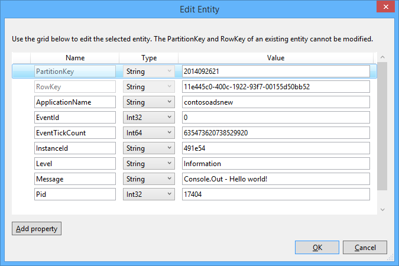
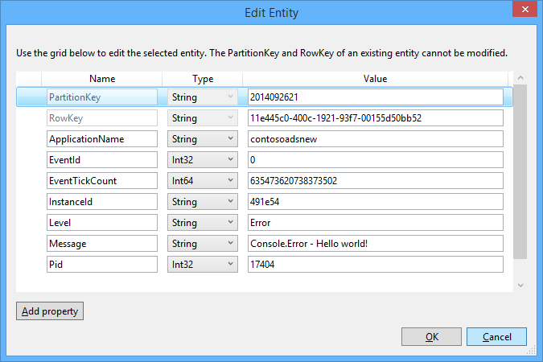

<properties
    pageTitle="Introdução ao armazenamento de fila e Visual Studio conectado serviços (WebJob projetos) | Microsoft Azure"
    description="Como começar a usar o armazenamento do Azure fila em um projeto de WebJob depois de conectar a uma conta de armazenamento usando o Visual Studio conectado serviços."
    services="storage"
    documentationCenter=""
    authors="TomArcher"
    manager="douge"
    editor=""/>

<tags
    ms.service="storage"
    ms.workload="web"
    ms.tgt_pltfrm="vs-getting-started"
    ms.devlang="na"
    ms.topic="article"
    ms.date="07/18/2016"
    ms.author="tarcher"/>

# Introdução ao armazenamento de fila do Azure e Visual Studio conectado serviços (WebJob projetos)

[AZURE.INCLUDE [storage-try-azure-tools-queues](../../includes/storage-try-azure-tools-queues.md)]

## Visão geral

Este artigo descreve como começar a usar o armazenamento do Azure fila em um projeto de WebJob de Azure do Visual Studio depois que você tenha criado ou referenciado uma conta de armazenamento do Azure usando a caixa de diálogo do Visual Studio **Adicionar serviços conectados** . Quando você adiciona uma conta de armazenamento a um projeto de WebJob usando a caixa de diálogo **Adicionar serviços conectados** do Visual Studio, os pacotes NuGet de armazenamento do Azure apropriados estão instalados, as referências de .NET apropriado são adicionadas ao projeto e cadeias de caracteres de conexão da conta de armazenamento são atualizadas no arquivo App.  

Este artigo fornece c# exemplos de código que mostram como usar a versão do Azure WebJobs SDK 1. x com o serviço de armazenamento de fila do Azure.

Armazenamento de fila Azure é um serviço para armazenar grandes números de mensagens que podem ser acessadas a partir de qualquer lugar do mundo por meio de chamadas autenticadas usando HTTP ou HTTPS. Uma mensagem de única fila pode ter até 64 KB em tamanho e uma fila pode conter milhões de mensagens, até o limite de capacidade total de uma conta de armazenamento. Para obter mais informações, consulte [Introdução ao armazenamento de fila do Azure usando o .NET](storage-dotnet-how-to-use-queues.md) . Para obter mais informações sobre ASP.NET, consulte [ASP.NET](http://www.asp.net).

## Como disparar uma função quando for recebida uma mensagem de fila

Para escrever uma função que o SDK WebJobs chama quando for recebida uma mensagem de fila, use o atributo **QueueTrigger** . O construtor de atributo utiliza um parâmetro de cadeia de caracteres que especifica o nome da fila para pesquisar. Para ver como definir o nome da fila dinamicamente, confira [como definir opções de configuração](#how-to-set-configuration-options).

### Mensagens de fila de cadeia de caracteres

No exemplo a seguir, a fila contém uma mensagem de cadeia de caracteres, para que **QueueTrigger** é aplicado a um parâmetro de cadeia de caracteres chamado **logMessage** que contém o conteúdo da mensagem fila. A função [grava uma mensagem de log para o painel](#how-to-write-logs).

        public static void ProcessQueueMessage([QueueTrigger("logqueue")] string logMessage, TextWriter logger)
        {
            logger.WriteLine(logMessage);
        }

Além de **cadeia de caracteres**, o parâmetro pode ser uma matriz de bytes, um objeto de **CloudQueueMessage** ou um POCO que você definir.

### POCO [(simples objeto CLR antigo](http://en.wikipedia.org/wiki/Plain_Old_CLR_Object)) mensagens na fila

No exemplo a seguir, a mensagem de fila contém JSON para um objeto de **BlobInformation** que inclui uma propriedade **BlobName** . O SDK desserializa automaticamente o objeto.

        public static void WriteLogPOCO([QueueTrigger("logqueue")] BlobInformation blobInfo, TextWriter logger)
        {
            logger.WriteLine("Queue message refers to blob: " + blobInfo.BlobName);
        }

O SDK usa o [pacote Newtonsoft.Json NuGet](http://www.nuget.org/packages/Newtonsoft.Json) para serializar e desserializar mensagens. Se você criar mensagens de fila em um programa que não usa o SDK do WebJobs, você pode escrever código como o exemplo a seguir para criar uma mensagem de fila POCO que o SDK pode analisar.

        BlobInformation blobInfo = new BlobInformation() { BlobName = "log.txt" };
        var queueMessage = new CloudQueueMessage(JsonConvert.SerializeObject(blobInfo));
        logQueue.AddMessage(queueMessage);

### Funções assíncronas

As seguintes assíncrono função [grava um log para o painel](#how-to-write-logs).

        public async static Task ProcessQueueMessageAsync([QueueTrigger("logqueue")] string logMessage, TextWriter logger)
        {
            await logger.WriteLineAsync(logMessage);
        }

Funções assíncronas podem demorar um [token de cancelamento](http://www.asp.net/mvc/overview/performance/using-asynchronous-methods-in-aspnet-mvc-4#CancelToken), conforme mostrado no exemplo a seguir, que copia um blob. (Para obter uma explicação do espaço reservado **queueTrigger** , consulte a seção de [Blobs](#how-to-read-and-write-blobs-and-tables-while-processing-a-queue-message) .)

        public async static Task ProcessQueueMessageAsyncCancellationToken(
            [QueueTrigger("blobcopyqueue")] string blobName,
            [Blob("textblobs/{queueTrigger}",FileAccess.Read)] Stream blobInput,
            [Blob("textblobs/{queueTrigger}-new",FileAccess.Write)] Stream blobOutput,
            CancellationToken token)
        {
            await blobInput.CopyToAsync(blobOutput, 4096, token);
        }

## Tipos de com que atributo QueueTrigger funciona

Você pode usar **QueueTrigger** com os seguintes tipos:

* **cadeia de caracteres**
* Um tipo POCO serializado como JSON
* **byte]**
* **CloudQueueMessage**

## Algoritmo de sondagem

O SDK implementa um aleatório exponencial retirada algoritmo para reduzir o efeito de fila idle sondagem nos custos de transação de armazenamento.  Quando uma mensagem for encontrada, o SDK aguarda dois segundos e, em seguida, verifica se há outra mensagem; Quando nenhuma mensagem for encontrada, ele espera cerca de quatro segundos antes de tentar novamente. Após tentativas subsequentes falhou ao receber uma mensagem de fila, o tempo de espera continua a aumentar até atingir o tempo de espera máximo, cujo padrão é um minuto. [O tempo de espera máximo é configurável](#how-to-set-configuration-options).

## Várias instâncias

Se o seu aplicativo web é executado em várias instâncias, um WebJobs contínuo é executado em cada máquina e cada máquina será Aguarde disparadores e tentar executar funções. Em alguns cenários, que isso pode levar a algumas funções processamento os mesmos dados duas vezes, então funções devem ser idempotente (escrito de forma que chamando repetidamente com os mesmos dados de entrada não produzir resultados duplicados).  

## Execução paralela

Se você tiver várias funções listening em filas diferentes, o SDK do chamará-los em paralelo quando as mensagens são recebidas simultaneamente.

O mesmo acontece quando várias mensagens são recebidas para uma única fila. Por padrão, o SDK obtém um lote de 16 mensagens de fila de cada vez e executa a função que processa-los em paralelo. [O tamanho de lote é configurável](#how-to-set-configuration-options). Quando o número sendo processado obtém para baixo à metade do tamanho do lote, o SDK obtém outro lote e começa a processar as mensagens. Portanto, o número máximo de mensagens simultâneas sendo processadas por função é uma vez e meia o tamanho do lote. Esse limite se aplica separadamente para cada função que tem um atributo **QueueTrigger** . Se você não quiser execução paralela para mensagens recebidas em uma fila, defina o tamanho do lote como 1.

## Obter fila ou fila mensagem metadados

Você pode obter as seguintes propriedades de mensagem, adicionando parâmetros à assinatura do método:

* ExpirationTime **DateTimeOffset**
* InsertionTime **DateTimeOffset**
* NextVisibleTime **DateTimeOffset**
* queueTrigger de **cadeia de caracteres** (contém o texto da mensagem)
* id da **cadeia de caracteres**
* popReceipt de **cadeia de caracteres**
* **int** dequeueCount

Se você quiser trabalhar diretamente com o armazenamento do Azure API, você também pode adicionar um parâmetro de **CloudStorageAccount** .

O exemplo a seguir grava todos os metadados para um log de informações do aplicativo. No exemplo, logMessage e queueTrigger contêm o conteúdo da mensagem fila.

        public static void WriteLog([QueueTrigger("logqueue")] string logMessage,
            DateTimeOffset expirationTime,
            DateTimeOffset insertionTime,
            DateTimeOffset nextVisibleTime,
            string id,
            string popReceipt,
            int dequeueCount,
            string queueTrigger,
            CloudStorageAccount cloudStorageAccount,
            TextWriter logger)
        {
            logger.WriteLine(
                "logMessage={0}\n" +
            "expirationTime={1}\ninsertionTime={2}\n" +
                "nextVisibleTime={3}\n" +
                "id={4}\npopReceipt={5}\ndequeueCount={6}\n" +
                "queue endpoint={7} queueTrigger={8}",
                logMessage, expirationTime,
                insertionTime,
                nextVisibleTime, id,
                popReceipt, dequeueCount,
                cloudStorageAccount.QueueEndpoint,
                queueTrigger);
        }

Aqui está um log de exemplo escrito pelo código de exemplo:

        logMessage=Hello world!
        expirationTime=10/14/2014 10:31:04 PM +00:00
        insertionTime=10/7/2014 10:31:04 PM +00:00
        nextVisibleTime=10/7/2014 10:41:23 PM +00:00
        id=262e49cd-26d3-4303-ae88-33baf8796d91
        popReceipt=AgAAAAMAAAAAAAAAfc9H0n/izwE=
        dequeueCount=1
        queue endpoint=https://contosoads.queue.core.windows.net/
        queueTrigger=Hello world!

## Desligamento

Uma função que é executado em um WebJob contínuo pode aceitar um parâmetro de **CancellationToken** que permite que o sistema operacional a função o notifique quando o WebJob está prestes a ser terminado. Você pode usar esta notificação para certificar-se de que a função não terminar de maneira inesperada de uma forma que deixa os dados em um estado inconsistente.

O exemplo a seguir mostra como verificar se há prestes encerramento de WebJob em uma função.

    public static void GracefulShutdownDemo(
                [QueueTrigger("inputqueue")] string inputText,
                TextWriter logger,
                CancellationToken token)
    {
        for (int i = 0; i < 100; i++)
        {
            if (token.IsCancellationRequested)
            {
                logger.WriteLine("Function was cancelled at iteration {0}", i);
                break;
            }
            Thread.Sleep(1000);
            logger.WriteLine("Normal processing for queue message={0}", inputText);
        }
    }

**Observação:** O painel não pode mostrar corretamente o status e a saída de funções que foi desligado.

Para obter mais informações, consulte [WebJobs desligamento](http://blog.amitapple.com/post/2014/05/webjobs-graceful-shutdown/#.VCt1GXl0wpR).   

## Como criar uma mensagem de fila ao processar uma mensagem de fila

Para escrever uma função que cria uma nova mensagem de fila, use o atributo de **fila** . Como **QueueTrigger**, você passa o nome da fila como uma cadeia de caracteres ou você pode [definir o nome da fila dinamicamente](#how-to-set-configuration-options).

### Mensagens de fila de cadeia de caracteres

Exemplo de código a seguir não assíncrono cria uma nova mensagem de fila na fila denominada "outputqueue" com o mesmo conteúdo que a mensagem de fila recebida na fila denominada "inputqueue". (Assíncrona funções usam **IAsyncCollector<T> ** conforme mostrado posteriormente nesta seção.)

        public static void CreateQueueMessage(
            [QueueTrigger("inputqueue")] string queueMessage,
            [Queue("outputqueue")] out string outputQueueMessage )
        {
            outputQueueMessage = queueMessage;
        }

### POCO [(simples objeto CLR antigo](http://en.wikipedia.org/wiki/Plain_Old_CLR_Object)) mensagens na fila

Para criar uma mensagem de fila que contenha um POCO em vez de uma cadeia de caracteres, passe o tipo POCO como um parâmetro de saída para o construtor de atributo de **fila** .

        public static void CreateQueueMessage(
            [QueueTrigger("inputqueue")] BlobInformation blobInfoInput,
            [Queue("outputqueue")] out BlobInformation blobInfoOutput )
        {
            blobInfoOutput = blobInfoInput;
        }

O SDK serializa automaticamente o objeto JSON. Uma mensagem de fila sempre é criada, mesmo se o objeto é nulo.

### Criar várias mensagens ou em funções assíncronas

Para criar várias mensagens, verifique o tipo de parâmetro para a fila de saída **ICollector<T> ** ou **IAsyncCollector<T>**, conforme mostrado no exemplo a seguir.

        public static void CreateQueueMessages(
            [QueueTrigger("inputqueue")] string queueMessage,
            [Queue("outputqueue")] ICollector<string> outputQueueMessage,
            TextWriter logger)
        {
            logger.WriteLine("Creating 2 messages in outputqueue");
            outputQueueMessage.Add(queueMessage + "1");
            outputQueueMessage.Add(queueMessage + "2");
        }

Cada mensagem de fila é criada imediatamente quando se chama o método **Add** .

### Tipos de que o atributo de fila funciona com

Você pode usar o atributo **fila** nos seguintes tipos de parâmetro:

* **check-out de cadeia de caracteres** (cria mensagem fila se o valor do parâmetro for nulos quando terminar a função)
* **check-out byte]** (funciona como **cadeia de caracteres**)
* **check-out CloudQueueMessage** (funciona como **cadeia de caracteres**)
* **check-out POCO** (um tipo serializável, cria uma mensagem com um objeto nulo se o parâmetro é nulo quando terminar a função)
* **ICollector**
* **IAsyncCollector**
* **CloudQueue** (para a criação de mensagens manualmente usando a API de armazenamento do Azure diretamente)

### Usar atributos de WebJobs SDK no corpo de uma função

Se você precisar fazer algum trabalho em sua função antes de usar um atributo WebJobs SDK como **fila**, **Blob**ou **tabela**, você pode usar a interface **IBinder** .

O exemplo a seguir leva uma mensagem de fila de entrada e cria uma nova mensagem com o mesmo conteúdo em uma fila de saída. O nome da fila de saída é definido pelo código no corpo da função.

        public static void CreateQueueMessage(
            [QueueTrigger("inputqueue")] string queueMessage,
            IBinder binder)
        {
            string outputQueueName = "outputqueue" + DateTime.Now.Month.ToString();
            QueueAttribute queueAttribute = new QueueAttribute(outputQueueName);
            CloudQueue outputQueue = binder.Bind<CloudQueue>(queueAttribute);
            outputQueue.AddMessage(new CloudQueueMessage(queueMessage));
        }

A interface **IBinder** também pode ser usada com os atributos de **tabela** e **Blob** .

## Como ler e gravar blobs e tabelas ao processar uma mensagem de fila

Os atributos de **Blob** e **tabela** permitem que você possa ler e gravar blobs e tabelas. Os exemplos nesta seção se aplicam a blobs. Para obter exemplos de código que mostram como disparar processos quando blobs são criados ou atualizados, veja [como usar o armazenamento de blob do Microsoft Azure com o SDK WebJobs](../app-service-web/websites-dotnet-webjobs-sdk-storage-blobs-how-to.md)e para exemplos de código que ler e gravar tabelas, consulte [como usar o armazenamento de tabela Azure com o SDK do WebJobs](../app-service-web/websites-dotnet-webjobs-sdk-storage-tables-how-to.md).

### Mensagens de fila disparo blob operações de cadeia de caracteres

Para uma mensagem de fila que contém uma cadeia de caracteres, **queueTrigger** é um espaço reservado que você pode usar o **Blob** parâmetro do atributo **blobPath** que contém o conteúdo da mensagem.

O exemplo a seguir usa objetos de **fluxo** para ler e gravar blobs. A mensagem de fila é o nome de um blob localizado no contêiner de textblobs. Uma cópia do blob com "-novo" acrescentado ao nome é criado no mesmo contêiner.

        public static void ProcessQueueMessage(
            [QueueTrigger("blobcopyqueue")] string blobName,
            [Blob("textblobs/{queueTrigger}",FileAccess.Read)] Stream blobInput,
            [Blob("textblobs/{queueTrigger}-new",FileAccess.Write)] Stream blobOutput)
        {
            blobInput.CopyTo(blobOutput, 4096);
        }

O construtor de atributo **Blob** leva um parâmetro de **blobPath** que especifica o contêiner e o nome do blob. Para obter mais informações sobre esse espaço reservado, veja [como usar o armazenamento de blob do Microsoft Azure com o SDK do WebJobs](../app-service-web/websites-dotnet-webjobs-sdk-storage-blobs-how-to.md).

Quando o atributo decora um objeto **Stream** , outro parâmetro de construtor Especifica o modo de **FileAccess** como ler, gravar ou leitura/gravação.

O exemplo a seguir usa um objeto de **CloudBlockBlob** para excluir um blob. A mensagem de fila é o nome do blob.

        public static void DeleteBlob(
            [QueueTrigger("deleteblobqueue")] string blobName,
            [Blob("textblobs/{queueTrigger}")] CloudBlockBlob blobToDelete)
        {
            blobToDelete.Delete();
        }

### POCO [(simples objeto CLR antigo](http://en.wikipedia.org/wiki/Plain_Old_CLR_Object)) mensagens na fila

Para um POCO armazenado como JSON na fila mensagem, você pode usar espaços reservados que propriedades de nome do objeto no parâmetro de **blobPath** do atributo **fila** . Você também pode usar nomes de propriedade de metadados de fila como espaços reservados. Consulte [obter fila ou fila mensagem metadados](#get-queue-or-queue-message-metadata).

O exemplo a seguir copia um blob para um novo blob com uma extensão diferente. A mensagem de fila é um objeto de **BlobInformation** que inclui propriedades **BlobName** e **BlobNameWithoutExtension** . Os nomes de propriedade são usados como espaços reservados no caminho blob para os atributos de **Blob** .

        public static void CopyBlobPOCO(
            [QueueTrigger("copyblobqueue")] BlobInformation blobInfo,
            [Blob("textblobs/{BlobName}", FileAccess.Read)] Stream blobInput,
            [Blob("textblobs/{BlobNameWithoutExtension}.txt", FileAccess.Write)] Stream blobOutput)
        {
            blobInput.CopyTo(blobOutput, 4096);
        }

O SDK usa o [pacote Newtonsoft.Json NuGet](http://www.nuget.org/packages/Newtonsoft.Json) para serializar e desserializar mensagens. Se você criar mensagens de fila em um programa que não usa o SDK do WebJobs, você pode escrever código como o exemplo a seguir para criar uma mensagem de fila POCO que o SDK pode analisar.

        BlobInformation blobInfo = new BlobInformation() { BlobName = "boot.log", BlobNameWithoutExtension = "boot" };
        var queueMessage = new CloudQueueMessage(JsonConvert.SerializeObject(blobInfo));
        logQueue.AddMessage(queueMessage);

Se você precisar fazer algum trabalho em sua função antes de vincular um blob a um objeto, você pode usar o atributo no corpo da função, conforme mostrado nos [atributos de usar WebJobs SDK no corpo de uma função](#use-webjobs-sdk-attributes-in-the-body-of-a-function).

###Tipos que você pode usar o atributo Blob com

O atributo de **Blob** pode ser usado com os seguintes tipos:

* **Fluxo** (ler ou escrever, especificado usando o parâmetro de construtor FileAccess)
* **TextReader**
* **TextWriter**
* **cadeia de caracteres** (leitura)
* **check-out de cadeia de caracteres** (escrever; cria um blob somente se o parâmetro de cadeia de caracteres é nulos quando a função retorna)
* POCO (leitura)
* check-out POCO (escrever; sempre cria um blob, cria como objeto nulo se POCO parâmetro é nulo quando a função retorna)
* **CloudBlobStream** (gravação)
* **ICloudBlob** (leitura ou gravação)
* **CloudBlockBlob** (leitura ou gravação)
* **CloudPageBlob** (leitura ou gravação)

##Como lidar com mensagens suspeitas

Mensagens cujo conteúdo faz com que uma função falha são chamadas *mensagens suspeitas*. Quando a função falhar, a mensagem de fila não é excluída e eventualmente é selecionada novamente, causando o ciclo seja repetido. O SDK pode interromper o ciclo automaticamente após um número limitado de iterações ou você pode fazê-lo manualmente.

### Manipulação de mensagem suspeita automática

O SDK chamará uma função até 5 vezes para processar uma mensagem de fila. Se o quinto experimentar falhar, a mensagem é movida para uma fila de suspeita. Você pode ver como configurar o número máximo de tentativas no [como definir opções de configuração](#how-to-set-configuration-options).

Fila de suspeitas chamada *{originalqueuename}*-suspeita. Você pode escrever uma função para processar mensagens de fila de suspeitas log-las ou enviando uma notificação que manual atenção é necessária.

No exemplo a seguir o **CopyBlob** função falhará quando uma mensagem de fila contém o nome de um blob que não existe. Quando isso acontece, a mensagem é movida da fila copyblobqueue à fila inviabilização de copyblobqueue. O **ProcessPoisonMessage** registra a mensagem suspeita.

        public static void CopyBlob(
            [QueueTrigger("copyblobqueue")] string blobName,
            [Blob("textblobs/{queueTrigger}", FileAccess.Read)] Stream blobInput,
            [Blob("textblobs/{queueTrigger}-new", FileAccess.Write)] Stream blobOutput)
        {
            blobInput.CopyTo(blobOutput, 4096);
        }

        public static void ProcessPoisonMessage(
            [QueueTrigger("copyblobqueue-poison")] string blobName, TextWriter logger)
        {
            logger.WriteLine("Failed to copy blob, name=" + blobName);
        }

A ilustração a seguir mostra a saída do console dessas funções quando uma mensagem suspeita é processada.

### Manipulação de mensagem suspeita manual

Você pode obter o número de vezes que uma mensagem foi separada para cima para processamento adicionando um parâmetro **int** denominado **dequeueCount** para sua função. Você pode verificar a contagem de dequeue no código de função e executar sua própria mensagem suspeita manipulando quando o número exceder um limite, conforme mostrado no exemplo a seguir.

        public static void CopyBlob(
            [QueueTrigger("copyblobqueue")] string blobName, int dequeueCount,
            [Blob("textblobs/{queueTrigger}", FileAccess.Read)] Stream blobInput,
            [Blob("textblobs/{queueTrigger}-new", FileAccess.Write)] Stream blobOutput,
            TextWriter logger)
        {
            if (dequeueCount > 3)
            {
                logger.WriteLine("Failed to copy blob, name=" + blobName);
            }
            else
            {
            blobInput.CopyTo(blobOutput, 4096);
            }
        }

## Como definir opções de configuração

Você pode usar o tipo de **JobHostConfiguration** para definir as seguintes opções de configuração:

* Defina as cadeias de caracteres de conexão do SDK no código.
* Configurar **QueueTrigger** configurações como máximo retirar contagem.
* Obter nomes de fila de configuração.

###Definir cadeias de caracteres de conexão de SDK no código

Definindo as cadeias de caracteres de conexão do SDK no código permite que você usar seus próprios nomes de cadeia de conexão em arquivos de configuração ou variáveis de ambiente, conforme mostrado no exemplo a seguir.

        static void Main(string[] args)
        {
            var _storageConn = ConfigurationManager
                .ConnectionStrings["MyStorageConnection"].ConnectionString;

            var _dashboardConn = ConfigurationManager
                .ConnectionStrings["MyDashboardConnection"].ConnectionString;

            var _serviceBusConn = ConfigurationManager
                .ConnectionStrings["MyServiceBusConnection"].ConnectionString;

            JobHostConfiguration config = new JobHostConfiguration();
            config.StorageConnectionString = _storageConn;
            config.DashboardConnectionString = _dashboardConn;
            config.ServiceBusConnectionString = _serviceBusConn;
            JobHost host = new JobHost(config);
            host.RunAndBlock();
        }

### Configurar definições de QueueTrigger

Você pode configurar as seguintes configurações que se aplicam ao processamento da mensagem de fila:

- O número máximo de mensagens de fila que são selecionados simultaneamente para ser executada em paralelo (o padrão é 16).
- O número máximo de tentativas antes de uma mensagem de fila é enviada para uma fila suspeita (o padrão é 5).
- O máximo tempo de espera antes de sondagem novamente quando uma fila está vazia (o padrão é 1 minuto).

O exemplo a seguir mostra como configurar essas configurações:

        static void Main(string[] args)
        {
            JobHostConfiguration config = new JobHostConfiguration();
            config.Queues.BatchSize = 8;
            config.Queues.MaxDequeueCount = 4;
            config.Queues.MaxPollingInterval = TimeSpan.FromSeconds(15);
            JobHost host = new JobHost(config);
            host.RunAndBlock();
        }

### Definir valores para WebJobs SDK parâmetros do construtor no código

Às vezes você deseja especificar um nome de fila, um nome de blob ou contêiner, ou o nome de uma tabela no código em vez de embuti-lo. Por exemplo, talvez você queira especificar o nome de fila para **QueueTrigger** em uma variável de ambiente ou arquivo de configuração.

Você pode fazer isso, passando em um objeto de **NameResolver** para o tipo de **JobHostConfiguration** . Você incluir espaços reservados especiais entre sinais de porcentagem (%)) nos parâmetros de construtor de atributo WebJobs SDK e o código de **NameResolver** Especifica os valores reais a serem usados no lugar desses espaços reservados.

Por exemplo, suponha que você deseja usar uma fila denominada logqueuetest no ambiente de teste e um logqueueprod nomeado em produção. Em vez de um nome de fila embutida, você deseja especificar o nome de uma entrada no conjunto de **appSettings** que teria o nome da fila real. Se a chave de **appSettings** for logqueue, sua função pode parecer com o exemplo a seguir.

        public static void WriteLog([QueueTrigger("%logqueue%")] string logMessage)
        {
            Console.WriteLine(logMessage);
        }

Sua classe **NameResolver** , em seguida, pode obter o nome da fila de **appSettings** conforme mostrado no exemplo a seguir:

        public class QueueNameResolver : INameResolver
        {
            public string Resolve(string name)
            {
                return ConfigurationManager.AppSettings[name].ToString();
            }
        }

Você passa a classe **NameResolver** para o objeto **JobHost** , conforme mostrado no exemplo a seguir.

        static void Main(string[] args)
        {
            JobHostConfiguration config = new JobHostConfiguration();
            config.NameResolver = new QueueNameResolver();
            JobHost host = new JobHost(config);
            host.RunAndBlock();
        }

**Observação:** Fila, tabela e nomes de blob são resolvidos sempre que uma função é chamada, mas os nomes de contêiner de blob são resolvidos somente quando o aplicativo é iniciado. Você não pode alterar o nome do contêiner de blob enquanto o trabalho está em execução.

## Como disparar uma função manualmente

Para disparar uma função manualmente, use o método de **chamada** ou **CallAsync** no objeto **JobHost** e o atributo **NoAutomaticTrigger** na função, conforme mostrado no exemplo a seguir.

        public class Program
        {
            static void Main(string[] args)
            {
                JobHost host = new JobHost();
                host.Call(typeof(Program).GetMethod("CreateQueueMessage"), new { value = "Hello world!" });
            }

            [NoAutomaticTrigger]
            public static void CreateQueueMessage(
                TextWriter logger,
                string value,
                [Queue("outputqueue")] out string message)
            {
                message = value;
                logger.WriteLine("Creating queue message: ", message);
            }
        }

## Como escrever logs

O painel mostra logs em dois lugares: a página para a WebJob e a página para uma determinada invocação de WebJob.

Saída de métodos de Console que você chamar em uma função ou no método **Main ()** aparece na página Dashboard para o WebJob, não na página para uma chamada de método específico. Saída do objeto TextWriter que obteve de um parâmetro na sua assinatura do método aparece na página de painel de uma chamada de método.

Saída do console não pode ser vinculada a uma chamada de método específico como o Console é o único encadeamento, enquanto muitas funções de trabalho podem estar em execução ao mesmo tempo. É por isso que o SDK fornece cada invocação de função com o seu próprio objeto de gravador de log exclusivo.

Para gravar [logs de rastreamento de aplicativo](web-sites-dotnet-troubleshoot-visual-studio.md#logsoverview), use **Console.Out** (cria logs marcados como INFO) e **Console.Error** (cria logs marcadas como erro). Uma alternativa é usar o [rastreamento ou TraceSource](http://blogs.msdn.com/b/mcsuksoldev/archive/2014/09/04/adding-trace-to-azure-web-sites-and-web-jobs.aspx), que fornece níveis detalhado, aviso e crítico, além de informações e de erro. Logs de rastreamento de aplicativo aparecem nos arquivos de log da web app, tabelas do Azure, ou Azure blobs dependendo de como você configurar seu aplicativo web Azure. Assim como true, todos do Console de saída, os logs mais recentes do 100 aplicativo também são exibidos na página Dashboard para o WebJob, não a página para uma chamada de função.

Saída do console aparece no painel somente se o programa é executado em um WebJob do Azure, não se o programa estiver executando localmente ou em algum outro lugar.

Você pode desabilitar o log, definindo a cadeia de conexão do Dashboard para nulo. Para obter mais informações, consulte [como definir opções de configuração](#how-to-set-configuration-options).

O exemplo a seguir mostra várias maneiras para gravar logs:

        public static void WriteLog(
            [QueueTrigger("logqueue")] string logMessage,
            TextWriter logger)
        {
            Console.WriteLine("Console.Write - " + logMessage);
            Console.Out.WriteLine("Console.Out - " + logMessage);
            Console.Error.WriteLine("Console.Error - " + logMessage);
            logger.WriteLine("TextWriter - " + logMessage);
        }

No painel de SDK WebJobs, a saída do objeto **TextWriter** aparece quando você vá até a página para uma chamada de função específica e selecione **Alternar saída**:

No painel de SDK WebJobs, as 100 linhas mais recentes do Console de saída Mostrar para cima quando você vá para a página para o WebJob (não para a chamada de função) e selecione o **Botão de alternância de saída**.

Em um WebJob contínuo, logs de aplicativos mostram em/dados/trabalhos/contínua /*{webjobname}*/job_log.txt no sistema de arquivos de aplicativo web.

        [09/26/2014 21:01:13 > 491e54: INFO] Console.Write - Hello world!
        [09/26/2014 21:01:13 > 491e54: ERR ] Console.Error - Hello world!
        [09/26/2014 21:01:13 > 491e54: INFO] Console.Out - Hello world!

Em um Azure blob a aplicativo logs têm esta aparência: 2014-09-26T21:01:13,Information,contosoadsnew,491e54,635473620738373502,0,17404,17,Console.Write - Olá!, 2014-09-26T21:01:13,Error,contosoadsnew,491e54,635473620738373502,0,17404,19,Console.Error - Olá!, 2014-09-26T21:01:13,Information,contosoadsnew,491e54,635473620738529920,0,17404,17,Console.Out - Olá!,

E, em uma tabela do Azure os logs **Console.Out** e **Console.Error** ter esta aparência:

##Próximas etapas

Este artigo forneceu exemplos de código que mostram como lidar com cenários comuns para trabalhar com filas Azure. Para obter mais informações sobre como usar WebJobs do Azure e o SDK do WebJobs, consulte [recursos de documentação WebJobs do Azure](http://go.microsoft.com/fwlink/?linkid=390226).
