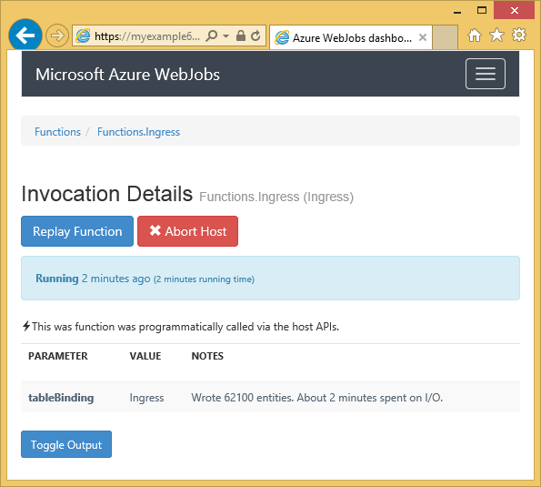

<properties
    pageTitle="Introdução ao armazenamento do Azure e Visual Studio conectado serviços (WebJob projetos)"
    description="Como começar a usar o armazenamento de tabela do Azure em um projeto do Azure WebJobs no Visual Studio depois de conectar a uma conta de armazenamento usando o Visual Studio conectado serviços"
    services="storage"
    documentationCenter=""
    authors="TomArcher"
    manager="douge"
    editor=""/>

<tags
    ms.service="storage"
    ms.workload="web"
    ms.tgt_pltfrm="vs-getting-started"
    ms.devlang="na"
    ms.topic="article"
    ms.date="07/18/2016"
    ms.author="tarcher"/>

# Introdução ao Azure armazenamento (WebJob Azure projetos)

[AZURE.INCLUDE [storage-try-azure-tools-tables](../../includes/storage-try-azure-tools-tables.md)]

## Visão geral

Este artigo fornece c# exemplos de código que mostram mostram como utilizar a versão do Azure WebJobs SDK 1. x com o serviço de armazenamento de tabela do Microsoft Azure. Os exemplos de código usam a versão de [WebJobs SDK](../app-service-web/websites-dotnet-webjobs-sdk.md) 1. x.

O serviço de armazenamento de tabela do Azure permite armazenar grandes quantidades de dados estruturados. O serviço é um armazenamento de dados NoSQL que aceita chamadas autenticadas de dentro e fora da nuvem Azure. Tabelas do Azure são ideais para armazenar dados estruturados e não-relacionais.  Para obter mais informações, consulte [Introdução ao armazenamento de tabela do Azure usando .NET](storage-dotnet-how-to-use-tables.md#create-a-table) .

Alguns dos trechos de código mostram o atributo de **tabela** usado em funções que são chamadas manualmente, ou seja, não usando um dos atributos disparador.

## Como adicionar entidades a uma tabela

Para adicionar entidades a uma tabela, use o atributo de **tabela** com um **ICollector<T> ** ou **IAsyncCollector<T> ** parâmetro onde **T** Especifica o esquema das entidades que você deseja adicionar. O construtor de atributo utiliza um parâmetro de cadeia de caracteres que especifica o nome da tabela.

O exemplo de código a seguir adiciona entidades **pessoa** a uma tabela chamada *ingresso*.

        [NoAutomaticTrigger]
        public static void IngressDemo(
            [Table("Ingress")] ICollector<Person> tableBinding)
        {
            for (int i = 0; i < 100000; i++)
            {
                tableBinding.Add(
                    new Person() {
                        PartitionKey = "Test",
                        RowKey = i.ToString(),
                        Name = "Name" }
                    );
            }
        }

Geralmente o tipo que você usa com **ICollector** deriva de **TableEntity** ou implementa **ITableEntity**, mas ele não precisa. Qualquer uma das seguintes classes **pessoa** trabalhar com o código mostrado no método de **ingresso** anterior.

        public class Person : TableEntity
        {
            public string Name { get; set; }
        }

        public class Person
        {
            public string PartitionKey { get; set; }
            public string RowKey { get; set; }
            public string Name { get; set; }
        }

Se você quiser trabalhar diretamente com o armazenamento do Azure API, você pode adicionar um parâmetro de **CloudStorageAccount** à assinatura do método.

## Monitoramento em tempo real

Porque funções de entrada de dados com frequência processam grandes volumes de dados, o painel de WebJobs SDK fornece monitoramento de dados em tempo real. A seção de **Log de Invocação** informa se a função ainda está sendo executado.

A página de **Detalhes de Invocação** relata o progresso da função (número de entidades escrito) enquanto ele está sendo executado e lhe dá a oportunidade para anular a ele.

Quando a função for concluído, a página de **Detalhes de Invocação** informa o número de linhas gravadas.

## Como ler várias entidades de uma tabela

Para ler uma tabela, use o atributo de **tabela** com um **IQueryable<T> ** parâmetro onde tipo **T** deriva de **TableEntity** ou implementa **ITableEntity**.

O exemplo de código a seguir lê e logs de todas as linhas da tabela de **entrada** :

        public static void ReadTable(
            [Table("Ingress")] IQueryable<Person> tableBinding,
            TextWriter logger)
        {
            var query = from p in tableBinding select p;
            foreach (Person person in query)
            {
                logger.WriteLine("PK:{0}, RK:{1}, Name:{2}",
                    person.PartitionKey, person.RowKey, person.Name);
            }
        }

### Como ler uma única entidade de uma tabela

Não há um construtor de atributo de **tabela** com dois parâmetros adicionais que permitem especificar a chave de partição e de chave de linha, quando você quiser vincular a uma tabela única entidade.

O exemplo de código a seguir lê uma linha da tabela para uma entidade de **pessoa** com base em partição chave e linha valores-chave recebidos em uma mensagem de fila:  

        public static void ReadTableEntity(
            [QueueTrigger("inputqueue")] Person personInQueue,
            [Table("persontable","{PartitionKey}", "{RowKey}")] Person personInTable,
            TextWriter logger)
        {
            if (personInTable == null)
            {
                logger.WriteLine("Person not found: PK:{0}, RK:{1}",
                        personInQueue.PartitionKey, personInQueue.RowKey);
            }
            else
            {
                logger.WriteLine("Person found: PK:{0}, RK:{1}, Name:{2}",
                        personInTable.PartitionKey, personInTable.RowKey, personInTable.Name);
            }
        }

A classe de **pessoa** neste exemplo não tem implementar **ITableEntity**.

## Como usar a API de armazenamento do .NET diretamente para trabalhar com uma tabela

Você também pode usar o atributo de **tabela** com um objeto de **CloudTable** mais flexibilidade em trabalhando com uma tabela.

O exemplo de código a seguir usa um objeto de **CloudTable** para adicionar uma única entidade à tabela de *ingresso* .

        public static void UseStorageAPI(
            [Table("Ingress")] CloudTable tableBinding,
            TextWriter logger)
        {
            var person = new Person()
                {
                    PartitionKey = "Test",
                    RowKey = "100",
                    Name = "Name"
                };
            TableOperation insertOperation = TableOperation.Insert(person);
            tableBinding.Execute(insertOperation);
        }

Para obter mais informações sobre como usar o objeto **CloudTable** , consulte [Introdução ao armazenamento de tabela do Azure usando .NET](storage-dotnet-how-to-use-tables.md).

## Tópicos relacionados cobertos pelo artigo de instruções de filas

Para obter informações sobre como lidar com o processamento da tabela disparado por uma mensagem de fila ou para cenários de WebJobs SDK não específicos para processamento de tabela, consulte [que Introdução ao armazenamento de fila do Azure e Visual Studio serviços conectados (WebJob projetos)](vs-storage-webjobs-getting-started-queues.md).

## Próximas etapas

Este artigo fornece exemplos de código que mostram como lidar com cenários comuns para trabalhar com tabelas do Azure. Para obter mais informações sobre como usar WebJobs do Azure e o SDK do WebJobs, consulte [recursos de documentação WebJobs do Azure](http://go.microsoft.com/fwlink/?linkid=390226).
