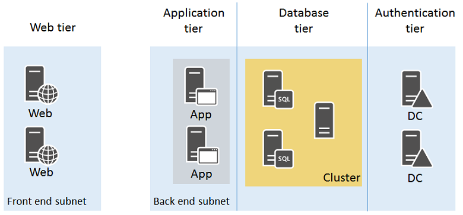

<properties
    pageTitle="Explicação passo a passo de infraestrutura de exemplo | Microsoft Azure"
    description="Saiba mais sobre as diretrizes de design e implementação chaves para implantar uma infraestrutura de exemplo no Azure."
    documentationCenter=""
    services="virtual-machines-linux"
    authors="iainfoulds"
    manager="timlt"
    editor=""
    tags="azure-resource-manager"/>

<tags
    ms.service="virtual-machines-linux"
    ms.workload="infrastructure-services"
    ms.tgt_pltfrm="vm-linux"
    ms.devlang="na"
    ms.topic="article"
    ms.date="09/08/2016"
    ms.author="iainfou"/>

# Explicação passo a passo Azure infraestrutura de exemplo

[AZURE.INCLUDE [virtual-machines-linux-infrastructure-guidelines-intro](../../includes/virtual-machines-linux-infrastructure-guidelines-intro.md)] 

Este artigo percorre construção check-out de uma infraestrutura de aplicativo de exemplo. Podemos detalhe projetar uma infraestrutura de uma loja online simple que une todas as diretrizes e decisões em torno de convenções de nomenclatura, conjuntos de disponibilidade, redes virtuais e balanceadores de carga e implantar realmente suas máquinas virtuais (VMs).

## Carga de trabalho de exemplo

Adventure Works ciclos quer criar um aplicativo de armazenamento on-line no Azure que consiste em:

- Dois servidores nginx executando o cliente front-end em uma camada de web
- Dois servidores nginx processamento de dados e pedidos em uma camada de aplicativo
- Duas partes de servidores MongoDB de um cluster sharded para armazenar dados de produtos e pedidos em um nível de banco de dados
- Dois controladores de domínio do Active Directory para contas de clientes e fornecedores em um nível de autenticação
- Todos os servidores estão localizados em duas sub-redes:
    - uma sub-rede front-end para os servidores web 
    - uma sub-rede de back-end para os servidores de aplicativo, MongoDB cluster e controladores de domínio

Entrada segura tráfego da web deve ser balanceamento de carga entre os servidores web como clientes procurar a loja online. Ordem de processamento de tráfego na forma de HTTP solicitações da web servidores devem ser balanceamento de carga entre os servidores de aplicativo. Além disso, a infraestrutura deve ser projetada para alta disponibilidade.

O design resultante deve incorporar:

- Uma assinatura do Azure e conta
- Um grupo de recursos único
- Contas de armazenamento
- Uma rede virtual com duas sub-redes
- Disponibilidade define para VMs com uma função semelhante
- Máquinas virtuais

Todas as anteriores seguem essas convenções de nomenclatura:

- Adventure Works ciclos usa **[carga de trabalho de TI]-[local]-[Azure recurso]** como um prefixo
    - Neste exemplo, "**azos**" (Azure on-line Store) é o nome de carga de trabalho IT e "**usar**" (Leste dos EUA 2) é o local
- Contas de armazenamento usam adventureazosusesa**[descrição]**
    - 'adventure' foi adicionada para o prefixo para fornecer a exclusividade e nomes de conta de armazenamento não oferecem suporte para o uso de hifens.
- Redes virtuais usam AZOS de uso de VN**[número]**
- Conjuntos de disponibilidade usam azos-use-como-**[função]**
- Nomes de máquina virtual usar azos-use-máquina virtual -**[vmname]**

## Contas e assinaturas do azure

Adventure Works ciclos está usando a assinatura de empresa, chamada Adventure Works Enterprise Subscription, para fornecer cobrança para essa carga de trabalho de TI.

## Contas de armazenamento

Adventure Works ciclos determinado que eles necessárias duas contas de armazenamento:

- **adventureazosusesawebapp** o armazenamento padrão de servidores web, servidores de aplicativos e controladores de domínio e seus discos de dados.
- **adventureazosusesadbclust** para o armazenamento de Premium dos servidores cluster sharded MongoDB e seus discos de dados.

## Sub-redes e rede virtual

Porque a rede virtual não precisa contínuos de conectividade à rede local Adventure ciclos de trabalho, eles decidiram em uma rede virtual somente na nuvem.

Criaram uma rede virtual somente na nuvem com as seguintes configurações usando o portal de Azure:

- Nome: AZOS-uso-VN01
- Local: Leste dos EUA 2
- Espaço de endereço de rede virtual: 10.0.0.0/8
- Primeira sub-rede:
    - Nome: FrontEnd
    - Espaço de endereço: 10.0.1.0/24
- Segunda sub-rede:
    - Nome: back-end
    - Espaço de endereço: 10.0.2.0/24

## Conjuntos de disponibilidade

Para manter a alta disponibilidade de todos os quatro níveis de seu armazenamento on-line, Adventure Works ciclos decidido sobre quatro conjuntos de disponibilidade:

- **use azos como web** para os servidores web
- **use azos como aplicativo** para os servidores de aplicativo
- **use azos como db** para os servidores no cluster sharded MongoDB
- **azos-use-como-dc** para controladores de domínio

## Máquinas virtuais

Adventure Works ciclos decidido sobre os seguintes nomes para suas VMs Azure:

- **usar azos-web01 máquina virtual** para o primeiro servidor web
- **azos-use-máquina virtual-web02** para o segundo servidor web
- **usar azos-app01 máquina virtual** para o primeiro servidor de aplicativo
- **azos-use-máquina virtual-app02** para o segundo servidor de aplicativo
- **usar azos-db01 máquina virtual** para o primeiro servidor de MongoDB no cluster
- **azos-use-máquina virtual-db02** para o segundo servidor de MongoDB no cluster
- **usar azos-dc01 máquina virtual** para o primeiro controlador de domínio
- **azos-use-máquina virtual-dc02** para o segundo controlador de domínio

Aqui está a configuração resultante.

Incorpora essa configuração:

- Uma rede virtual somente na nuvem com duas sub-redes (front-end e back-end)
- Duas contas de armazenamento
- Quatro conjuntos de disponibilidade, uma para cada nível do armazenamento on-line
- As máquinas virtuais para os quatro níveis
- Um conjunto de balanceamento de carga externo para o tráfego de web baseados em HTTPS da Internet para os servidores web
- Uma carga interna equilibrada conjunto para tráfego da web não criptografado dos servidores web para os servidores de aplicativo
- Um grupo de recursos único

## Próximas etapas

[AZURE.INCLUDE [virtual-machines-linux-infrastructure-guidelines-next-steps](../../includes/virtual-machines-linux-infrastructure-guidelines-next-steps.md)] 