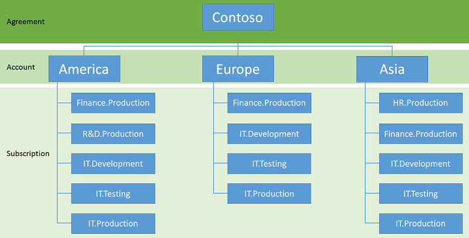

<properties
    pageTitle="Diretrizes de contas e de assinatura | Microsoft Azure"
    description="Saiba mais sobre as diretrizes de design e implementação chaves para assinaturas e contas no Azure."
    documentationCenter=""
    services="virtual-machines-windows"
    authors="iainfoulds"
    manager="timlt"
    editor=""
    tags="azure-resource-manager"/>

<tags
    ms.service="virtual-machines-windows"
    ms.workload="infrastructure-services"
    ms.tgt_pltfrm="vm-windows"
    ms.devlang="na"
    ms.topic="article"
    ms.date="09/08/2016"
    ms.author="iainfou"/>

# Diretrizes de assinatura e contas

[AZURE.INCLUDE [virtual-machines-windows-infrastructure-guidelines-intro](../../includes/virtual-machines-windows-infrastructure-guidelines-intro.md)] 

Este artigo aborda Noções básicas sobre como abordar assinatura e gerenciamento de contas como seu ambiente e base de usuários aumenta.

## Diretrizes de implementação de assinaturas e contas

Decisões:

- Qual conjunto de assinaturas e contas que você precisa para hospedar sua carga de trabalho TI ou infraestrutura?
- Como dividir a hierarquia para caber sua organização?

Tarefas:

- Defina sua hierarquia de organização lógica conforme você gostaria de gerenciá-lo de um nível de assinatura.
- Para corresponder a essa hierarquia lógica, defina as contas necessárias e assinaturas em cada conta.
- Crie o conjunto de assinaturas e contas usando a convenção de nomenclatura.

## Contas e assinaturas

Para trabalhar com o Azure, você precisa de uma ou mais assinaturas Azure. Recursos como máquinas virtuais (VMs) ou redes virtuais constar dessas assinaturas.

- Clientes corporativos geralmente têm uma inscrição de empresa, que é o recurso mais alto na hierarquia e está associado a uma ou mais contas.
- Para consumidores e clientes sem uma empresa de inscrição, o recurso mais alto é a conta.
- Assinaturas estão associadas a contas e pode haver uma ou mais assinaturas por conta. Registros Azure informações do nível de assinatura de cobrança.

Devido o limite de dois níveis de hierarquia da relação de conta/assinatura, é importante alinhar a convenção de nomenclatura de contas e assinaturas para as necessidades de cobranças. Por exemplo, se uma empresa global usa Azure, eles podem optar por fazer com uma conta por região e tem assinaturas gerenciados no nível de região:

Por exemplo, você pode usar a estrutura a seguir:

Se uma região decidir tiver mais de uma assinatura associada a um grupo específico, a convenção de nomenclatura deve incorporar uma forma de codificar os dados adicionais sobre a conta ou o nome da assinatura. Essa organização permite manipulando dados de cobranças para gerar os novos níveis da hierarquia durante relatórios de cobranças:

A organização pode parecer com o seguinte:

Fornecemos cobranças detalhadas por meio de um arquivo para download para uma única conta, ou para todas as contas de um contrato enterprise.

## Próximas etapas

[AZURE.INCLUDE [virtual-machines-windows-infrastructure-guidelines-next-steps](../../includes/virtual-machines-windows-infrastructure-guidelines-next-steps.md)] 