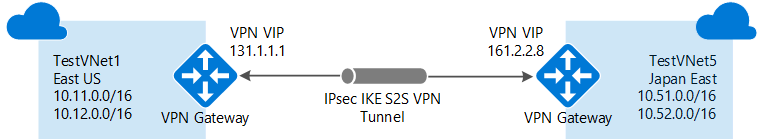

<properties
   pageTitle="Conectar VNets Azure com Gateway VPN e PowerShell | Microsoft Azure"
   description="Este artigo o orienta conectando redes virtuais juntos usando o Gerenciador de recursos do Azure e PowerShell."
   services="vpn-gateway"
   documentationCenter="na"
   authors="cherylmc"
   manager="carmonm"
   editor=""
   tags="azure-resource-manager"/>

<tags
   ms.service="vpn-gateway"
   ms.devlang="na"
   ms.topic="get-started-article"
   ms.tgt_pltfrm="na"
   ms.workload="infrastructure-services"
   ms.date="08/31/2016"
   ms.author="cherylmc"/>

# Configurar uma conexão de VNet para VNet do Gerenciador de recursos usando o PowerShell

> [AZURE.SELECTOR]
- [Gerenciador de recursos - Portal do Azure](vpn-gateway-howto-vnet-vnet-resource-manager-portal.md)
- [Gerenciador de recursos - PowerShell](vpn-gateway-vnet-vnet-rm-ps.md)
- [Clássico - Portal clássico](virtual-networks-configure-vnet-to-vnet-connection.md)

Este artigo conduz você pelas etapas para criar uma conexão entre VNets no modelo de implantação do Gerenciador de recursos usando o Gateway VPN. As redes virtuais podem ser nas regiões iguais ou diferentes e as assinaturas iguais ou diferentes.

### Modelos de implantação e métodos para conexões de VNet para VNet

[AZURE.INCLUDE [deployment models](../../includes/vpn-gateway-deployment-models-include.md)]

A tabela a seguir mostra os métodos para VNet para VNet configurações e modelos de implantação disponível no momento. Quando um artigo com etapas de configuração estiver disponível, podemos vincular diretamente a ele desta tabela.

[AZURE.INCLUDE [vpn-gateway-table-vnet-vnet](../../includes/vpn-gateway-table-vnet-to-vnet-include.md)]

#### Correspondência de VNet

[AZURE.INCLUDE [vpn-gateway-vnetpeeringlink](../../includes/vpn-gateway-vnetpeeringlink-include.md)]

## Sobre conexões de VNet para VNet

Conectando a uma rede virtual para outra rede virtual (VNet-para-VNet) é semelhante à conectando um VNet para um local de site local. Os dois tipos de conectividade usam um gateway VPN do Azure para fornecer um túnel seguro usando IPsec/IKE. O VNets que você se conecta podem estar em diferentes regiões. Ou em diferentes assinaturas. Você mesmo pode combinar comunicação de VNet para VNet com configurações de vários locais. Permite que você estabelece topologias de rede que combinam entre locais conectividade com conectividade de rede entre virtual, conforme mostrado no diagrama a seguir:

 
### Por que conectar redes virtuais?

Talvez você queira conectar redes virtuais pelos seguintes motivos:

- **Cross redundância região geográfica e localização geográfica-presença**
    - Você pode configurar sua própria replicação geográfica ou a sincronização com conectividade segura sem estourando pontos de extremidade de voltado para a Internet.
    - Com o Gerenciador de tráfego do Azure e balanceador de carga, você pode configurar a carga de trabalho altamente disponível com redundância geográfica em várias regiões Azure. Um exemplo importante é configurar um SQL sempre com grupos de disponibilidade ampliando entre várias regiões Azure.

- **Aplicativos de várias camadas regionais com isolamento ou limite administrativo**
    - Dentro da mesma região, você pode configurar aplicativos de vários níveis com várias redes virtuais conectadas devido a isolamento ou requisitos administrativos.

### Perguntas Frequentes de VNet para VNet

[AZURE.INCLUDE [vpn-gateway-vnet-vnet-faq](../../includes/vpn-gateway-vnet-vnet-faq-include.md)] 

## Qual conjunto de etapas devo usar?

Neste artigo, você verá dois diferentes conjuntos de etapas. Um conjunto de etapas para [VNets que reside na mesma assinatura](#samesub)e outro para [VNets que reside em diferentes assinaturas](#difsub). A principal diferença entre os conjuntos é se você pode criar e configurar todos os recursos de gateway e de rede virtual dentro da mesma sessão do PowerShell.

As etapas neste artigo usam variáveis que são declaradas no início de cada seção. Se você já estiver trabalhando com VNets existente, modifique as variáveis para refletir as configurações no seu ambiente. 

## Como se conectar VNets que estão na mesma assinatura

### Antes de começar
    
Antes de começar, você precisa instalar cmdlets do PowerShell do Gerenciador de recursos do Azure. Veja [como instalar e configurar o Azure PowerShell](../powershell-install-configure.md) para obter mais informações sobre como instalar os cmdlets do PowerShell.

### Etapa 1: planejar seu intervalos de endereços IP

Nas etapas a seguir, podemos criar duas redes virtuais juntamente com suas configurações e sub-redes respectivos gateway. Podemos então criar uma conexão VPN entre as duas VNets. É importante planejar os intervalos de endereços IP para a sua configuração de rede. Tenha em mente que você deve certificar-se de que nenhuma das suas VNet intervalos ou intervalos de rede local se sobreponham de nenhuma forma.

Usamos os seguintes valores nos exemplos:

**Valores para TestVNet1:**

- Nome de VNet: TestVNet1
- Grupo de recursos: TestRG1
- Local: Leste EUA
- TestVNet1: 10.11.0.0/16 & 10.12.0.0/16
- FrontEnd: 10.11.0.0/24
- Back-end: 10.12.0.0/24
- GatewaySubnet: 10.12.255.0/27
- Servidor DNS: 8.8.8.8
- GatewayName: VNet1GW
- IP público: VNet1GWIP
- VPNType: RouteBased
- Connection(1to4): VNet1toVNet4
- Connection(1to5): VNet1toVNet5
- ConnectionType: VNet2VNet

**Valores para TestVNet4:**

- Nome de VNet: TestVNet4
- TestVNet2: 10.41.0.0/16 & 10.42.0.0/16
- FrontEnd: 10.41.0.0/24
- Back-end: 10.42.0.0/24
- GatewaySubnet: 10.42.255.0/27
- Grupo de recursos: TestRG4
- Local: Oeste EUA
- Servidor DNS: 8.8.8.8
- GatewayName: VNet4GW
- IP público: VNet4GWIP
- VPNType: RouteBased
- Conexão: VNet4toVNet1
- ConnectionType: VNet2VNet

### Etapa 2: criar e configurar TestVNet1

1. Declarar as variáveis

    Iniciar declarando variáveis. Esse exemplo declara as variáveis usando os valores para este exercício. Na maioria dos casos, você deve substituir os valores de sua própria. No entanto, você pode usar essas variáveis se você estiver executando as etapas para se familiarizar com esse tipo de configuração. Modificar as variáveis se necessário, copie e cole-os no console do PowerShell.

        $Sub1 = "Replace_With_Your_Subcription_Name"
        $RG1 = "TestRG1"
        $Location1 = "East US"
        $VNetName1 = "TestVNet1"
        $FESubName1 = "FrontEnd"
        $BESubName1 = "Backend"
        $GWSubName1 = "GatewaySubnet"
        $VNetPrefix11 = "10.11.0.0/16"
        $VNetPrefix12 = "10.12.0.0/16"
        $FESubPrefix1 = "10.11.0.0/24"
        $BESubPrefix1 = "10.12.0.0/24"
        $GWSubPrefix1 = "10.12.255.0/27"
        $DNS1 = "8.8.8.8"
        $GWName1 = "VNet1GW"
        $GWIPName1 = "VNet1GWIP"
        $GWIPconfName1 = "gwipconf1"
        $Connection14 = "VNet1toVNet4"
        $Connection15 = "VNet1toVNet5"

2. Conectar-se à sua assinatura

    Alternar para modo de PowerShell para usar os cmdlets do Gerenciador de recursos. Abra o console do PowerShell e conectar à sua conta. Use o exemplo a seguir para ajudá-lo a se conectar:

        Login-AzureRmAccount

    Verifique as assinaturas para a conta.

        Get-AzureRmSubscription 

    Especifica a assinatura que você deseja usar.

        Select-AzureRmSubscription -SubscriptionName $Sub1

3. Criar um novo grupo de recursos

        New-AzureRmResourceGroup -Name $RG1 -Location $Location1

4. Criar as configurações de sub-rede para TestVNet1

    Este exemplo cria uma rede virtual chamada TestVNet1 e três sub-redes, um GatewaySubnet chamado, um FrontEnd chamado e back-end chamado um. Ao substituir valores, é importante que você sempre pode nomear sua sub-rede gateway especificamente GatewaySubnet. Se você nomear-algo diferente, a criação de seu gateway falhará. 

    O exemplo a seguir usa as variáveis que você definiu anteriormente. Neste exemplo, a sub-rede de gateway está usando um /27. Embora seja possível criar uma sub-rede de gateway o menor /29, recomendamos que você crie uma sub-rede maior que inclui mais endereços selecionando pelo menos /28 ou /27. Isso permitirá endereços suficientes acomodar possíveis configurações adicionais que podem ser no futuro. 

        $fesub1 = New-AzureRmVirtualNetworkSubnetConfig -Name $FESubName1 -AddressPrefix $FESubPrefix1
        $besub1 = New-AzureRmVirtualNetworkSubnetConfig -Name $BESubName1 -AddressPrefix $BESubPrefix1
        $gwsub1 = New-AzureRmVirtualNetworkSubnetConfig -Name $GWSubName1 -AddressPrefix $GWSubPrefix1

5. Criar TestVNet1

        New-AzureRmVirtualNetwork -Name $VNetName1 -ResourceGroupName $RG1 `
        -Location $Location1 -AddressPrefix $VNetPrefix11,$VNetPrefix12 -Subnet $fesub1,$besub1,$gwsub1

6. Solicitar um endereço IP público

    Solicite um endereço IP público a ser alocado para o gateway que você criará para sua VNet. Observe que o AllocationMethod é dinâmico. Você não pode especificar o endereço IP que você deseja usar. Ele está dinamicamente alocado para o gateway. 

        $gwpip1 = New-AzureRmPublicIpAddress -Name $GWIPName1 -ResourceGroupName $RG1 `
        -Location $Location1 -AllocationMethod Dynamic

7. Criar a configuração do gateway

    A configuração do gateway define a sub-rede e o endereço IP público para usar. Use o exemplo para criar a configuração do gateway. 

        $vnet1 = Get-AzureRmVirtualNetwork -Name $VNetName1 -ResourceGroupName $RG1
        $subnet1 = Get-AzureRmVirtualNetworkSubnetConfig -Name "GatewaySubnet" -VirtualNetwork $vnet1
        $gwipconf1 = New-AzureRmVirtualNetworkGatewayIpConfig -Name $GWIPconfName1 `
        -Subnet $subnet1 -PublicIpAddress $gwpip1

8. Criar o gateway para TestVNet1

    Nesta etapa, você pode criar o gateway de rede virtual para sua TestVNet1. Configurações de VNet para VNet exigem um RouteBased VpnType. Criar um gateway pode demorar um pouco (45 minutos ou mais para ser concluída).

        New-AzureRmVirtualNetworkGateway -Name $GWName1 -ResourceGroupName $RG1 `
        -Location $Location1 -IpConfigurations $gwipconf1 -GatewayType Vpn `
        -VpnType RouteBased -GatewaySku Standard

### Etapa 3: criar e configurar TestVNet4

Depois de ter configurado TestVNet1, crie TestVNet4. Siga as etapas abaixo, substituindo os valores com seu próprio quando necessário. Esta etapa pode ser feita dentro da mesma sessão do PowerShell, porque ele está na mesma assinatura.

1. Declarar as variáveis

    Certifique-se de que substitua os valores por aqueles que você deseja usar para sua configuração.

        $RG4 = "TestRG4"
        $Location4 = "West US"
        $VnetName4 = "TestVNet4"
        $FESubName4 = "FrontEnd"
        $BESubName4 = "Backend"
        $GWSubName4 = "GatewaySubnet"
        $VnetPrefix41 = "10.41.0.0/16"
        $VnetPrefix42 = "10.42.0.0/16"
        $FESubPrefix4 = "10.41.0.0/24"
        $BESubPrefix4 = "10.42.0.0/24"
        $GWSubPrefix4 = "10.42.255.0/27"
        $DNS4 = "8.8.8.8"
        $GWName4 = "VNet4GW"
        $GWIPName4 = "VNet4GWIP"
        $GWIPconfName4 = "gwipconf4"
        $Connection41 = "VNet4toVNet1"

    Antes de continuar, verifique se que você ainda está conectado à assinatura 1.

2. Criar um novo grupo de recursos

        New-AzureRmResourceGroup -Name $RG4 -Location $Location4

3. Criar as configurações de sub-rede para TestVNet4

        $fesub4 = New-AzureRmVirtualNetworkSubnetConfig -Name $FESubName4 -AddressPrefix $FESubPrefix4
        $besub4 = New-AzureRmVirtualNetworkSubnetConfig -Name $BESubName4 -AddressPrefix $BESubPrefix4
        $gwsub4 = New-AzureRmVirtualNetworkSubnetConfig -Name $GWSubName4 -AddressPrefix $GWSubPrefix4

4. Criar TestVNet4

        New-AzureRmVirtualNetwork -Name $VnetName4 -ResourceGroupName $RG4 `
        -Location $Location4 -AddressPrefix $VnetPrefix41,$VnetPrefix42 -Subnet $fesub4,$besub4,$gwsub4

5. Solicitar um endereço IP público

        $gwpip4 = New-AzureRmPublicIpAddress -Name $GWIPName4 -ResourceGroupName $RG4 `
        -Location $Location4 -AllocationMethod Dynamic

6. Criar a configuração do gateway

        $vnet4 = Get-AzureRmVirtualNetwork -Name $VnetName4 -ResourceGroupName $RG4
        $subnet4 = Get-AzureRmVirtualNetworkSubnetConfig -Name "GatewaySubnet" -VirtualNetwork $vnet4
        $gwipconf4 = New-AzureRmVirtualNetworkGatewayIpConfig -Name $GWIPconfName4 -Subnet $subnet4 -PublicIpAddress $gwpip4

7. Criar o gateway TestVNet4

        New-AzureRmVirtualNetworkGateway -Name $GWName4 -ResourceGroupName $RG4 `
        -Location $Location4 -IpConfigurations $gwipconf4 -GatewayType Vpn `
        -VpnType RouteBased -GatewaySku Standard

### Etapa 4 - conecte os gateways

1. Obter ambos os gateways de rede virtual

    Neste exemplo, pois ambos os gateways estão na mesma assinatura, esta etapa pode ser concluída na mesma sessão do PowerShell.

        $vnet1gw = Get-AzureRmVirtualNetworkGateway -Name $GWName1 -ResourceGroupName $RG1
        $vnet4gw = Get-AzureRmVirtualNetworkGateway -Name $GWName4 -ResourceGroupName $RG4

2. Criar o TestVNet1 para conexão de TestVNet4

    Nesta etapa, você cria a conexão da TestVNet1 para TestVNet4. Você verá uma chave compartilhada referenciada nos exemplos. Você pode usar seus próprios valores para a chave compartilhada. O importante é que a chave compartilhada deve corresponder para ambas as conexões. Criar uma conexão pode levar alguns minutos para ser concluída.

        New-AzureRmVirtualNetworkGatewayConnection -Name $Connection14 -ResourceGroupName $RG1 `
        -VirtualNetworkGateway1 $vnet1gw -VirtualNetworkGateway2 $vnet4gw -Location $Location1 `
        -ConnectionType Vnet2Vnet -SharedKey 'AzureA1b2C3'

3. Criar o TestVNet4 para conexão de TestVNet1

    Esta etapa é semelhante à acima, exceto que você está criando a conexão de TestVNet4 para TestVNet1. Verifique se que as chaves compartilhadas correspondem.

        New-AzureRmVirtualNetworkGatewayConnection -Name $Connection41 -ResourceGroupName $RG4 `
        -VirtualNetworkGateway1 $vnet4gw -VirtualNetworkGateway2 $vnet1gw -Location $Location4 `
        -ConnectionType Vnet2Vnet -SharedKey 'AzureA1b2C3'

    A conexão deve ser estabelecida após alguns minutos.

4. Verifique sua conexão. Consulte a seção [como verificar sua conexão](#verify).

## Como se conectar VNets que estão em diferentes assinaturas

Neste cenário, podemos conectar TestVNet1 e TestVNet5. TestVNet1 e TestVNet5 residem em uma assinatura diferente. As etapas para essa configuração adicionam uma conexão de VNet para VNet adicional para conectar TestVNet1 a TestVNet5. 

A diferença aqui é que algumas das etapas de configuração precisam ser realizadas em uma sessão separada do PowerShell no contexto da segunda assinatura. Especialmente quando as duas assinaturas pertencem a organizações diferentes. 

Continuam as instruções das etapas anteriores listadas acima. Você deve concluir a [etapa 1](#Step1) e a [etapa 2](#Step2) para criar e configurar TestVNet1 e o Gateway VPN para TestVNet1. Quando você concluir a etapa 1 e a etapa 2, continue com a etapa 5 para criar TestVNet5.

### Etapa 5 - Verifique se os intervalos de endereços IP adicionais

É importante garantir que o espaço de endereço IP da nova rede virtual, TestVNet5, não sobreponha com qualquer um dos seus VNet intervalos ou intervalos de gateway de rede local. 

Neste exemplo, as redes virtuais podem pertencer a organizações diferentes. Para este exercício, você pode usar os seguintes valores para o TestVNet5:

**Valores para TestVNet5:**

- Nome de VNet: TestVNet5
- Grupo de recursos: TestRG5
- Local: Japão Leste
- TestVNet5: 10.51.0.0/16 & 10.52.0.0/16
- FrontEnd: 10.51.0.0/24
- Back-end: 10.52.0.0/24
- GatewaySubnet: 10.52.255.0.0/27
- Servidor DNS: 8.8.8.8
- GatewayName: VNet5GW
- IP público: VNet5GWIP
- VPNType: RouteBased
- Conexão: VNet5toVNet1
- ConnectionType: VNet2VNet

**Valores adicionais para TestVNet1:**

- Conexão: VNet1toVNet5

### Etapa 6: criar e configurar TestVNet5

Esta etapa deve ser feita no contexto da nova assinatura. Essa parte pode ser executada pelo administrador em uma organização diferente que possui a assinatura.

1. Declarar as variáveis

    Certifique-se de que substitua os valores por aqueles que você deseja usar para sua configuração.

        $Sub5 = "Replace_With_the_New_Subcription_Name"
        $RG5 = "TestRG5"
        $Location5 = "Japan East"
        $VnetName5 = "TestVNet5"
        $FESubName5 = "FrontEnd"
        $BESubName5 = "Backend"
        $GWSubName5 = "GatewaySubnet"
        $VnetPrefix51 = "10.51.0.0/16"
        $VnetPrefix52 = "10.52.0.0/16"
        $FESubPrefix5 = "10.51.0.0/24"
        $BESubPrefix5 = "10.52.0.0/24"
        $GWSubPrefix5 = "10.52.255.0/27"
        $DNS5 = "8.8.8.8"
        $GWName5 = "VNet5GW"
        $GWIPName5 = "VNet5GWIP"
        $GWIPconfName5 = "gwipconf5"
        $Connection51 = "VNet5toVNet1"

2. Conectar-se a assinatura 5

    Abra o console do PowerShell e conectar à sua conta. Use o exemplo a seguir para ajudá-lo a se conectar:

        Login-AzureRmAccount

    Verifique as assinaturas para a conta.

        Get-AzureRmSubscription 

    Especifica a assinatura que você deseja usar.

        Select-AzureRmSubscription -SubscriptionName $Sub5

3. Criar um novo grupo de recursos

        New-AzureRmResourceGroup -Name $RG5 -Location $Location5

4. Criar as configurações de sub-rede para TestVNet4
    
        $fesub5 = New-AzureRmVirtualNetworkSubnetConfig -Name $FESubName5 -AddressPrefix $FESubPrefix5
        $besub5 = New-AzureRmVirtualNetworkSubnetConfig -Name $BESubName5 -AddressPrefix $BESubPrefix5
        $gwsub5 = New-AzureRmVirtualNetworkSubnetConfig -Name $GWSubName5 -AddressPrefix $GWSubPrefix5

5. Criar TestVNet5

        New-AzureRmVirtualNetwork -Name $VnetName5 -ResourceGroupName $RG5 -Location $Location5 `
        -AddressPrefix $VnetPrefix51,$VnetPrefix52 -Subnet $fesub5,$besub5,$gwsub5

6. Solicitar um endereço IP público

        $gwpip5 = New-AzureRmPublicIpAddress -Name $GWIPName5 -ResourceGroupName $RG5 `
        -Location $Location5 -AllocationMethod Dynamic

7. Criar a configuração do gateway

        $vnet5 = Get-AzureRmVirtualNetwork -Name $VnetName5 -ResourceGroupName $RG5
        $subnet5  = Get-AzureRmVirtualNetworkSubnetConfig -Name "GatewaySubnet" -VirtualNetwork $vnet5
        $gwipconf5 = New-AzureRmVirtualNetworkGatewayIpConfig -Name $GWIPconfName5 -Subnet $subnet5 -PublicIpAddress $gwpip5

8. Criar o gateway TestVNet5

        New-AzureRmVirtualNetworkGateway -Name $GWName5 -ResourceGroupName $RG5 -Location $Location5 `
        -IpConfigurations $gwipconf5 -GatewayType Vpn -VpnType RouteBased -GatewaySku Standard

### Etapa 7 - conectando os gateways

Neste exemplo, porque os gateways estão em diferentes assinaturas, nós já Divida esta etapa em duas sessões do PowerShell marcadas como [assinatura 1] e [assinatura 5].

1. **[Assinatura 1]** Obter o gateway de rede virtual para 1 de assinatura

    Certifique-se de login e conectar a 1 de assinatura.

        $vnet1gw = Get-AzureRmVirtualNetworkGateway -Name $GWName1 -ResourceGroupName $RG1

    Copiar a saída dos seguintes elementos e enviar esses arquivos para o administrador de assinatura 5 via email ou outro método.

        $vnet1gw.Name
        $vnet1gw.Id

    Esses dois elementos terão valores semelhantes à seguinte resultado de exemplo:

        PS D:\> $vnet1gw.Name
        VNet1GW
        PS D:\> $vnet1gw.Id
        /subscriptions/b636ca99-6f88-4df4-a7c3-2f8dc4545509/resourceGroupsTestRG1/providers/Microsoft.Network/virtualNetworkGateways/VNet1GW

2. **[Assinatura 5]** Obter o gateway de rede virtual para 5 de assinatura

    Certifique-se de login e conectar-se a assinatura 5.

        $vnet5gw = Get-AzureRmVirtualNetworkGateway -Name $GWName5 -ResourceGroupName $RG5

    Copiar a saída dos seguintes elementos e enviar esses arquivos para o administrador de assinatura 1 via email ou outro método.

        $vnet5gw.Name
        $vnet5gw.Id

    Esses dois elementos terão valores semelhantes à seguinte resultado de exemplo:

        PS C:\> $vnet5gw.Name
        VNet5GW
        PS C:\> $vnet5gw.Id
        /subscriptions/66c8e4f1-ecd6-47ed-9de7-7e530de23994/resourceGroups/TestRG5/providers/Microsoft.Network/virtualNetworkGateways/VNet5GW

3. **[Assinatura 1]** Criar o TestVNet1 para conexão de TestVNet5

    Nesta etapa, você cria a conexão da TestVNet1 para TestVNet5. A diferença aqui é que vnet5gw $ não pode ser obtido diretamente, porque ele está em uma assinatura diferente. Você precisará criar um novo objeto do PowerShell com os valores comunicados de assinatura 1 as etapas acima. Use o exemplo a seguir. Substitua o nome, Id e chave compartilhada com seus próprios valores. O importante é que a chave compartilhada deve corresponder para ambas as conexões. Criar uma conexão pode levar alguns minutos para ser concluída.

    Certifique-se de que você se conectar a 1 de assinatura. 
    
        $vnet5gw = New-Object Microsoft.Azure.Commands.Network.Models.PSVirtualNetworkGateway
        $vnet5gw.Name = "VNet5GW"
        $vnet5gw.Id   = "/subscriptions/66c8e4f1-ecd6-47ed-9de7-7e530de23994/resourceGroups/TestRG5/providers/Microsoft.Network/virtualNetworkGateways/VNet5GW"
        $Connection15 = "VNet1toVNet5"
        New-AzureRmVirtualNetworkGatewayConnection -Name $Connection15 -ResourceGroupName $RG1 -VirtualNetworkGateway1 $vnet1gw -VirtualNetworkGateway2 $vnet5gw -Location $Location1 -ConnectionType Vnet2Vnet -SharedKey 'AzureA1b2C3'

4. **[Assinatura 5]** Criar o TestVNet5 para conexão de TestVNet1

    Esta etapa é semelhante à acima, exceto que você está criando a conexão de TestVNet5 para TestVNet1. O mesmo processo de criação de um objeto do PowerShell com base em valores obtidos de assinatura 1 se aplica aqui também. Nesta etapa, certifique-se de que as chaves compartilhadas correspondem.

    Certificar-se de que você se conecta ao 5 de assinatura.

        $vnet1gw = New-Object Microsoft.Azure.Commands.Network.Models.PSVirtualNetworkGateway
        $vnet1gw.Name = "VNet1GW"
        $vnet1gw.Id = "/subscriptions/b636ca99-6f88-4df4-a7c3-2f8dc4545509/resourceGroups/TestRG1/providers/Microsoft.Network/virtualNetworkGateways/VNet1GW "
        New-AzureRmVirtualNetworkGatewayConnection -Name $Connection51 -ResourceGroupName $RG5 -VirtualNetworkGateway1 $vnet5gw -VirtualNetworkGateway2 $vnet1gw -Location $Location5 -ConnectionType Vnet2Vnet -SharedKey 'AzureA1b2C3'

## Como verificar uma conexão

[AZURE.INCLUDE [vpn-gateway-no-nsg-include](../../includes/vpn-gateway-no-nsg-include.md)]

[AZURE.INCLUDE [verify connection powershell](../../includes/vpn-gateway-verify-connection-ps-rm-include.md)] 

## Próximas etapas

- Quando sua conexão for concluída, você pode adicionar máquinas virtuais às suas redes virtuais. Consulte [criar uma máquina Virtual](../virtual-machines/virtual-machines-windows-hero-tutorial.md) para obter as etapas.
- Para obter informações sobre BGP, consulte a [Visão geral de BGP](vpn-gateway-bgp-overview.md) e [como configurar o BGP](vpn-gateway-bgp-resource-manager-ps.md). 

