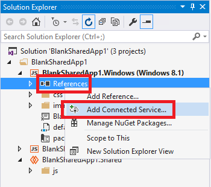
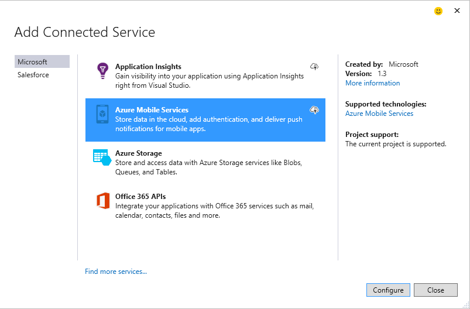

<properties 
   pageTitle="Adicionando serviços Mobile usando serviços conectados no Visual Studio | Microsoft Azure"
   description="Adicionar serviços Mobile usando a caixa de diálogo do Visual Studio adicionar conectado serviços"
   services="visual-studio-online"
   documentationCenter="na"
   authors="mlhoop"
   manager="douge"
   editor="" />
<tags 
   ms.service="visual-studio-online"
   ms.devlang="na"
   ms.topic="article"
   ms.tgt_pltfrm="na"
   ms.workload="mobile"
   ms.date="12/16/2015"
   ms.author="mlearned" />

# Adicionando serviços Mobile usando o Visual Studio conectado Services

Com o Visual Studio de 2015, você pode se conectar aos serviços do Azure Mobile usando a caixa de diálogo **Adicionar serviço conectado** . Você pode conectar qualquer aplicativo de cliente c#, qualquer aplicativo JavaScript ou aplicativo de Cordova entre plataformas. Uma vez conectado, você pode criar e acessar dados, criar APIs personalizado e trabalhos agendados ou adicionar suporte para notificações por push.  A operação de serviços conectados adiciona todas as referências apropriado e o código de conexão. Você também pode aproveitar de suporte interno para autenticação com uma variedade de esquemas de identidade populares, como o Azure AD, Facebook, Twitter e Accounts da Microsoft.

## Tipos de projeto com suporte

>[AZURE.NOTE] No Visual Studio de 2015, não há suporte adicionando serviços do Azure móvel a um Windows Universal (Windows 10) projetos usando a caixa de diálogo Adicionar serviços conectados. Você pode adicionar serviços de celular do Azure instalando os pacotes apropriados usando o NuGet Package Manager para seu projeto.

Você pode usar a caixa de diálogo Serviços conectados para se conectar aos serviços do Azure Mobile nos seguintes tipos de projeto.

- Projetos .NET Windows 8.1 Store, telefone e aplicativo Universal

- Projetos JavaScript 8.1 da Windows Store, telefone e aplicativo Universal

- Projetos criados usando o Visual Studio Tools para Apache Cordova

## Conectar-se a serviços de celular do Azure usando a caixa de diálogo Adicionar serviços conectados

1. Verifique se que você tiver uma conta do Azure. Se você não tiver uma conta do Azure, você pode inscrever-se para uma [avaliação gratuita](http://go.microsoft.com/fwlink/?LinkId=518146).

1. Abra a caixa de diálogo **Adicionar serviços conectados** .
 - Para aplicativos .NET, abra o projeto no Visual Studio, abrir o menu de contexto para o nó de **referências** em Solution Explorer e escolha **Adicionar serviço conectado**
 
        

 - Para projetos de aplicativo Cordova Apache, abra o projeto no Visual Studio, abra o menu de contexto para o nó de projeto no Solution Explorer e escolha **Adicionar serviço conectado**.

1. Na caixa de diálogo **Adicionar serviço conectado** , escolha **Serviços de celular do Azure**e, em seguida, escolha o botão **Configurar** . Você pode ser solicitado a fazer logon no Azure se você ainda não fez isso.

    

1. Na caixa de diálogo **Serviços de celular do Azure** , escolha um serviço móvel existente se tiver um. Se você precisa criar um novo serviço móvel Azure, siga o procedimento abaixo para fazê-lo. Caso contrário, pule para a próxima etapa.

    Para criar uma nova conta de serviço móvel:
    1. Escolha o link de **Serviço de criar **na parte inferior da caixa de diálogo.
        

    2. Na caixa de diálogo **Criar Mobile Service** , você pode escolher um serviço móvel de back-end JavaScript ou um serviço móvel de back-end do .NET na lista suspensa de **tempo de execução** . 
  
        

        Um serviço de back-end JavaScript é simples e eficiente. Se você criar um serviço móvel de back-end do JavaScript, o código de JavaScript do lado do servidor é armazenado na nuvem, mas você pode editar scripts de servidor, usando Server Explorer ou o portal de gerenciamento do Azure. 

        Um serviço móvel de back-end do .NET fornece a potência e a flexibilidade Web API e a estrutura de entidade. Se você criar um serviço móvel do .NET back-end, um projeto é criado e adicionado à sua solução. 

    1. Escolha a **região** onde deseja que o serviço móvel e, em seguida, insira um nome de usuário e senha para o servidor.
 
    1. Depois que você tiver inserido todas as informações necessárias, escolha o botão **criar** para criar o serviço móvel.
    2. O novo serviço móvel deve aparecer na lista de serviço na caixa de diálogo **Serviços de celular do Azure** . Escolha o novo serviço móvel na lista e escolha o botão **Adicionar** para adicionar o serviço ao seu projeto.
    

1. Examine a página de Introdução que aparece e descubra como seu projeto foi modificado. Uma página de Introdução aparece no navegador sempre que você adicionar um serviço conectado. Você pode examinar as próximas etapas sugeridas e exemplos de código ou alterne para a página o que aconteceu para ver quais referências foram adicionadas ao seu projeto e como seus arquivos de código e configuração foram modificados.

1. Usando os exemplos de código como um guia, comece a escrever código para acessar o serviço móvel!

## Como o seu projeto é modificado

Como o Visual Studio modifica o seu projeto depende do tipo de projeto. Para c# aplicativos cliente, consulte [o que aconteceu – projetos c#](http://go.microsoft.com/fwlink/p/?LinkId=513119). Para aplicativos de cliente JavaScript, veja [o que aconteceu – JavaScript projetos](http://go.microsoft.com/fwlink/p/?LinkId=513120). Para aplicativos de Cordova, consulte [o que aconteceu – Cordova projetos](http://go.microsoft.com/fwlink/p/?LinkId=513116).

##Próximas etapas

Fazer perguntas e obter ajuda: 

 - [Fórum do MSDN: Serviços de móveis Azure](https://social.msdn.microsoft.com/forums/azure/home?forum=azuremobile)

 - [Azure serviços móveis no Blog da equipe do Microsoft Azure](https://azure.microsoft.com/blog/topics/mobile/)

 - [Azure serviços móveis em azure.microsoft.com](https://azure.microsoft.com/services/mobile-services/)

 - [Documentação de serviços móveis Azure em azure.microsoft.com](https://azure.microsoft.com/documentation/services/mobile-services/)

