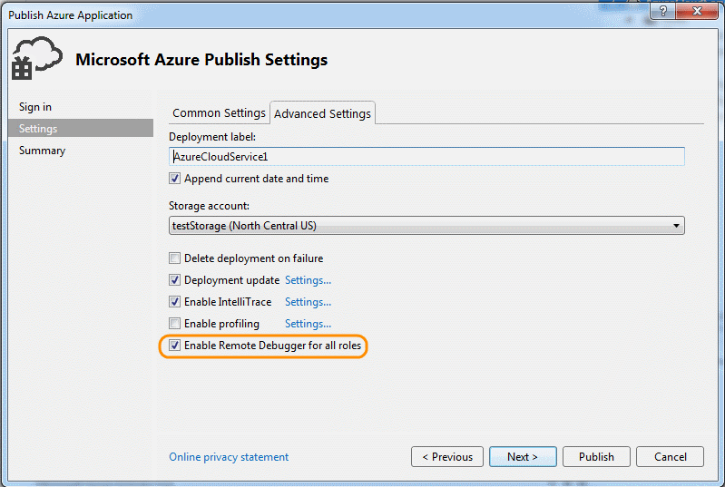
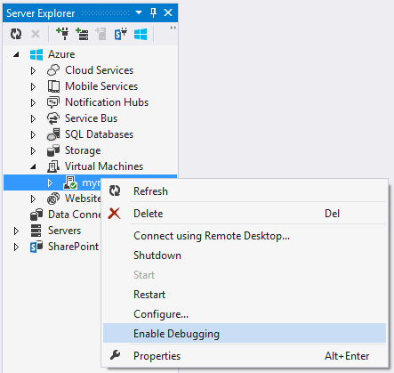
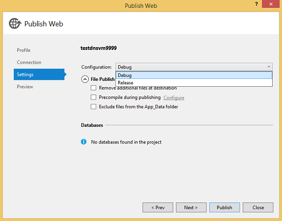

<properties 
    pageTitle="A depuração de um serviço de nuvem Azure ou máquina virtual no Visual Studio | Microsoft Azure"
    description="Depuração de um serviço de nuvem ou máquina Virtual no Visual Studio"
    services="visual-studio-online"
    documentationCenter="na"
    authors="TomArcher"
    manager="douge"
    editor="" />
<tags 
    ms.service="visual-studio-online"
    ms.devlang="multiple"
    ms.topic="article"
    ms.tgt_pltfrm="multiple"
    ms.workload="na"
    ms.date="08/15/2016"
    ms.author="tarcher" />

# A depuração de um serviço de nuvem Azure ou máquina virtual no Visual Studio

Visual Studio oferece diferentes opções para depuração de serviços de nuvem Azure e máquinas virtuais.

## Depurar seu serviço de nuvem em seu computador local

Você pode economizar tempo e dinheiro usando o Azure calcular emulador para depurar seu serviço de nuvem em um computador local. Por depuração de um serviço localmente antes de implantá-lo, você pode melhorar o desempenho e confiabilidade sem pagar por tempo de computação. No entanto, alguns erros podem ocorrer somente quando você executa um serviço de nuvem no Azure em si. Você pode depurar esses erros, se você habilitar depuração remota quando você publica seu serviço e anexe o depurador para uma instância de função.

O emulador simula o serviço de computação do Azure e é executado no seu ambiente local, para que você possa testar e depurar seu serviço de nuvem antes de implantá-lo. O emulador trata o ciclo de vida de suas instâncias de função e fornece acesso aos recursos simulados, como o armazenamento local. Quando você depurar ou executar o serviço do Visual Studio, ela automaticamente inicia o emulador como um aplicativo de plano de fundo e, em seguida, implanta seu serviço para o emulador. Você pode usar o emulador para exibir seu serviço quando ele é executado no ambiente local. Você pode executar a versão completa ou a versão express do emulador. (Começando com o Azure 2.3, a versão express do emulador é o padrão.) Consulte [emulador usando Express para executar e depurar um serviço de nuvem localmente](https://msdn.microsoft.com/library/dn339018.aspx).

### Depurar seu serviço de nuvem em seu computador local

1. Na barra de menus, escolha **Depurar**, **Iniciar depuração** para executar o projeto de serviço de nuvem Azure. Como alternativa, você pode pressionar F5. Você verá uma mensagem que o emulador de computação está iniciando. Quando o emulador é iniciado, o ícone de bandeja do sistema confirma a ele.

    

1. Exibir a interface do usuário para o emulador de computação abrindo o menu de atalho para o ícone Azure na área de notificação e selecione **Mostrar calcular emulador interface do usuário**.

    O painel esquerdo da interface do usuário mostra os serviços que estão implantados no momento o emulador de computação e as instâncias de função que cada serviço está em execução. Você pode escolher o serviço ou funções para exibir o ciclo de vida, log e informações de diagnóstico no painel direito. Se você colocar o foco na margem superior de uma janela incluída, ele se expande para preencher o painel direito.

1. Percorra o aplicativo selecionando comandos no menu **Depurar** e definindo pontos de interrupção no seu código. Conforme você percorrer o aplicativo no depurador, os painéis são atualizados com o status atual do aplicativo. Quando você interrompe a depuração, a implantação do aplicativo é excluída. Se seu aplicativo inclui uma função web e você tiver definido a propriedade de ação de inicialização para iniciar o navegador da web, o Visual Studio inicia o aplicativo da web no navegador. Se você alterar o número de instâncias de uma função na configuração de serviço, você deve interromper o serviço de nuvem e reinicie a depuração para que você possa depurar essas novas instâncias da função.

    **Observação:** Quando você interrompe executando ou depuração de seu serviço, o emulador de computação local e emulador de armazenamento não estão interrompidos. Interrompa-los explicitamente da área de notificação.

## Depurar um serviço de nuvem no Azure

Para depurar um serviço de nuvem de um computador remoto, você deve habilitar essa funcionalidade explicitamente quando você implanta o seu serviço de nuvem para que necessários serviços (msvsmon.exe, por exemplo) estão instalados nas máquinas virtuais que executam suas instâncias de função. Se você não ativar a depuração remota quando você publicou o serviço, você precisa republicar o serviço com a depuração remota habilitada.

Se você habilitar depuração remota para um serviço de nuvem, ele não apresentar um desempenho comprometido ou pagar taxas adicionais. Você não deve usar depuração remota em um serviço de produção, pois os clientes que usam o serviço podem ser prejudicados.

>[AZURE.NOTE] Quando você publica um serviço de nuvem do Visual Studio, você pode habilitar **IntelliTrace** para qualquer funções nesse serviço que têm como alvo o .NET Framework 4 ou do .NET Framework 4.5. Usando o **IntelliTrace**, você pode examinar eventos que ocorreram em uma instância de função no passado e reproduza o contexto partir desse momento. Consulte [depuração de um serviço de nuvem publicados com IntelliTrace e Visual Studio](http://go.microsoft.com/fwlink/?LinkID=623016) e [Usando o IntelliTrace](https://msdn.microsoft.com/library/dd264915.aspx).

### Para habilitar a depuração remota para um serviço de nuvem

1. Abrir o menu de atalho para o projeto Azure e selecione **Publicar**.

1. Selecione o ambiente de **teste** e a configuração de **depuração** .

    Isso é apenas um guia. Você pode optar por executar seus ambientes de teste em um ambiente de produção. No entanto, você pode afetar negativamente os usuários se você ativar a depuração remota no ambiente de produção. Você pode escolher a configuração de lançamento, mas a configuração de depuração torna depuração mais fácil.

    

1. Siga as etapas de costume, mas marque a caixa de seleção **Habilitar depurador remoto para todas as funções** na guia **Configurações avançadas** .

    

### Para anexar o depurador a um serviço de nuvem no Azure

1. No Server Explorer, expanda o nó de seu serviço de nuvem.

1. Abrir o menu de atalho para a função ou uma instância de função ao qual você deseja anexar e, em seguida, selecione **Depurador anexar**.

    Se você depurar uma função, o depurador Visual Studio anexa a cada instância dessa função. O depurador interromperá em um ponto de interrupção para a primeira instância de função que executa essa linha de código e atende às condições desse ponto de interrupção. Se você depurar uma instância, o depurador anexa somente para essa instância e quebras de um ponto de interrupção somente quando essa instância específica executa essa linha de código e atende às condições de ponto de interrupção.

    

1. Após o depurador anexa para uma instância, depure como de costume. O depurador anexa automaticamente para o processo de host apropriado para sua função. Dependendo de qual é a função, o depurador anexa w3wp.exe, WaWorkerHost.exe ou WaIISHost.exe. Para verificar o processo ao qual o depurador é anexado, expanda o nó de instância no Server Explorer. Consulte [Arquitetura de função do Azure](http://blogs.msdn.com/b/kwill/archive/2011/05/05/windows-azure-role-architecture.aspx) para obter mais informações sobre os processos do Azure.

    

1. Para identificar os processos ao qual o depurador é anexado, abra a caixa de diálogo de processos por, na barra de menus, escolha Depurar, Windows, processos. (Teclado: Ctrl + Alt + Z) Para desanexar um processo específico, abrir o menu de atalho e, em seguida, selecione **Desanexar processo**. Ou, localize o nó de instância no Server Explorer, encontre o processo, abrir o menu de atalho e selecione **Desanexar processo**.

    

>[AZURE.WARNING] Evite paradas longas em pontos de interrupção quando remoto depuração. Azure trata um processo que for interrompido por mais de alguns minutos respondendo e interrompe o envio de tráfego a essa instância. Se você parar por muito tempo, msvsmon.exe desconecta do processo.

Para separar o depurador todos os processos na sua instância ou a função, abra o menu de atalho para a função ou instância que depuração e selecione **Depurador desanexar**.

## Limitações de depuração remota no Azure

Do Azure SDK 2.3, depuração remota tem as seguintes limitações.

- Com a depuração remota habilitada, é possível publicar um serviço de nuvem em que qualquer função tem mais de 25 instâncias.

- O depurador usa portas 30400 para 30424, 31400 para 31424 e 32400 para 32424. Se você tentar usar qualquer uma dessas portas, você não poderá publicar seu serviço e uma das seguintes mensagens de erro aparecerão no registro de atividade para o Azure: 

    - Erro ao validar o arquivo de .cscfg contra o arquivo de .csdef. 
    O intervalo de porta reservada 'intervalo' para ponto de extremidade Microsoft.WindowsAzure.Plugins.RemoteDebugger.Connector da função 'função' sobrepõe uma porta já definidas ou intervalo.
    - Falha de alocação. Tente novamente mais tarde, tente reduzir o tamanho de máquina virtual ou o número de instâncias de função ou tente implantar para uma região diferente.

## Depuração máquinas virtuais Azure

Você pode depurar programas executados no Azure máquinas virtuais usando Server Explorer no Visual Studio. Quando você habilita a depuração remota em uma máquina virtual Azure, o Azure instala a extensão de depuração remota na máquina virtual. Em seguida, você pode anexar a processos na máquina virtual e depurar como você faria normalmente.

>[AZURE.NOTE] Máquinas virtuais criadas por meio da pilha de Gerenciador de recurso Azure pode ser depuradas remotamente usando o Explorador de nuvem no Visual Studio 2015. Para obter mais informações, consulte [Gerenciar recursos do Azure com o Explorador de nuvem](http://go.microsoft.com/fwlink/?LinkId=623031).

### Depurar uma máquina virtual Azure

1. No Server Explorer, expanda o nó de máquinas virtuais e selecione o nó da máquina virtual que você deseja depurar.

1. Abrir o menu de contexto e selecione **Habilitar depuração**. Quando for perguntado se você tiver certeza se você quiser ativar depuração na máquina virtual, selecione **Sim**.

    Azure instala a extensão de depuração remota na máquina virtual para ativar a depuração.

    

    

1. Após a extensão de depuração remota concluir a instalação, abra o menu de contexto da máquina virtual e selecione **Anexar depurador …**

    Azure obtém uma lista dos processos na máquina virtual e mostra-los na anexar à caixa de diálogo de processo.

    

1. Na caixa de diálogo **anexar ao processo** , selecione **Selecionar** para limitar a lista de resultados para mostrar apenas os tipos de código que você deseja depurar. Você pode depurar código de 32 bits ou 64 bits gerenciado, código nativo ou ambos.

    

1. Selecione os processos que você deseja depurar na máquina virtual e, em seguida, selecione **Anexar**. Por exemplo, você pode escolher o processo de w3wp.exe se você quisesse depurar um aplicativo web na máquina virtual. Para obter mais informações, consulte [Depurar um ou mais processos no Visual Studio](https://msdn.microsoft.com/library/jj919165.aspx) e [Arquitetura de funções do Azure](http://blogs.msdn.com/b/kwill/archive/2011/05/05/windows-azure-role-architecture.aspx) .

## Criar um projeto da web e uma máquina virtual para depuração

Antes de publicar seu projeto Azure, talvez seja útil para testá-lo em um ambiente contido que ofereça suporte a depuração e cenários de teste e onde você poderá instalar Testando e monitorando programas. Uma maneira de fazer isso é para depurar remotamente seu aplicativo em uma máquina virtual.

Projetos do Visual Studio ASP.NET oferecem uma opção para criar uma máquina virtual prática que você pode usar para teste do aplicativo. Na máquina virtual inclui comumente necessário pontos de extremidade como PowerShell, área de trabalho remota e WebDeploy.

### Para criar um projeto da web e uma máquina virtual para depuração

1. No Visual Studio, crie um novo aplicativo Web ASP.NET.

1. Na caixa de diálogo Novo projeto ASP.NET, na seção Azure, escolha **Máquina Virtual** na caixa de listagem suspensa. Deixe a caixa de seleção de **recursos remotos criar** selecionada. Selecione **Okey** para continuar.

    A caixa de diálogo de **máquina virtual de criar no Azure** aparece.

    

    **Observação:** Você será solicitado a entrar sua conta do Azure se você ainda não estiver conectado.

1. Selecione as diversas configurações da máquina virtual e selecione **Okey**. Consulte [máquinas virtuais]( http://go.microsoft.com/fwlink/?LinkId=623033) para obter mais informações.

    O nome inserido para nome DNS será o nome da máquina virtual. 

    

    Azure cria a máquina virtual e disposições e configura os pontos de extremidade, como área de trabalho remota e a implantação da Web

1. Depois que a máquina virtual estiver totalmente configurada, selecione o nó da máquina virtual no Server Explorer.

1. Abrir o menu de contexto e selecione **Habilitar depuração**. Quando for perguntado se você tiver certeza se você quiser ativar depuração na máquina virtual, selecione **Sim**. 

    Azure instala a extensão de depuração remota na máquina virtual para ativar a depuração.

    

    

1. Publicar seu projeto, conforme descrito na [como: implantar um Web Project usando um único clique publicar no Visual Studio](https://msdn.microsoft.com/library/dd465337.aspx). Como você deseja depurar na máquina virtual, na página **configurações** do assistente **Publicar Web** , selecione **Depurar** como a configuração. Isso garante que os símbolos de código estão disponíveis durante a depuração.

    

1. Nas **Opções de publicação do arquivo**, selecione **Remover arquivos adicionais no destino** se o projeto já foi implantado em um momento anterior.

1. Após o projeto publica, no menu de contexto da máquina virtual no Server Explorer, selecione **Anexar depurador …**

    Azure obtém uma lista dos processos na máquina virtual e mostra-los na anexar à caixa de diálogo de processo.

    

1. Na caixa de diálogo **anexar ao processo** , selecione **Selecionar** para limitar a lista de resultados para mostrar apenas os tipos de código que você deseja depurar. Você pode depurar código de 32 bits ou 64 bits gerenciado, código nativo ou ambos.

    

1. Selecione os processos que você deseja depurar na máquina virtual e, em seguida, selecione **Anexar**. Por exemplo, você pode escolher o processo de w3wp.exe se você quisesse depurar um aplicativo web na máquina virtual. Para obter mais informações, consulte [Depurar um ou mais processos no Visual Studio](https://msdn.microsoft.com/library/jj919165.aspx) .

## Próximas etapas

- Use o **Intellitrace** para coletar um log de chamadas e eventos de um servidor de lançamento. Consulte [depuração de um serviço de nuvem publicados com IntelliTrace e Visual Studio](http://go.microsoft.com/fwlink/?LinkID=623016).
- Use o **Diagnóstico do Azure** para registrar informações detalhadas de código em execução dentro de funções, se as funções estiverem executando no ambiente de desenvolvimento ou no Azure. Consulte [log de coletando dados usando o diagnóstico do Azure](http://go.microsoft.com/fwlink/p/?LinkId=400450).
