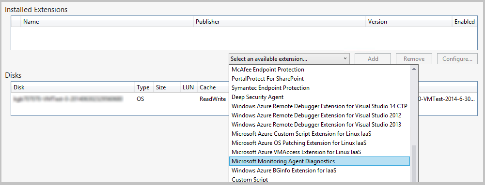
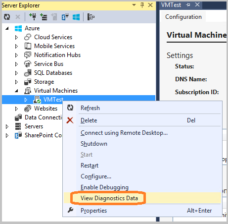

<properties
   pageTitle="Configurando o diagnóstico para serviços de nuvem Azure e máquinas virtuais | Microsoft Azure"
   description="Descreve como configurar as informações de diagnóstico para depuração de serviços de cloude Azure e máquinas virtuais (VMs) no Visual Studio."
   services="visual-studio-online"
   documentationCenter="na"
   authors="TomArcher"
   manager="douge"
   editor="" />
<tags
   ms.service="multiple"
   ms.devlang="dotnet"
   ms.topic="article"
   ms.tgt_pltfrm="na"
   ms.workload="multiple"
   ms.date="08/15/2016"
   ms.author="tarcher" />

# <a name="configuring-diagnostics-for-azure-cloud-services-and-virtual-machines"></a>Configurando o diagnóstico para serviços de nuvem Azure e máquinas virtuais

Quando você precisar solucionar problemas de um serviço de nuvem Azure ou Azure máquina virtual, você pode configurar o diagnóstico do Azure com mais facilidade usando Visual Studio. Diagnóstico do Azure captura dados de sistema e dados de log nas máquinas virtuais e instâncias de máquina virtual que executam o seu serviço de nuvem e transfere dados para uma conta de armazenamento de sua escolha. Consulte [Habilitar o registro em log para web apps em um serviço de aplicativo do Azure de diagnóstico](./app-service-web/web-sites-enable-diagnostic-log.md) para obter mais informações sobre o diagnóstico de registro em log no Azure.

Este tópico mostra como habilitar e configurar o diagnóstico do Azure no Visual Studio, ambos antes e depois implantação, bem como em Azure máquinas virtuais. Ele também mostra como selecionar os tipos de informações de diagnóstico para coletar e como exibir as informações, ele é coletado.

Você pode configurar o diagnóstico do Azure das seguintes maneiras:

- Você pode alterar configurações de diagnóstico por meio da caixa de diálogo **Configuração de diagnóstico** no Visual Studio. As configurações são salvas em um arquivo denominado diagnostics.wadcfgx (diagnostics.wadcfg no Azure SDK 2,4 ou anterior). Como alternativa, você pode modificar diretamente o arquivo de configuração. Se você atualizar manualmente o arquivo, as alterações de configuração terá efeito na próxima vez que você implanta a nuvem serviço no Azure ou executar o serviço no emulador.

- Use o **Explorador de nuvem** ou **Server Explorer** no Visual Studio para alterar as configurações de diagnóstico para um serviço de nuvem em execução ou máquina virtual.

## <a name="azure-26-diagnostics-changes"></a>Alterações de diagnóstico do Azure 2.6

Para projetos do Azure SDK 2.6 no Visual Studio, as seguintes alterações foram feitas. (Essas alterações também se aplicam às versões posteriores do Azure SDK.)

- O emulador local agora dá suporte a diagnóstico. Isso significa que você pode coletar dados de diagnóstico e certifique-se de que seu aplicativo está criando os rastreamentos direito enquanto você está desenvolvendo e testando no Visual Studio. A cadeia de conexão `UseDevelopmentStorage=true` habilita a coleta de dados de diagnóstico enquanto você estiver executando o seu projeto de serviço de nuvem no Visual Studio usando o emulador de armazenamento do Azure. Todos os dados de diagnóstico são coletadas na conta de armazenamento (armazenamento de desenvolvimento).

- A cadeia de conexão de conta de armazenamento de diagnóstico (Microsoft.WindowsAzure.Plugins.Diagnostics.ConnectionString) é armazenada novamente no arquivo de configuração (.cscfg) do serviço. No Azure SDK 2.5 a conta de armazenamento de diagnóstico foi especificada no arquivo diagnostics.wadcfgx.

Há algumas diferenças notáveis entre como a cadeia de conexão trabalhou no Azure SDK 2,4 e anteriores e como ele funciona no Azure SDK 2.6 e versões posteriores.

- No Azure SDK 2,4 e anteriores, a cadeia de conexão foi usada como um tempo de execução pelo plug-in diagnóstico para obter as informações de conta de armazenamento para transferir logs de diagnóstico.

- No Azure SDK 2.6 e posterior, a cadeia de conexão de diagnóstico é usada pelo Visual Studio para configurar a extensão de diagnóstico com as informações da conta de armazenamento apropriado durante a publicação. A cadeia de conexão permite que você defina contas de armazenamento diferentes para as configurações de serviço diferente que Visual Studio usará durante a publicação. No entanto, porque o plug-in diagnóstico não está mais disponível (após Azure SDK 2.5), o arquivo de .cscfg por si só não pode habilitar a extensão de diagnóstico. Você precisa habilitar a extensão separadamente por meio de ferramentas como o Visual Studio ou PowerShell.

- Para simplificar o processo de configuração a extensão de diagnóstico com o PowerShell, a saída de pacote do Visual Studio também contém o XML de configuração público para a extensão de diagnóstico para cada função. Visual Studio usa a cadeia de conexão de diagnóstico para preencher as informações da conta de armazenamento presentes na configuração do pública. Os arquivos config público são criados na pasta Extensions e siga o padrão PaaSDiagnostics. &lt;Nome_da_função >. PubConfig.xml. Qualquer implantações do PowerShell com base podem usar esse padrão para mapear cada configuração para uma função.

- A cadeia de conexão no arquivo .cscfg também é usada pelo [portal do Azure](http://go.microsoft.com/fwlink/p/?LinkID=525040) para acessar os dados de diagnóstico para que ele pode aparecer na guia **Monitoring** . A cadeia de conexão é necessária para configurar o serviço para mostrar dados de monitoramento detalhados no portal.

## <a name="migrating-projects-to-azure-sdk-26-and-later"></a>Migrando projetos ao Azure SDK 2.6 e posterior

Ao migrar do Azure SDK 2,5 para Azure SDK 2.6 ou posterior, se você tiver uma conta de armazenamento de diagnóstico especificada no arquivo .wadcfgx, em seguida, ela permanecerá lá. Para tirar proveito da flexibilidade do usando contas de armazenamento diferentes para as configurações de armazenamento diferente, você precisará adicionar manualmente a cadeia de conexão ao seu projeto. Se você estiver migrando um projeto do Azure SDK 2,4 ou anterior para Azure SDK 2.6, as cadeias de caracteres de conexão de diagnóstico são preservadas. No entanto, observe as alterações no como cadeias de caracteres de conexão são tratadas no Azure SDK 2.6 conforme especificado na seção anterior.

### <a name="how-visual-studio-determines-the-diagnostics-storage-account"></a>Como o Visual Studio determina a conta de armazenamento de diagnóstico

- Se uma cadeia de conexão de diagnóstico for especificada no arquivo .cscfg, o Visual Studio o usa para configurar a extensão de diagnóstico ao publicar e ao gerar os arquivos xml de configuração pública durante a compactação.

- Se nenhuma cadeia de caracteres de conexão de diagnóstico for especificada no arquivo .cscfg, em seguida, Visual Studio volta ao usando a conta de armazenamento especificada no arquivo .wadcfgx para configurar a extensão de diagnóstico quando a publicação e gerar os arquivos xml de configuração pública quando embalagem.

- A cadeia de conexão de diagnóstico no arquivo .cscfg tem precedência sobre a conta de armazenamento no arquivo .wadcfgx. Se uma cadeia de conexão de diagnóstico for especificada no arquivo .cscfg, o Visual Studio usa e ignora a conta de armazenamento em .wadcfgx.

### <a name="what-does-the-update-development-storage-connection-strings-checkbox-do"></a>O que significa as "Atualizar armazenamento conexão cadeias de desenvolvimento..." caixa de seleção fazer?

A caixa de seleção **Atualizar cadeias de conexão de armazenamento de desenvolvimento para diagnóstico e cache com as credenciais de conta do Microsoft Azure armazenamento quando a publicação no Microsoft Azure** fornece uma maneira conveniente de atualizar as cadeias de caracteres de conexão de conta de armazenamento de desenvolvimento com a conta de armazenamento do Azure especificada durante a publicação.

Por exemplo, suponha que você marque esta caixa de seleção e especifica a cadeia de conexão de diagnóstico `UseDevelopmentStorage=true`. Quando você publicar o projeto do Azure, Visual Studio atualizará automaticamente a cadeia de conexão de diagnóstico com a conta de armazenamento que você especificou no Assistente de publicação. No entanto, se uma conta de armazenamento real foi especificada como a cadeia de conexão de diagnóstico, em seguida, essa conta é usada.

## <a name="diagnostics-functionality-differences-between-azure-sdk-24-and-earlier-and-azure-sdk-25-and-later"></a>Diferenças de recursos de diagnóstico entre Azure SDK 2,4 e anterior e Azure SDK 2,5 e posterior

Se você estiver atualizando seu projeto do Azure SDK 2,4 Azure SDK 2.5 ou posterior, você deve ter em mente as seguintes diferenças de funcionalidade de diagnóstico.

- **APIs de configuração são preteridos** – configuração programação de diagnósticos está disponível no Azure SDK 2,4 ou versões anteriores, mas está obsoleta no Azure SDK 2.5 e versões posteriores. Se sua configuração de diagnóstico está definida atualmente no código, você precisará reconfigurar essas configurações do zero no projeto migrado em ordem para diagnósticos para continuar trabalhando. O arquivo de configuração de diagnóstico do Azure SDK 2,4 é diagnostics.wadcfg e diagnostics.wadcfgx do Azure SDK 2.5 e versões posteriores.

- **Diagnóstico para aplicativos de serviço de nuvem só pode ser configurado no nível de função, não no nível de instância.**

- **Sempre que você implanta seu aplicativo, a configuração de diagnóstico é atualizada** – isso pode causar problemas de paridade se você alterar a configuração de diagnóstico do Server Explorer e reimplanta o aplicativo.

- **No Azure SDK 2,5 e posteriores, falhar despejos estão configurados no arquivo de configuração de diagnóstico, não no código** – se você tiver despejos configurados no código, você precisará transferir manualmente a configuração de código para o arquivo de configuração, porque os despejos não são transferidos durante a migração para Azure SDK 2.6.

## <a name="enable-diagnostics-in-cloud-service-projects-before-deploying-them"></a>Habilitar o diagnóstico em projetos de serviço de nuvem antes de implantá-los

No Visual Studio, você pode optar por coletar dados de diagnóstico para funções que executam no Azure, quando você executar o serviço no emulador antes de implantá-lo. Todas as alterações nas configurações de diagnóstico no Visual Studio são salvas no arquivo de configuração diagnostics.wadcfgx. Estas configurações especificam a conta de armazenamento onde os dados de diagnóstico são salvos quando você implanta o seu serviço de nuvem.

### <a name="to-enable-diagnostics-in-visual-studio-before-deployment"></a>Para habilitar o diagnóstico no Visual Studio antes da implantação

1. No menu de atalho para a função que interessa a você, escolha **Propriedades**e, em seguida, escolha a guia **configuração** na janela de **Propriedades** da função.

1. Na seção **Diagnóstico** , certifique-se de que a caixa de seleção **Habilitar o diagnóstico** está selecionada.

    

1. Escolha o botão de reticências (...) para especificar a conta de armazenamento onde deseja que os dados de diagnóstico para ser armazenado. A conta de armazenamento que você escolher será o local onde os dados de diagnóstico estão armazenados.

    

1. Na caixa de diálogo **Criar cadeia de Conexão de armazenamento** , especifique se você deseja se conectar usando o emulador de armazenamento do Azure, uma assinatura do Azure, ou inseridos manualmente credenciais.

    

  - Se você escolher o Microsoft Azure emulador de armazenamento opção, a cadeia de conexão está definida como seja UseDevelopmentStorage = true.

  - Se você escolher a opção sua assinatura, você pode escolher a Azure assinatura que você deseja usar e o nome da conta. Você pode escolher o botão Gerenciar contas para gerenciar suas assinaturas Azure.

  - Se você escolher a opção de credenciais inserida manualmente, você será solicitado a inserir o nome e a chave da conta do Azure que você deseja usar.

1. Escolha o botão **Configurar** para exibir a caixa de diálogo **configuração de diagnóstico** . Cada guia (exceto para **gerais** e **Diretórios de Log**) representa uma fonte de dados de diagnóstico que você pode coletar. Na guia padrão, **Geral**, oferece as seguintes opções de conjunto de dados de diagnóstico: **somente erros**, **todas as informações**e **plano de personalizado**. A opção padrão, **somente erros**, leva o mínimo de armazenamento porque ela não transferir avisos ou mensagens de rastreamento. A opção de informações tudo transfere a maioria das informações e é, portanto, a opção mais cara em termos de armazenamento.

    

1. Neste exemplo, selecione a opção de **plano personalizado** , e você pode personalizar os dados coletados.

1. A caixa de **Cota de disco em MB** Especifica quanto espaço você deseja alocar em sua conta de armazenamento para dados de diagnóstico. Se desejar, você pode alterar o valor padrão.

1. Em cada guia de dados de diagnóstico que você deseja coletar, selecione seu **Ativar transferência de <log type> ** caixa de seleção. Por exemplo, se você quiser coletar logs de aplicativo, marque a caixa de seleção **Habilitar transferência de Logs do aplicativo** na guia **Logs de aplicativos** . Além disso, especifique outras informações necessárias para cada tipo de dados de diagnóstico. Consulte a seção **Configurar fontes de dados de diagnóstico** neste tópico para obter informações de configuração em cada guia.

1. Depois que você tiver habilitado o conjunto de todos os dados de diagnóstico desejada, escolha o botão de **Okey** .

1. Execute seu projeto de serviço de nuvem Azure no Visual Studio como de costume. Como usar o aplicativo, as informações de log ativado é salvo para a conta de armazenamento do Azure especificada.

## <a name="enable-diagnostics-in-azure-virtual-machines"></a>Habilitar o diagnóstico do Azure máquinas virtuais

No Visual Studio, você pode optar por coletar dados de diagnóstico para Azure máquinas virtuais.

### <a name="to-enable-diagnostics-in-azure-virtual-machines"></a>Para habilitar o diagnóstico do Azure máquinas virtuais

1. No **Server Explorer**, escolha o nó Azure e conecte-se à sua assinatura do Azure, se você ainda não estiver conectado.

1. Expanda o nó de **máquinas virtuais** . Você pode criar uma nova máquina virtual ou selecione uma que já está lá.

1. No menu de atalho para a máquina virtual que interessa a você, escolha **Configure**. Isso mostra a caixa de diálogo de configuração de máquina virtual.

    

1. Se ele ainda não estiver instalado, adicione a extensão do diagnóstico do agente de monitoramento Microsoft. Essa extensão permite que você coletar dados de diagnóstico para a máquina virtual Azure. Na lista Extensões instalado, escolha Selecionar um menu suspenso de extensão disponíveis e escolha diagnóstico do agente de monitoramento Microsoft.

    

    >[AZURE.NOTE] Outras extensões de diagnóstico estão disponíveis para suas máquinas virtuais. Para obter mais informações, consulte extensões de máquina virtual do Azure e recursos.

1. Escolha o botão **Adicionar** para adicionar a extensão e exibir sua caixa de diálogo **configuração de diagnóstico** .

1. Escolha o botão **Configurar** para especificar uma conta de armazenamento e, em seguida, escolha o botão de **Okey** .

    Cada guia (exceto para **gerais** e **Diretórios de Log**) representa uma fonte de dados de diagnóstico que você pode coletar.

    

    Na guia padrão, **Geral**, oferece as seguintes opções de conjunto de dados de diagnóstico: **somente erros**, **todas as informações**e **plano de personalizado**. A opção padrão, **somente erros**, leva o mínimo de armazenamento porque ela não transferir avisos ou mensagens de rastreamento. A opção **todas as informações** transfere a maioria das informações e é, portanto, a opção mais cara em termos de armazenamento.

1. Neste exemplo, selecione a opção de **plano personalizado** , e você pode personalizar os dados coletados.

1. A caixa de **Cota de disco em MB** Especifica quanto espaço você deseja alocar em sua conta de armazenamento para dados de diagnóstico. Se desejar, você pode alterar o valor padrão.

1. Em cada guia de dados de diagnóstico que você deseja coletar, selecione seu **Ativar transferência de <log type> ** caixa de seleção.

    Por exemplo, se você quiser coletar logs de aplicativo, marque a caixa de seleção **Habilitar transferência de Logs do aplicativo** na guia **Logs de aplicativos** . Além disso, especifique outras informações necessárias para cada tipo de dados de diagnóstico. Consulte a seção **Configurar fontes de dados de diagnóstico** neste tópico para obter informações de configuração em cada guia.

1. Depois que você tiver habilitado o conjunto de todos os dados de diagnóstico desejada, escolha o botão de **Okey** .

1. Salve o projeto atualizado.

    Você verá uma mensagem na janela do **Log de atividade do Microsoft Azure** que a máquina virtual foi atualizada.

## <a name="configure-diagnostics-data-sources"></a>Configurar fontes de dados de diagnóstico

Após habilitar a coleta de dados de diagnóstico, você pode escolher exatamente quais fontes de dados que você deseja coletar e quais informações são coletadas. A seguir está uma lista das guias na caixa de diálogo **configuração de diagnóstico** e significa que cada opção de configuração.

### <a name="application-logs"></a>Logs de aplicativos

**Logs de aplicativos** contêm informações de diagnóstico produzidas por um aplicativo web. Se você deseja capturar logs de aplicativos, selecione a caixa de seleção **Habilitar a transferência de Logs do aplicativo** . Você pode aumentar ou diminuir o número de minutos quando os logs do aplicativo são transferidos para sua conta de armazenamento, alterando o valor do **Período de transferência (min)** . Você também pode alterar a quantidade de informações capturadas no log de definindo o valor de nível de Log. Por exemplo, você pode escolher **detalhado** para obter mais informações ou escolha **crítica** para capturar apenas os erros críticos. Se você tiver um provedor de diagnósticos específicos que emite logs de aplicativos, você pode capturá-los, adicionando o GUID do provedor à caixa **GUID do provedor** .

  

  Para obter mais informações sobre logs de aplicativo, consulte [Habilitar o registro em log para web apps em um serviço de aplicativo do Azure de diagnóstico](./app-service-web/web-sites-enable-diagnostic-log.md) .

### <a name="windows-event-logs"></a>Logs de eventos do Windows

Se você deseja capturar logs de eventos do Windows, marque a caixa de seleção **Habilitar a transferência de Logs de eventos do Windows** . Você pode aumentar ou diminuir o número de minutos quando os logs de eventos são transferidos para sua conta de armazenamento, alterando o valor do **Período de transferência (min)** . Marque as caixas de seleção para os tipos de eventos que você deseja acompanhar.

  

Se você estiver usando o SDK do Azure 2.6 ou posterior e deseja especificar uma fonte de dados personalizados, insira-o na **<Data source name>** texto caixa e escolha o botão **Adicionar** ao lado dela. A fonte de dados é adicionada ao arquivo diagnostics.cfcfg.

Se você estiver usando o Azure SDK 2,5 e deseja especificar uma fonte de dados personalizados, você pode adicioná-lo para o `WindowsEventLog` seção a diagnostics.wadcfgx de arquivo, tais como no exemplo a seguir.

```
<WindowsEventLog scheduledTransferPeriod="PT1M">
   <DataSource name="Application!*" />
   <DataSource name="CustomDataSource!*" />
</WindowsEventLog>
```
### <a name="performance-counters"></a>Contadores de desempenho

Informações de contador de desempenho podem ajudá-lo a localizar gargalos no sistema e ajustar o desempenho do sistema e do aplicativo. Para obter mais informações, consulte [criar e usar contadores de desempenho em um aplicativo do Azure](https://msdn.microsoft.com/library/azure/hh411542.aspx) . Se você deseja capturar contadores de desempenho, marque a caixa de seleção **Habilitar a transferência de contadores de desempenho** . Você pode aumentar ou diminuir o número de minutos quando os logs de eventos são transferidos para sua conta de armazenamento, alterando o valor do **Período de transferência (min)** . Marque as caixas de seleção para os contadores de desempenho que você deseja acompanhar.

  

Para acompanhar um contador de desempenho que não esteja listado, insira-o usando a sintaxe sugerida e escolha o botão **Adicionar** . O sistema operacional na máquina virtual determina quais contadores de desempenho que você pode controlar. Para obter mais informações sobre a sintaxe, consulte [especificar um caminho de contador](https://msdn.microsoft.com/library/windows/desktop/aa373193.aspx).

### <a name="infrastructure-logs"></a>Logs de infraestrutura

Se você deseja capturar logs de infraestrutura, que contêm informações sobre a infraestrutura de diagnóstico Azure, o módulo de acesso remoto e o módulo RemoteForwarder, marque a caixa de seleção **Habilitar transferência de infraestrutura Logs** . Você pode aumentar ou diminuir o número de minutos quando os logs são transferidos para sua conta de armazenamento, alterando o valor do período de transferência (min).

  

  Consulte [Coletar dados de registro em log pelo usando o diagnóstico do Azure](https://msdn.microsoft.com/library/azure/gg433048.aspx) para obter mais informações.

### <a name="log-directories"></a>Diretórios de log

Se você deseja capturar diretórios de log, que contêm os dados coletados de diretórios de log para solicitações de serviços de informações da Internet (IIS), solicitações com falha ou pastas que você escolher, marque a caixa de seleção **Ativar transferência de diretórios de Log** . Você pode aumentar ou diminuir o número de minutos quando os logs são transferidos para sua conta de armazenamento, alterando o valor do **Período de transferência (min)** .

Você pode selecionar as caixas dos logs que você deseja coletar, como **Logs do IIS** e Logs de **Falha na solicitação** . Nomes de contêiner de armazenamento de padrão são fornecidos, mas você pode alterar os nomes, se desejar.

Além disso, você pode capturar logs de qualquer pasta. Basta especificar o caminho da seção de **Log do diretório absoluto** e escolha o botão **Adicionar diretório** . Os logs serão capturados para os contêineres especificados.

  

### <a name="etw-logs"></a>Logs ETW

Se você usa o [Rastreamento de eventos do Windows](https://msdn.microsoft.com/library/windows/desktop/bb968803(v=vs.85).aspx) (ETW) e deseja capturar logs ETW, marque a caixa de seleção **Habilitar transferência ETW Logs de erros** . Você pode aumentar ou diminuir o número de minutos quando os logs são transferidos para sua conta de armazenamento, alterando o valor do **Período de transferência (min)** .

Os eventos são capturados de fontes de evento e manifestos de evento que você especificar. Para especificar uma fonte de evento, insira um nome na seção **Evento de fontes** e escolha o botão **Adicionar fonte de evento** . Da mesma forma, você pode especificar um manifesto de evento na seção **Manifestos de evento** e, em seguida, escolha o botão **Adicionar manifesto do evento** .

  

  A estrutura ETW é suportada no ASP.NET por meio de classes no [System.Diagnostics.aspx] (namespace https://msdn.microsoft.com/library/system.diagnostics (v=vs.110). Namespace Microsoft.WindowsAzure.Diagnostics, que herda do e estende padrão [System.Diagnostics.aspx] (https://msdn.microsoft.com/library/system.diagnostics (v=vs.110) classes, permite o uso de [System.Diagnostics.aspx] (https://msdn.microsoft.com/library/system.diagnostics (v=vs.110) como uma estrutura de registro em log no ambiente do Azure. Para obter mais informações, consulte [ [Fazer controle de registro em log e rastreamento no Microsoft Azure](https://msdn.microsoft.com/magazine/ff714589.aspx) habilitando diagnósticos](./cloud-services/cloud-services-dotnet-diagnostics.md)e nos serviços de nuvem do Azure e máquinas virtuais.

### <a name="crash-dumps"></a>Despejos

Se você quiser capturar informações sobre quando uma instância da função trava, marque a caixa de seleção **Habilitar a transferência de falhar descarta** . (Porque ASP.NET manipula a maioria das exceções, isso é geralmente útil somente para funções de trabalho.) Você pode aumentar ou diminuir a porcentagem de espaço de armazenamento voltado para os despejos alterando o valor de **Cota de diretório (%)** . Você pode alterar o contêiner de armazenamento onde são armazenados os despejos, e você pode selecionar se deseja capturar um despejo **completo** ou **Mini** .

Os processos atualmente sendo controlados são listados. Marque as caixas de seleção para os processos que você deseja capturar. Para adicionar outro processo à lista, insira o nome do processo e, em seguida, escolha o botão de **Processo de adicionar** .

  

  Consulte [levar controle de registro em log e rastreamento no Microsoft Azure](https://msdn.microsoft.com/magazine/ff714589.aspx) e [Microsoft Azure diagnóstico parte 4: alterações de 1.3 de diagnóstico do Azure e componentes de registrar em log personalizados](http://justazure.com/microsoft-azure-diagnostics-part-4-custom-logging-components-azure-diagnostics-1-3-changes/) para obter mais informações.

## <a name="view-the-diagnostics-data"></a>Exibir os dados de diagnóstico

Depois de você coletadas os dados de diagnóstico para um serviço de nuvem ou uma máquina virtual, você pode exibi-la.

### <a name="to-view-cloud-service-diagnostics-data"></a>Para exibir dados de diagnóstico de serviço de nuvem

1. Implante seu serviço de nuvem como de costume e execute-o.

1. Você pode exibir os dados de diagnóstico em um relatório que o Visual Studio gera ou tabelas em sua conta de armazenamento. Para exibir os dados em um relatório, abra o **Explorador de nuvem** ou **Server Explorer**, abra o menu de atalho do nó para a função que interessa a você e escolha **Exibir dados de diagnóstico**.

    

    Um relatório que mostra os dados disponíveis é exibida.

    

    Se os dados mais recentes não aparecerem, talvez você precise esperar o período de transferência decorrer.

    Escolha o link **Atualizar** para atualizar os dados imediatamente, ou um intervalo na caixa de listagem suspensa **Atualização automática** para ter os dados atualizados automaticamente. Para exportar os dados de erro, escolha o botão **Exportar para CSV** para criar um arquivo de valores separados por vírgula, que você pode abrir em uma planilha.

    No **Explorador de nuvem** ou **Server Explorer**, abra a conta de armazenamento associado com a implantação.

1. Abrir as tabelas de diagnóstico no Visualizador da tabela e, em seguida, revise os dados que você coletados. Para logs do IIS e logs personalizados, você pode abrir um contêiner de blob. Consultando a tabela a seguir, você pode encontrar o contêiner de tabela ou blob que contém os dados que interessa a você. Além dos dados para esse arquivo de log, as entradas de tabela contêm EventTickCount, DeploymentId, função e RoleInstance para ajudá-lo a identificar quais máquina virtual e função gerados os dados e quando. 

  	|Dados de diagnóstico|Descrição|Local|
  	|---|---|---|
  	|Logs de aplicativos|Logs de que seu código gera chamando métodos da classe System.Diagnostics.Trace.|WADLogsTable|
  	|Logs de eventos|Esses dados são dos logs de eventos do Windows nas máquinas virtuais. O Windows armazena informações nesses logs, mas aplicativos e serviços também usá-los para o relatório de erros ou registrar informações.|WADWindowsEventLogsTable|
  	|Contadores de desempenho|Você pode coletar dados em qualquer contador de desempenho que está disponível na máquina virtual. O sistema operacional fornece contadores de desempenho, que incluem muitos estatísticas como o tempo de uso e processador de memória.|WADPerformanceCountersTable|
  	|Logs de infraestrutura|Esses logs são gerados de infraestrutura do diagnóstico em si.|WADDiagnosticInfrastructureLogsTable|
  	|Logs do IIS|Esses logs registram solicitações da web. Se seu serviço de nuvem obtém uma quantidade significativa de tráfego, esses logs podem ser muito longas, portanto você deve coletar e armazenar dados apenas quando precisar.|Você pode encontrar logs de solicitação falha no contêiner de blob em wad-iis-failedreqlogs em um caminho para essa implantação, função e instância. Você pode encontrar completas logs em wad-iis-arquivos de log. As entradas para cada arquivo são feitas na tabela WADDirectories.|
  	|Despejos|Essas informações fornecem imagens binárias do processo do seu serviço de nuvem (geralmente uma função de trabalho).|contêiner de blob wad-crush-despejos|
  	|Arquivos de log personalizado|Logs de dados que você predefinidos.|Você pode especificar no código o local dos arquivos de log personalizado em sua conta de armazenamento. Por exemplo, você pode especificar um contêiner de blob personalizado.|

1. Se qualquer tipo de dados são truncados, você pode tentar aumentar o buffer para os dados tipo ou diminuindo o intervalo entre transferências de dados de máquina virtual para sua conta de armazenamento.

1. (opcional) Limpe dados da conta de armazenamento ocasionalmente para reduzir os custos gerais de armazenamento.

1. Quando você fizer uma implantação completa, o arquivo de diagnostics.cscfg (.wadcfgx do Azure SDK 2.5) é atualizado no Azure e seu serviço de nuvem seleciona quaisquer alterações à sua configuração de diagnóstico. Se, em vez disso, atualizar uma implantação existente, o arquivo .cscfg não é atualizado no Azure. Você ainda pode alterar as configurações do diagnóstico, porém, seguindo as etapas na próxima seção. Para obter mais informações sobre como executar uma implantação completa e atualizando uma implantação existente, consulte [Publicar Assistente de aplicativo do Azure](vs-azure-tools-publish-azure-application-wizard.md).

### <a name="to-view-virtual-machine-diagnostics-data"></a>Para exibir dados de diagnóstico de máquina virtual

1. No menu de atalho para a máquina virtual, escolha **Exibir dados de diagnóstico**.

    

    Isso abre a janela de **Resumo de diagnóstico** .

      

    Se os dados mais recentes não aparecerem, talvez você precise esperar o período de transferência decorrer.

    Escolha o link **Atualizar** para atualizar os dados imediatamente, ou um intervalo na caixa de listagem suspensa **Atualização automática** para ter os dados atualizados automaticamente. Para exportar os dados de erro, escolha o botão **Exportar para CSV** para criar um arquivo de valores separados por vírgula, que você pode abrir em uma planilha.

## <a name="configure-cloud-service-diagnostics-after-deployment"></a>Configurar diagnósticos de serviço de nuvem após a implantação

Se você estiver investigar um problema com uma nuvem serviço que já está executando, talvez você queira coletar dados que você não especificar antes de você implantou originalmente a função. Nesse caso, você pode começar a coletar dados usando as configurações no Server Explorer. Você pode configurar o diagnóstico para uma única instância ou todas as instâncias em uma função, dependendo se você abrir a caixa de diálogo Configuração de diagnóstico no menu de atalho para a instância ou a função. Se você configurar o nó de função, quaisquer alterações se aplicam a todas as instâncias. Se você configurar o nó da instância, quaisquer alterações se aplicam a essa instância somente.

### <a name="to-configure-diagnostics-for-a-running-cloud-service"></a>Configurar diagnósticos para um serviço de nuvem em execução

1. No Server Explorer, expanda o nó **Serviços de nuvem** e, em seguida, expanda nós para localizar a função ou instância que você deseja investigar ou ambos.

    

1. No menu de atalho de um nó de instância ou uma função, escolha **As configurações do diagnóstico de atualização**e, em seguida, escolha as configurações de diagnósticos que você deseja coletar.

    Para obter informações sobre as definições de configuração, consulte **Configurar fontes de dados de diagnóstico** neste tópico. Para obter informações sobre como exibir os dados de diagnóstico, consulte **Exibir os dados de diagnóstico** neste tópico.

    Se você alterar o conjunto de dados no **Server Explorer**, essas alterações permanecerão em vigor até você reimplantar totalmente seu serviço de nuvem. Se você usa o padrão de configurações de publicação, as alterações não são substituídas, como o padrão publicar configuração é atualizar a implantação existente, em vez de fazer uma nova e completa implantação. Para garantir que as configurações de limpar no momento da implantação, acesse a guia **Configurações avançadas** do Assistente de publicação e desmarque a caixa de seleção **atualizar de implantação** . Quando você reimplanta com essa caixa de seleção desmarcada, as configurações revertê-las no arquivo .wadcfgx (ou .wadcfg) conforme definido por meio do editor de propriedades para a função. Se você atualizar sua implantação, o Azure mantém as configurações antigas.

## <a name="troubleshoot-azure-cloud-service-issues"></a>Solucionar problemas de serviço de nuvem do Azure

Se você enfrentar problemas com seus projetos de serviço de nuvem, como uma função que fica presa em um status de "ocupado", repetidamente reciclagem ou gera um erro de servidor interno, existem ferramentas e técnicas que você pode usar para diagnosticar e corrigir esses problemas. Para exemplos específicos de problemas comuns e soluções, bem como uma visão geral dos conceitos e ferramentas usadas para diagnosticar e corrigir esses erros, consulte [Dados de diagnóstico de computação do Azure PaaS](http://blogs.msdn.com/b/kwill/archive/2013/08/09/windows-azure-paas-compute-diagnostics-data.aspx).

## <a name="q--a"></a>P & r

**Qual é o tamanho de buffer e como grandes será?**

Em cada instância de máquina virtual, as cotas de limitam a quantidade de dados diagnóstico pode ser armazenado no sistema de arquivos local. Além disso, você pode especificar um tamanho de buffer para cada tipo de dados de diagnóstico que está disponíveis. Esse tamanho de buffer atua como cota individual para esse tipo de dados. Verificando a parte inferior da caixa de diálogo, você pode determinar a cota de geral e a quantidade de memória que permanece. Se você especificar buffers maiores ou mais tipos de dados, você vai abordagem a cota de geral. Você pode alterar a cota de geral modificando o arquivo de configuração de diagnostics.wadcfg/.wadcfgx. Os dados de diagnóstico são armazenados no sistema de arquivos mesmo como os dados do aplicativo, para que se seu aplicativo usa muito espaço em disco, você não deve aumentar a cota de diagnóstico geral.

**O que é o período de transferência, e quanto tempo deve ser?**

O período de transferência é a quantidade de tempo que captura ter decorrido entre os dados. Depois de cada período de transferência, dados são movidos do sistema de arquivos local em uma máquina virtual para tabelas em sua conta de armazenamento. Se a quantidade de dados coletados exceder a cota antes do final de um período de transferência, dados mais antigos são descartados. Talvez você queira diminuir o período de transferência, se você estiver perda de dados porque seus dados excedem o tamanho de buffer ou a cota de geral.

**Fuso horário são os carimbos de hora no?**

Os carimbos de hora estão no fuso horário local do data center que hospeda seu serviço de nuvem. As seguintes três colunas de carimbo de hora nas tabelas de log são usadas.

  - **PreciseTimeStamp** é o carimbo de hora do ETW do evento. Isto é, o tempo que o evento é registrado do cliente.

  - **Carimbo de hora** é PreciseTimeStamp arredondado para baixo até o limite de frequência de carregamento. Portanto, se sua frequência de carregamento é 5 minutos e o evento tempo 00:17:12, carimbo de hora será 15:00:00.

  - **Carimbo de hora** é o carimbo de hora em que a entidade foi criada na tabela Azure.

**Como gerenciar custos ao coletar informações de diagnóstico?**

As configurações padrão (**nível de Log** definido como **erro** e **Transferir período** definido como **1 minuto**) foram projetadas para minimizar o custo. Os custos de computação aumentará se você coleta dados de diagnóstico mais ou diminuir o período de transferência. Não colete mais dados que você precisa e não se esqueça de desativar coleta de dados quando você não precisa mais dela. Você sempre poderá ativá-lo novamente, mesmo em tempo de execução, conforme mostrado na seção anterior.

**Como posso coletar logs de solicitação falha do IIS?**

Por padrão, o IIS não coletar logs de solicitação-falha. Você pode configurar o IIS para reuni-las se você editar o arquivo Web. config para sua função web.

**Não estou recebendo informações de rastreamento de métodos de RoleEntryPoint como OnStart. Qual é o problema?**

Os métodos de RoleEntryPoint são chamados no contexto da WAIISHost.exe, não IIS. Portanto, as informações de configuração em Web. config que normalmente permite que o rastreamento não se aplica. Para resolver esse problema, adicione um arquivo. config ao seu projeto de função web e nomeie o arquivo para corresponder ao assembly de saída que contém o código de RoleEntryPoint. No projeto de função da web padrão, o nome do arquivo. config seria WAIISHost.exe.config. Em seguida, adicione as seguintes linhas a esse arquivo:

```
<system.diagnostics>
  <trace>
      <listeners>
          <add name “AzureDiagnostics” type=”Microsoft.WindowsAzure.Diagnostics.DiagnosticMonitorTraceListener”>
              <filter type=”” />
          </add>
      </listeners>
  </trace>
</system.diagnostics>
```

Agora, na janela **Propriedades** , defina a propriedade de **Copiar para diretório de saída** **sempre**cópia.

## <a name="next-steps"></a>Próximas etapas

Para saber mais sobre o diagnóstico de registro em log no Azure, consulte [Habilitando diagnóstico nos serviços de nuvem do Azure e máquinas virtuais](./cloud-services/cloud-services-dotnet-diagnostics.md) e [Habilitar o registro em log para web apps em um serviço de aplicativo do Azure de diagnóstico](./app-service-web/web-sites-enable-diagnostic-log.md).
