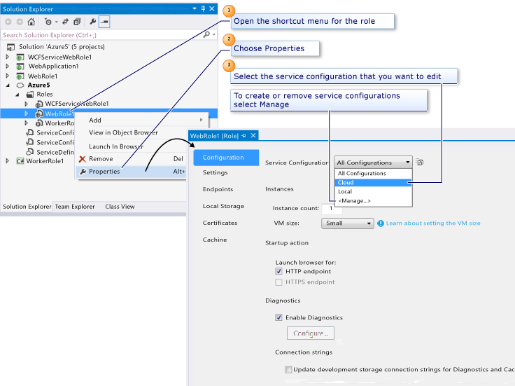

<properties
   pageTitle="Configurando o projeto de Azure usando várias configurações de serviço | Microsoft Azure"
   description="Saiba como configurar um projeto de serviço de nuvem Azure alterando os arquivos ServiceDefinition.csdef e ServiceConfiguration."
   services="visual-studio-online"
   documentationCenter="na"
   authors="TomArcher"
   manager="douge"
   editor="" />
<tags
   ms.service="multiple"
   ms.devlang="multiple"
   ms.topic="article"
   ms.tgt_pltfrm="na"
   ms.workload="na"
   ms.date="08/15/2016"
   ms.author="tarcher" />

# Configurando o projeto de Azure usando várias configurações de serviço

Um projeto de serviço de nuvem Azure inclui dois arquivos de configuração: ServiceDefinition.csdef e ServiceConfiguration. Esses arquivos são fornecidos com o seu aplicativo de serviço de nuvem Azure e implantados no Azure.

- O arquivo **ServiceDefinition.csdef** contém os metadados que é requerido pelo ambiente do Azure para os requisitos do seu aplicativo de serviço de nuvem, incluindo quais funções que ela contém. Esse arquivo também contém definições de configuração que se aplicam a todas as instâncias. Essas configurações podem ser lidos em tempo de execução usando a API de tempo de execução de hospedagem do Azure serviço. Este arquivo não pode ser atualizado enquanto seu serviço está em execução no Azure.

- O arquivo de **ServiceConfiguration** conjuntos de valores para as configurações definidas no arquivo de definição de serviço e especifica o número de instâncias para executar para cada função. Este arquivo pode ser atualizado enquanto seu serviço de nuvem é executado no Azure.

As ferramentas do Azure para Microsoft Visual Studio fornecem páginas de propriedade que você pode usar para definir as configurações armazenadas nesses arquivos. Para acessar as páginas de propriedades, clique duas vezes na referência de função sob o projeto de serviço de nuvem Azure no Solution Explorer, ou clique com botão direito a referência de função e escolha **Propriedades**, conforme mostrado na figura a seguir.

Para obter informações sobre os esquemas subjacentes para a definição de serviço e os arquivos de configuração do serviço, consulte a [Referência de esquema](https://msdn.microsoft.com/library/azure/dd179398.aspx). Para obter mais informações sobre a configuração de serviço, consulte [como configurar serviços de nuvem](./cloud-services/cloud-services-how-to-configure.md).

## Configurando as propriedades de função

Páginas de propriedade para uma função web e uma função de trabalho são semelhantes, embora existam algumas diferenças, indicadas nas seções a seguir.

Na página do **cache** , você pode configurar o Azure cache serviços.

### Página de configuração

Na página de **configuração** , você pode definir essas propriedades:

**Instâncias**

Defina a propriedade de contagem de **instância** para o número de instâncias que do serviço deve executar para essa função.

Defina a propriedade de **tamanho de máquina virtual** para **Extra pequena**, **pequeno**, **Médio**, **grande**ou **Extra grande**.  Para obter mais informações, consulte [tamanhos para serviços de nuvem](./cloud-services/cloud-services-sizes-specs.md).

**Ação de inicialização** (Somente para a função web)

Defina esta propriedade para especificar que o Visual Studio deve iniciar um navegador da web para os pontos de extremidade HTTP, os pontos de extremidade HTTPS ou ambos quando você inicia a depuração.

A opção de ponto de extremidade HTTPS está disponível somente se você já tiver definido um ponto de extremidade HTTPS para sua função. Você pode definir um ponto de extremidade HTTPS na página de propriedades de **pontos de extremidade** .

Se você já tiver adicionado um ponto de extremidade HTTPS, a opção de ponto de extremidade HTTPS é ativada por padrão e Visual Studio iniciará um navegador para esse ponto de extremidade quando você começa a depuração, além de um navegador para seu ponto de extremidade HTTP. Isso pressupõe que ambas as opções de inicialização estão habilitadas.

**Diagnósticos**

Por padrão, o diagnóstico está habilitado para a função Web. A conta project e armazenamento do serviço de nuvem Azure são definidas como usar o emulador de armazenamento local. Quando você estiver pronto para implantar o Azure, você pode selecionar o botão de construtor (**…**) para atualizar a conta de armazenamento para usar o armazenamento do Azure na nuvem. Você pode transferir os dados de diagnóstico para a conta de armazenamento sob demanda ou intervalos agendada automaticamente. Para obter mais informações sobre o diagnóstico do Azure, consulte [Habilitando diagnóstico nos serviços de nuvem do Azure e máquinas virtuais](./cloud-services/cloud-services-dotnet-diagnostics.md).

## Página de configurações

Na página **configurações** , você pode adicionar configurações de seu serviço. As configurações estão pares nome-valor. Código em execução na função pode ler os valores das suas configurações em tempo de execução usando fornecidas pela [Azure gerenciado da biblioteca](http://go.microsoft.com/fwlink?LinkID=171026)de classes. Especificamente, o método [GetConfigurationSettingValue](https://msdn.microsoft.com/library/azure/microsoft.windowsazure.serviceruntime.roleenvironment.getconfigurationsettingvalue.aspx) retornará o valor de uma configuração de nomeado no tempo de execução.

### Configurando uma cadeia de conexão para uma conta de armazenamento

Uma cadeia de conexão é uma configuração que fornece conexão e informações de autenticação para o emulador de armazenamento ou para uma conta de armazenamento do Azure. Sempre que seu código deve acessar dados de serviços de armazenamento do Azure – ou seja, blob, fila ou dados de tabela – do código em execução em uma função, você precisará definir uma cadeia de conexão para essa conta de armazenamento.

Uma cadeia de conexão que aponta para uma conta de armazenamento do Azure deve usar um formato definido. Para obter informações sobre como criar cadeias de caracteres de conexão, consulte [Configurar cadeias de Conexão de armazenamento do Azure](./storage/storage-configure-connection-string.md).

Quando estiver pronto para testar seu serviço em relação aos serviços de armazenamento do Azure ou quando você estiver pronto para implantar o seu serviço de nuvem para o Azure, você pode alterar o valor de qualquer cadeias de caracteres de conexão para apontar para sua conta de armazenamento do Azure. Selecione (**…**), selecione **Enter credenciais de conta de armazenamento**. Insira suas informações de conta que inclui seu nome de conta e chave da conta. Na caixa de diálogo **Cadeia de Conexão de conta de armazenamento** , você também pode indicar se deseja usar os pontos de extremidade HTTPS de padrão (opção padrão), os pontos de extremidade HTTP padrão ou pontos de extremidade personalizados. Você pode decidir usar pontos de extremidade personalizados se você ter registrado um nome de domínio personalizado para seu serviço, conforme descrito em [Configurar um nome de domínio personalizado para dados de blob em uma conta de armazenamento do Azure](./storage/storage-custom-domain-name.md).

>[AZURE.IMPORTANT] Você deve modificar suas cadeias de caracteres de conexão para apontar para uma conta de armazenamento do Azure antes de implantar seu serviço. Falha ao fazer isso pode causar sua função não iniciar ou para percorrer os estados ao inicializar, ocupados e interromper.

## Página pontos de extremidade

Uma função de trabalho pode ter qualquer número de pontos de extremidade de HTTP, HTTPS ou TCP. Pontos de extremidade podem ser pontos de extremidade de entrada, que estão disponíveis para clientes externos, ou pontos de extremidade internos, que estão disponíveis para outras funções que estejam em execução no serviço.

- Para disponibilizar um ponto de extremidade HTTP para clientes externos e navegadores da Web, altere o tipo de ponto de extremidade para entrada e especifique um nome e um número de porta público.

- Para disponibilizar um ponto de extremidade HTTPS para clientes externos e navegadores da Web, altere o tipo de ponto de extremidade para **entrada**e especifique um nome, um número de porta público e um nome de certificado de gerenciamento.

    Observe que, para poder especificar um certificado de gerenciamento, você deve definir o certificado na página de propriedades de **certificados** .

- Para disponibilizar um ponto de extremidade para o acesso interno por outras funções no serviço de nuvem, altere o tipo de ponto de extremidade para interna e especifique um nome e possíveis portas privadas para esse ponto de extremidade.

## Página de armazenamento local

Você pode usar a página de propriedades do **Armazenamento Local** para reservar um ou mais recursos de armazenamento local para uma função. Um recurso de armazenamento local é um diretório reservado no sistema de arquivos da máquina virtual Azure na qual uma instância de uma função está em execução.

## Página de certificados

Na página de **certificados** , você pode associar certificados a sua função. Os certificados que você adicionar podem ser usados para configurar seus pontos de extremidade HTTPS na página de propriedades de **pontos de extremidade** .

A página de propriedades de **certificados** adiciona informações sobre os certificados de configuração do serviço. Observe que os certificados não são compactados com seu serviço; Você deve carregar seus certificados separadamente no Azure por meio do [Azure portal clássico](http://go.microsoft.com/fwlink/?LinkID=213885).

Para associar um certificado sua função, forneça um nome para o certificado. Você pode usar esse nome para se referir ao certificado quando você configura um ponto de extremidade HTTPS na página de propriedades de **pontos de extremidade** . Em seguida, especifica se o repositório de certificados **Máquina Local** ou **Usuário atual** e o nome da loja. Por fim, insira a impressão digital do certificado. Se o certificado estiver na User\Personal atual (Meu) store, você pode inserir a impressão digital do certificado, selecionando o certificado de uma lista preenchida. Se ele está localizado em qualquer outro local, insira o valor de impressão digital manualmente.

Quando você adiciona um certificado do repositório do certificado, quaisquer certificados intermediários são automaticamente adicionados às definições de configuração para você. Esses certificados intermediários também devem ser carregados Azure para configurar corretamente o serviço para SSL.

Quaisquer certificados de gerenciamento que você associar seu serviço se aplicam ao seu serviço somente quando ele é executado na nuvem. Quando o seu serviço está em execução no ambiente de desenvolvimento local, ele usa um certificado padrão que é gerenciado pelo emulador computação.

## Configurando o projeto de serviço de nuvem do Azure

Para definir as configurações que se aplicam a um projeto de serviço de nuvem Azure inteira, primeiro abrir o menu de atalho para esse nó do projeto e, em seguida, escolha Propriedades para abrir suas páginas de propriedades. A tabela a seguir mostra as páginas de propriedade.

|Página de propriedades|Descrição|
|---|---|
|Aplicativo|Nesta página, você pode exibir informações sobre a versão do Azure ferramentas que usa esse projeto de serviço de nuvem e você pode atualizar para a versão atual das ferramentas.|
|Compilar eventos|Nesta página, você pode configurar eventos de pré e pós compilação.|
|Desenvolvimento|Nesta página, você pode especificar instruções de configuração de compilação e as condições em que todos os eventos Post-build são executados.|
|Web|Nesta página, você pode definir configurações que se relacionam ao servidor web.|
