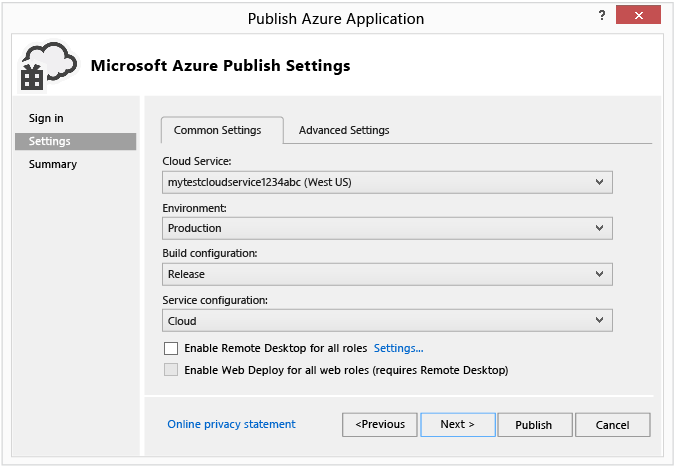
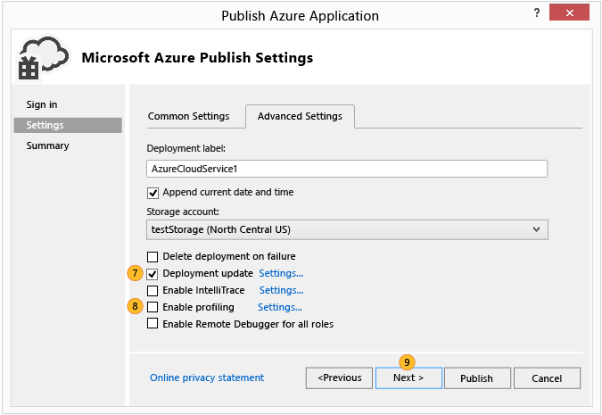

<properties 
   pageTitle="Assistente de aplicativo do Azure publicação | Microsoft Azure"
   description="Assistente de aplicativo do Azure de publicação"
   services="visual-studio-online"
   documentationCenter="na"
   authors="TomArcher"
   manager="douge"
   editor="" />
<tags 
   ms.service="multiple"
   ms.devlang="multiple"
   ms.topic="article"
   ms.tgt_pltfrm="na"
   ms.workload="na"
   ms.date="08/15/2016"
   ms.author="tarcher" />

# Assistente de aplicativo do Azure de publicação

## Visão geral

Depois de desenvolver um aplicativo da web no Visual Studio, você pode publicar o aplicativo mais facilmente em um serviço de nuvem Azure usando o Assistente para **Publicar aplicativos do Azure** . A primeira seção explica as etapas que você deve ser concluída antes de você usar o assistente, e as últimas seções explicam os recursos do assistente.

>[AZURE.NOTE] Este tópico é sobre como distribuir para serviços de nuvem, não a sites da web. Para obter informações sobre como implantar a sites, consulte [como implantar um Site do Azure](https://social.msdn.microsoft.com/Search/windowsazure?query=How%20to%20Deploy%20an%20Azure%20Web%20Site&Refinement=138&ac=4#refinementChanges=117&pageNumber=1&showMore=false).

## Pré-requisitos

Antes de publicar seu aplicativo web para Azure, é necessário ter uma conta da Microsoft e uma assinatura do Azure e você precisa associar seu aplicativo da web um serviço de nuvem Azure. Se você já concluiu essas tarefas, você pode pular para a próxima seção.

1. Obtenha uma conta da Microsoft e uma assinatura do Azure. Você pode experimentar uma assinatura gratuita do Azure gratuito de um mês [aqui](https://azure.microsoft.com/pricing/free-trial/)

1. Crie um serviço na nuvem e uma conta de armazenamento no Azure. Você pode fazer isso do Server Explorer no Visual Studio, ou usando o [portal de clássico Azure](http://go.microsoft.com/fwlink/?LinkID=213885).

1. Habilite o aplicativo da web para o Azure. Para habilitar o seu aplicativo web para ser publicada no Azure do Visual Studio, você precisará associá-lo a um projeto de serviço de nuvem Azure no Visual Studio. Para criar o projeto de serviço de nuvem associado, abrir o menu de atalho para o projeto para o aplicativo web e, em seguida, escolha Converter, **Converter para o projeto de serviço de nuvem do Azure**.

1. Depois que o projeto de serviço de nuvem é adicionado à sua solução, abra o menu de atalho mesmo novamente e escolha **Publicar**. Para obter mais informações sobre como habilitar aplicativos do Azure, consulte [como: migrar e publicar um aplicativo Web em um serviço de nuvem do Azure do Visual Studio](https://msdn.microsoft.com/library/azure/hh420322.aspx).

>[AZURE.NOTE] Certifique-se de iniciar o Visual Studio com credenciais de administrador (Executar como administrador).

1. Quando você estiver pronto para publicar seu aplicativo, abra o menu de atalho para o projeto de serviço de nuvem do Azure e escolha **Publicar**. As etapas a seguir mostram o Assistente para publicar aplicativos do Azure.

## Escolhendo a sua assinatura

### Para escolher uma assinatura

1. Antes de usar o assistente pela primeira vez, você deve entrar. Escolha **o link** . Entre portal do Azure quando solicitado e forneça seu nome de usuário do Azure e senha. 

    

    Lista de assinaturas preenche com as assinaturas associadas a sua conta. Você também pode ver assinaturas de quaisquer arquivos de assinatura que você importou anteriormente.

1. Na lista **Escolher sua assinatura** , escolha a assinatura a ser usada para essa implantação.

   Se você escolher **< … Gerenciar >**, a caixa de diálogo **Gerenciar assinaturas** é exibida e você pode escolher a conta de assinatura e o usuário que você deseja usar. Na guia **contas** mostra todas as suas contas e a guia **inscrições** todas as assinaturas associadas com as contas. Você também pode escolher uma região do qual usar recursos Azure, bem como criar ou importar certificados para sua assinatura do portal do Azure. Se você importou as assinaturas de um arquivo de assinatura, os certificados associados aparecerão na guia **certificados** . Quando terminar, escolha o botão **Fechar** .

    

    >[AZURE.NOTE] Um arquivo de assinatura pode conter mais de uma assinatura.

1. Escolha o botão **Avançar** para continuar. 

    Se não houver qualquer serviços de nuvem em sua assinatura, você precisa criar um serviço de nuvem no Azure para hospedar seu projeto. A caixa de diálogo **Criar serviço de nuvem e conta de armazenamento** aparece.

    Especifica um novo nome para o serviço de nuvem. O nome deve ser exclusivo no Azure. Especifique uma região ou grupo de afinidade para uma central de dados que esteja perto de você ou a maioria dos seus clientes. Esse nome também é usado para uma nova conta de armazenamento que Azure cria para seu serviço de nuvem.

1. Modifica as configurações que você deseja para essa implantação e depois publicá-lo, escolhendo o botão **Publicar** (a próxima seção fornece mais detalhes sobre as diversas configurações). Para revisar as configurações antes da publicação, escolha o botão **próximo** .

    >[AZURE.NOTE] Se você escolheu publicar nesta etapa, você pode monitorar o status dessa implantação no Visual Studio.

Você pode modificar as configurações avançadas e comuns para uma implantação usando o Assistente para **Publicar aplicativos do Azure** . Por exemplo, você pode escolher uma configuração para implantar o aplicativo em um ambiente de teste antes de liberar a ele. A ilustração a seguir mostra a guia **Configurações comuns** para uma implantação do Azure.

## Configurar suas configurações de publicação

### Para definir as configurações de publicação

1. Na lista de **serviço de nuvem** , execute um dos seguintes conjuntos de etapas:

   1. Na caixa de lista suspensa, escolha um serviço de nuvem existente. O local do Centro de dados para o serviço é exibida. Você deve tome nota desse local e verifique se seu local de conta de armazenamento está no Centro de dados do mesmo.

    1. Escolha **Criar novo** para criar um serviço de nuvem que hospeda Azure. Na caixa de diálogo **Criar serviço de nuvem** , forneça um nome para o serviço e, em seguida, especifique uma região ou grupo de afinidade para especificar o local do data center que você deseja hospedar esse serviço de nuvem. O nome deve ser exclusivo no Azure.

1. Na lista de **ambiente** , escolha **produção** ou **preparação**. Escolha o ambiente temporário se você quiser implantar seu aplicativo para um ambiente de teste. Você pode mover seu aplicativo para o ambiente de produção mais tarde.

1. Na lista de **configuração de compilação** , escolha **Depurar** ou **lançamento**.

1. Na lista de **configuração do serviço** , escolha **nuvem** ou **Local**.

    Marque a caixa de seleção **Habilitar a área de trabalho remota para todas as funções** se quiser sejam capazes de se conectar remotamente ao serviço. Essa opção é usada principalmente para solução de problemas. Quando você selecionar essa caixa de seleção, a caixa de diálogo de **Configuração de área de trabalho remota** é exibida. Escolha o link de configurações para alterar a configuração.

    Marque a caixa de seleção **Habilitar Web implantar para todas as funções da web** para habilitar a implantação da web para o serviço. Você deve habilitar a área de trabalho remota usar este recurso. Para obter mais informações, consulte [[Publicando um serviço de nuvem usando as ferramentas do Azure](https://msdn.microsoft.com/library/azure/ff683672.aspx)](https://msdn.microsoft.com/library/azure/ff683672.aspx). Para obter mais informações sobre a implantação da Web, consulte a [[publicação de um serviço de nuvem usando as ferramentas do Azure](https://msdn.microsoft.com/library/azure/ff683672.aspx)](https://msdn.microsoft.com/library/azure/ff683672.aspx).

1. Escolha a guia **Configurações avançadas** . No campo de **rótulo de implantação** , aceite o nome padrão ou insira um nome de sua escolha. Para acrescentar a data para o rótulo de implantação, deixe a caixa de seleção selecionada.

    

1. Na lista **conta de armazenamento** , escolha a conta de armazenamento a ser usado para essa implantação. Compare os locais dos data centers para seu serviço de nuvem e sua conta de armazenamento. Ideal seria estes locais devem ser o mesmo.

    >[AZURE.NOTE] A conta de armazenamento do Azure armazena o pacote para a implantação do aplicativo. Depois que o aplicativo for implantado, o pacote será removido da conta de armazenamento.

1. Marque a caixa de seleção **atualizar de implantação** se você quiser implantar somente componentes atualizados. Esse tipo de implantação pode ser mais rápido do que uma implantação completa. Escolha o link de **configurações** para abrir a caixa de diálogo **configurações de atualização de implantação** , mostrada na ilustração a seguir. 

    

    Você pode escolher uma das duas opções para a implantação de atualização, incremental ou simultânea. Uma implantação incremental atualiza uma instância implantada ao mesmo tempo, para que seu aplicativo permaneça online e disponível para os usuários. Uma implantação simultânea atualiza todas as instâncias implantadas ao mesmo tempo. Atualização simultânea é mais rápida que atualização incremental, mas se você escolher essa opção, seu aplicativo pode não estar disponível durante o processo de atualização.

    Você deve selecionar a caixa de seleção se implantação não pode ser atualizada, faça uma implantação completa se desejar que a implantação completa ocorrerá automaticamente se uma implantação de atualização falhar. Uma implantação completa redefine o endereço IP (VIP) virtual para o serviço de nuvem. Para obter mais informações, consulte [como: reter um endereço IP Virtual constante para um serviço de nuvem](https://msdn.microsoft.com/library/azure/jj614593.aspx).

1. Para depurar seu serviço, marque a caixa de seleção **Habilitar IntelliTrace** ou se você estiver implantando **Depurar** a configuração e deseja depurar seu serviço de nuvem no Azure, marque a caixa de seleção **Habilitar depurador remoto para todas as funções** para implantar os serviços de depuração remotos.

2. Para o perfil do aplicativo, marque a caixa de seleção **Habilitar a criação de perfil** e escolha o link de **configurações** para exibir as opções de criação de perfil. 

    >[AZURE.NOTE] Você deve usar o Visual Studio Ultimate para habilitar IntelliTrace ou perfil de interação com a camada (dica) e não é possível habilitar ambas ao mesmo tempo.

    Para obter mais informações, consulte [depuração de um serviço de nuvem publicados com IntelliTrace e Visual Studio](https://msdn.microsoft.com/library/azure/ff683671.aspx) e [teste o desempenho de um serviço na nuvem](https://msdn.microsoft.com/library/azure/hh369930.aspx).

1. Escolha **Avançar** para exibir a página de resumo para o aplicativo.

## Publicar seu aplicativo

1. Você pode optar por criar um perfil de publicação das configurações que você escolheu. Por exemplo, você pode criar um perfil para um ambiente de teste e outro para produção. Para salvar este perfil, escolha o ícone **Salvar** . O assistente cria o perfil e salva no projeto do Visual Studio. Para modificar o nome do perfil, abra a lista de **perfil de destino** e escolha **< … Gerenciar >**.

    

    >[AZURE.NOTE] O perfil de publicação é exibido no Solution Explorer no Visual Studio e as configurações do perfil são gravadas em um arquivo com uma extensão de .azurePubxml. Configurações são salvas como atributos de marcas XML.

1. Selecione **Publicar** para publicar seu aplicativo. Você pode monitorar o status do processo na janela de **saída** no Visual Studio.

## Consulte também

[Como: migrar e publicar um aplicativo Web em um serviço de nuvem Azure do Visual Studio](https://msdn.microsoft.com/library/azure/hh420322.aspx)

[Publicar um serviço de nuvem usando as ferramentas do Azure](https://msdn.microsoft.com/library/azure/ff683672.aspx)

[Depuração de um serviço de nuvem publicados com IntelliTrace e Visual Studio](https://msdn.microsoft.com/library/azure/ff683671.aspx)

[Testes de desempenho de um serviço de nuvem](https://msdn.microsoft.com/library/azure/hh369930.aspx)

