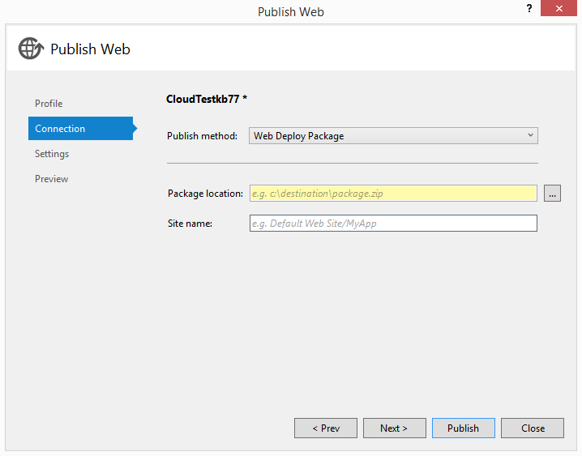

<properties
   pageTitle="Usando Scripts do Windows PowerShell para publicar em ambientes de teste e desenvolvimento | Microsoft Azure"
   description="Saiba como usar scripts do Windows PowerShell do Visual Studio para publicar em desenvolvimento e ambientes de teste."
   services="visual-studio-online"
   documentationCenter="na"
   authors="TomArcher"
   manager="douge"
   editor="" />
<tags
   ms.service="multiple"
   ms.devlang="dotnet"
   ms.topic="article"
   ms.tgt_pltfrm="na"
   ms.workload="multiple"
   ms.date="08/15/2016"
   ms.author="tarcher" />

# <a name="using-windows-powershell-scripts-to-publish-to-dev-and-test-environments"></a>Usando scripts do Windows PowerShell para publicar em desenvolvimento e ambientes de teste

Quando você cria um aplicativo da web no Visual Studio, você pode gerar um script do Windows PowerShell que você pode usar mais tarde para automatizar a publicação de seu site para o Azure como um aplicativo Web no serviço de aplicativo do Azure ou uma máquina virtual. Você pode editar e estender o script do Windows PowerShell no editor do Visual Studio para atender às suas necessidades ou integrar o script com compilação existente, teste e scripts de publicação.

Usando esses scripts, você pode provisionar versões personalizadas (também conhecido como ambientes de desenvolvimento e teste) do seu site para uso temporário. Por exemplo, você pode configurar uma versão específica do seu site em uma máquina virtual Azure ou em preparação slot em um site para executar um pacote de teste, reproduzir um erro, testar uma correção de bugs, avaliação uma alteração proposta ou configurar um ambiente personalizado para uma demonstração ou apresentação. Depois de criar um script que publica seu projeto, você pode recriar ambientes idênticos reexecutando o script conforme necessário, ou executar o script com sua própria compilação do seu aplicativo web para criar um ambiente personalizado para teste.

## <a name="what-you-need"></a>O que é necessário

- Azure SDK 2.3 ou posterior. Para obter mais informações, consulte [Visual Studio baixa](http://go.microsoft.com/fwlink/?LinkID=624384) .

Não é necessário o SDK do Azure para gerar os scripts para projetos da web. Esse recurso é para projetos da web, não as funções da web nos serviços de nuvem.

- PowerShell Azure 0.7.4 ou posterior. Veja [como instalar e configurar o Azure PowerShell](powershell-install-configure.md) para obter mais informações.

- [O Windows PowerShell 3.0](http://go.microsoft.com/?linkid=9811175) ou posterior.

## <a name="additional-tools"></a>Ferramentas adicionais

Ferramentas e recursos para trabalhar com o PowerShell no Visual Studio para desenvolvimento Azure adicionais estão disponíveis. Consulte [Ferramentas do PowerShell para Visual Studio](http://go.microsoft.com/fwlink/?LinkId=404012).

## <a name="generating-the-publish-scripts"></a>Gerar os scripts de publicação

Você pode gerar os scripts de publicar para uma máquina virtual que hospeda seu site quando você cria um novo projeto por a seguir [estas instruções](./virtual-machines/virtual-machines-windows-classic-web-app-visual-studio.md). Você também pode [Gerar publicar scripts web Apps no serviço de aplicativo do Azure](./app-service-web/web-sites-dotnet-get-started.md).

## <a name="scripts-that-visual-studio-generates"></a>Scripts que o Visual Studio gera

Visual Studio gera uma pasta de nível de solução chamada **PublishScripts** que contém dois arquivos do Windows PowerShell, um script de publicar para sua máquina virtual ou site e um módulo que contém funções que você pode usar nos scripts. Visual Studio também gera um arquivo no formato JSON que especifica os detalhes do projeto que você está implantando.

### <a name="windows-powershell-publish-script"></a>Windows PowerShell publicar script

O script de publicar contém etapas de publicar específicas para implantar em um site ou máquina virtual. Visual Studio fornece realce de desenvolvimento do Windows PowerShell sintaxe. Ajuda para as funções está disponível e você pode editar livremente as funções no script para atender às suas necessidades de alteração.

### <a name="windows-powershell-module"></a>Módulo do Windows PowerShell

O módulo do Windows PowerShell que Visual Studio gera contém funções que usa o script publicar. Estas são funções do PowerShell do Azure e não são destinadas a ser modificada. Veja [como instalar e configurar o Azure PowerShell](powershell-install-configure.md) para obter mais informações.

### <a name="json-configuration-file"></a>Arquivo de configuração de JSON

O arquivo JSON é criado na pasta **configurações** e contém dados de configuração que especifica exatamente quais recursos para implantar Azure. O nome do arquivo que o Visual Studio gera é project-nome-WAWS-dev.json se você tiver criado um site ou projeto nome-máquina virtual-dev.json se você criou uma máquina virtual. Aqui está um exemplo de um arquivo de configuração de JSON que é gerado quando você cria um site. A maioria dos valores são auto-explicativos. O nome do site é gerado pelo Azure, para que ele pode não coincidir com o nome do projeto.

```
{
"environmentSettings": {
"webSite": {
"name": "WebApplication26632",
"location": "West US"
},
"databases": [
{
"connectionStringName": "DefaultConnection",
"databaseName": "WebApplication26632_db",
"serverName": "YourDatabaseServerName",
"user": "sqluser2",
"password": "",
"edition": "",
"size": "",
"collation": "",
"location": "West US"
}
]
}
}
```
Quando você cria uma máquina virtual, o arquivo de configuração de JSON é semelhante ao seguinte. Observe que um serviço de nuvem é criado como um contêiner para a máquina virtual. A máquina virtual contém os pontos de extremidade usuais para web access via HTTP e HTTPS, bem como pontos de extremidade para implantar o Web, que permite que você publicar o site do seu computador local, área de trabalho remota e o Windows PowerShell.

```
{
"environmentSettings": {
"cloudService": {
"name": "myusernamevm1",
"affinityGroup": "",
"location": "West US",
"virtualNetwork": "",
"subnet": "",
"availabilitySet": "",
"virtualMachine": {
"name": "myusernamevm1",
"vhdImage": "a699494373c04fc0bc8f2bb1389d6106__Win2K8R2SP1-Datacenter-201403.01-en.us-127GB.vhd",
"size": "Small",
"user": "vmuser1",
"password": "",
"enableWebDeployExtension": true,
"endpoints": [
{
"name": "Http",
"protocol": "TCP",
"publicPort": "80",
"privatePort": "80"
},
{
"name": "Https",
"protocol": "TCP",
"publicPort": "443",
"privatePort": "443"
},
{
"name": "WebDeploy",
"protocol": "TCP",
"publicPort": "8172",
"privatePort": "8172"
},
{
"name": "Remote Desktop",
"protocol": "TCP",
"publicPort": "3389",
"privatePort": "3389"
},
{
"name": "Powershell",
"protocol": "TCP",
"publicPort": "5986",
"privatePort": "5986"
}
]
}
},
"databases": [
{
"connectionStringName": "",
"databaseName": "",
"serverName": "",
"user": "",
"password": ""
}
],
"webDeployParameters": {
"iisWebApplicationName": "Default Web Site"
}
}
}
```

Você pode editar a configuração de JSON para alterar o que acontece quando você executar os scripts de publicar. O `cloudService` e `virtualMachine` seções são necessárias, mas você pode excluir o `databases` seção se não precisá-lo. As propriedades que estão vazias no arquivo de configuração padrão que o Visual Studio gera são opcionais. aqueles que têm valores no arquivo de configuração padrão são necessários.

Se você tiver um site que tem vários ambientes de implantação (conhecidos como slots) em vez de um site de produção única no Azure, você pode incluir o nome do slot na caixa Nome do site no arquivo de configuração de JSON. Por exemplo, se você tiver um site que possui chamada **meusite** e um slot para chamado **Testar** , em seguida, o URI é test.cloudapp.net meusite, mas o nome correto para usar no arquivo de configuração é mysite(test). Você só pode fazer isso se o site e slots já existem na sua assinatura. Se elas não existirem, criar o site executando o script sem especificar slot, e em seguida, crie o slot no [portal clássico Azure](http://go.microsoft.com/fwlink/?LinkID=213885)e depois executar o script com o nome do site modificada. Para obter mais informações sobre slots de implantação para aplicativos web, consulte [configurar ambientes web Apps em um serviço de aplicativo do Azure temporários](./app-service-web/web-sites-staged-publishing.md).

## <a name="how-to-run-the-publish-scripts"></a>Como executar os scripts de publicação

Se você nunca tiver executado um script do Windows PowerShell antes, primeiro você deve definir a política de execução para habilitar a execução de scripts. Este é um recurso de segurança para impedir que os usuários de executarem scripts do Windows PowerShell se eles estiverem vulneráveis a malware ou vírus que envolvem a execução de scripts.

### <a name="run-the-script"></a>Execute o script

1. Crie o pacote de implantação da Web para o seu projeto. Um pacote de implantação da Web é um arquivo compactado (arquivo. zip) que contêm os arquivos que você deseja copiar para seu site ou máquina virtual. Você pode criar pacotes de implantação da Web no Visual Studio para qualquer aplicativo da web.



Para obter mais informações, consulte [como: criar um pacote de implantação da Web no Visual Studio](https://msdn.microsoft.com/library/dd465323.aspx). Você também pode automatizar a criação de seu pacote de implantação da Web, conforme descrito na seção **personalização e estendendo os scripts de publicar** neste tópico.

1. No **Solution Explorer**, abra o menu de contexto para o script e escolha **Abrir com o PowerShell ISE**.

1. Se esta for a primeira vez que você já tiver executado scripts do Windows PowerShell neste computador, abra uma janela do prompt de comando com privilégios de administrador e digite o seguinte comando:

`Set-ExecutionPolicy RemoteSigned`

1. Entrar no Azure usando o comando a seguir.

`Add-AzureAccount`

Quando solicitado, forneça seu nome de usuário e senha.

Observe que, ao automatizar o script, esse método de fornecer credenciais Azure não funcionará. Em vez disso, você deve usar o arquivo. publishsettings para fornecer credenciais. Uma vez só, você use o comando **Get-AzurePublishSettingsFile** para baixar o arquivo do Azure e depois use **AzurePublishSettingsFile de importação** para importar o arquivo. Para obter instruções detalhadas, veja [como instalar e configurar o Azure PowerShell](powershell-install-configure.md).

1. (Opcional) Se você quiser criar Azure recursos como a máquina virtual, o banco de dados e o site sem publicar seu aplicativo da web, use o comando **Publicar WebApplication.ps1** com o **-configuração** argumento definido para o arquivo de configuração de JSON. Essa linha de comando usa o arquivo de configuração de JSON para determinar quais recursos criar. Como ele usa as configurações padrão para outros argumentos de linha de comando, ele cria os recursos, mas não publica seu aplicativo web. – Detalhado opção fornece mais informações sobre o que está acontecendo.

`Publish-WebApplication.ps1 -Verbose –Configuration C:\Path\WebProject-WAWS-dev.json`

1. Use o comando **Publicar WebApplication.ps1** conforme mostrado em um dos exemplos a seguir para chamar o script e publicar seu aplicativo web. Se você precisar substituir as configurações padrão para qualquer um dos outros argumentos, como o nome da assinatura, publicar o nome do pacote, credenciais de máquina virtual ou credenciais de servidor de banco de dados, você pode especificar esses parâmetros. Use o **– detalhado** opção para ver mais informações sobre o andamento do processo de publicação.

```
Publish-WebApplication.ps1 –Configuration C:\Path\WebProject-WAWS-dev-json `
–SubscriptionName Contoso `
-WebDeployPackage C:\Documents\Azure\ADWebApp.zip `
-DatabaseServerPassword @{Name="dbServerName";Password="adminPassword"} `
-Verbose
```

Se você estiver criando uma máquina virtual, o comando a seguinte aparência. Este exemplo também mostra como especificar as credenciais para vários bancos de dados. Para as máquinas virtuais que criar esses scripts, o certificado SSL não é de uma autoridade raiz confiável. Portanto, você precisa usar a opção **– AllowUntrusted** .

```
Publish-WebApplication.ps1 `
-Configuration C:\Path\ADVM-VM-test.json `
-SubscriptionName Contoso `
-WebDeployPackage C:\Path\ADVM.zip `
-AllowUntrusted `
-VMPassword @{name = "vmUserName"; password = "YourPasswordHere"} `
-DatabaseServerPassword @{Name="server1";Password="adminPassword1"}, @{Name="server2";Password="adminPassword2"} `
-Verbose
```

O script pode criar bancos de dados, mas ele não criar servidores de banco de dados. Se você quiser criar um servidor de banco de dados, você pode usar a função **New-AzureSqlDatabaseServer** no módulo Azure.

## <a name="customizing-and-extending-the-publish-scripts"></a>Personalizar e estender os scripts de publicação

Você pode personalizar o script de publicar e o arquivo de configuração de JSON. As funções no módulo Windows PowerShell **AzureWebAppPublishModule.psm1** não devem ser modificadas. Se você quiser apenas especificar um banco de dados diferente ou alterar algumas das propriedades da máquina virtual, edite o arquivo de configuração de JSON. Se você quiser estender a funcionalidade do script para automatizar a criação e teste o seu projeto, você pode implementar stubs de função em **Publicar-WebApplication.ps1**.

Para automatizar a criação de seu projeto, adicione o código que chama MSBuild para `New-WebDeployPackage` conforme mostrado neste exemplo de código. O caminho para o comando MSBuild é diferente dependendo da versão do Visual Studio que você instalou. Para obter o caminho correto, você pode usar a função **Get-MSBuildCmd**, conforme mostrado neste exemplo.

### <a name="to-automate-building-your-project"></a>Para automatizar a criação de seu projeto

1. Adicionar o `$ProjectFile` parâmetro na seção parâmetro global.

```
[Parameter(Mandatory = $false)]
  [ValidateScript({Test-Path $_ -PathType Leaf})]
  [String]
  $ProjectFile,
```

1. Copie a função `Get-MSBuildCmd` em seu arquivo de script.

```
function Get-MSBuildCmd
{
        process
{

             $path =  Get-ChildItem "HKLM:\SOFTWARE\Microsoft\MSBuild\ToolsVersions\" |
                                   Sort-Object {[double]$_.PSChildName} -Descending |
                                   Select-Object -First 1 |
                                   Get-ItemProperty -Name MSBuildToolsPath |
                                   Select -ExpandProperty MSBuildToolsPath
       
            $path = (Join-Path -Path $path -ChildPath 'msbuild.exe')

        return Get-Item $path
    }
}
```

1. Substituir `New-WebDeployPackage` com o seguinte código e substitua os espaços reservados a linha construindo `$msbuildCmd`. Este código é para Visual Studio 2015. Se você estiver usando o Visual Studio 2013, altere a propriedade de **VisualStudioVersion** abaixo para `12.0`.

```
function New-WebDeployPackage
{
    #Write a function to build and package your web application
      
#To build your web application, use MsBuild.exe. For help, see MSBuild Command-Line Reference at: http://go.microsoft.com/fwlink/?LinkId=391339
      
Write-VerboseWithTime 'Build-WebDeployPackage: Start'
      
$msbuildCmd = '"{0}" "{1}" /T:Rebuild;Package /P:VisualStudioVersion=14.0 /p:OutputPath="{2}\MSBuildOutputPath" /flp:logfile=msbuild.log,v=d' -f (Get-MSBuildCmd), $ProjectFile, $scriptDirectory
      
Write-VerboseWithTime ('Build-WebDeployPackage: ' + $msbuildCmd)
      
#Start execution of the build command
$job = Start-Process cmd.exe -ArgumentList('/C "' + $msbuildCmd + '"') -WindowStyle Normal -Wait -PassThru
      
if ($job.ExitCode -ne 0)
{
throw('MsBuild exited with an error. ExitCode:' + $job.ExitCode)
}

#Obtain the project name
$projectName = (Get-Item $ProjectFile).BaseName
      
#Construct the path to web deploy zip package
$DeployPackageDir =  '.\MSBuildOutputPath\_PublishedWebsites\{0}_Package\{0}.zip' -f $projectName
      
      
#Get the full path for the web deploy zip package. This is required for MSDeploy to work
$WebDeployPackage = Resolve-Path –LiteralPath $DeployPackageDir
      
Write-VerboseWithTime 'Build-WebDeployPackage: End'
      
return $WebDeployPackage
}
```

1. Chamar o `New-WebDeployPackage` função antes dessa linha: `$Config = Read-ConfigFile $Configuration` web Apps ou `$Config = Read-ConfigFile $Configuration -HasWebDeployPackage:([Bool]$WebDeployPackage)` para máquinas virtuais.

```
if($ProjectFile)
{
$WebDeployPackage = New-WebDeployPackage
}
```

1. Chamar o script personalizado da linha de comando usando passando o `$Project` argumento, como a linha de comando de exemplo a seguir.

```
.\Publish-WebApplicationVM.ps1 -Configuration .\Configurations\WebApplication5-VM-dev.json `
-ProjectFile ..\WebApplication5\WebApplication5.csproj `
-VMPassword @{Name="VMUser";Password="Test.123"} `
-AllowUntrusted `
-Verbose
```

Para automatizar teste de seu aplicativo, adicione o código para `Test-WebApplication`. Certifique-se de não comentar as linhas em **Publicar WebApplication.ps1** onde essas funções são chamadas. Se você não fornecer uma implementação, você pode criar manualmente o seu projeto com o Visual Studio e execute o script de publicar para publicar Azure.

## <a name="publishing-function-summary"></a>Publicação função de resumo

Para obter ajuda de funções você pode usar o prompt de comando do Windows PowerShell, use o comando `Get-Help function-name`. A Ajuda inclui exemplos e ajuda de parâmetro. Também é o mesmo texto de ajuda nos arquivos de origem de script, **AzureWebAppPublishModule.psm1** e **WebApplication.ps1 publicar**. O script e ajuda está localizadas no seu idioma do Visual Studio.

**AzureWebAppPublishModule**

|Nome de função|Descrição|
|---|---|
|AzureSQLDatabase adicionar|Cria um novo banco de dados do SQL Azure.|
|AzureSQLDatabases adicionar|Cria bancos de dados do SQL Azure dos valores no arquivo de configuração de JSON que o Visual Studio gera.|
|AzureVM adicionar|Cria uma máquina virtual Azure e retorna o URL da máquina virtual implantado. A função configura os pré-requisitos e, em seguida, chama a função de **New-AzureVM** (módulo Azure) para criar uma nova máquina virtual.|
|AzureVMEndpoints adicionar|Adiciona novos pontos de extremidade de entrada a uma máquina virtual e retorna a máquina virtual com o novo ponto de extremidade.|
|AzureVMStorage adicionar|Cria uma nova conta de armazenamento do Azure na assinatura atual. O nome da conta começa com "devtest" seguido por uma cadeia de caracteres alfanumérica exclusiva. A função retorna o nome da nova conta de armazenamento. Especifique um local ou um grupo de afinidade para a nova conta de armazenamento.|
|AzureWebsite adicionar|Cria um site com o nome e local especificados. Esta função chama a função **New-AzureWebsite** no módulo Azure. Se a assinatura já não inclui um site com o nome especificado, esta função cria o site e retorna um objeto de site. Caso contrário, retorna `$null`.|
|Assinatura do backup|Salva a assinatura atual Azure no `$Script:originalSubscription` variável no escopo de script. Esta função salva a assinatura do Azure atual (como obtidas por `Get-AzureSubscription -Current`) e sua conta de armazenamento e a assinatura que é alterada por este script (armazenado na variável `$UserSpecifiedSubscription`) e sua conta de armazenamento, no escopo de script. Salvando os valores, você pode usar uma função, como `Restore-Subscription`, para restaurar a conta de armazenamento e assinatura atual original para o status atual se o status atual foi alterado.|
|Localizar AzureVM|Obtém a máquina virtual Azure especificada.|
|Formato DevTestMessageWithTime|Precede a data e hora a uma mensagem. Esta função destina-se a mensagens gravadas os fluxos de erro e detalhado.|
|Get-AzureSQLDatabaseConnectionString|Reúne uma cadeia de conexão para se conectar a um banco de dados do SQL Azure.|
|Get-AzureVMStorage|Retorna o nome da conta de armazenamento primeiro com o padrão de nome "devtest*" (não diferencia maiusculas de minúsculas) no local especificado ou grupo de afinidade. Se o "devtest*" conta de armazenamento não corresponde ao local ou grupo de afinidade, a função ignora-lo. Especifique um local ou um grupo de afinidade.|
|Get-MSDeployCmd|Retorna um comando para executar a ferramenta de MsDeploy.exe.|
|Novo AzureVMEnvironment|Localiza ou cria uma máquina virtual na assinatura que coincida com os valores no arquivo de configuração de JSON.|
|WebPackage publicar|Usos MsDeploy.exe e uma web publicar o pacote. Arquivo zip para implantar recursos para um site. Esta função não gerou saída. Se a chamada para MSDeploy.exe falhar, a função gera uma exceção. Para obter uma saída mais detalhada, use o **-detalhado** opção.|
|WebPackageToVM publicar|Verifica os valores de parâmetro e, em seguida, chama a função de **Publicar WebPackage** .|
|ConfigFile de leitura|Valida o arquivo de configuração de JSON e retorna uma tabela de hash de valores selecionados.|
|Assinatura de restauração|Redefine a assinatura atual para a assinatura original.|
|Teste-AzureModule|Retorna `$true` se a versão de módulo Azure instalado for 0.7.4 ou posterior. Retorna `$false` se o módulo não estiver instalado ou uma versão anterior. Esta função não tem parâmetros.|
|Teste-AzureModuleVersion|Retorna `$true` se a versão do módulo Azure for 0.7.4 ou posterior. Retorna `$false` se o módulo não estiver instalado ou uma versão anterior. Esta função não tem parâmetros.|
|Teste-HttpsUrl|Converte a URL de entrada em um objeto URI. Retorna `$True` se a URL é absoluta e seu esquema é https. Retorna `$false` se a URL for relativa, seu esquema não HTTPS ou a cadeia de caracteres de entrada não pode ser convertida para uma URL.|
|Membro de teste|Retorna `$true` se uma propriedade ou método é um membro do objeto. Caso contrário, retorna `$false`.|
|ErrorWithTime de gravação|Grava uma mensagem de erro prefixada com a hora atual. Esta função chama a função de **Formato-DevTestMessageWithTime** substituam o tempo antes de gravar a mensagem o fluxo de erro.|
|HostWithTime de gravação|Grava uma mensagem para o programa de host (**Write-Host**) precedido com a hora atual. O efeito de gravar para o programa do host varia. A maioria dos programas que hospedam o Windows PowerShell gravar essas mensagens de saída padrão.|
|VerboseWithTime de gravação|Grava uma mensagem detalhada prefixada com a hora atual. Porque chama **Detalhado de gravação**, a mensagem é exibida somente quando o script é executado com o parâmetro **detalhado** ou quando a preferência **VerbosePreference** é definida para **continuar**.|

**Publicar aplicativo Web**

|Nome de função|Descrição|
|---|---|
|Novo AzureWebApplicationEnvironment|Cria Azure recursos, como um site ou máquina virtual.|
|Novo WebDeployPackage|Esta função não está implementada. Você pode adicionar comandos nessa função para construir o projeto.|
|AzureWebApplication publicar|Publica um aplicativo web para Azure.|
|Publicar aplicativo Web|Cria e implanta aplicativos Web, máquinas virtuais, bancos de dados SQL e contas de armazenamento de um projeto do Visual Studio web.|
|Teste-aplicativo Web|Esta função não está implementada. Você pode adicionar comandos nessa função para testar seu aplicativo.|

## <a name="next-steps"></a>Próximas etapas

Saiba mais sobre os scripts do PowerShell lendo [script com o Windows PowerShell](https://technet.microsoft.com/library/bb978526.aspx) e ver outros scripts do PowerShell do Azure no [Script Center](https://azure.microsoft.com/documentation/scripts/).
