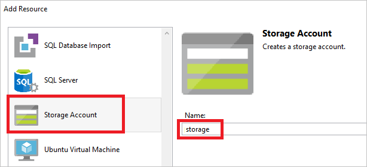
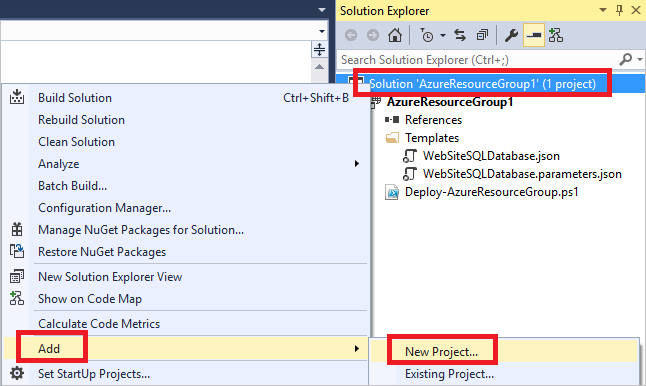

<properties
   pageTitle="Projetos de recurso grupo Visual Studio Azure | Microsoft Azure"
   description="Use o Visual Studio para criar um projeto de grupo de recursos Azure e implantar os recursos para o Azure."
   services="azure-resource-manager"
   documentationCenter="na"
   authors="tfitzmac"
   manager="timlt"
   editor="tysonn" />
<tags
   ms.service="azure-resource-manager"
   ms.devlang="multiple"
   ms.topic="get-started-article"
   ms.tgt_pltfrm="na"
   ms.workload="na"
   ms.date="09/20/2016"
   ms.author="tomfitz" />

# Criar e implantar grupos de recursos Azure por meio do Visual Studio

Com o Visual Studio e o [SDK do Azure](https://azure.microsoft.com/downloads/), você pode criar um projeto que implanta sua infraestrutura e o código do Azure. Por exemplo, você pode definir o host da web, site da web e banco de dados para o aplicativo e implantar esse infraestrutura juntamente com o código. Ou, você pode definir uma máquina Virtual, a rede Virtual e a conta de armazenamento e implantar esse infraestrutura juntamente com um script que é executado na máquina Virtual. O projeto de implantação do **Grupo de recursos do Azure** permite implantar todos os recursos necessários em uma operação única e repetitivo. Para obter mais informações sobre como implantar e gerenciar seus recursos, consulte [Visão geral do Gerenciador de recursos do Azure](azure-resource-manager/resource-group-overview.md).

Grupo de recursos do Azure projetos contêm modelos do Azure Gerenciador de recursos JSON, que definem os recursos que você implanta Azure. Para saber mais sobre os elementos do modelo de Gerenciador de recursos, consulte [modelos de coautoria Gerenciador de recursos do Azure](resource-group-authoring-templates.md). O Visual Studio permite editar esses modelos e fornece ferramentas que simplificam trabalhar com modelos.

Neste tópico, você pode implantar um aplicativo web e o banco de dados SQL. No entanto, as etapas são quase o mesmo para qualquer tipo de recurso. Você pode como implantar facilmente uma máquina Virtual e seus recursos relacionados. Visual Studio fornece muitos modelos de starter diferentes para implantar cenários comuns.

Este artigo mostra Visual Studio 2015 atualização 2 e Microsoft Azure SDK do .NET 2,9. Se você usa o Visual Studio 2013 com o Azure SDK 2,9, sua experiência é basicamente o mesmo. Você pode usar versões do Azure SDK do 2.6 ou posterior; No entanto, sua experiência da interface do usuário pode ser diferente da interface do usuário mostrado neste artigo. É altamente recomendável que você instale a versão mais recente do [Azure SDK](https://azure.microsoft.com/downloads/) antes de iniciar as etapas. 

## Projeto de criar grupo de recursos do Azure

Neste procedimento, você pode criar um projeto de grupo de recursos do Azure com um modelo de **aplicativo Web + SQL** .

1. No Visual Studio, escolha **arquivo**, **Novo projeto** **c#** ou **Visual Basic**. Em seguida, escolha **nuvem**e, em seguida, escolha o projeto de **Grupo de recursos do Azure** .

    

1. Escolha o modelo que você deseja implantar ao Gerenciador de recursos do Azure. Observe que há são várias opções diferentes com base no tipo de projeto que você deseja implantar. Para este tópico, escolha o modelo de **aplicativo Web + SQL** .

    

    O modelo que você escolher é apenas um ponto de partida; Você pode adicionar e remover recursos para atender seu cenário.

    >[AZURE.NOTE] Visual Studio recupera uma lista de modelos disponíveis online. Na lista pode mudar.

    Visual Studio cria um projeto de implantação do grupo de recursos para o aplicativo da web e o banco de dados SQL.

1. Para ver o que você criou, expanda os nós no projeto de implantação.

    

    Como escolhemos a Web app + modelo de SQL para este exemplo, você pode ver os arquivos a seguir: 

  	|Nome do arquivo|Descrição|
  	|---|---|
  	|AzureResourceGroup.ps1 implantar|Um script PowerShell que invoca comandos do PowerShell para implantar ao Gerenciador de recursos do Azure. **Observação** Visual Studio usa esse script do PowerShell para implantar o seu modelo. Qualquer alteração feita para esse script afetam implantação no Visual Studio, então cuidado.|
  	|WebSiteSQLDatabase.json|O modelo do Gerenciador de recursos que define a infraestrutura que você deseja implantar o Azure e os parâmetros que você pode fornecer durante a implantação. Ele também define as dependências entre os recursos para que o Gerenciador de recursos implanta os recursos na ordem correta.|
  	|WebSiteSQLDatabase.parameters.json|Um arquivo de parâmetros que contém valores necessários para o modelo. Você passar valores de parâmetro para personalizar cada implantação.|

    Todos os projetos de implantação de grupo de recursos contêm esses arquivos básicos. Outros projetos podem conter arquivos adicionais para oferecer suporte a outros tipos de funcionalidade.

## Personalizar o modelo do Gerenciador de recursos

Você pode personalizar um projeto de implantação modificando os modelos JSON que descrevem os recursos que você deseja implantar. JSON significa JavaScript Object Notation e é um formato de dados serializados que seja fácil de trabalhar com. Os arquivos JSON usam um esquema que você fazer referência na parte superior de cada arquivo. Se você quiser entender o esquema, você pode baixar e analisá-lo. O esquema define quais elementos são válidos, os tipos e formatos de campos, os valores possíveis de valores enumerados e assim por diante. Para saber mais sobre os elementos do modelo de Gerenciador de recursos, consulte [modelos de coautoria Gerenciador de recursos do Azure](resource-group-authoring-templates.md).

Para trabalhar no seu modelo, abra **WebSiteSQLDatabase.json**.

Editor do Visual Studio fornece ferramentas para ajudá-lo com o modelo do Gerenciador de recursos de edição. A janela de **Estrutura de tópicos de JSON** torna mais fácil ver os elementos definidos no seu modelo.

A seleção de qualquer um dos elementos na estrutura de tópicos leva para essa parte do modelo e realça o JSON correspondente.

Você pode adicionar um recurso selecionando o botão **Add Resource** na parte superior da janela de estrutura de tópicos de JSON ou clicando **recursos** e selecionando **Adicionar novo recurso**.

Para este tutorial, selecione a **Conta de armazenamento** e dê um nome. Forneça um nome que seja não mais do que 11 caracteres e contém apenas números e letras minúsculas.

Observe que foi não apenas o recurso que adicionou, mas também um parâmetro para a conta de armazenamento do tipo e uma variável para o nome da conta de armazenamento.

O parâmetro **storageType** é predefinido com tipos permitidos e um tipo de padrão. Você pode deixar esses valores ou editá-los para seu cenário. Se não desejar que todos os usuários a implantar uma conta de armazenamento **Premium_LRS** com este modelo, remova-os tipos permitidos. 

    "storageType": {
      "type": "string",
      "defaultValue": "Standard_LRS",
      "allowedValues": [
        "Standard_LRS",
        "Standard_ZRS",
        "Standard_GRS",
        "Standard_RAGRS"
      ]
    }

Visual Studio também fornece o intellisense para ajudá-lo a entender quais propriedades estão disponíveis ao editar o modelo. Por exemplo, para editar as propriedades de seu plano de serviço de aplicativo, navegue até o recurso de **HostingPlan** e adicione um valor para as **Propriedades**. Observe que o intellisense mostra os valores disponíveis e fornece uma descrição desse valor.

Você pode definir **numberOfWorkers** como 1.

    "properties": {
      "name": "[parameters('hostingPlanName')]",
      "numberOfWorkers": 1
    }

## Implantar o projeto de grupo de recursos do Azure

Agora você está pronto para implantar o seu projeto. Quando você implanta um projeto de grupo de recursos do Azure, implantá-lo a um grupo de recursos Azure. O grupo de recursos é um agrupamento lógico de recursos que compartilham um ciclo de vida comuns.

1. No menu de atalho do nó de projeto de implantação, escolha **implantar** > **Nova implantação**.

    

    A caixa de diálogo **implantar ao grupo de recursos** é exibida.

    

1. Na caixa suspensa **grupo de recursos** , escolha um grupo de recursos existente ou crie um novo. Para criar um grupo de recursos, abra a caixa de menu suspenso do **Grupo de recursos** e escolha **Criar novo**.

    

    Caixa de diálogo **Criar grupo de recursos** é exibida. Dar a seu grupo um nome e local e selecione o botão **criar** .

    
   
1. Edite os parâmetros para a implantação selecionando o botão **Editar parâmetros** .

    

1. Forneça os valores para os parâmetros vazios e selecione o botão **Salvar** . Os parâmetros vazios são **hostingPlanName**, **administratorLogin**, **administratorLoginPassword**e **databaseName**.

    **hostingPlanName** Especifica um nome para o [plano de serviço de aplicativo](./app-service/azure-web-sites-web-hosting-plans-in-depth-overview.md) criar. 
    
    **administratorLogin** Especifica o nome de usuário para o administrador do SQL Server. Não use nomes de administrador comuns como **sa** ou **administrador**. 
    
    O **administratorLoginPassword** Especifica uma senha de administrador do SQL Server. A opção **Salvar senhas como texto sem formatação no arquivo de parâmetros** não está segura; Portanto, não selecione essa opção. Desde que a senha não for salvo como texto sem formatação, você precisará fornecer essa senha novamente durante a implantação. 
    
    **databaseName** Especifica um nome para o banco de dados criar. 

    
    
1. Escolha o botão de **implantar** para implantar o projeto do Azure. Abre um console do PowerShell fora da instância do Visual Studio. Insira a senha de administrador do SQL Server no console do PowerShell quando solicitado. **Console do PowerShell pode ser oculto por trás de outros itens ou minimizado na barra de tarefas.** Procure por esse console e selecioná-la para fornecer a senha.

    >[AZURE.NOTE] O Visual Studio pode solicitar que você instale os cmdlets do PowerShell do Azure. Você precisa de cmdlets do PowerShell do Azure para implantar em grupos de recursos. Se solicitado, instale-os.
    
1. A implantação pode levar alguns minutos. Na janela de **saída** , você ver o status da implantação. Quando a implantação tiver terminado, a última mensagem indica uma implantação bem-sucedida com algo semelhante a:

        ... 
        18:00:58 - Successfully deployed template 'c:\users\user\documents\visual studio 2015\projects\azureresourcegroup1\azureresourcegroup1\templates\websitesqldatabase.json' to resource group 'DemoSiteGroup'.

1. Em um navegador, abra o [portal do Azure](https://portal.azure.com/) e entrar em sua conta. Para ver o grupo de recursos, selecione **grupos de recursos** e o grupo de recursos para que você distribuiu.

    

1. Você ver todos os recursos implantados. Observe que o nome da conta de armazenamento não é exatamente o que você especificou ao adicionar esse recurso. A conta de armazenamento deve ser exclusiva. O modelo adiciona automaticamente uma cadeia de caracteres para o nome que você forneceu para fornecer um nome exclusivo. 

    

1. Se você fizer alterações e deseja reimplantar seu projeto, escolha o grupo de recursos existentes no menu de atalho de projeto de grupo de recursos Azure. No menu de atalho, escolha **implantar**e, em seguida, escolha o grupo de recursos que você implantado.

    

## Implantar código com sua infraestrutura

Neste ponto, você implantou a infraestrutura para o aplicativo, mas há nenhum código real implantado com o projeto. Este tópico mostra como implantar um aplicativo web e tabelas de banco de dados SQL durante a implantação. Se você estiver implantando uma máquina Virtual em vez de um aplicativo web, você deseja executar alguns códigos no computador como parte da implantação. O processo de implantação de código para um aplicativo web ou para configurar uma máquina Virtual é quase o mesmo.

1. Adicione um projeto à sua solução do Visual Studio. A solução de atalho e, em seguida, selecione **Adicionar** > **Novo projeto**.

    

1. Adicione um **aplicativo Web do ASP.NET**. 

    
    
1. Selecione **MVC** e desmarque o campo do **Host na nuvem** , como o projeto de grupo de recursos realiza essa tarefa.

    
    
1. Depois que o Visual Studio cria seu aplicativo web, você verá os dois projetos na solução.

    

1. Agora, você precisa certificar-se de que seu projeto de grupo de recursos está ciente do novo projeto. Volte ao seu projeto de grupo de recursos (AzureResourceGroup1). **Referências** de atalho e selecione **Adicionar referência**.

    

1. Selecione o projeto de aplicativo web que você criou.

    
    
    Adicionando uma referência, você vincular o projeto de aplicativo da web para o projeto de grupo de recursos e configurar automaticamente três propriedades importantes. Você vê essas propriedades na janela **Propriedades** para a referência.

      
    
    As propriedades são:

    - As **Propriedades adicionais** contém o pacote de implantação do web teste local que é enviado para o armazenamento do Azure. Observe a pasta (ExampleApp) e o arquivo (package.zip). Você irá fornecer esses valores como parâmetros ao implantar o aplicativo. 
    - **Inclua o caminho do arquivo** contém o caminho onde o pacote é criado. Os **Destinos de incluir** contém o comando que executa de implantação. 
    - O valor padrão de **compila; Pacote** permite a implantação construir e criar um pacote de implantação da web (package.zip).  
    
    Não é necessário um perfil de publicação como a implantação obtém as informações necessárias das propriedades para criar o pacote.
      
1. Adicione um recurso para o modelo.

    

1. Desta vez selecione **Web implantar Web Apps**. 

    
    
1. Reimplante seu projeto de grupo de recursos para o grupo de recursos. Desta vez há alguns parâmetros novos. Você não precisa fornecer valores para **_artifactsLocation** ou **_artifactsLocationSasToken** porque o Visual Studio gera automaticamente esses valores. No entanto, você deve configurar a pasta e o nome de arquivo com o caminho que contém o pacote de implantação (mostrado como **ExampleAppPackageFolder** e **ExampleAppPackageFileName** na imagem a seguir). Forneça os valores que você viu anteriormente nas propriedades de referência (**ExampleApp** e **package.zip**).

    
    
    Para a **conta de armazenamento de artefato**, selecione aquele implantado com este grupo de recursos.
    
1. Após a implantação, selecione o aplicativo web no portal. Selecione a URL para navegar até o site.

    

1. Observe que você implantou o aplicativo ASP.NET padrão com êxito.

    

## Próximas etapas

- Para saber sobre como gerenciar seus recursos por meio do portal, consulte [usando o portal do Azure para gerenciar seus recursos Azure](./azure-portal/resource-group-portal.md).
- Para saber mais sobre modelos, consulte [modelos de coautoria Gerenciador de recursos do Azure](resource-group-authoring-templates.md).
