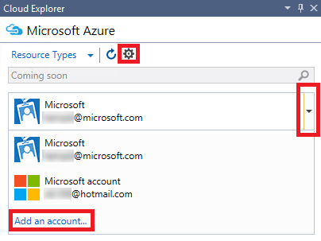

<properties 
   pageTitle="Gerenciar recursos Azure com o Explorador de nuvem | Microsoft Azure"
   description="Aprenda a usar o Explorador de nuvem para navegar e gerenciar recursos Azure dentro do Visual Studio."
   services="visual-studio-online"
   documentationCenter="na"
   authors="TomArcher"
   manager="douge"
   editor="" />
<tags 
   ms.service="multiple"
   ms.devlang="dotnet"
   ms.topic="article"
   ms.tgt_pltfrm="na"
   ms.workload="multiple"
   ms.date="08/15/2016"
   ms.author="tarcher" />

# Gerenciar recursos Azure com o Explorador de nuvem

##Visão geral

Explorador de nuvem foi projetado para permitir que você navegue e gerenciar seus recursos Azure no Visual Studio IDE mais fácil e rapidamente. Você pode, por exemplo, usá-lo para abrir um aplicativo Web no [portal do Azure](http://go.microsoft.com/fwlink/p/?LinkID=525040) ou em um navegador ou anexar um depurador a ele, ou você pode exibir as propriedades de um contêiner de blob e abri-lo no Editor de contêiner de Blob.

Explorador de nuvem baseia-se na pilha de Gerenciador de recurso Azure, assim como o [portal do Azure](http://go.microsoft.com/fwlink/p/?LinkID=525040). Ele entende Azure serviços como aplicativos de lógica e aplicativos de API e recursos como grupos de recursos do Azure e suporta o [controle de acesso baseado em função](./active-directory/role-based-access-control-configure.md) (RBAC). Para ver o Azure recursos que foram adicionados ou alterados, escolha botão **Atualizar** na barra de ferramentas Explorer de nuvem.

Explorador de nuvem é instalado como parte do Visual Studio Tools para Azure SDK 2.7. 

## Pré-requisitos

- Visual RTM Studio de 2015.

- Ferramentas do Visual Studio para o SDK do Azure. 
- Você também deve ter uma conta do Azure e estar conectado a ela para exibir recursos Azure no Explorador de nuvem. Se você não tiver um, você pode criar uma conta em apenas alguns minutos. Se você tiver uma assinatura do MSDN, consulte [Benefício do Azure para os assinantes do MSDN](https://azure.microsoft.com/pricing/member-offers/msdn-benefits-details/). Caso contrário, consulte [criar uma conta de avaliação gratuita](https://azure.microsoft.com/pricing/free-trial/).

- Se nuvem Explorer não estiver visível, você pode exibi-lo escolhendo o **modo de exibição**, **Outras janelas** **Nuvem Explorer** na barra de menus.

## Gerenciar assinaturas e contas do Azure

Para ver seus recursos Azure no Explorador de nuvem, você precisa fazer logon uma conta do Microsoft Azure com um ou mais assinaturas ativas. Se você tiver mais de uma conta do Microsoft Azure, você pode adicioná-los no Explorador de nuvem e escolha as assinaturas que você deseja incluir no modo de exibição de recurso Explorer de nuvem.

Se você não usou o Azure antes ou se você ainda não tiver adicionado as contas necessárias para Visual Studio, você será solicitado a fazer isso.

## Para adicionar contas do Azure para o Explorador de nuvem

1. Escolha o ícone de configurações na barra de ferramentas Explorer de nuvem.

1. Escolha o link **Adicionar uma conta** . Faça logon na conta do Azure cujos recursos que você deseja procurar. A conta que você acabou de adicionar deve estar selecionada na lista de menu suspenso de seletor de conta. As assinaturas para essa conta aparecem sob a entrada de conta.

    

    

1. Marque as caixas de seleção para as assinaturas de conta que você deseja procurar e, em seguida, escolha o botão **Aplicar** .

    Os recursos Azure para as assinaturas selecionadas aparecem no Gerenciador de nuvem.

## Para remover uma conta do Azure

1. Escolha **arquivo**, **Configurações de conta** na barra de menus.

1. Na seção de **Todas as contas** da caixa de diálogo **Configurações de conta** , escolha o comando **Remover** perto da conta que você deseja remover. Observe que este comando apenas remove a conta do Visual Studio — é não afeta a própria conta Azure.

## Tipos de recursos do modo de exibição ou grupos

Para exibir seus recursos Azure, você pode escolher os **Tipos de recursos** ou modo de exibição de **Grupos de recursos** .

- Modo de exibição de **Tipos de recursos** , que também é o modo de exibição comuns usado no [portal do Azure](http://go.microsoft.com/fwlink/p/?LinkID=525040), mostra os recursos Azure categorizados por seu tipo, como aplicativos web, contas de armazenamento e máquinas virtuais. Isso é semelhante aos recursos como Azure aparecem no Server Explorer.

- Modo de exibição de grupos de recursos categoriza Azure recursos pelo grupo de recursos Azure que quais eles estão associados.

 
    Um grupo de recursos é um pacote de recursos Azure, normalmente usado por um aplicativo específico. Para saber mais sobre grupos de recursos Azure, consulte [Visão geral do Gerenciador de recursos do Azure](./resource-group-overview.md).

## Exibir e navegar entre recursos

Para navegar para um recurso Azure e exibir suas informações no Explorador de nuvem, expanda o tipo do item ou o grupo de recursos associado e escolha o recurso. Quando você escolhe um recurso, informações aparecem nas duas guias na parte inferior do Explorador de nuvem.

- Na guia **ações** mostra as ações que você pode realizar no Explorador de nuvem para o recurso selecionado. Você também pode ver ações disponíveis no menu de atalho do recurso.

- Na guia **Propriedades** mostra as propriedades do recurso, como o seu grupo tipo, localidade e recurso, que ele está associado.

Cada recurso tem a ação **aberto no portal**. Quando você escolhe essa ação, o Explorer de nuvem exibe o recurso selecionado no [portal do Azure](http://go.microsoft.com/fwlink/p/?LinkID=525040). Esse recurso é especialmente útil para navegar para recursos aninhadas.

Ações adicionais e valores de propriedade também podem aparecer com base no Azure recurso. Por exemplo, aplicativos web e aplicativos de lógica também têm as ações **aberto no navegador** e **Anexar depurador** além **aberto no portal**. Ações para abrir editores aparecem quando você escolhe um blob de conta de armazenamento, fila ou tabela. Aplicativos do Azure têm propriedades de **URL** e **Status** , enquanto os recursos de armazenamento têm propriedades de cadeia de conexão e chave.

## Recursos de pesquisa

Para localizar recursos com um nome específico em suas assinaturas de conta do Azure, digite o nome na caixa de pesquisa no Explorador de nuvem.

Quando você insere caracteres na caixa de pesquisa, somente os recursos que correspondam a esses caracteres aparecem na árvore de recursos.

