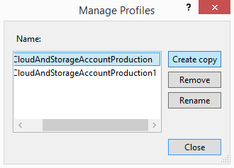

<properties
   pageTitle="Como gerenciar perfis e configurações de serviço | Microsoft Azure"
   description="Aprenda a trabalhar com arquivos de configuração de perfis e configurações de serviço | que armazenam configurações para os ambientes de implantação e configurações de publicação para serviços de nuvem."
   services="visual-studio-online"
   documentationCenter="na"
   authors="TomArcher"
   manager="douge"
   editor="" />
<tags
   ms.service="multiple"
   ms.devlang="dotnet"
   ms.topic="article"
   ms.tgt_pltfrm="na"
   ms.workload="multiple"
   ms.date="08/15/2016"
   ms.author="tarcher" />

# Como gerenciar perfis e configurações de serviço

## Visão geral

Quando você publica um serviço na nuvem, o Visual Studio armazena informações de configuração em dois tipos de arquivos de configuração: configurações e perfis de serviço. Configurações de serviço (.cscfg arquivos) armazenam configurações para os ambientes de implantação de um serviço de nuvem Azure. Azure usa esses arquivos de configuração quando ele gerencia seus serviços de nuvem. Por outro lado, o repositório de perfis (.azurePubxml arquivos) publicar configurações de serviços de nuvem. Essas configurações são um registro das quais você escolha quando você usa o Assistente de publicação e é usadas localmente pelo Visual Studio. Este tópico explica como trabalhar com os dois tipos de arquivos de configuração.

## Configurações de serviço

Você pode criar várias configurações de serviço para usar para cada um dos seus ambientes de implantação. Por exemplo, você pode criar uma configuração de serviço para o ambiente local que você usa para executar e testar um aplicativo do Azure e outra configuração de serviço para seu ambiente de produção.

Você pode adicionar, excluir, renomear e modificar essas configurações de serviço de acordo com suas necessidades. Você pode gerenciar essas configurações de serviço do Visual Studio, conforme mostrado na ilustração a seguir.

Você também pode abrir a caixa de diálogo **Gerenciar configurações** de páginas de propriedade da função. Para abrir as propriedades de uma função em seu projeto Azure, abrir o menu de atalho para essa função e escolha **Propriedades**. Na guia **configurações** , expanda a lista de **Configuração do serviço** e, em seguida, selecione **Gerenciar** para abrir a caixa de diálogo **Gerenciar configurações** .

### Para adicionar uma configuração de serviço

1. No Solution Explorer abrir o menu de atalho para o projeto Azure e selecione **Gerenciar configurações**.

    Caixa de diálogo **Gerenciar configurações de serviço** é exibida.

1. Para adicionar uma configuração de serviço, você deve criar uma cópia de uma configuração existente. Para fazer isso, escolha a configuração que você deseja copiar na lista nome e selecione **Criar cópia**.

1. (Opcional) Dê um nome diferente para a configuração do serviço, escolha a nova configuração do serviço na lista nome e selecione **Renomear**. Na caixa de texto **nome** , digite o nome que você deseja usar para esta configuração de serviço e selecione **Okey**.

    Um novo arquivo de configuração de serviço chamado ServiceConfiguration. [Nome do novo] .cscfg é adicionada ao projeto Azure no Solution Explorer.

### Para excluir uma configuração de serviço

1. No Solution Explorer, abra o menu de atalho para o projeto Azure e selecione **Gerenciar configurações**.

    Caixa de diálogo **Gerenciar configurações de serviço** é exibida.

1. Para excluir uma configuração de serviço, escolha a configuração que você deseja excluir na lista **nome** e selecione **Remover**. Uma caixa de diálogo é exibida para confirmar que você deseja excluir esta configuração.

1. Selecione **Excluir**.

     O arquivo de configuração do serviço é removido do Azure projeto no Solution Explorer.

### Para renomear uma configuração de serviço

1. No Solution Explorer, abra o menu de atalho para o projeto Azure e selecione **Gerenciar configurações**.

    Caixa de diálogo **Gerenciar configurações de serviço** é exibida.

1. Para renomear uma configuração de serviço, escolha a nova configuração do serviço na lista **nome** e selecione **Renomear**. Na caixa de texto **nome** , digite o nome que você deseja usar para essa configuração de serviço e selecione **Okey**.

    O nome do arquivo de configuração do serviço é alterado no projeto do Azure no Solution Explorer.

### Para alterar uma configuração de serviço

- Se você quiser alterar uma configuração de serviço, abra o menu de atalho para a função específico que você deseja alterar no projeto do Azure e selecione **Propriedades**. Consulte [como: configurar as funções para um serviço de nuvem do Azure com o Visual Studio](https://msdn.microsoft.com/library/azure/hh369931.aspx) para obter mais informações.

## Fazer diferentes combinações de configurações utilizando perfis

Usando um perfil, você pode preencher automaticamente no **Assistente de publicação** com diferentes combinações de configurações para fins diferentes. Por exemplo, você pode ter um perfil para depuração e outro para lançamento cria. Nesse caso, seu perfil **Depurar** teria **IntelliTrace** habilitado e a configuração de **Depurar** selecionada e seu perfil de **lançamento** teria **IntelliTrace** desabilitado e a configuração de **lançamento** selecionada. Você também pode usar perfis diferentes para implantar um serviço usando uma conta de armazenamento diferentes.

Quando você executa o assistente pela primeira vez, um perfil padrão é criado. Visual Studio armazena o perfil em um arquivo que tem uma extensão de .azurePubXml, que é adicionada ao seu projeto Azure sob a pasta de **perfis** . Se você especificar manualmente diferentes opções quando você executar o assistente mais tarde, o arquivo atualizará automaticamente. Antes de executar o procedimento a seguir, você deve ter já publicou seu serviço de nuvem pelo menos uma vez.

### Para adicionar um perfil

1. Abrir o menu de atalho para o seu projeto Azure e selecione **Publicar**.

1. Ao lado da lista de **perfil de destino** , selecione o botão de **Salvar perfil** , como mostra a ilustração a seguir. Isso cria um perfil para você.

    

1. Após a criação do perfil, selecione **< … Gerenciar >** na lista de **perfil de destino** .

    Caixa de diálogo **Gerenciar perfis** é exibida, como mostra a ilustração a seguir.

    

1. Na lista **nome** , escolha um perfil e, em seguida, selecione **Criar cópia**.

1. Escolha o botão **Fechar** .

    O novo perfil aparece na lista de perfil de destino.

1. Na lista de **perfil de destino** , selecione o perfil que você acabou de criar. As configurações do Assistente de publicação são preenchidas com as opções do perfil selecionado.

1. Selecione os botões **anterior** e **próximo** para exibir cada página do Assistente de publicação e, em seguida, personalize as configurações para este perfil. Consulte [Publicar Assistente de aplicativo do Azure](http://go.microsoft.com/fwlink/p/?LinkID=623085) para obter informações.

1. Após terminar de personalizar as configurações, selecione **Avançar** para ir para a página de configurações. O perfil é salvo quando você publica o serviço usando essas configurações ou se você selecionar **Salvar** ao lado da lista de perfis.

### Para renomear ou excluir um perfil

1. Abrir o menu de atalho para o seu projeto Azure e selecione **Publicar**.

1. Na lista de **perfil de destino** , selecione **Gerenciar**.

1. Na caixa de diálogo **Gerenciar perfis** , selecione o perfil que você deseja excluir e, em seguida, selecione **Remover**.

1. Na caixa de diálogo de confirmação que aparece, selecione **Okey**.

1. Selecione **Fechar**.

### Para alterar um perfil

1. Abrir o menu de atalho para o seu projeto Azure e selecione **Publicar**.

1. Na lista de **perfil de destino** , selecione o perfil que você deseja alterar.

1. Selecione os botões **anterior** e **próximo** para exibir cada página do Assistente de publicação e, em seguida, altere as configurações desejadas. Consulte [Publicar Assistente de aplicativo do Azure](http://go.microsoft.com/fwlink/p/?LinkID=623085) para obter informações.

1. Após terminar de alterar as configurações, selecione **Avançar** para ir para a página de **configurações** .

1. (Opcional) selecione **Publicar** para publicar o serviço de nuvem usando as novas configurações. Se você não deseja publicar o seu serviço de nuvem no momento, e fechar o Assistente de publicação, Visual Studio perguntará se você deseja salvar as alterações no perfil.

## Próximas etapas

Para saber sobre como configurar outras partes do seu projeto Azure do Visual Studio, consulte [Configurar um projeto do Azure](http://go.microsoft.com/fwlink/p/?LinkID=623075)
