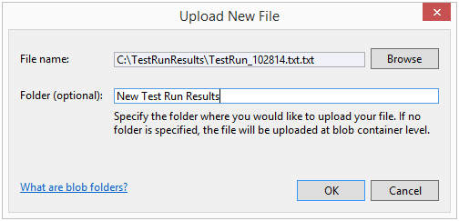
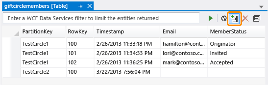

<properties
   pageTitle="Navegação e gerenciamento de recursos de armazenamento com Server Explorer | Microsoft Azure"
   description="Navegação e gerenciamento de recursos de armazenamento com Server Explorer"
   services="visual-studio-online"
   documentationCenter="na"
   authors="TomArcher"
   manager="douge"
   editor="" />
<tags
   ms.service="storage"
   ms.devlang="multiple"
   ms.topic="article"
   ms.tgt_pltfrm="na"
   ms.workload="na"
   ms.date="07/18/2016"
   ms.author="tarcher" />

# Navegação e gerenciamento de recursos de armazenamento com Server Explorer

[AZURE.INCLUDE [storage-try-azure-tools](../includes/storage-try-azure-tools.md)]

## Visão geral
Se você instalou as ferramentas do Azure para Microsoft Visual Studio, você pode exibir dados de tabela, fila e blob das suas contas de armazenamento do Azure. O nó de armazenamento do Azure em Server Explorer mostra os dados que estão em sua conta de emulador de armazenamento local e suas outras contas de armazenamento do Azure.

Para exibir o Server Explorer no Visual Studio, na barra de menus, escolha o **modo de exibição**, **Server Explorer**. O nó de armazenamento mostra todas as contas de armazenamento que existem em cada assinatura/certificado Azure que você está conectado. Se sua conta de armazenamento não aparecer, você pode adicioná-la seguindo as instruções [neste tópico](#add-storage-accounts-by-using-server-explorer).

Iniciando no Azure SDK 2.7, você também pode usar o novo Explorer de nuvem para exibir e gerenciar seus recursos Azure. Consulte [Gerenciar recursos do Azure com o Explorador de nuvem](./vs-azure-tools-resources-managing-with-cloud-explorer.md) para obter mais informações.

## Exibir e gerenciar recursos de armazenamento no Visual Studio

Server Explorer automaticamente mostra uma lista de blobs, filas e tabelas em sua conta de emulador de armazenamento. A conta de emulador de armazenamento está listada em Server Explorer sob o nó de armazenamento como o nó de **desenvolvimento** .

Para ver os recursos da conta emulador armazenamento, expanda o nó de **desenvolvimento** . Se o emulador de armazenamento não foi iniciado quando você expanda o nó de **desenvolvimento** , ele iniciará automaticamente. Isso pode levar alguns segundos. Você pode continuar a trabalhar em outras áreas do Visual Studio, enquanto o emulador de armazenamento é iniciado.

Para exibir recursos em uma conta de armazenamento, expanda o nó da conta de armazenamento no Server Explorer. Os seguintes nós sub aparecem:

- BLOBs

- Filas

- Tabelas

## Trabalhar com recursos de Blob

O nó de Blobs exibe uma lista de contêineres para a conta de armazenamento selecionado. Contêineres de blob contêm blob arquivos, e você pode organizar esses blobs em pastas e subpastas. Veja [como usar o armazenamento de Blob do .NET](./storage/storage-dotnet-how-to-use-blobs.md) para obter mais informações.

### Para criar um contêiner de blob

1. Abrir o menu de atalho para o nó de **Blobs** e escolha **Criar contêiner de Blob**.

1. Insira o nome do novo contêiner na caixa de diálogo **Criar contêiner de Blob** e escolha **Okey**

    >[AZURE.NOTE] O nome do contêiner de blob deve começar com um número (0 a 9) ou uma letra (a-z).

### Para excluir um contêiner de blob

- Abra o menu de atalho para o contêiner de blob que você deseja remover e escolha **Excluir**.

### Para exibir uma lista dos itens contidos em um contêiner de blob

- Abrir o menu de atalho para um nome de contêiner de blob na lista e, em seguida, escolha **Contêiner de Blob do modo de exibição**.

    Quando você vê o conteúdo de um contêiner de blob, ele aparece em uma guia conhecida como o modo de exibição do contêiner de blob.

    

    Você pode executar as seguintes operações blobs usando os botões no canto superior direito do modo de exibição de contêiner blob:

    - Insira um valor de filtro e aplicá-lo

    - Atualizar a lista de blobs no contêiner

    - Carregar um arquivo

    - Excluir um blob

      >[AZURE.NOTE] Excluir um arquivo de um contêiner de blob não exclui o arquivo subjacente; ele só removerá o contêiner de blob.

    - Abrir um blob

    - Salvar um blob no computador local

### Para criar uma pasta ou uma subpasta em um contêiner de blob

1. Escolha o contêiner de blob no Server Explorer. Na janela do contêiner, escolha o botão **Carregar Blob** .

    

1. Na caixa de diálogo **Carregar novo arquivo** , escolha o botão **Procurar** para especificar o arquivo que você deseja carregar e, em seguida, insira um nome de pasta na caixa **pasta (opcional)** .

    Você pode adicionar subpastas em pastas de contêiner seguindo o mesmo procedimento. Se você não especificar um nome de pasta, o arquivo será carregado para o nível superior do contêiner blob. O arquivo aparece na pasta especificada no contêiner.

    

1. Clique duas vezes na pasta ou pressione ENTER para ver o conteúdo da pasta. Quando você estiver na pasta do contêiner, você pode navegar para a raiz do contêiner, escolhendo o botão **Abrir pasta pai** (seta para cima).

### Para excluir uma pasta de contêiner

 - Excluir todos os arquivos na pasta

    >[AZURE.NOTE] Porque pastas em contêineres de blob são pastas virtuais, você não pode criar uma pasta vazia, nem pode excluir uma pasta para excluir o conteúdo do arquivo. Você precisa excluir todo o conteúdo de uma pasta para excluir a pasta.

### Para filtrar blobs em um contêiner

Você pode filtrar as bolhas que são exibidas, especificando um prefixo comum.

Por exemplo, se você inserir o prefixo `hello` no texto filtro caixa e escolha **Executar** (**!**) botão, somente as bolhas que começam com 'hello' aparecerá.

>[AZURE.NOTE] O campo de filtro diferencia maiusculas de minúsculas e não oferece suporte à filtragem com caracteres curinga. BLOBs só podem ser filtradas por prefixo. O prefixo pode incluir um delimitador se você estiver usando um delimitador organizar blobs em uma hierarquia virtual. Por exemplo, filtrando o prefixo HelloFabric / retorna todos os blobs começando com essa cadeia de caracteres.

### Baixar dados blob

- No **Server Explorer**, abrir o menu de atalho para um ou mais blobs e, em seguida, escolha **Abrir**, ou escolha o nome de blob e, em seguida, escolha o botão **Abrir** ou duas vezes no nome de blob.

    O andamento de um download de blob é exibida na janela do **Log de atividade do Azure** .

    O blob é aberta no editor padrão desse tipo de arquivo. Se o sistema operacional reconhece o tipo de arquivo, o arquivo é aberto em um aplicativo instalado localmente; Caso contrário, você será solicitado a escolher um aplicativo apropriado para o tipo de arquivo do blob. O arquivo local que é criado quando você baixar um blob está marcado como somente leitura.

    Dados de blob são armazenados em cache localmente e comparados hora da última modificação do blob no serviço Blob. Se o blob foi atualizado desde que ele foi baixado pela última vez, ele será baixado novamente; Caso contrário, o blob será carregado do disco local. Por padrão, um blob é baixado para um diretório temporário. Para baixar blobs para uma pasta específica, abra o menu de atalho para os nomes de blob selecionado e escolha **Salvar como**. Quando você salva um blob dessa maneira, o arquivo de blob não é aberto e o arquivo local é criado com os atributos de leitura e gravação.

### Para carregar blobs

- Escolha o botão de **Carregar Blob** quando o contêiner estiver aberto para exibição no modo de exibição de contêiner blob.

    Você pode escolher um ou mais arquivos para carregar, e você pode carregar arquivos de qualquer tipo. O **Log de atividade do Azure** mostra o andamento do carregamento. Para obter mais informações sobre como trabalhar com dados de blob, veja [como usar o serviço de armazenamento de Blob do Azure no .NET](http://go.microsoft.com/fwlink/p/?LinkId=267911).

### Para exibir logs transferidas para blobs

- Se você estiver usando o diagnóstico do Azure para log de dados em seu aplicativo do Azure e você transferiu logs para sua conta de armazenamento, você verá os contêineres que foram criados pelos Azure desses logs. Exibindo esses logs no Server Explorer é uma maneira fácil de identificar problemas com seu aplicativo, especialmente se foi implantado no Azure. Para obter mais informações sobre o diagnóstico do Azure, consulte [Coletar dados de registro em log pelo usando o diagnóstico do Azure](https://msdn.microsoft.com/library/azure/gg433048.aspx).

### Para obter a URL para um blob

- Abrir o menu de atalho do blob e escolha **Copiar URL**.

### Para editar um blob

- Selecione o blob e, em seguida, escolha o botão de **Blob aberto** .

    O arquivo é baixado para um local temporário e aberto no computador local. Você deve carregar o blob novamente após fazer alterações.

## Trabalhar com recursos de fila

Filas de serviços de armazenamento são hospedadas em uma conta de armazenamento do Azure e você pode usá-los para permitir que sua nuvem funções de serviço para se comunicar com os outros e com outros serviços por uma mensagem mecanismo de passagem. Você pode acessar a fila programaticamente através de um serviço de nuvem e em um serviço web para clientes externos. Você também pode acessar a fila diretamente usando Server Explorer no Visual Studio.

Ao desenvolver um serviço de nuvem que usa filas, talvez você queira usar Visual Studio para criar filas e trabalhar com eles interativamente enquanto você desenvolver e testar seu código.

No Explorador de servidor, você pode exibir as filas em uma conta de armazenamento, criar e excluir filas, abrir uma fila para exibir suas mensagens e adicionar mensagens para uma fila. Quando você abre uma fila para visualização, você pode exibir as mensagens individuais, e você pode executar as seguintes ações na fila usando os botões no canto superior esquerdo:

- Atualizar a exibição da fila

- Adicionar uma mensagem à fila

- Retirar a mensagem mais alta.

- Limpar a fila inteira

A imagem a seguir mostra uma fila que contenha duas mensagens.

Para obter mais informações sobre o armazenamento serviços filas, consulte [como: usar o serviço de armazenamento de fila](http://go.microsoft.com/fwlink/?LinkID=264702). Para obter informações sobre o serviço da web para filas de serviços de armazenamento, consulte [Conceitos de serviços de fila](http://go.microsoft.com/fwlink/?LinkId=264788). Para obter informações sobre como enviar mensagens para uma fila de serviços de armazenamento usando o Visual Studio, consulte [Enviar mensagens para uma fila de serviços de armazenamento](https://msdn.microsoft.com/library/azure/jj649344.aspx).

>[AZURE.NOTE] Filas de serviços de armazenamento são diferentes de filas de barramento de serviço. Para obter mais informações sobre filas de barramento de serviço, consulte filas de barramento de serviço, tópicos e assinaturas.

## Trabalhar com recursos de tabela

O serviço de armazenamento de tabela do Azure armazena grandes quantidades de dados estruturados. O serviço é um armazenamento de dados NoSQL que aceita autenticado chamadas de dentro e fora da nuvem Azure. Tabelas do Azure são ideais para armazenar dados estruturados e não-relacionais.

### Para criar uma tabela

1. No Server Explorer, selecione o nó de **tabelas** da conta de armazenamento e, em seguida, escolha **Criar tabela**.

1. Na caixa de diálogo **Criar tabela** , insira um nome para a tabela.

### Para exibir dados de tabela

1. No Server Explorer, abra o nó do **Azure** e abra o nó de **armazenamento** .

1. Abra o nó de conta de armazenamento que você está interessado e abra o nó **tabelas** para ver uma lista de tabelas para a conta de armazenamento.

1. Abrir o menu de atalho para uma tabela e escolha **Exibir tabela**.

    

A tabela é organizada por entidades (mostradas em linhas) e propriedades (mostradas nas colunas). Por exemplo, a ilustração a seguir mostra entidades listadas no **Designer de tabela**:

### Editar dados da tabela

1. No **Designer de tabela**, abra o menu de atalho de uma entidade (uma única linha) ou uma propriedade (uma única célula) e escolha **Editar**.

    

    Entidades em uma única tabela não é necessárias ter o mesmo conjunto de propriedades (colunas). Tenha em mente as seguintes restrições na visualização e edição de dados da tabela.
    - Você não pode exibir ou editar dados binários (byte de tipo, mas você pode armazená-la em uma tabela.

    - Você não pode editar os valores **PartitionKey** ou **RowKey** , como o armazenamento de tabela no Azure não dá suporte a essa operação.

    - Não é possível criar uma propriedade chamada carimbo de hora, serviços de armazenamento do Azure usam uma propriedade com esse nome.

    - Se você inserir um valor DateTime, você deve seguir um formato apropriado para as configurações de região e idioma do seu computador (por exemplo, DD/MM/AAAA HH [AM | PM] para inglês dos EUA).

### Adicionar entidades

1. No **Designer de tabela**, escolha o botão **Adicionar entidade** , que é próximo ao canto superior direito do modo de exibição de tabela.

    

1. Na caixa de diálogo **Adicionar entidade** , insira os valores das propriedades **PartitionKey** e **RowKey** .

    

    Insira os valores cuidadosamente porque você não pode alterá-los depois que você fechar a caixa de diálogo, a menos que você exclua a entidade e adicioná-lo novamente.

### Para filtrar entidades

Você pode personalizar o conjunto de entidades que aparecem em uma tabela, se você usar o construtor de consultas.

1. Para abrir o construtor de consultas, abra uma tabela para exibição.

1. Escolha o botão mais à direita na barra de ferramentas do modo de exibição de tabela.

    A caixa de diálogo **Construtor de consultas** aparece. A ilustração a seguir mostra uma consulta que está sendo criada no construtor de consultas.

    

1. Quando você terminar de criar a consulta, feche a caixa de diálogo. O formulário de texto resultante da consulta aparece em uma caixa de texto como um filtro de WCF Data Services.

1. Para executar a consulta, escolha o ícone de triângulo verde.

    Você também pode filtrar dados de entidade que aparece no **Designer de tabela** se você inserir uma cadeia de caracteres de filtro de WCF Data Services diretamente no campo de filtro. Esse tipo de cadeia de caracteres é semelhante a uma cláusula SQL WHERE, mas é enviado para o servidor como uma solicitação HTTP. Para obter informações sobre como construir sequências de filtro, consulte [Construindo cadeias de caracteres de filtro para o Designer de tabela](https://msdn.microsoft.com/library/azure/ff683669.aspx).

    A ilustração a seguir mostra um exemplo de uma cadeia de caracteres de filtro válido:

    

### Atualizar dados de armazenamento

Quando Server Explorer se conecta ao ou obtém dados de uma conta de armazenamento, ele pode levar um minuto para que a operação seja concluída. Se não conseguir se conectar, a operação poderão expirar. Enquanto os dados são recuperados, você pode continuar a trabalhar em outras partes do Visual Studio. Para cancelar a operação se ele estiver demorando muito, escolha o botão **Parar atualização** na barra de ferramentas Server Explorer.

#### Atualizar dados de contêiner de blob

- Selecione o nó **Blobs** abaixo de **armazenamento** e escolha o botão **Atualizar** na barra de ferramentas Server Explorer.

- Para atualizar a lista de blobs que é exibida, escolha o botão **Executar** .

#### Para atualizar dados de tabela

- Selecione o nó **tabelas** abaixo de **armazenamento** e escolha o botão de **atualização** .

- Para atualizar a lista de entidades que é exibida no **Designer de tabela**, escolha o botão **Executar** no **Designer de tabela**.

#### Atualizar os dados de fila

- Selecione o nó **filas** e, em seguida, escolha o botão **Atualizar** .

#### Para atualizar todos os itens em uma conta de armazenamento

- Escolha o nome da conta e, em seguida, escolha o botão **Atualizar** na barra de ferramentas para Server Explorer.

### Adicionar contas de armazenamento usando Server Explorer

Há duas maneiras de adicionar contas de armazenamento usando Server Explorer. Você pode criar uma nova conta de armazenamento em sua assinatura do Azure, ou você pode anexar uma conta existente do armazenamento.

#### Para criar uma nova conta de armazenamento usando Server Explorer

1. No Server Explorer, abra o menu de atalho para o nó de armazenamento e escolha Criar conta de armazenamento.

    

1. Selecione ou insira as seguintes informações para a nova conta de armazenamento na caixa de diálogo **Criar conta de armazenamento** .

    - A assinatura do Azure ao qual você deseja adicionar a conta de armazenamento.

    - O nome que você deseja usar para a nova conta de armazenamento.

    - A região ou grupo de afinidade (como Oeste EUA ou da Ásia Oriental).

    - O tipo de replicação que você deseja usar para a conta de armazenamento, como localização geográfica redundantes.

1. Escolha **criar**.

    A nova conta de armazenamento aparece na lista de **armazenamento** no Solution Explorer.

#### Para anexar uma conta existente do armazenamento usando Server Explorer

1. No Server Explorer, abra o menu de atalho para o nó de armazenamento do Azure e escolha **Anexar armazenamento externo**.

    

1. Selecione ou insira as seguintes informações para a nova conta de armazenamento na caixa de diálogo **Criar conta de armazenamento** .

    - O nome da conta de armazenamento existente que você deseja anexar. Você pode inserir um nome ou selecione-o na lista.

    - A chave da conta de armazenamento selecionado. Esse valor normalmente é fornecido para você quando você selecionar uma conta de armazenamento. Se você quiser Visual Studio lembrar a chave da conta de armazenamento, marque a caixa de chave de conta de lembrar.

    - O protocolo usar para conectar-se para a conta de armazenamento, como HTTP, HTTPS ou um ponto de extremidade personalizado. Veja [como configurar cadeias de caracteres de Conexão](https://msdn.microsoft.com/library/azure/ee758697.aspx) para obter mais informações sobre pontos de extremidade personalizados.

### Para exibir os pontos de extremidade secundários

- Se você criou uma conta de armazenamento usando a opção de replicação **Redundantes de localização geográfica do acesso de leitura** , você pode exibir seus pontos de extremidade secundários. Abra o menu de atalho para o nome da conta e, em seguida, escolha **Propriedades**.

    

### Para remover uma conta de armazenamento do Server Explorer

- No Server Explorer, abra o menu de atalho para o nome da conta e, em seguida, escolha **Excluir**. Se você excluir uma conta de armazenamento, qualquer informação de chave salva dessa conta também será removida.

    >[AZURE.NOTE] Se você excluir uma conta de armazenamento do Server Explorer, ele não afeta a sua conta de armazenamento ou quaisquer dados que ele contém; ele simplesmente remove a referência Server Explorer. Para excluir permanentemente uma conta de armazenamento, use o [Azure portal clássico](http://go.microsoft.com/fwlink/?LinkID=213885).

## Próximas etapas

Para saber que mais sobre como usam os serviços de armazenamento do Azure, consulte [acessar os serviços de armazenamento do Azure](https://msdn.microsoft.com/library/azure/ee405490.aspx).
