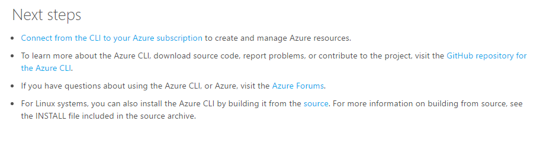

# Critérios de qualidade de solicitação de recepção revisar

Estes critérios destinam-se para autores que criam e mantêm artigos técnicos e revisores de solicitação de recepção que revisar solicitações de recepção de conteúdo. Se sua solicitação de recepção não está qualificada para [mesclagem automática](contributor-guide-pull-request-etiquette.md#in-a-hurry-submit-prs-that-can-be-accepted-automatically), ele será revisado por um revisor de solicitação de recepção humanos. Revisores de solicitação de recepção geralmente revisar somente o que é novas ou alteradas. Revisores de solicitação de recepção avaliam as alterações em uma solicitação de recepção acordo com os itens de revisão de qualidade bloqueio e desbloqueado listados neste artigo.

## Bloqueando itens de qualidade de conteúdo

As atualizações na solicitação de recepção devem ser compatível com os seguintes critérios a serem mescladas. Revisores de solicitação de recepção fornecem comentários sobre os comentários de solicitação de recepção para esses itens e tipo `#hold-off` na solicitação de recepção para retorná-lo para você (o autor) com comentários.

| Categoria | Item de revisão de qualidade |
|----------|---------------------|
|Pré-requisitos| A "prontos para mesclagem" e os rótulos "validação bem-sucedida" recebem a pr|
|Pré-requisitos| A solicitação de recepção não pode ser bloqueada por um conflito de mesclagem.|
|Integridade de repo|    Solicitação de recepção contém sem perdas conteúdas óbvias.|
|Integridade de repo|    Solicitação de recepção não inclui um repo inserido ou quaisquer arquivos incomuns, estranhos.|
|Integridade de repo |Solicitação de recepção contém menos de 100 arquivos alterados, a menos que a PR intencionalmente está atualizando uma ramificação de lançamento do mestre. (Na realidade, um PR deve conter menos distante daquela, mas após 100 arquivos alterados, GitHub não exibe as comparações).|
|Nomeando |Nomes de arquivo para novos arquivos seguem as [diretrizes de nomenclatura de arquivo](file-names-and-locations.md).|
|Nomeando |Novas pastas introduzida em acompanhar repo as [diretrizes de nomenclatura de pasta](file-names-and-locations.md#folder-names-in-the-repo).|
|Conteúdo    |O artigo é um documento técnico e, portanto, no canal de conteúdo correto. Consulte o [o que vai onde orientações](content-channel-guidance.md).|
|Conteúdo    |O assunto do documento técnico é apropriado para um artigo técnico. Consulte o [o que vai onde orientações](content-channel-guidance.md).|
|Conteúdo    |O artigo contém um parágrafo introdutório e um procedimento ou conceitual corpo de conteúdo. O artigo precisa conter conteúdo concluído suficiente para espera sua própria como um artigo. Ele não deve ser um pequeno fragmento de informações. (Exceção: um tópico de "Limites" se estiver no contexto de um artigo grande que lista todos os limites de um serviço.)|
|Conteúdo| Elementos que devem ser listas numeradas são numerados, elementos que devem ser não ordenados listas com marcadores. Isso é usabilidade básica.|
|Conteúdo| Gráficos de novas ou incomuns, arquitetura de informações ou estruturas ou designs óbvios não padrão precisam ser verificada com o revisor de PR de cliente potencial. Equipes que estão fazendo experiências com novas coisas precisam ter um plano ou tela de problema/solução no lugar para avaliar experiências.|
|Funcionalidade de design/site| Switchers são usadas apenas para alternar entre várias versões do mesmo artigo.|
|Funcionalidade de design/site| Os títulos dos artigos switchered contêm informações que diferencia cada artigo dos outros artigos no conjunto de switchered.|
|Funcionalidade de design/site| Sumários criados manualmente não são permitidos. O artigo deve contar com H2s seu sumário na página.|
|Funcionalidade de design/site| Se os títulos H2 estiverem presentes, o artigo contém pelo menos dois títulos de H2. Usando um título de H2 cria um único item artigo Sumário. Títulos de h2 devem ser usados antes cabeçalhos H3 para garantir que um Sumário será criado.|
|Redução| HTML: Conteúdo de origem não contém HTML no nível de bloco – secundária embutida HTML é permitido – como sobrescrito, subscrito, caracteres especiais e outras coisas secundárias que você não pode fazer com redução. Tabelas HTML são permitidas somente se a tabela contém listas numeradas ou com marcadores, mas que geralmente é uma indicação que o conteúdo precisa ser simplificada para que a fonte pode ser codificada em redução.|
|Redução   |Elementos de redução personalizados são usados onde apropriado. Ex: Anotações são codificadas usando o AZURE. Observe a extensão, não como texto sem formatação.|
|SEO    |A "& #124; Identificador de site do Microsoft Azure"é necessário|
|SEO    |O título de H1 contém informações suficientes para descrever o conteúdo do artigo, para diferenciá-lo de outros artigos Azure e para mapear para palavras-chave cliente provável. Por exemplo, "Visão geral" como o título de H1 é uma falha.|
|Terminologia| O uso da acrônimo ARM, V1 ou V2 como referências para o clássico e modelos de implantação do Gerenciador de recursos é um item de terminologia bloqueio.|
|Imagens |GIFs animados não são aceitos para o repo.|
|Imagens | Imagens tem resolução clara, são gratuitas de palavras com erros ortográficos e não contenham nenhuma informação particular | 
|Preparação|A visualização de artigo deve ser limpa no teste. Ele não pode conter qualquer problema de formatação óbvio:   -Uma lista numerada ou com marcador que aparece como um parágrafo   -Código em um bloco de código que aparecem parcialmente no bloco de código e parcialmente fora dele  -Etapas numeradas numeradas incorretamente devido a recuo com defeito|

## Sem bloqueios itens de qualidade de conteúdo

Para esses itens, revisores de solicitação de recepção fornecem comentários e instruções para o autor acompanhar correções em uma solicitação de recepção posterior. No entanto, esse comentário não bloqueia a decisão de mesclagem. Autores devem acompanhar em 3 dias úteis com correções.

| Categoria | Item de revisão de qualidade |
|----------|---------------------|
|Conteúdo|Artigos devem ter um "próximas etapas" na extremidade com 1-3 relevantes e atraentes próximas etapas. Texto breve deve ser incluído que ajuda o cliente a compreender por que as próximas etapas são relevantes. (Somente artigos novo). Exemplo: <https://azure.microsoft.com/en-us/documentation/articles/xplat-cli-install/> |
|Conteúdo|Ortografia, gramática e outros problemas de escrita - revisores de solicitação de recepção podem fornecer comentários sobre alguns problemas secundárias comentários como desbloqueado. Se houver mais de alguns problemas editoriais, revisores efetue uma solicitação de edição para o artigo para uma edição de publicação POST.|
|Imagens|Imagens usam o estilo de texto explicativo correto e a cor e o estilo de borda e de espaço reservado correto de usar capturas de tela. [Consulte o guia de imagem](https://github.com/Azure/azure-content/blob/master/contributor-guide/create-images-markdown.md).|
|Imagens|Imagens incluem texto alt. [Consulte o guia de imagem](https://github.com/Azure/azure-content/blob/master/contributor-guide/create-images-markdown.md).|
|Funcionalidade de design/site|Os títulos de H2 quando processada no Sumário na página, ideal devem ser ajustado para não mais de 2 linhas. Mais títulos dificultar o artigo Sumário digitalizar.|
|Convenções de estilo|Todos os títulos e cabeçalhos são caso de frase, por estilo Azure.|
|Processo|Se a solicitação de recepção poderia facilmente foi reconfigurar para beneficiar PRmerger automação, revisores de solicitação de recepção fornecem comentários para o autor sobre como usar ramificações para que as alterações podem ser mescladas automaticamente. Consulte [o artigo de etiqueta PR](https://github.com/Azure/azure-content/blob/master/contributor-guide/contributor-guide-pull-request-etiquette.md#in-a-hurry-submit-prs-that-can-be-accepted-automatically).|
|Processo|Quando você excluir ou renomear um artigo, verifique se que você seguir o processo. Retire solicitação revisores devem adicionar o comentário e o link a seguir em um comentário:  *Verifique se você seguiu o processo guia dos colaboradores para excluir artigos: <https://github.com/Azure/azure-content/blob/master/contributor-guide/retire-or-rename-an-article.md> .*|

## Relacionados

- [Etiqueta de solicitação de recepção e práticas recomendadas para colaboradores da Microsoft](contributor-guide-pull-request-etiquette.md)

- [Retirar automação de comentário de solicitação](contributor-guide-pull-request-comments.md)
